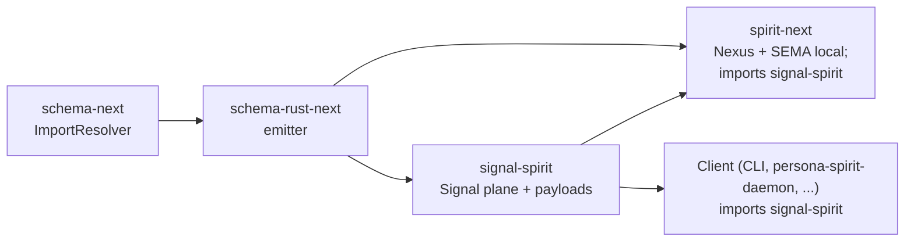
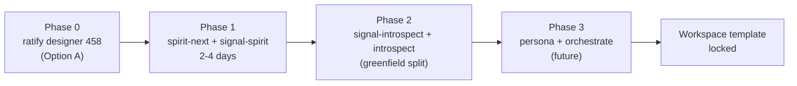

; designer
[contract-repo signal-interface pipeline-split daemon-imports nexus-sema-local overview synthesis no-substrate-changes mechanical-migration]
[Orchestrator synthesis of designer 475.1 sub-agent's contract-repo fork proposal. Headline finding: bypass verified; substrate is READY (schema-next already supports cross-schema imports; schema-rust-next already emits cross-repo pub use). Migration is purely mechanical (schema source surgery + Cargo wiring + ~30-40 use-edits) at 2-4 operator days for spirit-next + signal-spirit pilot. Per-component sequencing across spirit + introspect + persona + orchestrate; connections to Spirit 1422 (this) + 1419 (programmatic triad) + 458 (naming gate now more urgent) + 469 (introspect adapts) + 463 gap B (closes naturally) + 1396 (Help action fragmentation open question). Five ratification asks consolidated.]
2026-06-02
designer

# 475.2 — Overview synthesis

## TL;DR

Spirit 1422's contract-repo split mandate (Signal interfaces in `signal-<component>`; Nexus + SEMA in daemon) lands as a **purely mechanical migration** — schema-next already supports cross-schema imports (`ImportResolver` + `DEP_<CRATE>_SCHEMA_DIR`); schema-rust-next already emits `pub use <crate>::schema::<module>::<Type>` for resolved imports. **No substrate changes required**. The bypass was a pilot-stage convenience; the workspace substrate has been ready for the split for some time.

Pilot cost: **2-4 operator days for spirit-next + signal-spirit**. Migration shape: spirit-next's `schema/lib.schema` retains Nexus + SEMA + daemon-only types; Signal Input/Output declarations + client-facing payloads (Entry, Query, ObservedRecords, SemaReceipt, RemoveReceipt, CountedRecords, ErrorReport, SignalRejection, DatabaseMarker) move to a new `signal-spirit/schema/lib.schema`. ~30-40 `use crate::Input` → `use signal_spirit::Input` edits in spirit-next.

Five ratification asks consolidated below; one open architectural question (Help action aggregation across the split).

## Section 1 — Headline findings from 475.1

The sub-agent verified the bypass + recommended the split shape:

**Bypass verification** (definitive):
- spirit-next main HEAD `7c35067`: `schema/lib.schema` declares all four planes inside the daemon repo.
- spirit-next Cargo.toml: ZERO dependency on signal-spirit (grep-confirmed).
- signal-spirit HEAD `061815f`: `schema/signal-spirit.schema` carries a STALE single-operation scaffold `(Record Entry)`/`(RecordAccepted RecordIdentifier)` that the daemon does not consume.
- core-signal-spirit HEAD `bcd2d61`: 14-line placeholder, no build.rs.

**The substrate is READY** (this is the unexpected finding):
- `schema-next/src/resolution.rs` has `ImportResolver` + `DEP_<CRATE>_SCHEMA_DIR` cross-schema-import support; fully test-witnessed by `marker-core` / `import-consumer` fixture in `tests/resolution.rs`.
- `schema-rust-next` already emits `pub use <crate>::schema::<module>::<Type> as <LocalName>;` for resolved imports.

This means the workspace's schema substrate has been ready for the contract-repo split for some time. The pilot just hadn't exercised it.

**Recommended split shape (concrete)**:

spirit-next `schema/lib.schema` retains:
- NexusInput / NexusOutput (daemon-internal routing decisions).
- SemaWriteInput / SemaWriteOutput / SemaReadInput / SemaReadOutput (daemon-local durable state contract).
- Daemon-only types: mail ledger nouns, OriginRoute, DatabaseMarker (TBD — could go either way; see Section 2).

`signal-spirit/schema/lib.schema` (new):
- Signal Input / Output (client-facing wire contract).
- Client-facing payloads: Entry, Query, ObservedRecords, SemaReceipt, RemoveReceipt, FoundRecord, CountedRecords, ErrorReport, SignalRejection, DatabaseMarker.

spirit-next import: `signal-spirit:lib:Input` single-colon namespace. Build script: `ImportResolver::with_dependency("signal-spirit", env!("DEP_SIGNAL_SPIRIT_SCHEMA_DIR"), "0.5.0-pre")` using Cargo's `links` mechanism. Runtime crate re-exports: `pub use signal_spirit::Input;` etc.

**Migration cost**: 2-4 operator days for spirit-next + signal-spirit pilot. Mechanical work: schema-source surgery + Cargo wiring + ~30-40 source-code use-edits. No substrate changes.

## Section 2 — DatabaseMarker placement (a subtle design question)

The split as recommended puts `DatabaseMarker` in signal-spirit (client-facing). But DatabaseMarker carries `commit_sequence` + `state_digest` — both produced BY the daemon's SEMA store. The signal-spirit consumer cares about it (every SemaReceipt + ObservedRecords + ErrorReport carries one), but its semantics are daemon-defined.

Two readings:
- (a) **Client-facing**: DatabaseMarker is a wire-protocol value the client receives + can echo in subsequent requests; lives in signal-spirit.
- (b) **Daemon-defined**: DatabaseMarker is a daemon-internal commit + content hash; lives in spirit-next.

Recommendation: **(a) signal-spirit** — DatabaseMarker is part of the wire protocol every reply carries; clients need to deserialize it. The daemon-internal SEMA marker construction (via `Store::database_marker()`) stays in spirit-next as the algorithm that fills the typed contract.

This is a general pattern: typed values that the daemon produces but the wire carries go in the Signal contract; the construction algorithm stays in the daemon impl.

## Section 3 — Build dependency graph

Five nodes. The asymmetry: signal-spirit gets emitted by schema-rust-next AND consumed by spirit-next (which is also emitted by schema-rust-next). This is the cross-repo imported-Rust-types shape schema-rust-next already supports.

## Section 4 — Connections to active design surface

### Spirit 1422 + 1419 compose

Spirit 1422 (Decision Maximum, this proposal) names WHERE the code lives across repos. Spirit 1419 (operator's Decision High, captured today) names HOW the daemon main shrinks via macro-generated runtime substrate. Together: each component triad is `signal-<component>` + `<component>` (daemon with NEXUS + SEMA) + macro-shrunken `main`. The workspace template is now fully specified.

### Designer 458 naming gate becomes more urgent

The contract repo's NAME is canonical pipeline input — `use signal_spirit::Input` (Option A) vs `use meta_signal_spirit::Input` (Option B fleet-wide rename). Phase 0 spirit fold blocked on 458 ratification AND the contract-repo migration (which uses the post-naming-gate name) blocked on 458 too. Recommend ratifying 458 BEFORE the contract-repo migration starts. The pending recommendation: Option A (`owner-signal-spirit`).

### Designer 463 gap B closes naturally

Gap B (testing-instrumentation triad placement) said: trace nouns + traits in signal-<component>; trace transport in daemon; trace policy in owner-signal-<component>. With the contract-repo split landing, gap B is mechanical — `SignalObjectName` lives in signal-spirit; `TraceObjectName` wrapper + `TraceInterfaceObject` / `TraceActorObject` aggregating across all three planes need a canonical home. Two options: aggregate in signal-spirit (client-facing trace) or daemon (daemon-internal). Sub-agent flagged this as Open Question §5.

### Designer 469 introspect adapts from inception

Introspect's new component (Spirit 1398) follows the contract-repo split from inception: `signal-introspect` (the repo EXISTS already, per the workspace inventory) carries Signal Input/Output + payloads; introspect daemon carries Nexus + SEMA. The sub-agent flagged investigating `signal-introspect`'s current state as a follow-up. The split makes introspect's design cleaner — clients of introspect (every spirit-stack component + the CLI) import signal-introspect for the wire contract; introspect daemon carries the routing + SEMA logic.

### Designer 466.3 candidate 5 (Output split for slim Nexus)

The proposed `Output` split into slim ack variants `{ result_handle, count, database_marker }` + Nexus-level `QueryByHandle` lives in signal-spirit (client-facing). The Nexus side-channel `Stash` variant lives in spirit-next (daemon-internal). Clean separation per Spirit 1422.

### Top-6 backlog items 2-6 all benefit

Each of the top-6 items 2-6 (spirit expansion; minimal introspect; Nexus side-channel Maximum; Help action shape; Engine actor promotion) lands more cleanly with the contract-repo split in place. Spirit expansion adds variants to signal-spirit's Input/Output; introspect uses signal-introspect; Nexus side-channel variants stay in daemon; Help action's open question (Section 5 below) gets resolved; Engine actor promotion happens entirely in the daemon.

## Section 5 — Open architectural question: Help action aggregation

Spirit 1396 (Decision High): Help action auto-generated per root enum.

With the contract-repo split, Signal Input/Output's Help variants emit into signal-spirit. Nexus + SEMA Help variants emit into spirit-next.

**Two readings**:
- (a) **Client-facing-Help-only**: clients only ever see the Signal-plane Help (since clients only talk to Signal externally). Nexus + SEMA Help vocabulary exists daemon-internally but is not exposed across the wire. introspect serves the broader queryable surface (per designer 469) for daemon-internal vocabulary.
- (b) **Aggregated Help**: a wrapper Help in signal-spirit aggregates references to Nexus + SEMA Help vocabularies so clients can ask "what does the daemon support across all planes?" — at the cost of cross-repo aggregation complexity.

Sub-agent's lean: (a) client-facing-Help-only is right. Designer's lean: agree. The wire surface is the Signal contract; introspect is the queryable surface for daemon-internal vocabulary; clean separation.

**Open question for psyche**: ratify (a) — client-facing-Help-only on Signal contracts; introspect serves broader vocabulary queries?

## Section 6 — Recommended operator integration order

Five nodes.

**Phase 0**: ratify designer 458 (Option A `owner-signal-spirit`). Single yes/no. Unblocks the contract repo name everywhere.

**Phase 1**: spirit-next + signal-spirit pilot (2-4 days). Operator-owned. The pilot proves the substrate works end-to-end. Tests assert: schema source surgery + Cargo wiring + Rust use-edits don't break any existing spirit-next tests; the resulting binary functions identically; signal-spirit is now a real consumed contract crate.

**Phase 2**: signal-introspect + introspect (greenfield per designer 469 minimal scope). Per the contract-repo split from inception. Likely operator-owned with designer collaboration on the schema source.

**Phase 3**: persona + orchestrate (future). Same pattern. Long after the spirit + introspect pilots prove the workspace template.

## Section 7 — Ratification asks consolidated

This synthesis surfaces 5 distinct ratification asks:

1. **Spirit 1422 itself** (Decision Maximum, captured today) — the contract-repo split mandate. Already captured; no psyche action needed unless you want to refine the magnitude or wording.

2. **Designer 458 spirit-triad naming gate** (carries forward) — ratify Option A (`owner-signal-spirit`). Single yes/no. **Becomes urgent now** because the contract repo's name is canonical pipeline input.

3. **DatabaseMarker placement** (Section 2 above) — confirm (a) signal-spirit (client-facing wire protocol) vs (b) spirit-next (daemon-internal construction). Designer lean: (a) signal-spirit.

4. **Help action aggregation** (Section 5 above) — confirm (a) client-facing-Help-only on Signal contracts vs (b) aggregated Help in signal-spirit referencing daemon-internal vocabularies. Designer lean: (a) client-facing-only; introspect serves broader vocabulary queries.

5. **Phase 1 scope confirmation** — pilot spirit-next + signal-spirit at 2-4 day operator scope before fanning out to introspect + persona + orchestrate? Or push introspect's greenfield split in parallel since it's new (no migration cost)?

## Section 8 — Tangential: corruption issue flagged by 475.1

The sub-agent flagged a local git tree corruption (`f46e9b1e` with duplicate entries that was part of the local `d75190f3` reports tree). They bypassed it by resetting to origin/main first; did NOT touch operator's main commit. May be the source of the earlier "nothing added to commit" weirdness on the frame file (the frame ended up in operator's `d75190f3` commit somehow). Worth flagging to operator for their next git housekeeping; not blocking.

## Cross-references

- `reports/designer/475-contract-repo-pipeline-situation-and-proposal-2026-06-02/0-frame-and-method.md` — the meta-report frame.
- `reports/designer/475-contract-repo-pipeline-situation-and-proposal-2026-06-02/1-fork-proposal.md` — sub-agent's per-repo fork proposal with full migration detail.
- `reports/designer/458-spirit-triad-naming-gate-decision-2026-06-01.md` — pending ratification now more urgent.
- `reports/designer/463-operator-trace-implementation-audit-and-intent-gaps-2026-06-01.md` — gap B (trace placement) closes naturally.
- `reports/designer/466-triad-engine-honesty-situation-2026-06-01/3-overview.md` — candidate 5 Output split lands per the split.
- `reports/designer/469-introspect-component-design-2026-06-02.md` — introspect follows the split from inception.
- `reports/designer/470-psyche-backlog-top-6-visual-2026-06-02.md` — top-6 items 2-6 all benefit from the split.
- `reports/operator/281-generated-interface-logic-with-macros-2026-06-02.md` — current schema source content.
- Spirit records 1326-1422 — captured intent surface this overview synthesizes against.
- `skills/component-triad.md` §"Runtime triad engine traits" — the workspace pattern Spirit 1422 extends.

## For the orchestrator (chat paraphrase)

Headline: substrate already supports cross-schema imports (schema-next ImportResolver + schema-rust-next pub-use emission); migration is purely mechanical. Pilot 2-4 operator days for spirit-next + signal-spirit. Five ratification asks: 1422 capture-only (no psyche action); 458 spirit-triad naming gate now urgent (Option A); DatabaseMarker placement (signal-spirit recommended); Help action aggregation (client-facing-only recommended); Phase 1 scope confirmation. Designer 463 gap B closes naturally; designer 469 introspect adapts from inception; Spirit 1419 + 1422 compose the workspace template. Tangential: 475.1 sub-agent flagged local git tree corruption in operator's `d75190f3` commit — bypassed without touching operator's main, worth flagging for next git housekeeping.
