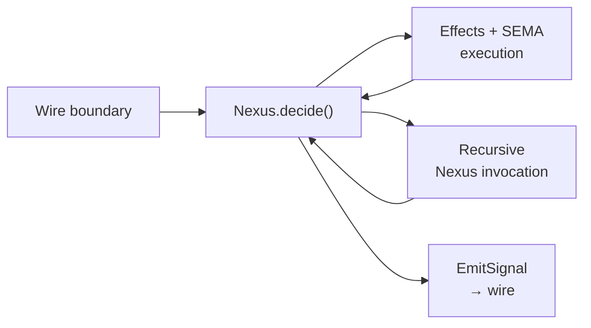

; designer
[nexus re-agglomeration three-angles code-shape information-flow schema-composition recursive-nexus input-output-asymmetry universal-computation-destination]
[Re-agglomeration of the Nexus topic across designer 476 + operator 281 + designer 466.3/468/469 + Spirit captures 1326-1439. Operator's correction 1438 (Nexus input/output asymmetry) is central — NexusInput carries facts/replies/events Nexus decides FROM; NexusOutput carries commands Nexus emits NEXT. Operator's 1439 (recursive Nexus as universal computation destination) extends the architecture: anything needing more computation re-enters Nexus wrapped in a Nexus envelope; schemas compose because the Nexus envelope can carry objects from other schema parts. Three angles examined: (A) Code shape — types/traits/recursive envelope; (B) Information flow — input/output asymmetry + runner loop choreography; (C) Schema composition — Nexus<Signal<Input>> as a typed construct + contract-repo split implications.]
2026-06-02
designer

# 477 — Nexus re-agglomeration — three angles

## TL;DR

The Nexus topic has accumulated substance across 8+ reports + 13 Spirit captures in 36 hours. This report re-agglomerates it into a coherent picture with three angles. **The most important refinement** from this iteration: operator's Spirit 1438 Correction High — *"NexusInput is what Nexus receives as facts/replies/events to decide from; NexusOutput is what Nexus commands or emits next"* — makes the input/output asymmetry explicit. Combined with operator's Spirit 1439 (Decision High — recursive Nexus as universal computation destination), the architecture becomes: **anything needing more computation re-enters Nexus**, wrapped in a Nexus envelope; **only `NexusOutput::Signal(Output)` exits to wire**; **schemas compose because the Nexus envelope can carry objects from any other schema part**.

The three angles in this report — Code shape, Information flow, Schema composition — examine the same architecture from complementary perspectives.

## Section 1 — Re-agglomeration

The Nexus topic landed across multiple reports + Spirit captures over the 2026-06-01 to 2026-06-02 window. The active surface:

| Source | Substance |
|---|---|
| Operator 281 §"Generated Trait Surface" + §"Runtime Actors" + §5 "Decision Targets" | Generated NexusEngine trait + per-variant `decide_*` methods + thin current decision (projection). |
| Designer 466.3 §2 "Actor model fit" + §3 "Inner/outer worlds + slim Nexus output" | Engine is hidden-non-actor owner anti-pattern; Nexus has no real decision logic today; Output::RecordsObserved carries full Vec<Entry> violating Spirit 1389. |
| Designer 468 §6 candidate 2 | Nexus needs typed side-channel NexusOutput variants for non-SEMA decisions (originally High). |
| Designer 469 §"IngestTraceEvent decision" | Introspect's Nexus has 3 side-channel variants in ONE decision (Drop / Summarize / Fanout). |
| Designer 470 §"Item 4" | Top-6 backlog: escalate 468 candidate 2 to Maximum. |
| Designer 476 §1-7 (original) | Side-channel variants on NexusOutput; 4-component evidence. |
| Designer 476 §8 (operator's correction) | Wire-path crash issue; typed NexusDecision wraps Signal/SEMA/Effect; only Signal exits; effects re-enter Nexus. |
| Spirit 1326-1336 | Engine-trait architecture (Maximum × multiple). |
| Spirit 1361 | Engine method-count matches wire events. |
| Spirit 1387 | Schema drives most behavior; Rust impl terse. |
| Spirit 1388 | Nexus is inner/outer world boundary. |
| Spirit 1389 | Nexus output slim; clients query for specifics. |
| Spirit 1419 | Programmatic triad + tiny daemon main. |
| Spirit 1422 | Contract-repo split (Signal in contract repo; Nexus + SEMA in daemon). |
| Spirit 1437 | Nexus has schema-defined decision/effect language (refined Maximum). |
| **Spirit 1438** | **NexusInput vs NexusOutput asymmetry — facts/replies INPUT, commands/emits OUTPUT.** |
| **Spirit 1439** | **Nexus as recursive universal computation destination; schemas compose.** |

The 1438 + 1439 pair is the iteration's contribution. 1438 corrects an asymmetry-blindness that crept into earlier framings (including designer 476's §2); 1439 names Nexus as the universal computation destination.

## Section 2 — Operator's correction (Spirit 1438) as central insight

Spirit 1438 (Correction High): *"Nexus input and Nexus output must not be modeled as symmetric lists of the same operation categories. Nexus input is what Nexus receives as facts/replies/events to decide from; Nexus output is what Nexus commands or emits next. If both sides list Signal and SEMA operations in the same-looking way, the interface loses meaning and reads as nonsense."*

The trap the correction names: current spirit-next schema has `NexusInput` and `NexusOutput` carrying symmetric-looking variants:

```nota
NexusInput  [(Signal Input) (SemaWrite SemaWriteOutput) (SemaRead SemaReadOutput)]
NexusOutput [(SemaWrite SemaWriteInput) (SemaRead SemaReadInput) (Signal Output)]
```

The symmetry is real but the SEMANTICS differ:
- `NexusInput::Signal(Input)` = a Signal message arrived as a FACT for Nexus to decide from.
- `NexusInput::SemaWrite(SemaWriteOutput)` = a SEMA write RESULT arrived as a fact (Nexus had previously requested the write; this is its completion).
- `NexusInput::SemaRead(SemaReadOutput)` = a SEMA read RESULT arrived.
- `NexusOutput::Signal(Output)` = a COMMAND to emit to Signal (this is the final wire reply).
- `NexusOutput::SemaWrite(SemaWriteInput)` = a COMMAND to delegate to SEMA.
- `NexusOutput::SemaRead(SemaReadInput)` = a COMMAND to delegate to SEMA.

Both sides DO carry "Signal" and "SEMA" — but on the input side they're FACTS Nexus received; on the output side they're COMMANDS Nexus emits. The current schema framing loses this distinction.

**The correction in shape**: rename or sharpen the variants so the asymmetry is visible in the schema, not just in the type parameter:

```nota
NexusInput [
  (SignalArrived (signal::Input))               ; fact: client message arrived
  (SemaWriteCompleted (sema::WriteOutput))      ; fact: SEMA write completion
  (SemaReadCompleted (sema::ReadOutput))        ; fact: SEMA read completion
  (EffectCompleted EffectResult)                ; fact: effect completion
]

NexusOutput [
  (EmitSignal (signal::Output))                 ; command: reply to client (wire exit)
  (DelegateSemaWrite (sema::WriteInput))        ; command: do this SEMA write
  (DelegateSemaRead (sema::ReadInput))          ; command: do this SEMA read
  (ExecuteEffect NexusEffect)                   ; command: run this effect
  (InvokeNexus NexusSubprocessInput)            ; command: start nested computation
]
```

Now the asymmetry is encoded in the variant names + the role they describe. `SignalArrived` is a fact; `EmitSignal` is a command. They're different concepts even though both reference `signal::*` types.

This makes the runner loop more honest:

```rust
loop {
    let decision = nexus.decide(current_nexus_input);  // NexusInput → NexusOutput
    match decision {
        NexusOutput::EmitSignal(output) => return output,  // EXIT to wire

        NexusOutput::DelegateSemaWrite(input) => {
            let result = sema.apply(input);
            current_nexus_input = NexusInput::SemaWriteCompleted(result);
            continue;  // re-enter Nexus with the completion fact
        }
        NexusOutput::DelegateSemaRead(input) => {
            let result = sema.observe(input);
            current_nexus_input = NexusInput::SemaReadCompleted(result);
            continue;
        }
        NexusOutput::ExecuteEffect(effect) => {
            let result = effects.execute(effect);
            current_nexus_input = NexusInput::EffectCompleted(result);
            continue;
        }
        NexusOutput::InvokeNexus(subinput) => {
            let sub_result = recurse(subinput);  // recursive Nexus call
            current_nexus_input = NexusInput::EffectCompleted(EffectResult::Subprocess(sub_result));
            continue;
        }
    }
}
```

The loop pattern is now obvious: commands go out, facts come back in, Nexus decides, repeat until `EmitSignal` exits.

## Section 3 — Angle A: Code shape

This angle examines what the Nexus interface looks like in code, with focus on the recursive Nexus envelope per Spirit 1439.

### Generic Nexus envelope

Currently spirit-next's emitted code at `src/schema/lib.rs` has:

```rust
pub mod nexus {
    pub struct Nexus<Root> {
        origin_route: OriginRoute,
        root: Root,
    }

    impl<Root> Nexus<Root> {
        pub fn origin_route(&self) -> OriginRoute { self.origin_route }
        pub fn root(&self) -> &Root { &self.root }
        pub fn into_root(self) -> Root { self.root }
    }
}
```

The envelope is generic; `Root` is bounded by `Archive + Serialize + Deserialize`. Today it gets instantiated as `Nexus<NexusInput>` and `Nexus<NexusOutput>`.

### Recursive instantiation per Spirit 1439

With recursive Nexus, the envelope can wrap types from any plane:

```rust
type IncomingFromSignal = Nexus<SignalArrived>;
type IncomingFromSema   = Nexus<SemaWriteCompleted | SemaReadCompleted>;
type IncomingFromEffect = Nexus<EffectCompleted>;
type IncomingFromSubprocess = Nexus<SubprocessCompleted>;

// Outgoing:
type DelegationToSema = Nexus<DelegateSemaWrite | DelegateSemaRead>;
type EffectCommand    = Nexus<ExecuteEffect>;
type SubprocessInvocation = Nexus<InvokeNexus>;  // RECURSIVE — Nexus<Nexus<Inner>>
type WireExit         = Nexus<EmitSignal>;
```

The recursive case is `SubprocessInvocation = Nexus<InvokeNexus>` where `InvokeNexus` carries a `Nexus<Inner>` for the subprocess to start. This nests cleanly because the envelope's `Root` parameter is generic.

### NexusDecision as a sum type over outputs

```rust
pub enum NexusOutput {
    EmitSignal(Output),                        // wire exit
    DelegateSemaWrite(SemaWriteInput),         // SEMA delegation
    DelegateSemaRead(SemaReadInput),           // SEMA delegation
    ExecuteEffect(NexusEffect),                // effect command
    InvokeNexus(Box<Nexus<NexusInvocationInput>>),  // recursive Nexus
}

pub enum NexusEffect {
    Stash(StashRequest),
    Fanout(FanoutRequest),
    Summarize(SummarizeRequest),
    Drop(DropReport),
    Enqueue(EnqueueRequest),
    Preempt(PreemptRequest),
    Cascade(CascadeRequest),
}

pub enum NexusInput {
    SignalArrived(signal::Input),
    SemaWriteCompleted(sema::WriteOutput),
    SemaReadCompleted(sema::ReadOutput),
    EffectCompleted(EffectResult),
    SubprocessCompleted(SubprocessResult),
}
```

The recursion `InvokeNexus(Box<Nexus<NexusInvocationInput>>)` needs the `Box` per Spirit 1358 (recursive variants Box-wrapped automatically by the emitter). The envelope itself is sized; the recursion happens at the `Nexus<X>` parametrization.

### NexusEngine trait

```rust
pub trait NexusEngine {
    /// Per-variant decision dispatch
    fn decide_signal_arrived(&mut self, input: signal::Input, route: OriginRoute)
        -> nexus::Nexus<NexusOutput>;

    fn decide_sema_write_completed(&mut self, result: sema::WriteOutput, route: OriginRoute)
        -> nexus::Nexus<NexusOutput>;

    fn decide_sema_read_completed(&mut self, result: sema::ReadOutput, route: OriginRoute)
        -> nexus::Nexus<NexusOutput>;

    fn decide_effect_completed(&mut self, result: EffectResult, route: OriginRoute)
        -> nexus::Nexus<NexusOutput>;

    fn decide_subprocess_completed(&mut self, result: SubprocessResult, route: OriginRoute)
        -> nexus::Nexus<NexusOutput>;

    /// Default top-level dispatch — emitted by schema-rust-next
    fn decide(&mut self, input: nexus::Nexus<NexusInput>) -> nexus::Nexus<NexusOutput> {
        let route = input.origin_route();
        match input.into_root() {
            NexusInput::SignalArrived(s) => self.decide_signal_arrived(s, route),
            NexusInput::SemaWriteCompleted(r) => self.decide_sema_write_completed(r, route),
            NexusInput::SemaReadCompleted(r) => self.decide_sema_read_completed(r, route),
            NexusInput::EffectCompleted(r) => self.decide_effect_completed(r, route),
            NexusInput::SubprocessCompleted(r) => self.decide_subprocess_completed(r, route),
        }
    }
}
```

Per Spirit 1387 (terse Rust impl): components override only the `decide_*` methods that have non-trivial logic; the rest can default to a trivial pass-through (e.g., `decide_sema_write_completed` for spirit might just continue to `decide` based on what the original request was — tracked via correlation).

## Section 4 — Angle B: Information flow

This angle examines how computation propagates through the recursive Nexus runner, with the input/output asymmetry from Spirit 1438 made visible.

### The runner-loop choreography



Five nodes. The choreography:
1. Client message arrives at wire; Signal admits → wraps as `NexusInput::SignalArrived` → enters Nexus.
2. Nexus decides → emits `NexusOutput::X`.
3. Runner routes by output variant:
   - `EmitSignal` → exits to wire (loop terminates for this request).
   - `DelegateSema*` → runs SEMA → re-enters Nexus as `SemaWriteCompleted` or `SemaReadCompleted`.
   - `ExecuteEffect` → runs effect handler → re-enters Nexus as `EffectCompleted`.
   - `InvokeNexus` → recursive Nexus call → re-enters as `SubprocessCompleted`.
4. Loop continues until `EmitSignal` exits.

### The information asymmetry visible in the loop

INPUT side carries:
- Fresh facts (Signal arrivals from wire).
- Completion facts (SEMA results, effect results, subprocess results).

OUTPUT side carries:
- Commands (delegate to SEMA, run effect, invoke subprocess).
- Final wire output (EmitSignal).

The runner's job: translate commands into facts. SEMA-engine + effect-handlers + recursive Nexus calls all act as command→fact translators. Nexus never executes; it only decides.

### Worked example — spirit's slim observe via Stash + recursion

```text
1. Client: signal::Input::Observe(query)
2. Signal admits → NexusInput::SignalArrived(Observe(query))
3. Nexus.decide_signal_arrived → NexusOutput::DelegateSemaRead(Observe(query))
4. Runner: sema.observe(query) → returns ObservedRecords with 10,000 entries
5. Runner: NexusInput::SemaReadCompleted(ObservedRecords{10k entries})
6. Nexus.decide_sema_read_completed: result is large; needs stashing
   → NexusOutput::ExecuteEffect(NexusEffect::Stash(StashRequest{full: result, handle: h}))
7. Runner: stash to mail ledger; handle h registered
   → NexusInput::EffectCompleted(EffectResult::Stashed(handle: h))
8. Nexus.decide_effect_completed: handle now available
   → NexusOutput::EmitSignal(Output::RecordsObserved(SlimAck{handle: h, count: 10000, marker}))
9. Runner: exit to wire with the slim ack.
```

Six loop iterations. Each fact-command translation is typed. The runner is generic; the per-variant decision logic is the spirit-specific algorithm.

### Worked example — recursive Nexus (subprocess invocation)

Consider introspect's `IngestTraceEvent` with a policy that requires synthesizing a cross-component summary:

```text
1. NexusInput::SignalArrived(IngestTraceEvent(frame))
2. Nexus.decide_signal_arrived:
   → NexusOutput::DelegateSemaRead(PolicyForComponent(frame.component))
3. Runner: sema.observe(policy_query) → policy = Summarize(spec)
4. NexusInput::SemaReadCompleted(policy)
5. Nexus.decide_sema_read_completed: policy says summarize across component-X-events
   → NexusOutput::InvokeNexus(Box::new(Nexus<SubprocessInput::QueryCrossComponentSummary(spec)>))
6. Runner: invokes nested Nexus computation
   → (subprocess runs its own decide loop; eventually emits a summary)
   → NexusInput::SubprocessCompleted(CrossComponentSummary)
7. Nexus.decide_subprocess_completed: synthesis done
   → NexusOutput::DelegateSemaWrite(WriteAggregatedSummary(synthesis))
8. Runner: sema.apply(write) → SemaWriteOutput::Recorded
9. NexusInput::SemaWriteCompleted(receipt)
10. Nexus.decide_sema_write_completed: all done
    → NexusOutput::EmitSignal(Output::TraceEventIngested(IngestionReceipt))
11. Exit to wire.
```

The recursive `InvokeNexus` at step 5 starts a NESTED computation. The nested computation runs its own decide loop, eventually completes, and the parent Nexus continues from where it left off. This is the universal-computation-destination shape from Spirit 1439.

## Section 5 — Angle C: Schema composition

This angle examines how schemas containing each other realize the Spirit 1439 universal computation destination. The contract-repo split (Spirit 1422) + Nexus envelope generic shape compose.

### Cross-repo type references

Per Spirit 1422: Signal types live in `signal-spirit`; Nexus + SEMA types live in `spirit-next` (daemon-internal).

When spirit-next declares `NexusInput::SignalArrived(signal::Input)`, the `signal::Input` is IMPORTED from `signal-spirit` at the schema level:

```nota
; spirit-next/schema/lib.schema:
(import signal-spirit:lib::Input)
(import signal-spirit:lib::Output)
(import signal-spirit:lib::Entry)
; ... etc

NexusInput [
  (SignalArrived signal-spirit:lib::Input)
  (SemaWriteCompleted SemaWriteOutput)         ; local type
  ; ...
]

NexusOutput [
  (EmitSignal signal-spirit:lib::Output)
  ; ...
]
```

Per the 475.1 sub-agent's finding: schema-next already supports cross-schema imports via `ImportResolver` + `DEP_<CRATE>_SCHEMA_DIR`. The composition is mechanical.

### Recursive Nexus across components

The interesting case from Spirit 1439: a Nexus from one component can wrap another component's types.

Consider introspect querying spirit-next:
- introspect's Nexus needs cross-component-summary data; this requires invoking a query against spirit-next.
- introspect emits `NexusOutput::InvokeNexus(Box<Nexus<SpiritQueryInput>>)` where `SpiritQueryInput` is imported from spirit-next's schema.
- The runner makes a cross-process call (binary rkyv socket to spirit-next).
- spirit-next runs its own Nexus computation.
- The result returns to introspect as `NexusInput::SubprocessCompleted(SpiritQueryResult)`.

This requires:
- introspect's schema imports spirit-next's query types.
- Cross-process Nexus invocation has wire-protocol semantics (origin_route propagation across processes; correlation by route).
- The Nexus envelope serializes via rkyv across the boundary; in-process recursion is just function calls.

### Why this works — the typed generic envelope

The Nexus envelope is parameterized:
```rust
pub struct Nexus<Root> { origin_route: OriginRoute, root: Root }
```

When `Root` is local (e.g., `NexusInput`), the envelope is a local Rust struct.
When `Root` is imported (e.g., `signal-spirit::Input`), the envelope still types cleanly because `Root` only needs to satisfy `Archive + Serialize + Deserialize` per rkyv.
When `Root` is recursive (`Nexus<Inner>`), the envelope nests because the bound is satisfied.

The schema composition discipline:
- A component's schema declares which inner types its Nexus envelope can wrap.
- Imported types come with their own emitter-produced Rust bindings.
- Cross-component recursion is wire-protocol-aware (origin_route propagation; rkyv serialization at process boundaries).
- In-process recursion is just function calls within the runner loop.

### Implications for designer 475 (contract-repo split)

The contract-repo split + recursive Nexus + schema composition together mean:
- Each component's `signal-<component>` contract repo declares its Signal vocabulary (the wire boundary).
- Each component's daemon repo declares its Nexus + SEMA + Effect vocabulary.
- Cross-component Nexus invocations require importing the target component's `signal-<component>` types (the wire contract) — not the daemon-internal Nexus types (those stay private).
- The recursive Nexus pattern composes within a daemon (in-process) AND across daemons (wire-bounded by Signal contracts).

This is a clean separation. Daemons don't depend on each other's Nexus internals; they depend on each other's Signal contracts. Cross-component recursion goes through the Signal layer per process boundary.

## Section 6 — Open design questions

### Q1 — Subprocess return semantics

When `NexusOutput::InvokeNexus(...)` runs a subprocess, what does the subprocess return? Two options:
- (a) The subprocess emits a `NexusOutput::EmitSignal(SubprocessResult)` that the parent's runner intercepts (not exiting to wire) and converts to `NexusInput::SubprocessCompleted`.
- (b) Subprocess Nexus has a different return type than parent; subprocess explicitly `Returns(Result)` distinct from `EmitSignal`.

Designer lean: **(a)** — uniform recursion shape; the parent runner intercepts the EmitSignal of the subprocess. The runner knows whether it's at the top level (EmitSignal exits) or nested (EmitSignal becomes SubprocessCompleted).

### Q2 — Wire boundary vs in-process boundary

When does a `InvokeNexus` become a wire call vs an in-process recursion?
- In-process: same daemon; just a recursive function call within the runner.
- Wire: different daemon; serializes via rkyv; goes through Signal contract.

The schema source needs to express which target Nexus is reachable. Likely via type binding: `InvokeNexus(Box<Nexus<X>>)` where `X`'s type determines the target. If `X` is a local type, in-process; if `X` is a cross-component type, wire.

This needs more design. Could be a separate ratification once the in-process case is proved.

### Q3 — Correlation across recursion

Origin route is the per-request thread; how does it propagate through recursion?
- Subprocess invocation gets a NEW origin route (parent's child route).
- Subprocess result returns the child route in its envelope.
- Parent matches by route correlation.

Per Spirit 1336 — origin routes thread through the full pipeline. Recursive Nexus extends this to nested computations.

### Q4 — Effect handler vs SEMA call distinction

Effects (Stash, Fanout, Drop, ...) vs SEMA delegations (Write, Read) both re-enter Nexus. Is there value in keeping them distinct, or should effects be a kind of SEMA operation?

Designer lean: keep distinct. SEMA is durable state; effects are runtime side-effects. The taxonomy serves clarity even if the runner-loop dispatch is structurally similar.

## Section 7 — Decision asks (none new)

This report adds NO new ratification asks. The existing Spirit captures cover:
- **Spirit 1437 (Decision Maximum)** — Nexus has schema-defined decision/effect language.
- **Spirit 1438 (Correction High)** — Input/output asymmetry.
- **Spirit 1439 (Decision High)** — Recursive Nexus as universal computation destination.

The angles here flesh out what 1437 + 1438 + 1439 mean in code, in flow, in schema composition. Implementation pilots can begin without new captures.

Pending implementation gates:
- Schema-rust-next adapts to emit the runner-loop scaffolding (operator's 476 §8 correction said this IS needed; designer 476 §6 originally claimed it wasn't).
- Spirit-next's NexusInput / NexusOutput schemas update to reflect the asymmetry (operator's 1438).
- Pilot Stash effect (per operator 476 §8 implementation lean).
- Defer recursive cross-component Nexus to Q2 resolution.

## Cross-references

- `reports/designer/466-triad-engine-honesty-situation-2026-06-01/3-overview.md` — the standout finding being closed.
- `reports/designer/468-developed-interfaces-spirit-persona-orchestrate-2026-06-02.md` — original candidate 2 + per-component evidence.
- `reports/designer/469-introspect-component-design-2026-06-02.md` — introspect's IngestTraceEvent decision evidence.
- `reports/designer/470-psyche-backlog-top-6-visual-2026-06-02.md` — top-6 backlog item 4.
- `reports/designer/475-contract-repo-pipeline-situation-and-proposal-2026-06-02/2-overview.md` — contract-repo split places NexusOutput in daemon.
- `reports/designer/476-nexus-side-channel-maximum-escalation-2026-06-02.md` — the predecessor report; §8 carries operator's correction.
- `reports/operator/281-generated-interface-logic-with-macros-2026-06-02.md` — current Nexus impl shape.
- Spirit records 1326-1336 (engine-trait architecture), 1361, 1387, 1388, 1389, 1419, 1422, 1437, 1438, 1439.
- `skills/component-triad.md` §"Runtime triad engine traits" — the architecture this extends.
- `skills/architectural-truth-tests.md` §"Proof-of-usage ladder" — Layer 2 witnesses on runner-loop dispatch.

## For the orchestrator (chat ask)

Re-agglomeration complete. Three angles examined: code shape (recursive `Nexus<X>` envelope; NexusDecision sum type; per-variant decide methods), information flow (runner-loop choreography with input/output asymmetry from Spirit 1438; worked examples for slim observe via Stash + recursive cross-component query), schema composition (cross-repo imports per Spirit 1422; in-process vs wire recursion; daemons depend on each other's Signal contracts not Nexus internals). No new ratifications needed; existing Spirit 1437 + 1438 + 1439 cover the substance. Four open design questions surfaced for follow-up (subprocess return semantics; wire vs in-process boundary; correlation across recursion; effects vs SEMA distinction).
