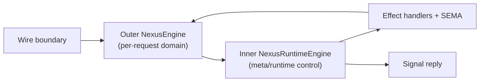

# 478 — Inner Nexus engine + recursive runtime control

## TL;DR

Spirit 1465 (Decision High, captured 2026-06-02): Nexus has an INNER interface with a second engine inside it that is RECURSIVE — it can call back on itself. The inner engine is the workspace meta/runtime control layer:
- Actor/actor-scheduling prioritization (when Nexus actors should run more than SEMA actors because the database is busy).
- Backpressure (Nexus notifies clients the database is too busy when overloaded).
- Runtime scheduling decisions about which actors run when.
- Recursive meta-decisions when the runtime situation itself needs reasoning about.

The OUTER `NexusEngine` (operator 287's design — `NexusWork → decide → NexusAction`) handles per-request domain decisions. The INNER engine handles meta-decisions about the runtime. Layered, separable, composable.

This is a future-direction capture — not for immediate pilot implementation. It frames where backpressure + scheduling + overload handling LIVE in the architecture so future operator slices have a typed home.

## Section 1 — The structural placement



Five nodes; honors Spirit 1282.

The flow:
1. Client message arrives at wire; Signal admits → enters OUTER Nexus.
2. OUTER NexusEngine consults INNER NexusRuntimeEngine before/during decisions.
3. INNER engine decides:
   - Normal flow: proceed to domain decision (outer continues).
   - Backpressure: emit a typed "too busy" reply directly.
   - Prioritization: defer this work; signal scheduler to run different actors.
   - Recursive meta: the runtime situation itself needs reasoning; the inner engine calls itself.
4. Effect/SEMA execution happens under runtime engine's scheduling discipline.
5. Eventually outer emits `ReplyToSignal` → exits to wire.

The KEY structural insight: the inner engine is BELOW the outer engine but doesn't replace it. It's a runtime concern that wraps the domain concern.

## Section 2 — Worked situations the inner engine handles

### Situation A — Database backpressure

SEMA store is overloaded; current write queue depth exceeds threshold.

Inner engine's reasoning:
- New `SignalArrived(Input::Record(entry))` enters outer Nexus.
- Outer Nexus computes its domain decision: `CommandSemaWrite(...)`.
- BEFORE dispatching the SEMA command, runtime engine checks: SEMA queue depth, current latency percentiles, etc.
- Runtime engine decides: reject with typed overload signal.
- Outer Nexus emits `NexusAction::ReplyToSignal(Output::RejectedOverload(BackpressureReason{queue_depth, retry_after}))`.

The client receives a TYPED overload reply, not a TCP timeout. The component stays available; clients can retry with backoff.

### Situation B — Actor prioritization under contention

Multiple requests in flight; CPU saturated.

Inner engine's reasoning:
- Multiple `NexusWork::SignalArrived(...)` queued.
- Runtime engine prioritizes: trace/observability requests get priority over heavy-write requests so the system can keep logging.
- Or: high-priority client (per origin route metadata) preempts low-priority queue.
- Scheduler decision: run Nexus actors more, run SEMA actors less, until queue drains.

This is the "Nexus actors should run more than SEMA actors because the database is busy" case from the user's framing. The runtime engine has the knob; the schedule is typed.

### Situation C — System-coherence preservation under overload

Heavy production load; system can't keep up with all client requests.

Inner engine's reasoning:
- Recognize: system is degraded but coherent.
- Shed load: reject lower-priority clients with backpressure responses.
- Preserve core function: keep accepting trace/admin/health-check requests so the system reports its state.
- Recursive: as load varies, re-evaluate which clients to shed.

The user's framing: "Nexus matters more because we need to process what's going on and keep logging so the system can keep working" — this situation. The runtime engine is what keeps Nexus available to make these organizing decisions even when other actors are overwhelmed.

### Situation D — Recursive runtime reasoning

The runtime situation itself becomes input to a deeper decision.

Example: the runtime engine notes that backpressure responses have been issued for 30 seconds, but queue depth is still growing → call itself recursively to decide on a DIFFERENT shedding policy (e.g., reject more aggressively, page operator, gracefully shut down non-critical actors).

`NexusRuntimeEngine::handle_runtime_situation(RuntimeSituation::SustainedBackpressure(...)) -> RuntimeDecision::RecurseWith(RuntimeSituation::EscalatedShedding(...))`

The recursion lets the runtime engine handle meta-meta concerns without code-paths exploding.

## Section 3 — Connection to existing architecture

### Builds on operator 287's NexusWork/NexusAction vocabulary

Operator 287's `NexusAction` set was: `{ReplyToSignal, CommandSemaWrite, CommandSemaRead, CommandEffect, Continue}`. The runtime engine extends this with TYPED OVERLOAD/SHEDDING SHAPES:

```rust
pub enum NexusAction {
    // Existing per operator 287:
    ReplyToSignal(Output),                       // wire exit
    CommandSemaWrite(SemaWriteInput),
    CommandSemaRead(SemaReadInput),
    CommandEffect(NexusEffectCommand),
    Continue(NexusWork),

    // Inner-engine additions per Spirit 1465:
    EmitBackpressure(BackpressureReply),         // typed too-busy reply (also exits to wire)
    DeferUntilDrain(NexusWork, DrainCondition),  // scheduler holds this until condition
    EscalateRuntime(RuntimeSituation),           // hand to inner engine recursively
}
```

The first three new variants are the runtime engine's expression. The outer engine emits them when the inner engine has determined the system state warrants them.

### Builds on Spirit 1439 (recursive Nexus)

The inner engine's recursion IS Spirit 1439's recursive Nexus at the META LEVEL. Spirit 1439 says: Nexus can emit work that re-enters Nexus. Spirit 1465 says: the META decisions about the runtime itself can recurse the same way.

This is consistent — the architecture has ONE recursion pattern at multiple scales:
- Per-request recursion (`Continue` per operator 287 / `InternalContinued` per the work side).
- Cross-component recursion (designer 477 §5 InvokeRemote extension).
- Meta-runtime recursion (this report — `EscalateRuntime` recursion).

The runner loop is the same shape; the inner engine's `EscalateRuntime` just creates new `RuntimeSituation` inputs for the inner engine to decide from.

### Connection to operator's `ContinuationBudget`

Operator 287 §"Generated Runner" added `ContinuationBudget(Integer)` to prevent infinite recursion. The runtime engine OWNS the budget more cleanly than a hard-coded constant:
- Budget per request based on request priority.
- Budget exhaustion is itself a `RuntimeSituation::BudgetExceeded` that the inner engine decides on.
- Inner engine might extend the budget (for trusted clients), reject hard (for untrusted), or escalate to a meta-meta reasoning.

### Connection to Spirit 1411 beauty

The layered structure (outer per-request engine + inner runtime engine) is composable; each layer has clear scope; the recursion is uniform. Per Spirit 1411, this is a beautiful shape — separation of concerns + architectural symmetry + typed control surfaces all at once.

## Section 4 — Implementation considerations

This is a FUTURE-DIRECTION report. Not for immediate pilot. The current operator slice (per 287) is: pilot Stash effect on spirit-next with operator's NexusWork/NexusAction vocabulary. The inner engine arrives LATER when:

1. The outer NexusEngine pattern proves out (multiple components implemented + the runner loop is generated).
2. A first overload/backpressure situation actually surfaces in production (or in a load test).
3. The schema-rust-next emitter can emit the inner engine trait + its dispatch shape.

When it arrives, the shape sketch:

```rust
pub trait NexusRuntimeEngine {
    fn evaluate_situation(&mut self, situation: RuntimeSituation) -> RuntimeDecision;

    fn schedule_work(&mut self, work: NexusWork, state: RuntimeState) -> ScheduledWork;

    fn handle_overload(&mut self, signal: OverloadSignal) -> OverloadResponse;
}

pub enum RuntimeSituation {
    NormalOperation,
    Backpressure(QueueState),
    SustainedBackpressure(Duration, QueueState),
    EscalatedShedding(SheddingPolicy),
    BudgetExceeded(ContinuationBudget),
    Custom(ComponentRuntimeSituation),  // per-component extensions
}

pub enum RuntimeDecision {
    Proceed,                                     // normal path
    EmitBackpressure(BackpressureReply),         // typed overload to client
    Defer(DrainCondition),                       // wait then re-evaluate
    Schedule(ScheduledAction),                   // dispatch with priority
    RecurseRuntime(RuntimeSituation),            // meta-meta
}
```

Each component declares its `ComponentRuntimeSituation` per its domain (introspect's situation might include trace-buffer-overflow; orchestrate's might include lock-conflict-storm).

### Schema-source declaration

The inner engine's types are SCHEMA-DECLARED per Spirit 1387 + 1419:

```nota
RuntimeSituation [
  NormalOperation
  (Backpressure QueueState)
  (SustainedBackpressure (Duration QueueState))
  (EscalatedShedding SheddingPolicy)
  (BudgetExceeded ContinuationBudget)
  (Custom ComponentRuntimeSituation)
]

RuntimeDecision [
  Proceed
  (EmitBackpressure BackpressureReply)
  (Defer DrainCondition)
  (Schedule ScheduledAction)
  (RecurseRuntime RuntimeSituation)
]
```

The runtime engine's behavior is schema-emitted; component code fills in only the situation-specific reasoning.

### Per-component customization

Each component daemon declares its own `ComponentRuntimeSituation` variants. spirit-next might include `SemaQueueDeep(usize)`; introspect might include `TraceBufferNearFull(usize)`; orchestrate might include `LockConflictStorm(Vec<LaneIdentifier>)`.

The inner engine's trait method `evaluate_situation(situation)` is component-overrideable; the default reasoning is generated; the per-component reasoning is filled in.

### Where this lives per Spirit 1422 contract-repo split

The inner engine + its types are DAEMON-INTERNAL — not client-facing. They live in the daemon repo (per Spirit 1422 split). The TYPED OVERLOAD REPLY (`EmitBackpressure(BackpressureReply)`) crosses the wire; its type belongs in `signal-<component>` (the wire contract).

So:
- `signal-spirit`: declares `BackpressureReply` as a Signal output variant (`Output::TooBusy(BackpressureReply)` or similar).
- `spirit-next`: declares `RuntimeSituation` + `RuntimeDecision` + the inner engine trait + per-component customization.

Clean separation per Spirit 1422.

## Section 5 — Open questions for the design

### Q1 — Is the inner engine a separate trait or a method on NexusEngine?

Two shapes:
- (a) Separate `NexusRuntimeEngine` trait alongside `NexusEngine`; component impls both.
- (b) `NexusEngine` gains a `runtime_check(situation) -> RuntimeDecision` method; one trait, layered.

Designer lean: (a) — separate trait. Composability + clarity of separation.

### Q2 — When does the runtime engine fire?

Options:
- (a) Before every outer Nexus decision (overhead on every request).
- (b) At designated checkpoints (e.g., before SEMA commands; before effect dispatches; before EmitSignal).
- (c) On a separate runtime timer + on overload signals only.

Designer lean: (b) — at command-emission checkpoints. Aligned with the runner loop's natural boundaries.

### Q3 — Recursion termination for inner engine

`EscalateRuntime(RuntimeSituation)` recursion needs a budget too. Inner engine's budget vs outer engine's continuation budget — same or separate?

Designer lean: separate. The inner engine's recursion is meta; should be more conservative (lower budget) since it's reasoning about the system state.

### Q4 — Cross-cutting with actor-trait promotion

Designer 466.3 candidate 4 (Engine actor promotion) overlaps with the inner engine. Actor mailboxes + scheduling overlap with runtime engine's job. Is the runtime engine the SCHEDULER for the actor traits, or are they orthogonal layers?

Designer lean: the runtime engine SCHEDULES the actor trait dispatches. Actor traits are the structure; runtime engine is the policy. They compose.

### Q5 — Default reasoning vs per-component customization

How much default reasoning does the macro-emitted runtime engine carry? Some workspace-universal patterns (budget exhaustion → reject; queue full → backpressure) should be defaults. Component-specific reasoning should be impl overrides.

This is a future emitter design question. Defer until pilot.

## Section 6 — Decision asks

This report adds NO new ratifications beyond Spirit 1465 (just captured).

Spirit 1465 is intentionally a DIRECTION not a mandate. It frames where backpressure + scheduling + overload-handling will live in the architecture so future implementation slices have a typed home. The exact trait shape, the dispatch points, the per-component customization patterns — all are subject to refinement when pilot evidence accrues.

Implementation gates (deferred):
- Pilot operator 287's Stash effect first; prove the runner loop on a single domain decision.
- After Stash proves, implement a first runtime situation (likely `SemaQueueDeep` for spirit-next as a backpressure pilot).
- The runtime engine emerges as a typed trait once two components have analogous runtime situations to handle.

## Cross-references

- `reports/designer/466-triad-engine-honesty-situation-2026-06-01/3-overview.md` — candidate 4 actor promotion this composes with.
- `reports/designer/476-nexus-side-channel-maximum-escalation-2026-06-02.md` §8 — operator's correction this builds on.
- `reports/designer/477-nexus-re-agglomeration-three-angles-2026-06-02.md` — the re-agglomeration this extends.
- `reports/operator/287-nexus-recursive-computation-continuation-2026-06-02.md` — operator's NexusWork/NexusAction vocabulary this composes with.
- Spirit records 1411 (beauty), 1419 (programmatic triad), 1422 (contract-repo split), 1437 (decision/effect language Maximum), 1438 (input/output asymmetry), 1439 (recursive computation), 1446 (this — inner engine).
- `skills/component-triad.md` §"Runtime triad engine traits" — the architecture being extended.
- `skills/actor-systems.md` — for scheduler / mailbox semantics (Q4 cross-cutting).

## For the orchestrator (chat ask)

Layered model: outer NexusEngine handles per-request domain decisions; inner NexusRuntimeEngine handles meta/runtime control (scheduling, backpressure, overload notifications, prioritization). Inner engine is recursive — can call itself for meta-meta reasoning. Future direction (Spirit 1465 Decision High, not mandate); pilot the operator 287 Stash effect first; runtime engine emerges when load/overload situations actually appear. Five open design questions surfaced for follow-up (trait vs method; dispatch checkpoints; recursion budget; actor-trait composition; default reasoning).
