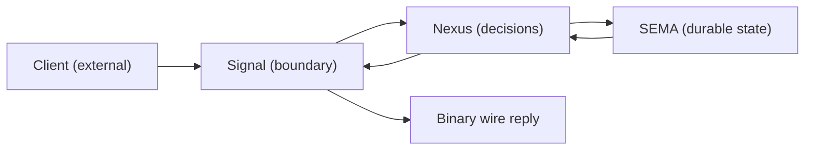
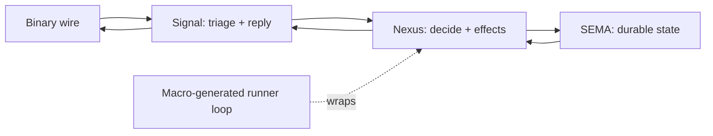

; psyche
[engine-mechanism fundamental-design workspace-template runner-loop NexusWork NexusAction effects recursion actor-traits firm-decision]
[Psyche report on the fundamental design decision facing the engine mechanism right now. Self-contained — explains the engine substrate from first principles, walks through how the pieces compose, surfaces the single biggest decision to make firm, and recommends the canonical workspace template. Deep context, staged narrative, multiple mermaid visuals. The biggest decision — lock in the workspace-canonical engine substrate that every component daemon ships with: NexusWork + NexusAction asymmetric pair + 5-variant action vocabulary + Continue-as-immediate-recursion + macro-generated runner-loop + typed effects per-component starting with Stash + Signal-contract-as-only-wire-exit. Other open questions (actor-trait mailboxes, inner runtime engine, schema-as-daemon) extend this base but don't determine it.]
2026-06-02
psyche-report-1

# Psyche Report 1 — Engine mechanism: the fundamental design decision

## What this report is

This is a **psyche report** — a new report category captured today as Spirit 1471. Unlike ordinary designer/operator reports that quote other artifacts assuming the reader will look them up, this report is **self-contained**. Every concept is explained in context. Visuals show the architecture; staged narrative walks through it; the focus is one decision.

The decision the report is about: **what is the canonical engine mechanism that ships to every component daemon in the workspace, and what shape should it have?** The user asked for the biggest fundamental decision to make firm in the engine mechanism that is going to run the whole show. This report names that decision and surfaces the recommended commitment.

## Stage 1 — What the engine mechanism IS

### The triad architecture in plain language

Every component daemon in the workspace has three structural parts:

1. **Signal** — the boundary. Accepts client messages, returns replies. Lives on a binary rkyv socket. The client never sees Nexus or SEMA directly.

2. **Nexus** — the decision center. Receives facts (Signal messages arrived, SEMA results came back, effects completed), decides what to do next, emits actions (delegate to SEMA, run an effect, reply to client, continue with more work).

3. **SEMA** — the durable state. Owns the database (currently redb-backed). Receives commands from Nexus (write this entry; observe this query), returns the results.

These three parts are CALLED the "triad" because they form a triangle:



Five nodes. The diagram limit per workspace convention is five nodes to keep diagrams readable.

### Why three parts (not one, not five)

The three-part separation is not arbitrary:
- **Signal isolates the wire**. Clients change protocols, get added, get removed. Without Signal as a boundary, every other component would need to know about wire details.
- **SEMA isolates durable state**. Storage changes (databases, schemas, migrations). Without SEMA, durable concerns leak into decision logic.
- **Nexus is what's left**. Once boundary and state are separated, the decisions sit in the middle. This is where the component's actual algorithmic work lives.

The three parts are recognizable in many actor systems and message-passing architectures, but the workspace's specific naming + roles came together over the 2026-05-30 to 2026-06-02 sessions as the engine-trait architecture was developed.

### What "engine traits" means

Each of Signal/Nexus/SEMA is expressed as a **Rust trait** that the component implements. The traits are GENERATED by a tool called `schema-rust-next` from a schema source file. The component daemon (e.g., `spirit-next`) provides the implementations.

```rust
pub trait SignalEngine {
    fn triage(&self, input: signal::Signal<Input>) -> nexus::Nexus<NexusInput>;
    fn reply(&self, output: nexus::Nexus<NexusOutput>) -> signal::Signal<Output>;
}

pub trait NexusEngine {
    fn execute(&mut self, input: nexus::Nexus<NexusInput>) -> nexus::Nexus<NexusOutput>;
}

pub trait SemaEngine {
    fn apply(&mut self, input: sema::Sema<WriteInput>) -> sema::Sema<WriteOutput>;
    fn observe(&self, input: sema::Sema<ReadInput>) -> sema::Sema<ReadOutput>;
}
```

The schema source declares the message vocabulary (what Input variants exist, what Output variants exist, what NexusInput/NexusOutput look like, etc.). The Rust emitter turns those declarations into the trait code.

### How the engine traits are used in current code

In current `spirit-next` (the workspace's pilot component):
- `SignalActor` implements `SignalEngine`.
- `Nexus` implements `NexusEngine`.
- `Store` implements `SemaEngine`.
- A top-level `Engine` struct holds all three and runs them in sequence on each client request.

The flow per request today:
1. Client sends a binary message; daemon decodes to a `signal::Signal<Input>`.
2. `SignalActor::triage` validates + admits + converts to `nexus::Nexus<NexusInput>`.
3. `NexusEngine::execute` decides what to do (today it's a generated projection — no real choice yet).
4. If Nexus says "delegate to SEMA", `SemaEngine::apply` or `observe` runs.
5. SEMA returns; Nexus translates back to a Nexus output; Signal converts to wire output.
6. Daemon sends binary reply.

This works for the current pilot but has a fundamental weakness: Nexus doesn't actually MAKE decisions. It's a generated projection from Input to SEMA operations. The architecture has the slot for decisions but no substance in it.

## Stage 2 — What's been added during the recent design work

Over the last 24-36 hours, a substantial amount of design work happened around fixing Nexus to be a real decision center. Let me explain what was added and why.

### Nexus needs a TYPED DECISION LANGUAGE

The standout finding from the recent audits (designer 466.3): Nexus has no real decision logic today. The generated projection `into_nexus_output()` maps Input variants directly to SEMA operations with **zero algorithmic choice**. Beauty fails: the architecture promises a decision center but delivers a routing function.

Fix: give Nexus a typed language of decisions it can make. Operator's report 287 named it cleanly:

- **NexusWork** = what Nexus receives. Facts: Signal arrived, SEMA completed, an effect finished.
- **NexusAction** = what Nexus emits. Commands: command SEMA, command an effect, reply to Signal, continue with more work.

These are NOT symmetric. NexusWork carries facts (things that happened); NexusAction carries commands (things to do next). Earlier framings called them NexusInput/NexusOutput, which lost this directional meaning.

The cleaned-up vocabulary:

```nota
NexusWork [
  (SignalArrived Input)                        ; client message arrived
  (SemaWriteCompleted SemaWriteOutput)         ; SEMA write finished
  (SemaReadCompleted SemaReadOutput)           ; SEMA read finished
  (EffectCompleted NexusEffectResult)          ; an effect finished
  (InternalContinued NexusInternalWork)        ; Nexus scheduled more work for itself
]

NexusAction [
  (ReplyToSignal Output)                       ; reply to client (only wire exit)
  (CommandSemaWrite SemaWriteInput)            ; do this SEMA write
  (CommandSemaRead SemaReadInput)              ; do this SEMA read
  (CommandEffect NexusEffectCommand)           ; run this effect
  (Continue NexusWork)                         ; loop with more work, no external action
]
```

Five action variants. One of them (`ReplyToSignal`) exits to the wire; the other four loop back into Nexus.

### What "effects" are

Some decisions Nexus makes aren't SEMA operations and aren't client replies. Examples:
- **Stash**: take a large result and store it under a handle so the client can fetch it later by handle (avoids sending huge payloads on the wire).
- **Fanout**: emit a copy of an event to live subscribers in addition to (or instead of) writing to SEMA.
- **Drop**: discard this request per policy (e.g., trace policy says "this event doesn't pass the filter").
- **Summarize**: roll an event into an aggregate without per-event durable storage.
- **Preempt / Enqueue**: in components that manage resources (e.g., orchestrate), revoke a current holder or queue a request.

These are RUNTIME ACTIONS — things the component's daemon does at runtime, but they aren't writes to a database. The workspace calls them "effects" and puts them under `NexusAction::CommandEffect`.

Each component declares its own effect vocabulary in its schema source. For example, spirit (the intent capture component) might declare:

```nota
NexusEffectCommand [(Stash StashRequest)]
NexusEffectResult [(Stashed StashResult)]
```

Just one effect — `Stash` — because spirit's first real Nexus decision is "is this observe result big? if yes, stash it and reply with a handle".

For introspect (the future trace destination), the effect vocabulary would be richer:

```nota
NexusEffectCommand [(Drop DropRequest) (Fanout FanoutRequest) (Summarize SummarizeRequest)]
NexusEffectResult [(Dropped DropResult) (FannedOut FanoutResult) (Summarized SummarizeResult)]
```

Each effect command has a matching effect result. The runner executes the command and feeds the result back into Nexus as a `NexusWork::EffectCompleted(...)`.

### The runner loop

Once Nexus has a typed decision language, the daemon's main work loop becomes a SIMPLE PATTERN. Pseudo-code:

```text
let mut work = NexusWork::SignalArrived(client_input);
loop {
    let action = nexus.decide(work);
    match action {
        ReplyToSignal(output) => return output_to_wire(output);   // exit
        CommandSemaWrite(input) => {
            let result = sema.apply(input);
            work = NexusWork::SemaWriteCompleted(result);
        }
        CommandSemaRead(input) => {
            let result = sema.observe(input);
            work = NexusWork::SemaReadCompleted(result);
        }
        CommandEffect(command) => {
            let result = effects.execute(command);
            work = NexusWork::EffectCompleted(result);
        }
        Continue(next_work) => {
            work = next_work;
        }
    }
}
```

This loop is the engine mechanism. **It is what runs the whole show.** Every client request enters at the top with `SignalArrived`; the loop runs until Nexus says `ReplyToSignal`; the result exits to the wire.

The key properties:
- Only `ReplyToSignal` exits to the client. Everything else stays in the daemon.
- The loop is **recursive in effect**: Nexus can keep deciding as many times as needed; the runner just keeps feeding completions back in.
- The `Continue` variant lets Nexus chain its own decisions without going through SEMA or an effect — useful when Nexus wants to do multiple decision steps internally.

### Where does the loop LIVE in code?

The user's directive (Spirit 1419) said: daemon `main` should be a SMALL macro call; the runner loop is generated by a macro from the schema; component code only provides the `decide` method and the effect handlers.

Concretely, the daemon binary `main` should look like:

```rust
fn main() {
    triad_main!(SpiritActor, SpiritNexus, SpiritStore);
}
```

That's it. The macro `triad_main!` does everything else: parses the binary configuration argument, sets up the sockets, instantiates the engines, runs the runner loop. The component provides:
- A `SpiritActor` type implementing `SignalEngine`.
- A `SpiritNexus` type implementing `NexusEngine` (specifically the `decide` method).
- A `SpiritStore` type implementing `SemaEngine` (the `apply` and `observe` methods).
- Effect handlers for any effects the component declares.

Currently (per operator 285), the daemon is at an intermediate step: `main` calls a hand-written `DaemonCommand::from_environment().run()` that does the wiring; the macro version is the next deeper step.

## Stage 3 — The fundamental decision

Now we get to the point.

### What's already firm

The following are settled:
- The three-part architecture (Signal/Nexus/SEMA).
- The engine traits as the Rust interface (Signal/Nexus/SEMA-Engine).
- The schema-rust-next emitter as the source of the engine trait code.
- Operator's NexusWork/NexusAction vocabulary as the canonical naming.
- The 5-variant NexusAction set (ReplyToSignal, CommandSemaWrite, CommandSemaRead, CommandEffect, Continue).
- The runner-loop pattern (Stage 2 pseudo-code).
- Effects as a per-component vocabulary.
- Stash as the first universal effect candidate.
- The macro direction (Spirit 1419) — daemon main is a tiny macro call.
- The contract-repo split (Spirit 1422) — Signal contract lives in `signal-<component>` repo; Nexus + SEMA in daemon repo.
- The typed trace identity (TraceObject hierarchy) — already landed in code.

### What is NOT yet firm — and this is the fundamental decision

**The complete shape of the engine mechanism is not yet locked in.** Several open questions are simultaneously in flight:

1. **Are NexusWork/NexusAction with the 5-variant NexusAction set + Continue recursion the FINAL shape**, or will additional architectural layers (inner runtime engine, actor-trait promotion) change it?

2. **Is the macro that generates the runner loop committed-to-build-now**, or does it wait for more pilot evidence?

3. **Should NexusAction's vocabulary be extended for backpressure/runtime control** (e.g., `EmitBackpressure`, `DeferUntilDrain`, `EscalateRuntime`) as a single-engine-with-many-actions shape, or should those land as a SEPARATE INNER ENGINE the outer engine consults?

4. **Are the engine traits SUFFICIENT**, or do they need to compose with separate ACTOR TRAITS (mailbox + lifecycle per the actor-systems skill) per the Spirit 1365 if-possible direction?

5. **Does the schema source carry the engine-mechanism shape (so any schema author gets it for free), or does each daemon hand-implement to its own preference?**

These five questions all bear on the same underlying issue: **the workspace doesn't yet have a single locked-in spec for "this is the engine substrate that ships to every component."**

### The recommended firm position

I recommend committing to the following as the workspace-canonical engine substrate:



The locked-in commitments:

1. **NexusWork/NexusAction is the canonical pair.** Variant set per operator 287: 5 work variants (SignalArrived, SemaWriteCompleted, SemaReadCompleted, EffectCompleted, InternalContinued) + 5 action variants (ReplyToSignal, CommandSemaWrite, CommandSemaRead, CommandEffect, Continue).

2. **The runner loop is macro-generated.** Daemon `main` is `triad_main!(SignalActor, Nexus, Store)`. The macro emits the loop, the wiring, the configuration parsing.

3. **Effects are per-component.** Each component's schema declares its `NexusEffectCommand` and `NexusEffectResult` vocabularies. The runner dispatches generic; the component provides the effect handlers.

4. **Continue is the in-process recursion mechanism.** When Nexus wants to think more without an external operation, it emits `Continue(NexusWork)`. The runner loops back immediately.

5. **Cross-component invocation goes through Signal contracts.** If introspect needs to query spirit, introspect's Nexus emits an `Effect(CallComponent(spirit_request))` and the runner sends a binary frame to spirit's daemon. No direct Nexus-to-Nexus access across daemons.

6. **Inner runtime engine (Spirit 1465) is FUTURE-DIRECTION, not part of the base substrate.** When backpressure, scheduling, or overload-handling become real needs, the inner engine layers ABOVE the outer NexusEngine. The base substrate doesn't change to add it; the inner engine extends the runner's dispatch behavior.

7. **Actor traits (Spirit 1365 if-possible) are future-direction, layered above engine traits.** The macro-generated runner uses engine traits today. If actor mailboxes prove necessary (under concurrency pressure), actor traits get added as supertraits of engine traits. The substrate doesn't change to add them; the actor traits compose with what's already there.

### Why these commitments and not others

The shape I'm recommending takes the SMALLEST FIRM SUBSTRATE that can ship to every component and gives every later concern (runtime control, actor mailboxes, cross-component recursion) a CLEAN PLACE TO EXTEND from. The substrate is small enough to pilot now; the extension paths are typed enough to grow into.

Alternative shapes I considered and rejected:

- **One unified engine that handles everything (decision + runtime control)**: tempting because it's simpler, but mixes domain decisions with runtime control. Less testable; harder to scale.

- **Multiple engines with no clear primary**: tempting because everything is equal, but loses the "Nexus is the decision center" insight. Components would end up implementing many small engines instead of one substantial Nexus.

- **Schema declares only types, runtime is hand-implemented per component**: maximally flexible but loses the workspace template benefit. Every component would reinvent the runner loop with subtle variations. Beauty fails.

- **Wait for more pilot evidence before locking anything in**: the current spirit-next pilot has run on the pre-NexusWork/NexusAction shape; waiting another month for more pilots delays everything downstream (introspect, persona, orchestrate, schema-as-daemon).

## Stage 4 — What firming this decision unlocks

Locking in the recommended substrate unblocks immediate work:

1. **Spirit-next can refactor to NexusWork/NexusAction** — the dispatched sub-agent A is already attempting this.
2. **The macro `triad_main!` can be designed** — schema-rust-next gets a new emission target. Operator's DaemonCommand becomes the pre-macro intermediate shape; the macro replaces it.
3. **Stash effect pilot lands cleanly** — first concrete effect handler, first per-variant `decide` method, first effect completion flowing through the runner.
4. **Introspect component starts on the substrate** — Spirit 1398 unblocks; the new repo follows the locked substrate from inception.
5. **Schema-as-daemon (Spirit 1469) is itself a component using the substrate** — schema-next becomes a daemon following the same template; the substrate compounds.
6. **Cross-component recursion gets its shape**: not via direct Nexus-to-Nexus, but via `Effect(CallComponent(...))` through Signal contracts.

What it does NOT decide (intentionally):
- Whether actor traits with mailboxes will eventually layer above (Spirit 1365 hedge stays as hedge).
- Whether inner runtime engine for backpressure lands soon or later (Spirit 1465 stays future-direction).
- Exactly which effects are workspace-universal vs per-component (Stash is the first universal candidate; others accrue as evidence appears).

These can be deferred without blocking the substrate's adoption.

## Stage 5 — The single decision ask

**Ratify the following as the workspace-canonical engine substrate**:

- NexusWork/NexusAction asymmetric pair with the 5-variant action set.
- Macro-generated runner loop (`triad_main!` to be emitted by schema-rust-next).
- Continue as in-process immediate recursion.
- Effects per-component declared in schema; Stash as the first universal candidate.
- Cross-component invocation via Signal contracts, not Nexus-internal access.
- Inner runtime engine + actor-trait composition deferred as future-direction layers above this substrate.

If this is firm, the next 3-6 operator slices flow naturally:
- Slice A: spirit-next refactors to the canonical substrate (sub-agent A in flight).
- Slice B: schema-rust-next emits `triad_main!` macro.
- Slice C: spirit-next pilots Stash effect for slim Observe (Layer 2 process-boundary witness).
- Slice D: introspect component starts on the substrate.
- Slice E: schema-as-daemon (Spirit 1469) becomes another component on the substrate (sub-agent B in flight, but with the broader scope of upgrade-as-SEMA).
- Slice F: cross-component recursion proven via introspect → spirit query.

If this is NOT firm, the open questions block in cascade: spirit-next can't refactor cleanly without knowing the substrate; introspect can't start without it; schema-as-daemon can't follow the template.

## Stage 6 — What questions remain after firming

These questions stay open after firming and become topics for future psyche reports:

1. **When does the inner runtime engine land?** Spirit 1465 captured it as future-direction. The trigger is real overload evidence in production-shaped tests.

2. **Does the actor-trait promotion happen?** Spirit 1365 left it as if-possible. The trigger is mailbox semantics being genuinely needed (e.g., under genuine concurrency that exceeds `&mut self` borrow guards).

3. **What is the right effect vocabulary across components?** Stash is the first candidate. Fanout, Drop, Summarize seem likely-universal but accrue as evidence appears. Per-component effects are fine indefinitely.

4. **How does the macro emit code that imports cross-repo Signal contracts?** Designer 475 (contract-repo split) showed schema-next already supports cross-schema imports; verifying for the `triad_main!` emission target is a small follow-up.

5. **How does the schema-as-daemon's runner relate to the runner of other components?** It's the SAME runner — the schema-daemon is just another component on the substrate. But the schema-daemon's effects are likely richer (it manages schema upgrades, which means migration is a per-component effect).

These questions are real but they don't block the substrate's adoption. They're follow-on work.

## Stage 7 — Why this matters

Engine substrate decisions compound. Locking in the wrong shape would mean every future component refactors when the truth surfaces. Locking in the right shape — even a smaller one than the eventual full picture — gives every component a stable template to build on.

The smaller-but-firm substrate I've recommended is large enough to BE the daemon — it runs the show as the user said. It's small enough that the extension paths (inner engine, actor traits, schema-as-daemon, introspect) all compose cleanly without changing the substrate itself.

The biggest fundamental decision IS this commitment. Make it firm; everything else flows.

## Cross-references

- The substance of this report was assembled from designer reports 463 + 465 + 466.3 + 468 + 469 + 470 + 476 + 477 + 478 + 479; operator reports 280 + 281 + 282 + 284 + 285 + 286 + 287 + 288 + 289 + 290; Spirit records 1326-1471. Each is explained in context above; readers don't need to look them up to understand this report.
- A psyche report is a new report category as of Spirit 1471 — self-contained, deep context, staged narrative, visual, focused. This is the first.
