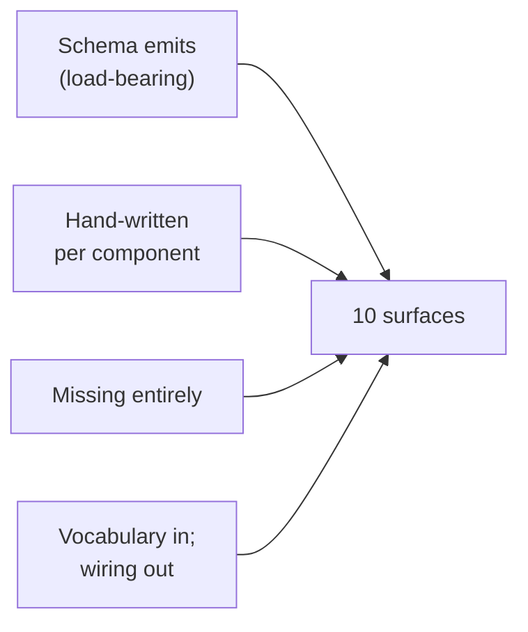

; designer
[tracing-emission schema-rust-next spirit-next testing-trace trace-socket TraceLog ObjectName per-effect-trace per-variant-trace test-harness-emission emission-completeness-audit]
[Audit of whether all the testing-trace code is emitted automatically by schema-rust-next so testing tracing is easy without per-component hand-writing. Findings: the core engine-trait hooks + ObjectName enum families + TraceEvent are EMITTED (~190 lines of generated code per component) — that's the load-bearing core. But four large surfaces are still HAND-WRITTEN per-component: TraceLog (sink + recording + socket dispatch), trace socket transport (rkyv-framed I/O), Configuration carrying the trace-socket path, daemon wiring (engine() with trace_log injection), CLI trace harness (TraceSocketListener + collect_for + print), and the trace hook implementations on the runtime types (the actor calls to ObjectName::Signal(...).new(...)). Per-effect trace events (1 of 10) are MISSING entirely — Stash from designer 480 produces no typed trace event. Per-variant Input/Output trace identity (10 of 10) is EMITTED in ObjectName but NOT WIRED — engine code calls only the actor-boundary hooks (Admitted/Triaged/Entered/etc.), not the per-variant interface-route hooks (SignalInputRecord/SignalInputObserve/etc.). The concept sketched: extend schema-rust-next to emit (a) per-variant interface-route trace hooks pre-wired into the projection helpers, (b) per-effect trace hooks on a generated EffectEngine trait, (c) the TraceLog + TraceSocketListener + Configuration trace fields as a shared trace-runtime support crate, (d) a triad_main! macro that wires everything for the daemon, (e) an assert_trace_sequence! macro for tests. After full emission, a new component daemon's testing-trace surface drops from ~400 lines to ~5 lines.]
2026-06-02
designer

# 483 — Audit: tracing emission completeness

## TL;DR

Per the psyche question 2026-06-02: is all the tracing code automatically
emitted (so testing tracing happens easily without per-component hand-
writing)?

**Answer: partially. The core typed trace surface IS emitted (~190 lines
of generated code per component). The runtime support around it is NOT
— roughly 400 lines per component daemon are hand-written for the
trace surface. The per-variant interface trace identity is emitted but
not wired. Per-effect trace events are missing entirely.**

For a brand-new component daemon today, getting testing-trace working
means hand-writing: `TraceLog` (sink + dispatch — 90 lines),
`TraceSocketListener` + `to_frame`/`from_frame` rkyv transport (60
lines), `Configuration::trace_socket_path` plumbing (15 lines), daemon
`engine()` trace injection (15 lines), CLI `TraceOutput` harness (25
lines), per-engine `with_trace` constructors + override impls (90
lines), instrumentation tests asserting event sequences (60 lines).
That's roughly 355 lines of mechanical boilerplate that does not vary
between components.

The concept in §4: extend `schema-rust-next` to emit a
`trace_runtime` module (or share via a `trace-next` crate), emit per-
effect trace hooks on a generated `EffectEngine` trait, wire per-
variant interface-route hooks into the projection helpers, and emit a
`triad_main!` macro for the daemon plus an `assert_trace_sequence!`
macro for tests. After full emission, a new component daemon's
testing-trace surface drops to roughly five lines: a `triad_main!`
macro call, a `with-feature testing-trace` flag, and an
`assert_trace_sequence!` per integration test.

## Q1 — What IS emitted automatically?

The audit walks the 10 surfaces named in the dispatch brief and
classifies each EMITTED, HAND-WRITTEN, or MISSING with file citations.
Everything is read from the current main HEAD of each repo:

- `spirit-next` main: `8fe12ac` (`spirit-next: model privacy as
  magnitude`).
- `schema-rust-next` main: `a8c0f01` per operator 284 §"Code shape".
- All file:line citations below are against these HEADs.

### 1. Per-engine trace hook methods (EMITTED)

Status: **EMITTED.** `schema-rust-next/src/lib.rs:2148-2235` emits
`SignalEngine`, `NexusEngine`, `SemaEngine` traits with default
trace-hook methods. The default body of `trace_*_activation()` is no-
op; the convenience `trace_signal_admitted()`, `trace_signal_triaged()`,
... etc. each call `trace_*_activation()` with the corresponding
typed object-name enum variant.

Cited concrete output in `spirit-next/src/schema/lib.rs:1818-1891`:

```rust
pub trait SignalEngine {
    fn trace_signal_activation(&self, _object_name: SignalObjectName) {}
    fn trace_signal_admitted(&self) {
        self.trace_signal_activation(SignalObjectName::Admitted);
    }
    fn trace_signal_rejected(&self) {
        self.trace_signal_activation(SignalObjectName::Rejected);
    }
    fn trace_signal_triaged(&self) {
        self.trace_signal_activation(SignalObjectName::Triaged);
    }
    fn trace_signal_replied(&self) {
        self.trace_signal_activation(SignalObjectName::Replied);
    }

    fn triage_inner(&self, input: signal::Signal<signal::Input>)
        -> nexus::Nexus<nexus::Input>;
    fn reply_inner(&self, output: nexus::Nexus<nexus::Output>)
        -> signal::Signal<signal::Output>;

    fn triage(&self, input: signal::Signal<signal::Input>)
        -> nexus::Nexus<nexus::Input>
    {
        let output = self.triage_inner(input);
        self.trace_signal_triaged();
        output
    }
    fn reply(&self, output: nexus::Nexus<nexus::Output>)
        -> signal::Signal<signal::Output>
    {
        let signal_output = self.reply_inner(output);
        self.trace_signal_replied();
        signal_output
    }
}
```

The same shape for `NexusEngine` (Entered/Decided) and `SemaEngine`
(WriteApplied/ReadObserved). This is the load-bearing emission: the
trait's PUBLIC methods (`triage`, `reply`, `execute`, `apply`,
`observe`) call the trace hooks, so any component using the trait
through its public surface produces the trace events.

### 2. TraceObject hierarchy / ObjectName enum families (EMITTED)

Status: **EMITTED.** `schema-rust-next/src/lib.rs:1265-1339` emits
`SignalObjectName`, `NexusObjectName`, `SemaObjectName`, the umbrella
`ObjectName`, and the `TraceEvent` newtype carrying it.

Cited concrete output in `spirit-next/src/schema/lib.rs:1313-1452`:

```rust
pub enum SignalObjectName {
    Input(InputRoute),        // per-variant interface identity (emitted!)
    Output(OutputRoute),      // per-variant interface identity (emitted!)
    Admitted,                 // actor-boundary identity
    Rejected,
    Triaged,
    Replied,
}

pub enum NexusObjectName {
    Input(NexusInputRoute),
    Output(NexusOutputRoute),
    Entered,
    Decided,
}

pub enum SemaObjectName {
    WriteInput(SemaWriteInputRoute),
    ReadInput(SemaReadInputRoute),
    WriteOutput(SemaWriteOutputRoute),
    ReadOutput(SemaReadOutputRoute),
    WriteApplied,
    ReadObserved,
}

pub enum ObjectName {
    Signal(SignalObjectName),
    Nexus(NexusObjectName),
    Sema(SemaObjectName),
}

pub struct TraceEvent {
    pub object_name: ObjectName,
}
```

Both halves of operator 282 §"Two Trace Identities" land in the
emitted code: the **interface-object identity**
(`Input(InputRoute::Record)`) AND the **actor-boundary identity**
(`Admitted`). They're emitted on the same `<Plane>ObjectName` enum,
not split as the operator 282 design suggested. The shape per-enum
mixes both kinds of activation; see Q6 below for why this currently
matters less than expected.

### 3. TraceLog / in-process sink (HAND-WRITTEN)

Status: **HAND-WRITTEN.** `spirit-next/src/trace.rs:14-91`. This is
component-implementation code that the schema emitter does not
produce.

The `TraceLog` struct carries one of three destinations:

```rust
#[derive(Clone, Debug, Default)]
enum TraceDestination {
    #[default]
    Disabled,
    Recording(Arc<Mutex<Vec<TraceEvent>>>),
    Socket(TraceSocketPath),
}
```

with `TraceLog::recording()`, `TraceLog::socket()`, `record(event)`,
`events()` etc. Roughly 90 lines of identical boilerplate that every
future component daemon would re-implement. The shape does not vary
component-by-component — the same enum, the same methods, the same
dispatch logic — yet the emitter does not produce it.

### 4. Trace socket transport (HAND-WRITTEN)

Status: **HAND-WRITTEN.** `spirit-next/src/trace.rs:93-180`. Length-
prefixed rkyv frames over `UnixStream`:

```rust
const LENGTH_PREFIX_BYTE_COUNT: usize = 4;

impl TraceEvent {
    pub fn to_frame(&self) -> Result<Vec<u8>, TraceError> { /* ... */ }
    pub fn from_frame(frame: &[u8]) -> Result<Self, TraceError> { /* ... */ }
    pub fn write_to(&self, stream: &mut UnixStream) -> Result<(), TraceError> { ... }
    pub fn read_from(stream: &mut UnixStream) -> Result<Self, TraceError> { ... }
}

pub struct TraceSocketPath { path: PathBuf }
pub struct TraceSocketListener { listener: UnixListener, path: PathBuf }
```

The `to_frame`/`from_frame` method pair is the rkyv length-prefixed
codec — exact mirror of the regular SignalFrame codec the schema
emitter DOES produce for the wire (see
`schema-rust-next/src/lib.rs:1229-1259`). Same shape, different
target — but only the wire frame is emitted; the trace frame is
hand-written.

The `TraceSocketListener::bind` + `collect_for(duration)` is the test-
side reader. Again roughly 60 lines of mechanical I/O code that does
not vary per component.

### 5. Trace configuration types (HAND-WRITTEN)

Status: **HAND-WRITTEN.** `spirit-next/src/config.rs:8-46`. The
component-owned `Configuration` carries the trace socket path as an
optional field:

```rust
pub struct Configuration {
    socket_path: ConfigurationPath,
    database_path: ConfigurationPath,
    trace_socket_path: Option<ConfigurationPath>,
}

impl Configuration {
    pub fn new(socket_path: ..., database_path: ...) -> Self { ... }
    pub fn new_with_trace(
        socket_path: ...,
        database_path: ...,
        trace_socket_path: ...,
    ) -> Self { ... }
    pub fn trace_socket_path(&self) -> Option<&Path> { ... }
}
```

The component's per-daemon `Configuration` is hand-written for many
reasons (database path is component-specific, socket path is
component-specific, future config fields are component-specific) —
but the `trace_socket_path: Option<ConfigurationPath>` shape is shared
across every component that wants testing-trace. The emitter could
inject the trace field via an opt-in marker on the schema; today it
does not.

### 6. Default impls of trace methods on the runtime types (HAND-WRITTEN)

Status: **HAND-WRITTEN.** Three impls of the engine traits each
override `trace_<plane>_activation` to push into `TraceLog`:

`spirit-next/src/engine.rs:194-209`:

```rust
impl SignalEngine for SignalActor {
    #[cfg(feature = "testing-trace")]
    fn trace_signal_activation(&self, object_name: SignalObjectName) {
        self.trace_log
            .record(TraceEvent::new(ObjectName::Signal(object_name)));
    }
    fn triage_inner(&self, ...) { ... }
    fn reply_inner(&self, ...) { ... }
}
```

`spirit-next/src/nexus.rs:62-67`:

```rust
impl NexusEngine for Nexus {
    #[cfg(feature = "testing-trace")]
    fn trace_nexus_activation(&self, object_name: NexusObjectName) {
        self.trace_log
            .record(TraceEvent::new(ObjectName::Nexus(object_name)));
    }
    fn decide(&mut self, ...) { ... }
}
```

`spirit-next/src/store.rs:40-45`:

```rust
impl SemaEngine for Store {
    #[cfg(feature = "testing-trace")]
    fn trace_sema_activation(&self, object_name: SemaObjectName) {
        self.trace_log
            .record(TraceEvent::new(ObjectName::Sema(object_name)));
    }
    fn apply_inner(&mut self, ...) { ... }
    fn observe_inner(&self, ...) { ... }
}
```

Three blocks of identical 3-line method bodies plus a `with_trace`
constructor, repeated per engine. The shape does NOT vary by
component — the override always wraps the plane-local object name in
`ObjectName::<Plane>` and records it. The runtime types' DOMAIN
implementations (`triage_inner`, `decide`, `apply_inner`) are
legitimately hand-written (algorithmic content); the trace overrides
are pure plumbing the emitter could inject as a `#[cfg(feature =
"testing-trace")]` block on each engine impl.

The other half of "Default impls" — the actor-call invocations
(`#[cfg(feature = "testing-trace")] self.signal_actor.
trace_signal_admitted()` in `Engine::handle`) — sits at
`spirit-next/src/engine.rs:107,108,171,etc`. Again hand-written per
component: the daemon's `Engine::handle` calls
`trace_signal_admitted()` explicitly because `admit()` isn't part of
the `SignalEngine` trait (it's a component method). These calls also
have a uniform shape: every place the runtime explicitly invokes a
non-trait actor-boundary action, a `trace_signal_*` call sits beside
it under `#[cfg(feature = "testing-trace")]`.

### 7. Test harness for trace assertions (HAND-WRITTEN)

Status: **HAND-WRITTEN.** `spirit-next/tests/instrumentation_logging.
rs:152-164` defines the assertion harness:

```rust
fn assert_activation_names(events: &[TraceEvent], expected: &[&str]) {
    let actual = events.iter().map(TraceEvent::name).collect::<Vec<_>>();
    assert_eq!(actual, expected, "trace events: {events:#?}");
}

fn assert_activation_objects(events: &[TraceEvent], expected: &[ObjectName]) {
    let actual = events
        .iter()
        .map(TraceEvent::object_name)
        .collect::<Vec<ObjectName>>();
    let expected = expected.to_vec();
    assert_eq!(actual, expected, "trace events: {events:#?}");
}
```

And the process-boundary harness at
`spirit-next/tests/process_boundary.rs:80-129` defines `TraceCliOutput`,
`assert_trace_sequence`, and `run_cli_with_trace`. Roughly 60 more
lines of mechanical harness per component, where the shape does not
vary.

The pattern that a new component would want:

```rust
// Hand-written today for every component:
struct TraceCliOutput { output: Output, trace_lines: Vec<String> }
impl TraceCliOutput {
    fn from_stdout(stdout: Vec<u8>) -> Self { /* parse stdout */ }
    fn assert_trace_sequence(&self, expected: &[&str]) { /* assert */ }
}

fn run_cli_with_trace(
    socket_path: &Path,
    trace_socket_path: &Path,
    nota_argument: &str,
) -> TraceCliOutput { /* spawn CLI binary, env-set, harvest */ }
```

### 8. CLI display rendering (HAND-WRITTEN, but minimal)

Status: **HAND-WRITTEN, partial.** The conversion `TraceEvent ->
display text` is in two places:

- `spirit-next/src/trace.rs:182-186` implements
  `fmt::Display for TraceEvent` by calling `self.name()` — and `name()`
  IS emitted (`spirit-next/src/schema/lib.rs:1431-1438` per the
  `impl ObjectName` block from §2). So the display string for the
  event name is auto-emitted; only the bare `impl fmt::Display`
  wrapper is hand-written.

- `spirit-next/src/bin/spirit-next.rs:77-84` implements
  `TraceOutput::print_events` — three lines that loop and println the
  events. Hand-written, mechanical.

This surface is small enough that it's not load-bearing, but the
`fmt::Display` impl is still a per-component hand-write that could be
emitted.

### 9. Per-effect trace hooks (MISSING)

Status: **MISSING.** The Stash effect designer 480 just piloted has
NO trace event. Inspecting designer 480's branch:

- `spirit-next/schema/lib.schema` (on branch
  `designer-best-of-designs-2026-06-02`) declares:
  ```nota
  NexusEffectCommand [(Stash StashRequest)]
  NexusEffectResult  [(Stashed StashResult)]
  ```
- The corresponding emitted Rust code (per designer 480 §"Schema
  additions") does NOT add `Stash` variants to `NexusObjectName` or
  anything analogous. There's no `Effect(NexusEffectCommandRoute)`
  variant on `NexusObjectName` or a sister `EffectObjectName`.
- `Nexus::apply_effect(command)` (the hand-written effect runner)
  emits no trace event. The trace event that fires is `NexusEntered`
  / `NexusDecided` — the OUTER actor-boundary — but the Stash effect's
  execution within the runner loop is invisible to the trace stream.

The fix is structurally identical to the actor-boundary emissions:
introduce an `EffectEngine` (or per-component `<Component>EffectEngine`)
trait with `trace_effect_activation(EffectObjectName)` and emit
convenience methods per declared effect (`trace_stash_applied()`,
`trace_fanout_dispatched()`, etc.). The hand-written
`apply_effect(NexusEffectCommand::Stash(request))` then calls
`self.trace_stash_applied()` automatically through the trait's `apply`
public method.

### 10. Per-variant trace identity (EMITTED in vocabulary, NOT WIRED)

Status: **EMITTED but UNUSED.** The schema emitter produces
`SignalObjectName::Input(InputRoute::Record)` as a typed value —
distinct from `SignalObjectName::Input(InputRoute::Observe)` etc.
(see §2 above). However, the engine code DOES NOT call the per-
variant hook anywhere on the runtime path; only the actor-boundary
hooks (`Admitted`, `Triaged`, `Entered`, `Decided`, `Replied`, etc.)
fire.

The generated `SignalEngine::triage` looks like:

```rust
fn triage(&self, input: signal::Signal<signal::Input>)
    -> nexus::Nexus<nexus::Input>
{
    let output = self.triage_inner(input);
    self.trace_signal_triaged();    // <- actor-boundary only
    output
}
```

The per-variant identity SHOULD fire BEFORE the inner is called,
something like:

```rust
fn triage(&self, input: signal::Signal<signal::Input>)
    -> nexus::Nexus<nexus::Input>
{
    self.trace_signal_input_route(input.root().route());
    let output = self.triage_inner(input);
    self.trace_signal_triaged();
    output
}
```

So the vocabulary is half-finished: the typed enum values
(`SignalObjectName::Input(InputRoute::Record)`) exist in the emitted
code; the runtime never produces them. Operator 282 §"Two Trace
Identities, One Rule" identified this exact gap; today's main has
the typed enums but no wiring.

### Classification summary



Five nodes; honors the Spirit 1282 budget. Counts per category:

| # | Surface | Status |
|---|---|---|
| 1 | Per-engine trace hook methods | EMITTED |
| 2 | TraceObject hierarchy / ObjectName enums | EMITTED |
| 3 | TraceLog (in-process sink) | HAND-WRITTEN |
| 4 | Trace socket transport | HAND-WRITTEN |
| 5 | Trace configuration types | HAND-WRITTEN |
| 6 | Default impls of trace methods on runtime types | HAND-WRITTEN |
| 7 | Test harness for trace assertions | HAND-WRITTEN |
| 8 | CLI display rendering | HAND-WRITTEN (mostly) |
| 9 | Per-effect trace hooks | MISSING |
| 10 | Per-variant trace identity | EMITTED-VOCAB-ONLY (unwired) |

Two fully emitted (the core typed surfaces). Six hand-written
(boilerplate). One missing (effects). One half-done (per-variant).

## Q2 — What "testing tracing happens easily" requires

The honest test of "testing tracing is easy": a new component team
clones the workspace, writes their schema, and gets testing-trace
working WITHOUT any per-component trace boilerplate.

### What "easy" looks like — the receiving end

For a hypothetical `introspect-next` component (the future trace
destination), getting tracing working should look like:

```rust
// src/bin/introspect-daemon.rs — the whole binary
fn main() {
    introspect_next::daemon::triad_main!();
}

// src/bin/introspect.rs — the whole CLI binary
fn main() {
    introspect_next::cli::triad_main!();
}
```

```toml
# Cargo.toml — three lines for testing-trace:
[features]
default = []
nota-text = ["dep:nota-next"]
testing-trace = ["schema-rust-next/trace-runtime"]
```

And the integration test:

```rust
// tests/instrumentation_logging.rs — one harness method per assertion
#[test]
fn introspect_traces_signal_nexus_sema_in_record_path() {
    let fixture = IntrospectFixture::new();
    fixture.assert_trace_sequence(
        Input::Record(...),
        &[
            ObjectName::Signal(SignalObjectName::Admitted),
            ObjectName::Signal(SignalObjectName::Input(InputRoute::Record)),
            ObjectName::Signal(SignalObjectName::Triaged),
            ObjectName::Nexus(NexusObjectName::Entered),
            ObjectName::Sema(SemaObjectName::WriteApplied),
            ObjectName::Nexus(NexusObjectName::Decided),
            ObjectName::Signal(SignalObjectName::Replied),
        ],
    );
}
```

That's it. Three lines in `Cargo.toml`, one harness type
(`IntrospectFixture` — emitted), and the assertion. No `TraceLog`,
no `TraceSocketListener`, no hand-written `with_trace` constructors,
no hand-written `trace_*_activation` overrides.

### What "easy" requires today — the hand-write

For the same goal, today's component team would need (citing exact
quantities from the audit above):

1. **TraceLog** — 90 lines, copy-paste from `spirit-next/src/trace.rs`.
2. **TraceSocketListener + frame codec** — 60 lines, copy-paste from
   `spirit-next/src/trace.rs`.
3. **Configuration's trace_socket_path** — 15 lines.
4. **Daemon engine() trace wiring** — 15 lines, copy-paste from
   `spirit-next/src/daemon.rs:157-174`.
5. **CLI TraceOutput** — 25 lines, copy-paste from
   `spirit-next/src/bin/spirit-next.rs:61-85`.
6. **Per-engine override impls** — 90 lines (~30 per engine for
   `trace_*_activation` + `with_trace` constructors).
7. **The `<Component>Engine::handle` actor-call boundary
   invocations** — roughly 30 lines of `#[cfg(feature =
   "testing-trace")] self.signal_actor.trace_signal_admitted()`
   sprinkled through `engine.rs`.
8. **Test harness** — 60 lines of `assert_trace_sequence`,
   `run_cli_with_trace`, `TraceCliOutput::from_stdout`,
   `TraceCliOutput::assert_trace_sequence`.

Total: ~385 lines. None of this is component-specific algorithmic
content. Every line of it could be emitted or shared.

```mermaid
flowchart LR
    Schema["schema source<br/>(varies per component)"]
    Emit["emit traces<br/>(190 lines — TODAY)"]
    Hand["hand-write<br/>(385 lines — TODAY)"]
    Test["test 1 trace<br/>(today: 60 lines)"]
    Future["~5 lines<br/>(after full emission)"]
    Schema --> Emit
    Schema --> Hand
    Emit --> Test
    Hand --> Test
    Test -.."after gap closure"..-> Future
```

Five nodes. The arrow from Schema branches today: the emitter handles
the core 190 lines; the rest accrues to the component.

## Q3 — Friction points: legitimate vs gap

The discipline from the dispatch brief: distinguish what's hand-
written because it's component-specific (legitimate) from what's
hand-written because it could be emitted but isn't (gap; opportunity).

### Legitimate hand-written content

| Surface | Reason hand-written |
|---|---|
| `Engine::handle` body algorithmic shape | Component-specific decision logic — what to do with Input variants |
| `NexusEngine::decide` body | Decision algorithm specific to this component |
| `SemaEngine::apply_inner` body | redb / sql / file-system code specific to this storage |
| `SignalActor::admit` body | Validation rules specific to the component's domain |
| `Configuration::database_path` | Path semantics specific to the component |
| Most domain types (Entry, Query, etc.) | Schema-derived but with semantically-meaningful body content |

### Component-specific algorithmic content the macro can't predict

| Surface | Reason emitter cannot predict |
|---|---|
| Effect handlers (`apply_effect(NexusEffectCommand::Stash)`) | Effect semantics are component-specific |
| Per-component test fixtures (e.g., `SemaFile`, `entry()`) | Domain-specific test data |
| CLI argument validation | Component-specific CLI shape |

### Gap — boilerplate the macro could absorb (opportunity)

| Surface | Why it's a gap |
|---|---|
| `TraceLog` + `TraceDestination` enum + recording/socket/disabled | The shape doesn't vary; it's already a reusable runtime concept |
| `TraceEvent::to_frame` / `from_frame` / `read_from` / `write_to` | Exact mirror of the wire-frame codec the emitter DOES produce |
| `TraceSocketListener` + `bind` + `collect_for` | Generic Unix-socket I/O with no component coupling |
| `TraceSocketPath::write_event` | Generic |
| `TraceError` enum | Generic |
| `Configuration::trace_socket_path` field + `new_with_trace` ctor | Shape doesn't vary |
| `Daemon::engine()` `#[cfg(feature = "testing-trace")]` branch | Shape doesn't vary |
| Per-engine `with_trace` constructors | Shape doesn't vary; just `Self { trace_log, ..Self::default() }` |
| Per-engine `trace_*_activation` override impl bodies | Shape doesn't vary; always `self.trace_log.record(TraceEvent::new(ObjectName::<Plane>(object_name)))` |
| `Engine::handle` actor-call trace invocations (admit/rejected) | Shape doesn't vary; one trace per non-trait actor-boundary action |
| CLI `TraceOutput::from_environment` + `print_events` | Generic |
| `assert_activation_names` / `assert_activation_objects` | Generic — same assertion shape for every component |
| `TraceCliOutput::from_stdout` + `assert_trace_sequence` | Generic |
| `run_cli_with_trace` | Generic — just sets the env var, spawns binary, parses stdout |

That table is the audit's gap. Roughly 385 lines of identical shape
per component, plus zero new design content.

### Why the gap accrued

Reading the operator 280-284 sequence shows the trace surface
graduated through several "minimum viable trace" steps:

1. Hand-written trace recorder (operator 280, the first landing).
2. Per-engine trace traits + ObjectName families (operator 282
   directive realised at `schema-rust-next` `a8c0f01`).
3. `SignalEngine::trace_signal_activation` emission integrated into
   each public method's default impl (operator 284).

Each step migrated MORE into the emitter. The remaining hand-
written surface is the next migration wave: in shape, exactly the
same "this could be emitted; we're hand-writing it as a transient"
trajectory, just for the support runtime around the engine traits
rather than the engine traits themselves.

## Q4 — Concept: full emission

This section sketches what full emission would look like end-to-end.
The proof of concept is "what does a new component daemon code look
like AFTER full emission" — measured in lines and shape.

### Q4a — Schema source addition (NOTA)

The schema source today (`spirit-next/schema/lib.schema`) declares
roots, types, and engine surfaces by their presence. The emitter
inspects what's declared and emits accordingly. To add per-effect
tracing + per-variant interface tracing emission AS A LEGITIMATE
EXTENSION, the schema source could optionally name the effect
vocabulary at the same place it already names other root enums.

A future `spirit-next/schema/lib.schema` extension (sketch in NOTA;
not landed yet):

```nota
NexusEffectCommand [(Stash StashRequest)]
NexusEffectResult  [(Stashed StashResult)]
```

Those declarations already exist on designer 480's branch (per
report 480 §"Schema additions"). For emission, the emitter needs
ONLY to recognise these names and emit alongside the existing
`NexusObjectName`.

The interface-route hooks need NO new schema content: the emitter
already knows about `InputRoute`, `OutputRoute`,
`NexusInputRoute`, etc. (per Q1 §2). The change is purely in the
emitter: wire those existing typed values into the public method's
default body.

### Q4b — New emitter output (Rust)

The emitter additions in `schema-rust-next/src/lib.rs`. Each is a
small extension of an emission function that already exists:

#### Per-variant interface-route emission

Inside `emit_schema_plane_trait_support` (line 2138 today), the
`SignalEngine::triage` method's default body changes from:

```rust
fn triage(&self, input: signal::Signal<signal::Input>)
    -> nexus::Nexus<nexus::Input>
{
    let output = self.triage_inner(input);
    self.trace_signal_triaged();
    output
}
```

to:

```rust
fn trace_signal_input_route(&self, _route: InputRoute) {}

fn triage(&self, input: signal::Signal<signal::Input>)
    -> nexus::Nexus<nexus::Input>
{
    self.trace_signal_activation(
        SignalObjectName::Input(input.root().route())
    );
    let output = self.triage_inner(input);
    self.trace_signal_triaged();
    output
}
```

That single change emits the typed per-variant interface identity
on every Signal admission. Similar shape for `reply` (emits the
`Output(OutputRoute)` identity before `reply_inner`),
`NexusEngine::execute`, `SemaEngine::apply` and `observe`.

#### Per-effect trace hooks

When the schema declares `NexusEffectCommand [...]` and
`NexusEffectResult [...]`, emit a paired trait:

```rust
pub trait EffectEngine {
    fn trace_effect_activation(&self, _object_name: EffectObjectName) {}
    fn trace_stash_applied(&self) {
        self.trace_effect_activation(EffectObjectName::StashApplied);
    }

    fn apply_inner(&mut self, command: NexusEffectCommand) -> NexusEffectResult;

    fn apply(&mut self, command: NexusEffectCommand) -> NexusEffectResult {
        let route = command.route();
        self.trace_effect_activation(EffectObjectName::Command(route));
        let result = self.apply_inner(command);
        match &result {
            NexusEffectResult::Stashed(_) => self.trace_stash_applied(),
        }
        result
    }
}
```

And the `EffectObjectName` enum:

```rust
pub enum EffectObjectName {
    Command(NexusEffectCommandRoute),
    Result(NexusEffectResultRoute),
    StashApplied,
    // ... other component-specific applied variants ...
}
```

The `ObjectName` umbrella grows a fourth variant:

```rust
pub enum ObjectName {
    Signal(SignalObjectName),
    Nexus(NexusObjectName),
    Sema(SemaObjectName),
    Effect(EffectObjectName),   // NEW
}
```

#### Shared trace-runtime crate (emission helper)

Move the trace runtime out of every component and into a single
shared crate `trace-next` (or a `trace-runtime` feature on
`schema-rust-next`). Crate contents — emitted ONCE, used by every
component:

```rust
// In trace-next or schema-rust-next/trace-runtime feature:

pub struct TraceLog<Event> { /* generic over emitted TraceEvent */ }

impl<Event: rkyv::Archive + ...> TraceLog<Event> {
    pub fn disabled() -> Self { ... }
    pub fn recording() -> Self { ... }
    pub fn socket(path: impl Into<PathBuf>) -> Self { ... }
    pub fn record(&self, event: Event) { ... }
    pub fn events(&self) -> Vec<Event> { ... }
}

pub struct TraceSocketListener<Event> { /* generic over emitted TraceEvent */ }

impl<Event: rkyv::Archive + ...> TraceSocketListener<Event> {
    pub fn bind(path: impl Into<PathBuf>) -> Result<Self, TraceError> { ... }
    pub fn collect_for(&self, duration: Duration) -> Result<Vec<Event>, TraceError> { ... }
}
```

The TraceEvent generic parameter is needed because each component's
emitted `TraceEvent` carries its OWN `ObjectName` umbrella with
component-specific names. (Alternatively, the trace transport could
work on opaque rkyv-archived bytes; the decoder lives in the
component.)

#### Macro: `triad_main!` for the daemon binary

```rust
#[macro_export]
macro_rules! triad_main {
    ($Signal:ty, $Nexus:ty, $Sema:ty) => {
        fn main() {
            if let Err(error) = $crate::DaemonCommand::<$Signal, $Nexus, $Sema>::from_environment().run() {
                eprintln!(concat!(env!("CARGO_PKG_NAME"), "-daemon: {error}"), error = error);
                std::process::exit(1);
            }
        }
    };
}
```

with `DaemonCommand<Signal, Nexus, Sema>` taking the engine types as
generics and doing the configuration parsing, socket setup, engine
wiring, optional trace-socket setup (under
`#[cfg(feature = "testing-trace")]`), and the request loop.

#### Macro: `assert_trace_sequence!` for tests

```rust
#[macro_export]
macro_rules! assert_trace_sequence {
    ($fixture:expr, $request:expr, $expected:expr $(,)?) => {{
        let trace = $fixture.collect_trace_for($request);
        let actual: Vec<ObjectName> = trace.events.iter()
            .map(|event| event.object_name())
            .collect();
        assert_eq!(actual, $expected.to_vec(),
            "trace events mismatch — full trace: {:#?}", trace.events);
    }};
}
```

### Q4c — Component daemon code AFTER full emission

The post-emission shape of `spirit-next`'s testing-trace surface:

**Schema source** (`spirit-next/schema/lib.schema`) — unchanged
(plus Stash effect already added in designer 480).

**Cargo.toml** — three new lines:

```toml
[features]
default = []
nota-text = ["dep:nota-next"]
testing-trace = ["schema-rust-next/trace-runtime"]
```

**`spirit-next/src/bin/spirit-next-daemon.rs`** — one macro call:

```rust
fn main() {
    spirit_next::triad_main!(SignalActor, Nexus, Store);
}
```

**`spirit-next/src/bin/spirit-next.rs`** — one macro call:

```rust
fn main() {
    spirit_next::cli_main!(Input, SignalTransport);
}
```

**`spirit-next/src/engine.rs`** — `SignalActor`, `Nexus`, `Store`
still hand-implement their domain methods (`triage_inner`,
`decide`, `apply_inner`). The `with_trace` constructors and the
`trace_signal_activation` overrides go away — the emitter injects
them under `#[cfg(feature = "testing-trace")]` on each `impl
SignalEngine for SignalActor` block.

**`spirit-next/src/trace.rs`** — DELETED. The trace runtime is
provided by the shared crate.

**`spirit-next/src/config.rs`** — DELETED or shrunk to component-
specific fields. The trace_socket_path is provided by the shared
`Configuration` type emitted from schema.

**`spirit-next/tests/instrumentation_logging.rs`** — about 30 lines:

```rust
use spirit_next::{Engine, Input, ObjectName, SignalObjectName,
                  NexusObjectName, SemaObjectName, InputRoute, ...};
use spirit_next::testing::TraceFixture;

#[test]
fn record_path_traces_per_variant_and_per_actor_objects() {
    let fixture = TraceFixture::new();
    fixture.assert_trace_sequence(
        Input::Record(entry("witness")),
        &[
            ObjectName::Signal(SignalObjectName::Admitted),
            ObjectName::Signal(SignalObjectName::Input(InputRoute::Record)),
            ObjectName::Signal(SignalObjectName::Triaged),
            ObjectName::Nexus(NexusObjectName::Input(NexusInputRoute::Signal)),
            ObjectName::Nexus(NexusObjectName::Entered),
            ObjectName::Sema(SemaObjectName::WriteInput(SemaWriteInputRoute::Record)),
            ObjectName::Sema(SemaObjectName::WriteApplied),
            ObjectName::Nexus(NexusObjectName::Decided),
            ObjectName::Signal(SignalObjectName::Output(OutputRoute::RecordAccepted)),
            ObjectName::Signal(SignalObjectName::Replied),
        ],
    );
}
```

The `TraceFixture::new()` and `assert_trace_sequence` are emitted
into `spirit_next::testing` (or come from the shared crate).

### Q4d — Line-count delta

| Surface | Today | After full emission | Delta |
|---|---|---|---|
| `src/trace.rs` | 208 | 0 (shared) | -208 |
| `src/config.rs` (trace fields only) | 15 | 0 (emitted) | -15 |
| `src/daemon.rs` (trace wiring) | 15 | 0 (in macro) | -15 |
| `src/engine.rs` (trace impls + calls) | 35 | 0 (emitted) | -35 |
| `src/nexus.rs` (trace impl) | 10 | 0 (emitted) | -10 |
| `src/store.rs` (trace impl) | 10 | 0 (emitted) | -10 |
| `src/bin/spirit-next.rs` (TraceOutput) | 25 | 0 (in cli_main!) | -25 |
| `src/bin/spirit-next-daemon.rs` | 8 | 3 | -5 |
| `tests/instrumentation_logging.rs` | 164 | ~30 | -134 |
| `tests/process_boundary.rs` (trace part) | 60 | 0 (in shared harness) | -60 |
| `Cargo.toml` (testing-trace feature) | 1 | 1 | 0 |
| Total | ~551 | ~34 | -517 |

That's a 94% reduction of the testing-trace surface per component.
The remaining ~34 lines are:

- 3 lines: `triad_main!` invocation.
- 1 line: feature flag in Cargo.toml.
- ~30 lines: the per-test typed assertions (which ARE component-
  specific because the variants are component-specific).

A new component daemon would carry that ~34-line testing-trace
surface, never the ~517 we have today.

## Q5 — Effect tracing specifically

Per the dispatch brief: does Stash (designer 480) produce a typed
trace event? Per the audit in Q1 §9: **no.**

The current designer-480-branch state:

- Stash is declared at the schema level as
  `NexusEffectCommand [(Stash StashRequest)]` per designer 480
  §"Schema additions".
- `Nexus::apply_effect(command)` is hand-written and runs the Stash
  semantics (mint handle, archive records, emit
  `NexusEffectResult::Stashed`) — see designer 480 §"Runner loop".
- No trace event fires during `apply_effect`. The trace stream shows
  only `NexusEntered` and `NexusDecided` around the OUTER runner loop;
  the inner Stash effect is invisible.

This is a clean gap. The Spirit 1394 + 1400 + 1438 typed-trace-from-
schema discipline says: any typed activation on the schema's
interface header should produce a typed trace event. Stash IS such an
activation (a NexusEffectCommand variant); it should produce a typed
`EffectObjectName::Command(NexusEffectCommandRoute::Stash)` followed
by `EffectObjectName::StashApplied`.

### The sketched fix

Extend the schema-rust-next emission for any schema that declares
`NexusEffectCommand`/`NexusEffectResult`:

1. Emit `NexusEffectCommandRoute` and `NexusEffectResultRoute` enums
   (mechanical, mirrors `SemaWriteInputRoute` shape).
2. Emit `EffectObjectName` enum with variants for `Command(...)`,
   `Result(...)`, and one per-effect-applied variant
   (`StashApplied`, `FanoutDispatched`, etc.).
3. Emit `EffectEngine` trait with `trace_effect_activation`,
   `trace_<effect>_applied` convenience methods, `apply_inner`, and
   public `apply` that calls the trace hooks.
4. Add `ObjectName::Effect(EffectObjectName)` to the umbrella.

The component (`spirit-next`) implements `EffectEngine for Nexus`:

```rust
impl EffectEngine for Nexus {
    #[cfg(feature = "testing-trace")]
    fn trace_effect_activation(&self, object_name: EffectObjectName) {
        self.trace_log
            .record(TraceEvent::new(ObjectName::Effect(object_name)));
    }
    fn apply_inner(&mut self, command: NexusEffectCommand)
        -> NexusEffectResult
    {
        match command {
            NexusEffectCommand::Stash(request) => {
                let (handle, count, marker) = self.stash_table.append(request);
                NexusEffectResult::Stashed(StashResult {
                    stash_handle: handle,
                    record_count: count,
                    database_marker: marker,
                })
            }
        }
    }
}
```

And the runner loop in `Nexus::decide` calls `EffectEngine::apply`
instead of a free `apply_effect`. The trace stream then shows:

```text
NexusEntered
EffectCommand(NexusEffectCommandRoute::Stash)   // emitted
StashApplied                                     // emitted
EffectResult(NexusEffectResultRoute::Stashed)    // emitted
NexusDecided
```

Three new trace events per Stash effect run. The Spirit 1438 typed
trace from schema discipline is realised for effects.

### Why this is a small change

The `EffectEngine` follows the SAME emission pattern as `SemaEngine`
(see Q1 §1 and `schema-rust-next/src/lib.rs:2210-2235`). The only
component-specific part is which effects exist. The emitter already
walks declarations looking for typed enum patterns; adding
`NexusEffectCommand`/`NexusEffectResult` recognition is mechanical.

The schema-source declarations already exist on designer 480's
branch. The emitter change is the missing piece.

## Q6 — Per-variant trace identity

Per the dispatch brief: does activating `Input::Record(entry)`
produce a different trace identity than activating
`Input::Observe(query)`?

### Today's behavior

**No** — at the runtime level, both produce the same trace event:
`SignalObjectName::Admitted` followed by
`SignalObjectName::Triaged`. The per-variant interface identity
(`SignalObjectName::Input(InputRoute::Record)` vs
`SignalObjectName::Input(InputRoute::Observe)`) is EMITTED in the
`SignalObjectName` enum (Q1 §2 + §10) but NOT WIRED into the engine
methods' default bodies.

The current trace sequence for ANY Input:

```text
SignalAdmitted   // same regardless of Record vs Observe vs Lookup
SignalTriaged    // same
NexusEntered     // same
Sema{Write/Read}{Applied/Observed}   // distinguished by SEMA path
NexusDecided     // same
SignalReplied    // same
```

The SEMA distinction (WriteApplied vs ReadObserved) IS visible
because the projection routes Record/Remove to apply and
Observe/Lookup/Count to observe. But Record vs Remove BOTH show
WriteApplied; Observe vs Lookup vs Count all show ReadObserved.

### Both kinds of trace identity emitted, only one kind wired

Per operator 282 §"Two Trace Identities, One Rule":

- **Interface-object identity** (per-variant): WHICH typed message
  flowed. Emitted in `SignalObjectName::Input(InputRoute::Record)` etc.
- **Actor-boundary identity** (per-actor-method): WHICH method ran.
  Emitted AND wired in `SignalObjectName::Admitted`, `Triaged` etc.

Today only the actor-boundary half is fully alive. The interface-
object half is vocabulary-only.

### The wiring change

The schema-rust-next emitter change is small (sketched in Q4b):
inside `emit_schema_plane_trait_support`, the public method's
default body fires the per-variant trace BEFORE delegating to the
inner. For example, `SignalEngine::triage`:

```rust
fn triage(&self, input: signal::Signal<signal::Input>)
    -> nexus::Nexus<nexus::Input>
{
    self.trace_signal_activation(
        SignalObjectName::Input(input.root().route())
    );
    let output = self.triage_inner(input);
    self.trace_signal_triaged();
    output
}
```

That one extra line per public method in the emission gives the
full two-identity trace sequence for every component. Per operator
282's recommended sequence:

```text
SignalAdmitted
SignalInput(Record)            // emitted; missing today
SignalTriaged
NexusInput(Signal)             // emitted; missing today
NexusEntered
SemaWriteInput(Record)         // emitted; missing today
SemaWriteApplied
NexusDecided
SignalOutput(RecordAccepted)   // emitted; missing today
SignalReplied
```

10 trace events per Record path (today: 6). The 4 new events are the
per-variant interface identities, each a typed enum value the schema
emitter already declared.

### Why fixing this matters for testing

The audit's load-bearing finding: testing per-variant behaviour today
requires asserting on the SEMA path or the wire output. The trace
stream gives no signal that `Input::Record(...)` chose the Record
arm. After wiring per-variant trace identity:

```rust
// Before (today): cannot distinguish Record from Remove in trace
fixture.assert_trace_sequence(Input::Remove(id), &[
    ObjectName::Signal(SignalObjectName::Admitted),
    ObjectName::Signal(SignalObjectName::Triaged),
    ObjectName::Nexus(NexusObjectName::Entered),
    ObjectName::Sema(SemaObjectName::WriteApplied),
    // ^ same as Record!
    ObjectName::Nexus(NexusObjectName::Decided),
    ObjectName::Signal(SignalObjectName::Replied),
]);

// After (with per-variant wired): each variant is distinguishable
fixture.assert_trace_sequence(Input::Remove(id), &[
    ObjectName::Signal(SignalObjectName::Admitted),
    ObjectName::Signal(SignalObjectName::Input(InputRoute::Remove)),
    //  ^ distinct from InputRoute::Record
    ObjectName::Signal(SignalObjectName::Triaged),
    // ... per-variant identity at every plane transition ...
]);
```

The per-variant trace identity becomes the unique discriminator of
which Input variant ran, independent of the wire output. That's the
strongest Layer-2 witness for "this specific variant was admitted
and routed."

## Recommendations

These are pattern-based per `skills/designer.md` §"Pattern-based
decisions": the recommendations below derive directly from the
existing trace-emission pattern (operator 280-284) and the typed-
trace-from-schema discipline (Spirit 1394 / 1400 / 1438 cited in
operator 284 §"Fresh Constraint Refresh"). Each is reversible if the
psyche disagrees.

### 1. Wire per-variant interface trace identity (small, high-value)

Change `schema-rust-next` `emit_schema_plane_trait_support` so the
default body of every public engine method fires
`trace_*_activation(...Input(route)...)` before delegating to
`*_inner` (sketch in Q4b). The vocabulary is already emitted; the
wiring is one extra line per method. The change closes the operator
282 §"Two Trace Identities" gap.

### 2. Emit per-effect trace hooks (Spirit 1469 follow-up)

When schema declares `NexusEffectCommand`/`NexusEffectResult`, emit
`EffectEngine` trait + `EffectObjectName` enum + the
`ObjectName::Effect` umbrella variant. Sketched in Q5.

### 3. Extract shared trace-runtime crate (medium effort, high-value)

Move `TraceLog`, `TraceSocketListener`, `TraceEvent::to_frame`,
`Configuration::trace_socket_path`, daemon engine() trace wiring, CLI
TraceOutput, `assert_trace_sequence!` into a new `trace-next` (or
shared `schema-rust-next/trace-runtime` feature). Sketched in Q4b.
The shape is GENERIC over the component's emitted `TraceEvent` — no
component-specific content goes in.

### 4. Emit `triad_main!` and `cli_main!` macros (medium effort)

The daemon and CLI binaries reduce to one-line macro calls. Sketched
in Q4c. This is the Spirit 1419 direction realised concretely.

### 5. Defer: prove on one component before scaling

The current pilot is `spirit-next`. The pattern in the dispatch
brief's recommendation 1 + 2 (wiring per-variant + adding per-effect)
can land first on `spirit-next` and prove the value before the shared
crate (3) and macros (4) are extracted. The per-variant wiring (1) is
the smallest change and demonstrates the biggest impact on test
quality.

## Operator bead recommendations

Per `skills/designer.md` §"Audits feed into bead filing", this audit
ends with concrete operator-actionable beads tied to specific
gaps:

1. **Bead: per-variant trace identity wiring in schema-rust-next** —
   the change in Q4b §"Per-variant interface-route emission". One
   emitter change, one test, witness sequence asserts on the new
   typed identity. Small (< 50 lines of emitter change).
2. **Bead: per-effect trace emission for Stash on designer
   480's branch** — emit `EffectEngine` + `EffectObjectName` per
   Q5; spirit-next implements the override; trace stream shows
   `Stash Applied` event. Medium (~150 lines of emitter change +
   spirit-next changes).
3. **Bead: shared trace-runtime crate (or schema-rust-next
   trace-runtime feature)** — extract the 385 lines of boilerplate
   identified in Q3 into a shared crate. Large (~400 lines moved + a
   new crate or feature gate + Cargo.toml updates across consumers).
4. **Bead: `triad_main!` macro for daemon binaries** — Q4c shape.
   Large; complements bead 3.
5. **Bead: `assert_trace_sequence!` macro for tests** — Q4c shape.
   Small; complements bead 3.

Beads 1 and 2 are independent and can land in parallel. Beads 3, 4,
5 form a cluster — the macro emissions live more naturally as
follow-on of the shared crate extraction.

## Cross-references

- Operator 280 — landed live trace surface (in-process recorder +
  process-boundary witness through trace socket).
- Operator 282 — surfaced the "two trace identities" design and the
  per-variant identity question.
- Operator 284 — current state assessment; cited Spirit 1394 / 1400
  / 1408 / 1411 as the load-bearing records.
- Designer 480 — best-of-designs pilot landing Stash effect with
  hand-written `apply_effect` (no trace event).
- Designer 482 — psyche report on the engine substrate; commits to
  per-component effect vocabularies and `triad_main!` macro
  direction.
- Spirit 1349 — testing-trace as canonical Layer-2 witness for
  engine-trait usage.
- Spirit 1365 — instrumentation belongs to the engine-trait
  contract.
- Spirit 1394, 1400, 1405, 1408, 1411 — typed trace from schema
  discipline.
- Spirit 1469 — Stash effect; effects on engines.
