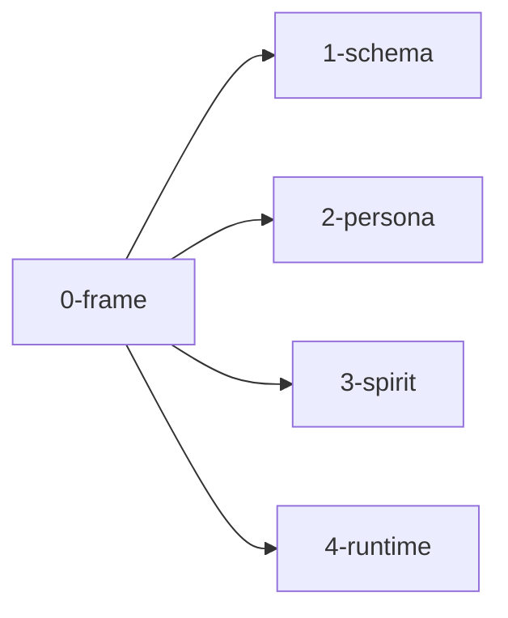

; designer
[production-readiness multi-component-audit meta-report frame schema persona spirit introspect shared-runtime triad-engine]
[Meta-report frame for the production-readiness audit dispatched 2026-06-02 per Spirit 1482. Five parallel sub-agents survey the components that need to come into production interaction now (schema; persona; spirit-next pilot; possibly more) plus cross-cutting concerns (shared runtime extraction; inter-component interaction + deployment path). Orchestrator writes overview synthesis when all sub-agents return.]
2026-06-02
designer

# 484.0 — Frame and method

## The directive (psyche 2026-06-02 + Spirit 1482)

The psyche read designer 482 (psyche report 1 on the engine mechanism). Their response: the open items in §"What's NOT yet firm" are not really problems per se — the substrate as recommended is workable. What's missing is **production-scale interaction evidence**. The AI/agents need to see what happens when multiple components actually run together — design alone is insufficient.

The directive: huge audit with sub-agents around all the projects to figure out what needs to happen to bring this into production with the new triad engine. Get a few components actually interacting. Specifically:
- **Schema** — drives upgrades; needs to be a daemon (sub-agent B's designer 481 pilot is the start).
- **Persona** — the supervisor engine that makes sure all components are running.
- **Spirit** — already piloted; production-orient it.
- Probably other really important components the psyche isn't naming.

Plus orient toward:
- Moving code into schema-macro emission as much as possible (per designer 483 — 94% per-component reduction possible).
- Maybe a shared runtime library for generic SEMA/Nexus/Signal infrastructure.
- Answering the important decisions that gate production.

## Why a meta-report (five sub-agents)

The audit scope is multi-component + cross-cutting. Single sub-agent can't hold the breadth without missing the interaction angles. Five sub-agents in parallel cover:

| Sub-agent | Scope | Output |
|---|---|---|
| A | Schema component production readiness | `1-schema-component.md` |
| B | Persona component design + production readiness | `2-persona-component.md` |
| C | Spirit component production readiness | `3-spirit-component.md` |
| D | Shared runtime library extraction | `4-shared-runtime.md` |
| E | Inter-component interaction + deployment path | `5-interaction-and-deployment.md` |

Orchestrator (main designer) synthesizes when all return.

Five nodes; 6th sub-report (5-interaction-and-deployment) + overview synthesis happen after the first four return — meta-report grows.

## Method per sub-agent

Each sub-agent works as designer-lane research/audit:
- Read AGENTS.md hard overrides + relevant skills + recent reports (467-483, operator 280-290, Spirit 1326-1482).
- Audit current state of the assigned component / cross-cutting concern.
- Identify what's needed for PRODUCTION (not pilot) interaction with other components.
- Surface the IMPORTANT DECISIONS that gate this component's production-readiness.
- Recommend the next concrete operator slice.
- Push sub-report to primary main with the meta-report path.

Common constraints (workspace hard overrides):
- READ-ONLY on code repos; no edits.
- Bracket NOTA strings; no quotation marks.
- Full English words.
- No `---` horizontal-rule lines.
- Mermaid 5-node cap per Spirit 1282.
- Variant convention per Spirit 1481: this meta-report uses `Audit-` prefix at the directory level; sub-reports are numbered internal files.

## Recurring questions the sub-agents will all answer

To make synthesis straightforward, each sub-agent answers these:

1. **What is this component (or concern) FOR in the production system?** Plain-language purpose.
2. **What's already landed?** Current state on main branches.
3. **What's the gap to production?** Specific missing pieces.
4. **What does it NEED from other components to interact?** Dependency map.
5. **What can it MOVE TO SCHEMA EMISSION?** Boilerplate extraction opportunities per designer 483.
6. **What can it MOVE TO A SHARED RUNTIME LIBRARY?** Generic infrastructure extraction.
7. **What's the operator next-slice recommendation?** Smallest meaningful step.
8. **What important DECISIONS are surfaced?** Things the psyche needs to answer to unblock.

The synthesizer (orchestrator) cross-cuts these answers into per-decision asks + per-slice operator order.

## Sub-agent dispatch shape

Each sub-agent gets:
- This frame as required reading.
- Recent context reports specific to its scope.
- Specific Spirit captures relevant to its scope.
- The recurring 8 questions above as the deliverable structure.
- Cap: 400-600 lines per sub-report.

Dispatched in background (per AGENTS.md hard override + designer protocol).

## What the overview will synthesize

`N-overview.md` (written by orchestrator after all sub-agents return) will:
- Combine the recurring-questions answers across sub-agents into a single picture.
- Surface the cross-cutting decisions (those that appear in multiple sub-reports).
- Recommend the operator slice sequence to bring components into production interaction.
- Name the specific psyche ratifications needed.
- Connect back to psyche report 1 (designer 482) and Spirit 1482 directive.

## Cross-references

- `reports/designer/482-Psyche-engine-mechanism-fundamental-decision-2026-06-02.md` — psyche report 1; the substrate this audit moves into production.
- `reports/designer/480-spirit-next-best-of-designs-pilot-2026-06-02.md` — spirit-next pilot; sub-agent C builds on.
- `reports/designer/481-schema-daemon-upgradable-runtime-pilot-2026-06-02.md` — schema-daemon pilot; sub-agent A builds on.
- `reports/designer/483-Audit-tracing-emission-completeness-2026-06-02.md` — trace emission audit; sub-agent D builds on for shared-runtime extraction.
- `reports/designer/469-introspect-component-design-2026-06-02.md` — introspect design (sub-agent E touches).
- `reports/designer/468-developed-interfaces-spirit-persona-orchestrate-2026-06-02.md` — persona + orchestrate sketches (sub-agents B + E build on).
- Spirit records 1419 (programmatic triad), 1422 (contract-repo split), 1437/1438/1439 (Nexus decision/effect language), 1469 (implementation directive), 1481 (variant convention), 1482 (production-orientation).
