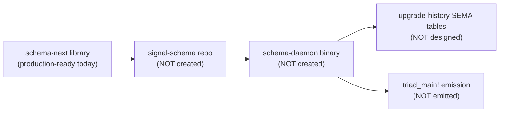

# 484.1 — Schema component production readiness

## TL;DR

The schema component answers the 8 recurring questions for the
production audit (designer 484 frame). The summary:

- **Purpose.** Schema is the editor of the architecture. Every component
  daemon's types, signal vocabulary, and storage layout descend from
  schema source; schema's own runtime is the locus where upgrades happen
  as SEMA operations on the stored Asschema (per designer 447's
  upgrade-as-SEMA design).
- **Landed.** Designer 481's pilot integrated to main. `schema-next` at
  6b34fa9 carries the typed `UpgradeObject`, `SchemaEdit` enum
  (AddField, ChangeFieldType, AddVariant), `AsschemaEdit::apply`, and
  `UpgradeObject::apply` with identity gating + per-edit receipts.
  `schema-rust-next` at 540d572 + c6ec14e carries the `MigrationEmitter`
  that renders `mod historical` + `mod current` + `impl From` per
  upgrade. The Layer 2 witness
  (`schema-rust-next/tests/upgrade_emission.rs::emitted_source_compiles_and_migrates_a_value`)
  compiles the emitted source through rustc and asserts the projection.
  Every typed object derives `rkyv::Archive` + `nota_next::NotaDecode` +
  `nota_next::NotaEncode`.
- **Gap.** No daemon binary. No `signal-schema` contract repo. No
  ordinary/owner socket pair. No NexusEngine implementation that wires
  `EditSchema(UpgradeObject)` to `AsschemaEdit::apply`. No SEMA-table
  layout for storing upgrade-receipts beside asschema. No `triad_main!`
  macro emission. No `bootstrap-policy.nota` declaring which asschemas
  the daemon owns at first start.
- **Decision (biggest).** Does upgrade-as-SEMA live in a **schema-daemon**
  (per designer 447's separate-daemon recommendation) or fold into the
  existing **upgrade triad** (U1 scaffold at `/git/.../upgrade`)?
  Designer 447 proposed separation; the pilot landed schema-side substrate
  without committing to the daemon shape. Until psyche ratifies, the
  triad scaffold sits between two interpretations — the schema-daemon
  owns the EDIT, and the upgrade-daemon owns the BUILD-COMPILE-CUTOVER.
- **Recommended next slice.** Create `signal-schema` repo + `schema-next`
  daemon binary (`schema-daemon`) implementing the triad pattern over
  the existing `AsschemaEdit` apply path. Smallest closure of the
  designer-447 vision against the substrate that already exists.

## Q1 — What is the schema component FOR in the production system?

Schema is the **editor of the architecture**. In the production system
schema serves three load-bearing roles:

1. **Architecture source-of-truth.** Every component daemon's signal
   vocabulary, Nexus envelope shape, SEMA root types, payload records,
   and trace identity objects descend from a `.schema` file via
   `schema-next` lowering. The `.schema` file is the canonical
   declaration; `Asschema` is its typed normalised form; `schema-rust-
   next` emits the Rust the component consumes.

2. **Upgrade orchestration.** Per designer 447 + Spirit 1308-1314,
   **upgrade IS SEMA operations on Asschema.** The schema-daemon
   receives `UpgradeObject` messages encoding ordered `SchemaEdit`
   operations (AddField, ChangeFieldType with WrapSingleton, AddVariant,
   etc.), applies them as SEMA writes against its stored asschemas, and
   produces both the new typed asschema AND the migration spec the
   downstream emitter consumes to derive `From<historical::T> for
   current::T` Rust. The schema-daemon is the locus where the system
   becomes self-editing.

3. **Mirror substrate** between authored NOTA and emitted Rust. The
   single-colon namespace convention (`spirit-next:signal:Frame`) maps
   mechanically to Rust module paths (`spirit_next::signal::Frame`) per
   Spirit 952. Schema owns the projection; consumers grep across either
   surface and the identifier matches.

In short: every other daemon's types come from schema-next; every other
daemon's upgrades flow through a schema-daemon that applies SchemaEdit
operations and emits migration code. Schema is the architecture's
control plane.

## Q2 — What's already landed?

Production-relevant state on main HEADs as of 2026-06-02:

### schema-next (main 6b34fa9)

`schema-next` is library-only; no daemon binary. The lib.rs re-exports
the full substrate the daemon will instantiate:

```text
mod asschema       — Asschema, Declaration, EnumDeclaration,
                     EnumVariant, FieldDeclaration, Name,
                     StructDeclaration, TypeDeclaration, TypeReference
mod engine         — SchemaEngine::lower_source, SchemaError,
                     SchemaIdentity
mod store          — AsschemaStore (redb-backed)
mod upgrade        — UpgradeObject, SchemaEdit, AsschemaEdit,
                     AddField, ChangeFieldType, AddVariant,
                     DefaultValue, FieldMigration, MigrationSpec,
                     SchemaEditReceipt, UpgradeReceipt
mod declarative    — MacroLibrary, SchemaMacro, MacroPattern, ...
mod macros         — MacroRegistry, MacroPosition
mod module         — SchemaPackage (entry resolver)
mod raw, syntax    — schema-source parsing stages
mod resolution     — ImportResolver
```

Every type in `mod upgrade` derives `rkyv::Archive`,
`nota_next::NotaDecode`, `nota_next::NotaEncode`. The Layer 2 witnesses
in `tests/upgrade_pilot.rs` exercise the apply path against real
schema-lowered Asschemas (the spirit-min fixture) and prove:

- `add_field_lands_new_field_on_target_struct`
- `change_field_type_swaps_topic_to_vector_with_wrap_singleton`
- `add_variant_extends_target_enum`
- `upgrade_object_chains_edits_and_stamps_next_identity`
- `upgrade_object_rejects_mismatched_previous_identity`

All five pass.

### schema-rust-next (main 540d572 + c6ec14e)

`schema-rust-next` is library-only; consumed by per-component
`build.rs`. Most-recently landed: `migration.rs` carrying
`MigrationEmitter`, plus a generated NexusWork/NexusAction trait emission
surface (commit 540d572 — schema-rust: emit upgrade migrations and Nexus
work action traits — but verify shape against current 287's Nexus work).

The MigrationEmitter shape:

```text
let upgrade: UpgradeObject = /* ... */;
let source: String = MigrationEmitter::new(&upgrade).emit();
```

Per-edit projection rules:

| SchemaEdit | Emitted projection line |
|---|---|
| `AddField(DefaultValue::Integer(n))` | `field_name: n_i64,` |
| `ChangeFieldType(WrapSingleton)` | `field_name: vec![previous.field_name],` |
| `AddVariant` | adds the variant to `current::T`; `historical::T` stays uninhabited; projection uses `match previous {}` (unreachable) |

The end-to-end witness in `tests/upgrade_emission.rs::emitted_source_
compiles_and_migrates_a_value` constructs an `UpgradeObject` with both
operation kinds, invokes the emitter, writes the source to a temp file,
shells out to rustc to compile a harness against the source, runs the
binary, and asserts `last_modified == 0_i64` + `score == vec![7_i64]`.
This is the strongest Layer 2 witness in the schema substrate today.

### What's NOT landed

- No daemon binary in `schema-next/src/bin/`. No `schema` CLI; no
  `schema-next-daemon` long-lived process.
- No `signal-schema` repository under `LiGoldragon`. No
  `owner-signal-schema` either. (The `signal-*` repo list I checked
  shows ~50 contract repos but no `signal-schema`.)
- No `bootstrap-policy.nota` for schema-daemon.
- No `triad_main!` macro emission in `schema-rust-next` — the
  per-component `main.rs` is still hand-written (operator 285's
  `DaemonCommand` is the interim shape).
- The `DefaultValue` variants `String`, `Boolean`, `Unit` exist in
  schema-next's typed model but the MigrationEmitter only renders
  `Integer` (per designer 481 §"What is deferred"). Mechanical extension.
- `RemoveField`, `RenameField`, `RemoveVariant`, struct↔enum migrations
  not yet implemented (also per designer 481 §"What is deferred").

## Q3 — What's the gap to production?



Five gaps; honors Spirit 1282's five-node mermaid cap.

### Gap 1 — signal-schema contract repo

Per `skills/component-triad.md` §"The shape", every triad needs:

- `signal-schema` — ordinary peer contract. Carries `EditSchema(UpgradeObject)`,
  `ObserveSchema(SchemaQuery)`, `RemoveSchema(SchemaIdentity)` requests and
  their typed replies (`SchemaEdited(UpgradeReceipt)`,
  `SchemaObserved(...)`, `SchemaRemoved(...)`).
- `owner-signal-schema` — owner-only authority contract. Carries
  `ForceAccept(UpgradeReceipt)`, `Quarantine(SchemaIdentity)`,
  `RollbackSchema(SchemaIdentity)`.

Both schemas should be authored as `.schema` files lowered through
`schema-next` itself — the schema-component's wire vocabulary is itself
schema-emitted, closing designer 447's NOTA-to-object correspondence at
the contract layer.

### Gap 2 — schema-daemon binary

`schema-next/src/bin/schema-daemon.rs` does not exist. The binary
should follow operator 285's `DaemonCommand` shape until `triad_main!`
emission lands, then collapse to a tiny macro call. The CLI half is
`schema-next/src/bin/schema.rs` — the thin Signal client per
`skills/component-triad.md` §"Component binary naming".

The daemon's listener actor receives `signal::Signal<Input>` frames,
SignalEngine triages them into `nexus::Nexus<NexusInput>`, NexusEngine
decides — for `EditSchema(UpgradeObject)`, the decision is
`CommandSemaWrite(SemaWriteInput::UpgradeAsschema(UpgradeObject))` —
SemaEngine.apply loads the previous Asschema by `previous_identity`,
calls `UpgradeObject::apply(&previous)`, writes the new Asschema to the
store + appends an `UpgradeReceipt` to the upgrade-history table,
returns the receipt. NexusEngine translates the SEMA reply back to
`signal::Signal<Output>`. The whole flow is operator 285's
DaemonCommand shape against `AsschemaEdit::apply` already living in
schema-next.

### Gap 3 — upgrade-history SEMA tables

`AsschemaStore` today stores rkyv-archived `Asschema` bytes keyed by
`AsschemaStoreKey` (schema identity). The schema-daemon needs:

- An **upgrade-history table** keyed by `SchemaIdentity` →
  `Vec<UpgradeReceipt>`, recording every applied upgrade in order. Per
  designer 447 §"Open design questions" #7 — the migration history's
  grain is per-edit (the `UpgradeReceipt` itself records that grain).
- A **schema-version-event log** (the active-version event log named
  in `upgrade/ARCHITECTURE.md`). Same shape; lives in the schema-daemon
  if the schema-daemon owns upgrade authority, OR lives in the upgrade-
  daemon if the upgrade triad owns it.

The split between schema-daemon and upgrade-daemon (designer 447
proposed them as separate components) is the load-bearing decision —
see Q8 §"Decision 1".

### Gap 4 — triad_main! macro emission

Per Spirit 1419 + designer 482 §"Stage 3": daemon `main` should
collapse to `triad_main!(SignalActor, Nexus, Store)`. The macro lives
in `schema-rust-next` and emits the runner loop per designer 482 §"The
runner loop". Today the runner is hand-written (operator 285's
DaemonCommand). The macro lands as part of the workspace-canonical
substrate; schema-daemon adopts it the same as every other component.

### Gap 5 — bootstrap policy

Per `skills/component-triad.md` §"Invariant 5", every triad daemon has
a `bootstrap-policy.nota` declaring policy-state seeds. For
schema-daemon, bootstrap holds:

- Which asschemas the daemon owns at first start (e.g. the workspace's
  built-in `spirit-next`, `nota-next`, `schema-next`, `signal-frame`
  schemas).
- The minimal upgrade history (typically empty — every component
  starts at version 0.1.0 with no upgrades applied).

## Q4 — What does schema NEED FROM OTHER COMPONENTS to interact?

The schema-daemon participates in the workspace's triad mesh through
Signal contracts with these peers:

| Peer | Direction | What schema needs |
|---|---|---|
| `upgrade-daemon` (proposed) | bi-directional | Subscribe to schema-daemon's `SchemaEdited` event stream; in return, upgrade-daemon's BUILD-COMPILE-CUTOVER orchestration acts on receipts schema-daemon emits. |
| `persona-daemon` (engine-manager) | schema-side as Signal client | When the upgrade pipeline accepts a new schema, persona-daemon needs to spawn the new daemon binary. Schema-daemon emits this through `signal-persona`. |
| `signal-frame` / `nota-next` | library-only | Universal substrate; not a Signal peer. |
| Per-component daemons (`spirit-next`, `persona-mind`, etc.) | downstream | After schema-daemon edits, the per-component daemon needs the new emitted Rust. Today this is build-system, not signal — the per-component build.rs reads asschema. Production: per-component daemons may subscribe to `SchemaEdited(identity)` for their own identity to know when to request a re-spawn through persona. |

**Critical dependency on signal-frame.** Schema-daemon's wire surface
is rkyv-encoded signal-frame frames per `skills/component-triad.md`
Invariant 2. The signal-frame crate is already production-ready (per
operator/cluster work in 2026-05); schema-daemon adopts it the same as
every other component.

**Critical dependency on nota-next.** Every UpgradeObject etc. derives
`nota_next::NotaDecode`+`NotaEncode`. Already production-ready.

**No dependency on persona-mind in initial slice.** The schema-daemon
can stand alone for the EDIT operation — the persona/upgrade cooperation
is downstream of the EDIT. First-slice schema-daemon serves
EditSchema and ObserveSchema over signal-frame against its own
AsschemaStore.

## Q5 — What can schema MOVE TO SCHEMA EMISSION? (recursive)

This is the recursive question — schema's own runtime code emitted from
schema. Per designer 483 §"Q1": the workspace already emits a substantial
amount of the per-component runtime from `schema-rust-next`. For schema-
daemon specifically, the additional emission opportunities:

### Recursion 1 — Signal/Nexus/SEMA traits for the schema-daemon itself

Once `signal-schema/schema/lib.schema` is authored, `schema-rust-next`
emits:

```text
signal::Input  = EditSchema(UpgradeObject) | ObserveSchema(Query) | RemoveSchema(Identity)
signal::Output = SchemaEdited(UpgradeReceipt) | SchemaObserved(...) | SchemaRemoved(...) | Error | Rejected
nexus::*       = NexusInput / NexusOutput per operator 287
sema::*        = SemaWriteInput / SemaWriteOutput / SemaReadInput / SemaReadOutput
namespace      = UpgradeObject, SchemaEdit, AddField, ChangeFieldType, AddVariant, ...
                 — IMPORTED from schema-next via colon-path
                 imports (`schema-next:upgrade:UpgradeObject` etc.)
```

The 600+ lines of generated trait code for each plane appears in
`schema-next/src/schema/lib.rs` like every other component.

### Recursion 2 — UpgradeObject NOTA codec

Already covered — the typed objects derive `NotaDecode`+`NotaEncode` via
`nota-next`. Per Spirit 1312's NOTA-to-object correspondence, the wire
form `(EditSchema (UpgradeObject ... (AddField Entry lastModified
Integer (DefaultValue 0)) ...))` round-trips via the derive without any
hand-written parser code. This is already production-shape.

### Recursion 3 — Per-edit projection in MigrationEmitter

Each `SchemaEdit` variant has a fixed emission template. Per designer
481, today the emitter is hand-written rust matching `SchemaEdit`
variants. The recursive opportunity:

- The `FieldMigration` variants (`WrapSingleton`, `SetDefault`) each
  map to a one-line emission template (`vec![previous.X]` or
  `default_value.into()`). The templates are schema-data themselves —
  a `MigrationEmissionSchema` declaring per-variant emission rules
  could land in `schema-next/schemas/migration-emission.schema`, with
  schema-rust-next reading that schema to drive emission instead of
  matching enum variants in hand-written Rust.
- Pros: adding a new FieldMigration variant becomes a schema edit, not
  a Rust edit.
- Cons: another layer of indirection; the current hand-written shape
  is small and direct.

Recommended: defer. The 4-5 FieldMigration variants the workspace will
ever need are well-bounded; making them schema-data adds complexity
without proportional clarity benefit. Reconsider when the variant count
grows past 10.

### Recursion 4 — Self-editing closure

Per Spirit 1312/1314 + designer 447 §"The NOTA correspondence closure":
the schema-daemon's OWN `signal-schema/schema/lib.schema` is editable
by the schema-daemon. When `(EditSchema (UpgradeObject ... (AddVariant
SchemaEdit Reflection) ...))` arrives, the daemon edits its own
asschema, schema-rust-next re-emits its Rust, the daemon is recompiled,
the new binary is spawned with the new types. **The system has self-
edited.**

This closure is the eventual production shape but should NOT be the
initial slice. Per designer 447 §"Open design questions" #2,
self-editing introduces bootstrap problems (a broken edit can brick
the daemon). The initial slice handles edits to OTHER components'
schemas; self-editing lands behind a quarantine + rollback substrate.

## Q6 — What can move to a SHARED RUNTIME LIBRARY?

Per designer 483's tracing-emission audit, much of the trace + runtime
substrate is currently per-component hand-writing. Schema-daemon will
need the same surfaces as `spirit-next`:

| Surface | Shared? | Where it should live |
|---|---|---|
| `TraceLog` (sink + recording + socket dispatch) | YES | `trace-next` crate (proposed by designer 483 §"Concept 3") |
| `TraceSocketListener` + rkyv-framed I/O | YES | `trace-next` crate |
| `Configuration` with trace-socket path | YES | `triad-runtime` crate or `trace-next` |
| Daemon `engine()` wiring with trace injection | YES | macro-emitted via `triad_main!` |
| CLI `TraceOutput` harness | YES | `trace-next` crate |
| `Configuration` parsing for the single-argument rule | YES | `triad-runtime` crate |
| Socket listener startup, shutdown handling | YES | `triad-runtime` crate |
| `DaemonCommand` from operator 285 | YES | `triad-runtime` crate (the macro emits a call to it) |
| `AsschemaStore` SEMA persistence | partly | The redb `apply`/`observe` wrapping pattern is reusable; the schema-specific table layout stays in schema-next |
| `MigrationEmitter` itself | NO | Stays in schema-rust-next (schema-specific) |

Per designer 483 §"Concept 3" — the proposed `trace-next` crate carries
the trace runtime substrate. A sibling `triad-runtime` crate could carry
the non-trace substrate (signal-frame socket listener, configuration
parsing, lifecycle handling). Both feed into the `triad_main!` macro
that emits the daemon main from schema.

**Recommendation: extract `triad-runtime` first, then `trace-next`, then
emit `triad_main!`** — landing the shared substrate before the macro
lets the macro target real library code rather than emit-everything-
inline.

Schema-daemon as a consumer is the natural pilot for the extraction:
it's the second component daemon after spirit-next, so the extraction
serves two components from inception rather than one with a planned
second-consumer.

## Q7 — Operator next-slice recommendation

**Slice S1: signal-schema scaffold + schema-daemon entry point.** One
operator-week. The smallest slice that proves the triad shape against
the substrate that already exists on main.

| Step | Action | Notes |
|---|---|---|
| 1 | Create `signal-schema` repo under `LiGoldragon`. Initial `schema/lib.schema` declares `signal::Input = [(EditSchema UpgradeObject) (ObserveSchema SchemaQuery)]` + `signal::Output = [(SchemaEdited UpgradeReceipt) (SchemaObserved ObservedAsschemas) (Error ErrorReport) (Rejected SignalRejection)]` + namespace importing UpgradeObject + SchemaQuery + ObservedAsschemas from `schema-next:upgrade:*`. | The contract is itself schema-emitted — closes designer 447's correspondence at the wire. |
| 2 | Create `owner-signal-schema` repo. Initial owner contract: `[(ForceAccept UpgradeReceipt) (RollbackSchema SchemaIdentity) (QuarantineSchema SchemaIdentity)]`. | Per `skills/component-triad.md` Invariant 4. |
| 3 | Add `schema-next/src/bin/schema.rs` (CLI) + `schema-next/src/bin/schema-daemon.rs` (daemon). Both single-argument per `skills/component-triad.md` §"Single argument rule". | The daemon follows operator 285's `DaemonCommand` shape — NOT the not-yet-emitted `triad_main!` macro. |
| 4 | Add `schema-next/schema/lib.schema` declaring the schema-daemon's own Input/Output/Nexus/Sema planes, importing from `signal-schema:lib`. Wire `build.rs` to lower + emit via `schema-rust-next`. | The schema-daemon's runtime is schema-emitted from inception. |
| 5 | Implement `SchemaSemaEngine` on a data-bearing `SchemaStore` noun wrapping `AsschemaStore`. The `apply` method matches on `SemaWriteInput::UpgradeAsschema(UpgradeObject)` → loads previous Asschema by identity → calls `UpgradeObject::apply(&previous)` → writes new asschema + appends UpgradeReceipt to a new `upgrade-history` table → returns `SemaWriteOutput::AsschemaUpgraded(UpgradeReceipt)`. | The work is wiring the substrate that already exists in `schema-next::upgrade`. No new edit operations. |
| 6 | Implement `SchemaNexusEngine::decide` translating `SignalArrived(EditSchema(...))` to `CommandSemaWrite(UpgradeAsschema(...))` and `SemaWriteCompleted(AsschemaUpgraded(...))` to `ReplyToSignal(SchemaEdited(...))`. ObserveSchema similar. | Per operator 287's NexusWork/NexusAction vocabulary. |
| 7 | Implement `SchemaSignalEngine::triage_inner` admitting both UpgradeObject and SchemaQuery requests, with the standard `Rejected(SignalRejection)` shape for malformed frames. | Standard Signal triage; per the trait emission already shipping. |
| 8 | Witness test: send NOTA-encoded `(EditSchema (UpgradeObject spirit-min@0.1.0 spirit-min@0.2.0 [(AddField Entry lastModified Integer (DefaultValue 0))]))` to the daemon over signal-frame; receive `(SchemaEdited (UpgradeReceipt ...))`; verify the new Asschema persisted; emit migration via `MigrationEmitter`; compile via rustc. | Layer 2 process-boundary witness; the strongest production-shaped test. |

**SCOPE GUARD.** This slice does NOT:

- Build a new binary or do cutover orchestration (that's upgrade-
  daemon work).
- Emit `triad_main!` (that's the next dependent slice).
- Extract `triad-runtime` shared library (that's a parallel slice that
  benefits from being co-developed with the schema-daemon, but doesn't
  block this slice if `schema-daemon` reuses the operator 285
  `DaemonCommand` shape).
- Implement self-editing closure (designer 447 §"Open design questions"
  #2 — defer).

**The single load-bearing witness for slice S1**: a NOTA-encoded
UpgradeObject crosses signal-frame, is applied to a real AsschemaStore,
returns a typed UpgradeReceipt, and the receipt's migration_spec drives
real Rust compilation. **Same shape as designer 481's compile-and-
migrate witness, but with the daemon socket in the middle.**

## Q8 — Important DECISIONS surfaced

The audit surfaces these decisions for psyche ratification or designer
follow-up:

### Decision 1 — schema-daemon vs upgrade-daemon

**Question:** Does upgrade-as-SEMA live in the **schema-daemon** or
fold into the existing **upgrade triad** (U1 scaffold at
`/git/.../upgrade`)?

Designer 447 §"Two parallel daemons" proposed SEPARATE components:
schema-daemon owns the EDIT (apply UpgradeObject → stored Asschema +
UpgradeReceipt); upgrade-daemon owns BUILD-COMPILE-CUTOVER (consume
UpgradeReceipt → invoke nix build → spawn new daemon → run tests →
accept/reject).

The pilot (designer 481) landed the EDIT substrate without committing to
the daemon split. Either resolution works against the current
substrate, but each implies different downstream slicing:

| Option | Implication |
|---|---|
| Separate schema-daemon + upgrade-daemon | Two new daemons. signal-schema + signal-upgrade contracts (signal-upgrade already scaffolded). Upgrade triad becomes the test-and-cutover pipeline. |
| Merged into upgrade triad | One daemon. signal-upgrade carries EditSchema variants. Schema-next stays library-only forever. Upgrade triad's ARCHITECTURE.md §"Pending schema-engine upgrade" pulls all upgrade authority into one place. |

**Recommended:** SEPARATE per designer 447, but explicitly ratified by
psyche before slice S1 lands. The split keeps each daemon focused
(schema-daemon = editor of schemas; upgrade-daemon = orchestrator of
production cutover); the merged shape couples concerns that have
different rates of change.

### Decision 2 — when to extract `triad-runtime` + `trace-next`

Per designer 483 §"Concept 3": a shared runtime library would
collapse ~355 lines of mechanical per-component boilerplate to ~5 lines
of macro call. The question is timing:

- **Extract first** — land `triad-runtime` + `trace-next` before
  schema-daemon ships, so schema-daemon adopts the shared substrate
  from inception. Higher up-front cost; cleaner downstream.
- **Extract after** — schema-daemon ships with the same hand-written
  shape as spirit-next; extract once two consumers exist. Lower
  up-front cost; one refactor later.

**Recommended:** Extract FIRST, in parallel with slice S1's contract
creation. The schema-daemon's `Configuration`, daemon listener,
DaemonCommand-like entry point are all duplicates of spirit-next today;
the extraction takes existing code and consolidates it. The parallel
schema-daemon contract work + triad-runtime extraction are independent
slices that can land separately.

### Decision 3 — should the schema-daemon edit its own schema?

Per Spirit 1312 + 1314 + designer 447 §"Open design questions" #2:
self-editing closure is the goal but introduces bootstrap risk. A
broken edit to the schema-daemon's own schema can brick the daemon.

**Recommended:** Land slice S1 WITHOUT self-editing. The schema-daemon
edits OTHER components' schemas. Self-editing is added as a separate
slice with explicit quarantine + rollback substrate per designer 447
§"Open design questions" #5.

### Decision 4 — authority on EditSchema operations

Per `skills/component-triad.md` Invariant 4: who can call
`EditSchema(UpgradeObject)`?

- **Owner socket only** — only the schema-daemon's owner (the entity
  above it in the workspace's owner graph) can edit schemas. This is
  the conservative default.
- **Ordinary socket** — any authenticated peer can edit schemas. Tempts
  more flexible workflows but invites edits from unprivileged peers.

**Recommended:** Owner socket per default. Ratify with psyche. The
ordinary socket carries Observe + Help operations.

### Decision 5 — slice S1 first or slice triad-runtime first?

If Decision 2 says "extract triad-runtime FIRST", slice S1 depends on
triad-runtime's existence. The integration cost is ~3-5 hours of work
porting spirit-next's DaemonCommand pattern into triad-runtime. The
question is operator capacity / priority.

**Recommended:** Author the slice S1 brief assuming triad-runtime
EXISTS, with a fallback to operator 285's DaemonCommand shape if
triad-runtime extraction is in flight. Operator chooses based on
parallel-work coordination.

## Cross-cutting observations

The schema-component audit surfaces these workspace-wide observations:

**Observation 1 — the substrate is denser than the audit makes visible.**
Schema-next at main carries the full `Asschema` + `AsschemaArtifact` +
`AsschemaStore` + `MacroLibrary` + `SchemaPackage` + `ImportResolver`
substrate beyond just the upgrade pilot. Every piece is production-
ready as a library; what's NOT production-ready is the daemon
packaging. The library is the right shape; the triad packaging is the
gap.

**Observation 2 — the upgrade triad and schema-daemon ARE the same
substrate with different binding decisions.** Both designer 447 and
this audit's Q3+Q8 surface the same question: does the daemon own EDIT
+ TEST + BUILD + CUTOVER as one unit, or is the EDIT separable from
TEST+BUILD+CUTOVER? The pilot lands neutral. The psyche ratification
on Decision 1 determines whether the upgrade triad expands (merged) or
schema-daemon stands beside it (separate).

**Observation 3 — the workspace is migrating from build-time emission
to runtime emission.** Today every component's `build.rs` invokes
`schema-rust-next::RustEmitter` to produce `src/schema/lib.rs`. The
schema-daemon — when it lands — owns runtime emission: it receives
UpgradeObject + applies + emits NEW source that the upgrade-daemon
compiles. The build-time emission stays for first-build; runtime
emission handles every upgrade after that. Both paths use the same
`MigrationEmitter` + `RustEmitter`.

**Observation 4 — the schema-component is closer to production than any
non-spirit component.** Spirit-next is the workspace's pilot (Slice 1
of the designer-operator loop per `skills/designer.md` §"Slice 1").
Schema-component, with the just-landed upgrade pilot, is the natural
SECOND component on the substrate. The remaining work (signal-schema
contract + daemon binary + sema upgrade-history table + triad-runtime
extraction) follows the same shape as spirit-next without inventing new
patterns.

## Cross-references

- Designer 447 (`reports/designer/447-upgrade-as-sema-design-2026-06-01.md`)
  — the design substrate this audit measures progress against. Sections
  cited: §"Two parallel daemons", §"Open design questions" #2 + #5 +
  #7, §"The NOTA correspondence closure".
- Designer 481 (`reports/designer/481-schema-daemon-upgradable-runtime-
  pilot-2026-06-02.md`) — the pilot that integrated to main. §"What
  landed" + §"What is deferred" lists the live state.
- Designer 482 (`reports/designer/482-Psyche-engine-mechanism-
  fundamental-decision-2026-06-02.md`) §"Stage 3" — the workspace-
  canonical engine substrate this audit assumes schema-daemon adopts.
- Designer 483 (`reports/designer/483-Audit-tracing-emission-
  completeness-2026-06-02.md`) §"Concept 3" — the trace-next +
  triad-runtime extraction this audit's Q6 assumes.
- Designer 484.0 (`reports/designer/484-Audit-production-readiness-
  meta-2026-06-02/0-frame-and-method.md`) — the meta-report frame this
  sub-agent answers.
- Operator 281 (`reports/operator/281-generated-interface-logic-with-
  macros-2026-06-02.md`) — the current generated trait surface
  schema-daemon will adopt.
- Operator 285 (`reports/operator/285-triad-runner-intent-spread-and-
  implementation-2026-06-02.md`) — the `DaemonCommand` shape schema-
  daemon will adopt until `triad_main!` lands.
- `skills/component-triad.md` §"The shape" + §"The single argument
  rule" + §"Invariant 4" + §"Invariant 5" — the discipline schema-
  daemon adopts.
- `skills/architectural-truth-tests.md` §"Layer 2" — the witness
  discipline slice S1's load-bearing test follows.
- Spirit records 1308-1314 (upgrade IS SEMA; schema daemon is editor;
  transitory-database; etc.) + 1326-1336 (engine traits) + 1419
  (triad_main macro) + 1469 (psyche authorisation for pilot) + 1482
  (production-orientation directive).
- `/git/github.com/LiGoldragon/schema-next` main 6b34fa9 — the library
  substrate. `/git/github.com/LiGoldragon/schema-rust-next` main
  540d572 + c6ec14e — the emitter substrate.
- `/git/github.com/LiGoldragon/upgrade/ARCHITECTURE.md` §"Pending
  schema-engine upgrade" — the upgrade-triad self-pointer at this
  cutover.

## For the psyche

Schema-component as a LIBRARY is production-ready. Schema-component as
a TRIAD DAEMON is shape-of-daemon: the substrate exists on main but
the daemon binary + signal-schema contract + SEMA upgrade-history table
don't yet. The biggest decision the audit surfaces is whether the
upgrade-as-SEMA work lives in a new schema-daemon (designer 447's
proposal) or folds into the existing upgrade triad (currently a U1
scaffold). The recommended next operator slice is one operator-week:
create `signal-schema` + `owner-signal-schema` contract repos + add the
daemon binary in `schema-next` wiring the existing `AsschemaEdit::apply`
substrate through signal-frame. The strongest single load-bearing
witness is a Layer 2 process-boundary test: NOTA-encoded UpgradeObject
crosses signal-frame to the daemon, the daemon applies it to a real
AsschemaStore, the response carries a typed UpgradeReceipt, and the
receipt's migration_spec drives real rustc compilation. Same shape as
designer 481's compile-and-migrate witness, with the daemon socket in
the middle.
