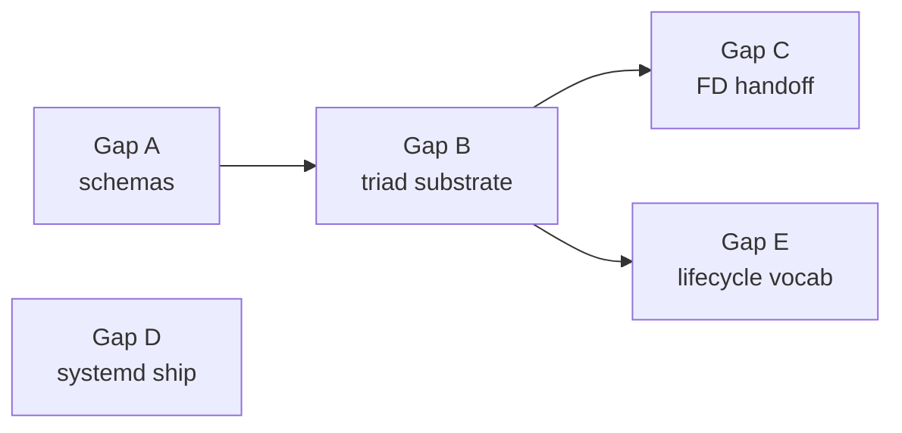

; designer
[production-readiness persona-component supervisor-engine engine-management systemd-units fd-handoff schema-emission shared-runtime triad-engine design-heavy]
[Sub-agent B report on the PERSONA component for the production-readiness audit (Spirit 1482). Persona is the host-level engine-management daemon — the supervisor that keeps every other component running. Design-heavy because the daemon source today carries hand-written Operation/Reply types plus a kameo EngineManager + EngineSupervisor; nothing schema-driven; no triad-engine shape; the new contract surface is concept-only. Answers the 8 recurring questions, sketches the missing schema surfaces, names what moves to schema emission and to shared runtime, recommends the operator next-slice, surfaces load-bearing decisions for psyche ratification.]
2026-06-02
designer

# 484.2 — Persona component production readiness

## TL;DR

PERSONA is the host-level engine-management daemon — the supervisor that
keeps every other component daemon alive, reachable, healthy, and on the
right version. Psyche intent settled (Spirit 215, 216, 238, 239, 240,
246, 252, 258, 260, 1482): one privileged `persona-daemon` per host
supervises N engine instances; each engine carries its own component
federation; Persona owns the stable public socket per component and
orchestrates lossless cutover via SCM_RIGHTS FD-handoff; production uses
systemd template units.

Current state: substantial Rust runtime exists on `persona` repo main
(`EngineManager` kameo actor + `EngineSupervisor` + `ManagerStore`
event-log + reducer snapshots + `ComponentUnitManager` with systemd
backends + sandbox direct-fork + orphan detection). Architecture
documented in 1798-line `ARCHITECTURE.md`. But the wire contracts are
NOT schema-driven: `signal-persona` is a retired compatibility shim;
`owner-signal-persona/schema/*.concept.schema` and
`signal-engine-management/schema/*.concept.schema` are concept-stage
30-40-line markers; the live runtime uses hand-written enums imported
from the shim.

Production gap to the triad-engine substrate (designer 482): no
schema-defined SignalEngine / NexusEngine / SemaEngine triad; no
NexusWork/NexusAction; no schema-emitted traits; no macro-generated
runner loop. The hand-rolled supervisor machinery is in
operator-territory shape (kameo, actor mailboxes, event log) but
parallel to the new substrate rather than on it.

Biggest design decision: **Persona itself runs on the triad-engine
substrate — the supervisor is a daemon following the same Signal +
Nexus + SEMA pattern as every component it supervises.** Persona's SEMA
is the manager event log + snapshots; its Nexus owns
supervision-decision logic (start, stop, orphan-relaunch,
restart-decide, FD-handoff route, quarantine); its Signal is
owner-signal-persona + signal-engine-management. Substrate's recursion
applied to its own supervisor.

Recommended operator next-slice: develop `owner-signal-persona.schema`
from concept to ship-this-slice (~4 operations); refactor existing
EngineManager + ManagerStore into trait impls against schema-emitted
Engine traits; end-to-end witness with Persona supervising one
spirit-next daemon in the sandbox.

## Section 1 — What persona is FOR

**Persona is the supervisor engine that makes sure every other
component daemon is running, healthy, on the right version, and
reachable through a stable client socket.** Five intertwined
responsibilities:

1. **Lifecycle ownership** — spawn components in canonical order
   (`sema-upgrade → mind → orchestrate → router → harness → terminal
   → message → introspect → spirit` per Spirit 260 + ARCH 1.7.1);
   child handles, stop ordering, restart policy, orphan detection on
   manager restart.
2. **Engine federation** — one Persona host supervises N engine
   instances; each engine has its own component federation;
   engine-id-scoped resources (`/var/lib/persona/<engine-id>/...`)
   keep members isolated.
3. **Stable client socket + FD-handoff** — Persona binds the stable
   public socket per component; clients connect once; Persona accepts
   and hands FDs to active-version daemon via SCM_RIGHTS; same socket
   model dev and prod; Persona is OFF the byte path after handoff
   (Spirit 252, 258).
4. **Process-lifecycle participant in upgrades** — per ARCH 1.6.7
   upgrade-handover negotiation lives in the upgrade triad (Spirit
   318); Persona's role is start/stop/restart/observe versioned units
   while the upgrade daemon drives the handshake.
5. **Health + orphan observability** — manager event log
   (`engine-events` in `manager.redb`) with three reducer-derived
   snapshots (`engine-lifecycle-snapshot`, `engine-status-snapshot`,
   `manager.active-version-snapshot`); orphan detection on restart
   appends `ComponentOrphaned` events for spawn-without-ready pairs.

Persona is NOT cognitive (per `persona/INTENT.md`: *"the supervisor's
higher permission is infrastructure-shaped, not cognitive"*). Spirit is
the cognitive apex. Persona is NOT the upgrade orchestrator post-Spirit
318. Persona is NOT a router — owns FD-handoff but does not look at
frame contents.

## Section 2 — What's already landed

### Persona daemon source

The `persona` repo carries substantial hand-written runtime
(~3000 lines source + 17 test files):

| File | Role |
|---|---|
| `src/manager.rs` (381 lines) | `EngineManager` kameo actor handling `signal_persona::engine::Operation` |
| `src/supervisor.rs` (396 lines) | `EngineSupervisor` + prototype supervision flow |
| `src/unit.rs` (930 lines) | `ComponentUnit` + `ComponentUnitManager` + systemd-D-Bus + transient-unit + sandbox controllers |
| `src/manager_store.rs` | `manager.redb` event log + reducer pipeline |
| `src/transport.rs` | `ComponentHandoffEndpoint` + `ComponentHandoffRouter` + SCM_RIGHTS substrate |
| `src/readiness.rs`, `src/supervision_readiness.rs` | Component-socket reachability + supervision-channel probes |
| `src/launch/` | `EngineLaunchConfiguration` + Nix-resolved command catalog |
| `src/direct_process.rs` | Sandbox-only direct-fork launcher |

What works: sandbox `EngineSupervisor` starts a prototype set of
components and verifies socket binding + engine-management channel
announce. `EngineManager` handles `Query` / `Start` / `Stop` /
`Launch` (currently rejected) / `Retire` / `Tap` (rejected as
`ComponentNotManaged`). `ManagerStore` opens redb, appends
`EngineEvent`, runs three reducers, rebuilds snapshots from the event
log on open, detects orphans, hydrates `EngineState`. `ComponentUnit`
projects to `persona-component@<component>:<version>.service` template
instance. FD-handoff substrate plumbed in code but not exercised
end-to-end with two versions side-by-side.

### Persona wire contracts (concept stage)

The contract repos are NOT schema-driven today:

- **`signal-persona`** is a **retired compatibility shim** per
  `signal-persona/ARCHITECTURE.md`. Re-exports legacy names
  (`Operation`, `Reply`, `EngineCatalog`, `ComponentName`,
  `ComponentStartup`, etc.) so older consumers compile during
  migration. New contracts split between `owner-signal-persona` and
  `signal-engine-management`.
- **`owner-signal-persona`** carries a 35-line
  `owner-signal-persona.concept.schema`. Declares `Engine [Launch
  Retire Query]`, `Component [Start Stop Query]`, `Selector
  [ActiveVersion]` operation roots but no developed payload schemas,
  no Nexus or SEMA plane.
- **`signal-engine-management`** carries a 34-line concept schema.
  Declares `Lifecycle [Announce Ready Stop]`, `Health [Report]`,
  `Spawn [Envelope]`. No payload development.

Both schema files end with `[(Version 0 1) (Status Concept)]` — they
are concept-marker artifacts, not developed shape.

### Persona ARCHITECTURE.md

1798 lines — most exhaustive ARCH in workspace. Covers engine-manager
model, filesystem-ACL trust, ConnectionClass + MessageOrigin, channel
choreography, owner sockets, cross-engine routes, persona as
process-lifecycle participant in upgrades, startup strategy with
manager state snapshot reducers, FD-handoff endpoint, multi-engine
substrate, anti-pattern catalogue.

The ARCH is dense and load-bearing; the gap is between ARCH shape
(substantial) and code-realized shape (substantial but
parallel-to-substrate) and contract-realized shape (concept-marker
only).

| Layer | State |
|---|---|
| Psyche intent | Settled (multiple Maximum-certainty records) |
| Architecture | Settled and documented (1798 lines) |
| Code runtime | Substantial hand-written kameo runtime parallel to triad-engine substrate |
| Wire contracts | Retired shim + 2 concept-stage schema files; nothing schema-driven |
| Triad-engine fit | None today — no Signal/Nexus/SEMA traits, no NexusWork/NexusAction, no schema-emitted runner |
| Production interaction | None today — sandbox-only |

## Section 3 — Gap to production

Five gaps in operator-pickup-shape order:

**Gap A — Schema source for the developed Persona wire surface.**
`owner-signal-persona/schema/lib.schema` (or
`owner-signal-persona.schema`) needs expansion from concept-marker to
developed shape with payload types, Nexus and SEMA planes per record
982, Help variant auto-injection per Spirit 1396. Same for
`signal-engine-management/schema/lib.schema`.

**Gap B — Schema-driven triad-engine substrate inside the daemon.**
Current `EngineManager` predates engine-trait architecture (Spirit
1326-1336) and NexusWork/NexusAction (Spirit 1437-1438, operator 287).
Needs SignalEngine impl (triage), NexusEngine impl (supervisor
decisions), SemaEngine impl (durable single-writer port of
ManagerStore). Current `handle_request` is essentially Signal→SEMA
projection with no real Nexus decision (similar shape to spirit-next's
pre-1389 state).

**Gap C — FD-handoff under schema-driven substrate.** `src/transport.rs`
exists but is not wired into the supervised production path. Need
stable per-component public socket, per-component control socket where
active-version daemon registers + receives FDs, handoff loop test that
FDs survive an active-version flip.

**Gap D — Systemd integration tested against real systemd.**
`SystemdTransientUnitController` exists; needs Persona shipped as
`persona-daemon.service`, template unit
`persona-component@<component>:<version>.service` declared in
CriomOS-pkgs or persona's nix output, restart policy /
readiness/watchdog / journald / cgroup tested under real systemd.

**Gap E — Engine-management ordinary lifecycle vocabulary.**
`signal-engine-management` developed schema carries typed
`SpawnEnvelope` (per ARCH 1.7), `Announce` / `Ready`, `HealthReport`
(push), `Stop` (graceful), `Subscribe` (push per
`skills/push-not-pull.md`).

The gaps compose: A's schemas drive B's daemon refactor; B's substrate
hosts C's handoff loop; D ships the production binary; E completes
the manager↔supervised lifecycle vocabulary.



Five nodes; honors Spirit 1282.

## Section 4 — Dependencies on other components

Persona touches every component structurally. Dependency is
asymmetric: Persona depends on others for typed surfaces; others
depend on Persona for being kept alive.

- **From schema (sub-agent A).** Schema-emitted Engine traits from
  `owner-signal-persona` + `signal-engine-management` + future
  `persona-supervisor.schema`. Schema versions on every contract so
  Persona knows which version each supervised component runs (drives
  handover handshake + FD-handoff active-version selection). Typed
  `UpgradeObject` flowing through upgrade triad (designer 481).
- **From upgrade triad.** `upgrade::Target` records carrying the
  four-socket addresses + component + main/next version labels.
  Upgrade daemon issues `AttemptHandover`; Persona reacts with
  `StartComponentUnit(component, next)` to bring next-version up.
- **From spirit (per-engine substrate).** Each engine has its own
  `spirit.redb` under `/var/lib/persona/<engine-id>/spirit.redb`
  (Spirit 260). Persona allocates the path; spirit-daemon opens at
  assigned location. Optional audit-trail intent records when
  Persona's owner authorizes sensitive operations.
- **From introspect (Spirit 1398 trace destination).** Persona spawns
  introspect early (position 8). Every supervised component then fans
  trace events to it; Persona's own supervisor decisions emit trace
  via engine-trait `trace_*` methods (Spirit 1365).
- **From every supervised component.** `Announce` on
  engine-management socket; `Ready` push when reachable;
  `HealthReport` push lifecycle events; `Stop` ack and clean exit
  observation via watcher tasks.

## Section 5 — Move to schema emission

### owner-signal-persona — developed shape (sketch)

The owner authority surface expands from concept-marker
(Engine/Component/Selector roots) to a developed 8-variant Input root.
Compact sketch:

```nota
{}
[
  (LaunchEngine LaunchEngineRequest)
  (RetireEngine RetireEngineRequest)
  (StartComponent StartComponentRequest)
  (StopComponent StopComponentRequest)
  (RestartComponent RestartComponentRequest)
  (Quarantine QuarantineRequest)
  (Query EngineQuery)
  (Subscribe EngineChangeSubscription)
]
[
  (EngineLaunched LaunchReceipt)
  (ComponentStarted ComponentStartReceipt)
  (ComponentStopped ComponentStopReceipt)
  (StatusReported StatusReport)
  (SubscriptionOpened SubscriptionHandle)
  (Error ErrorReport)
  (Rejected SignalRejection)
]
{
  NexusInput [(Signal Input) (SemaWrite SemaWriteOutput) (SemaRead SemaReadOutput)]
  NexusOutput [(SemaWrite SemaWriteInput) (SemaRead SemaReadInput)
               (Signal Output) (Spawn SpawnOperation) (HandoffRoute HandoffRouteOperation)]

  SemaWriteInput [
    (RecordEngineLaunched EngineLaunchedEvent)
    (RecordComponentSpawned ComponentSpawnedEvent)
    (RecordComponentReady ComponentReadyEvent)
    (RecordComponentExited ComponentExitedEvent)
    (RecordComponentOrphaned ComponentOrphanedEvent)
    (RecordHealthReport ComponentHealthEvent)
    (RecordActiveVersion ActiveVersionEvent)
    (RecordQuarantine QuarantineEvent)
  ]
  SemaReadInput [
    (LookupEngine EngineIdentifier) (QueryEngines EngineFilter)
    (LookupComponent ComponentReference) (QueryComponents ComponentFilter)
    (LookupActiveVersion ComponentReference) (SummarizeStatus StatusSummaryRequest)
  ]

  ComponentReference { engine EngineIdentifier component ComponentName }
  ComponentHealth [Starting Running Degraded Stopped Failed]
  ComponentProcessState [Launched Ready Stopping Exited]
  RestartPolicy [Never OnFailure Always]

  SpawnOperation { reference ComponentReference version Version envelope SpawnEnvelope }
  HandoffRouteOperation { reference ComponentReference incoming FileDescriptor activeVersion Version }
}
```

Payload records (`LaunchReceipt`, `StatusReport`, `EngineSnapshot`,
`*Event` types, etc.) follow the same shape, bottom out in
`Timestamp Integer` + `DatabaseMarker` + scalar leaves per
`skills/nota-design.md`. Two non-SEMA NexusOutput variants (`Spawn`,
`HandoffRoute`) realise designer 468 Candidate 2 (Nexus side-channel).

### signal-engine-management — developed shape

The ordinary manager↔supervised lifecycle expands from concept-stage
into 5 Input variants (`Announce`, `ReportReady`, `ReportHealth`,
`RequestStop`, `Subscribe`) and matching outputs. The load-bearing
addition is a typed `SpawnEnvelope` carrying engine identifier,
component name + kind, owner identity, state-directory path,
domain socket path + mode, engine-management socket path + mode,
peer sockets, manager socket, engine-management protocol version
(per ARCH 1.7). `ComponentKind` is a closed enum over the federation
membership (`Mind` / `Orchestrate` / `Router` / `Harness` /
`Terminal` / `Message` / `System` / `Introspect` / `Spirit` /
`SemaUpgrade`).

### What schema emission replaces

| Current hand-written | Schema-emitted |
|---|---|
| `signal_persona::engine::Operation`, `Reply` (shim) | Generated from `owner-signal-persona.schema` |
| `signal_persona::*` types (catalog, startup, shutdown) | Generated payload types |
| `EngineEvent`, `EngineEventBody`, `EngineEventDraft` | `SemaWriteInput::Record*Event` + emitted event records |
| `ComponentSocketExpectation`, `ComponentSupervisionExpectation` | Field-projection methods on schema-emitted `SpawnEnvelope` |
| `EngineManager::handle_request` Operation match | Schema-emitted `NexusEngine::execute` per-variant decision |
| `ManagerStore` table sets | SEMA schema declares storage; macro emits redb tables per Spirit 1308 |
| Help operation (absent) | Auto-injected by `signal_channel!` per Spirit 1396 |
| Trace event vocabulary | Schema-emitted `TraceObject` per Spirit 1400 |
| Frame protocol + NOTA + rkyv round trips | Schema-emitted codecs |

Estimated reduction follows designer 483's pattern. Hand-written code
remaining: per-decision Nexus logic (algorithmic supervisor choices),
systemd-D-Bus binding (external integration), FD-handoff SCM_RIGHTS
syscall layer, direct-fork sandbox controller.

## Section 6 — Move to shared runtime library

Per Spirit 1482's *"shared runtime library that holds generic
SEMA/Nexus/Signal runtime infrastructure"*, several substrate concerns
repeat across every triad daemon.

**Moves to shared runtime:**
- Runner loop substrate generic over per-component
  NexusEngine/SemaEngine impls (the `triad_main!` macro emits
  per-component glue but the loop body is generic library code)
- Mail substrate (`NexusMail<Payload>`, `MessageSent` /
  `MessageProcessed`, `on_sent` / `on_processed` hooks per Pattern A)
- SEMA engine substrate (open redb, run reducer pipeline, rebuild
  snapshots on startup, single-writer enforcement, MVCC reads;
  generic over per-component schema's
  `SemaWriteInput`/`SemaReadInput`). Persona's `ManagerStore` is one
  instance.
- Engine-management lifecycle default impl (every supervised
  component speaks `signal-engine-management` to its supervisor with
  the same shape).
- Watcher-task substrate for child-exit observation (Persona's
  `ExitNotifier` pattern is general — every long-lived parent of
  child processes has the same need).

**Stays Persona-specific (doesn't move):**
- `ComponentUnit` projection to systemd template instances
- `SystemdTransientUnitController` + systemd-D-Bus binding
- FD-handoff via SCM_RIGHTS
- Spawn envelope authoring (only the supervisor mints envelopes)

Once shared runtime exists, Persona's `main` becomes
`triad_main!(PersonaSignalEngine, PersonaSupervisorNexus, PersonaManagerStore)`.
The macro emits the runner; traits are schema-emitted; per-decision
logic is hand-written Nexus body; systemd + FD-handoff + envelope
minting are per-component effect handlers dispatched through
`NexusAction::CommandEffect(SpawnEnvelope(...))` /
`CommandEffect(RouteFD(...))`.

Defer library boundary naming to sub-agent D (shared runtime
extraction); this report names Persona's contributions for D's case
(`ComponentSocketReadiness`, `ComponentSupervisionReadiness`,
`ManagerStore` event-log + reducer pipeline, `ExitNotifier` watcher
tasks, kameo-actor supervision discipline).

## Section 7 — Operator next-slice recommendation

**Slice:** Carve a `persona-supervisor` minimum schema (signal + nexus
+ sema), refactor existing EngineManager + EngineSupervisor +
ManagerStore into trait impls against schema-emitted Engine traits,
prove substrate end-to-end with sandbox supervision of one component
(spirit-next is the obvious candidate).

Substantive content:

1. **Schema source.** Develop
   `owner-signal-persona/schema/lib.schema` from concept to
   ship-this-slice — at minimum 4 operations: `LaunchEngine`,
   `StartComponent`, `StopComponent`, `Query(ComponentStatus)`. Carry
   broader shape in commented future-direction.
2. **Schema-emitted traits.** `schema-rust-next` emits SignalEngine +
   NexusEngine + SemaEngine for Persona.
3. **Refactor EngineManager to NexusEngine impl.** Existing
   `handle_request` for Query/Start/Stop becomes a `decide` method on
   `PersonaSupervisorNexus`.
4. **Refactor ManagerStore to SemaEngine impl.** Event-log append +
   reducer pipeline becomes `apply` (write) + `observe` (read). Redb
   tables already there; wrapping changes.
5. **Add SignalEngine impl** — validate incoming frames; route to
   Nexus.
6. **Wire `triad_main!`** (or pre-macro intermediate per operator
   285). Daemon binary becomes a small composition.
7. **End-to-end witness.** Sandbox: Persona spawns one spirit-next
   daemon, observes its Announce + Ready, accepts
   `Query(ComponentStatus)` from CLI, returns `StatusReported` with
   `ComponentHealth::Running`. Whole chain on schema-emitted
   substrate.

**What this proves.** Same triad-engine substrate that spirit-next
pilots (designer 480) supports Persona as a daemon on the substrate.
Persona becomes the first multi-component-aware daemon — supervises
spirit-next; spirit-next is itself another daemon on the same
substrate; they interact through schema-emitted operations. Production
interaction shape Spirit 1482 names.

**What this defers.** Production FD-handoff wiring (Gap C),
full systemd integration (Gap D), multi-engine federation, upgrade
triad integration, introspect fanout — sandbox-only first; follow-up
slices extend each.

**Why this size.** Small enough to prove substrate without
production-deployment ceremony. Large enough to demonstrate
Persona-on-substrate is feasible. Uses spirit-next as the supervised
component so the slice composes with sub-agent C's spirit-next
production work — they exercise the same substrate from opposite
sides (Persona supervisor, spirit-next supervised). Cross-slice
integration falls out naturally.

**Sequencing:** Upstream of Persona: sub-agent A's schema-daemon
(designer 481) — Persona depends on `owner-signal-persona.schema`
being processable. Parallel to Persona: sub-agent C's spirit-next
(designer 480) — spirit-next from single-component side. Downstream
of Persona: sub-agent D's shared-runtime extraction — Persona slice
runs on hand-written substrate first, extraction follows. Downstream:
sub-agent E's deployment work — Persona sandbox witness is input to
E's "what does Persona ship as".

## Section 8 — Important DECISIONS surfaced

### Decision 1 — Persona IS a triad-engine daemon (Maximum candidate)

**Recommendation: ratify.** The substrate's recursion applies to
Persona. Persona supervises other triad-engine daemons; Persona is
itself a triad-engine daemon (SEMA is manager event log + snapshots;
Nexus owns supervisor decisions; Signal is owner-signal +
engine-management). Consistent with Spirit 1482's *"persona is the
supervisor engine"*. Alternative rejected: Persona stays outside
substrate as "infrastructure that runs substrate" — fails (a) substrate
consistency for introspection, (b) mail-mechanism + lifecycle hook
uniformity (Pattern A), (c) schema-upgrade flow through Persona via
same Schema operations as other components. Pattern-based per designer
authority §"High-ratification-probability recommendations".

### Decision 2 — Persona owns SUPERVISOR; upgrade triad owns UPGRADE (reconfirm Spirit 318)

Already ratified. Persona's upgrade role is process-lifecycle only:
start next-version daemon, observe lifecycle, hand the handover driver
socket paths. Named here so the slice doesn't drift back into
Persona-as-upgrade-orchestrator shape.

### Decision 3 — Engine federation today is one engine (ratify deferral)

**Ratify deferral.** Per persona ARCH §1.6.5 cross-engine ops are
deferred until a second engine is demonstrated alive. Slice §7 runs
single-engine. Schema sketches in §5 carry multi-engine shape so
federation lands without schema redo.

### Decision 4 — Supervisor mints identity at spawn-envelope time (Principle High candidate)

**Ratify as principle.** Per ARCH 1.7 + ESSENCE §"Infrastructure mints
identity, time, and sender". Generalised: *"The supervisor mints the
child's identity, sockets, peer paths, and state directory in the
spawn envelope at spawn time. The child reads the envelope and
proceeds; the child does not invent its own socket path, peer
addresses, or component name."*

### Decision 5 — Persona's Nexus performs four substantive decisions (Decision High candidate)

**Ratify as shape direction; refine as slice lands.** Matches designer
468 §4 *"every Nexus carries at least one conflict-resolution
decision"*. Four decisions: **restart-decide** (health Failed →
restart? per policy + failure count + owner directives);
**orphan-relaunch** (spawned, never Ready, no matching Exit detected
on restart); **FD-handoff route** (which active-version daemon
receives the FD per active-version snapshot); **quarantine acceptance**
(block future starts of that component+version; record event; emit
fanout). Each names a NexusOutput side-channel variant
(`Spawn(SpawnOperation)`, `HandoffRoute(HandoffRouteOperation)`,
`Quarantine(QuarantineOperation)`) per designer 468 Candidate 2.

## Section 9 — Open questions for the psyche

1. **Does Persona ship with an ordinary peer-callable surface, or only
   the owner-signal-persona authority surface?** Today's sketch has
   only owner. Per `skills/component-triad.md` §4 every component has
   both ordinary + owner. Either (a) `signal-persona` stays retired
   and Persona has only the owner surface (carve-out per invariant-4)
   or (b) `signal-persona` carries a developed ordinary surface for
   peer observation. Designer lean: (a) — engine-management traffic
   between Persona and supervised children IS the manager-to-component
   ordinary surface in shape, just routed through
   `signal-engine-management` rather than `signal-persona`.

2. **Where does the FD-handoff path live in the substrate?** (a)
   `HandoffRoute(HandoffRouteOperation)` is a NexusOutput variant;
   runner's effect dispatch executes SCM_RIGHTS send. (b) FD-handoff
   is its own actor outside Nexus loop (listening actor accepts,
   queries Nexus for active version, sends FD directly). Designer
   lean: (a) — substrate consistency trumps simplicity because
   FD-handoff IS a typed decision Nexus makes; routing through
   runner makes it observable through same trace + introspection
   contracts.

Both deferrable to slice's design phase if not load-bearing for the
Decision 1 substrate ratification.

## Cross-references

- `reports/designer/482-Psyche-engine-mechanism-fundamental-decision-2026-06-02.md` — engine substrate this report builds on.
- `reports/designer/483-Audit-tracing-emission-completeness-2026-06-02.md` — schema-emission boilerplate-extraction case sub-agent D extends.
- `reports/designer/481-schema-daemon-upgradable-runtime-pilot-2026-06-02.md` — schema-daemon pilot; Persona depends on same substrate.
- `reports/designer/480-spirit-next-best-of-designs-pilot-2026-06-02.md` — spirit-next pilot; Persona supervises spirit-next in §7 slice.
- `reports/designer/478-inner-nexus-engine-recursive-runtime-control-2026-06-02.md` — Spirit 1465 inner-engine; Persona's supervisor Nexus is the obvious place where backpressure + scheduling will first matter.
- `reports/designer/468-developed-interfaces-spirit-persona-orchestrate-2026-06-02.md` — persona + orchestrate sketches §2 informs this report's §5.
- `reports/designer/469-introspect-component-design-2026-06-02.md` — introspect destination Persona's traces fan to.
- `skills/spirit-cli.md` — deployed persona-spirit; intent-capture sibling Persona supervises.
- `skills/component-triad.md` §"Runtime triad engine traits" — architecture pattern Persona's daemon adopts.
- `skills/actor-systems.md` — kameo discipline existing EngineSupervisor + EngineManager + ComponentUnitManager follow.
- `/git/github.com/LiGoldragon/persona/ARCHITECTURE.md` — 1798-line ARCH.
- `/git/github.com/LiGoldragon/persona/INTENT.md` — Persona's intent synthesis.
- `/git/github.com/LiGoldragon/persona/src/{manager,supervisor,unit,readiness,manager_store,transport}.rs` — hand-written runtime Slice §7 refactors.
- `/git/github.com/LiGoldragon/owner-signal-persona/schema/owner-signal-persona.concept.schema` — concept-stage schema §5 expands.
- `/git/github.com/LiGoldragon/signal-engine-management/schema/signal-engine-management.concept.schema` — concept-stage schema §5 expands.
- Spirit records 215, 216, 238, 239, 240, 246, 252, 258, 260, 318, 320, 857, 1308, 1311, 1398, 1419, 1422, 1437/1438/1439, 1465, 1469, 1482.

## For the orchestrator (chat paraphrase)

Persona is the host-level supervisor — privileged daemon that keeps
every other component alive, reachable, and on the right version.
Massive hand-written kameo runtime exists (EngineManager +
EngineSupervisor + ManagerStore event log + reducer snapshots +
ComponentUnitManager with systemd-D-Bus + transient-unit controllers +
FD-handoff substrate + ComponentSocketReadiness); architecture
exhaustively documented (1798 lines); but wire contracts are
concept-stage and runtime is parallel-to-substrate rather than
on-substrate. Biggest design decision: **Persona itself runs on the
triad-engine substrate** — supervisor is a daemon following the same
pattern as components it supervises. Recommended next slice: develop
`owner-signal-persona.schema` from concept to ship-this-slice (4
operations); refactor EngineManager + ManagerStore into trait impls
against schema-emitted Engine traits; end-to-end witness with Persona
supervising spirit-next in sandbox. Five decisions surface: (1)
Persona-is-triad-engine-daemon [Maximum ratify]; (2) supervisor owns
process lifecycle, upgrade triad owns handover [reconfirm 318]; (3)
multi-engine federation deferred [ratify deferral]; (4) supervisor
mints identity at spawn-envelope time [Principle High]; (5) Persona's
Nexus performs four substantive decisions (restart-decide,
orphan-relaunch, FD-handoff route, quarantine) with typed NexusOutput
side-channel variants [Decision High]. Two open questions: whether
Persona has an ordinary peer surface (or only owner), and whether
FD-handoff routes through the runner loop or runs as side-actor.
