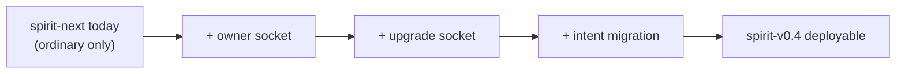
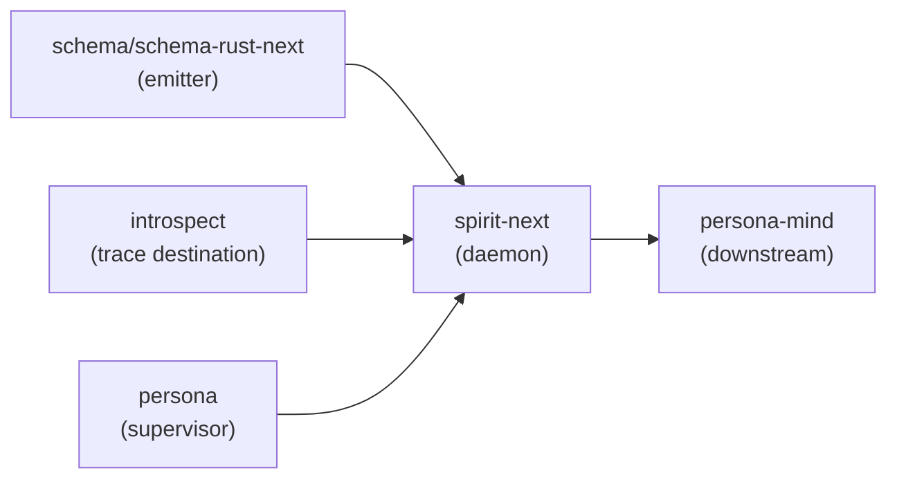

# 484.3 — Spirit component production readiness

## TL;DR

Spirit ships TODAY as `persona-spirit` v0.3.0 — a Kameo actor-tree daemon serving the workspace's intent substrate behind the deployed `spirit` CLI symlink. Spirit-next is a schema-derived pilot at v0.1.0 with the just-landed designer-best-of-designs-2026-06-02 branch (ba24b011) proving the NexusWork/NexusAction runner loop + Stash effect end-to-end across the process boundary.

The two are NOT alternative implementations of the same daemon. They share intent (workspace intent capture), wire vocabulary (multi-topic Record / Query / Magnitude / Kind), and conceptual structure (Signal / Nexus / SEMA), but the substrates differ — Kameo actors + hand-written dispatch in persona-spirit; schema-emitted engine traits + Nexus runner loop in spirit-next.

The merger path the workspace already has consensus on (Spirit 1473, 1395, 1469-1473) is **spirit-next eventually becomes the production substrate via the side-by-side deployment slot mechanism** (`spirit-v0.4.0` or similar slot pointing at a spirit-next-derived daemon). Cutover is alias change, not destructive replace — `spirit-v0.3.0` keeps the deployed binary; `spirit` symlink flips when production parity reaches.

Production gaps for spirit-next to reach v0.3.0 parity: (1) owner socket + owner contract — the owner-only authority surface; (2) upgrade socket + version-handover — the staged-replacement surface; (3) contract-repo split per Spirit 1422 — signal-spirit + owner-signal-spirit; (4) intent migration tool — persona-spirit-v0.3.0 redb data into spirit-next's .sema format; (5) bootstrap-policy.nota — the first-intent root.

Recommended operator next slice: **contract-repo split** (Spirit 1422). Extract Signal-side schema (Input, Output, Entry, Query, Magnitude, Kind, Topic) from spirit-next/schema/lib.schema into a sibling signal-spirit repo with cross-schema import per single-colon namespace paths. Keeps spirit-next daemon focused on Nexus + SEMA + runtime; lets future cross-component callers (introspect, persona) import the spirit Signal contract without depending on the whole daemon crate. Direct manifestation of the canonical engine substrate per psyche report 1 (designer 482) §"Cross-component invocation goes through Signal contracts."

## What is spirit FOR in production

Spirit IS the workspace's intent substrate. The apex cognitive component of Persona, the interface between psyche (the human) and mind (the cognitive engine). It captures psyche statements as typed intent records and serves them back to agents who need to consult workspace direction.

Production uses today, served by `persona-spirit-daemon` v0.3.0:

- **Intent capture**: every agent session that receives psyche input writes a Record through `spirit "(Record (...))"`. The deployed substrate is the canonical substrate (no manual `intent/*.nota` appends during normal work — per AGENTS.md hard override).
- **Intent observation**: agents query the store via `spirit "(Observe (Records ((Partial [topics]) ...)))"` for topic-filtered records, recency depths (Shallow/Recent/Deep/VeryDeep), certainty bands, and identifier ranges.
- **Intent maintenance**: `ChangeCertainty` lowers a record toward `Zero` (the removal-candidate floor) without deleting it; `Remove` is irreversible.
- **Intent State**: free-form psyche statements arrive as `State [text]` and become provisional Clarifications classified at `Minimum` certainty.

In production, spirit is **dumb storage with typed validation** (per persona-spirit/INTENT.md §"Spirit is dumb storage today"). Agents are the thinking layer; spirit holds and serves typed records. The "spirit guardian" sub-actor that judges contradictions is deferred to the multi-agent auditing arc.

Spirit's **authority position** is the apex (above mind in the Persona authority graph). In production this means: when Persona is operational, spirit's owner socket carries Mutate orders flowing from psyche-clarified intent down to mind, and mind's downstream commands compound from spirit's authority. Spirit's daemon is spawned last per the Persona supervision order because spirit commands components that must be running first.

The production substrate-shape is concrete and visible in CriomOS-home: `persona-spirit-daemon-v0.3.0.service` is a systemd user unit; its `ExecStart` carries the 9-field positional NOTA configuration record (three sockets + redb path + magnitude limit + four reserved `None` slots); the daemon owns `~/.local/state/persona-spirit/v0.3.0/{spirit.sock, owner.sock, upgrade.sock, persona-spirit.redb}`.

## What's already landed

### persona-spirit (deployed v0.3.0) — the production substrate

Main HEAD `189c7159` (`persona-spirit: filter records by privacy magnitude`). The deployed daemon and CLI serve workspace intent right now. The unsuffixed `spirit` symlink resolves to `/nix/store/n0pi3ahjv5s766lnxyvv0z7qyvy7aaw8-spirit-v0.3.0/bin/spirit-v0.3.0`; the daemon process lives in `~/.local/state/persona-spirit/v0.3.0/`. Substrate inventory:

- **Three Unix sockets**: ordinary (`signal-persona-spirit` frames), owner (`owner-signal-persona-spirit` frames), upgrade (`signal-version-handover` frames). Each typed-frame-only; binary protocol, no NOTA on the wire. The owner socket is the supervisor's authority surface; the upgrade socket is the staged-replacement handover surface.
- **Kameo actor tree** rooted at `SpiritRoot` with thirteen named planes: `OwnerPlane`, `PolicyPlane`, `IngressPhase` (→ `NotaDecoder`), `DispatchPhase` (→ `ClassifierPlane`, `ClockPlane`, `SignalExecutor`, `StatePlane`, `SubscriptionPlane`, `RecordStore`), `ReplyShaper` (→ `ReplyTextEncoder`), and `ActorTrace` for runtime witnessing. `RecordStore` owns `SpiritStore` which owns the sema-engine handle. Spirit's Kameo tree is ~6,500 LOC across `src/actors/` plus 1820 LOC in `src/daemon.rs`.
- **Side-by-side deployment**: spirit-v0.1.0 / spirit-v0.2.0 / spirit-v0.3.0 wrappers all installed; unsuffixed `spirit` symlink points at v0.3.0 (current MAIN); each version has its own segregated state directory + sockets + redb file. Earlier versions stay reachable through their tag-suffixed wrappers for handover testing and revert.
- **Three handover states** (`Active` ↔ `HandoverMode` → `PrivateUpgradeOnly`): the daemon participates in the staged-replacement upgrade protocol; `RecoverFromFailure` returns the daemon to `Active` if Persona cannot complete the cutover.
- **Schema-driven actor branch**: `designer-schema-full-stack-spirit-2026-05-25` landed but not deployed — parallel substrate with `.schema` files per actor (recorder, observer, supervisor, reading-actor, storage, upgrade-log) demonstrating the eventual destination shape. The actor engines, the migration runner, and the universal-Unknown floor all work today against hand-written types matching what `emit_schema!` will emit once cross-crate schema-import resolves.
- **Multi-topic v0.3.0 wire**: Records carry `[Topics]` (a vector), `Kind`, `Description`, `Magnitude`, `Privacy`; queries take `TopicMatch::{Partial, Full}` + optional `Kind` + `CertaintySelection` + `RecordedTimeSelection` + `RecordsOutputDetail`. Five filter dimensions compose in one query record.
- **Privacy filtering**: per-record `Privacy` as directional `Magnitude` (Zero = open, higher = narrower audience); ordinary observation defaults to exact `Zero`; explicit elevation through `PrivacySelection`. Privacy lives on the record, not the channel — orthogonal to the owner/ordinary socket split.
- **Recency depth queries**: `Shallow`, `Recent`, `Deep`, `VeryDeep` are applied after topic/kind/certainty matching and return newest matching records at the requested depth — quiet topics naturally reach farther back than active topics without inventing a scoring language.
- **Two migration binaries**: `spirit-migrate-0-1-to-0-2`, `spirit-migrate-0-2-to-next` — point-in-time programmatic migrators following the `mod historical`/`mod current_shape` From-chain pattern (per persona-spirit/INTENT.md §"Database upgrades are auto-migration on load").
- **bootstrap-policy.nota**: the first-intent root file declaring policy state to seed once on first run. Per persona-spirit/INTENT.md: *"the seed file is the first intent, right? The root of spirit."*
- **Engine-management socket** (optional): when `DaemonConfiguration` names one, the daemon binds `signal-engine-management::EngineManagement` for Persona's supervisor lifecycle (Announce, Ready, Running, Stop).
- **CLI signal-frame routing**: per persona-spirit ARCHITECTURE constraints, the `spirit` CLI is a one-line `signal_frame::signal_cli!` invocation; it does NOT instantiate `SpiritActorRuntime` or open the store in-process. The CLI is the text-to-Signal adapter; the daemon is the runtime.

### spirit-next (pilot v0.1.0) — the schema-derived target

Main HEAD `8fe12acb` (`spirit-next: model privacy as magnitude`). The schema-derived triad pilot — proves that schema-rust-next can emit the SignalEngine/NexusEngine/SemaEngine substrate and that a real daemon can run on it end-to-end. Inventory:

- **~4,000 LOC total**: 2067 generated (`src/schema/lib.rs`); 1900 hand-written across `config.rs`, `daemon.rs`, `engine.rs`, `lib.rs`, `nexus.rs`, `store.rs`, `trace.rs`, `transport.rs`. The 94% reduction designer 483 names is realised: most of what would have been hand-written Rust is schema emission.
- **Single Unix socket**: ordinary (`Configuration` carries one `socket_path`); optional `trace_socket_path` for `testing-trace` builds; no owner socket, no upgrade socket yet.
- **Single binary configuration**: `persona-spirit-daemon`-style 9-field positional is REPLACED by a binary rkyv `Configuration` file. Daemon takes one path argument; loads the rkyv-encoded config; opens the socket and the `.sema` file. The CLI carries the NOTA surface.
- **redb-backed `.sema` file**: `Store::open(path)` ensures `records` and `ledger` tables; `SemaEngine::apply(&mut self, ...)` writes; `SemaEngine::observe(&self, ...)` reads. Real durability proven by `process_boundary::daemon_persists_sema_file_across_a_restart`.
- **Real `DatabaseMarker`**: `CommitSequence` (persisted durable write counter) + `StateDigest` (blake3 over committed records folded with the sequence). Empty store digests to zero; the marker is content-addressed.
- **Three engine traits live**: SignalEngine triage + reply, NexusEngine execute, SemaEngine apply + observe — split per Spirit 1332 with `&mut self` for writes and `&self` for parallel reads.
- **MailLedger with hookable lifecycle**: `MessageSent` at Signal→Nexus handoff, `MessageProcessed` at the reply boundary; `MessageSentHook` / `MessageProcessedHook` traits per Pattern A. The ledger is currently in-memory (cited as a known limit; observability-not-durable-state).
- **Trace surface**: `testing-trace` Cargo feature opens the trace socket; emits typed `TraceObject` events through schema-emitted `SignalObjectName` / `NexusObjectName` / `SemaObjectName` per Spirit 1400/1408.
- **Bin pair**: `spirit-next` (CLI, requires `nota-text` feature) + `spirit-next-daemon`. The CLI is the NOTA surface; the daemon is binary-only.
- **Nix integration**: `flake.nix` exposes `packages.default`, `packages.cli`, `packages.daemon`, `packages.trace*` variants; `checks.test-testing-trace*` proves the trace path.

### Pilot branch — designer-best-of-designs-2026-06-02 at ba24b011

Just landed (today). Builds on main with the recursive Nexus Stash effect:

- Schema additions: `NexusWork` variants (SignalArrived, SemaWriteCompleted, SemaReadCompleted, EffectCompleted) + `NexusAction` variants (CommandSemaWrite, CommandSemaRead, ReplyToSignal, CommandEffect, Continue) per operator 287.
- Stash types: `StashRequest`, `StashResult`, `StashedObservation`, `StashHandle`, `Records`.
- `NexusEngine::decide` is now the runner loop (consume NexusInput → decide NexusOutput → act → re-enter); bounded by `ContinuationBudget` (default 32).
- Layer-2 witness test: `runtime_triad::full_runtime_triad_records_then_observes_through_durable_sema_with_stash` proves Observe → SemaRead → CommandEffect(Stash) → EffectCompleted(Stashed) → ReplyToSignal(RecordsStashed) → LookupStash(handle) → RecordsObserved.
- Process-boundary witness: same flow across a daemon restart with the real CLI binary on a real unix socket through the rkyv codec.
- Vocabulary aliases: `pub type NexusWork = NexusInput; pub type NexusAction = NexusOutput;` — schema-rust-next emitter coupling defers the schema-level rename.
- 47 tests pass under `cargo test --all-features`; clippy + fmt clean.

The pilot's ergonomic findings (from designer 480) inform the audit:

- **NexusWork/NexusAction reads better than NexusInput/NexusOutput**. The pilot's runner-loop code reads as "consume work, emit action" — the symmetry of Input/Output lost the directional meaning per Spirit 1438. The aliases let the runtime code adopt the vocabulary today; the schema-level rename ships once schema-rust-next can accept it.
- **ContinuationBudget at 32 is minimal but right**. The longest current path (Observe) is 3 iterations; the budget has 10x headroom. Future fan-out flows will tune per-component.
- **Stash as first effect was the right starting point**. Smallest possible effect (clear input, clear output, no external dependencies); the recursive pattern proved on Stash makes future effects (Fanout, Drop, Cascade, Preempt) mechanical additions.
- **The slim Observe wire is real**. Pre-pilot Observe returned a full `Vec<Entry>` as `RecordsObserved`; the pilot's Observe returns `RecordsStashed { handle, count, marker }` (constant-size); `LookupStash(handle)` retrieves the full records when the client wants them. Spirit 1389's slim-reply principle is realised on a real wire flow.
- **MailLedger works without recursion awareness**. The ledger sees one `Sent`/`Processed` pair per Signal route regardless of how many SEMA + effect steps run inside. This is correct: the route is one mail; the recursion is internal to one "being processed" episode.

These findings inform the production audit: the pilot's substrate IS the workspace-canonical engine substrate per psyche report 1. The audit's conclusion is that the substrate is correct; what's missing is production parity with persona-spirit's wire vocabulary + owner contract + upgrade socket + migration tool + bootstrap mechanism — the five gaps above.

## What's the gap to production

### Production parity gap — spirit-next needs five things persona-spirit has

The gap isn't a feature list against an abstract target; it's the specific set of things spirit-next currently lacks that persona-spirit v0.3.0 has.

Five-node cap; the five gaps as one chain.

**Gap 1 — Owner socket + owner-signal-spirit contract**. persona-spirit v0.3.0 binds a second socket for owner-only operations (the spawning supervisor's authority surface); spirit-next has only the ordinary socket. The owner contract carries policy mutations, configuration changes, and the supervisor's lifecycle messages. Per component-triad invariant 4: *"the two surfaces ship together. A daemon with only the ordinary surface is not yet triad-shaped — the next implementation arc for any component must deliver both."* For spirit-next, this means: a new repo `owner-signal-spirit/` with schema declaring owner-only operations; a second socket bound in the daemon; an `OwnerPlane` (or its schema-derived successor) handling the owner-side authority. The owner contract's first operations should mirror persona-spirit's: `Register` / `Announce` / lifecycle / policy mutation. Today no other component sends owner-Mutate to spirit (persona itself isn't yet operational), so the owner socket can be added without immediate inter-component coordination; it's structural readiness.

**Gap 2 — Upgrade socket + signal-version-handover**. persona-spirit binds a third socket for the staged-replacement upgrade protocol (`AskHandoverMarker`, `ReadyToHandover`, `HandoverCompleted`, `RecoverFromFailure`). This is what makes side-by-side deployment cutover safe: the current daemon hands its commit-sequence marker to the candidate, the candidate proves it accepts the marker, the alias flips, the old daemon retires. spirit-next has no upgrade socket; cutover would require destructive replace. The `signal-version-handover` repo already exists; spirit-next consumes it as a third socket per the persona-spirit handover state machine. The first upgrade payload shape — `RecordKind [StampedEntry]` with component-private rkyv bytes — is the same; broader cross-version projection is the schema-emitted-upgrade direction per Spirit 1469.

**Gap 3 — Contract-repo split per Spirit 1422**. persona-spirit's contract is in `signal-persona-spirit` (and `owner-signal-persona-spirit`) — separate repos. spirit-next's schema is monolithic at `spirit-next/schema/lib.schema` — Input, Output, NexusWork, NexusAction, SemaWriteInput, SemaReadInput, Entry, Query, Topic, Magnitude, Kind all in one file. The split is needed for: (a) cross-component imports — introspect needs to import spirit's Input/Output without depending on the whole daemon crate; (b) component-triad invariant 4 — `signal-<component>` is one of the three triad repos by definition; (c) substrate alignment with the canonical engine substrate per psyche report 1 — cross-component invocation goes through Signal contracts, not Nexus-internal access, so the contract MUST live in its own importable crate. The schema-emitted single-colon namespace paths (`signal-spirit:lib:Input`) already work per operator 287 §"Schema Composition"; the split is mechanical extraction. The Signal-side types that belong in `signal-spirit/schema/lib.schema`: Input, Output, Entry, Query, Topic, Topics, Description, Magnitude, Kind, RecordIdentifier, RecordCount, DatabaseMarker, ObservedRecords, FoundRecord, CountedRecords, SemaReceipt, RemoveReceipt, ErrorReport, ErrorMessage, CommitSequence, StateDigest, ValidationError, SignalRejection, TopicMatch, Privacy, PrivacySelection, RecordSet, RecordsStashed, StashedObservation. The Nexus + SEMA + effect types stay in spirit-next: NexusWork, NexusAction, NexusEffectCommand, NexusEffectResult, SemaWriteInput, SemaReadInput, SemaWriteOutput, SemaReadOutput, StashRequest, StashResult, StashHandle, MailLedgerEvent, MessageSent, MessageProcessed.

**Gap 4 — Intent record migration**. persona-spirit v0.3.0 has thousands of intent records under `~/.local/state/persona-spirit/v0.3.0/spirit.redb`. spirit-next's `.sema` file is empty on first start. Cutover requires migrating: persona-spirit's `StampedEntry` rkyv layout → spirit-next's `Entry` layout. Per persona-spirit/INTENT.md §"Database upgrades are auto-migration on load," the canonical pattern is the `mod previous` / `mod next` From-chain inside a sema-upgrade migration module. For spirit-next-as-spirit-v0.4, this becomes: read v0.3.0's `signal-persona-spirit` Entry shape (locally redeclared as `mod previous`); rebind to spirit-next's `Entry` (in `mod current_shape`); `From<previous::StampedEntry> for current_shape::Entry` per field. The fields map almost trivially — Topics/Kind/Description/Magnitude/Privacy are conceptually identical across the two shapes; the daemon-stamped CapturedAt becomes spirit-next's daemon-stamped time on first observation; the `RecordIdentifier` is preserved through the migration. The hand-written piece is small; the discipline is established by the two existing migration binaries. **Note**: the migration is **one-way** (v0.3.0 → v0.4.0); persona-spirit's redb is not modified. The cutover lets v0.3.0 keep its data; v0.4.0 starts with a complete copy in its own segregated state directory.

**Gap 5 — bootstrap-policy.nota — the first-intent root**. persona-spirit ships with `bootstrap-policy.nota` — the seed file declaring policy state to populate once on first start. spirit-next has no policy state surface yet (the schema declares no policy tables; Nexus is purely about working-state decisions). For production deployment as a real Persona component, spirit-next needs to express the policy/working split per component-triad invariant 5: *"Every triad daemon's durable state splits into two typed categories, both living in the same `<component>.redb` opened through `sema-engine`."* Policy state is the rules the daemon enforces (seeded once from `bootstrap-policy.nota`, mutated only via owner-signal `Mutate` afterwards); working state is the records produced by operation (the intent records themselves). Today spirit-next has only working-state tables; the schema needs to grow policy tables, and the daemon needs the bootstrap-once-on-first-start mechanism. The bootstrap-policy.nota CONTENT is deferred per persona-spirit/INTENT.md §"Bootstrap policy is the root intent" (foundational right-knowledge/right-action principles; Bhagavad Gita-style research arc); the bootstrap MECHANISM is what spirit-next needs.

### Deployed-vs-next-stack merger question

This is the question the orchestrator asked. The answer assembled from intent + reports:

**They do NOT merge into one daemon.** Per Spirit 1473 (Medium, 2026-06-02): *"Future Spirit expansion should use spirit-next as design inspiration while tying together the richer data already present in production Spirit."* Per Spirit 1395 (High, 2026-06-02): *"The spirit-next pilot should use more developed schema-defined interfaces rather than toy one-variant planes; richer operations make the implementation more realistic."* Per Spirit 1469-1473: spirit-next is the design pilot for the workspace-canonical engine substrate; the pilot informs the production daemon's shape.

The merger path the workspace has consensus on:

1. **spirit-next grows to production parity** (the five gaps above close in slices). Each slice is a worktree feature branch under `~/wt/github.com/LiGoldragon/spirit-next/`; operator integrates onto spirit-next/main per the designer-feeds-operator lane discipline.
2. **spirit-next eventually becomes the v0.4.0 deployment slot** through the existing side-by-side mechanism: `spirit-v0.4.0` wrapper installed alongside `spirit-v0.3.0`; both daemons run side-by-side with segregated state; cutover is the `spirit` alias flip per the side-by-side deployment discipline (persona-spirit/INTENT.md §"Deployment — next, main, previous side-by-side").
3. **Migration tool ports v0.3.0 records into the v0.4.0 .sema file** — same pattern as `spirit-migrate-0-1-to-0-2` and `spirit-migrate-0-2-to-next` already in persona-spirit/src/bin/. The tool reads from `~/.local/state/persona-spirit/v0.3.0/spirit.redb` and writes a fresh `.sema` file at `~/.local/state/spirit-next/v0.4.0/spirit.sema` (path naming follows the alias eventually).
4. **persona-spirit (the repo) becomes legacy maintenance ground** once cutover lands. It stays installed as the previous slot (`spirit-v0.3.0`); the repo accepts only correctness fixes; new development happens in spirit-next.

The merger is NOT: code drop, parallel re-write into persona-spirit, or destructive replace. The merger IS: spirit-next reaching v0.4.0 release-readiness, side-by-side install, alias flip, persona-spirit retired-but-installed.

The intent substance also pulls one direction the audit must name. Per Spirit 1473, future Spirit needs the **richer data already present in production Spirit**. Today's deployed v0.3.0 carries:
- Multi-topic records (vector of topic strings, not single topic).
- Recency depth queries (Shallow/Recent/Deep/VeryDeep).
- Recorded-time filtering (Since/Until/Between).
- Privacy per record (directional Magnitude).
- Certainty selection (Any/Exact/AtMost/AtLeast).
- ChangeCertainty operation (lower-to-Zero for removal-candidate workflow).
- Remove operation (irreversible deletion).

Spirit-next today carries a subset: Records with multi-topic + Kind + Description + Magnitude + Privacy; Observe with TopicMatch + optional Kind + PrivacySelection (no certainty band, no recorded-time, no recency depth); Lookup; Count; Remove. The audit recommendation: **spirit-next's wire vocabulary must reach v0.3.0 parity BEFORE cutover** — the production substrate already serves a richer query surface, and degrading the substrate at cutover would break agent workflows. The slice that brings the wire to parity is independent of the runner-loop substrate work; it can land as the Slice S2/S2b sub-slice (extending spirit-next's Query record with the missing v0.3.0 filter dimensions).

**Open psyche question that gates this**: does the v0.4.0 component name stay `persona-spirit` (preserving the persona-prefix convention) or move to `spirit` (per Spirit 697 — *"Spirit component remote/package naming should be checked against the intended persona-spirit to spirit rename"*)? The persona-prefix removal arc (Spirit record 280) was supposed to land as a coordinated bead; the rename hasn't completed. For spirit-next-as-v0.4.0 cutover, the rename decision determines the deployed package name. Recommendation: hold the rename until after v0.4.0 cutover so persona-spirit-v0.3.0 → spirit-next-as-spirit-v0.4.0 is one cutover, not two — but the recommendation is reversible by psyche.

### Other gaps surfaced — not blockers but visible

**MailLedger durability.** persona-spirit's mail ledger persists into the sema-engine; spirit-next's is in-memory and resets on daemon restart. The trade-off is observability-vs-state-of-record: spirit-next's INTENT notes the ledger is "observability, not durable state." Decision deferred to v0.4.0 readiness audit.

**Atomic batch operations.** persona-spirit explicitly rejects multi-operation ordinary batches *"before any commit"* until the store supports atomic batch execution (Spirit constraint witness `persona_spirit_daemon_rejects_multi_operation_batches_before_any_commit`). spirit-next has no batch operations at all today; the Input enum is single-variant-per-request. When batch operations become a workspace need, both sides will need to grow them together.

**Classifier path for `State` statements.** persona-spirit routes raw `State` text through a `ClassifierPlane` actor before storage; the classifier turns raw psyche text into a clarified `Description` and marks the resulting record as `Clarification` / `Minimum` certainty per the provisional-record discipline. spirit-next has no `State` Input variant yet; agents who use `spirit "(State [...])"` against v0.3.0 will need an equivalent path in v0.4.0.

**TraceObject for live introspect destination.** Spirit-next's `testing-trace` Cargo feature emits typed `TraceObject` events through a separate socket. The current shape proves the trace destination CAN consume the events; the destination component (introspect, per Spirit 1398) is not yet operational. When introspect lands, spirit-next's trace path becomes a real cross-component flow rather than a testing-only surface.

## What does spirit NEED from other components

Spirit's production-shape inter-component dependencies are sparse but specific.

Five-node cap.

**From schema-rust-next (emitter)**:

- **NexusWork/NexusAction schema-level rename**. The pilot exposes the rename through Rust type aliases; the schema-level rename is blocked on emitter coupling. Direct quote from designer 480 §"Deferred": `emit_split_nexus_input_projection` lines 1844-1925 hard-code `NexusInput::Signal`, `NexusInput::SemaWrite`, `NexusInput::SemaRead`; the rename requires accepting the new names. This is the FIRST schema-rust-next contribution that lands on the workspace-canonical engine substrate.
- **`triad_main!` macro emission**. Per Spirit 1419 + psyche report 1 (designer 482 §Stage 2): daemon `main` should be one macro call. spirit-next's current `DaemonCommand::from_environment()` is the intermediate shape; `triad_main!(SignalActor, Nexus, Store)` is the destination. schema-rust-next emits the runner loop from the schema declaration; spirit-next consumes.
- **Generated upgrade objects (Spirit 1469)**. *"Schema and Spirit should move toward a runtime-upgradable schema system: schema changes are represented as typed upgrade objects, and Rust generation emits upgrade and compatibility code from those objects."* The intent-migration tool currently is hand-written per version-boundary; the destination is schema-emitted upgrade objects + generated `UpgradeFrom`/`AcceptPrevious` impls. Spirit-next's ARCHITECTURE.md §"Known limits" notes the generated traits exist; nothing implements them yet.

**From introspect (trace destination)**:

- **Configurable trace socket**. Per Spirit 1398: introspect is the queriable destination for typed trace events from all components. spirit-next's `testing-trace` Cargo feature already emits typed `TraceObject` events through the trace socket; introspect will be the destination that consumes those events in production. Per the canonical engine substrate (designer 482), cross-component invocation goes through Signal contracts — introspect receives spirit's trace events through `signal-introspect`'s ingest operations.

**From persona (supervisor)**:

- **Lifecycle commands through owner socket**. The owner contract carries `Announce` (identify as spirit / `ComponentKind::Spirit`), readiness (`Ready`), health (`Running`), and `Stop`. Persona's supervisor decides when spirit spawns (last, after mind is up), when it cycles for upgrade, when it retires. spirit-next currently has no owner contract; persona-spirit's owner contract carries this surface.
- **Engine management socket (when bound)**. Per persona-spirit/ARCHITECTURE.md, when `DaemonConfiguration` names an engine-management socket, the daemon binds `signal-engine-management::EngineManagement`. This is the manager lifecycle surface. For spirit-next to become Persona-managed, it needs this binding (or its successor in the schema-derived substrate).

**For downstream (persona-mind)**:

- spirit issues owner-Mutate against `owner-signal-persona-mind` per Spirit 285 (`spirit owns mind`). The verb set develops with implementation; spirit-to-mind wiring is not part of today's raw component slice. Not blocking spirit's production-readiness.

**No further blocker**. spirit's core role (intent capture + observation) is single-component; the inter-component path is sparse by design. Spirit ships in raw form first per the workspace's "Components ship in raw form first" principle.

## What can move to SCHEMA EMISSION

Per designer 483 audit findings on trace emission completeness, the workspace's emission completeness lever is high — most boilerplate is in the macro engine; per-component daemon code stays slim. Spirit-specific emission opportunities visible today:

**Already emitted, hand-written shim**: SignalEngine + NexusEngine + SemaEngine traits with default trace hooks, plane envelopes (`signal::Signal<Input>`, `nexus::Nexus<Work>`, `sema::Sema<WriteInput>`), object name enums (`SignalObjectName`, `NexusObjectName`, `SemaObjectName`, `TraceInterfaceObject`, `TraceActorObject`), MailLedgerEvent + MessageSent + MessageProcessed + MessageSentHook + MessageProcessedHook, projection helpers between plane envelopes, the rkyv codec impls, and (with `nota-text` feature) the NOTA codec impls. That's the 94% reduction landed.

**Opportunities to move from hand-written to emission**:

1. **The runner loop itself**. Per Spirit 1419 + designer 482 §Stage 2: `NexusEngine::decide` is currently hand-written in spirit-next/src/nexus.rs as the runner loop (consume NexusInput → decide → act → re-enter). The destination is `triad_main!(SignalActor, Nexus, Store)` macro emitting the entire loop from the schema declaration. This is the BIGGEST emission opportunity: hundreds of LOC of runner-loop-shaped Rust → one macro call. Slice currently named in psyche report 1 as Slice B (after spirit-next adopts NexusWork/NexusAction).

2. **The mail ledger lifecycle hooks**. Today: `MessageSent`/`MessageProcessed` are generated as types; the hook trait impls and the `.fire()` call sites are hand-written. Destination: schema emits the call sites at the standard boundaries (Signal→Nexus handoff, Nexus→Signal reply) and the runtime overrides only the hook implementation.

3. **The configuration loading and socket binding** in `daemon.rs` + `config.rs` (~300 LOC). These follow a uniform shape: load NOTA-typed Configuration; open sockets per the configuration; start the runner. Schema-derived emission per Spirit 1348 (build-config NOTA struct) could collapse this to the runtime defining only the Configuration's runtime-specific fields and the macro emitting the loader + opener.

4. **The migration module structure**. The two-submodule `mod previous` / `mod current_shape` pattern + From-chain composer is mechanical per the persona-spirit/INTENT.md §"Database upgrades are auto-migration on load." Per Spirit 1469: "schema changes are represented as typed upgrade objects, and Rust generation emits upgrade and compatibility code from those objects." The hand-written piece becomes per-version `From` impls; the structure emits.

5. **The trace observation in tests**. Today the `instrumentation_logging.rs` test installs a `TraceLog` and asserts an event sequence. The schema-emitted TraceObject types are correct; the test's assertion shape (expected_sequence vec) is mechanical and could be a schema-emitted helper.

**What cannot move to schema emission**:

- `Nexus::apply_effect` body (the Stash handle minting, the records archiving, the StashTable lookup) — that's domain logic, not structure.
- `Store::apply` and `Store::observe` bodies (the redb transactions, the table operations) — domain logic.
- Bootstrap-policy parsing + first-start population — could be schema-driven for the data shape, but the bootstrap *behavior* (read once, write to policy tables, never again) is policy-state runtime, not boundary type emission.
- The classifier behavior (turning `State` text into a `Description` + `Clarification` + `Minimum` certainty) — this is the agent-side LLM-clarification path lowered into a structural placeholder; the actual classifier logic is the workspace's LLM-mediated-end-to-end principle, not schema-derived.
- The bootstrap policy CONTENT itself (the foundational right-knowledge text) — that's psyche-authored, not schema-driven. The schema emits the SHAPE of policy records; the file contains the records.

**Net emission lever for spirit-next reaching v0.4.0**: today's 4,000-LOC pilot becomes roughly 1,000-1,500 LOC hand-written runtime once `triad_main!` lands and shared runtime extracts. The remaining hand-written code is purely: Nexus decision logic, Store apply/observe bodies, effect handlers, bootstrap loader, classifier placeholder. The discipline aligns with the "Methods on schema-generated data types" pattern (Pattern C per workspace INTENT.md) — hand-written code is verbs on schema-emitted nouns, not parallel structural plumbing.

## What can move to SHARED RUNTIME

The shared-runtime extraction is a distinct emission target — it's runtime substrate code that's identical across components, NOT schema-derived. Candidates visible in spirit-next today:

1. **Signal socket transport** (`transport.rs`, ~100 LOC). Length-prefixed frame reader/writer over Unix sockets. Identical shape every component needs. Belongs in a shared `signal-runtime` (or similar) crate that every triad daemon depends on.

2. **`DaemonCommand` library noun** (operator 285's intermediate substrate). The "load binary rkyv Configuration file, construct Daemon, run" wrapper. Every daemon repeats this shape; it's the pre-macro intermediate of `triad_main!`. Should NOT live in every component's `src/daemon.rs`; it lives in shared runtime and the component provides only the typed Configuration.

3. **MailLedger and the hookable lifecycle infrastructure** (`MessageSent` / `MessageProcessed` plumbing in `engine.rs`). The schema emits the typed events; the runtime that *fires* them (the `MessageSentHook::fire` call sites, the ledger ring buffer, the recorder trait) is hand-written but identical across components.

4. **ContinuationBudget enforcement + runner loop driver**. Once `triad_main!` emits, the underlying loop driver, budget enforcement, and re-entry plumbing belong in shared runtime — `schema-rust-next` emits the call-shape; the loop runs through shared-runtime functions.

5. **The trace socket transport** (`trace.rs`'s TraceLog write path, ~200 LOC). Length-prefixed binary trace event writer + the CLI-side decoder. Every component carrying testing-trace re-implements this; shared runtime collapses it.

6. **Store-open boilerplate**. redb file opening, table ensuring, ledger initialization (or its equivalent through sema-engine when the production substrate lands). Per persona-spirit ARCHITECTURE: kameo / `sema-engine` substrate is the destination for a production component. The shared runtime hosts the SEMA store-open + transaction-management; components implement only the `apply_inner` / `observe_inner` bodies.

7. **Trace hook default no-op implementations**. Per Spirit 1365, trace hooks live as default trait methods on the engine traits — but the shared-runtime piece is the standard `TraceLog` recorder type that components use to override the hooks. Today every component would re-implement the recorder; shared runtime collapses.

The shared-runtime crate name candidates: `triad-runtime`, `persona-runtime`, `signal-runtime`. The choice depends on whether the substrate is workspace-wide (every triad daemon) or persona-specific (only persona components). Recommendation: workspace-wide name (`triad-runtime`) since the substrate IS the engine substrate per psyche report 1.

**What does NOT move to shared runtime**:

- Domain logic in `apply_effect`, `Store::apply` bodies, classifier behavior — that's per-component decision-making.
- The schema-emitted code itself — that lives in each component's `src/schema/lib.rs` per the schema-rust-next discipline.
- The bootstrap-policy.nota parser — could be shared (every component bootstraps the same way), but the policy SHAPE differs per component; the bootstrap *engine* is sharable, the schema isn't.

## Operator next-slice recommendation

**Recommended next slice: contract-repo split per Spirit 1422 — extract `signal-spirit` from spirit-next.**

Rationale (the lean per designer authority §"High-ratification-probability recommendations"):

- **Direct manifestation of the canonical engine substrate**. Per psyche report 1 (designer 482) §"Stage 5 — The single decision ask": "Cross-component invocation goes through Signal contracts." Without the contract split, every cross-component caller imports spirit-next-the-daemon-crate, which carries the whole runtime. The split is the substrate enabling cross-component composition.
- **Mechanical extraction**. The schema-emitted single-colon namespace paths already work; operator 287 §"Schema Composition" demonstrated the import-from-sibling-schema pattern. The extraction is: identify Signal-side variants in `spirit-next/schema/lib.schema` (Input, Output, Entry, Query, Topic, Topics, Description, Magnitude, Kind, RecordIdentifier, RecordCount, DatabaseMarker, ObservedRecords, FoundRecord, CountedRecords, SemaReceipt, RemoveReceipt, ErrorReport, ErrorMessage, CommitSequence, StateDigest, ValidationError, SignalRejection, TopicMatch, Privacy, PrivacySelection, RecordSet); move them into `signal-spirit/schema/lib.schema`; rewrite `spirit-next/schema/lib.schema` to import them via cross-schema imports.
- **High ratification probability**. Spirit 1422 captures this direction; Spirit 1470 (Maximum) names contract-repo split as one of the four best-of-designs to apply to spirit-next; designer 482 makes it part of the canonical substrate.
- **Right size**. Slice is contained (one schema reshape; one new repo; the daemon repo's schema gets shorter; the build pipeline gets a cross-repo schema import). Mechanical enough for a focused operator session; visible enough to compound across the production-readiness chain.
- **Unblocks downstream**. Once `signal-spirit` exists as a sibling repo, introspect can import spirit's Input/Output without depending on the runtime crate; persona can import the spirit lifecycle vocabulary; the contract repos become the cross-component coupling surface.

Slice deliverable shape:

1. New repo `signal-spirit` at `/git/github.com/LiGoldragon/signal-spirit/`.
2. Schema content moved per the extraction list; cross-schema imports declared via the single-colon namespace mechanism (`signal-spirit:lib:Input`, etc.).
3. `signal-spirit/Cargo.toml`, build pipeline, round-trip tests (rkyv + NOTA — the same `tests/round_trip.rs` shape contract crates carry per `skills/component-triad.md`).
4. `spirit-next/Cargo.toml` gains `signal-spirit` dependency; schema imports `signal-spirit:lib:*` via the existing schema-next import resolution.
5. spirit-next's runtime continues to work unchanged at the call-site level (the typed names move but their structure is identical; the schema-emitted Rust still lives in `src/schema/lib.rs` and re-exports the types).
6. Witness test: spirit-next consumes the imported Signal-side types without re-emitting them locally; `tests/dependency_surface.rs` verifies the no-double-emission boundary.
7. The pilot branch `designer-best-of-designs-2026-06-02` (ba24b011) integrates cleanly onto post-split main — the Stash effect + NexusWork/NexusAction extension is independent of the contract split.

Slice deliverable does NOT include:

- The schema-level rename to `NexusWork`/`NexusAction` (separate slice; depends on schema-rust-next emitter changes).
- The owner socket / owner-signal-spirit (separate slice; can land in parallel after S1).
- The upgrade socket (separate slice).
- Migration of persona-spirit's wire vocabulary v0.3.0 extensions (recency depth, certainty band, recorded-time filter) into spirit-next's Query (a Slice S2b sub-slice that extends the imported `Query` shape).

The slice does NOT need to touch persona-spirit. The persona-spirit v0.3.0 stays the deployed substrate; the contract split is on the spirit-next track. When spirit-next-as-v0.4.0 ships, it ships with the contract repo in place from the start.

**Slice ordering note**: the contract-repo split should land before the NexusWork/NexusAction schema-level rename and before `triad_main!` macro emission. The rename and macro are in schema-rust-next; the contract split is in the consumer side and unblocks the cross-component import patterns the macro emission will reference.

Subsequent slices (sketched in priority order, not committing to one):

- **Slice S2 — Schema-level NexusWork/NexusAction rename**. schema-rust-next pilot accepts new variant names; spirit-next consumes; the type aliases retire.
- **Slice S3 — `triad_main!` macro emission**. schema-rust-next emits the runner loop; spirit-next's daemon `main` becomes `triad_main!(SignalActor, Nexus, Store)`; `DaemonCommand` becomes the intermediate documentation, not the live shape.
- **Slice S4 — owner-signal-spirit + owner socket**. The owner contract + its socket + the owner-plane bind. Spirit 1422 contract split applies to the owner side as much as the ordinary side.
- **Slice S5 — Upgrade socket + version-handover**. signal-version-handover already exists in persona-spirit; spirit-next adopts it as a third socket per the persona-spirit handover state machine.
- **Slice S6 — Intent record migration tool**. The `previous`/`current_shape` From-chain spec'd against persona-spirit-v0.3.0's `signal-persona-spirit` Entry shape.
- **Slice S7 — bootstrap-policy.nota + policy state**. Policy tables in SEMA; the bootstrap-once-on-first-start mechanism; the seed file content (deferred per persona-spirit/INTENT.md §"Bootstrap policy is the root intent" research arc).
- **Slice S8 — v0.4.0 release-readiness audit + cutover**. The side-by-side install; the alias flip; the persona-spirit v0.3.0 retirement.

That's roughly 4-6 operator sessions of focused work to reach v0.4.0 cutover. The chain isn't a hard sequence; some slices can run in parallel (S4 and S5 are independent of each other; the migration tool S6 can land any time once S2 stabilizes the schema-emitted Entry shape).

## Important DECISIONS this surfaces

The audit reveals decisions the psyche may need to ratify before the operator chain runs:

1. **Persona-prefix rename timing**. Does spirit-next-as-v0.4.0 ship as `persona-spirit-v0.4.0` (preserving the persona-prefix until the workspace-wide rename pass per Spirit 280) or as `spirit-v0.4.0` (taking the rename as part of the cutover)? Recommendation: persona-spirit-v0.4.0 to keep cutover isolated; the workspace-wide rename pass is a separate slice. Spirit 697 + Spirit 280 are the precedents.

2. **Single-component lib vs split-crate workspace**. spirit-next is currently one crate; persona-spirit is one crate with two contract dependencies (`signal-persona-spirit`, `owner-signal-persona-spirit`). The Slice S1 contract-repo split moves toward a workspace per Spirit 1422. Spirit 1422 says yes; the audit confirms readiness. No further psyche ratification needed unless the boundary line between split crates is contested.

3. **Shared runtime crate naming**. `triad-runtime` (workspace-wide), `persona-runtime` (persona-specific), or `signal-runtime` (Signal-plane focused)? The shared-runtime extraction work from sub-agent D will name a candidate; this audit notes the spirit-side need but doesn't pre-commit.

4. **Owner socket adoption order**. Slice S4 (owner socket) is independently valuable but the operator can defer until spirit-next has a real client. Today no other workspace component sends owner-Mutate to spirit (persona itself isn't yet operational). Decision: ship owner socket *before* cutover (production parity) but the engineering can lag the contract repo split.

5. **Migration tool emit-or-hand-write**. Per Spirit 1469: "Rust generation emits upgrade and compatibility code from upgrade objects." The intent is schema-emitted migration; the practical step today is hand-written `From`-chain (mechanical, small). Decision: hand-write the v0.3.0→v0.4.0 migration; refactor to schema-emitted on the next migration boundary; this preserves momentum without paying the macro-tooling cost now.

6. **bootstrap-policy.nota content for spirit-v0.4.0**. Per persona-spirit/INTENT.md: the seed file IS the root of spirit; the content should reflect *"foundational right-knowledge and right-action principles in the spirit of the Bhagavad Gita."* The research arc is deferred. For v0.4.0 cutover, the recommendation is minimal placeholder (current persona-spirit-v0.3.0 ships with this shape); content development is independent slice.

7. **MailLedger durability**. Today's MailLedger is in-memory observability. Should v0.4.0 ship with persistent ledger (every fire writes a SEMA row)? Or stay in-memory? Recommendation: stay in-memory for v0.4.0 (it's observability, not state-of-record); persistent ledger is a separate decision tied to introspect's destination shape.

## Production interaction shape — what does spirit running with other components look like

Once persona is the supervisor, schema-daemon drives upgrades, introspect consumes trace, and spirit serves intent, the four-component slice produces this flow per interaction class:

**Agent records intent**: agent runs `spirit "(Record (...))"`; the CLI parses NOTA, frames the binary rkyv signal-frame Frame, sends over the ordinary socket; spirit's SignalActor triages; Nexus emits CommandSemaWrite(Record); SEMA writes to the .sema redb; Nexus emits ReplyToSignal(RecordAccepted N); the signal-frame Frame returns over the wire; CLI decodes and prints `(RecordAccepted N)`. Trace events fire at each engine boundary; with introspect operational, the events stream to introspect's ingestion daemon over its trace socket.

**Persona spawns spirit**: persona-daemon (the supervisor) reads its lane registry; sees spirit needs to be up; consults the engine-management socket from `signal-engine-management`; sends `Announce` to spirit's owner socket; spirit's OwnerPlane (or its schema-derived successor) accepts and replies `Ready`; persona records spirit as live; agent queries can now reach spirit.

**Spirit handover during upgrade**: psyche ships spirit-v0.5.0; both spirit-v0.4.0 and spirit-v0.5.0 install side-by-side; persona's supervision detects v0.5.0 is the new target; persona sends `ReadyToHandover` to v0.4.0's upgrade socket; v0.4.0 freezes ordinary writes, replies with its commit-sequence marker; persona starts v0.5.0; v0.5.0 sends `AskHandoverMarker`, accepts, performs the schema-emitted migration (per Spirit 1469); v0.5.0 replies `Active`; persona sends `HandoverCompleted` to v0.4.0; v0.4.0 transitions to `PrivateUpgradeOnly`; persona flips the `spirit` symlink to v0.5.0; agent clients reach v0.5.0 transparently; v0.4.0 retires after the final mirrored write.

**Schema upgrades spirit** (per Spirit 1469): schema-daemon receives a schema-change Signal; lowers it through the schema-rust-next emitter; produces a new spirit-next-schema-emitted Rust source; the operator builds and packages v0.5.0; persona supervises the handover. This is the upgrade path that doesn't require manual `spirit-migrate-X-to-Y` binaries — the upgrade objects are typed Signal payloads, the generated Rust contains the From-chain, the runner emits the migration without per-version binary code.

**Introspect consumes spirit trace**: spirit's daemon binds the trace socket; introspect's daemon receives the typed `TraceObject` events through its Signal contract (`signal-introspect::IngestTraceEvent` or equivalent); introspect's SEMA stores; queries against introspect's Signal contract retrieve traces by component / time / category. The flow is cross-component invocation through Signal contracts — spirit doesn't know about introspect; introspect knows about spirit through the schema-emitted trace destination.

That's the production-interaction picture. Spirit-next has the substrate to reach it; the chain of slices in §"Operator next-slice recommendation" gets there.

## Witness-test discipline — what proves production readiness

The audit precision discipline applies: "round-trip in test ≠ artifact discipline" — the witnesses below are what spirit-next-as-v0.4.0 needs to PASS before cutover, not what it currently passes:

- **`spirit-next-cli-accepts-one-argument-and-prints-one-nota-reply`** — invariant 1 witness. Already exists for the ordinary path; needs extension for owner + upgrade once those sockets land.
- **`spirit-next-cli-has-exactly-one-signal-peer`** — invariant 1 witness. Currently passes (the CLI binds one socket per environment variable).
- **`spirit-next-cli-cannot-open-any-database-or-peer-socket`** — invariant 1. CLI must NOT instantiate a Store; must NOT open .sema; must fail closed if the daemon is unreachable.
- **`spirit-next-daemon-rejects-non-signal-traffic-on-its-socket`** — invariant 2. `tests/socket_negative.rs` covers this for ordinary; owner socket needs equivalent.
- **`spirit-next-owner-socket-rejects-ordinary-frame`** — invariant 4. Once owner socket lands.
- **`spirit-next-ordinary-socket-rejects-owner-frame`** — invariant 4. Once owner socket lands.
- **`spirit-next-owner-socket-mode-matches-spawn-envelope`** — invariant 4. Once persona spawns spirit through the engine-management socket.
- **`spirit-next-policy-tables-empty-on-first-start-trigger-bootstrap`** — invariant 5. Once policy state lands.
- **`spirit-next-bootstrap-runs-exactly-once`** — invariant 5. Once bootstrap mechanism lands.
- **`spirit-next-binary-rejects-flag-style-arguments`** — single-argument rule witness. Add as soon as the test surface allows.
- **`spirit-next-handover-resumes-commit-sequence`** — extension of the existing `daemon_persists_sema_file_across_a_restart` witness for the staged-replacement upgrade path. Already passes at the library level; needs extension for the upgrade socket protocol.
- **`spirit-next-migration-from-v0-3-0-preserves-all-records`** — the v0.3.0 → v0.4.0 migration witness. The test loads a real v0.3.0 redb file (test fixture), runs the migration tool, verifies every record survives with all fields intact.

Each witness is small (Layer-2 test); the set is what makes "spirit-next-as-v0.4.0 is production-ready" a falsifiable claim.

## What's NOT covered by this sub-report

The sister sub-reports cover:
- Schema component production readiness — sub-report 1.
- Persona component design + production readiness — sub-report 2.
- Shared runtime library extraction — sub-report 4 (this sub-report names spirit's needs; sub-report 4 owns the candidate crate names + extraction shapes).
- Inter-component interaction + deployment path — sub-report 5 (this sub-report names spirit's deployment slot mechanism; sub-report 5 owns the workspace-level cutover sequencing).

The overview synthesis (sub-report 6 or N-overview) cross-cuts the recurring questions across sub-agents into a single picture.

## Cross-references

- `reports/designer/480-spirit-next-best-of-designs-pilot-2026-06-02.md` — pilot branch detail; the NexusWork/NexusAction + Stash + Continue substrate landed on designer-best-of-designs-2026-06-02.
- `reports/designer/482-Psyche-engine-mechanism-fundamental-decision-2026-06-02.md` — psyche report 1; the canonical engine substrate this sub-report builds on.
- `reports/designer/483-Audit-tracing-emission-completeness-2026-06-02.md` — trace emission completeness; the 94% per-component reduction lever.
- `reports/operator/285-triad-runner-intent-spread-and-implementation-2026-06-02.md` — DaemonCommand intermediate substrate; the pre-macro shape of the runner.
- `reports/operator/287-nexus-recursive-computation-continuation-2026-06-02.md` — NexusWork/NexusAction shape; the runner loop pseudo-code; the acceptance tests.
- `/git/github.com/LiGoldragon/spirit-next/` — main HEAD 8fe12acb; branch designer-best-of-designs-2026-06-02 at ba24b011.
- `/git/github.com/LiGoldragon/persona-spirit/` — main HEAD 189c7159; v0.3.0 deployed.
- `skills/component-triad.md` §"Runtime triad" — the five invariants and the engine-trait pattern.
- `skills/spirit-cli.md` — deployed wire shape + side-by-side deployment slots.
- Spirit records: 280 (persona-prefix removal), 697 (rename check), 856 (component-triad), 920 (lane rename), 1326-1336 (engine-trait architecture), 1419 (programmatic triad), 1422 (contract-repo split), 1437-1439 (Nexus decision language), 1469-1473 (schema upgrade + spirit-next direction), 1481-1482 (production-orientation).
