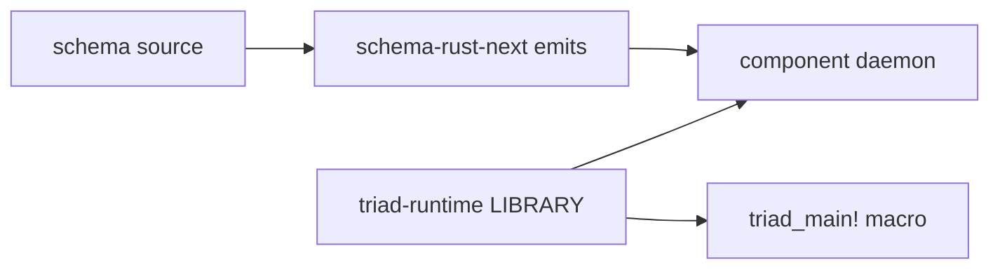

# 484.4 — Shared runtime library (sub-agent D)

## TL;DR

A shared workspace runtime library (working name **`triad-runtime`**)
holds the generic-across-components daemon scaffolding that today is
hand-copied into every component runtime. The library does not exist
yet; this report names what should move into it, what stays
per-component, and what shape the macro proposal from designer 483
imposes on the library surface.

The library scope is the **runtime support around** schema-emitted
engine traits — NOT the engine traits themselves (those stay in
`schema-rust-next` emission, which already lives there per designer
483 §"Q1.1 Per-engine trace hook methods EMITTED"). The split:

| Layer | Lives in | Provides |
|---|---|---|
| Engine traits (Signal/Nexus/SEMA, plane envelopes, ObjectName) | `schema-rust-next` emission | Per-component generated traits + types |
| Runtime scaffolding (TraceLog, TraceSocketListener, DaemonCommand loop, SignalTransport, ContinuationBudget) | `triad-runtime` (NEW) | Generic-across-components |
| Algorithmic content (decide bodies, validation, effect handlers, store schema) | Per-component daemon crate | Domain logic |

For spirit-next today, the load-bearing shared surface is roughly
**400 lines** that any second component (introspect, schema-daemon,
mind, orchestrate) would copy verbatim. Extracting them into
`triad-runtime` makes the first-line cost of a new component daemon
the per-component domain logic only.

The biggest design decision: **standalone `triad-runtime` crate vs.
non-emission module of `schema-rust-next` under a `trace-runtime`
feature flag.** Recommendation: standalone — schema-rust-next is a
build-time emitter; triad-runtime is a runtime library; the two have
different lifecycles, different consumers, and different dependency
shapes. Standalone keeps the boundary clean.

Recommended next operator slice: **extract `TraceLog` +
`TraceSocketListener` + `TraceEvent` frame codec + `Configuration`
trace fields into `triad-runtime` with spirit-next as the first
consumer, in parallel with the per-variant trace-wiring change from
designer 483 (recommendation 1).** This is the smallest meaningful
extraction; it deletes ~225 lines from spirit-next, lands the new
crate at minimal scope, and proves the boundary before
`DaemonCommand` + `SignalTransport` + `triad_main!` macro extraction
follow.

## Q1 — What is the shared runtime library FOR?

The shared runtime library **holds the generic triad-engine runtime
infrastructure that crosses components.** It is the answer to the
question "every persona daemon writes the same TraceLog and the same
DaemonCommand wrapper — where does that code live?"

The principle: a workspace where every component daemon shares a
substrate (engine traits, plane envelopes, mail mechanism, REST-shape
wire — per `skills/component-triad.md` §"Runtime triad engine traits"
and the workspace's Pattern B per INTENT.md) must also share the
runtime scaffolding around that substrate. If each component
hand-writes its own TraceLog and its own daemon loop, the substrate
fragments at the runtime layer even when the schema layer holds
together.

The library is **runtime infrastructure**, not emitter. It is a
normal Rust crate that every component daemon depends on at runtime,
the same way every component daemon depends on `rkyv` for serialization
or `redb` for storage. The difference: the workspace owns this crate
and shapes it to the workspace's specific runtime needs.

The shape connection to designer 482's psyche report: the recommended
firm position §"What firming this decision unlocks" names
**`triad_main!(SignalActor, Nexus, Store)`** as the canonical daemon
main shape. The macro emits the runner loop, configuration parsing,
socket setup, and engine wiring. **The macro reaches for types from
the shared runtime library** — `DaemonCommand`, `SignalTransport`,
`ContinuationBudget`, `TraceLog`. Without the library, the macro has
nowhere to point.

## Q2 — What's already landed?

**Nothing as a shared crate yet.** Every candidate currently lives
per-component in `spirit-next`. The candidates exist as working code,
proven through the spirit-next pilot, but they have not been factored
out into a workspace-shared crate.

Current state as of `spirit-next` HEAD (main `8fe12acb`):

| Type | File | Lines | Generic? |
|---|---|---|---|
| `TraceLog` + `TraceDestination` | `src/trace.rs:14-91` | 78 | YES (over `TraceEvent` type) |
| `TraceSocketListener` + `TraceSocketPath` | `src/trace.rs:125-174` | 50 | YES (over `TraceEvent` type) |
| `TraceEvent::to_frame` / `from_frame` / `write_to` / `read_from` | `src/trace.rs:93-123` | 30 | YES (length-prefixed rkyv codec) |
| `TraceError` | `src/trace.rs:38-44` + impls | 30 | YES |
| `DaemonCommand` + `DaemonCommandError` | `src/daemon.rs:54-125` | 72 | MOSTLY (argument parsing + run loop) |
| `Daemon::run` request loop + socket binding | `src/daemon.rs:131-188` | 58 | MOSTLY (the I/O shape doesn't vary) |
| `SocketPath::remove_stale` | `src/daemon.rs:190-206` | 17 | YES |
| `SignalTransport` + `TransportError` | `src/transport.rs` | 101 | YES (over `Input` + `Output` types) |
| `ContinuationBudget` | `src/nexus.rs:22-47` | 26 | YES (universal runner-loop policy) |
| `Configuration::trace_socket_path` field + ctor | `src/config.rs:12,37-46` | 15 | YES |
| `StashTable` | `src/nexus.rs:55-102` | 47 | PARTIALLY (the handle-table SHAPE generalises; the records stored are component-specific) |

That's ~525 lines per component that has the SAME SHAPE in every
component daemon. The body content is identical or near-identical for
every component; only the envelope types are different.

Designer 483 made the same observation in scope of trace surface
specifically (Q3, gap-summary table). This report broadens to the
WHOLE daemon scaffolding.

## Q3 — What's the gap to production?

**The library doesn't exist; the second consumer hasn't been built;
the boundary hasn't been proven.**

Three specific gaps:

1. **The crate is not created.** No `repos/triad-runtime` checkout, no
   `Cargo.toml`, no published crate path. The candidate code lives
   inside `spirit-next` only.

2. **No second consumer.** The shared-runtime hypothesis is verified
   by extracting and pointing two consumers at the extracted crate.
   Today there is one consumer (spirit-next), and the candidate code
   lives inside it. The introspect, schema-daemon, persona, and
   orchestrate components are all future daemons that would consume
   the library — but until at least one second consumer exists, the
   per-component-vs-shared distinction is theoretical.

3. **The generic-over-`TraceEvent` boundary is not designed.** The
   spirit-next `TraceLog` carries a concrete `TraceEvent` type. To
   become shared, the type must become generic — `TraceLog<Event>`
   over any rkyv-archivable event. This is a small change but it is
   not free: the trait bounds must be named, the rkyv-archive +
   rkyv-deserialize bounds must transfer cleanly, and the `Display`
   impl on TraceEvent (`fmt::Display for TraceEvent` in
   `spirit-next/src/trace.rs:182-186`) needs to land as a trait the
   library can use.

Production for the library means: **two components consume it without
modification; the trait bounds work; the trace surface stays beautiful
across both consumers.** The "production scale interaction evidence"
the psyche named in Spirit 1482 IS this test — when introspect lands
on the substrate alongside spirit-next, the library either holds or it
fragments under pressure.

## Q4 — What does it NEED from other components / schema emission?

The library is **mostly self-contained but emitted code references
it.** Two coupling points:

### Coupling point 1 — schema emission produces the trait surfaces

The library does not emit traits or types. `schema-rust-next` emits:

- The `SignalEngine` / `NexusEngine` / `SemaEngine` traits with their
  trace hook methods (per designer 483 §"Q1 Per-engine trace hook
  methods EMITTED").
- The `SignalObjectName` / `NexusObjectName` / `SemaObjectName` enums
  plus the umbrella `ObjectName` (per designer 483 §"Q2 TraceObject
  hierarchy EMITTED").
- The `TraceEvent` newtype + the `name()` method (`spirit-next/src/
  schema/lib.rs:1313-1452` is the emission output today).
- The plane envelope types (`signal::Signal<T>`, `nexus::Nexus<T>`,
  `sema::Sema<T>`).

The library DEPENDS on these emitted types and operates on them. The
flow:



Five nodes; honors the Spirit 1282 cap. The component daemon depends
on both the emission (typed nouns) and the library (generic
scaffolding). The macro reaches for both.

### Coupling point 2 — the daemon's component-specific types

The library's `DaemonCommand` and `Daemon::run` must work over ANY
component's Signal request/reply types. Today the spirit-next version
hard-codes `Engine`, `Configuration`, `Store`, `Input`, `Output` —
these are component-specific. The library version makes these generic
parameters, and the per-component daemon binary instantiates the
generic with its concrete types.

The shape this points toward: `DaemonCommand<Engine, Configuration>`
where the engine implements a `RequestHandler` trait the library
provides, and `Configuration` implements a `DaemonConfiguration` trait
the library provides (`socket_path()`, `database_path()`,
`trace_socket_path()`).

This is the SAME shape the macro proposal in designer 483 §"Q4b
triad_main!" describes — `triad_main!(SignalActor, Nexus, Store)`
becomes a macro that wires the per-component types into the generic
library scaffolding.

## Q5 — What MOVES INTO it?

Eight waves, ranked by extraction simplicity. The dependency arrow
goes outward — every component daemon depends on this crate at
runtime.

### Wave 1 — Trace surface (smallest extraction, ~208 lines)

Lives in `spirit-next/src/trace.rs`; moves to `triad-runtime/src/
trace.rs`. The `TraceLog` becomes `TraceLog<Event>` over any rkyv-
archivable event; the `TraceSocketListener` becomes
`TraceSocketListener<Event>`; a library-owned `TraceEventFrame` trait
defines the rkyv codec shape and per-component `TraceEvent` types
implement it.

### Wave 2 — Daemon scaffolding (~145 lines)

Lives in `spirit-next/src/daemon.rs`; moves to `triad-runtime/src/
daemon.rs`. `DaemonCommand<Engine, Configuration>` becomes generic
over the engine + configuration types via two library-owned traits:

- `RequestHandler` — `type Input; type Output; fn handle(&self,
  input: Self::Input) -> Self::Output`. The Engine implements this.
- `DaemonConfiguration: rkyv::Archive` — `fn socket_path(&self) ->
  &Path; fn database_path(&self) -> &Path; fn trace_socket_path(&self)
  -> Option<&Path> { None }`. The per-component Configuration
  implements this.

### Wave 3 — Signal transport (~101 lines)

Lives in `spirit-next/src/transport.rs`; moves to `triad-runtime/src/
transport.rs`. `SignalTransport<Stream>` is already generic over the
stream; it gains `Input` + `Output` type parameters bounded by a
`SignalFrameCodec` trait. Schema-rust-next emission produces the
codec impls per-component.

### Wave 4 — ContinuationBudget (~26 lines)

Lives in `spirit-next/src/nexus.rs:22-47`; moves to `triad-runtime/
src/runner.rs`. This is the **generated-runner-loop policy** per
Spirit 1469 — the library owns the building blocks; the macro
emission composes them into the runner loop. A `BudgetExhausted`
marker type lets per-component runners translate budget exhaustion
into their domain-specific error.

### Wave 5 — Configuration trace fields (~15 lines)

Lives in `spirit-next/src/config.rs:12,37-46`. Today the whole
`Configuration` is per-component because socket and database paths
vary; only `trace_socket_path: Option<...>` is universal. The clean
factoring: the library's `DaemonConfiguration` trait owns
`trace_socket_path()` with a `None` default. Per-component
Configuration structs override when their schema declares a trace
socket path. A future refinement lands the trace field via a schema
marker.

### Wave 6 — StashTable (optional, more complex)

Lives in `spirit-next/src/nexus.rs:55-102`. The handle-table SHAPE is
generic but spirit-next's StashTable stores spirit's `Records` with a
spirit-specific `DatabaseMarker`. Generalising to `StashTable<Records,
Marker>` is mechanical. Stash is per designer 482 §"Stash as the first
universal effect candidate" — IF it becomes workspace-universal, the
table moves; if per-component semantics diverge, it stays per-
component. Carry as uncertainty until the second consumer arrives.

### Wave 7 — Test harness for `assert_trace_sequence!` (~60 lines)

Lives in `spirit-next/tests/instrumentation_logging.rs:152-164` and
`spirit-next/tests/process_boundary.rs:80-129` (per designer 483
§"Q1.7 Test harness HAND-WRITTEN"). Moves to `triad-runtime/src/
testing.rs` gated behind a `testing` cargo feature. The library
provides `TraceFixture<Engine>` for in-process assertions and
`TraceCliOutput<Event>` + `run_cli_with_trace` for process-boundary
tests. The `assert_trace_sequence!` macro per designer 483 §"Q4b" is
exported by the library.

### Wave 8 — `triad_main!` macro

Lives nowhere yet; designer 483 §"Q4b macro triad_main!" sketches the
shape; designer 482 §"What firming this decision unlocks", §"Slice B"
names it the canonical daemon main. Form:

```rust
#[macro_export]
macro_rules! triad_main {
    ($SignalActor:ty, $Nexus:ty, $Store:ty, $Configuration:ty) => {
        fn main() {
            type Engine = $crate::TriadEngine<$SignalActor, $Nexus, $Store>;
            if let Err(error) = $crate::DaemonCommand::<Engine, $Configuration>::from_environment().run() {
                eprintln!(concat!(env!("CARGO_PKG_NAME"), "-daemon: {error}"), error = error);
                std::process::exit(1);
            }
        }
    };
}
```

The `TriadEngine` composer is library-side; it holds the three engine
types and runs them through the engine traits. The runner loop body
lives in the macro expansion or in a library helper.

## Q6 — What SHOULD NOT move into it?

Component-specific algorithmic content stays per-component. The
discipline from `skills/abstractions.md` (verb belongs to noun)
applies: the library owns generic scaffolding nouns; each component's
domain nouns own their domain verbs.

| Surface | Why it stays per-component |
|---|---|
| `Engine::handle` body | Component-specific algorithmic content (signal admission → nexus → reply path) |
| `Nexus::step_decide` body | Per-component decision tree (`Input` variants → `NexusAction`) |
| `Store::apply_inner` / `observe_inner` | Component-specific storage logic (redb schema, table layout, query semantics) |
| `apply_effect` body | Per-component effect handlers (Stash for spirit, Drop/Fanout for introspect, etc.) |
| Validation rules (`Input::validate`, `Entry::validate`, etc.) | Domain-specific |
| `Configuration::socket_path` + `database_path` | Path semantics specific to the component's deploy story |
| Schema source (`schema/lib.schema`) | The component's signal/nexus/sema vocabulary |
| Domain newtypes (`Topic`, `Description`, `Entry`, `Query`, ...) | Domain values |
| Effect vocabularies (`NexusEffectCommand::Stash`, `Drop`, etc.) | Per-component effect declarations per designer 482 §"Effects are per-component" |
| The `<Component>Engine::handle` actor-call trace invocations | These are emitted by schema-rust-next, not by the runtime library — they're per-component trait method calls |

**The trace overrides on engine traits are a special case.** Designer
483 §"Q1.6 Default impls of trace methods HAND-WRITTEN" found that the
per-engine `trace_*_activation` overrides have identical shape across
components — they ALL do `self.trace_log.record(TraceEvent::new(
ObjectName::<Plane>(object_name)))`. Two possible factorings:

- **Schema-rust-next emits the overrides** (per designer 483
  recommendation 1, scope of the trace surface change). Then the
  override does not move to the library.
- **The library provides a `TraceLogged` trait** with a default impl
  that components opt into via `impl TraceLogged for SignalActor`,
  short-circuiting the per-component override.

The first is cleaner — emission already owns the engine trait shape;
extending it to own the testing-trace override is a minimal
extension. The library does not need to own this surface.

## Q7 — Operator next-slice recommendation

**First slice (smallest, highest-value):** Extract the trace surface
into `triad-runtime` as the first crate inhabitant, with spirit-next
as the first consumer. Land in parallel with designer 483
recommendation 1 (per-variant trace wiring in schema-rust-next), which
is independent of the crate extraction.

Concrete steps:

1. **Create the `triad-runtime` repository.** Workspace pattern is per
   `protocols/active-repositories.md`. Repo holds `Cargo.toml` +
   `src/lib.rs` + `src/trace.rs` initially.

2. **Move trace.rs from spirit-next to triad-runtime.** Change the
   `TraceLog` and `TraceSocketListener` to generic over `Event:
   rkyv::Archive + Clone + Send + Sync`. Provide a
   `TraceEventFrame` trait the library uses for the rkyv codec; have
   spirit-next's emitted `TraceEvent` implement the trait.

3. **Point spirit-next at the new crate.** Add `triad-runtime` as a
   workspace dependency in `spirit-next/Cargo.toml`. Replace local
   `mod trace` with `use triad_runtime::trace::{TraceLog,
   TraceSocketListener, TraceError};`. Delete `spirit-next/src/trace.rs`.

4. **Run the spirit-next test suite under `--all-features`.** The
   instrumentation_logging tests and process_boundary tests should
   pass without changes (the public surface is the same).

5. **Write the first design report on the boundary.** Report names
   the trait bounds, the per-component impls expected, and the
   second-consumer test plan.

Line-count delta after this slice:

| File | Today | After slice | Delta |
|---|---|---|---|
| `spirit-next/src/trace.rs` | 208 | 0 (deleted) | -208 |
| `spirit-next/src/lib.rs` (re-exports) | ~10 lines for trace | ~3 lines for re-export | -7 |
| `spirit-next/Cargo.toml` | +0 | +1 dep line | +1 |
| `triad-runtime/src/trace.rs` | 0 | ~210 (generic) | +210 |
| `triad-runtime/Cargo.toml` | 0 | ~20 lines | +20 |
| Total | 218 | 233 | +15 (one-time crate cost) |

The +15 is the one-time cost of a new crate (Cargo.toml, lib.rs entry
point). Every additional consumer is then FREE — they get the trace
runtime as a dependency, not as 208 lines of hand-copied code.

The second-consumer test arrives when introspect or schema-daemon
lands; that's when the shared-runtime hypothesis is fully verified.

**Second slice (after the first has integrated):** Extract
`DaemonCommand` + `SignalTransport` + `SignalFrameCodec` trait +
`Daemon::run` request loop into `triad-runtime/src/daemon.rs` and
`triad-runtime/src/transport.rs`. Roughly 250 more lines move out of
spirit-next. The macro `triad_main!` is sketched but not yet emitted;
this slice prepares the substrate.

**Third slice (after the second integrates):** Emit `triad_main!`
from schema-rust-next per designer 483 §"Q4b macro triad_main!" +
designer 482 §"Slice B". The macro composes the library scaffolding
with the per-component types. After this slice, a new component
daemon binary is one macro call.

## Q8 — Important DECISIONS this surfaces

Three decisions need psyche ratification or pattern-based commitment
to unblock the slices above.

### Decision 1 (BIGGEST) — standalone crate vs. schema-rust-next runtime module

**The biggest design decision.** Two viable shapes:

| Option | Shape | Lifecycle |
|---|---|---|
| A — Standalone | New `triad-runtime` crate; component daemons depend on it as runtime dependency | Runtime library; lifecycle parallel to component daemons |
| B — schema-rust-next module | A `trace-runtime` cargo feature on schema-rust-next exposes the runtime types; component daemons get it via the build-dependency-then-cargo-feature path | Emitter module gated by feature; lifecycle pinned to emitter version |

Option B is what designer 483 §"Q4b Shared trace-runtime crate
(emission helper)" sketched as a backup: `testing-trace =
["schema-rust-next/trace-runtime"]`. The feature exposes a
non-emission module of schema-rust-next at runtime.

Option A is cleaner separation:
- schema-rust-next is a build-time emitter (proc-macro or build-script
  consumer). Component daemons depend on it via `[build-dependencies]`.
- triad-runtime is a runtime library. Component daemons depend on it
  via `[dependencies]`.
- The two have different version cadences, different consumer surfaces,
  and different stability requirements.

Option B is one-fewer-crate but mixes lifecycles. The schema-rust-next
emitter changes (per designer 483 recommendation 1) happen often; the
runtime library should be stable. Mixing them means every emitter
release potentially churns the runtime library version.

**Recommendation: Option A (standalone `triad-runtime` crate).** This
is a pattern-based decision per `skills/designer.md` §"Pattern-based
decisions" — the workspace already separates `signal-frame` (runtime
support for wire encoding) from `schema-rust-next` (emitter) for
exactly this reason. Per `skills/component-triad.md` §"Named carve-
outs", "Pure libraries don't need a daemon" — signal-frame is the
canonical precedent for a workspace-shared runtime library. triad-
runtime sits in the same category.

The psyche ratification needed: confirm Option A vs. Option B. If
Option A, the workspace adds a new active repository (see
`protocols/active-repositories.md` for the registration shape).

### Decision 2 — `TraceLog` generic boundary shape

Generic-over-`Event` requires trait bounds. Two candidates:

```rust
// Candidate 1 — bounds inline at every method
pub struct TraceLog<Event: rkyv::Archive + Clone + Send + Sync>
where
    Event::Archived: rkyv::Portable + ...,
{ ... }

// Candidate 2 — single TraceEvent trait the library owns
pub struct TraceLog<Event: TraceEventFrame> { ... }

pub trait TraceEventFrame: rkyv::Archive + Clone {
    fn frame(&self) -> Result<Vec<u8>, TraceError>;
    fn from_frame(frame: &[u8]) -> Result<Self, TraceError>;
}
```

Candidate 2 is cleaner — the trait is the library's vocabulary for
"things that can be a trace event." Per-component `TraceEvent` impls
the trait; schema-rust-next emission produces the impl automatically.

**Recommendation: Candidate 2 (single trait).** This is a pattern-
based decision; the workspace already uses small traits to name
runtime contracts (`SignalEngine`, `NexusEngine`, etc.). The
`TraceEventFrame` trait fits the same pattern.

### Decision 3 — ContinuationBudget defaults

The `ContinuationBudget::default_for_pilot() = 32` in spirit-next is
a pilot value. The library version needs a workspace-wide default,
and the question is: what default makes sense for every component?

Two options:

- **One workspace default** (e.g., 64) shared across components.
- **Per-component default** declared in the component's schema or
  configuration.

The risk of one default: introspect's runner might need much more
budget (cross-component fanout patterns); orchestrate's runner might
need much less (simple authority-mutate chains). The risk of
per-component: budget tuning becomes a per-component concern that
agents must check at deploy time.

**Recommendation: one workspace default (64) with per-component
override available.** The default sits in the library
(`ContinuationBudget::default_for_runner()`); per-component code can
override via `ContinuationBudget::from_iteration_count(...)` in the
daemon's wiring. The library exposes both; defaults serve the common
case.

This is a small decision but lives at the library API surface; once
shipped, changing the default is breaking. Hold the choice in
uncertainty until the second consumer arrives and the realistic budget
range is observed.

## What the library is NOT

The library is not:

- **An actor framework.** Per `skills/component-triad.md` §"Runtime
  triad engine traits", the engine traits (Signal/Nexus/SEMA) are the
  actor-shaped surface today. If actor traits with mailboxes ever land
  (per designer 482 §"Actor traits future-direction"), they layer
  above engine traits — and would land in the library if generic, but
  that's future-direction work.

- **A schema emitter.** Schema-rust-next is the emitter; this library
  is its runtime counterpart. The two have a clean boundary.

- **A storage substrate.** The library does not own redb, the SEMA
  durable file format, or per-component storage. Each component's
  Store stays per-component.

- **A wire substrate.** `signal-frame` already exists as the wire
  kernel (per `skills/component-triad.md` §"Named carve-outs"). The
  library uses signal-frame for wire framing; it does not replace it.

- **A configuration framework.** The library provides a
  `DaemonConfiguration` trait shape; per-component Configuration
  structs implement it. The library is not a generic-config-loader.

## Cross-references

- `reports/designer/482-Psyche-engine-mechanism-fundamental-decision-
  2026-06-02.md` §"What firming this decision unlocks" — names the
  `triad_main!` macro direction; this library is the runtime side of
  that macro.
- `reports/designer/483-Audit-tracing-emission-completeness-
  2026-06-02.md` §"Q3 Friction points" + §"Q4 Concept full emission"
  — already named the 385-line trace-runtime extraction; this report
  broadens to the whole daemon scaffolding (~400 lines plus daemon
  loop, transport, budget, config trait).
- `reports/designer/480-spirit-next-best-of-designs-pilot-2026-06-02.md`
  §"Runner loop" — current ContinuationBudget + StashTable + runner
  loop shape; the spirit-next pilot is the reference implementation
  the library factors out.
- `skills/component-triad.md` §"Named carve-outs" — "Pure libraries
  don't need a daemon" carve-out applies; triad-runtime sits in the
  same category as signal-frame.
- `skills/component-triad.md` §"Runtime triad engine traits" — the
  engine traits the library composes are schema-emitted; this report
  names what runtime support around them lives in the library.
- `skills/abstractions.md` §"What 'find the noun' actually looks like"
  — the library's nouns (TraceLog, DaemonCommand, SignalTransport,
  ContinuationBudget) are what was previously verbs floating in
  per-component code without an owning crate.
- `skills/micro-components.md` — the one-capability-one-crate rule;
  triad-runtime is ONE capability (generic daemon scaffolding), not a
  utility-soup grab bag.
- Spirit 1419 (daemon main is a tiny macro call) + 1469 (continuation
  budget) + 1438 (per-variant trace identity) — anchoring records.
- Spirit 1482 (production-orientation directive) — the why for this
  whole meta-report.
