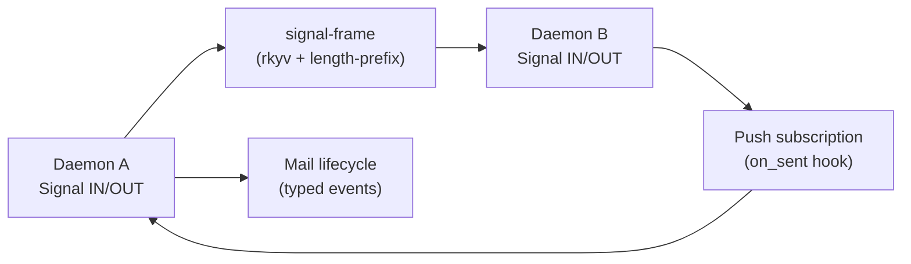
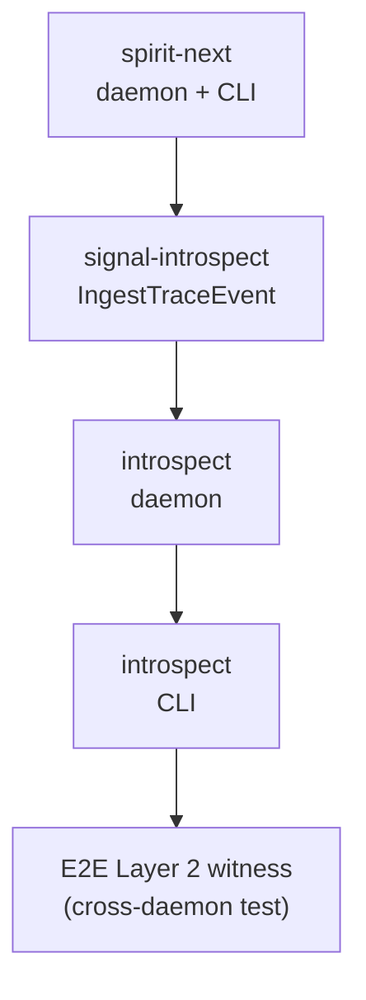

# 484.5 — Inter-component interaction and deployment path

## TL;DR

The five sub-agents A-D survey "what does each component need to be production-ready"; this sub-agent E surveys the **interaction layer** — what happens when components actually talk and how the stack ships to a host.

The interaction layer is FOR carrying typed messages between component daemons in a way that respects each component's triad-engine contract surface (Signal Input/Output as the only inter-component wire), with the universal patterns (push-not-pull, mail-event hooks, slim acknowledgements with database markers, REST-shaped operations on typed resources) holding across every pair. Nothing about the interaction layer is component-specific; it's the workspace-wide substrate every triad runs on.

What's landed: signal-frame as the typed binary wire substrate (rkyv frames + length-prefix + short-header triage), the engine-trait pattern with per-plane envelope types (Spirit 1326-1336), the typed origin-route protocol threading through the full pipeline (Spirit 1336), the universal mail mechanism with hookable lifecycle events (Spirit 935/962/963/970), and the CriomOS-home deployment shape for spirit (segregated state per version, single user-session systemd lane).

What's NOT landed: NO live cross-daemon Signal call has crossed two next-stack components. spirit-next is process-boundary-tested in isolation; introspect's daemon does not exist as a buildable artifact on schema-next; persona-as-supervisor exists in the deployed persona repo's architecture but not in next-stack form; schema-as-daemon is shape-of-daemon scope per designer 481 (the UpgradeObject lands; the daemon-runtime does not).

Recommended first-pair-of-components-to-actually-talk: **spirit-next + introspect**, with spirit-next emitting `TraceEvent` rkyv frames to introspect's `IngestTraceEvent` socket under the `testing-trace` feature. The pair validates: (1) cross-daemon binary protocol (rkyv signal-frame frames over Unix sockets), (2) push-not-pull discipline at the cross-component scale, (3) the per-component-configuration-of-peer-socket pattern (introspect's path goes in spirit-next's Configuration NOTA), (4) the Configure-universal-Input-variant pattern (introspect's `ConfigureTracePolicy`), and (5) the Layer 2 witness substrate (introspect IS the queryable destination for cross-component proof-of-runtime-use). Other pairs (persona-supervises-spirit, persona-talks-to-introspect, schema-daemon-fanouts-on-revision) layer above this base pair after the substrate proves.

Five decisions surface: (1) supervisor protocol — separate signal-persona-supervision contract or persona uses persona-spirit-daemon's normal ordinary signal; (2) trace socket discovery — Configuration NOTA field today, persona-allocated tomorrow; (3) schema-revision fanout shape — Subscribe + typed revised event, vs request/reply pull; (4) cutover path — long side-by-side coexistence (spirit's pattern) or coordinated multi-repo cutover; (5) deployment topology — single Nix flake input bundling all next-stack components vs per-component flake inputs (current spirit shape) generalized.

## Section 1 — What the interaction layer is FOR

The triad architecture (Signal/Nexus/SEMA per `skills/component-triad.md` §"Runtime triad engine traits") frames a single daemon. The **interaction layer** is what crosses between daemons: how schema-daemon's reply reaches spirit-daemon when spirit-daemon is a peer client of schema; how introspect's queryable trace store learns about spirit-next's `NexusEntered` activation; how persona-daemon orchestrates the rest of the stack into life.

The shape from `INTENT.md` §"Three execution centers" + §"Pattern A — Async lives at the data-type level":



Five nodes. Daemon A speaks signal-frame frames to Daemon B via Unix-socket wire; Daemon B reacts via the universal mail mechanism; lifecycle hooks fire on send / receive / process; observation flows back through push subscriptions (not poll).

The interaction layer is universal: every pair of daemons uses the SAME signal-frame substrate, the SAME mail-event hooks, the SAME REST-shaped Operation enums. Component A doesn't know component B's internals (Nexus is daemon-local per Spirit 1422); both speak ONLY the `signal-<component>` contract surface.

**Key property — process-boundary purity.** Per Spirit 1373: there is NO NOTA between components. The wire is binary rkyv signal-frame; NOTA lives at the CLI translation edge and at storage-dump edges. Two daemons exchanging messages NEVER see NOTA text on the wire.

## Section 2 — What's already landed

The wire substrate is real. The interaction-layer reality:

| Surface | Status | Where it lives |
|---|---|---|
| signal-frame binary wire (length-prefix + rkyv archive) | LANDED | `signal-frame` crate (active); spirit-next uses it |
| Engine-trait pattern (Signal triage / Nexus execute / SEMA apply) | LANDED in spirit-next pilot | `repos/spirit-next/` HEAD `eaeee5a` |
| Origin-route protocol threading through pipeline (Spirit 1336) | LANDED in spirit-next | `repos/spirit-next/src/` |
| Mail lifecycle events (`MessageSent` / `MessageProcessed`) | LANDED as schema-emitted types | `spirit-next/src/schema/lib.rs` |
| Push subscription as design intent (Tap/Untap placeholder retired path) | DESIGNED, NOT LANDED | designer/469 + spirit cli skill |
| CLI as translation edge (NOTA-to-binary one-shot) | LANDED for spirit-next | `spirit-next/src/bin/` |
| Process-boundary test (real socket, real daemon) | LANDED in spirit-next | `spirit-next/tests/` |
| Cross-component Signal call (one daemon as client of another) | NOT LANDED on next-stack | (only legacy persona-introspect has cross-component clients) |
| Supervisor protocol (persona spawns components, owns control sockets) | LANDED in persona ARCH (legacy stack) | `persona/ARCHITECTURE.md` §1.7 |
| Schema-revision fanout | NOT LANDED, not yet designed | future |

The substrate's READINESS — schema-next ImportResolver + schema-rust-next pub-use emission per designer 475 — means cross-repo type references are mechanical. signal-frame's wire shape (per Spirit 1373's binary-protocol clarification) covers the data plane.

What's missing for production is the **first real cross-daemon use** of the substrate. The pattern is proven end-to-end within ONE daemon (spirit-next CLI → daemon → reply); two daemons have not yet talked through the next-stack wire.

## Section 3 — The gap to production

Inter-component production-readiness requires four things to land that haven't:

1. **A live two-daemon Signal call.** spirit-next today is one daemon + one CLI. Production interaction means spirit-next as a daemon AND a client of some other daemon (e.g., schema-daemon when migrating; persona-daemon for supervision; introspect-daemon for trace push). The Rust crate shape exists; the actual second-daemon test does not.

2. **Configuration-NOTA's peer-socket fields.** Per designer 469 §4, the receiving component's socket path is a Configuration field at spawn time. spirit-next's Configuration today carries its own sockets + .sema path + magnitude limit; there are 4 `None` slots reserved for future fields. For introspect push, spirit-next's Configuration gains an `IntrospectSocket` field. For persona supervision, every component gains a `SupervisionSocket` field. The schema is ready; the fields are not yet declared.

3. **Supervisor protocol contract.** Persona supervises components in the legacy stack via `ComponentUnit` + `UnitController` + `StartComponentUnit` via systemd. The next-stack supervisor relationship — persona-daemon spawns spirit-next-daemon and they exchange typed messages over a typed contract — is sketched in the legacy persona-mind / signal-persona surface. Whether the next-stack version is a separate `signal-persona-supervision` contract OR persona uses each component's normal ordinary signal is an OPEN DECISION (Section 7).

4. **Schema-revision fanout.** When schema-daemon upgrades a contract that spirit-next consumes (e.g., signal-spirit's Input gains a new variant), spirit-next needs to learn the new schema is current. The substrate could be: schema-daemon emits a `SchemaRevised(SchemaIdentity)` mail event; spirit-next subscribes via `Subscribe(SchemaUpdateStream)`; on event receipt spirit-next reloads its asschema cache. The shape is NOT YET DESIGNED.

The gap is concentrated at the **socket configuration + peer-typed-client implementation + supervision contract** seam. Each component's wire shape is settled; the cross-component glue is not.

## Section 4 — What each component NEEDS to interact

For each next-stack component to participate in cross-component interaction, it must expose specific Signal types and accept specific Configuration fields:

### Schema-daemon (per sub-agent A)

Must export from `signal-schema`:
- `UpgradeSchema(UpgradeObject)` — Input variant for receiving authority-issued upgrades (likely owner-signal).
- `Subscribe(SchemaRevisionStream)` — Input variant for downstream consumers to be notified when a schema they care about revises.
- `LookupSchema(SchemaIdentity)` — for consumers to fetch a specific revision.
- `SchemaRevised(SchemaRevisionEvent)` — typed mail event emitted when a revision lands; carried as a push delta to subscribers.

Configuration NOTA fields needed:
- Ordinary socket, owner socket, .sema path, magnitude limit (the standard quintet).
- Optional `IntrospectSocket` (for trace).

### Persona-daemon (per sub-agent B)

Must export from `signal-persona`:
- `EngineStatus(EngineFilter)` — Input for "what engines are up?" queries.
- `StartComponent(ComponentStartRequest)` — likely owner-signal, names a component + version to spawn.
- `StopComponent(ComponentStopRequest)` — likely owner-signal.
- `Subscribe(LifecycleStream)` — for downstream observers (introspect; the user's CLI).

Must export from a `signal-persona-supervision` contract (OPEN DECISION — Section 7):
- `RegisterAsComponent(RegistrationRequest)` — supervised component announces itself on its supervision socket connection.
- `RequestReady()` / `RequestShutdown()` — supervisor instructs component.
- `AcceptClient(ClientDescriptor)` — Design D public-socket handoff per persona ARCH §"Component unit control".

Configuration NOTA fields needed:
- Ordinary socket, owner socket, .sema path.
- Per-component spawn template paths (Nix-resolved at config-emit time).

### Spirit-next (per sub-agent C)

Must export from `signal-spirit` per designer 475:
- Already-designed Input/Output (`Record` / `Observe` / `Lookup` / `Count` / `Remove` + future Subscribe / Update).

Configuration NOTA fields needed (today + extensions):
- Ordinary + owner + upgrade socket, .sema path, magnitude limit (the existing 9-field tuple — 4 `None` slots reserved).
- `IntrospectSocket` (Section 5) — first `None` slot filled.
- `SupervisionSocket` (Section 7) — second `None` slot filled.
- `SchemaUpgradeSocket` (Section 6) — for schema-daemon discovery of revisions.

Must be a Signal CLIENT of:
- introspect (for trace push).
- schema-daemon (for schema-revision subscription, when next-stack schema is daemonized).
- persona-supervision (incoming connection from supervisor for lifecycle control).

### Introspect (per sub-agent E adjacent)

Must export from `signal-introspect`:
- `IngestTraceEvent(TraceEventPayload)` — push receiver for every component's trace.
- `QueryTraceEvents(TraceQuery)` — read surface for tests and the CLI.
- `Subscribe(TraceSubscription)` — live monitoring fanout.
- `ConfigureTracePolicy(PolicyConfiguration)` — Configure-universal pattern (designer 469 candidate 2).

Configuration NOTA fields needed:
- Ordinary + owner + upgrade socket, .sema path.
- `SupervisionSocket` (incoming from persona).
- Optionally `IntrospectSocket` (self-trace excluded by default to avoid recursion).

## Section 5 — Cross-component flow walks

This section answers the psyche's six core questions one by one.

### 5.1 — schema-daemon emits typed BusyReply under load; spirit-daemon interprets

Scenario: spirit-next, as a Signal client of schema-daemon (querying for a recent schema revision), sends `Subscribe(SchemaRevisionStream)`. Schema-daemon is under load and rejects with the enum-payload pattern from operator 290.

Flow:
1. spirit-next's runtime (a NexusEngine implementation) emits `NexusAction::CommandEffect(Effect::CallComponent(SchemaSubscribeCall))` per the psyche report 1 §"Stage 3" cross-component-via-effect pattern.
2. The runner translates: binary rkyv-encoded `Subscribe(SchemaRevisionStream)` frame goes out spirit-next's schema-daemon socket.
3. Schema-daemon's SignalActor::admit receives the frame; its Nexus sees overload (an effect-table consult: too many active subscriptions); decides `NexusAction::ReplyToSignal(Output::Rejected(SignalRejection::OverCapacity))`.
4. Per operator 290's enum-payload pattern, `SignalRejection` is a typed enum: `OverCapacity { retry_after: WaitDuration, backoff_hint: BackoffHint }`. The shape is fully typed; no string error message.
5. Schema-daemon's Signal sends the rkyv-encoded reply.
6. spirit-next's runtime receives `EffectCompleted(EffectResult::CallComponentResult(Reply::Rejected(SignalRejection::OverCapacity(...))))`.
7. spirit-next's Nexus decides: retry with backoff, OR abandon and propagate rejection to spirit's own caller, OR substitute cached schema.

The shape is exactly the universal mail-mechanism: rkyv typed frames over a Signal socket; typed reply variants; the receiver's runtime treats the typed enum as a domain decision input, NOT as a generic failure that loses information.

**Beauty test:** the Rejected enum's payload carries enough typed information that the caller's Nexus has a real decision (retry now? cache fallback? propagate?) rather than a generic "it failed". Operator 290's enum-payload-variant pattern is the substrate that makes typed BusyReply work.

### 5.2 — Persona supervises spirit; wire shape to start/stop

Per persona ARCH §1.7 + §"Component unit control", the deployed (legacy) shape:

- Persona-daemon runs as the host-level supervisor.
- `ComponentUnit` + `UnitController` trait gives Persona typed methods (`start`, `stop`, `restart`, `status`) over systemd's transient-unit API.
- Persona spawns each component with environment carrying `PERSONA_SUPERVISION_SOCKET_PATH` (alongside `PERSONA_DOMAIN_SOCKET_PATH`).
- The component daemon's startup script reads the env, connects to Persona's supervision socket, registers, and waits for lifecycle signals.
- Persona's "Design D" public-socket handoff: Persona owns the stable public socket per component; component daemon connects to Persona's CONTROL socket on startup; Persona accepts clients on the public socket and forwards via `SCM_RIGHTS`.

For NEXT-STACK production interaction, the supervisor wire shape becomes:

**Option (a) — separate signal-persona-supervision contract.** A new contract repo with a typed Input/Output for the lifecycle vocabulary. Pros: explicit; lifecycle vocabulary is structurally different from any one component's ordinary signal; the contract can grow at its own pace. Cons: one more contract repo per component pair (or one universal contract shared by all components — preferable).

**Option (b) — Persona is a Signal client of each component's owner-signal contract.** No new contract — Persona uses the existing owner-signal surface to issue lifecycle Mutate operations (`Mutate(Lifecycle::Shutdown)`). Pros: minimal new vocabulary. Cons: conflates "what authority an owner has over policy" with "what authority a supervisor has over lifecycle"; the conflation is wrong-shape.

**Designer lean: (a) signal-persona-supervision** — a separate universal contract shared by ALL supervised components. The persona daemon imports it; each supervised component imports it; supervision is a workspace-wide concern with its own typed vocabulary, not domain-specific to any component.

The supervision contract Input shape (sketch):
```nota
[
  (RegisterAsComponent RegistrationRequest)
  (ReportStatus StatusReport)
  (AcceptClientHandoff ClientDescriptor)
]
```
Output shape (sketch):
```nota
[
  (Registered RegistrationReceipt)
  (StartReady StartConfirmation)
  (ShutdownRequested ShutdownInstructions)
  (ClientHandedOff HandoffReceipt)
]
```

The supervisor (Persona) is the Signal CLIENT here — it connects out to each supervised component's supervision socket and issues lifecycle commands. The supervised component owns its supervision socket as a third typed listener alongside ordinary + owner.

### 5.3 — Introspect ingests traces; how the trace socket is configured

Per designer 469 §4, the push-model is the recommended shape. For the trace socket discovery:

**Per-component-points-to-introspect today** is the slice-1 shape. Each component's Configuration NOTA carries an `IntrospectSocket (Optional Path)` field. The socket path is allocated at the deployment layer (the Nix flake module that emits the Configuration NOTA for each daemon writes both the daemon's own sockets and the path to introspect's ingest socket).

This is exactly how spirit's CriomOS-home module works today for spirit's own sockets: `ordinarySocketPath`, `ownerSocketPath`, `upgradeSocketPath` are computed inside the Nix module from `rootStateDirectory + version`, then written into the Configuration NOTA passed to the daemon. For introspect, the same module computes introspect's ingest path and writes it into spirit-next's Configuration.

**Central-discovery-tomorrow** is the persona-mediated shape: Persona-daemon, as the supervisor, knows every component's socket; when it spawns a component it injects every relevant peer-socket path through environment or Configuration. The component doesn't know introspect-specifically; it knows "I have a trace destination at the path persona told me about". This generalizes to every peer relationship.

**Designer lean for slice-1: Configuration NOTA static field set by Nix.** Same shape as spirit's existing socket allocation. Defer central discovery until persona-as-supervisor lands in the next-stack form.

The wire flow:
1. spirit-next's `NexusEngine::execute` decides + emits `NexusAction::CommandEffect(Effect::Trace(TraceEvent { component_identifier, plane, activation_name, origin_identifier, stamped_at }))`.
2. The runner (per psyche report 1 §"Stage 2") executes the Trace effect by writing a rkyv `IngestTraceEvent(payload)` Signal frame to the configured IntrospectSocket.
3. Introspect's daemon receives, routes through its Nexus per the policy decision matrix (Keep / Drop / Summarize / Fanout per designer 469 §3), replies with slim `IngestionReceipt`.
4. spirit-next's runner receives `EffectCompleted(EffectResult::TraceIngested(receipt))` and continues.

The hook fires at the engine-trait trace method (per Spirit 1365); the trace method emits the effect; the effect handler does the socket write. Push, typed, one-way (the receipt is for accounting; the trace event is fire-and-forget at the semantic level).

### 5.4 — Schema-daemon upgrades a schema; consumers learn

Scenario: schema-daemon receives `UpgradeSchema(UpgradeObject)` per designer 481; lands the new revision; downstream consumers (spirit-next was using signal-spirit revision N; signal-spirit revision N+1 is now current) must learn.

Three candidate substrate shapes:

**(a) Push subscription + typed SchemaRevised event.** Consumers subscribe at startup to schema-daemon's revision stream filtered by the schemas they care about. On revision land, schema-daemon emits `SchemaRevised(SchemaRevisionEvent { schema_identity, previous_revision, next_revision })` to every matching subscriber. Consumers reload their in-process schema cache on receipt.

**(b) Pull on-demand.** Consumers ask schema-daemon for the current revision identity at each operation start. Expensive — every Input arrival forks a Signal call.

**(c) Restart on revision.** Schema-daemon, after landing a revision, notifies persona-as-supervisor; persona restarts every component that consumes the revised schema. Heavy-handed, breaks active subscriptions, but simpler in some ways.

**Designer lean: (a) Push subscription + typed SchemaRevised event.** Aligns with push-not-pull, with the universal mail mechanism (typed lifecycle events on typed message objects per Spirit 935/962/963/970), and with how every other lifecycle concern in the workspace flows. (c) is reasonable for catastrophic-revision cases where in-place reload can't bridge the schema gap; (a) handles the normal case + a graceful fallback path.

**Open question:** what's the per-consumer state on schema mismatch detection? If spirit-next is mid-operation when revision N+1 lands, does its current operation complete on N, or get rolled back? Per the partial-failure pattern (`skills/component-triad.md` §"Partial-failure semantics — commit-first-success-and-record-divergence"), the natural answer: the operation continues on N to completion; subsequent operations use N+1; spirit-next's SEMA may need a migration pass if the SEMA records were schema-N-shaped. This is exactly designer 447's upgrade-as-SEMA terrain.

### 5.5 — Deployment topology

**Today: single host, multiple daemons, single Nix flake.** Per spirit's CriomOS-home module pattern (`modules/home/profiles/min/spirit.nix`), the deployed shape is:
- One user (the workspace owner) runs the prototype stack.
- Each daemon is a `systemd user service` under that user.
- Each daemon's `flake.nix` is a separate flake input to CriomOS-home.
- Per-version side-by-side deployment: spirit has `v0.1.0`, `v0.1.1`, `v0.2.0`, `v0.3.0`, `next`, each with its own `serviceName`, `stateDirectory`, sockets, .redb.
- The unsuffixed `spirit` symlink in the user profile points at one (currently `v0.3.0`); cutover is an alias change.

**Future: multiple engines per host, eventually multiple hosts.** Per persona ARCH §"One host has one persona daemon. That daemon can supervise N engine federations." The persona-daemon owns the engine catalog; each engine has its own component federation; multiple engines coexist on one host.

**Cross-host federation is explicitly future-work per persona ARCH §"Eventual cross-domain federation".**

For the prototype audit's production-orientation:

| Question | Today's reality | Recommended shape |
|---|---|---|
| Multiple daemons on one host? | Yes (spirit's pattern) | Generalize: every next-stack component follows spirit's side-by-side versioning |
| Across hosts? | No | Defer (future-work per ARCH) |
| Same Nix flake bundling all components, or separate flake inputs? | Separate inputs (current shape) | Generalize current shape — each component's flake is its own input; CriomOS-home orchestrates |
| User-systemd or system-systemd? | User-systemd | Keep until persona-daemon-as-supervisor lands; then persona is system-systemd, components stay user-systemd |
| Per-version segregated state? | Yes for spirit | Generalize to every component |
| Socket allocation? | Nix module computes paths | Generalize until persona-supervision lands |

**The deployment topology for slice-1 (spirit-next + introspect):** one host, two user-systemd services, two segregated state directories, two daemons, separate Nix flake inputs (spirit-next's existing flake + a new introspect flake), spirit-next's Configuration NOTA gains the `IntrospectSocket` field pointing at introspect's ingest socket. CriomOS-home's `min` profile gains an `introspect.nix` module mirroring `spirit.nix`'s shape.

### 5.6 — Cutover from deployed persona-spirit to next-stack

The current deployed shape:
- `persona-spirit` daemon (`spirit-v0.3.0`) is the production intent-capture daemon.
- Every agent's `spirit "(Record ...)"` call goes through it.
- `~/.local/state/persona-spirit/v0.3.0/` carries the .redb and sockets.

The next-stack target:
- `spirit-next` daemon, on schema-next + the canonical engine substrate per psyche report 1.
- Same role; eventually replaces persona-spirit as the production intent-capture daemon.

**Cutover paths:**

**(α) Long side-by-side.** spirit-next deploys as another version in the existing CriomOS-home `availableVersions` list. The user profile holds both `spirit-v0.3.0` AND `spirit-next` wrappers. The unsuffixed `spirit` continues pointing at v0.3.0 until spirit-next reaches feature parity + intent records can migrate forward. Cutover is one `currentDefault` change in `criomosHome.personaSpirit`.

**(β) Coordinated multi-repo cutover.** spirit-next + introspect + persona-supervision contract + Configuration field extensions land together. After all components are stable, the deployment flips. Aligns with INTENT.md §"Two deploy stacks coexist" discipline.

**(γ) Hybrid.** spirit-next deploys side-by-side now (as a third version in the CriomOS-home list); production keeps using v0.3.0; spirit-next gets exercised by tests + introspect's Layer 2 witness in production-like environments without being the production target. After confidence builds, cutover happens via (α)'s symlink change.

**Designer lean: (γ) Hybrid.** Already what's happening structurally — CriomOS-home's `availableVersions` includes `next` as a slot; the wrapper exists. Extending this to introspect (deploy alongside, exercise via tests, no production cutover until ready) is the natural shape. Cutover is when (1) spirit-next has feature parity with v0.3.0 ordinary signal, AND (2) intent records can migrate via sema-upgrade.

The Spirit migration: per `skills/spirit-cli.md` §"Substrate migration discipline", *importing existing nota files STAYS THE FUCK OUT OF SPIRIT*. The migration is a separate operator-staged tool (sema-upgrade module per `skills/spirit-cli.md` §"Canonical pattern — two-submodule migration module"). Cutover doesn't happen until that migration is proven.

## Section 6 — Move to schema emission

Per designer 483's audit, ~190 lines of trace surface IS emitted per component; ~400 lines per component daemon are hand-written for trace surface; per-effect trace events are missing entirely.

For inter-component interaction, the emission opportunities:

| Currently hand-written | Could be schema-emitted | Saves per component |
|---|---|---|
| `IntrospectSocket` Configuration field plumbing | Universal Configuration-NOTA emission with peer-socket slots | ~15 lines |
| Trace-event push hook implementation (the effect that writes to introspect's socket) | Per-effect trace emission per designer 483 §4 | ~30 lines |
| `SignalClient` for each peer relationship (spirit-next-as-client-of-introspect, etc.) | Schema-rust-next emits a SignalClient struct per cross-repo signal import | ~50 lines |
| Cross-component RkyvFrame encode/decode | Already emitted at the receiving side; SignalClient emission would cover the sending side | ~25 lines |
| Subscription registration + unregistration plumbing for `Subscribe`-shaped variants | Per the Subscribe-universal pattern per designer 468 candidate 1 | ~40 lines |
| Lifecycle hook registration (the `on_sent` / `on_processed` callback wiring) | Already at the engine-trait level | (already emitted) |

The biggest gap is **SignalClient emission**. Today, when daemon A wants to be a client of daemon B, daemon A's runtime hand-writes the socket connection, the rkyv encode, the reply decode, the error handling. Designer 469's design of introspect's wire shape assumes this layer exists; it doesn't yet in next-stack form. With schema-rust-next emitting a `signal_spirit::Client { connect_to_socket: Path } -> impl Future<Output = Result<Reply, ClientError>>` for every Signal contract, every cross-component relationship lands as `let client = signal_spirit::Client::connect(socket).await; let reply = client.record(entry).await?;`.

This is the natural schema-emission target for the next slice of inter-component work.

## Section 7 — Move to shared runtime

Per sub-agent D's broader shared-runtime audit, the cross-cutting infrastructure that could move to a `trace-runtime` / `mail-runtime` / `signal-runtime` shared crate.

Inter-component specifics:

| Cross-component substrate | Hand-written today | Shared-runtime candidate |
|---|---|---|
| signal-frame wire (length-prefix + rkyv) | ALREADY shared (`signal-frame` crate) | (done) |
| SignalClient (peer-as-client) connection management | Hand-written per component | `signal-runtime::Client<T>` |
| Subscribe-stream multiplexing (one socket, many subscribed types) | NOT YET LANDED | `signal-runtime::SubscriptionMultiplexer` |
| Push-event correlation (route-aware reply matching for fan-out) | NOT YET LANDED | `signal-runtime::OriginRouteRegistry` |
| Trace-push to introspect | Will be hand-written | `trace-runtime::PushSink<IngestTraceEvent>` |
| Supervision-socket connection (component connects out to persona) | NOT YET LANDED | `supervision-runtime::ComponentClient` |
| Schema-revision subscription | NOT YET LANDED | `schema-runtime::RevisionWatcher` |

The pattern: every cross-component relationship has a SHAPE (typed client connection; typed subscription stream; typed event push) and a SUBSTRATE (rkyv frame substrate; origin-route protocol; mail-event hooks). The shape is per-component; the substrate is universal. The shared runtime crystallizes the substrate so each component only writes the per-component-shape code.

The biggest shared-runtime win: **`signal-runtime::Client<T>` over schema-emitted signal contracts.** With it, spirit-next becomes a client of introspect by importing `signal_introspect::Operation` types AND `signal_runtime::Client<signal_introspect::Operation>`; the `Client` does the socket + rkyv + correlation work uniformly. Without it, every component-pair pair-programs the same plumbing.

## Section 8 — Operator next-slice recommendation

The recommended first-pair-of-components-to-actually-talk: **spirit-next + introspect**.

**Why this pair:**
1. **Narrowest typed dependency.** Spirit-next only sends to introspect; doesn't receive from introspect. One-way push is the simplest cross-component shape; bidirectional comes later.
2. **Both are schema-next-based.** No legacy-stack compatibility concerns. Greenfield migration per designer 469 §5.
3. **Validates 5+ universal patterns in one slice:** (a) cross-daemon binary protocol, (b) push-not-pull at cross-component scale, (c) per-component-configuration-of-peer-socket, (d) Configure-universal-Input-variant pattern, (e) Layer 2 witness substrate.
4. **Spirit-next is already process-boundary tested.** The infrastructure is mature; the new piece is the introspect side.
5. **Introspect is greenfield**, so it lands fresh on the canonical engine substrate per psyche report 1 from the start.

**Concrete next-slice scope:**



Five nodes.

Operator beads:
1. Create `introspect` repository on schema-next per designer 469 §7 Slice 1.
2. Create `signal-introspect` repository carrying `IngestTraceEvent` + `QueryTraceEvents`.
3. Modify spirit-next's Configuration record to add `IntrospectSocket (Optional Path)` field in a `None` slot.
4. Wire spirit-next's `testing-trace` engine-trait hooks to emit `IngestTraceEvent` to that socket (the push-effect pattern per psyche report 1).
5. Land a cross-component E2E test: spirit-next daemon starts pointing at introspect daemon's ingest socket; spirit-next records an entry; introspect's CLI queries; the test asserts the 12-activation trace sequence per designer 469 §7.

Owner-signal-introspect can defer to Slice 2.

After Slice 1 lands, Slice 2 opens: introspect's `ConfigureTracePolicy` + Nexus decision matrix per designer 469 §3. Slice 3 opens persona-supervision contract + first persona-supervises-spirit-next live test. Slice 4 closes when persona-spirit retires on Spirit migration.

## Section 9 — Important DECISIONS this surfaces

Five decisions need psyche ratification or designer-side firming:

### Decision 1 — Supervisor protocol shape

**Question:** Is the persona-supervises-component wire a separate `signal-persona-supervision` contract (universal across all supervised components), or does persona use each component's existing owner-signal contract?

**Designer recommendation:** Separate universal `signal-persona-supervision` contract per Section 5.2. Lifecycle vocabulary is structurally different from owner-signal policy authority; conflating them is wrong-shape.

### Decision 2 — Trace socket discovery shape

**Question:** Configuration NOTA static field set by Nix per component, OR central discovery via persona-supervision injecting peer-socket paths?

**Designer recommendation:** Configuration NOTA field today (slice-1 shape, matches spirit's existing CriomOS-home pattern). Defer central discovery until persona-supervision lands; then promote.

### Decision 3 — Schema-revision fanout shape

**Question:** Push subscription + typed `SchemaRevised` event, OR pull-on-demand, OR persona-restarts-consumers?

**Designer recommendation:** Push subscription + typed event per Section 5.4. Aligns with universal mail mechanism; handles the normal case; (c) restart-consumers is the catastrophic fallback.

### Decision 4 — Cutover discipline for persona-spirit → spirit-next

**Question:** Long side-by-side (α), coordinated multi-repo cutover (β), hybrid side-by-side with delayed production flip (γ)?

**Designer recommendation:** Hybrid (γ). Matches CriomOS-home's existing `availableVersions` shape. Cutover is one `currentDefault` change once spirit-next has feature parity + sema-upgrade migration is proven.

### Decision 5 — Deployment topology — single bundling flake or per-component flake inputs?

**Question:** Bundle all next-stack components into one Nix flake input, OR keep per-component flake inputs per spirit's existing pattern?

**Designer recommendation:** Per-component flake inputs, generalizing spirit's pattern. CriomOS-home is the orchestrator. Each component's flake is the artifact under that component's repo's ownership. Bundling would force coordinated version-bumps across components; per-input lets each component cut releases independently.

## Cross-references

- `reports/designer/484-Audit-production-readiness-meta-2026-06-02/0-frame-and-method.md` — the meta-report frame.
- `reports/designer/469-introspect-component-design-2026-06-02.md` — introspect schema sketch + push-model recommendation (Section 5.3 builds on this).
- `reports/designer/475-contract-repo-pipeline-situation-and-proposal-2026-06-02/2-overview.md` — contract-repo split mechanics (Section 4 builds on this).
- `reports/designer/477-nexus-re-agglomeration-three-angles-2026-06-02.md` §5 — cross-component recursion via Signal contracts (Section 5.1 + 5.4 build on this).
- `reports/designer/481-schema-daemon-upgradable-runtime-pilot-2026-06-02.md` — schema-as-daemon pilot (Section 5.4 builds on this).
- `reports/designer/482-Psyche-engine-mechanism-fundamental-decision-2026-06-02.md` — the canonical engine substrate (Section 5.1 + Section 5.3 reference the effect-as-cross-component-call pattern).
- `reports/designer/483-Audit-tracing-emission-completeness-2026-06-02.md` — emission completeness (Section 6 builds on this).
- `reports/operator/290-enum-payload-variant-pattern-2026-06-02.md` — typed enum payload pattern (Section 5.1 builds on this).
- `reports/operator/281-generated-interface-logic-with-macros-2026-06-02.md` — current engine-trait state.
- `skills/component-triad.md` §"Runtime triad engine traits" + §"Authority chain" — the structural pattern this report extends across daemons.
- `skills/push-not-pull.md` — discipline underlying Section 5.3 + Section 5.4.
- `skills/spirit-cli.md` §"Deployment slots" + §"Substrate migration discipline" — the deployment shape Section 5.5 + Section 5.6 generalize.
- `/git/github.com/LiGoldragon/CriomOS-home/modules/home/profiles/min/spirit.nix` — the canonical deployment module pattern.
- `/git/github.com/LiGoldragon/persona/ARCHITECTURE.md` §1.7 + §"Component unit control" — the legacy-stack supervisor protocol.
- Spirit records 1326-1336 (engine-trait architecture), 1336 (origin-route), 935/962/963/970 (universal mail mechanism), 1373 (no NOTA between components), 1389 (slim Nexus output), 1398 (introspect directive), 1419 (programmatic triad), 1422 (contract-repo split), 1469 (schema-as-daemon), 1482 (production-orientation).

## For the orchestrator (chat paraphrase)

Sub-agent E covers the interaction layer + deployment path. The interaction layer is FOR carrying typed messages between daemons via signal-frame's universal binary wire substrate + universal mail mechanism + push subscriptions; the substrate is LANDED for one daemon (spirit-next) but no cross-daemon next-stack call has happened yet. The gap to production is a live two-daemon Signal call + Configuration-NOTA peer-socket fields + supervisor protocol contract + schema-revision fanout shape.

Cross-component walks for the six core psyche questions are answered:
- schema-daemon's typed BusyReply lands as `SignalRejection::OverCapacity(...)` with enum-payload-pattern per operator 290; spirit-daemon's runtime receives it as a typed `EffectCompleted` and decides retry/cache/propagate.
- Persona supervises spirit via a separate signal-persona-supervision contract (recommended) with Persona as the Signal client to each component's supervision socket; the legacy-stack shape with `ComponentUnit` + `UnitController` + Design D public-socket handoff is the substrate; next-stack adds typed Input/Output for register/start/stop/handoff.
- Introspect's trace socket is configured per-component via Configuration NOTA's `IntrospectSocket` field today (slice-1 shape matching spirit's CriomOS-home pattern); central discovery via persona-supervision arrives later.
- Schema-upgrade fanout: schema-daemon emits typed `SchemaRevised` mail event; consumers `Subscribe` at startup; on receipt consumers reload their in-process schema cache. Aligns with push-not-pull + universal mail mechanism.
- Deployment topology: ONE host today; same per-component flake inputs as spirit's pattern; per-version segregated state directories; user-systemd lane until persona-as-supervisor lands.
- Cutover: hybrid (γ) — spirit-next deploys side-by-side as a `next` slot now; production keeps v0.3.0; flip happens via CriomOS-home's `currentDefault` change after feature parity + sema-upgrade migration proven.

Five decisions for psyche/designer firming: (1) signal-persona-supervision separate universal contract; (2) Configuration-NOTA peer-socket field today + central discovery later; (3) Push subscription + typed SchemaRevised event; (4) Hybrid side-by-side cutover; (5) Per-component flake inputs generalized from spirit's pattern.

Recommended first-pair-of-components-to-actually-talk: **spirit-next + introspect**. Both schema-next; narrowest typed dependency (one-way push); validates 5+ universal patterns in one slice (cross-daemon binary protocol, push-not-pull, peer-socket-configuration, Configure-universal-Input-variant, Layer 2 witness substrate). Operator beads: create introspect + signal-introspect repos on schema-next per designer 469 Slice 1; add IntrospectSocket Configuration field to spirit-next; wire engine-trait trace hooks to emit IngestTraceEvent push; land a cross-component E2E test asserting the 12-activation trace sequence.

The biggest interaction question: WHAT does the supervisor protocol look like in next-stack form — separate signal-persona-supervision contract vs reuse owner-signal — because once persona-supervision shape settles, every other cross-component path (trace socket discovery, schema-revision fanout, lifecycle Subscribe channels) inherits its shape.
