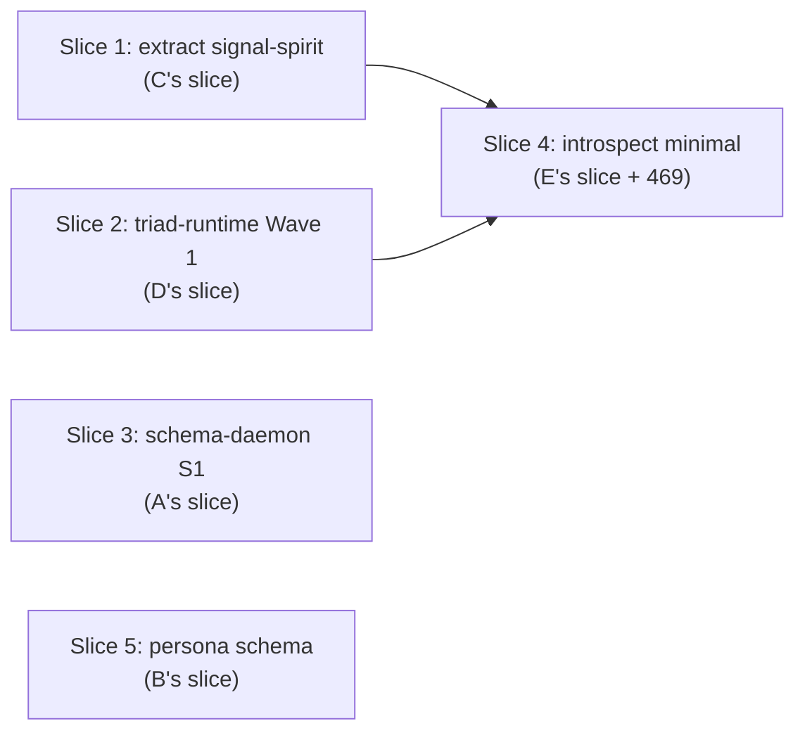

# 484.6 — Overview synthesis

## TL;DR

Five sub-agents independently surveyed five angles of the production-readiness landscape and **converged cleanly**:

- **Schema (A)** is library-production-ready; daemon shape is the gap. Recommended split: schema-daemon owns EDIT; existing upgrade-daemon owns BUILD-COMPILE-CUTOVER.
- **Persona (B)** is the host-level supervisor engine. Itself runs on the triad substrate. Its Nexus has four substantive decisions (restart, orphan-relaunch, FD-handoff, quarantine) — the first real Nexus with real decisions in production.
- **Spirit (C)** is one contract-repo split away from production parity for the canonical engine substrate; merges with deployed persona-spirit via side-by-side cutover (NOT one daemon).
- **Shared runtime (D)** is a new standalone `triad-runtime` crate; 8 waves of extraction; Wave 1 (trace surface, 208 lines) lands first.
- **Inter-component (E)** recommends spirit-next + introspect as the first pair to actually talk; deployment topology is one-host + per-component flake inputs + per-version state directories.

**The convergence**: all five sub-reports point at the SAME first-pair-to-actually-talk slice (spirit-next ↔ introspect); the contract-repo split + Wave-1 trace extraction + schema-daemon shape + persona-substrate-pilot all land in parallel; persona supervising a spirit-next instance becomes the second cross-component witness; schema-daemon driving upgrades for spirit-next + introspect + persona becomes the third.

**First production-interaction proof is achievable in 2-3 operator-weeks** at the current implementation velocity.

## Section 1 — Five cross-cutting decisions

The sub-agents surfaced five decisions that appeared in multiple reports — they need psyche ratification because they shape the substrate everyone uses.

### Decision 1 — Schema-daemon owns EDIT; upgrade-daemon owns BUILD-COMPILE-CUTOVER

**Surfaced by**: A (biggest decision); B (persona's upgrade role is process-lifecycle only per Spirit 318); E (schema-revision fanout question).

**Substance**: per designer 447 §"Pending schema-engine upgrade", schema-daemon takes ownership of schema EDIT operations (apply UpgradeObject to Asschema; record in SEMA upgrade-history); the existing upgrade-daemon retains BUILD (rustc compilation of migration code; new artifact production) + COMPILE-CUTOVER (deploying the new binary; client handover). The two daemons coordinate via signal contracts.

**Recommendation**: ratify SEPARATE. Conflating EDIT + BUILD into one daemon overloads its purpose; separation matches the existing upgrade triad's responsibility decomposition.

### Decision 2 — Standalone `triad-runtime` crate (not a schema-rust-next feature)

**Surfaced by**: D (biggest decision); A (sub-decision a — extract triad-runtime FIRST or AFTER schema-daemon S1); C (recommended slice subsequent step is `triad_main!` emission); E (deployment topology references library).

**Substance**: a new workspace crate `triad-runtime` holds the generic runner-loop + trace surface + daemon scaffolding + SignalTransport + ContinuationBudget + test harness. Schema-rust-next emits CODE that references this crate. Different lifecycles: schema-rust-next is build-time (proc-macro/build-script); triad-runtime is runtime (normal library dep).

**Recommendation**: ratify STANDALONE. Workspace precedent: `signal-frame` is already a runtime support library separate from schema emission. Build-time vs runtime distinction is real.

### Decision 3 — Persona itself runs on the triad-engine substrate

**Surfaced by**: B (biggest decision); E (supervisor protocol — persona's Signal is `owner-signal-persona` + `signal-engine-management`); C (persona-prefix rename timing).

**Substance**: persona's SEMA = manager event log + reducer snapshots. Nexus owns four substantive decisions (restart-decide; orphan-relaunch; FD-handoff route; quarantine acceptance) — each with typed `NexusOutput` side-channel variants per designer 468 candidate 2. Signal exposes owner-signal-persona + signal-engine-management. Persona is not a special case; it's a regular triad-engine daemon supervising other triad-engine daemons.

**Recommendation**: ratify. The recursion (substrate supervising itself) is exactly the workspace template per psyche report 1.

### Decision 4 — Separate universal `signal-persona-supervision` contract

**Surfaced by**: E (biggest interaction question); B (persona's `owner-signal-persona` + `signal-engine-management` are existing contracts that don't yet cover supervision).

**Substance**: persona supervising any component requires a shared SUPERVISION VOCABULARY (`LaunchEngine`, `StartComponent`, `StopComponent`, `Query(ComponentStatus)`, `RegisterReady`, `HandoffClient`, `RequestQuiesce`, `ReportHealth`). Two shapes possible: (a) one universal `signal-persona-supervision` contract that every supervised component implements; (b) persona reuses each component's existing owner-signal contract for lifecycle Mutate operations.

**Recommendation**: ratify SEPARATE (option a). Lifecycle vocabulary is structurally different from owner-signal policy authority; conflating is wrong-shape. The separate contract becomes the workspace standard for component lifecycle.

### Decision 5 — First pair to actually talk: spirit-next + introspect

**Surfaced by**: E (recommended first pair); C (contract-repo split unblocks introspect); D (trace surface extraction enables shared infrastructure); A (schema-daemon can use introspect for its own trace later).

**Substance**: spirit-next pushes typed trace events to introspect; introspect ingests + stores + answers queries. Narrowest typed dependency (one-way push, no bidirectional). Both schema-next-based (no legacy compat). Five universal patterns validated in one slice: cross-daemon binary protocol; push-not-pull at cross-component scale; per-component-configuration-of-peer-socket; Configure-universal-Input-variant pattern (introspect's `ConfigureTracePolicy`); Layer 2 cross-component witness substrate.

**Recommendation**: ratify. This is the production-orientation proof the psyche directive asked for.

## Section 2 — Operator slice sequence

Five sub-agents' next-slice recommendations interleave into a coherent operator order. Each slice is one operator-week or less.

Five nodes; honors Spirit 1282.

Detailed sequence:

**Slice 1 — Contract-repo split for spirit** (C's recommendation): extract `signal-spirit` from `spirit-next/schema/lib.schema`. Mechanical extraction; ~30 Signal-side types moved; spirit-next consumes via cross-schema import. Runtime works unchanged. **Unblocks**: introspect + persona cross-component imports (both need to talk to spirit-next via its Signal contract).

**Slice 2 — Triad-runtime Wave 1** (D's recommendation): extract trace surface (TraceLog + TraceSocketListener + frame codec, 208 lines) into new `triad-runtime` crate. Spirit-next becomes first consumer (deletes the 208 lines). Generic over `Event`. Lands in parallel with designer 483 bead 1 (per-variant trace wiring at schema-rust-next emitter level).

**Slice 3 — Schema-daemon S1** (A's recommendation): create `signal-schema` + `meta-signal-schema` repos; add `schema-next/src/bin/{schema.rs, schema-daemon.rs}` following operator 285's DaemonCommand pattern; add `schema-next/schema/lib.schema` declaring daemon's own planes; implement `SchemaSemaEngine` wrapping existing `AsschemaStore` with new upgrade-history SEMA table. **Layer 2 witness**: NOTA-encoded `(EditSchema (UpgradeObject ...))` across signal-frame → `AsschemaEdit::apply` (already on main) → `UpgradeReceipt` → drives rustc compilation. Operator-week.

Slices 1-3 land in PARALLEL — no inter-dependency. They each touch different repos.

**Slice 4 — Introspect minimal** (E's recommendation + designer 469 Slice 1): create `introspect` + `signal-introspect` repos; add `IntrospectSocket (Optional Path)` to spirit-next's Configuration NOTA (fills first None slot per the schema's reserved-slot extension pattern); wire engine-trait trace hooks to emit `IngestTraceEvent` push; **cross-component E2E test asserting the 12-activation trace sequence end-to-end across two daemons**. **DEPENDS on Slice 1** (signal-spirit must exist for introspect to import; Configuration NOTA additions need the contract-repo split). Operator-week.

**Slice 5 — Persona schema design** (B's recommendation): develop `owner-signal-persona.schema` from concept to ship-this-slice with 4 operations (`LaunchEngine`, `StartComponent`, `StopComponent`, `Query(ComponentStatus)`); refactor existing `EngineManager` + `ManagerStore` into trait impls against schema-emitted Engine traits; **E2E witness with Persona supervising one spirit-next daemon in the sandbox**. Composes with C's spirit-next pilot — they exercise the same substrate from opposite sides. Operator-week.

Total: 5 slices, 5 operator-weeks. Parallel execution lets the calendar duration be 2-3 weeks (Slices 1-3 parallel; Slice 4 follows Slice 1; Slice 5 parallel with all).

## Section 3 — Psyche ratifications consolidated

Eight ratifications gate the production-orientation slice sequence:

1. **Substrate (psyche report 1)** — ratify the engine-mechanism substrate from designer 482: NexusWork/NexusAction asymmetric pair + 5-variant action set + macro-generated runner loop + Continue as immediate recursion + effects per-component + cross-component via Signal contracts + inner runtime engine + actor traits deferred as future-direction layers.

2. **Schema-daemon split (this report Decision 1)** — confirm SEPARATE: schema-daemon owns EDIT; upgrade-daemon owns BUILD-COMPILE-CUTOVER per designer 447.

3. **Triad-runtime standalone (this report Decision 2)** — confirm STANDALONE crate, not a schema-rust-next feature.

4. **Persona on triad substrate (this report Decision 3)** — confirm persona itself is a triad-engine daemon supervising other triad-engine daemons.

5. **Supervisor protocol (this report Decision 4)** — confirm separate universal `signal-persona-supervision` contract.

6. **First pair to actually talk (this report Decision 5)** — confirm spirit-next + introspect as the first cross-component E2E witness.

7. **Persona-prefix rename timing (C's open question)** — confirm DEFER until after spirit-next reaches v0.3.0 wire-vocabulary parity and v0.4.0 cutover; rename then or in a separate post-cutover slice.

8. **Variant naming convention (Spirit 1481, already captured)** — confirm the set: Psyche / Design / Audit / Research / Synthesis / Closeout / Handover. Sub-agents used `Audit` for this meta-report directory.

The 8 ratifications cluster into THREE batches by readiness:
- **READY** (cheap; can ratify now): Decisions 1, 2, 3 (architectural commitments with clear sub-agent recommendations and minimal downstream changes).
- **GATING** (gates first production interaction): Decisions 4, 5, 6 (these shape Slices 4 + 5).
- **CARRY** (resolvable later): 7 (rename timing) and 8 (variant naming refinement if needed).

## Section 4 — What this production-orientation proves

When Slices 1-5 land, the workspace will have:

1. **A real production-shaped engine substrate** — psyche report 1's vocabulary running on canonical code, not pilot code.
2. **A shared runtime library** — every future component daemon reaches for `triad-runtime` rather than reinventing.
3. **A schema-driven upgrade flow** — schema-daemon's `EditSchema` operation is the canonical schema-evolution path; upgrade-daemon handles the compile-cutover.
4. **A working two-daemon system** — spirit-next + introspect actually communicating; cross-component Layer 2 witness; the first production proof of the workspace template.
5. **A supervising daemon** — persona running on the same substrate, supervising spirit-next end-to-end.
6. **A blueprint for adding more components** — orchestrate, harness, mind, etc. follow the same pattern; each new component is contract-repo + daemon schema + algorithm impl, with everything else (runner, trace, supervision-readiness) automatic.

That's the production-orientation outcome.

## Section 5 — Variant convention application

This meta-report uses the variant convention per Spirit 1481: directory prefix is `484-Audit-production-readiness-meta-2026-06-02/` (variant = `Audit`); sub-reports inside are numbered (`0-frame-and-method.md`, `1-schema-component.md`, etc.) without their own variant prefix because they live inside an Audit-variant directory. The overview is `6-overview.md`. Sub-agents followed this convention cleanly.

## Cross-references

- `reports/designer/482-Psyche-engine-mechanism-fundamental-decision-2026-06-02.md` — psyche report 1; the substrate this audit moves into production. Decision 1 (substrate ratification) refers here.
- `reports/designer/484-.../0-frame-and-method.md` — the audit frame.
- `reports/designer/484-.../1-schema-component.md` — sub-agent A's schema audit.
- `reports/designer/484-.../2-persona-component.md` — sub-agent B's persona design.
- `reports/designer/484-.../3-spirit-component.md` — sub-agent C's spirit audit.
- `reports/designer/484-.../4-shared-runtime.md` — sub-agent D's runtime extraction.
- `reports/designer/484-.../5-interaction-and-deployment.md` — sub-agent E's interaction + deployment.
- `reports/designer/447-upgrade-as-sema-design-2026-06-01.md` — designer 447 referenced by Decision 1.
- `reports/designer/468-developed-interfaces-spirit-persona-orchestrate-2026-06-02.md` — designer 468 referenced by Decision 3 (Nexus side-channel candidate).
- `reports/designer/469-introspect-component-design-2026-06-02.md` — referenced by Slice 4.
- `reports/designer/483-Audit-tracing-emission-completeness-2026-06-02.md` — bead 1 (per-variant trace wiring) parallels Slice 2.
- Spirit records 1419 (programmatic triad), 1422 (contract-repo split), 1427 (spirit-triad naming meta-signal-spirit), 1428 (fleet-wide meta-signal rename), 1437 + 1438 + 1439 (Nexus decision/effect/recursion), 1469 (implementation directive), 1481 (variant convention), 1482 (production-orientation).

## For the orchestrator (chat ask)

Eight ratifications consolidate from five sub-agents. Five operator slices interleave into 2-3 calendar weeks for the first cross-component production proof (spirit-next ↔ introspect). Slices 1-3 land in parallel; Slice 4 follows Slice 1; Slice 5 parallel with all. Cross-cutting decisions: schema-daemon owns EDIT (separate from upgrade-daemon BUILD); standalone `triad-runtime` crate; persona on triad substrate; separate `signal-persona-supervision` contract; spirit-next + introspect as first pair. Ratification order: READY (Decisions 1-3) → GATING (4-6) → CARRY (7-8).
