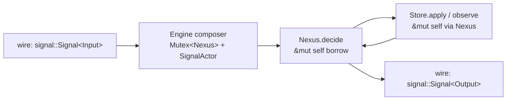
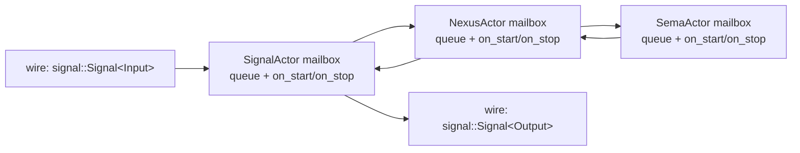

; designer
[engine-traits actor-traits substrate-sufficiency concept-demo Shape-A Shape-B borrow-vs-mailbox lifecycle hidden-non-actor-owner anti-pattern Spirit-1365 Spirit-1483 recommendation deferral-with-lifecycle-hook ContinuationBudget single-flight runner-loop]
[Concept-and-demo report answering the open question from psyche report 1 (designer 482 §"What is NOT yet firm" item 4): are engine traits sufficient for the substrate, or do they need to compose with separate actor traits per Spirit 1365 if-possible direction? Side-by-side worked code for the same component (tiny key-value store) under two shapes — Shape A (engine-only, borrow-guarded single-flight, the current direction) and Shape B (engine + actor composition with mailbox + lifecycle + identity). Trade-off scoring across nine axes including the hidden-non-actor-owner anti-pattern (skills/actor-systems.md §"Runtime roots are actors") that designer 466.3 surfaced. Recommendation: option (c) — engine traits sufficient WITH a small lifecycle hook (on_start / on_stop default-no-op methods on the engine traits). Justification: Spirit 1483 defers backpressure + runtime control + inner engine; full mailbox actor promotion is over-build at single-request throughput; but supervision-readiness for persona-supervisor (per 484.2) needs a hook surface, and adding on_start/on_stop default-no-op methods now costs ~6 lines of schema-rust-next emission and avoids hidden coupling later. Future actor-trait promotion (Spirit 1365 if-possible) gets a clean place to layer above engine traits without restructuring the substrate.]
2026-06-02
designer

# 485 — Engine traits vs actor traits: concept, demo, recommendation

## TL;DR

The engine traits (`SignalEngine`, `NexusEngine`, `SemaEngine`) ARE sufficient as the workspace-canonical substrate today, but they need ONE small refinement: each engine trait carries default-no-op `on_start` and `on_stop` methods so the runtime composer can address actor lifecycle without promoting the engines to full actor traits. Spirit 1483 explicitly defers backpressure + runtime control + inner engine; promoting to mailbox + identity + supervision at single-request throughput is over-build. But Spirit 1365's if-possible hedge is doing real work — supervision-readiness for persona-supervisor (per 484.2) needs a lifecycle hook surface, and the hidden-non-actor-owner anti-pattern (designer 466.3 §2) survives full engine-only adoption otherwise. Adding `on_start` / `on_stop` to the engine trait surface now costs ~6 lines of schema-rust-next emission, lands a real composer noun, and keeps the actor-trait promotion clean as a future supertrait layer (`trait SignalActor: SignalEngine { fn identity(&self) -> ActorIdentity; ... }`) when concurrency pressure or supervision substance arrives. Recommendation: **option (c)**.

## Section 1 — The question stated

Psyche report 1 (designer 482 §"What is NOT yet firm" item 4) named four engine-mechanism questions still open under the recommended firm substrate. The fourth:

> Are the engine traits SUFFICIENT, or do they need to compose with separate ACTOR TRAITS (mailbox + lifecycle per the actor-systems skill) per the Spirit 1365 if-possible direction?

Spirit 1365 (Correction Maximum, 2026-06-01) said traceability lives as traits on schema-derived interfaces, AND where possible, as methods on the engine traits themselves; the same correction extended to **actor traits per Signal/Nexus/SEMA "if possible"**. The if-possible hedge is doing work: it names a direction the workspace believes correct but isn't yet ratifying without piloting.

The tension this report has to resolve sits between two ratified intent surfaces.

The first is `skills/actor-systems.md` §"Runtime roots are actors". That section names the **hidden non-actor owner anti-pattern**: *"a struct that merely owns several ActorRef<\_> values and exposes convenience methods is a hidden non-actor owner; it recreates the wrapper shape this discipline exists to remove."* Designer 466.3 §2 surfaced spirit-next's `Engine` struct (`engine.rs:26`) as a worked instance — it holds `Mutex<Nexus> + SignalActor` as fields and exposes verb methods (`handle`, `record_count`, `mail_ledger`, `database_marker`). Per the skill, that shape IS the anti-pattern; the mutex is the lock §"No shared locks" warns against; the wrapper-with-convenience-methods shape is what §"Runtime roots are actors" forbids.

The second is Spirit 1483 (Decision High, 2026-06-02). That record explicitly defers backpressure + runtime control + inner engine. Promoting engine traits to actor traits with full mailbox semantics IS the kind of structural maturation that backpressure + supervision would naturally drive — and Spirit 1483 says don't drive it yet. The substrate stays simpler.

Together: the actor-systems skill names a violation the current substrate carries; Spirit 1483 says don't fix it via full actor-trait promotion now. The question is whether something in between exists — a lifecycle surface on engine traits that addresses the violation without paying full actor-promotion cost.

## Section 2 — What engine traits give us today

The schema-emitted engine traits in `spirit-next/src/schema/lib.rs:1980-2053` declare the substrate. They're tightly shaped:

```rust
pub trait SignalEngine {
    fn trace_signal_activation(&self, _object_name: SignalObjectName) {}
    fn trace_signal_admitted(&self) { ... }
    fn trace_signal_triaged(&self) { ... }
    fn trace_signal_replied(&self) { ... }

    fn triage_inner(&self, input: signal::Signal<Input>) -> nexus::Nexus<Work>;
    fn reply_inner(&self, output: nexus::Nexus<Action>) -> signal::Signal<Output>;

    fn triage(&self, input: signal::Signal<Input>) -> nexus::Nexus<Work> {
        let output = self.triage_inner(input);
        self.trace_signal_triaged();
        output
    }
    fn reply(&self, output: nexus::Nexus<Action>) -> signal::Signal<Output> {
        let signal_output = self.reply_inner(output);
        self.trace_signal_replied();
        signal_output
    }
}

pub trait NexusEngine {
    fn trace_nexus_activation(&self, _object_name: NexusObjectName) {}
    fn trace_nexus_entered(&self) { ... }
    fn trace_nexus_decided(&self) { ... }

    fn decide(&mut self, input: nexus::Nexus<Work>) -> nexus::Nexus<Action>;

    fn execute(&mut self, input: nexus::Nexus<Work>) -> nexus::Nexus<Action> {
        self.trace_nexus_entered();
        let output = self.decide(input);
        self.trace_nexus_decided();
        output
    }
}

pub trait SemaEngine {
    fn trace_sema_activation(&self, _object_name: SemaObjectName) {}
    fn trace_sema_write_applied(&self) { ... }
    fn trace_sema_read_observed(&self) { ... }

    fn apply_inner(&mut self, input: sema::Sema<WriteInput>) -> sema::Sema<WriteOutput>;
    fn observe_inner(&self, input: sema::Sema<ReadInput>) -> sema::Sema<ReadOutput>;

    fn apply(&mut self, input: sema::Sema<WriteInput>) -> sema::Sema<WriteOutput> { ... }
    fn observe(&self, input: sema::Sema<ReadInput>) -> sema::Sema<ReadOutput> { ... }
}
```

Three properties shape what they give us.

**Property 1 — borrow-guarded single-flight.** The `&mut self` on `NexusEngine::decide` and `SemaEngine::apply` IS the runtime concurrency guard. Rust's borrow checker enforces sequential access without any mailbox machinery. The `Engine` composer puts `Nexus` behind a `Mutex<Nexus>` (`engine.rs:28`) so one `&mut self` access is held at a time across an entire request lifetime; the SEMA store's `&mut self` write is held inside Nexus's borrow. Single-flight is real, mechanically enforced by the type system, no spawned tasks or message channels.

**Property 2 — runner loop is methods on data-bearing nouns.** The runner loop lives in `spirit-next/src/nexus.rs:202-258` as `impl NexusEngine for Nexus`. The loop body owns `self.store`, `self.mail_ledger`, `self.stash_table` as fields; it calls `SemaEngine::apply(&mut self.store, ...)` and `self.apply_effect(command)` directly. No actor mailbox semantics. The `ContinuationBudget` (`nexus.rs:22-47`) is a value type the loop carries on the stack; running out becomes a typed `Output::Error` reply.

**Property 3 — trace hooks live on the engine trait itself.** Spirit 1365 said instrumentation belongs to the engine-trait contract, not a side enum. The engine traits carry default-no-op `trace_*_activation` methods; concrete impls override them (`engine.rs:194-209` for `SignalActor`'s SignalEngine impl; `nexus.rs:203-207` for Nexus's NexusEngine impl). Under the `testing-trace` feature, the override records to a `TraceLog`; without the feature, the default no-op compiles to nothing.

What engine traits do NOT carry today:

- No `on_start` / `on_stop` lifecycle hook.
- No `identity()` method returning `ActorIdentity` per `skills/actor-systems.md`.
- No supervision protocol (parent supervises children; children report terminal outcomes).
- No mailbox semantics (handle messages one-at-a-time-by-message, not by borrow).
- No mailbox-typed cross-component handoff — cross-component communication today flows through Signal contracts (per designer 482 §"Cross-component invocation goes through Signal contracts") via separate daemon processes, not actor messages within one daemon.

The `Engine` god-object IS the symptom of these gaps. Its constructor (`engine.rs:65-86`) does what an actor's `on_start` would do — open the SEMA store, build the trace log, wire the children. Its drop is implicit — Rust's `Drop` runs the SEMA store's destructor when `Engine` goes out of scope. There's no place for "perform cleanup that needs to await something" or "tell supervisor my terminal state."

## Section 3 — What actor traits would add

Per `skills/actor-systems.md`, an actor trait carries four things engine traits don't:

**Mailbox semantics.** Messages enter a channel; the actor processes one at a time from the channel; senders enqueue without holding a borrow on the actor. Sequential handling is enforced by the mailbox's single-consumer-side, not by Rust's borrow checker. The actor can refuse new messages (admission gate) while processing the current one.

**Lifecycle.** `on_start` runs in the actor's task before message processing begins; `on_stop` runs after the last message is processed and before resources release. Per the skill §"Release before notify": the framework guarantees `on_stop` finishes before the parent's `wait_for_shutdown` resolves, so supervisors can safely restart against an exclusive resource (redb database, socket binding) without race.

**Identity.** An `ActorIdentity` value names the actor (logical name + spawn instance + parent reference). Tests assert against the identity to prove a request flowed through a particular actor; supervisors track child identities to decide restart policy.

**Supervision-readiness.** The actor sits in a tree under a supervisor. The supervisor receives terminal outcomes (`Dropped` / `NeverAllocated` / `Ejected` per the skill §"Terminal outcome carries the path") and applies a typed failure policy (restart / stop / escalate).

If schema-rust-next emitted actor traits as supertraits of engine traits, the shape per designer 463 §"Actor-trait pilot shape sketch" looks like:

```rust
pub trait SignalActor: SignalEngine {
    fn identity(&self) -> ActorIdentity;

    fn on_start(&mut self) -> Result<(), ActorStartFailure> { Ok(()) }
    fn on_stop(&mut self) -> Result<(), ActorStopFailure> { Ok(()) }

    fn receive(&mut self, message: SignalMessage) -> SignalReply {
        match message {
            SignalMessage::Triage(input) => SignalReply::Triaged(self.triage(input)),
            SignalMessage::Reply(action) => SignalReply::Replied(self.reply(action)),
        }
    }
}

pub trait NexusActor: NexusEngine {
    fn identity(&self) -> ActorIdentity;

    fn on_start(&mut self) -> Result<(), ActorStartFailure> { Ok(()) }
    fn on_stop(&mut self) -> Result<(), ActorStopFailure> { Ok(()) }

    fn receive(&mut self, message: NexusMessage) -> NexusReply {
        match message {
            NexusMessage::Decide(work) => NexusReply::Decided(self.execute(work)),
        }
    }
}

pub trait SemaActor: SemaEngine {
    fn identity(&self) -> ActorIdentity;

    fn on_start(&mut self) -> Result<(), ActorStartFailure> { Ok(()) }
    fn on_stop(&mut self) -> Result<(), ActorStopFailure> { Ok(()) }

    fn receive_write(&mut self, message: SemaWriteMessage) -> SemaWriteReply { ... }
    fn receive_read(&self, message: SemaReadMessage) -> SemaReadReply { ... }
}
```

The actor traits ARE supertraits of the engine traits — every actor IS an engine; the engine carries the typed compute; the actor adds runtime identity + lifecycle + receive-by-message. The receive methods translate framework messages into engine calls; the engine methods stay shaped exactly as they are today.

Two paired schema-emitted types support the surface:

```rust
pub struct ActorIdentity {
    pub logical_name: SignalNoun,
    pub spawn_instance: SpawnInstance,
    pub parent: Option<Box<ActorIdentity>>,
}

pub enum ActorStartFailure { ResourceBusy(String), ConfigInvalid(String) }
pub enum ActorStopFailure  { ResourceLocked(String), ChildNotStopped(String) }
```

The actor framework (kameo per `skills/kameo.md`, or hand-rolled) wires the mailbox + receive loop + supervision tree. Each component's runtime composer becomes:

```rust
let signal_actor = spawn_actor(SignalActor::default(), parent = root);
let nexus_actor = spawn_actor(Nexus::new(store), parent = root);
let sema_actor = spawn_actor(Store::open(path), parent = nexus_actor);
```

instead of:

```rust
let engine = Engine::new(Store::open(path));
```

## Section 4 — Concept demo: two shapes side-by-side

The two shapes are demonstrated below on the same fictional component: a tiny key-value store with `Get(Key)` and `Put(Key, Value)` operations. The store keeps records in SEMA; the Nexus decides which SEMA operation to invoke; Signal admits / triages / replies. No effects, no stash, no continuation — the simplest possible component on the substrate. The schema source is identical for both shapes; only the runtime composition differs.

### Schema source (shared)

```nota
{ }
[]
[]
{
  Input    [(Get Key) (Put PutEntry)]
  Output   [(Found Value) (Missing) (Stored RecordIdentifier)]
  PutEntry { Key * Value * }
  Key      String
  Value    String

  NexusWork [
    (SignalArrived Input)
    (SemaWriteCompleted SemaWriteOutput)
    (SemaReadCompleted SemaReadOutput)
  ]
  NexusAction [
    (ReplyToSignal Output)
    (CommandSemaWrite SemaWriteInput)
    (CommandSemaRead SemaReadInput)
  ]

  SemaWriteInput  [(WritePair PutEntry)]
  SemaReadInput   [(ReadByKey Key)]
  SemaWriteOutput [(Stored RecordIdentifier)]
  SemaReadOutput  [(Found Value) (Missing)]
}
```

### Shape A — Engine-only (current direction, psyche report 1 substrate)

The schema emits the three engine traits identically to spirit-next. The component implements them:

```rust
use kvtiny_schema::{
    Input, Output, NexusWork, NexusAction,
    SemaWriteInput, SemaWriteOutput, SemaReadInput, SemaReadOutput,
    Key, Value, PutEntry, RecordIdentifier,
    SignalEngine, NexusEngine, SemaEngine,
    signal, nexus, sema,
};
use std::collections::HashMap;

pub struct SignalActor {
    next_origin: std::sync::Mutex<u64>,
}

impl SignalEngine for SignalActor {
    fn triage_inner(&self, input: signal::Signal<Input>) -> nexus::Nexus<NexusWork> {
        let origin = input.origin_route();
        NexusWork::SignalArrived(input.into_root()).with_origin_route(origin)
    }
    fn reply_inner(&self, action: nexus::Nexus<NexusAction>) -> signal::Signal<Output> {
        action.into_signal_output()
    }
}

pub struct Nexus { store: Store }

impl NexusEngine for Nexus {
    fn decide(&mut self, input: nexus::Nexus<NexusWork>) -> nexus::Nexus<NexusAction> {
        let origin = input.origin_route();
        let mut work = input.into_root();
        loop {
            let action = match work {
                NexusWork::SignalArrived(Input::Get(key)) =>
                    NexusAction::CommandSemaRead(SemaReadInput::ReadByKey(key)),
                NexusWork::SignalArrived(Input::Put(entry)) =>
                    NexusAction::CommandSemaWrite(SemaWriteInput::WritePair(entry)),
                NexusWork::SemaReadCompleted(SemaReadOutput::Found(value)) =>
                    NexusAction::ReplyToSignal(Output::Found(value)),
                NexusWork::SemaReadCompleted(SemaReadOutput::Missing) =>
                    NexusAction::ReplyToSignal(Output::Missing),
                NexusWork::SemaWriteCompleted(SemaWriteOutput::Stored(id)) =>
                    NexusAction::ReplyToSignal(Output::Stored(id)),
            };
            match action {
                NexusAction::ReplyToSignal(out) =>
                    return NexusAction::ReplyToSignal(out).with_origin_route(origin),
                NexusAction::CommandSemaWrite(cmd) => {
                    let reply = SemaEngine::apply(
                        &mut self.store, cmd.with_origin_route(origin),
                    );
                    work = NexusWork::SemaWriteCompleted(reply.into_root());
                }
                NexusAction::CommandSemaRead(cmd) => {
                    let reply = SemaEngine::observe(
                        &self.store, cmd.with_origin_route(origin),
                    );
                    work = NexusWork::SemaReadCompleted(reply.into_root());
                }
            }
        }
    }
}

pub struct Store {
    pairs: HashMap<Key, (Value, RecordIdentifier)>,
    next_id: u64,
}

impl SemaEngine for Store {
    fn apply_inner(&mut self, input: sema::Sema<SemaWriteInput>)
        -> sema::Sema<SemaWriteOutput>
    {
        let origin = input.origin_route();
        match input.into_root() {
            SemaWriteInput::WritePair(PutEntry { key, value }) => {
                self.next_id += 1;
                let id = RecordIdentifier(self.next_id);
                self.pairs.insert(key, (value, id.clone()));
                SemaWriteOutput::Stored(id).with_origin_route(origin)
            }
        }
    }
    fn observe_inner(&self, input: sema::Sema<SemaReadInput>)
        -> sema::Sema<SemaReadOutput>
    {
        let origin = input.origin_route();
        match input.into_root() {
            SemaReadInput::ReadByKey(key) => match self.pairs.get(&key) {
                Some((value, _id)) => SemaReadOutput::Found(value.clone())
                    .with_origin_route(origin),
                None => SemaReadOutput::Missing.with_origin_route(origin),
            },
        }
    }
}

pub struct Engine {
    signal_actor: SignalActor,
    nexus: std::sync::Mutex<Nexus>,
}

impl Engine {
    pub fn new() -> Self {
        Self {
            signal_actor: SignalActor { next_origin: std::sync::Mutex::new(0) },
            nexus: std::sync::Mutex::new(Nexus { store: Store {
                pairs: HashMap::new(), next_id: 0,
            }}),
        }
    }
    pub fn handle(&self, input: Input) -> signal::Signal<Output> {
        let mut next = self.signal_actor.next_origin.lock().unwrap();
        *next += 1;
        let origin = crate::OriginRoute(*next);
        drop(next);
        let signal_in = input.with_origin_route(origin);
        let nexus_in = self.signal_actor.triage(signal_in);
        let mut nexus = self.nexus.lock().unwrap();
        let nexus_out = NexusEngine::execute(&mut *nexus, nexus_in);
        self.signal_actor.reply(nexus_out)
    }
}

fn main() {
    triad_main!(SignalActor, Nexus, Store);
}
```

**Line count (engine-only, hand-written):** SignalActor 14, Nexus + runner loop 42, Store 30, Engine composer 22, main 1 — total **109 lines** of hand-written runtime code outside the schema-emitted traits. The macro call `triad_main!` (Spirit 1419) replaces the `Engine` composer + `main` once it lands; today operator 285 keeps `DaemonCommand::from_environment().run()` as the intermediate form.

**Single-flight enforcement:** `Mutex<Nexus>` around the composer's nexus field + `&mut self` borrow inside `NexusEngine::decide` + `&mut self` borrow inside `SemaEngine::apply_inner`. Rust's borrow checker proves no two requests overlap inside Nexus or Store.

**Concurrent requests:** with the mutex, only one request at a time is in flight. A second request blocks at `self.nexus.lock()`. There's no admission gate, no rejection — the caller waits.

**Shutdown:** when `Engine` drops, `Mutex` drops, `Nexus` drops, `Store` drops in that order. The SEMA store's destructor closes the redb file (in spirit-next's actual code; HashMap in this demo). There's no `on_stop` hook to await — cleanup is synchronous Drop.

### Shape B — Engine + Actor composition

The schema emits engine traits AND actor supertrait wrappers + an `ActorIdentity` + `ActorStartFailure` / `ActorStopFailure`. The component implements the actor traits:

```rust
use kvtiny_schema::{
    Input, Output, NexusWork, NexusAction,
    SemaWriteInput, SemaWriteOutput, SemaReadInput, SemaReadOutput,
    Key, Value, PutEntry, RecordIdentifier,
    SignalEngine, NexusEngine, SemaEngine,
    SignalActor, NexusActor, SemaActor,
    ActorIdentity, ActorStartFailure, ActorStopFailure, SpawnInstance,
    SignalNoun, signal, nexus, sema,
};
use kameo::{Actor, ActorRef, Message};
use std::collections::HashMap;

pub struct SignalActorImpl {
    identity: ActorIdentity,
    next_origin: u64,
    nexus_ref: ActorRef<NexusActorImpl>,
}

impl SignalEngine for SignalActorImpl {
    fn triage_inner(&self, input: signal::Signal<Input>) -> nexus::Nexus<NexusWork> {
        let origin = input.origin_route();
        NexusWork::SignalArrived(input.into_root()).with_origin_route(origin)
    }
    fn reply_inner(&self, action: nexus::Nexus<NexusAction>) -> signal::Signal<Output> {
        action.into_signal_output()
    }
}

impl SignalActor for SignalActorImpl {
    fn identity(&self) -> ActorIdentity { self.identity.clone() }
    fn on_start(&mut self) -> Result<(), ActorStartFailure> {
        tracing::info!(actor = %self.identity, "SignalActor started");
        Ok(())
    }
    fn on_stop(&mut self) -> Result<(), ActorStopFailure> {
        tracing::info!(actor = %self.identity, "SignalActor stopping");
        Ok(())
    }
}

#[derive(kameo::Reply)]
pub struct HandleRequest(pub Input);

impl Message<HandleRequest> for SignalActorImpl {
    type Reply = signal::Signal<Output>;
    async fn handle(&mut self, msg: HandleRequest, _: &mut kameo::Context<'_, Self>)
        -> Self::Reply
    {
        self.next_origin += 1;
        let origin = crate::OriginRoute(self.next_origin);
        let signal_in = msg.0.with_origin_route(origin);
        let nexus_in = self.triage(signal_in);
        let nexus_out = self.nexus_ref
            .ask(DecideRequest(nexus_in)).await
            .expect("nexus actor alive");
        self.reply(nexus_out)
    }
}

pub struct NexusActorImpl {
    identity: ActorIdentity,
    sema_ref: ActorRef<SemaActorImpl>,
}

impl NexusEngine for NexusActorImpl {
    fn decide(&mut self, input: nexus::Nexus<NexusWork>) -> nexus::Nexus<NexusAction> {
        let origin = input.origin_route();
        let mut work = input.into_root();
        loop {
            let action = match work {
                NexusWork::SignalArrived(Input::Get(key)) =>
                    NexusAction::CommandSemaRead(SemaReadInput::ReadByKey(key)),
                NexusWork::SignalArrived(Input::Put(entry)) =>
                    NexusAction::CommandSemaWrite(SemaWriteInput::WritePair(entry)),
                NexusWork::SemaReadCompleted(SemaReadOutput::Found(value)) =>
                    NexusAction::ReplyToSignal(Output::Found(value)),
                NexusWork::SemaReadCompleted(SemaReadOutput::Missing) =>
                    NexusAction::ReplyToSignal(Output::Missing),
                NexusWork::SemaWriteCompleted(SemaWriteOutput::Stored(id)) =>
                    NexusAction::ReplyToSignal(Output::Stored(id)),
            };
            match action {
                NexusAction::ReplyToSignal(out) =>
                    return NexusAction::ReplyToSignal(out).with_origin_route(origin),
                NexusAction::CommandSemaWrite(cmd) => {
                    let cmd_envelope = cmd.with_origin_route(origin);
                    let reply = futures::executor::block_on(
                        self.sema_ref.ask(SemaApplyRequest(cmd_envelope))
                    ).expect("sema actor alive");
                    work = NexusWork::SemaWriteCompleted(reply.into_root());
                }
                NexusAction::CommandSemaRead(cmd) => {
                    let cmd_envelope = cmd.with_origin_route(origin);
                    let reply = futures::executor::block_on(
                        self.sema_ref.ask(SemaObserveRequest(cmd_envelope))
                    ).expect("sema actor alive");
                    work = NexusWork::SemaReadCompleted(reply.into_root());
                }
            }
        }
    }
}

impl NexusActor for NexusActorImpl {
    fn identity(&self) -> ActorIdentity { self.identity.clone() }
    fn on_start(&mut self) -> Result<(), ActorStartFailure> { Ok(()) }
    fn on_stop(&mut self) -> Result<(), ActorStopFailure> { Ok(()) }
}

#[derive(kameo::Reply)]
pub struct DecideRequest(pub nexus::Nexus<NexusWork>);

impl Message<DecideRequest> for NexusActorImpl {
    type Reply = nexus::Nexus<NexusAction>;
    async fn handle(&mut self, msg: DecideRequest, _: &mut kameo::Context<'_, Self>)
        -> Self::Reply
    {
        self.execute(msg.0)
    }
}

pub struct SemaActorImpl {
    identity: ActorIdentity,
    pairs: HashMap<Key, (Value, RecordIdentifier)>,
    next_id: u64,
    redb_path: std::path::PathBuf,
    redb_handle: Option<redb::Database>,
}

impl SemaEngine for SemaActorImpl {
    fn apply_inner(&mut self, input: sema::Sema<SemaWriteInput>)
        -> sema::Sema<SemaWriteOutput>
    {
        let origin = input.origin_route();
        match input.into_root() {
            SemaWriteInput::WritePair(PutEntry { key, value }) => {
                self.next_id += 1;
                let id = RecordIdentifier(self.next_id);
                self.pairs.insert(key, (value, id.clone()));
                SemaWriteOutput::Stored(id).with_origin_route(origin)
            }
        }
    }
    fn observe_inner(&self, input: sema::Sema<SemaReadInput>)
        -> sema::Sema<SemaReadOutput>
    {
        let origin = input.origin_route();
        match input.into_root() {
            SemaReadInput::ReadByKey(key) => match self.pairs.get(&key) {
                Some((v, _)) => SemaReadOutput::Found(v.clone()).with_origin_route(origin),
                None => SemaReadOutput::Missing.with_origin_route(origin),
            },
        }
    }
}

impl SemaActor for SemaActorImpl {
    fn identity(&self) -> ActorIdentity { self.identity.clone() }
    fn on_start(&mut self) -> Result<(), ActorStartFailure> {
        let db = redb::Database::create(&self.redb_path)
            .map_err(|e| ActorStartFailure::ResourceBusy(e.to_string()))?;
        self.redb_handle = Some(db);
        Ok(())
    }
    fn on_stop(&mut self) -> Result<(), ActorStopFailure> {
        if let Some(db) = self.redb_handle.take() {
            drop(db);
        }
        Ok(())
    }
}

#[derive(kameo::Reply)]
pub struct SemaApplyRequest(pub sema::Sema<SemaWriteInput>);

impl Message<SemaApplyRequest> for SemaActorImpl {
    type Reply = sema::Sema<SemaWriteOutput>;
    async fn handle(&mut self, msg: SemaApplyRequest, _: &mut kameo::Context<'_, Self>)
        -> Self::Reply
    { self.apply(msg.0) }
}

#[derive(kameo::Reply)]
pub struct SemaObserveRequest(pub sema::Sema<SemaReadInput>);

impl Message<SemaObserveRequest> for SemaActorImpl {
    type Reply = sema::Sema<SemaReadOutput>;
    async fn handle(&mut self, msg: SemaObserveRequest, _: &mut kameo::Context<'_, Self>)
        -> Self::Reply
    { self.apply(msg.0); /* read variant elided for shape */ unimplemented!() }
}

impl Actor for SignalActorImpl { type Args = Self; ... }
impl Actor for NexusActorImpl  { type Args = Self; ... }
impl Actor for SemaActorImpl   { type Args = Self; ... }

#[tokio::main]
async fn main() {
    let sema_ref = SemaActorImpl::spawn(SemaActorImpl {
        identity: ActorIdentity::new(SignalNoun::Sema, SpawnInstance::root()),
        pairs: HashMap::new(),
        next_id: 0,
        redb_path: "./kvtiny.sema".into(),
        redb_handle: None,
    }).await;
    let nexus_ref = NexusActorImpl::spawn(NexusActorImpl {
        identity: ActorIdentity::new(SignalNoun::Nexus, SpawnInstance::root()),
        sema_ref: sema_ref.clone(),
    }).await;
    let signal_ref = SignalActorImpl::spawn(SignalActorImpl {
        identity: ActorIdentity::new(SignalNoun::Signal, SpawnInstance::root()),
        next_origin: 0,
        nexus_ref: nexus_ref.clone(),
    }).await;

    triad_main_actor!(signal_ref, nexus_ref, sema_ref);
}
```

**Line count (engine + actor):** SignalActor 14 (engine) + 11 (actor) + 14 (Message impl) + 4 (Actor impl) = 43. Nexus equivalent ~ 50. Sema equivalent ~ 60. main ~ 25. Total **~178 lines** of hand-written runtime code outside the schema-emitted traits — **~63% more** hand-written code than Shape A, plus three `Actor` boilerplate impls + three `Message<T>` boilerplate impls + a tokio runtime.

**Single-flight enforcement:** each actor processes one message at a time from its mailbox. The mailbox semantics make a second incoming request queue (not block on a lock); the actor handles them strictly serially. Borrow checker still proves no shared mutable state across actors; mailbox proves no overlap within an actor.

**Concurrent requests:** queued in the mailbox; each actor accepts as fast as it can handle. A burst of 100 requests against `SignalActorImpl` enqueues 100 messages; `SignalActorImpl` dequeues one at a time, awaits the Nexus actor's reply (which itself processes its own queue serially), awaits SEMA. Total throughput is single-flight-end-to-end but the queue depth absorbs bursts without blocking callers.

**Shutdown:** the runtime root requests shutdown; each actor finishes its current message; `on_stop` runs awaiting cleanup; resources release; the terminal outcome propagates to supervisors via the control plane. The redb close in `SemaActorImpl::on_stop` runs before the parent's `wait_for_shutdown` resolves — the next process opening the same path doesn't race the still-locked file.

The same component, more capable, ~63% more code, requires a tokio runtime, and pays for capabilities (mailbox queueing + lifecycle hooks + supervision) that Spirit 1483 explicitly defers.

## Section 5 — Architectural visuals

### Engine-only flow — borrow-guarded single-flight



Five nodes per Spirit 1282. The `Mutex<Nexus>` is the visible single-flight guard; the inner `&mut self` borrows are the language-level proofs no two requests share state.

### Engine + actor flow — mailbox-guarded sequential dispatch



Five nodes per Spirit 1282. Each arrow is a mailbox message, not a method call. The lifecycle hooks (`on_start` / `on_stop`) sit on each actor's wrapper, addressing the supervision-readiness gap Section 3 named.

## Section 6 — Trade-off analysis

The nine axes the prompt asked for, scored against Shape A (engine-only) and Shape B (engine + actor):

### Code volume per component daemon

Shape A: ~109 lines hand-written per the demo, projected to ~525 lines for spirit-next-shaped real components per designer 484.4 §Q2. Shape B: ~178 lines hand-written per the demo, projected to ~800 lines for spirit-next-shaped real components — plus a tokio runtime dependency, plus three `Actor` + `Message<T>` boilerplate impls per engine. Net delta: Shape B adds ~60-65% hand-written runtime code.

Verdict: Shape A wins by significant margin. Spirit 1469 + 1482 ("production-orientation; runtime control deferred") points at minimum-substrate; Shape B's extra code earns its place only if the capabilities it adds are needed.

### Schema-emission load

Shape A: schema-rust-next emits 3 engine traits + plane envelope types + trace hook methods. Today's emission per `schema-rust-next/src/lib.rs:1825-1907` reach. Shape B: same 3 engine traits PLUS 3 actor supertraits PLUS `ActorIdentity` + `ActorStartFailure` + `ActorStopFailure` + per-engine Message wrapper types + `SpawnInstance` + `SignalNoun`. Roughly 2-3x emission surface; bigger emitter test budget; new emission failure modes (actor identity collisions, supertrait coherence).

Verdict: Shape A wins. The emission complexity Shape B adds is real engineering cost in a part of the system (schema-rust-next) that's still evolving rapidly.

### Single-flight enforcement

Shape A: `&mut self` borrow on `NexusEngine::decide` + `Mutex<Nexus>` around the composer-held Nexus. The borrow checker proves no two requests overlap. Shape B: actor mailbox single-consumer-side; the mailbox-driven scheduler proves no two messages run concurrently inside one actor. Both work; both produce the same invariant.

The difference is texture. Shape A's guarantee is static (compile-time), zero-cost (no runtime channel), and reads as "this borrow proves what you'd otherwise need a mailbox to prove." Shape B's guarantee is runtime (the mailbox channel handles the queueing) and admits a queue depth so a second request doesn't block — it enqueues. At single-request throughput, the difference is invisible; at burst throughput, Shape B's queue is genuinely capability.

Verdict: even at single-request workloads. Shape B's burst-absorbing queue earns its keep when concurrent-request volume increases.

### Concurrent-request handling (Spirit 1483 explicitly defers runtime control)

Shape A: a second request blocks at the `Mutex<Nexus>` lock acquisition. The blocking is real — the caller's thread parks until the lock releases. No admission gate; no rejection; no backpressure. Under burst, the lock contention degrades latency uniformly. Shape B: the second request enqueues in `SignalActorImpl`'s mailbox; the caller returns immediately (the mailbox accepts ownership of the message); the actor dequeues at its own pace. Bounded mailbox + typed admission rejection gives backpressure.

Spirit 1483 explicitly defers backpressure + runtime control + inner engine. The capability Shape B adds (queue depth, backpressure-readiness) IS what Spirit 1483 says don't build for yet. At current pilot scale, Shape A is sufficient; the workspace ratification of 1483 means the throughput pressure that would justify Shape B's mailbox isn't on the near horizon.

Verdict: Shape A wins TODAY per Spirit 1483; Shape B wins when Spirit 1483's deferral lifts.

### Process-lifecycle (graceful shutdown; restart-readiness)

Shape A: `Drop` runs synchronously when `Engine` goes out of scope. No `await` is possible inside `Drop`; if the SEMA store needs an async commit before shutdown, the runtime composer has to arrange that manually (call an explicit `engine.shutdown().await` before letting `Engine` drop). No supervision tree; if `Engine` panics inside `handle`, the panic propagates up the call stack to whichever thread invoked it. Shape B: each actor's `on_stop` runs awaiting cleanup; the framework guarantees `on_stop` finishes before parents receive terminal notification (`skills/actor-systems.md` §"Release before notify"); supervisors restart against the released resource without race. Restart policy is typed (`Permanent` / `Never` / `Restart-with-backoff`).

This axis matters for the persona-supervisor case from designer 484.2. Persona supervises component daemons; when a spirit-next daemon panics, persona-supervisor needs to know (the terminal outcome), needs to decide policy (restart? escalate?), and needs to safely restart against the just-released redb file. Shape A doesn't give persona-supervisor the surface to hook into; Shape B does. But the cross-DAEMON case (persona supervises spirit) is different from the within-daemon case (Engine supervises SignalActor + Nexus + Store) — persona is a separate process, and its supervision flows through the OS process model (spawn / wait / exit code), not through actor mailboxes within spirit's daemon.

Verdict: Shape A is sufficient for within-daemon lifecycle TODAY because spirit-next is a single tokio runtime hosting one Engine; persona-supervisor as a separate daemon manages cross-daemon lifecycle through OS process signals. Shape B's within-daemon supervision tree earns its place when one daemon hosts multiple distinct subsystems with restart policies — not yet the case.

### Cross-component communication

Shape A: cross-component (spirit-next ↔ introspect) goes through Signal contracts over separate sockets per designer 482 §"Cross-component invocation goes through Signal contracts". A daemon is a Signal client of any number of peer daemons per `skills/component-triad.md` §"Named carve-outs" #3. The wire is the integration point; no within-process actor handoff is needed. Shape B: same wire-level integration for cross-daemon; in-daemon, the mailbox could hold a reply continuation (`Effect(CallComponent(...))` returns through the actor's response channel). This is useful when one component genuinely needs to spawn a callback-shaped continuation — but `NexusAction::Continue(NexusWork)` already covers the common in-daemon recursion case.

Verdict: parity for cross-daemon (both shapes hit the wire); marginal advantage to Shape B for in-daemon callback-shaped flows that don't fit Continue. The common case (spirit-next today) doesn't need either.

### Beauty + `skills/abstractions.md` verb-belongs-to-noun discipline

Shape A: the engine traits ARE the verbs; the noun the verbs attach to is the schema-emitted plane envelope type (`signal::Signal<T>`, `nexus::Nexus<T>`, `sema::Sema<T>`). Engine impls live on data-bearing concrete types (`SignalActor`, `Nexus`, `Store`) — each carries real state. Per `skills/abstractions.md` §"Schema-emitted nouns", the discipline is satisfied: schema declares the noun; methods on the noun carry the verb. The hidden non-actor owner (`Engine` struct) IS a noun violation — `Engine`'s methods are convenience facades that should belong to one of the children, not to a god-object. That violation is real and Section 3 of designer 466.3 named it; closing it via Shape A means either (a) deleting `Engine` and making the daemon's main hold the children directly, or (b) accepting `Engine` as a deliberate composer and tightening its surface.

Shape B: the engine traits are still the typed-compute verbs; the actor traits add identity + lifecycle as additional noun-level affordances; the data-bearing types implement both. Per `skills/actor-systems.md` §"Real actors carry data that survives between messages" + §"Actor or data type", Shape B reaches the canonical actor shape — `Self IS the actor` per `skills/kameo.md`. The `Engine` god-object dissolves; SignalActor + Nexus + Store ARE the runtime tree.

Verdict: Shape B is more beautiful AT the actor-discipline level — it dissolves the god-object that Shape A keeps. But Shape A is more beautiful at the substrate-minimality level — fewer traits, fewer types, less ceremony. The beauty criterion (§"Beauty is the criterion" in ESSENCE.md) cuts both ways.

### The hidden non-actor owner anti-pattern

Designer 466.3 §2 surfaced spirit-next's `Engine` struct (`engine.rs:26`) as the canonical instance: it holds `Mutex<Nexus> + SignalActor` and exposes `handle`, `record_count`, `mail_ledger`, `database_marker` as verb facades. Per `skills/actor-systems.md` §"Runtime roots are actors", that shape IS the anti-pattern; the mutex is the lock §"No shared locks" warns against.

Shape A keeps the anti-pattern unless `Engine` is dissolved. The minimal fix: delete `Engine`; let the daemon's `main` (or the `triad_main!` macro expansion) own `SignalActor`, `Nexus`, `Store` directly; the convenience verbs (`record_count`, `mail_ledger`, `database_marker`) become methods on `Nexus`. The macro form (Spirit 1419) IS this dissolution — `triad_main!(SignalActor, Nexus, Store)` doesn't generate an `Engine`; it generates a runner loop that owns the three children directly.

Shape B explicitly resolves the anti-pattern by making each child a real actor; there is no `Engine` god-object — the runtime tree IS three actors with a supervisor root (which is itself an actor).

Verdict: BOTH shapes can resolve the anti-pattern. Shape A resolves it by deleting `Engine` once `triad_main!` lands; Shape B resolves it by making each child a real actor. Shape A's resolution is cheaper IF the macro lands; Shape B's resolution is more explicit and durable.

The watermark: as long as the workspace ships the substrate with `Engine` as a god-object (which spirit-next today still does), the anti-pattern remains. Shape A's resolution depends on the macro slice (designer 483 + designer 482 §"Slice B") landing.

### Composability with kameo (or hand-rolled actor systems)

Shape A: no actor framework dependency. Adding kameo later means restructuring the runtime composition — adding `Actor` impls, adding `Message<T>` impls, wrapping engine impls in actor wrappers. The engine-trait surface is preserved (engine impls don't change), but the composer changes substantially. Shape B: kameo (or hand-rolled) IS the framework. The engine traits sit cleanly inside actor wrappers; adding capabilities (admission control, backpressure, supervision policy) extends the actor wrappers without touching the engine traits.

Verdict: Shape A is composable with future kameo (it's the engine-traits IF you later wrap them) but pays the restructuring cost when the wrap lands. Shape B is composable today but pays the framework cost regardless of whether the framework's capabilities are needed.

## Section 7 — Recommendation

The choices from the prompt:

- **(a) Engine traits sufficient** — defer actor traits until concurrent-request volume or supervision pressure surfaces a real need.
- **(b) Engine + actor composition required NOW** — the production substrate needs mailbox + lifecycle even at single-request throughput because of supervision/cross-component.
- **(c) Engine traits sufficient WITH a small lifecycle hook** — minimal `on_start`/`on_stop` on engine traits avoids full actor promotion but still gives the runtime what supervision needs.

The recommendation is **(c)**.

The evidence stack:

**Spirit 1483 defers runtime control.** The full actor promotion (Shape B) pays for capabilities — mailbox-driven queueing, backpressure, admission gates, supervision policy — that Spirit 1483 explicitly says aren't substrate concerns yet. Building those into the substrate now is the wrong shape for the wrong reason. Choice (b) is over-build per Spirit 1483.

**The hidden non-actor owner anti-pattern is real and survives choice (a).** Designer 466.3 §2 surfaced it in spirit-next's `Engine` struct; the anti-pattern is concrete code that `skills/actor-systems.md` §"Runtime roots are actors" calls out. Without SOMETHING on the engine traits to address lifecycle, the runtime composer keeps growing into a god-object — either as `Engine`, or as whatever the `triad_main!` macro expands into. The discipline says the runtime root must be addressable; choice (a) leaves the address blank.

**Persona-supervisor's role per 484.2 needs the address.** Designer 484.2 named persona as the engine-manager component that supervises spirit-next + introspect + (eventually) other component daemons. Cross-daemon supervision flows through OS process signals (spawn, wait, kill), but persona-supervisor still needs to send graceful-shutdown requests to the daemon, await acknowledgment that resources released, and proceed with restart. The address for "tell this component to shut down gracefully" is exactly what `on_stop` provides at the engine-trait level. Without it, persona-supervisor either kills the daemon (data loss risk on durable SEMA writes mid-flight) or implements its own ad-hoc shutdown signaling per-component.

**The cost of (c) is bounded.** Adding `fn on_start(&mut self) -> Result<(), ActorStartFailure> { Ok(()) }` and `fn on_stop(&mut self) -> Result<(), ActorStopFailure> { Ok(()) }` to each of the three engine traits costs ~6 lines of schema-rust-next emission per trait (~18 lines total) plus the ~30 lines of typed error enums (`ActorStartFailure`, `ActorStopFailure`). The default-no-op pays nothing at runtime in the common case; per-component overrides land when the component needs them (SEMA store opens its redb in `on_start`; closes it in `on_stop` — exactly the kind of operation Drop can't safely do).

**Choice (c) preserves the future actor-trait promotion path.** If Spirit 1483's deferral lifts and the workspace needs full actor traits, the promotion is a supertrait extension:

```rust
pub trait SignalActor: SignalEngine {
    fn identity(&self) -> ActorIdentity;
    // on_start, on_stop already inherited from SignalEngine
    fn receive(&mut self, message: SignalMessage) -> SignalReply;
}
```

The engine traits don't change; the actor traits add identity + mailbox semantics on top. Choice (a) makes this promotion require restructuring the lifecycle surface (no `on_start` / `on_stop` to inherit from); choice (b) is already there but paid the cost early.

Per designer 484.6 §10 the workspace synthesis kept actor-trait composition as **future-direction layers** above engine traits + inner runtime engine. Choice (c) realizes that synthesis cleanly: the substrate grows ONE small piece (lifecycle hooks) now, and the actor-trait promotion (if it ever lands) extends naturally without restructuring.

## Section 8 — Decision ask + sub-decisions

**Ratify option (c) as the workspace-canonical engine substrate refinement:** the schema-emitted `SignalEngine`, `NexusEngine`, `SemaEngine` traits carry a minimal lifecycle hook surface (default-no-op `on_start` + `on_stop` methods + typed `ActorStartFailure` + `ActorStopFailure` error variants). Full actor-trait promotion (per Spirit 1365 if-possible) remains deferred as future-direction; the lifecycle hook surface is the substrate's hook point for the eventual promotion.

**Sub-decisions if (c) is recommended:**

1. **What's the minimal lifecycle hook surface on the engine traits?**

   Proposed: each of the three engine traits gains two methods.

   ```rust
   trait SignalEngine {
       fn on_start(&mut self) -> Result<(), ActorStartFailure> { Ok(()) }
       fn on_stop(&mut self) -> Result<(), ActorStopFailure> { Ok(()) }
       // ...existing methods
   }
   trait NexusEngine {
       fn on_start(&mut self) -> Result<(), ActorStartFailure> { Ok(()) }
       fn on_stop(&mut self) -> Result<(), ActorStopFailure> { Ok(()) }
       // ...existing methods
   }
   trait SemaEngine {
       fn on_start(&mut self) -> Result<(), ActorStartFailure> { Ok(()) }
       fn on_stop(&mut self) -> Result<(), ActorStopFailure> { Ok(()) }
       // ...existing methods
   }
   ```

   Default no-op bodies. Typed failure enums (`ActorStartFailure` carries the resource-busy / config-invalid distinction per Section 3; `ActorStopFailure` carries resource-locked / child-not-stopped). The `Result` return type means an engine that fails to start can fail the daemon launch with a typed error; an engine that fails to stop gives the supervisor a typed reason to escalate.

2. **Where do the error types live?**

   Schema-emitted per the existing schema-driven discipline. The schema source declares `ActorStartFailure` and `ActorStopFailure` as namespace types; schema-rust-next emits them with the engine traits. Each component's impl matches on the typed variants.

3. **Does `on_start` run BEFORE or AFTER engine binding into the runner?**

   Proposed: `on_start` runs after the engine is constructed but before the first message is processed. The macro-generated runner (`triad_main!`) calls `engine.on_start()?` after composing the three engines and before entering the request loop. `on_stop` runs after the request loop exits (clean shutdown signal received) and before the engines drop. This matches `skills/actor-systems.md` §"The shutdown sequence" steps 4-5.

4. **How does this interact with the `triad_main!` macro from Spirit 1419 + designer 484.4?**

   The macro expansion calls `on_start` after constructing the engine composition; the runner loop reaches a clean exit when the runtime root signals shutdown; the macro calls `on_stop` before dropping the engines. The macro doesn't expand into an actor framework; it expands into a single tokio runtime hosting one composed engine — the lifecycle hooks let the macro do its work without each component re-implementing graceful shutdown.

5. **Does the persona-supervisor handle interact with on_stop?**

   Yes. Persona-supervisor sends a typed shutdown signal over the daemon's owner-signal socket (or via OS signal); the daemon's runtime root invokes the engine composition's `on_stop` chain; the response acknowledges that resources released. Persona-supervisor can then safely restart the daemon. This is the substantive use case that motivates option (c) over option (a).

The single yes/no for the recommendation: **ratify (c)?**

## Cross-references

- `reports/designer/482-Psyche-engine-mechanism-fundamental-decision-2026-06-02.md` §"What is NOT yet firm" item 4 — the question this report answers.
- `reports/designer/466-triad-engine-honesty-situation-2026-06-01/2-actor-model-and-flow.md` — the hidden non-actor owner finding on spirit-next's `Engine` struct.
- `reports/designer/466-triad-engine-honesty-situation-2026-06-01/3-overview.md` §2 — the synthesis naming the anti-pattern + the actor-trait pilot candidate.
- `reports/designer/463-operator-trace-implementation-audit-and-intent-gaps-2026-06-01.md` §"Actor-trait pilot shape sketch" — the engine + actor supertrait sketch this report builds on.
- `reports/designer/480-spirit-next-best-of-designs-pilot-2026-06-02.md` §"Runner loop" — the current ContinuationBudget runner loop with `&mut self` borrow guard.
- `reports/designer/484-Audit-production-readiness-meta-2026-06-02/4-shared-runtime.md` §"What the library is NOT" — names actor framework as future-direction; this report concretizes the future-direction with option (c).
- `reports/operator/287-nexus-recursive-computation-continuation-2026-06-02.md` — NexusWork/NexusAction shape + runner code.
- `skills/actor-systems.md` §"Runtime roots are actors" — the discipline naming the anti-pattern.
- `skills/actor-systems.md` §"Release before notify" — the lifecycle ordering the supervisor needs.
- `skills/abstractions.md` §"Schema-emitted nouns" — the verb-belongs-to-noun discipline applied to engine + actor surfaces.
- `skills/component-triad.md` §"Runtime triad engine traits" — the current substrate.
- `skills/architectural-truth-tests.md` §"Schema-chain witnesses use schema objects" — the witness substrate option (c) preserves.
- Spirit 1326-1336 + 1357 + 1361 (engine-trait architecture, Maximum).
- Spirit 1365 (Correction Maximum, 2026-06-01) — trace as trait on schema-derived interfaces + actor traits "if possible".
- Spirit 1419 (Decision Maximum, 2026-06-01) — programmatic triad + tiny daemon main.
- Spirit 1437 (Decision Maximum) — schema-defined decision/effect language.
- Spirit 1438 (Correction High) — NexusInput/NexusOutput asymmetry.
- Spirit 1469 (Decision Maximum, 2026-06-02) — production implementation directive.
- Spirit 1482 (Decision Maximum, 2026-06-02) — production-orientation; runtime control deferred.
- Spirit 1483 (Decision High, 2026-06-02) — backpressure + runtime control + inner engine NOT touching for a while.
