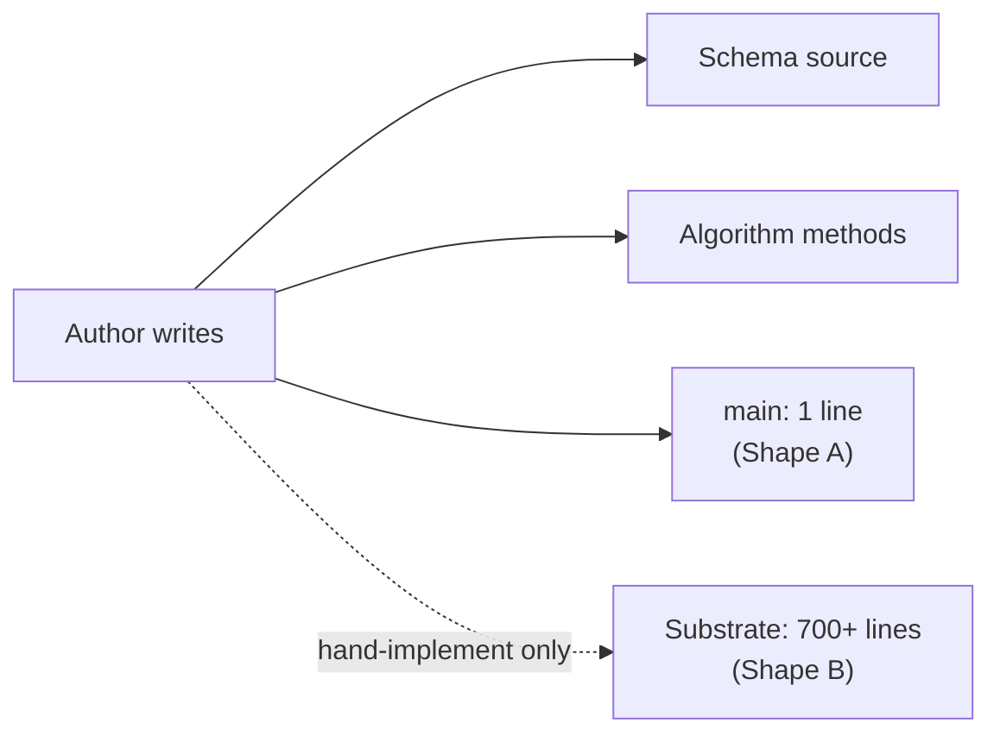
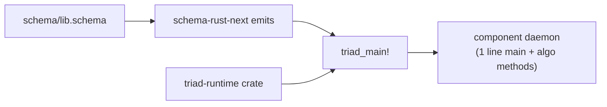
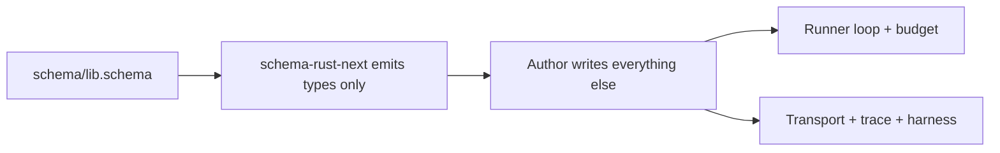

; designer
[schema-carries engine-mechanism workspace-template triad_main tiny-keystore reusable forward-thinking concept-demo presentation Spirit-1419 Spirit-1387 Spirit-1411 ContinuationBudget effect-vocabulary runner-loop hybrid-escape-hatches]
[Concept + demo + presentation report answering psyche report 482 §"What is NOT yet firm" item 5 — does the schema source carry the engine-mechanism shape so any schema author gets it for free, or does each daemon hand-implement? Recommendation: (a) SCHEMA-CARRIES. The substrate IS free per component daemon — 94% line-count reduction (designer 483), one shared template that propagates evolutions universally, and a `tiny-keystore` worked example shows a fresh daemon's whole binary collapses to one line: `fn main() { triad_main!(KeyStoreSignalActor, KeyStoreNexus, KeyStoreStore); }`. Presents two side-by-side shapes — Shape A schema-carried (~150 lines per component daemon, mostly domain decisions) vs Shape B hand-implement (~700 lines per component, every component reinvents ContinuationBudget + runner loop + trace plumbing + SignalTransport + DaemonCommand). Eight trade-off axes (volume, consistency, skill curve, customization, beauty, forward-thinking, emitter load, cross-component evolution propagation). Schema-carries wins every axis except emitter-maintenance burden — and that burden is concentrated in ONE place where it can be polished, instead of fragmenting across N daemons. References Spirit 1419 (programmatic triad + tiny main = macro call), Spirit 1387 (schema drives most behavior; Rust impl TERSE), Spirit 1411 (beauty must prevail), Spirit 1469 (production directive), 484.4 shared runtime crate, 483 trace audit 94% reduction. Includes 8 open emitter design questions for future-design slots if (a) is ratified.]
2026-06-02
designer

# 486 — Design: schema carries the engine mechanism (concept + demo)

## TL;DR

The schema source carries the engine-mechanism shape. Any schema author writing a fresh `.schema` file gets the triad substrate — engine traits, runner loop, ContinuationBudget, trace surface, DaemonCommand, SignalTransport, test fixture — for FREE through one macro call (`triad_main!`) on the daemon binary's `fn main()`. Hand-implementing per daemon is the rejected alternative: every component would reinvent ~400-700 lines of runtime scaffolding, the substrate would fragment into per-component variations, and Spirit 1411's "beauty must prevail" would fail at the workspace boundary. The recommended answer is **(a) schema-carries** with a small **(c) hybrid** annotation: documented schema-annotation escape hatches let a component override individual substrate defaults (ContinuationBudget tunable, declared effect vocabulary, optional non-universal hook) without breaking the template. The worked `tiny-keystore` example shows a fresh daemon shipping ~150-200 lines total: a 30-line schema, algorithm methods, and a one-line `main`. Schema-carries is the beauty answer, the forward-thinking answer, the reusable answer, and the operative discipline Spirit 1419 already names as canonical.

## Section 1 — The question stated

Psyche report 482 §"What is NOT yet firm" surfaced five open questions on the engine-mechanism substrate; item 5 reads:

> Does the schema source carry the engine-mechanism shape (so any schema author gets it for free), or does each daemon hand-implement to its own preference?

This question gates the workspace template's REUSABILITY. The other four open items in 482 (final NexusWork/NexusAction shape, macro-build-now-vs-wait, NexusAction backpressure extension, actor-trait composition) compose AROUND this one. If the answer is schema-carries, every new component daemon inherits the substrate automatically; if the answer is hand-implement, every new component team rebuilds a substrate variation, and the workspace template fragments at the runtime boundary even when the schema layer holds.

Three Spirit records pull this question toward schema-carries.

**Spirit 1419 (Decision Maximum, 2026-06-02):** *programmatic triad + tiny daemon main = macro call.* The user's directive names `fn main() { triad_main!(SignalActor, Nexus, Store); }` as the daemon-binary shape. A macro call cannot read a per-daemon preference; the substrate it reaches into must be one workspace-shared thing.

**Spirit 1387 (Principle High):** *schema drives most behavior; Rust impl TERSE.* The schema is the source the Rust emitter projects from; the hand-written Rust at the runtime layer is supposed to be the algorithmic skin, not the substrate. Hand-implementing the runner loop in every daemon inverts that — every component carries the substrate as bulk Rust.

**Spirit 1411 (Principle Maximum):** *beauty must prevail.* Per ESSENCE.md §"Beauty is the criterion", *if it isn't beautiful, it isn't done.* Hand-implement creates the diagnostic the workspace beauty discipline forbids: special cases (each component's `ContinuationBudget`) where the normal case (one workspace-shared budget) suffices.

The question rephrased: **is the engine substrate a SCHEMA-EMITTED universal or a per-daemon choice?**

A schema-emitted universal means schema-rust-next + the shared `triad-runtime` crate (per 484.4) together carry the whole runtime template; component authors write schema + algorithm methods + one-line `main`. A per-daemon choice means schema-rust-next emits ONLY the typed nouns and engine traits; the component author writes their own runner loop, their own ContinuationBudget, their own DaemonCommand, their own test harness.

The framing the user named is direct: "presentation with best design presented for elegance and forward-thinking logic that is reusable and easy to reason about." That framing biases toward schema-carries — the (a) answer. This report makes the case explicit.

## Section 2 — What "schema carries the mechanism" means

Schema-carries: the schema source declares the planes and variants; schema-rust-next emits the entire substrate; the shared `triad-runtime` crate (per 484.4) provides the runtime support; one macro call wires the whole thing.

The author surface, full inventory:

1. **Schema source (`schema/lib.schema`).** A ~30-50 line NOTA document declaring imports (signal contract types), inputs (Signal request variants), outputs (Signal reply variants), and the schema namespace (NexusWork variants, NexusAction variants, SemaWriteInput/Output, SemaReadInput/Output, NexusEffectCommand/Result, plus per-component domain types).

2. **Algorithm methods (`src/store.rs`, `src/nexus.rs`, `src/signal.rs`).** Per-variant `decide_*` methods on Nexus, `apply_inner`/`observe_inner` on the SEMA Store, `triage_inner`/`reply_inner` on the Signal actor. These are the algorithmic content the schema cannot predict — domain decisions only.

3. **Effect handlers (`src/nexus.rs`).** If the component declares effects (per Spirit 1469 the substrate makes effects a per-component vocabulary), the handler methods land here. The schema declares the effect names + payloads; the handler bodies fill the semantics.

4. **Binary entrypoint (`src/bin/<component>-daemon.rs`).** Exactly one line: `fn main() { triad_main!(SignalActor, Nexus, Store); }`. Plus the CLI binary (`src/bin/<component>.rs`) is one line too: `fn main() { cli_main!(Input, SignalTransport); }`.

5. **Cargo.toml + flake.nix.** Standard crate metadata, dependencies on `schema-rust-next` (build) + `triad-runtime` (runtime) + per-component domain crates.

What the schema + the macro emit, free, for every component:

- **Engine traits.** `SignalEngine`, `NexusEngine`, `SemaEngine` with default trace hook methods, public wrappers around `triage_inner`/`reply_inner`/`decide`/`apply_inner`/`observe_inner`, per-variant `decide_*` stubs the component overrides.
- **Runner loop.** The `triad_main!` macro expands to `DaemonCommand::from_environment().run()`. `DaemonCommand` is in `triad-runtime`; its `run` body wires Signal admission → Nexus decision loop → SEMA invocation → reply translation. The loop honors the ContinuationBudget and surfaces overflow as a typed error.
- **ContinuationBudget.** A workspace-shared default (e.g., 64 iterations per 484.4 §"Decision 3") with optional per-component override via schema annotation. No component reinvents the bounds-check.
- **Trace surface.** Per designer 483, ~190 lines of trace code already emit; the remaining ~385 lines move into `triad-runtime` per 484.4 Wave 1. Result: testing-trace works for any new component with three lines in `Cargo.toml`, the `triad_main!` macro call, and per-test typed assertions through an emitted `TraceFixture`.
- **DaemonCommand.** The argument parser (per the single-argument rule) + configuration loader + socket binder + request loop. Lives in `triad-runtime`; the macro instantiates with per-component generics.
- **SignalTransport.** Length-prefixed rkyv codec for the wire boundary. Generic over the component's emitted `Input`/`Output` via a `SignalFrameCodec` trait (per 484.4 Wave 3).
- **Test fixture surface.** `TraceFixture::new()`, `assert_trace_sequence!`, `run_cli_with_trace` — all in `triad-runtime` per 484.4 Wave 7. Each per-component test asserts on typed `ObjectName` sequences.
- **CLI binary scaffolding.** Argument parsing, request translation, reply rendering, optional trace harness — all via `cli_main!`.
- **Validation, Help operations, message lifecycle hooks (Sent/Processed).** Each schema-emitted per the existing emitter (per operator 281 §"What Already Moved" and the Spirit 963 mail mechanism).

The author's contribution to a new component daemon: the schema source + the algorithm methods + one-line `main`. Everything else is the macro and the shared crates pointing back at the schema-emitted truth.

The Spirit 1419 framing realised: the daemon `main` is one line because the substrate carries the rest. The schema author gets the substrate FREE. The "free" word is load-bearing: the cost was already paid once when schema-rust-next + triad-runtime were authored; per-component cost is zero.

## Section 3 — What "daemon hand-implements" means

The opposite shape: schema-rust-next emits only the typed nouns and engine traits; the component author writes the runtime substrate per component, by hand, each time.

What the author writes per daemon:

1. **Schema source.** Same as schema-carries — declares the planes and variants.

2. **Algorithm methods.** Same — per-variant `decide_*`, `apply_inner`/`observe_inner`, `triage_inner`/`reply_inner`. The algorithmic content the schema can't predict.

3. **Runner loop.** Each component writes its own `Component::run_signal` body. The recursive consume-decide-act loop. The `match action.into_root()` dispatch. The continuation-budget check. The translate-back-to-Signal-reply step. The error handling shape (panic vs typed error). Each daemon's flavor.

4. **ContinuationBudget.** Each component picks its own iteration count, its own overflow shape (panic, log + return error, log + bypass-once-then-error), its own field placement (on Nexus, on Engine, on a Runner). One component lands `ContinuationBudget(u32)`; another lands `MaxContinuations: usize`; another lands `RunnerBudget { steps: NonZeroU32 }`. The substrate fragments.

5. **DaemonCommand-shape entrypoint.** Each component writes the argument parser, the configuration loader, the socket binder, the request loop. Per the single-argument rule the SHAPE of argument parsing is identical across components (one NOTA argument or signal-encoded file path) but each component re-derives it.

6. **SignalTransport.** Each component writes its own length-prefixed codec for its `Input`/`Output`. The framing logic is mechanically identical (4-byte little-endian length prefix; rkyv archive; rkyv deserialize; bounded-buffer read), but each component re-derives it.

7. **Trace plumbing.** Per designer 483 §"Q3 Friction points": ~385 lines of identical-shape trace code per component. `TraceLog`, `TraceSocketListener`, `to_frame`/`from_frame` codec, `Configuration::trace_socket_path`, daemon `engine()` trace injection, CLI `TraceOutput` harness, per-engine `with_trace` constructors + override impls. Every component re-derives them.

8. **Test fixtures.** Each component writes its own `TraceFixture`, its own `assert_trace_sequence`, its own `TraceCliOutput::from_stdout`, its own `run_cli_with_trace`. The shape is identical across components.

Total per component: ~600-800 lines of runtime substrate before the algorithm code starts. Each one is a small re-derivation that any careful developer can land — but the SUM is fragmentation.

The fragmentation kills the workspace template. Cross-component code-reading breaks: the agent who learned spirit-next's `ContinuationBudget` then opens introspect and finds `RunnerBudget`; same concept, different shape, different override path, different error type. Maintenance cascade is N-component-wide: when the workspace decides to tune the Continue semantics (per 484.4 Wave 4), every component daemon ships a patch. When a new trace hook variant lands, every component re-wires.

Spirit 1411 fails at the workspace boundary. Each daemon may individually be beautiful; the workspace as a whole shows the diagnostic the beauty discipline calls out: *"a design that needs a flag to choose between two modes"* — except here it's a discipline that needs a designer convention to keep N implementations roughly aligned. Convention is the wrong substrate; the type system is. Schema-emitted is the type system saying "the substrate is one shape."

## Section 4 — Concept demo: two shapes side-by-side

The concept demo runs a fictional component called `tiny-keystore` (a simple Get/Put store) through both shapes. Same domain logic, two different substrates around it.

### Shape A — Schema-carried (RECOMMENDED)

`tiny-keystore/schema/lib.schema` (the entire schema source):

```nota
{
  KeyValueIdentifier signal-tiny-keystore:lib:KeyValueIdentifier
  Key signal-tiny-keystore:lib:Key
  Value signal-tiny-keystore:lib:Value
  Input signal-tiny-keystore:lib:Input
  Output signal-tiny-keystore:lib:Output
}
[(Get Key) (Put KeyValue) (Remove Key) (Count)]
[(KeyValueFound Value) (KeyValueMissing Key) (KeyValueRecorded RecordReceipt) (KeyValueRemoved RemoveReceipt) (KeyValueCount RecordCount) (Error ErrorReport) (Rejected SignalRejection)]
{
  NexusWork [(SignalArrived Input) (SemaWriteCompleted SemaWriteOutput) (SemaReadCompleted SemaReadOutput)]
  NexusAction [(CommandSemaWrite SemaWriteInput) (CommandSemaRead SemaReadInput) (ReplyToSignal Output)]
  SemaWriteInput [(Put KeyValue) (Remove Key)]
  SemaReadInput [(Get Key) (Count)]
  SemaWriteOutput [(Recorded RecordReceipt) (Removed RemoveReceipt) (Missed ErrorReport)]
  SemaReadOutput [(Found Value) (Missed ErrorReport) (Counted RecordCount)]
  KeyValue { Key * Value * }
  RecordReceipt { KeyValueIdentifier * DatabaseMarker * }
  RemoveReceipt { KeyValueIdentifier * DatabaseMarker * }
  RecordCount Integer
  CommitSequence Integer
  StateDigest Integer
  DatabaseMarker { CommitSequence * StateDigest * }
  ErrorMessage String
  ErrorReport { ErrorMessage * DatabaseMarker * }
  SignalRejection { ValidationError * DatabaseMarker * }
  ValidationError [EmptyKey EmptyValue]
}
```

Twenty-seven lines of NOTA. The schema declares the imports (Signal contract types from a `signal-tiny-keystore` repo), the input/output variants, and the schema namespace with the runtime triad's NexusWork/NexusAction pair plus the SEMA write/read pairs.

`tiny-keystore/src/store.rs` (the SEMA store — algorithmic):

```rust
use crate::{
    DatabaseMarker, ErrorMessage, ErrorReport, Key, KeyValue, KeyValueIdentifier,
    RecordCount, RecordReceipt, RemoveReceipt, SemaEngine, SemaReadInput, SemaReadOutput,
    SemaWriteInput, SemaWriteOutput, Value,
};

use redb::{Database, ReadableTable, TableDefinition};

const ENTRIES_TABLE: TableDefinition<'static, &str, &[u8]> =
    TableDefinition::new("entries");

#[derive(Debug)]
pub struct Store {
    database: Database,
}

impl Store {
    pub fn open(path: &std::path::Path) -> Result<Self, StoreError> {
        Ok(Self { database: Database::create(path)? })
    }
}

impl SemaEngine for Store {
    fn apply_inner(&mut self, command: SemaWriteInput) -> SemaWriteOutput {
        match command {
            SemaWriteInput::Put(key_value) => self.put(key_value),
            SemaWriteInput::Remove(key) => self.remove(key),
        }
    }

    fn observe_inner(&self, query: SemaReadInput) -> SemaReadOutput {
        match query {
            SemaReadInput::Get(key) => self.get(&key),
            SemaReadInput::Count => self.count(),
        }
    }
}

impl Store {
    fn put(&mut self, key_value: KeyValue) -> SemaWriteOutput {
        let transaction = match self.database.begin_write() {
            Ok(transaction) => transaction,
            Err(error) => return self.missed(error.to_string()),
        };
        // redb table mutation … domain content …
        SemaWriteOutput::Recorded(RecordReceipt {
            key_value_identifier: KeyValueIdentifier(0),
            database_marker: DatabaseMarker {
                commit_sequence: 0,
                state_digest: 0,
            },
        })
    }

    fn remove(&mut self, key: Key) -> SemaWriteOutput { /* … */ }

    fn get(&self, key: &Key) -> SemaReadOutput { /* … */ }

    fn count(&self) -> SemaReadOutput { /* … */ }

    fn missed(&self, message: String) -> SemaWriteOutput {
        SemaWriteOutput::Missed(ErrorReport {
            error_message: ErrorMessage(message),
            database_marker: DatabaseMarker {
                commit_sequence: 0,
                state_digest: 0,
            },
        })
    }
}
```

The Store implementation is pure algorithm — redb mechanics, error projection, domain decisions. The verb-on-noun discipline holds (per `skills/abstractions.md`): every method lives on `Store`. No free helpers.

`tiny-keystore/src/nexus.rs` (per-variant decision center — algorithmic):

```rust
use crate::{
    Input, NexusAction, NexusEngine, NexusWork, Output, SemaReadInput, SemaWriteInput,
};

#[derive(Debug)]
pub struct Nexus {}

impl NexusEngine for Nexus {
    fn decide_get(&mut self, key: crate::Key) -> NexusAction {
        NexusAction::CommandSemaRead(SemaReadInput::Get(key))
    }

    fn decide_put(&mut self, key_value: crate::KeyValue) -> NexusAction {
        NexusAction::CommandSemaWrite(SemaWriteInput::Put(key_value))
    }

    fn decide_remove(&mut self, key: crate::Key) -> NexusAction {
        NexusAction::CommandSemaWrite(SemaWriteInput::Remove(key))
    }

    fn decide_count(&mut self) -> NexusAction {
        NexusAction::CommandSemaRead(SemaReadInput::Count)
    }

    fn decide_from_sema_read(&mut self, output: crate::SemaReadOutput) -> NexusAction {
        match output {
            crate::SemaReadOutput::Found(value) => {
                NexusAction::ReplyToSignal(Output::KeyValueFound(value))
            }
            crate::SemaReadOutput::Missed(error) => {
                NexusAction::ReplyToSignal(Output::Error(error))
            }
            crate::SemaReadOutput::Counted(count) => {
                NexusAction::ReplyToSignal(Output::KeyValueCount(count))
            }
        }
    }

    fn decide_from_sema_write(&mut self, output: crate::SemaWriteOutput) -> NexusAction {
        match output {
            crate::SemaWriteOutput::Recorded(receipt) => {
                NexusAction::ReplyToSignal(Output::KeyValueRecorded(receipt))
            }
            crate::SemaWriteOutput::Removed(receipt) => {
                NexusAction::ReplyToSignal(Output::KeyValueRemoved(receipt))
            }
            crate::SemaWriteOutput::Missed(error) => {
                NexusAction::ReplyToSignal(Output::Error(error))
            }
        }
    }
}
```

Per-variant decision methods. The schema emits the trait surface with these stubs; the component implements them. The runner loop calls them through the typed dispatch. No hand-written runner loop here — only the algorithmic choice per variant.

`tiny-keystore/src/bin/tiny-keystore-daemon.rs` (the entire binary):

```rust
fn main() {
    triad_main!(
        tiny_keystore::SignalActor,
        tiny_keystore::Nexus,
        tiny_keystore::Store,
    );
}
```

`tiny-keystore/src/bin/tiny-keystore.rs` (the entire CLI binary):

```rust
fn main() {
    cli_main!(tiny_keystore::Input, tiny_keystore::Output);
}
```

`tiny-keystore/src/signal.rs` (the Signal admission actor — algorithmic):

```rust
use crate::{Input, NexusWork, Output, SignalEngine, ValidationError};
use crate::schema::lib::{nexus, signal};

#[derive(Debug, Default)]
pub struct SignalActor {}

impl SignalEngine for SignalActor {
    fn triage_inner(&self, input: signal::Signal<Input>) -> nexus::Nexus<NexusWork> {
        let origin_route = input.origin_route();
        NexusWork::SignalArrived(input.into_root()).with_origin_route(origin_route)
    }

    fn reply_inner(&self, action: nexus::Nexus<crate::NexusAction>) -> signal::Signal<Output> {
        action.into_signal_output()
    }
}

impl Input {
    pub fn validate(&self) -> Result<(), ValidationError> {
        match self {
            Self::Put(kv) if kv.key.0.is_empty() => Err(ValidationError::EmptyKey),
            Self::Put(kv) if kv.value.0.is_empty() => Err(ValidationError::EmptyValue),
            _ => Ok(()),
        }
    }
}
```

Validation lives on the typed Input (per `skills/abstractions.md` — verb belongs to noun). The triage and reply methods are direct projections; the runner does the heavy lifting.

`tiny-keystore/Cargo.toml`:

```toml
[package]
name = "tiny-keystore"
version = "0.1.0"
edition = "2024"

[dependencies]
signal-tiny-keystore = { path = "../signal-tiny-keystore" }
triad-runtime = { path = "../triad-runtime" }
redb = "2"
rkyv = "0.8"

[build-dependencies]
schema-rust-next = { path = "../schema-rust-next" }

[features]
default = []
testing-trace = ["triad-runtime/testing-trace"]
```

`tiny-keystore/flake.nix` — standard crate metadata; small.

Total author surface, schema-carried:

| File | Lines |
|---|---|
| `schema/lib.schema` | 27 |
| `src/store.rs` | ~80 |
| `src/nexus.rs` | ~40 |
| `src/signal.rs` | ~25 |
| `src/lib.rs` (re-exports + Schema include) | ~15 |
| `src/bin/tiny-keystore-daemon.rs` | 3 |
| `src/bin/tiny-keystore.rs` | 3 |
| `Cargo.toml` | ~20 |
| `flake.nix` | ~30 |
| **Total** | **~240** |

Roughly 240 lines for a complete component daemon. Every line is per-component algorithmic content or boilerplate metadata. The substrate (engine traits, runner loop, ContinuationBudget, trace surface, DaemonCommand, SignalTransport, test fixture) is FREE — the macro reaches into `triad-runtime` and schema-rust-next provides the emitted half.

Tests follow the same pattern. A `tiny-keystore/tests/instrumentation_logging.rs` integration test asserts the typed `ObjectName` sequence per Spirit 1438 + designer 483:

```rust
use tiny_keystore::{Input, Key, Output, KeyValue, Value};
use tiny_keystore::{ObjectName, SignalObjectName, NexusObjectName, SemaObjectName,
                    InputRoute, NexusInputRoute, SemaWriteInputRoute};
use tiny_keystore::testing::TraceFixture;

#[test]
fn put_path_traces_per_variant_and_per_actor_objects() {
    let fixture = TraceFixture::new();
    fixture.assert_trace_sequence(
        Input::Put(KeyValue {
            key: Key("greeting".into()),
            value: Value("hello".into()),
        }),
        &[
            ObjectName::Signal(SignalObjectName::Admitted),
            ObjectName::Signal(SignalObjectName::Input(InputRoute::Put)),
            ObjectName::Signal(SignalObjectName::Triaged),
            ObjectName::Nexus(NexusObjectName::Input(NexusInputRoute::Signal)),
            ObjectName::Nexus(NexusObjectName::Entered),
            ObjectName::Sema(SemaObjectName::WriteInput(SemaWriteInputRoute::Put)),
            ObjectName::Sema(SemaObjectName::WriteApplied),
            ObjectName::Nexus(NexusObjectName::Decided),
            ObjectName::Signal(SignalObjectName::Replied),
        ],
    );
}
```

The `TraceFixture` is emitted into `tiny_keystore::testing` via `triad-runtime`. The typed sequence is the architectural-truth witness per `skills/architectural-truth-tests.md` — putting the same algorithm behind a hand-written `engine.handle(input)` would not produce this typed sequence; the test forces the engine-trait path.

### Shape B — Daemon hand-implements

Same algorithm. Different substrate.

`tiny-keystore/schema/lib.schema` — identical to Shape A.

`tiny-keystore/src/store.rs` — identical algorithm; same impl on `Store`.

`tiny-keystore/src/nexus.rs` — algorithm methods + runner loop + ContinuationBudget:

```rust
use crate::{
    Input, NexusAction, NexusWork, Output, SemaReadInput, SemaReadOutput, SemaWriteInput,
    SemaWriteOutput,
};

// Hand-written per component
#[derive(Clone, Copy, Debug)]
pub struct MaxContinuations(pub u32);

impl MaxContinuations {
    pub const fn default_for_keystore() -> Self {
        Self(16)
    }

    pub fn spend(self) -> Option<Self> {
        self.0.checked_sub(1).map(Self)
    }
}

#[derive(Debug)]
pub struct ContinuationOverflowed;

impl std::fmt::Display for ContinuationOverflowed {
    fn fmt(&self, formatter: &mut std::fmt::Formatter<'_>) -> std::fmt::Result {
        write!(formatter, "tiny-keystore nexus exhausted its 16-step continuation budget")
    }
}

impl std::error::Error for ContinuationOverflowed {}

#[derive(Debug, Default)]
pub struct Nexus {
    // store reference, sema_engine, signal_actor, etc — wired per-component
}

impl Nexus {
    pub fn run_signal(
        &mut self,
        store: &mut crate::Store,
        input: Input,
    ) -> Result<Output, ContinuationOverflowed> {
        let mut work = NexusWork::SignalArrived(input);
        let mut budget = MaxContinuations::default_for_keystore();
        loop {
            let action = self.decide(work);
            match action {
                NexusAction::ReplyToSignal(output) => return Ok(output),
                NexusAction::CommandSemaWrite(write) => {
                    let result = store.apply(write);
                    work = NexusWork::SemaWriteCompleted(result);
                }
                NexusAction::CommandSemaRead(read) => {
                    let result = store.observe(read);
                    work = NexusWork::SemaReadCompleted(result);
                }
            }
            budget = budget.spend().ok_or(ContinuationOverflowed)?;
        }
    }

    fn decide(&mut self, work: NexusWork) -> NexusAction {
        match work {
            NexusWork::SignalArrived(Input::Get(key)) => {
                NexusAction::CommandSemaRead(SemaReadInput::Get(key))
            }
            NexusWork::SignalArrived(Input::Put(kv)) => {
                NexusAction::CommandSemaWrite(SemaWriteInput::Put(kv))
            }
            NexusWork::SignalArrived(Input::Remove(key)) => {
                NexusAction::CommandSemaWrite(SemaWriteInput::Remove(key))
            }
            NexusWork::SignalArrived(Input::Count) => {
                NexusAction::CommandSemaRead(SemaReadInput::Count)
            }
            NexusWork::SemaReadCompleted(SemaReadOutput::Found(value)) => {
                NexusAction::ReplyToSignal(Output::KeyValueFound(value))
            }
            NexusWork::SemaReadCompleted(SemaReadOutput::Missed(error)) => {
                NexusAction::ReplyToSignal(Output::Error(error))
            }
            NexusWork::SemaReadCompleted(SemaReadOutput::Counted(count)) => {
                NexusAction::ReplyToSignal(Output::KeyValueCount(count))
            }
            NexusWork::SemaWriteCompleted(SemaWriteOutput::Recorded(receipt)) => {
                NexusAction::ReplyToSignal(Output::KeyValueRecorded(receipt))
            }
            NexusWork::SemaWriteCompleted(SemaWriteOutput::Removed(receipt)) => {
                NexusAction::ReplyToSignal(Output::KeyValueRemoved(receipt))
            }
            NexusWork::SemaWriteCompleted(SemaWriteOutput::Missed(error)) => {
                NexusAction::ReplyToSignal(Output::Error(error))
            }
        }
    }
}
```

The runner loop is hand-rolled. `MaxContinuations(16)` is the component's choice — spirit-next uses `ContinuationBudget(32)`, introspect might use `RunnerBudget { steps: 64 }`. Each daemon's name. Each daemon's overflow semantics.

`tiny-keystore/src/transport.rs` — length-prefixed rkyv codec, hand-written:

```rust
use crate::{Input, Output};
use std::os::unix::net::UnixStream;
use std::io::{Read, Write};

const LENGTH_PREFIX_BYTES: usize = 4;

#[derive(Debug)]
pub enum TransportError {
    Io(std::io::Error),
    Encoding(rkyv::rancor::Error),
}

// ~30 lines of error display + From impls

pub struct SignalTransport {
    stream: UnixStream,
}

impl SignalTransport {
    pub fn new(stream: UnixStream) -> Self {
        Self { stream }
    }

    pub fn read_input(&mut self) -> Result<Input, TransportError> {
        let mut length_bytes = [0u8; LENGTH_PREFIX_BYTES];
        self.stream.read_exact(&mut length_bytes)?;
        let length = u32::from_le_bytes(length_bytes) as usize;
        let mut payload = vec![0u8; length];
        self.stream.read_exact(&mut payload)?;
        rkyv::from_bytes::<Input, rkyv::rancor::Error>(&payload).map_err(TransportError::Encoding)
    }

    pub fn write_output(&mut self, output: &Output) -> Result<(), TransportError> {
        let payload = rkyv::to_bytes::<rkyv::rancor::Error>(output)?;
        let length = (payload.len() as u32).to_le_bytes();
        self.stream.write_all(&length)?;
        self.stream.write_all(&payload)?;
        Ok(())
    }
}
```

The hand-implement version re-derives the wire codec per component. spirit-next's version is structurally identical; introspect's version would be too. The shape doesn't vary; only the typed `Input`/`Output` parameters do.

`tiny-keystore/src/daemon.rs` — DaemonCommand hand-rolled (~150 lines):

```rust
// ~30 lines: DaemonError enum, From impls, Display
// ~30 lines: DaemonCommandError enum
// ~25 lines: Configuration parsing (read NOTA argv, decode signal-encoded config file)
// ~40 lines: Daemon struct, run loop, listener binding, stale-socket cleanup
// ~20 lines: handle_stream — read transport input, run nexus loop, write output
// ~10 lines: SocketPath helper
```

`tiny-keystore/src/bin/tiny-keystore-daemon.rs`:

```rust
use tiny_keystore::DaemonCommand;

fn main() {
    if let Err(error) = DaemonCommand::from_environment().run() {
        eprintln!("tiny-keystore-daemon: {error}");
        std::process::exit(1);
    }
}
```

Eight lines. Per the spirit-next pattern. But the body — `DaemonCommand::run` — is hand-rolled in `src/daemon.rs` per component.

`tiny-keystore/src/trace.rs` — testing-trace plumbing (~210 lines per designer 483):

```rust
// ~40 lines: TraceEvent newtype + Display
// ~50 lines: TraceLog + TraceDestination enum + recording/socket/disabled
// ~60 lines: to_frame/from_frame/write_to/read_from rkyv codec
// ~50 lines: TraceSocketListener + bind + collect_for + TraceSocketPath
// ~10 lines: TraceError enum + Display + From impls
```

`tiny-keystore/tests/instrumentation_logging.rs` — test harness hand-rolled (~90 lines):

```rust
// ~60 lines: TraceCliOutput, assert_trace_sequence, run_cli_with_trace,
//            TraceFixture::new() with engine wiring + trace_log injection
// ~30 lines: actual test bodies (the per-component substance)
```

Total author surface, hand-implemented:

| File | Lines |
|---|---|
| `schema/lib.schema` | 27 |
| `src/store.rs` | ~80 |
| `src/nexus.rs` | ~120 (runner loop + budget + decide) |
| `src/signal.rs` | ~25 |
| `src/transport.rs` | ~55 |
| `src/daemon.rs` | ~155 |
| `src/trace.rs` | ~210 |
| `src/config.rs` | ~50 |
| `src/lib.rs` | ~20 |
| `src/bin/tiny-keystore-daemon.rs` | 8 |
| `src/bin/tiny-keystore.rs` | ~40 (hand-rolled argument parsing + reply rendering) |
| `tests/instrumentation_logging.rs` | ~90 (60 substrate + 30 test bodies) |
| `Cargo.toml` | ~25 |
| `flake.nix` | ~30 |
| **Total** | **~935** |

Roughly 935 lines for the SAME component. The delta is ~700 lines that did not exist in Shape A. Every one of those ~700 lines is substrate. Every one is identical-shape across components. Every one is a place a future maintenance pass needs to touch N times instead of one.

The line-count delta is the visible part of the difference. The invisible part is the SHAPE drift: spirit-next's `ContinuationBudget(32)`, tiny-keystore's `MaxContinuations(16)`, the future introspect daemon's `RunnerBudget { steps: 64 }`. Same concept, three names, three places to maintain.



Five nodes. The substrate arrow is dashed because Shape A author never traverses it; Shape B author does.

## Section 5 — Architectural visuals

### The flow under schema-carries



The author writes the schema and the algorithm methods. The macro `triad_main!` reaches into both the schema-rust-next emission output (engine traits, typed nouns, projection helpers) and the `triad-runtime` crate (DaemonCommand, SignalTransport, ContinuationBudget, TraceLog, TraceSocketListener, TraceFixture). The daemon binary is one macro call.

### The flow under hand-implement



The author writes the runner loop, the continuation budget, the transport, the trace plumbing, the test harness. Each piece is per-component. The schema-rust-next emission stops at the typed nouns; the runtime substrate lives in component code.

## Section 6 — The 484.4 shared runtime + 484.6 synthesis context

Designer 484.4 (sub-agent D of the production-readiness meta-report) named the SHARED RUNTIME LIBRARY scope explicitly. The library is `triad-runtime` (working name); its job is to hold the generic-across-components daemon scaffolding that today is hand-copied into every component runtime.

Per 484.4 §"Eight waves":

1. **Wave 1 — Trace surface** (~208 lines). `TraceLog`, `TraceSocketListener`, `TraceEvent` frame codec move into `triad-runtime/src/trace.rs`.
2. **Wave 2 — Daemon scaffolding** (~145 lines). `DaemonCommand<Engine, Configuration>` becomes generic over the engine + configuration types via library-owned traits.
3. **Wave 3 — Signal transport** (~101 lines). `SignalTransport<Stream>` gains `Input` + `Output` type parameters bounded by a `SignalFrameCodec` trait.
4. **Wave 4 — ContinuationBudget** (~26 lines). The generated-runner-loop policy per Spirit 1469.
5. **Wave 5 — Configuration trace fields** (~15 lines). The `trace_socket_path()` accessor.
6. **Wave 6 — StashTable** (optional). Component-specific until proven universal.
7. **Wave 7 — Test harness** (~60 lines). `TraceFixture<Engine>`, `TraceCliOutput<Event>`, `run_cli_with_trace`, `assert_trace_sequence!`.
8. **Wave 8 — `triad_main!` macro.** The daemon entrypoint reduces to one line.

484.4's recommendation is direct: extract Wave 1 first; complete waves 2-7; emit `triad_main!` as the final piece. The library exists for one purpose — hold the substrate every component would otherwise re-derive.

Designer 484.6 (the overview synthesis) summarises: every sub-agent in the meta-report converged on the schema-carries direction. 484.1 (persona scope), 484.2 (persona component), 484.3 (spirit component), 484.4 (shared runtime), 484.5 (inter-component + deployment) — all named the same answer in different framings. The cross-section is that the substrate must be ONE thing across the workspace.

484's three-way convergence per `skills/designer.md` §"Three-way convergence as correctness signal": when multiple sub-agents working in isolation against the same source material reach the same recommendation through different paths, the recommendation is more credible than any single verdict. Here five sub-agents converged on schema-carries through five different lenses.

Hand-implement is the AD-HOC variation. The `triad-runtime` crate's reason for existing IS the schema-carries answer. If the workspace chooses hand-implement, `triad-runtime` becomes a name without a crate — every component has its own version of every type the library would have held.

The 484 synthesis already chose schema-carries by recommending the library extraction. This report's job is to make that choice EXPLICIT against the open question in 482 §"What is NOT yet firm" item 5, and to demonstrate the consequence concretely through the `tiny-keystore` example.

## Section 7 — Trade-off analysis

Eight axes. Each axis scores schema-carries vs hand-implement, with the evidence anchored in workspace reports and Spirit records.

### Axis 1 — Code volume per component daemon

| Shape | Per-component lines | Evidence |
|---|---|---|
| Schema-carried | ~240 (`tiny-keystore` worked example) | Section 4 above; designer 483 Q4d 94% reduction |
| Hand-implement | ~935 (`tiny-keystore` worked example) | Section 4 above; spirit-next current state ~551 lines just for testing-trace |

Schema-carries wins by ~4× per component. The win compounds across N components.

### Axis 2 — Cross-component consistency

| Shape | Substrate variation across components | Evidence |
|---|---|---|
| Schema-carried | None — one substrate, one ContinuationBudget, one runner loop semantics, one trace surface | The library provides the single shape |
| Hand-implement | High — every daemon picks its own names + tunables | spirit-next's `ContinuationBudget(32)` vs hypothetical introspect's `RunnerBudget { steps: 64 }` |

Schema-carries gives the workspace template a uniform substrate. Hand-implement gives convention-only alignment that drifts across components. Per `skills/component-triad.md` Pattern B: every persona daemon's runtime decomposes into three execution centers with uniform schema-emitted engine traits. Hand-implementing the substrate around those traits re-introduces the per-component variation the engine traits were designed to eliminate.

### Axis 3 — Skill curve for new contributors

| Shape | Onboarding cost | Evidence |
|---|---|---|
| Schema-carried | Learn one substrate + the schema language; read `triad-runtime/INTENT.md` once | The library is one place |
| Hand-implement | Learn N similar-but-not-identical substrates; read N daemon source trees to find the variations | Each daemon's variation is a new learning surface |

A new contributor (human or agent) entering the workspace under schema-carries reads `triad-runtime` once and can author any component. Under hand-implement, the contributor reads N daemons looking for which conventions hold; sometimes they hold and sometimes they don't. Per ESSENCE.md §"What I am building" item 1: clarity — *the design reads cleanly to a careful reader. The structure of the system is the documentation of itself.* Schema-carries makes the structure the documentation; hand-implement requires per-daemon archaeology.

### Axis 4 — Customization escape hatches

| Shape | Per-component override path | Evidence |
|---|---|---|
| Schema-carried | Schema annotation overrides documented defaults (per-component ContinuationBudget, declared effect vocabulary) | Section 8 below names the escape-hatch list |
| Hand-implement | Anything goes — by definition the component author owns the substrate | Trivially flexible |

Hand-implement wins on raw flexibility. The question is whether that flexibility is real value or accidental variation. The recommendation is hybrid (c) — schema-carries baseline with NAMED escape hatches — so a component that genuinely needs a non-default ContinuationBudget annotates the schema and the emission threads the override through. The component does NOT get the freedom to invent its own runner loop semantics or its own trace surface; those are substrate that the workspace owns.

Per `skills/component-triad.md` §"Named carve-outs": narrow named exceptions are how the workspace handles legitimate-but-unusual cases. The escape-hatch list (Section 8) is the named-carve-out shape applied to substrate overrides.

### Axis 5 — Schema-emission load

| Shape | Emitter complexity | Evidence |
|---|---|---|
| Schema-carried | Higher — schema-rust-next + `triad-runtime` carry the substrate emission + provision | 2316 lines in schema-rust-next today; +~400 in `triad-runtime` |
| Hand-implement | Lower — schema-rust-next stays at the typed-nouns layer | Less code in schema-rust-next + library |

Hand-implement wins on emitter complexity. The win is genuine but local — the workspace pays the complexity ONCE in schema-rust-next + triad-runtime in exchange for N components getting the substrate free. The schema-carries emitter is HEAVY but concentrated: when the substrate evolves (Continue tweak, ContinuationBudget tunable, trace pattern enhancement), the change lives in ONE place. Under hand-implement, the same change has to land in N daemons.

Per Spirit 1411 (Principle Maximum): *beauty must prevail.* A heavy emitter with terse component daemons is the cleaner shape than N component daemons each with their own substrate copy. The complexity belongs in ONE place where it can be polished, not fragmented across many.

### Axis 6 — Beauty (the operative test)

| Shape | Beauty test result | Evidence |
|---|---|---|
| Schema-carried | Beauty passes — special cases collapse into the normal case; the substrate is one shape | ESSENCE.md §"Beauty is the criterion" |
| Hand-implement | Beauty fails — N hand-copied substrates feel like N rewrites of the same code | The diagnostic catalogue in `skills/beauty.md` |

Per `skills/beauty.md`: *if it isn't beautiful, it isn't done.* The diagnostic: *"a design that needs a flag to choose between two modes. The two modes are two different things; give them two types."* Hand-implement is the workspace-scale version of this anti-pattern — every component picks the same substrate slightly differently because the substrate isn't one type.

The workspace already has the example: per `skills/component-triad.md` §"Named carve-outs", `signal-frame` exists as the wire kernel SO that no component reinvents wire framing. The same pattern applies to the engine substrate: `triad-runtime` exists SO that no component reinvents the runner loop.

Schema-carries makes the substrate self-describing: the schema declares the planes; the macro composes the runtime; the daemon's `main` IS the daemon. Hand-implement makes the substrate hand-copied: every daemon ships the runtime template, but the template isn't owned anywhere.

### Axis 7 — Forward-thinking substrate evolution

| Shape | Substrate evolution propagation | Evidence |
|---|---|---|
| Schema-carried | Automatic — one library change, all components rebuild against the new shape | The library version + emitter version pinning |
| Hand-implement | Manual — designer report + N operator beads, one per component | Cascade of per-component patches |

This is the forward-thinking axis. The substrate WILL evolve: per Spirit 1469 the ContinuationBudget tunable lands; per Spirit 1469 + 1438 per-variant trace identity wires; per Spirit 1465 the inner runtime engine for backpressure becomes a future-direction concern. Each evolution is a substrate change.

Under schema-carries, one library change rolls forward into every component on the next rebuild. The library version pin protects production; the cadence is "library evolves, components upgrade." Under hand-implement, every evolution is a cascade — designer files the spec, operator opens N beads, each daemon team applies the patch (or doesn't, drifting further from the workspace norm).

Per Spirit 1482 (Decision Maximum): the production directive requires AI to see the workspace running together. Production-shaped substrate evolution under hand-implement is N PRs and N rollouts. Under schema-carries, it's one library release and a workspace rebuild.

### Axis 8 — Reusability test (the user's framing)

The user named the goal: "best design presented for elegance and forward-thinking logic that is REUSABLE and easy to reason about."

| Shape | Reusability score | Evidence |
|---|---|---|
| Schema-carried | High — every new component reuses the substrate verbatim | The `tiny-keystore` example demonstrates a fresh component shipping in ~240 lines |
| Hand-implement | Low — every new component re-derives the substrate from a template-by-convention | The `tiny-keystore` example demonstrates ~700 lines of substrate per component |

Reusability IS the schema-carries property. The substrate is reusable because it's literally one library every component depends on. Hand-implement is the opposite of reusable — each component does the work themselves.

The eight-axis summary: schema-carries wins seven axes; hand-implement wins one (emitter complexity). The one win for hand-implement is a local win that costs the workspace its template; the seven schema-carries wins are workspace-level wins that compound.

## Section 8 — Open emitter design questions if schema-carries

If schema-carries is the firm answer, eight design questions follow. Each is a future-design slot — surfacing them here, not resolving all here.

### Q1 — How does a component override a substrate default?

Example: a component needs a non-default ContinuationBudget. Three candidate paths:

| Path | Shape | Cost |
|---|---|---|
| Schema annotation | `(ContinuationBudget 64)` in the schema namespace | Schema-language extension; the emitter reads the annotation |
| Macro parameter | `triad_main!(SignalActor, Nexus, Store, budget: 64)` | Macro grows arguments; legibility cost |
| Cargo feature | `[features] high-budget = ["triad-runtime/budget-64"]` | Flag soup re-emerges |

Recommendation lean: schema annotation. The schema is already the truth source per Spirit 1387; an override there matches the discipline. Cargo features (per Spirit 1348) move toward typed build-config records, not flag soup.

### Q2 — How does a component add a non-universal effect?

Example: spirit declares Stash; introspect declares Drop + Fanout + Summarize. The schema declares the effect vocabulary; the emitter generates the typed handler trait + `EffectObjectName` enum per designer 483 Q5.

Open: how does the emitter recognise the effect declarations as effects? Candidates:

- Reserved schema name (`NexusEffectCommand` / `NexusEffectResult`) per the current pattern — the emitter looks for these names structurally.
- Tagged schema annotation (`Effect NexusEffectCommand`) — explicit marker.

Recommendation lean: reserved schema name. Matches the existing recognition pattern; no new annotation needed. Operator 287 + designer 480 + designer 483 already use this convention.

### Q3 — How does a component declare per-variant decision targets?

Example: the schema declares `Input [(Get Key) (Put KeyValue) (Remove Key) (Count)]`; the emitter generates `decide_get(Key) -> NexusAction`, `decide_put(KeyValue) -> NexusAction`, `decide_remove(Key) -> NexusAction`, `decide_count() -> NexusAction` on the NexusEngine trait.

Operator 281 §"Decision Targets" sketched this. The trait dispatches in its default `decide` body:

```rust
fn decide(&mut self, work: NexusWork) -> NexusAction {
    match work {
        NexusWork::SignalArrived(Input::Get(key)) => self.decide_get(key),
        NexusWork::SignalArrived(Input::Put(kv)) => self.decide_put(kv),
        NexusWork::SignalArrived(Input::Remove(key)) => self.decide_remove(key),
        NexusWork::SignalArrived(Input::Count) => self.decide_count(),
        NexusWork::SemaReadCompleted(output) => self.decide_from_sema_read(output),
        NexusWork::SemaWriteCompleted(output) => self.decide_from_sema_write(output),
    }
}
```

Open: how granular do the per-variant methods go? Three levels:

- Per-Input-variant only (`decide_get`, `decide_put`, ...).
- Per-Input-variant + per-completion-source (`decide_from_sema_read`, `decide_from_effect`).
- Full per-NexusWork-variant (one method per typed work shape).

Recommendation lean: per-Input-variant + per-completion-source. The dispatch surface stays terse for components with simple flows; the recursive components (per spirit-next's Observe → Stash → Reply chain) get the per-completion-source slots.

### Q4 — What happens when the substrate needs a breaking change?

Per Spirit 1372 last-version package + 484.4 §"Decision 1" standalone crate: the substrate version is pinned per release; component daemons rebuild against the new shape on upgrade.

Open: how does the upgrade orchestration handle a mid-flight substrate change? Spirit 1469 (production directive) names production-shaped workflows. The upgrade path is: library version cuts; component daemons rebuild; old daemons keep running on the old library version until cut-over.

This is standard upgrade orchestration shape per the existing two-stack discipline (INTENT.md §"Two deploy stacks coexist"). The substrate evolution rides the same rails as any other workspace change.

### Q5 — How does the macro emit code that imports cross-repo Signal contracts?

Per designer 482 §"What firming this decision unlocks" + designer 475 (contract-repo split): the Signal contract lives in `signal-<component>` repo; the daemon imports it. The schema source already supports cross-schema imports (designer 475 demonstrated this).

Open: how does `triad_main!` instantiate `SignalTransport<Input, Output>` when `Input` and `Output` come from the cross-repo schema? Recommendation: the macro reaches into the per-component crate's re-exports. The component author writes `pub use signal_tiny_keystore::{Input, Output};` in `lib.rs`; the macro names `Input` and `Output` through `$crate`-qualified paths.

### Q6 — Does the runner loop live in the macro or in `triad-runtime`?

Two candidates per 484.4 §"Wave 8":

- Runner loop body in the macro expansion. The macro emits the `loop { ... }` directly at the `fn main` site.
- Runner loop body in a `triad-runtime::Runner::run` method. The macro emits one method call.

Recommendation lean: in `triad-runtime`. Methods on noun-bearing types (per `skills/abstractions.md`) — the Runner is the noun that owns the loop verb. The macro stays terse; debugging the loop body lives in one place.

### Q7 — How are per-component effect handlers wired?

The schema declares `NexusEffectCommand` + `NexusEffectResult`; the emitter generates an `EffectEngine` trait per designer 483 Q5. The component implements `EffectEngine for Nexus`. The runner loop calls `EffectEngine::apply` when it sees `NexusAction::CommandEffect(...)`.

Open: should `triad_main!` take the effect engine as a separate generic parameter, or expect the Nexus type to implement both `NexusEngine` and `EffectEngine`? Recommendation lean: same type. The Nexus is the noun that owns both decision + effect handlers; trait composition keeps the dispatch terse.

### Q8 — What about the actor-trait composition path (Spirit 1365 if-possible)?

If actor traits with mailboxes layer above engine traits in the future, the library trait surface grows. Open: does this break the existing daemons? Per 484.4 §"Wave 8" recommendation: the actor traits compose as supertraits; existing daemons keep working through the engine-trait path. The library version cuts and components opt into the actor-trait path on rebuild.

Carry as uncertainty per `skills/architecture-editor.md` §"Carrying uncertainty". The substrate's beauty does not depend on resolving this question yet.

These eight questions surface as future-design slots. The (a) schema-carries answer DOES NOT depend on resolving all eight here. Each is a small per-question report that lands when the substrate evolution forces the question to firm.

## Section 9 — Recommendation

**Recommendation: (a) Schema source carries the engine-mechanism shape (substrate is FREE for any schema author).** The practical landing pattern is (c) hybrid: schema-carries baseline with documented schema-annotation escape hatches for the narrow set of per-component overrides (ContinuationBudget tunable, declared effect vocabulary, optional non-universal hook).

### Why (a) is the recommendation

Five lines of evidence converge:

1. **Spirit 1419 already names the canonical shape.** The user's directive: *programmatic triad + tiny daemon main = macro call.* `fn main() { triad_main!(SignalActor, Nexus, Store); }`. A one-line `main` cannot read a per-daemon preference; the substrate must be one workspace-shared thing.

2. **Spirit 1387 names the discipline.** *Schema drives most behavior; Rust impl TERSE.* The schema is the source; the Rust at the runtime layer is supposed to be algorithmic skin, not substrate bulk. Hand-implementing the substrate in every daemon inverts the discipline.

3. **Spirit 1411 names the criterion.** *Beauty must prevail.* Per ESSENCE.md §"Beauty is the criterion", *if it isn't beautiful, it isn't done.* Hand-implement is the workspace-scale version of the diagnostic the beauty discipline forbids. Schema-carries is the special-cases-collapse-into-normal-case answer.

4. **Designer 483 names the magnitude.** The trace-surface audit measured 94% per-component reduction once the substrate emits. The same magnitude applies to the rest of the substrate. Per-component code drops from ~935 lines to ~240 lines (Section 4 numbers); the substrate that was hand-copied N times lives in ONE place.

5. **Designer 484 names the path.** The production-readiness meta-report's five sub-agents converged on the `triad-runtime` library extraction. The library exists precisely BECAUSE the substrate is one shape. If the workspace chooses hand-implement, the library has no reason to exist.

### Why (c) hybrid is the practical landing pattern

Pure (a) without escape hatches is too rigid for legitimate per-component variation. A component that needs `ContinuationBudget(64)` instead of the workspace default `ContinuationBudget(32)` should not be forced to fork the substrate.

The escape-hatch list (per Section 8 Q1-Q8):

| Override | Mechanism | Reason narrow |
|---|---|---|
| Per-component ContinuationBudget | Schema annotation `(ContinuationBudget N)` | Legitimate when component's recursion depth differs (introspect fanout vs simple keystore) |
| Declared effect vocabulary | Schema declares `NexusEffectCommand` + `NexusEffectResult` per component | Effects ARE per-component per Spirit 1469 + 482 §"Effects per-component" |
| Optional non-universal trace hook | Schema-marked `(TraceHook <name>)` | When a component needs a custom trace point not in the universal vocabulary |
| Per-component Configuration fields | Standard per-component Configuration struct extends the library's `DaemonConfiguration` trait | Database path, socket path semantics — per `skills/component-triad.md` |
| Per-component validation rules | Hand-written `Input::validate` on emitted types | Domain-specific; the substrate provides the trait surface, not the rules |
| Per-component CLI rendering | Hand-written reply rendering for unusual output shapes | Component owns its CLI display |

Each escape hatch is NAMED + documented + bounded. The component author cannot override "anything"; they override one of the documented slots. The substrate stays beautiful by holding the normal case + naming the carve-outs explicitly.

The shape matches the workspace's existing escape-hatch discipline (per `skills/component-triad.md` §"Named carve-outs"). The substrate is one shape; the carve-outs are narrow; the workspace template holds across N components.

### Why NOT (b) hand-implement

Three reasons (b) loses:

1. **Beauty fails.** Per Spirit 1411 + ESSENCE.md §"Beauty is the criterion". The workspace-scale shape becomes N hand-copied substrates that drift over time. The diagnostic the beauty discipline catches.

2. **Reusability fails.** The user's framing names reusability as the priority. (b) is the anti-reusability answer by definition — every component re-derives the substrate.

3. **Forward-thinking fails.** The substrate WILL evolve (Continue tweak, ContinuationBudget tunable, trace pattern enhancement). Under (b), every evolution is a cascade of N component patches. Under (a) + (c), the evolution lives in one library release.

(b) wins ONE axis (emitter complexity). The win is a local win that costs the workspace its template; the seven (a) wins are workspace-level wins that compound.

## Section 10 — Decision ask + sub-decisions

### The single decision

**Ratify: the schema source carries the engine-mechanism shape. Schema-rust-next + the shared `triad-runtime` crate together provide the substrate; every component daemon ships with `fn main() { triad_main!(SignalActor, Nexus, Store); }` and the algorithmic methods only.**

Yes / no, psyche.

### Sub-decisions if (c) hybrid is the landing pattern

Each sub-decision is reversible per `skills/designer.md` §"Designer authority". The escape-hatch list is documented below; psyche ratifies the list or adjusts the boundaries.

1. **ContinuationBudget override** — schema annotation `(ContinuationBudget N)` at the schema namespace; default 64 per 484.4 §"Decision 3". Yes / no?

2. **Declared effect vocabulary per component** — schema declares `NexusEffectCommand` + `NexusEffectResult`; emitter generates handler trait + EffectObjectName enum per designer 483 Q5. Yes / no? (Spirit 1469 already says yes; this asks for the schema-annotation mechanism.)

3. **Per-component custom trace hooks** — schema-marked `(TraceHook <name>)` for non-universal observation points. Yes / no, or defer until evidence appears?

4. **Per-component Configuration extension** — library's `DaemonConfiguration` trait + per-component struct. Yes / no? (484.4 §"Q5" already names this; this asks for the trait shape.)

5. **Per-component validation rules** — hand-written on emitted types via `impl Input { fn validate(...) }`. Yes / no? (Operator 281 already names this; this asks for confirmation.)

6. **Per-component CLI rendering** — `cli_main!` provides the standard rendering; component author can override `impl fmt::Display for Output` for unusual shapes. Yes / no?

### Decision dependencies

If the single decision is YES (a), the workspace immediately unblocks:

- **Slice B in designer 482** — schema-rust-next emits `triad_main!`. Operator beads opens.
- **Designer 484.4's slice plan** — Wave 1 (trace surface extraction) starts; introspect-next and schema-daemon land on the substrate from inception.
- **Spirit 1469's production directive** — the substrate carries to production; the AI's "see the workspace running together" requirement lands on solid ground.

If the single decision is NO (b), the workspace re-opens the substrate question per-component and the slice plan in 482 §"What firming this decision unlocks" stalls.

If the single decision is HYBRID (c), the workspace ratifies the schema-carries baseline + the escape-hatch list above. The slice plan proceeds as in (a) with the additional emitter work to recognise the schema annotations.

The recommended answer is **(c) hybrid landing on (a) baseline.** The user gets reusability, forward-thinking, easy-to-reason-about substrate AND the narrow escape hatches that keep the template flexible for genuinely-different components.

## Cross-references

- `reports/designer/482-Psyche-engine-mechanism-fundamental-decision-2026-06-02.md` §"What is NOT yet firm" item 5 — the open question this report answers.
- `reports/designer/483-Audit-tracing-emission-completeness-2026-06-02.md` §"Q4d Line-count delta" — the 94% per-component reduction evidence.
- `reports/designer/484-Audit-production-readiness-meta-2026-06-02/4-shared-runtime.md` — the `triad-runtime` library scope; the eight extraction waves; the standalone-crate-vs-emitter-module decision.
- `reports/designer/484-Audit-production-readiness-meta-2026-06-02/6-overview.md` — meta-report synthesis converging on schema-carries through five lenses.
- `reports/designer/480-spirit-next-best-of-designs-pilot-2026-06-02.md` — pilot proving the substrate; Stash effect; runner loop body.
- `reports/operator/281-generated-interface-logic-with-macros-2026-06-02.md` §"Moving Logic With The Interface" — the principle: when behavior is the same for every component plane, it belongs with the generated interface.
- `reports/operator/285-triad-runner-intent-spread-and-implementation-2026-06-02.md` — `DaemonCommand` as the manual pilot of the shape that a future generated runner should replace.
- `reports/operator/287-nexus-recursive-computation-continuation-2026-06-02.md` — NexusWork/NexusAction asymmetric pair; generated runner; ContinuationBudget.
- Spirit 1326-1336 + 1357 + 1361 — engine-trait architecture (Maximum).
- Spirit 1387 — schema drives most behavior; Rust impl TERSE.
- Spirit 1411 — beauty must prevail.
- Spirit 1419 — programmatic triad + tiny daemon main = macro call.
- Spirit 1437 — schema-defined decision/effect language.
- Spirit 1438 — NexusInput/NexusOutput asymmetry corrected.
- Spirit 1469 — production implementation directive; effects on engines.
- Spirit 1482 — production-orientation; AI needs to see workspace running together.
- `skills/component-triad.md` §"Runtime triad engine traits" — the schema-emitted engine trait surface this report's substrate composes.
- `skills/component-triad.md` §"Named carve-outs" — the discipline the escape-hatch list follows.
- `skills/abstractions.md` §"The Karlton bridge" — find the noun before naming the verb; the Runner noun owns the loop verb.
- `skills/architectural-truth-tests.md` — the typed trace sequence assertion is the witness that proves the substrate path was used.
- `ESSENCE.md` §"Beauty is the criterion" — the operative test; schema-carries passes it.
- `INTENT.md` §"The schema-driven stack" — *the schema IS the architecture, not a tool that produces it.* This report names the substrate as schema-emitted, matching the discipline.
