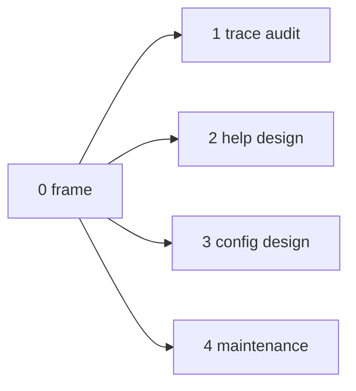

; designer
[trace-as-schema-interface help-namespace nota-config-convention context-maintenance intent-supersession daemon-string-boundary meta-report frame schema-rust-next spirit-next persona]
[Meta-report frame for the design + audit + maintenance dispatch 2026-06-03 per psyche STT manifesting as Spirit 1489-1496. Four parallel sub-agents handle: trace mechanism audit + daemon string-boundary, help/description namespace design, NOTA config-by-convention design, and combined context/intent maintenance sweep. Orchestrator writes overview synthesis when all sub-agents return.]
2026-06-03
designer

# 487.0 — Frame and method

## The directive (psyche 2026-06-03 STT + Spirit 1489-1496)

The psyche read operator 291 (tracing mechanism audit + polish) and dictated a long voice statement carrying eight discrete intent threads. Operator captured the intent into Spirit 1489-1496 promptly. The designer's reading of the prompt confirms operator's capture covers all eight intent statements; no gap-fill records needed.

The captured intent threads (Spirit 1489-1496):

- **1489 Principle High** — client-side tracing generated/generic from schema interface; CLI stays thin.
- **1490 Principle Maximum** — tracing remains typed data until the client display boundary; strings only at print.
- **1491 Constraint High** — no tracing on tracing for now; trace enablement controlled per crate/component.
- **1492 Decision Maximum** — tracing is its own schema-defined interface with closed generated enum vocabularies.
- **1493 Principle High** — help/documentation as schema data in a mirror description namespace over the global symbol namespace, with generated defaults when no explicit description exists.
- **1494 Principle High** — authored workspace data files prefer typed NOTA; predictable file names/directories define the expected root type.
- **1495 Principle Maximum** — daemons stay free of NOTA decoding and string surfaces except for actual user-authored string payloads; clients translate NOTA text to binary.
- **1496 Clarification Medium** — context-maintenance agents may audit old intent for clear contradictions; deletion remains reviewable.

The directive (working order): write the wisdom into intent + architecture files; implement on a designer worktree as far as possible; use sub-agents; create reports per the new variant convention (Spirit 1481); audit operator's implementation; everybody does context maintenance with a sub-agent; load sub-agents up with intent; sub-agents may audit even old intent and recommend removals when clearly contradicted by newer intent; everybody report back.

## Why a meta-report (four sub-agents)

The new intent threads three concrete design tasks plus one maintenance pass. Each is independently bounded and can run in parallel:

| Sub-agent | Scope | Output |
|---|---|---|
| A | Trace mechanism audit + daemon string-boundary | `1-trace-and-daemon-boundary-audit.md` |
| B | Help/description namespace design + demo | `2-help-namespace-design.md` |
| C | Typed NOTA config-by-convention design + demo | `3-nota-config-convention-design.md` |
| D | Context maintenance + Spirit DB contradiction sweep | `4-context-and-intent-maintenance.md` |

Orchestrator (main designer) synthesizes when all return (`6-overview.md`). The designer also does parallel worktree implementation on one concrete concept (Task #345) and writes intent manifestation into per-repo INTENT.md / ARCHITECTURE.md surfaces (Task #346) while sub-agents run.

5-node cap respected. Overview node implicit (orchestrator-owned, lands after sub-agents).

## Method per sub-agent

Each sub-agent is a designer-lane researcher:
- Read AGENTS.md hard overrides + relevant skills + recent reports (479-486, operator 287-291, Spirit 1480-1496).
- Audit / design within the assigned scope.
- Surface decisions the psyche needs to ratify.
- Push sub-report to primary main on the meta-report path.

Common constraints (workspace hard overrides):
- READ-ONLY on code repos for sub-agent A audit; design-only / pseudocode for B and C; maintenance proposals only for D (no destructive Spirit removals without psyche approval).
- Bracket NOTA strings; no quotation marks.
- Full English words; full-method discipline; no ZST namespace.
- No `---` horizontal-rule lines.
- Mermaid 5-node cap per Spirit 1282.
- Variant convention per Spirit 1481.
- All sub-agent dispatches `run_in_background: true`.

## Recurring questions the sub-agents will all answer

Cross-agent comparability per the 484 frame methodology:

1. **What's the current state of the topic?** Existing implementation / current discipline.
2. **What does the new intent require?** The Spirit 1489-1496 statements that bear on this scope.
3. **What's the gap?** Specific differences between current and required.
4. **What's the proposed design or audit finding?** Concrete recommendation with demo where applicable.
5. **What decisions does this surface for the psyche to ratify?** Open items requiring authorial input.
6. **What's the recommended next operator slice?** Smallest meaningful implementation step.

## Sub-agent dispatch shape

Each sub-agent gets:
- This frame as required reading.
- The relevant Spirit captures listed above.
- The recent reports specific to its scope.
- The recurring 6 questions as the deliverable structure.
- Cap: 400-700 lines per sub-report.

All dispatched in background (AGENTS.md hard override + designer protocol).

## What the overview will synthesize

`6-overview.md` (written by orchestrator after all sub-agents return):
- Cross-cut the four sub-reports into a single picture.
- Identify cross-cutting decisions appearing in multiple reports.
- Recommend operator slice sequence for production-orientation.
- Name psyche ratifications needed.
- Connect back to Spirit 1486 substrate ratification + the new 1489-1496 threads.

## Cross-references

- `reports/operator/291-tracing-mechanism-audit-and-polish-2026-06-03.md` — operator's tracing mechanism audit; sub-agent A builds on.
- `reports/designer/482-Psyche-engine-mechanism-fundamental-decision-2026-06-02.md` — substrate decision; backdrop.
- `reports/designer/483-Audit-tracing-emission-completeness-2026-06-02.md` — earlier trace audit; sub-agent A cross-references.
- `reports/designer/485-Design-engine-vs-actor-traits-concept-demo-2026-06-02.md` — engine traits decision; relevant to schema-emission framing.
- `reports/designer/486-Design-schema-carries-engine-mechanism-concept-demo-2026-06-02.md` — schema-carries decision; sub-agent B + C build on as they touch schema-emission surfaces.
- `reports/designer/484-Audit-production-readiness-meta-2026-06-02/` — prior meta-report (production readiness sweep); sub-agent D cross-references for maintenance work absorbed since.
- Spirit records: 1480 (atomic broad topics), 1481 (variant convention), 1482 (production-orientation), 1486 (substrate ratification), 1489-1496 (the captured threads driving this meta-report).
