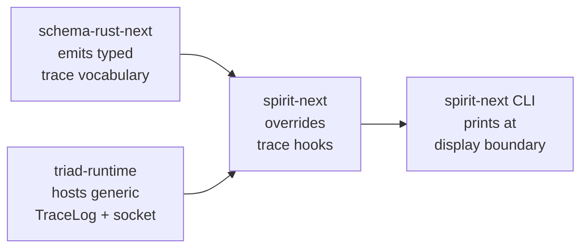

# 487.1 — Trace mechanism + daemon string-boundary audit

*Kind: Audit · Topics: tracing, daemon, string-boundary, schema-rust-next, spirit-next, triad-runtime, persona-spirit · 2026-06-03 · designer lane (sub-agent A)*

## Verdict at the top

Spirit 1489-1492 + 1495 are MOSTLY honored on the modern reference
stack (`spirit-next` + `triad-runtime` + `schema-rust-next` emission):

- **1492 Maximum (trace as schema-defined interface with closed
  generated enum vocabularies)**: HONORED. Per-plane object name
  enums + `ObjectName` umbrella + typed `TraceEvent` all emitted
  from schema.
- **1490 Maximum (typed data until client display boundary)**:
  SUBSTANTIALLY HONORED. One narrow daemon-side `eprintln!` for
  trace-mechanism error fallback remains.
- **1491 High (trace enablement per crate)**: HONORED via
  `testing-trace` Cargo feature; production builds compile no trace.
- **1495 Maximum (daemon free of NOTA decoding; no strings except
  user-authored payloads)**: HONORED on `spirit-next` (binary rkyv
  configuration, binary signal-frame wire). Deployed `persona-spirit`
  does NOT honor — legacy daemon decodes NOTA configuration at
  startup; older `ActorTrace` is parallel hand-written vocabulary.

Most open question: **1489 High (generic / generated CLI-side
trace)** — ~5 lines of CLI trace wiring hand-written per component.
Three paths in Q4; Path B (CLI helper on `triad-runtime`) recommended.

All file paths absolute. All line ranges against current `main` HEAD.
Read-only.

## Q1 — Trace as schema-defined interface (Spirit 1492 Maximum)

### Current state

Schema emission produces the trace vocabulary at
`/git/github.com/LiGoldragon/schema-rust-next/src/lib.rs:1265-1338`
(`emit_trace_support`):

- Lines 1278-1290 emit three per-plane object name enums:
  `SignalObjectName`, `NexusObjectName`, `SemaObjectName`. Variants
  gather from schema-declared roots (`Input`, `Output`, `NexusWork`,
  `NexusAction`, `SemaWriteInput`, `SemaReadInput`, etc.) plus per-
  plane actor-boundary variants (`Admitted`, `Triaged`, `Replied`,
  `Started`, `Stopped`).
- Lines 1292-1302 emit umbrella `ObjectName` wrapping all three.
- Lines 1305-1338 emit `TraceEvent { object_name: ObjectName }`
  plus `name()` projection through typed `match` over enum
  variants. No literal string at the trace call site.

Trace hooks are emitted as default-method bodies on the engine
traits at lines 2160-2266. The dispatch points in the public
`triage`, `reply`, `execute`, `apply`, `observe` methods (lines
2190-2261) all invoke trace hooks through the typed enum.

The actor-side overrides on `spirit-next` (engine.rs:222-226,
nexus.rs:216-220, store.rs:54-58) build
`TraceEvent::new(ObjectName::<Plane>(object_name))` from typed
values — no string formatting.

### What the new intent requires

Spirit 1492 (Maximum): trace names are typed enum values generated
from schema; events are typed records carrying typed names; no
free-floating strings at trace identity layer.

### Gap

Two completeness items, both already proposed by designer 483:

1. **Per-variant interface-route names EMITTED but NOT WIRED.**
   `SignalObjectName::Input(InputRoute)` is in the emitted
   vocabulary, but `SignalEngine::triage`'s default body
   (`schema-rust-next/src/lib.rs:2190-2194`) fires only the actor-
   boundary `trace_signal_triaged()`. Operator 291 §"What Still
   Needs Work" calls this out.

2. **No `EffectObjectName` / `EffectEngine` family.**
   `NexusEffectCommand` / `NexusEffectResult` declared in
   `spirit-next/schema/lib.schema:15-16` but the schema-rust-next
   emitter produces no paired trace family. `Nexus::apply_effect`
   (`spirit-next/src/nexus.rs:169-179`) runs Stash with no typed
   trace event.

### Audit finding

Spirit 1492 IS HONORED for the load-bearing trace surface. The two
gaps are completeness items from designer 483 §Q4b + §Q5; not new
principle violations.

### Decisions for psyche to ratify

None on 1492 directly. The principle holds; implementation matches.

### Recommended next operator slice

Wire per-variant interface-route identity into default bodies of
`SignalEngine::triage`, `SignalEngine::reply`,
`NexusEngine::execute`, `SemaEngine::apply`, `SemaEngine::observe`
in `schema-rust-next`. Per designer 483 §Q4b: ~1 extra line per
public method in the emitter, no new vocabulary needed.

## Q2 — Typed data until client display boundary (Spirit 1490 Maximum)

### Current state

**Daemon side** of the trace pipeline:

- `TraceEvent` is rkyv-encoded as binary frame on the trace socket
  per `triad-runtime/src/trace.rs:102-143`. `TraceFrame<Event>::to_bytes()`
  calls `event.to_trace_archive()` which is `rkyv::to_bytes` per
  `spirit-next/src/trace.rs:10-21`.
- `TraceLog::record(event)` at `triad-runtime/src/trace.rs:174-178`
  writes the typed `Event` into a `Vec<Event>` (recording) or
  through `TraceSocketPath::write_event` (lines 201-208) as typed
  rkyv bytes. Typed event never becomes a string on the daemon.
- Actor-side overrides at engine.rs:222-226, nexus.rs:216-220,
  store.rs:54-58 build `TraceEvent::new(ObjectName::Signal(object_name))`
  from typed `SignalObjectName` — no `format!`, no `to_string()`
  on trace data.

**Client side**:

- `TraceClient::print_events` at `triad-runtime/src/trace.rs:314-323`
  is the ONLY place typed `Event` becomes text. Writes `{event}`
  via `Display`; `Display for TraceEvent` at
  `spirit-next/src/trace.rs:23-27` calls `formatter.write_str(self.name())`
  where `name()` is the typed projection on `ObjectName`.
- CLI binary at `spirit-next/src/bin/spirit-next.rs:34-40` invokes
  `trace_client.print_events(&mut std::io::stdout())` after the
  reply is decoded. This is the boundary where typed data becomes
  the human-readable surface.

### What the new intent requires

Spirit 1490 (Maximum): trace events and trace logs use generated
interface data types; string rendering happens only when a client
or user-interface surface prints them.

### Gap

ONE narrow daemon-side string surface on the trace pipeline:

- `triad-runtime/src/trace.rs:174-178`: `TraceLog::record` falls
  back to `eprintln!("triad-runtime trace: {error}")` when
  `record_result` fails. INTERNAL daemon log output, not on the
  trace wire. Operator 291 §"Polish Implemented" explicitly says
  this is acceptable as observability of the trace mechanism.

This is NOT a 1490 violation in the strict reading: the principle
addresses trace EVENTS becoming strings; the fallback is the trace
MECHANISM's own error reporting going to stderr (operational log
surface), not into the trace stream. Spirit 1491 also applies
("no tracing on tracing for now"): operational error reporting
about the trace mechanism is allowed because it is not itself a
typed trace event and goes to a separate channel.

### Audit finding

Spirit 1490 IS SUBSTANTIALLY HONORED. The single daemon-side string
surface is operational-log output of trace-mechanism errors. If the
psyche prefers a stricter reading, the fallback could become silent
swallow.

### Decisions for psyche to ratify

**Decision 1.** Is the `eprintln!` fallback at
`triad-runtime/src/trace.rs:176` acceptable, or should it be removed
entirely (silent swallow)? Operator 291 says acceptable; strict
1490 prefers removed.

### Recommended next operator slice

If strict reading ratified: replace `eprintln!` with
`let _ = self.record_result(event);`. `record_result` already
exists per operator 291's polish, so tests can still assert.

## Q3 — Trace enablement per-crate (Spirit 1491 High)

### Current state

Per `spirit-next/Cargo.toml:34-37`:

```toml
[features]
default = []
nota-text = ["dep:nota-next"]
testing-trace = ["dep:triad-runtime"]
```

`triad-runtime` is an optional dependency. Without `testing-trace`:

- Trace module at `spirit-next/src/lib.rs:29-30` not compiled.
- `triad-runtime` not pulled in.
- `#[cfg(feature = "testing-trace")]`-gated methods (e.g., trace
  override on `SignalEngine for SignalActor` at
  `spirit-next/src/engine.rs:222-226`) disappear.

`triad-runtime` itself compiles trace logic unconditionally — but
is only pulled in via consuming crates' `testing-trace`. Per-crate
enablement holds: production `spirit-next` builds compile no trace
code.

`persona-spirit` does NOT depend on `triad-runtime`; its older
`ActorTrace` is its own thing, build-config-gated.

`schema-rust-next` unconditionally emits trace vocabulary into
consumer crates, but default-body trait methods are no-ops so a
consumer without `testing-trace` pays only symbol presence (likely
stripped by optimizer).

### What the new intent requires

Spirit 1491 (High): trace enablement controlled per crate or
component; do not recursively trace the trace interface.

### Gap

Two narrow points, both acceptable under 1491:

1. `triad-runtime` has no `testing-trace` feature of its own — but
   there is no recursive trace-on-trace to gate; the crate is the
   trace substrate.

2. `schema-rust-next` emits trace hook methods unconditionally
   (default no-op bodies). Gating the trait SURFACE per-feature
   would split the schema-defined contract per Spirit 1365
   (Correction Maximum). The no-op default body is essentially
   free at runtime.

### Audit finding

Spirit 1491 IS HONORED. Mechanism is the `testing-trace` Cargo
feature on each consuming crate. The rule is currently IMPLICIT in
the feature shape but not stated as a workspace rule.

### Decisions for psyche to ratify

**Decision 2.** Should the per-crate enablement rule be DOCUMENTED
explicitly in `skills/component-triad.md` §"Instrumentation belongs
to the engine-trait contract", or as a new sub-section there?

### Recommended next operator slice

Add a one-paragraph rule to `skills/component-triad.md`
§"Instrumentation belongs to the engine-trait contract" stating:
every component's trace overrides are gated behind a
`testing-trace` Cargo feature; production builds compile no trace
code. Cross-reference Spirit 1491 and operator 291.

## Q4 — Generic vs hand-written CLI tracing (Spirit 1489 High)

### Current state

CLI side is PARTIALLY generic. Per `triad-runtime/src/trace.rs:273-323`:

- `TraceClient<Event>` is generic over the component's emitted
  `Event` type (`TraceEventFrame` bound).
- `TraceClient::from_environment(variable, collect_duration)` (lines
  294-304) reads any env var name and binds a `TraceSocketListener`.
- `TraceClient::print_events(writer)` (lines 318-323) is generic
  over a `Write` target.

Component-specific in `spirit-next/src/bin/spirit-next.rs`:

- Line 34-36: `TraceClient::from_environment("SPIRIT_NEXT_TRACE_SOCKET", Duration::from_millis(200))?;`
  — env var name `SPIRIT_NEXT_TRACE_SOCKET` is component-specific.
- Line 39-40: `trace_client.print_events(&mut std::io::stdout())?;`
  — timing (after the reply, not before) is component-specific.

Approximately 5 lines of CLI-side trace wiring per component.

### What the new intent requires

Spirit 1489 (High): client-side tracing should be generated or
generic from schema interface definitions; CLI stays a thin client.

### Gap

The 5 component-specific lines could be (a) generated from schema
by `schema-rust-next` as a trace-cli-listener mixin per component,
or (b) absorbed into a `triad-runtime`-hosted CLI-side macro / trait
taking only env var name. Neither exists today.

### Audit finding — three paths forward

**Path A — emit a trace-cli-listener mixin in schema-rust-next.**
For every component, emit `<Component>TraceCli` macro the CLI
binary calls inline. CLI trace wiring drops to one macro call. The
deeper alignment with 1489 — schema-driven emission covers the
full trace stack.

**Path B — host generic CLI side on `triad-runtime`.** Add a
`TraceCliSession` (or similar) on `triad-runtime` taking env var
name and reply future, draining in the right order. CLI binary
writes 2-3 lines instead of 5. Smallest cost; doesn't need new
emission machinery.

**Path C — status quo.** Leave the 5 lines hand-written.

Designer recommendation: Path B first (smaller cost; covers 90% of
1489 letter). Path A absorbs the CLI side later if schema-rust-next
takes the broader macro-emission wave designer 483 §"Concept: full
emission" laid out.

### Decisions for psyche to ratify

**Decision 3.** Path A (emitter mixin), Path B (`triad-runtime`
helper), or Path C (status quo) for generic CLI-side trace?

### Recommended next operator slice

Add `TraceCliSession<Event>` (or extension method on
`TraceClient`) to `triad-runtime/src/trace.rs`. The CLI binary then
writes:

```rust
let trace_session = TraceCliSession::for_env("SPIRIT_NEXT_TRACE_SOCKET")?;
let (_route, output) = SignalTransport::connect(socket_path)?.exchange(&input)?;
println!("{output}");
trace_session.drain_to_stdout()?;
```

Two lines instead of five. Approximately 10 lines new in
`triad-runtime`.

## Q5 — Daemon string-free boundary (Spirit 1495 Maximum)

### Current state — spirit-next pilot

**Daemon-side strings (legitimate)** — typed payload content within
the schema (user-authored or schema-typed):

- `spirit-next/src/store.rs:71-72, 81-82, 85-86, 105-106, 109-110,
  120-121, 124-125, 134-135`: `ErrorMessage(error.to_string())`
  and `ErrorMessage(String::from("..."))`. These build TYPED
  `ErrorMessage` records carrying error text into `ErrorReport`
  reply variant. Schema explicitly carries string field for error
  message; this IS the user-facing payload the schema is supposed
  to carry. Per 1495 letter: "except for actual user-authored
  string payloads" — typed payload strings within schema vocabulary.
- Schema's `Description(String)` payload type in `Entry` — the
  canonical user-authored string payload.

**Daemon-side strings (operational logging — narrow)**:

- `spirit-next/src/bin/spirit-next-daemon.rs:5`:
  `eprintln!("spirit-next-daemon: {error}");` — startup-error
  stderr.
- `spirit-next/src/daemon.rs:166`: `eprintln!("spirit-next-daemon: {error}");`
  — per-stream-error stderr in accept loop.
- `triad-runtime/src/trace.rs:176`: discussed in Q2.

**NOTA decoding on daemon — NOT PRESENT**:

- Daemon argument is path to a **binary rkyv configuration file**:
  `spirit-next/src/daemon.rs:125-127` delegates to
  `Configuration::from_binary_path`. Configuration type
  (`spirit-next/src/config.rs:8-13`) is `rkyv::Archive/Serialize/Deserialize`-
  derived; loading via `rkyv::from_bytes` at line 68-71.
- Wire is binary signal frames: `spirit-next/src/transport.rs:68-101`
  uses length-prefixed `Input::encode_signal_frame` /
  `Output::decode_signal_frame`.
- No `nota_codec` import anywhere in spirit-next/src.

**CLI translates NOTA — the boundary**:

- `spirit-next/src/bin/spirit-next.rs:31`:
  `let input = source.parse::<Input>()?;` — CLI parses NOTA text
  to typed `Input`.
- Line 37: sends `Input` as binary signal frame to daemon.

This is the canonical 1495-shaped boundary.

### Current state — persona-spirit deployed daemon

Does NOT honor 1495. Per `persona-spirit/src/daemon.rs:592-597`:

```rust
pub fn from_argument(argument: signal_frame::SingleArgument) -> Result<Self> {
    let text = daemon_configuration_argument_text(argument)?;
    Ok(Self::from_configuration(DaemonConfiguration::from_text(&text)?))
}
```

And lines 255-260: `DaemonConfiguration::from_text` uses
`nota_codec::Decoder`. The daemon decodes NOTA text on startup.

Beyond config, persona-spirit has substantial daemon-side NOTA
decoding for inter-component traffic: `migration.rs:3`,
`actors/decoder.rs:4`, `actors/reply.rs:4,105`
(`encoder.into_string()` as reply payload).

The daemon also carries older hand-written `ActorTrace` at
`persona-spirit/src/actors/trace.rs:55-90` — parallel vocabulary to
the engines, the shape Spirit 1365 (Correction Maximum) called out
as wrong.

### Current state — triad-runtime

Does NOT decode NOTA. Only string surface is the single `eprintln!`
on trace-mechanism error fallback (Q2). Trace wire is pure rkyv per
`triad-runtime/src/trace.rs:118-127, 130-143`.

### Current state — schema-rust-next

SCHEMA EMITTER, not a runtime. Host-side `format!` and `to_string()`
calls (e.g., `schema-rust-next/src/migration.rs:85, 259, 263, ...`)
are emitter writing Rust source TEXT as output. Not a daemon; 1495
does not apply.

### Current state — schema-daemon (designer 481 pilot, not landed)

Per designer 481, daemon binary deferred. When the binary lands,
the same 1495 discipline should apply: binary configuration, binary
wire, no NOTA decoding inside the daemon.

### What the new intent requires

Spirit 1495 (Maximum): daemons free of NOTA decoding; no string
surfaces except user-authored string payloads; clients translate
NOTA text to binary protocol data.

### Gap

- **spirit-next**: HONORED. No NOTA decoding on daemon. String
  surfaces limited to (a) typed user-authored payload strings,
  (b) ~3 operational stderr sites. No `serde_json`, no
  `nota_codec`, no `format!` for content beyond typed payload
  + operational logging.
- **triad-runtime**: HONORED. Single `eprintln!` for trace-
  mechanism error (Q2).
- **persona-spirit (deployed)**: NOT HONORED. Daemon decodes NOTA
  configuration; actors use `nota_codec::Decoder`/`Encoder`;
  older `ActorTrace` is parallel hand-written vocabulary.
- **schema-daemon pilot (designer 481, not landed)**: when the
  daemon binary lands, 1495 applies as forward constraint.

### Audit finding

Spirit 1495 IS HONORED on the modern reference stack
(spirit-next + triad-runtime). Deployed `persona-spirit` does NOT
honor 1495 and needs migration to the spirit-next shape. Designer
481's schema-daemon pilot should follow spirit-next when its binary
lands.

### Decisions for psyche to ratify

**Decision 4.** Schedule persona-spirit migration to 1495-honoring
shape (binary configuration, no daemon-side NOTA decode, schema-
trait-bound trace instead of parallel `ActorTrace`)? Or does its
legacy-daemon role exempt it until a wider re-platform?

Pragmatic reading: persona-spirit carries live Spirit records;
migration requires coordinated version-handover. spirit-next is the
production-orientation target; migration is a known cluster
operation, not same-day.

**Decision 5.** Require the schema-daemon pilot (designer 481),
when its binary lands, to honor 1495 from day one?

Pragmatic reading: yes; this is the production-orientation
constraint going forward.

### Recommended next operator slice

For spirit-next: no slice on 1495 — honored.

For schema-daemon: when the binary lands, configuration type
`rkyv::Archive/Serialize/Deserialize`-derived per `spirit-next/src/config.rs`.
Wire = binary signal frames per `signal-frame`. No `nota_codec`
imports in daemon runtime modules.

For persona-spirit: separate migration arc — operator's call when
version-handover bandwidth opens. Not a slice for this audit.

## Q6 — Recurring 6 questions rolled up

### Q6.1 — Current state

Modern trace stack (`spirit-next` + `triad-runtime` +
`schema-rust-next`) is a clean three-layer composition:



Four nodes. Schema emits trace vocabulary into the consumer crate;
triad-runtime supplies generic runtime mechanics; spirit-next
overrides trace hooks on actor structs; CLI binds listener and
prints at display boundary.

### Q6.2 — What the new intent requires

Together Spirit 1489-1492 + 1495 require:

- Typed enum vocabularies for trace names (1492).
- Typed data on the wire until display boundary (1490).
- Per-crate enablement of trace logic (1491).
- Generic / generated CLI-side trace listener (1489).
- Daemon free of NOTA decoding and unconstrained strings (1495).

### Q6.3 — Gap

Load-bearing surface is HONORED. Three gaps:

1. Per-variant interface-route trace wiring missing (1492
   completeness — already proposed designer 483 §Q4b).
2. Per-effect trace family missing (1492 completeness — already
   proposed designer 483 §Q5).
3. CLI-side trace listening not yet generic / emitted (1489 —
   three paths forward; Path B recommended).

Deployed `persona-spirit` daemon = separate legacy-migration arc.

### Q6.4 — Proposed audit finding

Modern trace stack honors new intent; gaps are completeness items
rather than principle violations. Proposed next direction: absorb
CLI-side trace listening into generic `TraceCliSession` on
`triad-runtime` (Path B per Q4), then wire per-variant interface-
route trace identity into schema-rust-next emitter (designer 483 §Q4b).

### Q6.5 — Decisions for psyche to ratify (reproduced together)

- **Decision 1.** Strict reading of 1490: remove daemon-side
  `eprintln!` fallback for trace-mechanism error (silent swallow)?
- **Decision 2.** Document per-crate enablement rule explicitly in
  `skills/component-triad.md` §"Instrumentation belongs to the
  engine-trait contract"?
- **Decision 3.** Path for generic CLI-side trace — Path A
  (emitter mixin), Path B (`triad-runtime` helper, recommended),
  Path C (status quo)?
- **Decision 4.** Schedule persona-spirit migration to 1495-
  honoring shape, or defer to wider re-platform?
- **Decision 5.** Require schema-daemon pilot (designer 481) to
  honor 1495 from day one when its binary lands?

### Q6.6 — Recommended next operator slice

Smallest-meaningful single step: **add `TraceCliSession<Event>` to
`triad-runtime/src/trace.rs`** — combines `from_environment` +
`print_events` into a 2-step API the CLI uses without manual env
var + duration + drain timing wiring. This is Decision 3 Path B.

Sketch (NOT in code yet; for psyche review):

```rust
impl<Event: TraceEventFrame + Display> TraceClient<Event> {
    pub fn drain_to_stdout(&self) -> Result<(), TraceError> {
        self.print_events(&mut std::io::stdout())
    }
}
```

Plus optional `for_env` constructor hard-coding the 200ms
convention. About 10 lines new code; reduces CLI trace-wiring from
5 lines to 2.

Subsequent slices (after the above lands):

- Per-variant interface-route trace wiring in schema-rust-next
  (designer 483 §Q4b — 1-line-per-method emitter change).
- Per-effect trace family in schema-rust-next (designer 483 §Q5 —
  ~150 lines emitter + spirit-next Stash override).
- persona-spirit migration to 1495-shape (separate version-
  handover arc).

## Cross-references

- `/home/li/primary/reports/operator/291-tracing-mechanism-audit-and-polish-2026-06-03.md`
  — operator's current tracing audit + polish; baseline §"Verdict"
  + completeness items §"What Still Needs Work" mirror Q1 gaps 1+2.
- `/home/li/primary/reports/designer/483-Audit-tracing-emission-completeness-2026-06-02.md`
  — earlier trace audit; operator 291 declared `TraceLog` /
  `TraceSocketListener` migration to triad-runtime stale, which
  this audit confirms. 483's Q4-Q6 are source for the
  completeness items re-cited here.
- `/home/li/primary/reports/designer/481-schema-daemon-upgradable-runtime-pilot-2026-06-02.md`
  — schema-daemon pilot reference; relevant to Decision 5.
- `/home/li/primary/skills/component-triad.md` §"Instrumentation
  belongs to the engine-trait contract" — Spirit 1365 (Correction
  Maximum) instrumentation discipline verified on the modern
  stack.
- `/home/li/primary/skills/component-triad.md` §"The single
  argument rule" — spirit-next uses binary rkyv configuration in
  honor of 1495; persona-spirit uses NOTA text (legacy).
- Spirit records 1489 / 1490 / 1491 / 1492 / 1495 — captured
  intent driving this audit.
- Spirit record 1481 — variant convention; this is the `1-`
  sub-file inside meta-report 487 (per the 484 precedent the
  variant prefix is not applied at sub-file level).
