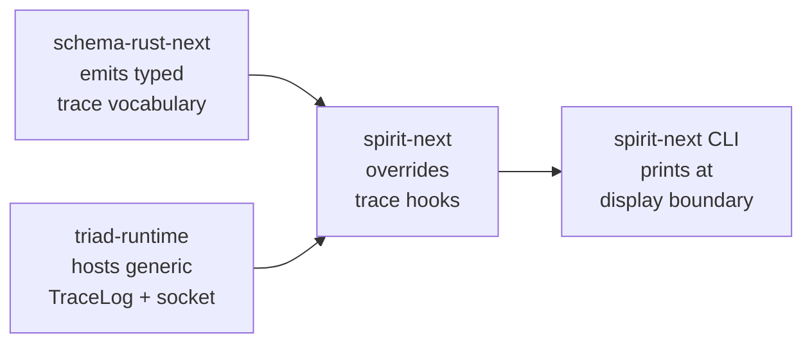

# 487.1 — Trace mechanism + daemon string-boundary audit

*Kind: Audit · Topics: tracing, daemon, string-boundary, schema-rust-next, spirit-next, triad-runtime, persona-spirit · 2026-06-03 · designer lane (sub-agent A)*

## Verdict at the top

Spirit 1489-1492 + 1495 are MOSTLY honored on `spirit-next` /
`schema-rust-next` / `triad-runtime`. The trace stack on the current
pilot is its own schema-defined interface with closed generated enum
vocabularies (1492 Maximum: HONORED), it stays typed data until the
client display boundary (1490 Maximum: SUBSTANTIALLY HONORED with
narrow exceptions on internal log surfaces), enablement is per-crate
via the `testing-trace` feature (1491 High: HONORED), and on the
`spirit-next` pilot the daemon stays free of NOTA decoding because the
daemon takes a binary `rkyv`-encoded `Configuration` and the wire is
binary signal frames (1495 Maximum: HONORED on spirit-next).

The deployed daemon `persona-spirit` does NOT honor 1495 — its daemon
decodes NOTA at startup (`DaemonConfiguration::from_text`) and the
older `ActorTrace` is a separate hand-written vocabulary parallel to
the engines. This is the legacy shape that the spirit-next stack is
the modern reference replacement for.

The most open question is Spirit 1489 High: the CLI side of trace
delivery is still hand-written per component (`spirit-next-cli`
binds `SPIRIT_NEXT_TRACE_SOCKET` and calls
`TraceClient::print_events`). The mechanism is generic enough to be
emitted, but emission is not yet wired.

Concrete code citations follow. All file paths are absolute. All line
ranges are against the current `main` HEAD of each repository as of
this audit (read-only).

## Q1 — Trace as schema-defined interface with closed generated enum vocabularies (Spirit 1492 Maximum)

### Current state

The trace vocabulary IS emitted from schema as closed generated enum
families. The emission is in
`/git/github.com/LiGoldragon/schema-rust-next/src/lib.rs:1265-1338`
(`emit_trace_support`):

- Lines 1278-1290 emit three per-plane object name enums:
  `SignalObjectName`, `NexusObjectName`, `SemaObjectName`. The
  variants are gathered from the schema-declared root enums
  (`Input`, `Output`, `NexusWork`, `NexusAction`,
  `SemaWriteInput`, `SemaReadInput`, `SemaWriteOutput`,
  `SemaReadOutput`) plus per-plane actor-boundary variants
  (`Admitted`, `Rejected`, `Triaged`, `Replied`, `Started`,
  `Stopped`, etc.).
- Lines 1292-1302 emit an umbrella `ObjectName` enum wrapping all
  three plane object names.
- Lines 1305-1338 emit `TraceEvent { object_name: ObjectName }`
  plus the `name()` projection from the typed identity to its
  `&'static str` render. The string is computed AT THE TYPE LEVEL
  through a `match` over the typed enum — NOT chosen as a literal
  at the trace call site.

The per-plane enum emission lives in `emit_object_name_enum`
(`/git/github.com/LiGoldragon/schema-rust-next/src/lib.rs:1341-1392`).
The `name(self)` method for each per-plane enum (lines 1364-1391)
matches each variant to a typed concatenation of the rendered
prefix (`Signal`, `Nexus`, `Sema`) and the variant's typed name —
again, no free-floating string anywhere.

The trace hooks themselves are emitted as default-method bodies on
the engine traits. Per
`/git/github.com/LiGoldragon/schema-rust-next/src/lib.rs:2160-2266`,
the emitter produces:

- `SignalEngine::trace_signal_activation(&self, _object_name: SignalObjectName)` — default no-op (line 2169).
- `SignalEngine::trace_signal_admitted(&self) { self.trace_signal_activation(SignalObjectName::Admitted); }` — line 2170-2172.
- The same pattern for `trace_signal_rejected`, `trace_signal_triaged`, `trace_signal_replied`, `trace_nexus_entered`, `trace_nexus_decided`, `trace_sema_write_applied`, `trace_sema_read_observed`.

The dispatch points in the public `triage`, `reply`, `execute`,
`apply`, `observe` methods (lines 2190-2261) all invoke trace hooks
through the typed enum — there is no `&'static str` for trace name
in the schema-rust-next emission output.

### What new intent requires

Spirit 1492 (Maximum): *"Tracing is its own schema-defined interface
with closed generated enum vocabularies for trace names and events,
not an ad hoc string log."* Every name in the trace surface must be
a typed enum value generated from the schema; every event must be a
typed record carrying the typed name; no free-floating strings at
the trace identity layer.

### Gap

Two narrow gaps remain. Neither is a 1492 violation per se — they are
secondary completeness items.

1. **Per-variant interface-route names are EMITTED but NOT WIRED into
   the default-trait-method bodies on the public methods.** Per
   designer 483 §"Per-variant trace identity" (lines 406-445), the
   `SignalObjectName::Input(InputRoute)` variant is in the emitted
   vocabulary, but `SignalEngine::triage`'s default body
   (`/git/github.com/LiGoldragon/schema-rust-next/src/lib.rs:2190-2194`)
   only fires `trace_signal_triaged()` at the actor boundary — it
   does NOT fire `trace_signal_activation(SignalObjectName::Input(input.root().route()))`
   before delegating to `triage_inner`. So today's runtime trace
   stream cannot distinguish `Input::Record` from `Input::Observe`
   at the Signal plane; it only distinguishes at the SEMA plane
   where the write-vs-read split forks. Operator 291's recommendation
   §"What Still Needs Work" calls this out explicitly.

2. **No `EffectObjectName` or `EffectEngine` trace family is emitted.**
   `NexusEffectCommand` and `NexusEffectResult` are declared in
   `/git/github.com/LiGoldragon/spirit-next/schema/lib.schema:15-16`
   but the schema-rust-next emitter does not produce a paired
   trace family. The hand-written `Nexus::apply_effect` at
   `/git/github.com/LiGoldragon/spirit-next/src/nexus.rs:169-179` runs
   `NexusEffectCommand::Stash` semantics with no typed trace event.
   This is also called out by designer 483 §"Per-effect trace hooks"
   (lines 376-404).

### Proposed audit finding

Spirit 1492 IS HONORED for the load-bearing trace surface. The two
gaps above are completeness items that designer 483 already proposed
as small emitter changes (Q4b + Q5 of that report).

### Decisions for psyche to ratify

None on 1492 directly — the principle holds and the implementation
matches.

### Recommended next operator slice

Wire per-variant interface-route identity into the default bodies of
`SignalEngine::triage`, `SignalEngine::reply`, `NexusEngine::execute`,
`SemaEngine::apply`, and `SemaEngine::observe`. Per designer 483 §Q4b,
this is approximately one extra line per public method in the
schema-rust-next emitter, with no new vocabulary required.

## Q2 — Typed data until the client display boundary (Spirit 1490 Maximum)

### Current state

On the daemon side of the pilot stack:

- `TraceEvent` is rkyv-encoded as a binary frame on the trace socket
  (`/git/github.com/LiGoldragon/triad-runtime/src/trace.rs:102-143`).
  `TraceFrame<Event>::to_bytes()` calls
  `event.to_trace_archive()` which goes through
  `TraceEventFrame::to_trace_archive` — defined as `rkyv::to_bytes`
  on `spirit-next` per
  `/git/github.com/LiGoldragon/spirit-next/src/trace.rs:10-21`.
- `TraceLog::record(event)` at
  `/git/github.com/LiGoldragon/triad-runtime/src/trace.rs:174-178`
  writes the typed `Event` value into either a `Vec<Event>`
  (recording sink) or through `TraceSocketPath::write_event` which
  ALSO ships the typed event as `rkyv` bytes (line 201-208). The
  typed event never becomes a `String` on the daemon side.
- The actor-side trace overrides
  (`/git/github.com/LiGoldragon/spirit-next/src/engine.rs:222-226`,
  `/git/github.com/LiGoldragon/spirit-next/src/nexus.rs:216-220`,
  `/git/github.com/LiGoldragon/spirit-next/src/store.rs:54-58`)
  build `TraceEvent::new(ObjectName::Signal(object_name))` from
  the typed `SignalObjectName` and hand the typed value to
  `TraceLog::record`. Again no string formatting.

On the client side:

- `TraceClient::print_events` at
  `/git/github.com/LiGoldragon/triad-runtime/src/trace.rs:314-323`
  is the ONLY place where the typed `Event` becomes text. It writes
  `{event}` (using `Display`) — and `Display for TraceEvent` at
  `/git/github.com/LiGoldragon/spirit-next/src/trace.rs:23-27` calls
  `formatter.write_str(self.name())` where `name()` is the typed
  projection emitted on `ObjectName` /`<Plane>ObjectName` (typed
  match, not string-anywhere).
- The CLI binary `spirit-next` at
  `/git/github.com/LiGoldragon/spirit-next/src/bin/spirit-next.rs:34-40`
  invokes `trace_client.print_events(&mut std::io::stdout())` after
  the reply was decoded — this is the boundary where typed data
  becomes the human-readable surface, exactly as 1490 requires.

### What new intent requires

Spirit 1490 (Maximum): *"Tracing remains typed data until the client
display boundary; trace events and trace logs use generated interface
data types, and string rendering happens only when a client or
user-interface surface prints them."*

### Gap

There is ONE daemon-side string surface on the trace pipeline:

- `/git/github.com/LiGoldragon/triad-runtime/src/trace.rs:174-178`:
  `TraceLog::record` falls back to `eprintln!("triad-runtime trace: {error}")`
  when the underlying `record_result` fails. This is INTERNAL daemon
  log output, not part of the wire trace contract. Operator 291
  §"Polish Implemented" explicitly says this is the only string
  surface and is acceptable as observability of the trace mechanism
  itself.

This is NOT a 1490 violation in the strict reading: the principle is
about trace EVENTS not becoming strings until the client display
boundary; the fallback `eprintln!` is about the trace mechanism's own
error reporting (not a trace event), and it goes to stderr (an
operational log surface), not into the trace stream.

The strict reading of 1491 ("no tracing on tracing for now") also
applies here — this `eprintln!` is logging trace-mechanism failures
to operational stderr. Per 1491, that operational log is acceptable
because (a) it is not itself a typed trace event, (b) it goes to
stderr not into the trace stream, (c) the trace mechanism's own
errors are observability of the trace mechanism, which is exactly
what 1491 says is allowed (just not recursive trace-on-trace).

### Proposed audit finding

Spirit 1490 IS SUBSTANTIALLY HONORED. The single daemon-side string
surface is operational-log output of trace-mechanism errors, not a
typed trace event becoming a string — and it goes to the daemon's
internal stderr surface, not into the wire trace channel.

If the psyche prefers an even stricter reading (no daemon-side
string output AT ALL for trace mechanism errors), the fallback could
be replaced with: (a) silent swallow — the trace event is just
dropped; (b) a typed `TraceMechanismError` event on a separate
disabled channel; or (c) a `tracing-failed` sentinel on the same
trace channel. Option (a) is the smallest change and matches the
1490 principle's letter most strictly.

### Decisions for psyche to ratify

**Decision 1.** Is the `eprintln!` fallback at
`/git/github.com/LiGoldragon/triad-runtime/src/trace.rs:176`
acceptable, or should it be removed entirely (silent swallow)?

Operator 291 currently says acceptable as observability of the trace
mechanism. The strict reading of 1490 would prefer no daemon-side
string surface at all.

### Recommended next operator slice

If the psyche ratifies the strict reading, replace the `eprintln!`
fallback with a silent swallow — `let _ = self.record_result(event);`
— and rely on `record_result` itself being available for tests that
want to assert delivery (the `Result` shape is already there per
operator 291's polish).

## Q3 — Trace enablement per-crate (Spirit 1491 High)

### Current state

The trace mechanism is gated by the `testing-trace` Cargo feature on
`spirit-next` (`/git/github.com/LiGoldragon/spirit-next/Cargo.toml:34-37`):

```toml
[features]
default = []
nota-text = ["dep:nota-next"]
testing-trace = ["dep:triad-runtime"]
```

`triad-runtime` is an optional dependency. Without the
`testing-trace` feature, the trace module
(`/git/github.com/LiGoldragon/spirit-next/src/lib.rs:29-30`) is not
compiled, `triad-runtime` is not pulled in, and all
`#[cfg(feature = "testing-trace")]`-gated methods (e.g., the trace
override on `SignalEngine for SignalActor` at
`/git/github.com/LiGoldragon/spirit-next/src/engine.rs:222-226`)
disappear from the build.

The `triad-runtime` crate itself
(`/git/github.com/LiGoldragon/triad-runtime/src/`) compiles trace
logic unconditionally — but it is itself ONLY pulled in by the
`testing-trace` feature of consuming crates. So the per-crate
enablement principle holds: production builds of `spirit-next` do
not compile any trace code at all.

The `persona-spirit` deployed daemon does NOT depend on
`triad-runtime` — its older `ActorTrace`
(`/git/github.com/LiGoldragon/persona-spirit/src/actors/trace.rs:55-90`)
is a separate hand-written event vocabulary that is also gated by
build configuration. The trace machinery is not compiled into
release builds.

The `schema-rust-next` emitter unconditionally emits the trace
vocabulary (the per-plane object name enums + the engine traits'
trace hook methods) — but the hooks default to no-ops, so a build
that doesn't define overrides pays nothing at runtime beyond the
unused method symbols.

### What new intent requires

Spirit 1491 (High): *"Do not enable tracing on the tracing interface
itself for now; trace enablement should be controlled per crate or
component so the trace system does not recursively trace its own
trace events."*

### Gap

Two narrow points:

1. **The `triad-runtime` crate itself has no `testing-trace` feature
   gating its own trace machinery — but this is acceptable per 1491.**
   The trace machinery in `triad-runtime` is the trace system. There
   is no recursive trace-on-trace there to gate. The crate is opted
   into by its consumer's `testing-trace` feature, so the per-crate
   enablement principle holds.

2. **`schema-rust-next` emits the engine traits' trace hook methods
   unconditionally**, but the default bodies are no-ops. A consumer
   crate without `testing-trace` still gets the trait surface
   (`fn trace_signal_admitted(&self) { self.trace_signal_activation(SignalObjectName::Admitted); }`)
   compiled — but the call only goes to `trace_signal_activation`'s
   default no-op body since no override is in scope. The cost is the
   symbol presence and the inlined trait method body, which a Rust
   compiler with reasonable optimization should strip. This is also
   acceptable per 1491 because the trace SURFACE on the trait is part
   of the schema-defined contract per Spirit 1365 (Correction
   Maximum) — gating the SURFACE per-feature would split the
   schema-defined contract across two compilation modes.

### Proposed audit finding

Spirit 1491 IS HONORED. The mechanism for per-crate enablement is
the `testing-trace` Cargo feature on each consuming crate.
`spirit-next`'s production build compiles no trace code;
`spirit-next`'s testing-trace build compiles trace overrides on
the actor structs. The trace system does not recursively trace
itself because no override exists inside `triad-runtime` (the trace
machinery is its own substrate, not a Signal/Nexus/SEMA component).

### Decisions for psyche to ratify

**Decision 2.** Should the per-crate enablement rule be DOCUMENTED
explicitly somewhere agents will find it — for example, in
`skills/component-triad.md` §"Build configuration is itself a NOTA
struct" or as a new sub-section in §"Instrumentation belongs to the
engine-trait contract"? Today the rule is implicit in the
`testing-trace` feature shape but not stated as a workspace rule.

### Recommended next operator slice

Add a one-paragraph rule to `skills/component-triad.md`
§"Instrumentation belongs to the engine-trait contract" explicitly
stating: every component's trace overrides are gated behind a
`testing-trace` Cargo feature on that component; production builds
of the component compile no trace code. Cross-reference Spirit 1491
and operator 291.

## Q4 — Generic vs hand-written CLI tracing (Spirit 1489 High)

### Current state

The CLI side of the trace stack is partially generic. Per
`/git/github.com/LiGoldragon/triad-runtime/src/trace.rs:273-323`:

- `TraceClient<Event>` is generic over the component's emitted
  `Event` type (constrained by `TraceEventFrame`).
- `TraceClient::from_environment(variable, collect_duration)` (line 294-304)
  reads any environment variable name and binds a `TraceSocketListener`.
- `TraceClient::print_events(writer)` (line 318-323) is generic
  over a `Write` target.

What is component-specific in `spirit-next`'s CLI binary
(`/git/github.com/LiGoldragon/spirit-next/src/bin/spirit-next.rs`):

- Line 34-36: `TraceClient::from_environment("SPIRIT_NEXT_TRACE_SOCKET", Duration::from_millis(200))?;`
  — the env var name `SPIRIT_NEXT_TRACE_SOCKET` is component-specific
  per `spirit-next`.
- Line 39-40: `trace_client.print_events(&mut std::io::stdout())?;`
  — the timing of when to read the trace stream (after the reply,
  not before) is component-specific to the spirit-next flow.

The hand-written per-component CLI surface is approximately 5
lines: import the trace client, derive the env var name, bind the
client before the request, drain the trace stream after the
reply.

### What new intent requires

Spirit 1489 (High): *"Client-side tracing should be generated or
generic from the schema interface definitions; the CLI should stay
a thin client and should not own component-specific trace logic
beyond enabling or displaying the generic trace surface."*

### Gap

The CLI carries approximately 5 component-specific lines that could
either be (a) generated from the schema by `schema-rust-next` (as a
trace-cli-listener mixin macro on every emitted component), or (b)
absorbed entirely into a `triad-runtime`-hosted CLI-side macro or
trait that takes only the env var name. Today neither emission nor
macro exists; the 5 lines live in the spirit-next CLI binary.

The hand-written part is small (3-5 lines), and the substance is
mechanical (read env var, bind socket, drain after reply). It is
gap-flagged but not load-bearing.

### Proposed audit finding

The component-specific surface IS small (~5 lines of CLI trace
wiring), but it is not zero. Per 1489's letter ("CLI should not
own component-specific trace logic beyond enabling or displaying"),
the env-var-name and ordering decisions are arguably "enabling
the generic trace surface" — which is in scope. The strict reading
of 1489 would have the env var name itself derived from the
schema/component identity (e.g., `<COMPONENT-NAME>_TRACE_SOCKET`
emitted), and the drain-after-reply ordering encoded into a generic
helper.

Two paths forward:

**Path A — emit a trace-cli-listener mixin in schema-rust-next.**
For every component, the emitter would produce a
`<Component>TraceCli` (or similar) macro that the CLI binary calls
inline. The macro injects the env var binding, the listener, and
the drain ordering. The CLI binary's trace wiring drops to one
macro call.

**Path B — host the generic CLI side in `triad-runtime`.** A
`TraceCliSession` or `TraceCliHarness` helper on `triad-runtime`
takes the env var name and the reply future, then drains in the
right order. The CLI binary then writes 2-3 lines instead of 5.
This is the smaller-cost option because it doesn't need new
emission machinery.

Path A has the deeper alignment with 1489 because the schema-driven
emission ALREADY produces every other piece of the trace surface
(object name enums, trait hook methods, default bodies). Adding
the CLI listener side completes the picture: every component gets
the full trace stack generated from schema.

Path B is what designer 483 §Q4b ("Macro: `triad_main!` for the
daemon binary" + "Shared trace-runtime crate") implicitly described
as the next absorption wave; the CLI side has the same shape as the
daemon side.

### Decisions for psyche to ratify

**Decision 3.** Should the CLI-side trace listening be: (a) emitted
per-component by `schema-rust-next` (Path A); (b) absorbed into a
`triad-runtime`-hosted CLI helper macro/method (Path B); or
(c) left as the current 5-line hand-write in each component's CLI
binary (status quo)?

Designer recommendation: Path B first (smaller cost, smaller delta,
covers 90% of 1489's letter). Path A follows naturally if and when
the schema-rust-next emitter takes the broader macro-emission wave
that designer 483 §"Concept: full emission" laid out — at that
point Path A absorbs the CLI side into the same emission pass.

### Recommended next operator slice

Add a `TraceCliSession<Event>` helper method on `triad-runtime`'s
trace module that wraps `TraceClient::from_environment` +
`print_events` into a single call that takes an env var name. The
CLI binary then writes:

```rust
let trace_session = TraceCliSession::for_env("SPIRIT_NEXT_TRACE_SOCKET")?;
let (_route, output) = SignalTransport::connect(socket_path)?.exchange(&input)?;
println!("{output}");
trace_session.drain_to_stdout()?;
```

Two lines instead of five, with the listener-binding and drain
ordering encapsulated. The env var name remains explicit (per-
component naming convention), but the mechanics are absorbed.

## Q5 — Daemon string-free boundary (Spirit 1495 Maximum)

### Current state — spirit-next pilot

The `spirit-next` daemon stack is the production-orientation reference
for 1495. Per audit of `/git/github.com/LiGoldragon/spirit-next/src/`:

**Daemon-side string surfaces (legitimate)** — content that originates
as user-authored payload text and stays as typed string in the schema:

- `/git/github.com/LiGoldragon/spirit-next/src/store.rs:71-72`,
  `81-82`, `85-86`, `105-106`, `109-110`, `120-121`, `124-125`,
  `134-135`: `ErrorMessage(error.to_string())` and
  `ErrorMessage(String::from("record not found"))` /
  `ErrorMessage(String::from("no matching record"))`. These are
  TYPED `ErrorMessage` records carrying error text into the schema's
  `ErrorReport` reply variant. The schema explicitly carries a
  string field for the error message; this IS the user-facing
  payload that the schema is supposed to carry. Per 1495 letter:
  "string surfaces except for actual user-authored string payloads"
  — these are typed payload strings, not unstructured surfaces.

- The schema's `Description(String)` payload type in `Entry`
  (the user-authored description on a recorded spirit entry) is the
  canonical user-authored string payload — entirely within scope of
  1495's allowance.

**Daemon-side string surfaces (operational logging — narrow)**:

- `/git/github.com/LiGoldragon/spirit-next/src/bin/spirit-next-daemon.rs:5`:
  `eprintln!("spirit-next-daemon: {error}");` — startup-error
  output to stderr on argument-parse or configuration failure.
  Operational surface, not on the wire.
- `/git/github.com/LiGoldragon/spirit-next/src/daemon.rs:166`:
  `eprintln!("spirit-next-daemon: {error}");` — per-stream-error
  output to stderr inside the accept loop. Operational surface.
- `/git/github.com/LiGoldragon/triad-runtime/src/trace.rs:176`:
  `eprintln!("triad-runtime trace: {error}");` — discussed in Q2.

**NOTA decoding on daemon — NOT PRESENT on spirit-next**:

- The daemon's argument is a path to a **binary rkyv configuration
  file**: `/git/github.com/LiGoldragon/spirit-next/src/daemon.rs:125-127`
  delegates to `Configuration::from_binary_path`. The configuration
  type at `/git/github.com/LiGoldragon/spirit-next/src/config.rs:8-13`
  is `rkyv::Archive/Serialize/Deserialize`-derived; loading is via
  `rkyv::from_bytes` at line 68-71.
- The daemon's wire is binary signal frames:
  `/git/github.com/LiGoldragon/spirit-next/src/transport.rs:68-101`
  uses length-prefixed `Input::encode_signal_frame` /
  `Output::decode_signal_frame` (which are rkyv frames per
  `signal-frame`).
- No `nota_codec` import anywhere in spirit-next/src.

**CLI translates NOTA — the boundary**:

- `/git/github.com/LiGoldragon/spirit-next/src/bin/spirit-next.rs:31`:
  `let input = source.parse::<Input>()?;` — the CLI parses NOTA
  text and produces a typed `Input` value.
- Line 37: `SignalTransport::connect(...).exchange(&input)?` —
  the CLI then sends `Input` as a binary signal frame to the daemon.

This is the canonical 1495-shaped boundary: NOTA at the CLI argv
boundary, binary signal frames inter-process, typed records at the
daemon.

### Current state — persona-spirit deployed daemon

The deployed `persona-spirit` daemon does NOT honor 1495. Per
`/git/github.com/LiGoldragon/persona-spirit/src/daemon.rs:592-597`:

```rust
pub fn from_argument(argument: signal_frame::SingleArgument) -> Result<Self> {
    let text = daemon_configuration_argument_text(argument)?;
    Ok(Self::from_configuration(DaemonConfiguration::from_text(
        &text,
    )?))
}
```

And at line 255-260:

```rust
pub fn from_text(text: &str) -> Result<Self> {
    let mut decoder = Decoder::new(text);
    let configuration =
        Self::decode(&mut decoder).map_err(Error::invalid_daemon_configuration)?;
    StrictEnd::new(&mut decoder).expect()?;
    Ok(configuration)
}
```

The daemon takes a NOTA text argument and decodes via
`nota_codec::Decoder`. This is the pre-Spirit-1495 shape; the
modern reference is the spirit-next binary-configuration shape.

Beyond configuration, `persona-spirit` ALSO has substantial daemon-
side NOTA decoding/encoding for inter-component requests:

- `/git/github.com/LiGoldragon/persona-spirit/src/migration.rs:3`:
  imports `nota_codec::{Decoder, Encoder, NotaDecode, NotaEncode, NotaRecord}`.
- `/git/github.com/LiGoldragon/persona-spirit/src/actors/decoder.rs:4`:
  imports `nota_codec::{Decoder, NotaDecode}` for runtime decoding.
- `/git/github.com/LiGoldragon/persona-spirit/src/actors/reply.rs:4,105`:
  imports `nota_codec::{Encoder, NotaEncode}` and emits
  `encoder.into_string()` as the reply payload.

The daemon ALSO carries an older hand-written `ActorTrace` family
at `/git/github.com/LiGoldragon/persona-spirit/src/actors/trace.rs:55-90`
that is a parallel vocabulary to the engines — exactly the shape
Spirit 1365 (Correction Maximum) called out as wrong.

### Current state — triad-runtime

`triad-runtime` does NOT decode NOTA anywhere. Its only string-
surface is the single `eprintln!` on trace-mechanism error fallback
(discussed in Q2). The trace events on its wire are pure rkyv per
`/git/github.com/LiGoldragon/triad-runtime/src/trace.rs:118-127` and
`130-143` — typed `Event` value encoded as length-prefixed rkyv
bytes.

### Current state — schema-rust-next (the emitter)

`schema-rust-next` is the SCHEMA EMITTER, not a runtime. Its host-
side use of `format!` and `to_string()` (in
`/git/github.com/LiGoldragon/schema-rust-next/src/migration.rs:85,
259, 263, ...`) is the host code producing Rust SOURCE TEXT as output.
This is the schema emitter's legitimate string-output surface — the
emitter writes Rust files. It is NOT a daemon and 1495 does not apply
to it.

### Current state — schema-daemon (designer 481 pilot, not landed)

Per designer 481 §"What landed", the schema-daemon pilot is shape-of-
daemon scope; the actual daemon binary is deferred. Designer 481
landed typed `UpgradeObject` + `SchemaEdit` + the migration emitter
on schema-next and schema-rust-next, but the daemon binary + socket
+ `SchemaSemaEngine` actor are not yet implemented. When the daemon
binary lands, the same 1495 discipline should apply: binary
configuration, binary wire, no NOTA decoding inside the daemon.

### What new intent requires

Spirit 1495 (Maximum): *"Daemons should stay free of NOTA decoding
and avoid string surfaces except for actual user-authored string
payloads; clients translate NOTA text into binary protocol data and
render typed replies or traces for users."*

### Gap

- **spirit-next**: HONORED. No NOTA decoding on the daemon. String
  surfaces limited to (a) typed user-authored payload strings in
  the schema (`ErrorMessage`, `Description`, etc.), and (b)
  operational stderr logging (~3 sites total). No `serde_json`,
  no `nota_codec` text-decode, no `format!` for content beyond
  typed payload + operational logging.

- **triad-runtime**: HONORED. Single `eprintln!` for trace-
  mechanism error fallback (discussed in Q2). No NOTA anywhere.

- **persona-spirit (deployed)**: NOT HONORED. Daemon decodes NOTA
  configuration on startup (`DaemonConfiguration::from_text`); the
  actors module uses `nota_codec::Decoder` and `Encoder` on the
  daemon path; the older `ActorTrace` is a parallel hand-written
  vocabulary. This is the legacy shape that spirit-next is the
  modern reference replacement for.

- **schema-daemon (designer 481, not yet landed)**: When the daemon
  binary lands, the 1495 discipline applies as a forward constraint.
  Designer 481 already implicitly carries this — `UpgradeObject`
  travels as rkyv binary in storage and on the wire, with NOTA
  reserved for the boundary form.

### Proposed audit finding

Spirit 1495 IS HONORED on the modern reference stack (spirit-next +
triad-runtime). The deployed `persona-spirit` daemon does NOT honor
1495 and would need to be migrated to the spirit-next-shaped binary
configuration + binary wire pattern. Designer 481's schema-daemon
pilot, when it lands, should follow the spirit-next pattern (binary
configuration, binary wire, no NOTA on the daemon side).

### Decisions for psyche to ratify

**Decision 4.** Should the persona-spirit deployed daemon be
scheduled for migration to the 1495-honoring shape (binary
configuration, no daemon-side NOTA decode, schema-trait-bound trace
instead of parallel `ActorTrace`)? Or does its legacy-daemon role
exempt it from 1495 until a wider re-platform?

The pragmatic reading: persona-spirit is the deployed daemon
carrying live Spirit records. Migrating its daemon shape requires
a coordinated version-handover. The spirit-next stack is the
production-orientation target; migration is a known cluster
operation, not a same-day refactor.

**Decision 5.** Should the schema-daemon pilot (designer 481), when
its binary lands, be required to honor 1495 from day one — binary
configuration, binary wire, schema-emitted trace surface? The
pragmatic reading: yes; this is the production-orientation
constraint going forward.

### Recommended next operator slice

For spirit-next: no slice needed on 1495 — it is honored.

For the schema-daemon pilot: when the daemon binary lands, the
configuration type should be `rkyv::Archive/Serialize/Deserialize`-
derived, mirroring `spirit-next/src/config.rs`. The wire should be
binary signal frames per `signal-frame`. No `nota_codec` imports in
the daemon's runtime modules.

For persona-spirit: this is a separate migration arc — the
operator's call when the version-handover bandwidth opens. Not a
slice for this audit.

## Q6 — The recurring 6 questions (rolled up)

### Q6.1 — Current state

The modern trace stack (`spirit-next` + `triad-runtime` +
`schema-rust-next` emission) is a clean three-layer composition:



Four nodes. Schema emits the trace vocabulary into the consumer crate;
triad-runtime supplies the generic runtime mechanics; spirit-next
overrides the trace hooks; the CLI binds the listener and prints at
the display boundary.

### Q6.2 — What the new intent requires

Spirit 1489-1492 + 1495 together require:

- Typed enum vocabularies for trace names (1492).
- Typed data on the wire until the display boundary (1490).
- Per-crate enablement of trace logic (1491).
- Generic / generated CLI-side trace listener (1489).
- Daemon free of NOTA decoding and unconstrained string surfaces (1495).

### Q6.3 — Gap

The load-bearing surface is HONORED. Three gaps remain:

1. **Per-variant interface-route trace wiring is missing** (Spirit
   1492 completeness item — already proposed by designer 483 §Q4b).
2. **Per-effect trace family is missing** (Spirit 1492 completeness
   item — already proposed by designer 483 §Q5).
3. **CLI-side trace listening is not yet generic / emitted** (Spirit
   1489 — three paths forward, Path B recommended as smallest next
   slice).

The deployed `persona-spirit` daemon is a separate legacy-migration
arc, not a same-session gap.

### Q6.4 — Proposed design / audit finding

The audit FINDING is that the modern trace stack honors the new
intent and the gaps are completeness items rather than principle
violations. The PROPOSED next direction is to absorb the CLI-side
trace listening into a generic `TraceCliSession` on `triad-runtime`
(Path B per Q4), and to wire per-variant interface-route trace
identity into the schema-rust-next emitter (per designer 483 §Q4b).

### Q6.5 — Decisions for psyche to ratify

Reproduced together:

- **Decision 1.** Strict reading of 1490: remove the daemon-side
  `eprintln!` fallback for trace-mechanism error (replace with
  silent swallow)?
- **Decision 2.** Document the per-crate enablement rule explicitly
  in `skills/component-triad.md` §"Instrumentation belongs to the
  engine-trait contract"?
- **Decision 3.** Path for generic CLI-side trace: emitter mixin
  (Path A), `triad-runtime` helper (Path B), or status quo?
  Designer recommendation: Path B first.
- **Decision 4.** Schedule `persona-spirit` migration to 1495-
  honoring shape, or defer to wider re-platform?
- **Decision 5.** Require schema-daemon pilot (designer 481) to
  honor 1495 from day one when its binary lands?

### Q6.6 — Recommended next operator slice

Smallest-meaningful single implementation step:

**Add `TraceCliSession<Event>` to `triad-runtime/src/trace.rs`** —
a method/helper on the existing `TraceClient` that combines
`from_environment` + `print_events` into a 2-step API the CLI can
use without wiring the env var name plus duration plus drain timing
manually. This is Decision 3 Path B.

Sketch (NOT in code yet; for psyche review):

```rust
impl<Event: TraceEventFrame + Display> TraceClient<Event> {
    pub fn drain_to_stdout(&self) -> Result<(), TraceError> {
        self.print_events(&mut std::io::stdout())
    }
}
```

Plus an optional `for_env` constructor that hardcodes the 200ms
duration as the convention (changeable by the caller if needed).
Approximately 10 lines of new code; reduces the CLI's trace-wiring
surface from 5 lines to 2.

Subsequent slices (sequenced after the above lands):

- Per-variant interface-route trace identity wiring in
  schema-rust-next (designer 483 §Q4b — 1-line-per-method change
  in the emitter).
- Per-effect trace family emission in schema-rust-next (designer
  483 §Q5 — 150 lines of emitter change + spirit-next override
  for Stash).
- Persona-spirit migration to 1495-shape (separate version-
  handover arc; not in this session's slice sequence).

## Cross-references

- `/home/li/primary/reports/operator/291-tracing-mechanism-audit-and-polish-2026-06-03.md`
  — operator's current tracing audit + polish that this report
  audits against the new intent. Operator 291 §"Verdict" is the
  baseline; operator 291 §"What Still Needs Work" lists the same
  completeness items reaffirmed here as Q1 gaps 1 + 2.
- `/home/li/primary/reports/designer/483-Audit-tracing-emission-completeness-2026-06-02.md`
  — earlier trace audit; operator 291 declared `TraceLog` /
  `TraceSocketListener` migration from spirit-next to triad-runtime
  stale, which this audit confirms. 483's Q4-Q6 are the source of
  the per-variant wiring and per-effect emission completeness items
  re-cited here.
- `/home/li/primary/reports/designer/481-schema-daemon-upgradable-runtime-pilot-2026-06-02.md`
  — schema-daemon pilot reference; relevant to Decision 5
  (require 1495 honoring from day one).
- `/home/li/primary/skills/component-triad.md` §"Instrumentation
  belongs to the engine-trait contract" — Spirit 1365 (Correction
  Maximum) instrumentation discipline that this audit verifies on
  the modern stack.
- `/home/li/primary/skills/component-triad.md` §"The single
  argument rule" — the daemon binary takes one argument shape;
  spirit-next uses binary rkyv configuration in honor of 1495,
  persona-spirit uses NOTA text (legacy).
- Spirit records 1489 / 1490 / 1491 / 1492 / 1495 — the captured
  intent driving this audit.
- Spirit record 1481 — variant convention; this is the `1-`
  sub-file inside meta-report 487 (per the 484 precedent the
  variant prefix is not applied at sub-file level).
