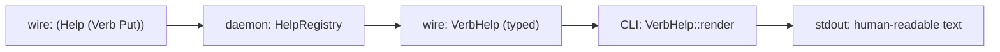
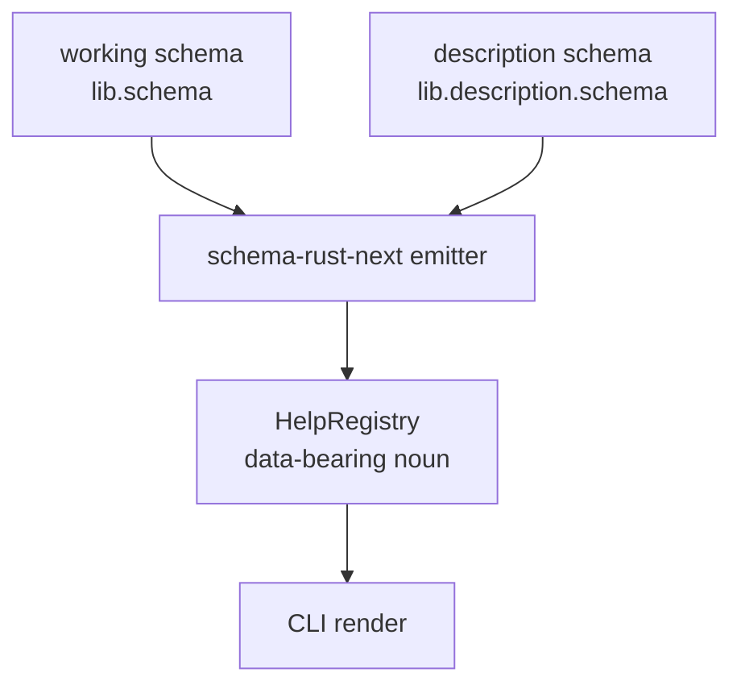

; designer
[help-namespace description-namespace mirror-namespace fully-qualified-symbol schema-data default-generator help-rendering Spirit-1493 Spirit-263 schema-carries concept-demo]
[Concept-and-demo report for sub-agent B of meta-report 487, designing the help/description namespace per Spirit 1493 (Principle High, 2026-06-03). The new intent: help and documentation should be schema data in a mirror description namespace over the global symbol namespace, with generated defaults when no explicit description entry exists for a fully qualified symbol. Recommendation: ratify schema-emitted Description namespace as a fourth schema kind alongside Signal/Nexus/Sema; one `.description.schema` file per component bound to the same SchemaIdentity as the working schema; schema-rust-next emits a `DescriptionDirectory` table on a data-bearing `HelpRegistry` struct (NOT a ZST); default-generator builds humanized descriptions from variant + field names when the table has no explicit entry; Help operations (Spirit 263) render through the typed Description chain at the CLI boundary only. Worked demo on `tiny-keystore`: full schema (working + description), generated `HelpRegistry` shape with methods, `(Help (Verb Put))` round-trip rendering. Six decisions for psyche to ratify; smallest operator slice = ship `.description.schema` parser + `HelpRegistry` emission for one component, leaving Help operation auto-injection as the second slice.]
2026-06-03
designer

# 487.2 — Help/description namespace design + demo

## TL;DR

Help and documentation become a fourth schema kind — `Description` —
that mirrors the working schema's global symbol namespace and binds
each fully qualified symbol to an optional `Description` value
(typed bracket string). One `.description.schema` file per
component bound to the same `SchemaIdentity` as its working schema.
The schema-rust-next emitter generates a data-bearing
`HelpRegistry` struct per component (`pub struct HelpRegistry {
explicit: BTreeMap<SymbolPath, Description>, schema_summary:
SchemaSummary }`) — NOT a ZST namespace — carrying both explicit
descriptions and the schema summary needed by the default generator.
Help text rendering happens at the user-facing surface (CLI
`(Help (Verb <name>))` operation per Spirit 263, generated docs
site, REPL `?<symbol>`). The default generator runs lazily at
lookup time, humanizing the variant or field name from the schema
summary when no explicit entry exists. Schema-carries (Spirit 1488
ratified yesterday) propagates: every component gets the help
substrate from one emitter and one library, not by hand-rolling.
Recommendation: ship the `Description` schema kind + `HelpRegistry`
emission as a single small slice on `tiny-keystore` first, then
extend to `spirit-next` once the shape settles.

## Section 1 — Current state

Help and documentation production in the workspace today is
fragmented across three substrates, none of which is discoverable
by an agent or a CLI at runtime:

| Surface | Where it lives | Discoverable? |
|---|---|---|
| Rust doc-comments | `///` on items in `<crate>/src/` | Only via `cargo doc`; not at runtime |
| NOTA `;` line comments | Above declarations in `.schema` files | Source-only; never reaches a daemon or CLI |
| Skill prose | `skills/<name>.md` and `<repo>/INTENT.md` / `ARCHITECTURE.md` | Workspace files; agents read by path |

Across the three substrates there is no shared schema, no
mechanism for an operation like `(Help (Verb Put))` to render
typed help text, and no fallback when documentation is absent.
The signal-channel macro injection direction named in Spirit 263
(*"every component supports `(Help Main)` and `(Help Verb)`
operations in its NOTA argument vocabulary; help documentation
likely auto-wired via the signal-channel macro"*) anchors the
direction but no concrete mechanism has been authored. The
deployed `signal-persona-spirit` v0.3.0 wire contract has no
`Help` variant; running `spirit "(Help Main)"` against the live
daemon would fail with `(RequestUnimplemented ...)`.

Spirit 263 (Decision Maximum) named the *what*. Spirit 1493
(Principle High, 2026-06-03) names the *how*: schema data in a
mirror description namespace over the global symbol namespace,
with generated defaults. This report's job is to make that
mechanism concrete.

## Section 2 — What the new intent requires

Spirit 1493 unfolds into four sub-requirements when read against
the workspace's schema-carries direction (Spirit 1488 ratified
2026-06-03 — psyche report 486 §"schema source carries the
engine-mechanism"):

1. **Description data lives in schema.** Not in markdown, not in
   Rust doc-comments, not in NOTA line comments. The description
   namespace is itself authored as `.schema` (or
   `.description.schema`) data so the schema-rust-next emitter
   processes it through the same pipeline that emits the working
   schema. The two namespaces are sibling outputs from one author
   pass, not separate documentation tools.

2. **The mirror parallels the global symbol namespace.** Every
   fully qualified symbol in the working schema — type, variant,
   field — has an *address* in the mirror. A symbol's
   description either exists (explicit entry) or is generated
   from the symbol's own structural form (default-fallback).

3. **Defaults generate when no explicit entry exists.** The
   workspace's beauty discipline (`ESSENCE.md` §"Beauty is the
   criterion") demands that an undocumented symbol still produce
   *some* help, not an empty string or a panic. The generator
   reads the schema's structural information (variant name,
   field type) and humanizes it into a default description. The
   explicit-vs-default distinction is observable in the rendered
   output (e.g., a `[generated]` annotation) so authors know
   which entries deserve attention.

4. **Closed-language rule applies.** Per Spirit 1490 (Principle
   Maximum, 2026-06-03): *tracing remains typed data until the
   client display boundary*. The same rule applies to help:
   `Description` is a typed bracket-string newtype on the wire and
   in storage; string rendering happens only when a CLI or
   documentation site prints the help text for a human reader.
   Cross-daemon Help responses carry typed Description values, not
   formatted English prose.

The mirror-namespace mechanism subsumes Spirit 263's auto-injection
direction. The signal-channel macro auto-emits the Help variant
into every working schema's Input enum; the mirror namespace
supplies the data the Help variant returns.

## Section 3 — The gap

Three specific differences between current state and the required
shape:

**Gap A — No `Description` schema kind in schema-rust-next.** The
emitter today recognises `Signal` working schemas and (in flight per
operator 281 + designer 486) the runtime triad plane schemas
(`NexusWork`, `NexusAction`, `SemaWriteInput`/`Output`,
`SemaReadInput`/`Output`). It does not recognise a description
namespace or a `.description.schema` file kind. Adding the kind is
a parser extension + an emitter extension; both land in the same
crate.

**Gap B — No `SymbolPath` typed identifier.** The schema-rust-next
crate's `Name` newtype (`schema-next/src/asschema.rs:19`) supports
single-segment names and namespace-colon paths
(`Name::namespace_segments` splits on `:`), but no canonical
fully-qualified-symbol type spans component + schema-kind + variant
+ payload + field. The mirror namespace needs that typed identifier
so descriptions bind to symbols, not to free-floating strings.

**Gap C — No `HelpRegistry` runtime substrate.** Even with the
schema kind and the typed identifier, every component still needs
a runtime noun that *holds* the descriptions and answers Help
operations. That noun has to be data-bearing (per AGENTS.md hard
override + `skills/rust/methods.md` §"No ZST method holders") —
the registry carries the description map and a schema summary the
default generator reads. The emitter generates per-component
`HelpRegistry::for_component()` constructors; the runtime answers
`(Help (Verb <name>))` through methods on the registry.

The three gaps compose: the schema kind authors the data, the
typed identifier addresses it, the registry serves it. Closing all
three is the slice this report sketches; the first concrete
operator step is in Section 9.

## Section 4 — Proposed design

The design follows the schema-carries shape (Spirit 1488 + designer
486): one new schema kind authored per-component, one
schema-rust-next emitter pass, one shared `triad-runtime`
extension. The four mechanisms below — file convention, typed
identifier, registry shape, default generator — are independent
enough to land in sequence but designed together so they compose
cleanly.

### 4a. The `.description.schema` file convention

Each component's working schema lives at
`<component>/schema/lib.schema`. The description namespace lives in
a sibling file at `<component>/schema/lib.description.schema`. The
two files share the same `SchemaIdentity` (component + version);
the description file's root type is `DescriptionNamespace` (an
enum-of-entries — per `skills/nota-design.md` §"Rule 1" the enum
shape applies because the file's records carry variants).

Three reasons the sibling-file shape wins over the alternatives:

- **Sibling file beats in-file split.** Putting descriptions inside
  the working `.schema` file means the working schema author has
  to scroll past the description block when reading the wire
  contract. The wire contract is read 100x for every 1x the
  descriptions are touched; separation respects that asymmetry.
- **Sibling file beats `.description.schema` directory.** A
  description per file is a single-author surface; a directory
  invites scatter (one file per variant, one file per type) and
  loses the "scan the whole component's help text" reading mode.
- **Sibling file beats markdown.** Markdown is the rendering
  target, not the source. Authoring descriptions in markdown
  loses the typed `SymbolPath` binding and the round-trip property
  Spirit 1490 + 1493 require.

The convention is mandatory for components that opt into help
(Section 5 ratification asks whether to make it mandatory
workspace-wide); the file's absence is treated as "every symbol
has a default-generated description" rather than as an error.
Components that genuinely want zero help (test fixtures, internal
experiments) skip the file.

### 4b. The typed `SymbolPath` identifier

A `SymbolPath` is the fully qualified address of a symbol in the
working schema. The NOTA shape is a homogeneous bracket vector of
`Name` segments (per `skills/nota-design.md` — sequences are
homogeneous, every element a `Name`); the schema-rust-next emitted
Rust shape is a struct of typed segments per kind:

```nota
;; The NOTA wire form (homogeneous segments, terse)
[tiny-keystore Operation Put KeyValue key]
;; Component-name      = [tiny-keystore]
;; Schema-kind/plane   = [Operation]    (one of Operation/Reply/Nexus/Sema/Effect)
;; Variant or type     = [Put]
;; Payload type        = [KeyValue]
;; Field               = [key]
```

The Rust binding lives in `schema-next` as a real data-bearing
struct (NOT a ZST namespace):

```rust
#[derive(rkyv::Archive, rkyv::Serialize, rkyv::Deserialize,
         Clone, Debug, Eq, Hash, PartialEq)]
pub struct SymbolPath {
    component: Name,
    plane: SchemaPlane,
    variant: Option<Name>,
    payload: Option<Name>,
    field: Option<Name>,
}

#[derive(rkyv::Archive, rkyv::Serialize, rkyv::Deserialize,
         Clone, Copy, Debug, Eq, Hash, PartialEq)]
pub enum SchemaPlane {
    Operation,
    Reply,
    NexusWork,
    NexusAction,
    SemaWriteInput,
    SemaWriteOutput,
    SemaReadInput,
    SemaReadOutput,
    Effect,
    Type,
}

impl SymbolPath {
    pub fn type_only(component: Name, type_name: Name) -> Self { ... }
    pub fn variant(component: Name, plane: SchemaPlane, variant: Name) -> Self { ... }
    pub fn field(component: Name, plane: SchemaPlane,
                 variant: Name, payload: Name, field: Name) -> Self { ... }

    pub fn parent(&self) -> Option<SymbolPath> { ... }
    pub fn humanized(&self) -> Description { ... }
}
```

The constructors are real associated functions on `SymbolPath`;
the `parent()` method navigates from a field to its payload, from a
payload to its variant, from a variant to its plane; `humanized()`
is what the default generator calls when no explicit entry exists.

### 4c. The data-bearing `HelpRegistry`

The runtime noun. Carries explicit descriptions + a summary of the
working schema so the default generator can humanize. Per AGENTS.md
hard override + `skills/rust/methods.md` §"No ZST method holders":
this struct holds real fields; methods are placed on the registry
because the registry carries the data the methods read.

```rust
#[derive(Debug)]
pub struct HelpRegistry {
    component: Name,
    explicit: std::collections::BTreeMap<SymbolPath, Description>,
    schema_summary: SchemaSummary,
}

#[derive(Debug)]
pub struct SchemaSummary {
    operations: Vec<VariantSummary>,
    replies: Vec<VariantSummary>,
    namespace_types: Vec<TypeSummary>,
}

#[derive(Debug)]
pub struct VariantSummary {
    name: Name,
    payload: Option<TypeReference>,
    fields: Vec<FieldSummary>,
}

#[derive(Debug)]
pub struct TypeSummary {
    name: Name,
    shape: TypeShape,
}

#[derive(Debug)]
pub enum TypeShape {
    Newtype(TypeReference),
    Struct(Vec<FieldSummary>),
    Enum(Vec<VariantSummary>),
}

#[derive(Debug)]
pub struct FieldSummary {
    name: Name,
    field_type: TypeReference,
}

impl HelpRegistry {
    pub fn for_component() -> Self { ... }  // schema-emitted constant

    pub fn describe(&self, symbol: &SymbolPath) -> DescribedSymbol {
        match self.explicit.get(symbol) {
            Some(description) => DescribedSymbol::Explicit(description.clone()),
            None => DescribedSymbol::Generated(self.default_for(symbol)),
        }
    }

    pub fn main(&self) -> MainHelp { ... }   // (Help Main) reply

    pub fn verb(&self, name: &Name) -> Option<VerbHelp> { ... }  // (Help (Verb <name>))

    fn default_for(&self, symbol: &SymbolPath) -> Description {
        symbol.humanized()
    }
}

#[derive(Debug, Clone)]
pub enum DescribedSymbol {
    Explicit(Description),
    Generated(Description),
}

impl DescribedSymbol {
    pub fn description(&self) -> &Description { ... }
    pub fn is_generated(&self) -> bool { ... }
}
```

Three properties matter:

- **`HelpRegistry::for_component()` is the only constructor.** The
  schema-rust-next emitter writes the body. It populates `explicit`
  from the parsed `.description.schema` (empty `BTreeMap` if the
  file is absent) and `schema_summary` from the working schema.
  The component author never writes a registry by hand; they
  author the `.description.schema` file and the emitter does the
  rest. This is schema-carries: the substrate is FREE per Spirit
  1488.

- **All verbs are methods on the data-bearing registry.** No ZST
  `Help` namespace. No free `help_for_symbol(...)` function. The
  registry holds `explicit` and `schema_summary`; methods that
  read either belong on the registry. Per `skills/rust/methods.md`
  §"No ZST method holders": *"the test: does the ZST's job vanish
  if you erase its name from the type system?"* — here the
  registry's job (hold the description map + summary) is real
  state; the verbs attach to it because it owns the data they
  read.

- **`DescribedSymbol` carries the explicit-vs-generated
  distinction.** The CLI rendering surface can annotate generated
  descriptions (e.g., `[Records an entry. (generated)]`) so
  documentation authors see which symbols need attention. The
  typed enum makes this observable at every consumer; no string
  inspection required.

### 4d. The default-generator algorithm

When `HelpRegistry::describe(&symbol)` finds no explicit entry, it
calls `symbol.humanized()`. The algorithm builds a default
description from the symbol's structural form and the schema
summary. The algorithm has six branches keyed on `SymbolPath`
shape; each produces a typed `Description`:

| Symbol shape | Default rule | Example for `tiny-keystore` |
|---|---|---|
| Component root (no plane, no variant) | `[<Component> component.]` | `[Tiny keystore component.]` |
| Plane root (plane set, no variant) | `[<Plane> operations on <component>.]` | `[Operation operations on tiny-keystore.]` |
| Variant (variant set, no field) | `[<Humanized variant>.]` | `[Put.]` for `(Put KeyValue)` |
| Variant with payload | `[<Humanized variant>: <humanized payload>.]` | `[Put: key value.]` |
| Field of struct | `[<Humanized field> of type <humanized type>.]` | `[Key of type key.]` |
| Field of enum payload | `[<Humanized field>.]` | `[Key.]` |

The humanization rule for an identifier:

1. Split on `_` (snake-case) or interpret as PascalCase.
2. Convert each segment to lowercase.
3. Join with single spaces.
4. Capitalize the first character only.

So `KeyValue` -> `[Key value.]`, `RecordAccepted` -> `[Record
accepted.]`, `commit_sequence` -> `[Commit sequence.]`. The trailing
period is the default suffix; the humanization rule is uniform so
agents and humans can predict the default for any symbol without
opening a generator implementation.

**Open: should defaults eagerly populate or lazily generate?**
Section 5 ratification asks. The recommendation lean is **lazy**
— `BTreeMap::get` -> `None` -> `humanized()` on the fly. Lazy
keeps the registry compact (a component with 50 symbols but only 3
explicit entries stores 3, not 50) and lets the humanization
algorithm evolve without re-baking the emitted bindings.

### 4e. Help-rendering surface — CLI is the boundary

Per Spirit 1490 (closed-language rule) + Spirit 1495 (daemons
stay free of string surfaces), help text rendering happens at the
client display boundary. The daemon answers `(Help Main)` and
`(Help (Verb <name>))` with typed `MainHelp` and `VerbHelp` values
carrying `DescribedSymbol` and structured schema information. The
CLI translates those typed replies into human-readable text on
stdout.

The Help operation auto-injection (Spirit 263) lands as two arms
the signal-channel macro emits into every working schema's Input
enum:

```rust
// Schema-rust-next auto-emits these into Operation
pub enum Operation {
    // ... per-component operations
    Help(HelpRequest),
}

#[derive(rkyv::Archive, rkyv::Serialize, rkyv::Deserialize,
         nota_next::NotaDecode, nota_next::NotaEncode,
         Clone, Debug)]
pub enum HelpRequest {
    Main,
    Verb(Name),
}

// And these arms in Reply
pub enum Reply {
    // ... per-component replies
    HelpMain(MainHelp),
    HelpVerb(VerbHelp),
}

#[derive(rkyv::Archive, ..., Clone, Debug)]
pub struct MainHelp {
    component: Name,
    description: DescribedSymbol,
    operations: Vec<VerbHelp>,
}

#[derive(rkyv::Archive, ..., Clone, Debug)]
pub struct VerbHelp {
    name: Name,
    description: DescribedSymbol,
    payload: Option<PayloadHelp>,
    reply: Option<ReplyHelp>,
}

#[derive(rkyv::Archive, ..., Clone, Debug)]
pub struct PayloadHelp {
    name: Name,
    description: DescribedSymbol,
    fields: Vec<FieldHelp>,
}

#[derive(rkyv::Archive, ..., Clone, Debug)]
pub struct FieldHelp {
    name: Name,
    field_type: Name,
    description: DescribedSymbol,
}

#[derive(rkyv::Archive, ..., Clone, Debug)]
pub struct ReplyHelp {
    name: Name,
    description: DescribedSymbol,
}
```

The CLI binary (per the schema-carries macro `cli_main!` from
designer 486) receives the typed reply and renders it. Rendering
is one method per typed shape:

```rust
impl MainHelp {
    pub fn render(&self) -> String {
        let mut output = String::new();
        output.push_str(&format!("{}\n", self.component));
        output.push_str(&format!("{}\n\n", self.description.description()));
        output.push_str("Operations:\n");
        for verb in &self.operations {
            output.push_str(&format!(
                "  ({:<10}) {}\n", verb.name, verb.description.description()
            ));
        }
        output
    }
}

impl VerbHelp {
    pub fn render(&self) -> String { ... }
}
```

The render methods live on `MainHelp` and `VerbHelp` per
`skills/abstractions.md` (verb belongs to noun). No ZST `HelpRenderer`
or free `render_main(...)` — the typed reply is the noun that
carries the data the render method reads.



Five nodes per Spirit 1282. The typed-data-to-string transition
happens only at the CLI render step; everything left of it is rkyv
binary on the wire and typed Rust in the daemon.

## Section 5 — Worked demo: `tiny-keystore`

The demo extends designer 485 + designer 486's `tiny-keystore`
component (a minimal Get/Put/Remove/Count store) with the
description namespace. Same algorithm; new description data; one
new file; one new emitted artifact.

### 5a. Working schema (existing — recap from designer 486)

`tiny-keystore/schema/lib.schema`:

```nota
{
  KeyValueIdentifier signal-tiny-keystore:lib:KeyValueIdentifier
  Key signal-tiny-keystore:lib:Key
  Value signal-tiny-keystore:lib:Value
}
[(Get Key) (Put KeyValue) (Remove Key) (Count)]
[(KeyValueFound Value) (KeyValueMissing Key) (KeyValueRecorded RecordReceipt) (KeyValueRemoved RemoveReceipt) (KeyValueCount RecordCount) (Error ErrorReport) (Rejected SignalRejection)]
{
  KeyValue { Key * Value * }
  RecordReceipt { KeyValueIdentifier * DatabaseMarker * }
  RemoveReceipt { KeyValueIdentifier * DatabaseMarker * }
  RecordCount Integer
  CommitSequence Integer
  StateDigest Integer
  DatabaseMarker { CommitSequence * StateDigest * }
  ErrorMessage String
  ErrorReport { ErrorMessage * DatabaseMarker * }
  SignalRejection { ValidationError * DatabaseMarker * }
  ValidationError [EmptyKey EmptyValue]
}
```

### 5b. Companion description schema (new)

`tiny-keystore/schema/lib.description.schema`:

```nota
;; Description namespace for tiny-keystore.
;; Every entry binds a SymbolPath to an explicit Description.
;; Symbols not listed here use the default generator.
[
  (Component [tiny-keystore] [|A minimal key-value store. Supports Get, Put, Remove, and Count operations against a single redb-backed namespace.|])
  (Plane [tiny-keystore] Operation [|Operations the daemon accepts on its ordinary signal socket.|])
  (Variant [tiny-keystore] Operation Get [|Read the value bound to a key. Returns KeyValueFound when present, KeyValueMissing otherwise.|])
  (Variant [tiny-keystore] Operation Put [|Write a key-value binding. Replaces any prior value for the same key.|])
  (Variant [tiny-keystore] Operation Remove [|Remove the binding for a key. Idempotent — Remove of an absent key replies KeyValueMissing.|])
  (Variant [tiny-keystore] Operation Count [|Count the number of bindings currently in the store.|])
  (Variant [tiny-keystore] Reply KeyValueRecorded [|Confirmation that a Put took effect. Carries the record identifier and the database marker.|])
  (Field [tiny-keystore] Operation Put KeyValue key [|The key — any non-empty UTF-8 string. Used as the primary index in the redb table.|])
  (Field [tiny-keystore] Operation Put KeyValue value [|The value bound to the key — any non-empty UTF-8 string.|])
  (Type [tiny-keystore] DatabaseMarker [|Per-write monotonic marker. CommitSequence advances by one per write; StateDigest is a hash of the post-write database state.|])
]
```

The root type is `DescriptionNamespace` — a `Vec<DescriptionEntry>`
where `DescriptionEntry` is the enum-of-record-shapes carrying the
component, plane (when relevant), variant, payload, and field
segments. The variants are `Component`, `Plane`, `Variant`,
`Field`, and `Type`; each takes a positional address followed by a
`Description` (typed bracket string, multi-line via `[|...|]`).

Notice what's NOT in the file: `Plane [tiny-keystore] Reply` is
absent (the default generator humanizes it), the `Get` variant's
`Key` field has no explicit entry (the default `[Key.]` is fine),
the `Count`, `KeyValueFound`, `KeyValueMissing`,
`KeyValueRemoved`, `KeyValueCount`, `Error`, `Rejected` variants
have no explicit entry. The author wrote what mattered; the
generator fills the rest.

### 5c. Schema-rust-next emitted Rust

The emitter ingests both files and produces the per-component
`HelpRegistry` constant. The generated module
`tiny_keystore::help` looks like:

```rust
use schema_next::{Description, HelpRegistry, Name, SchemaPlane,
                  SchemaSummary, SymbolPath, TypeShape};

impl HelpRegistry {
    pub fn for_tiny_keystore() -> Self {
        let mut explicit = std::collections::BTreeMap::new();

        explicit.insert(
            SymbolPath::component_only(Name::new("tiny-keystore")),
            Description::new(
                "A minimal key-value store. Supports Get, Put, Remove, \
                 and Count operations against a single redb-backed namespace."
            ),
        );
        explicit.insert(
            SymbolPath::plane(
                Name::new("tiny-keystore"),
                SchemaPlane::Operation,
            ),
            Description::new(
                "Operations the daemon accepts on its ordinary signal socket."
            ),
        );
        explicit.insert(
            SymbolPath::variant(
                Name::new("tiny-keystore"),
                SchemaPlane::Operation,
                Name::new("Put"),
            ),
            Description::new(
                "Write a key-value binding. Replaces any prior value \
                 for the same key."
            ),
        );
        // ... remaining explicit entries

        let schema_summary = SchemaSummary::for_tiny_keystore();

        Self::new(Name::new("tiny-keystore"), explicit, schema_summary)
    }
}
```

The emitter writes `for_tiny_keystore` as an `impl HelpRegistry`
associated function — NOT a free `fn build_tiny_keystore_registry()`
beside the struct. Per Spirit 882 (Maximum) + AGENTS.md hard
override: schema-emitted code follows the method-only rule.

The `SchemaSummary::for_tiny_keystore()` emission is similarly an
associated function on `SchemaSummary` that builds the schema
summary from the working schema's structural information.

### 5d. Daemon-side Help operation handling

The signal-channel macro auto-injects the Help arm into
`tiny-keystore`'s `Operation` enum and the `HelpMain` /
`HelpVerb` arms into `Reply`. The daemon's NexusEngine
implementation gets a default arm for Help that delegates to the
emitted `HelpRegistry`:

```rust
impl NexusEngine for Nexus {
    // ... existing decide_get, decide_put, decide_remove, decide_count

    fn decide_help(&mut self, request: HelpRequest) -> NexusAction {
        let reply = match request {
            HelpRequest::Main => Reply::HelpMain(self.help.main()),
            HelpRequest::Verb(name) => match self.help.verb(&name) {
                Some(verb_help) => Reply::HelpVerb(verb_help),
                None => Reply::Error(ErrorReport {
                    error_message: ErrorMessage(
                        format!("Unknown verb: {name}")
                    ),
                    database_marker: DatabaseMarker::initial(),
                }),
            },
        };
        NexusAction::ReplyToSignal(reply)
    }
}
```

The `Nexus` struct carries `help: HelpRegistry` as a field (added
by the macro's auto-injection or by the schema-carries
`triad_main!` macro per designer 486). The `decide_help` method
runs entirely typed — no string formatting, no NOTA decode. The
typed `MainHelp` / `VerbHelp` flows back through the NexusAction
-> Signal reply chain to the wire.

### 5e. CLI-side rendering round-trip

Running `tiny-keystore "(Help Main)"` against the daemon:

```text
$ tiny-keystore "(Help Main)"

tiny-keystore
A minimal key-value store. Supports Get, Put, Remove, and Count
operations against a single redb-backed namespace.

Operations:
  (Get        ) Read the value bound to a key. Returns KeyValueFound when present, KeyValueMissing otherwise.
  (Put        ) Write a key-value binding. Replaces any prior value for the same key.
  (Remove     ) Remove the binding for a key. Idempotent — Remove of an absent key replies KeyValueMissing.
  (Count      ) Count the number of bindings currently in the store.
  (Help       ) Get help. (generated)
```

The `(Help)` line is annotated `(generated)` because the Help
variant itself has no explicit description (the author didn't
write one in `lib.description.schema`); the default generator
humanized `Help` -> `Help` + a placeholder default. The
generated-annotation marks where the documentation could be
improved.

Running `tiny-keystore "(Help (Verb Put))"`:

```text
$ tiny-keystore "(Help (Verb Put))"

Put
Write a key-value binding. Replaces any prior value for the same key.

Payload: KeyValue
  key   (Key) The key — any non-empty UTF-8 string. Used as the primary
              index in the redb table.
  value (Value) The value bound to the key — any non-empty UTF-8 string.

Reply: KeyValueRecorded
  Confirmation that a Put took effect. Carries the record identifier
  and the database marker.
```

Every line in the rendered output is the application of a
typed `DescribedSymbol::description()` call followed by string
join + format. The daemon's wire reply was typed `VerbHelp`; the
CLI's `VerbHelp::render` does the typed-to-string translation.
Per Spirit 1495 the daemon never touched a string surface for
this Help operation.

### 5f. Default-fallback worked example

The `Get` variant's `Key` field has no explicit entry in
`lib.description.schema`. The render output for `(Help (Verb
Get))` shows the default:

```text
Get
Read the value bound to a key. Returns KeyValueFound when
present, KeyValueMissing otherwise.

Payload: Key
  Key. (generated)
```

The single field `Key` is a newtype wrapping a `String` (per the
working schema). The default generator picked the field-of-newtype
branch from Section 4d's table and produced `[Key.]` annotated
`(generated)`. An author scanning the output sees the
`(generated)` annotation and decides whether to write an explicit
entry.

## Section 6 — Side-by-side: current state vs proposed

| Aspect | Current state | Proposed state |
|---|---|---|
| Where descriptions live | Rust `///` doc-comments, NOTA `;` line comments, skill markdown | Schema data in `.description.schema` files |
| Discoverable at runtime | No — doc-comments only at `cargo doc`; NOTA comments source-only | Yes — `(Help Main)` and `(Help (Verb X))` operations on every component |
| Typed addressing | None — comments are positional next to declarations | `SymbolPath` newtype with structured segments per plane |
| Default fallback | None — undocumented items have no help | Lazy default generator humanizes from schema structure |
| Cross-language form | Rust source only (doc-comments do not survive into runtime) | Typed wire format (`Description` newtype, rkyv-encoded) |
| Workspace coverage | Inconsistent — some files documented, most not | Uniform — every fully qualified symbol has a description (explicit or generated) |
| Maintenance shape | Per-language, per-file, by hand | One `.description.schema` file per component; emitter does the rest |
| Help rendering | None — no Help operation lands today | CLI `render` methods on typed reply types; daemon stays typed |

The proposed shape is the schema-carries version of help: one new
schema kind + one new emitted noun + one new render surface, all
reusable across every component.

## Section 7 — Architectural visual



Five nodes per Spirit 1282. The two schema sources (working +
description) are sibling inputs to one emitter pass. The emitter
produces both the per-component daemon code (per designer 486)
and the `HelpRegistry` constant. The CLI render is the boundary
where typed Description values become human-readable strings.

## Section 8 — Decisions for psyche to ratify

The recommendation lean is named per decision; psyche ratifies or
adjusts.

### Decision A — File convention: sibling `.description.schema`?

The proposed shape is one sibling file per component
(`<component>/schema/lib.description.schema`) bound to the same
`SchemaIdentity` as the working schema. Alternatives considered:

| Option | Shape | Why not |
|---|---|---|
| Sibling file | `lib.description.schema` next to `lib.schema` | RECOMMENDED |
| In-file split | `lib.schema` carries a `;; descriptions` section | Working schema is read 100x for every 1x descriptions; separation respects asymmetry |
| Description directory | `descriptions/<symbol>.nota` per symbol | Scatter; loses whole-component reading mode |
| Markdown | `lib.description.md` | Loses typed `SymbolPath` binding + round-trip per Spirit 1490 |

Recommendation lean: **sibling file**. Yes / no, psyche?

### Decision B — Default generator algorithm

The proposed shape is the six-branch humanization rule in Section
4d (component / plane / variant / variant-with-payload / field-of-
struct / field-of-enum) with a uniform humanization step (split,
lowercase, join, capitalize-first). Alternatives:

| Option | Shape | Trade-off |
|---|---|---|
| Six-branch humanization (Section 4d) | Structural rules per shape | RECOMMENDED — predictable |
| Pure name humanization | All branches produce `[<Humanized name>.]` | Loses payload information at variant level |
| LLM-generated defaults | Call an external model | Off-band cost; non-deterministic; defeats schema-only data |
| `[no description]` literal | All branches return the same placeholder | Visually noisy; hides the structural information that exists |

Recommendation lean: **six-branch humanization**. Yes / no?

### Decision C — Eager-vs-lazy default generation

The proposed shape is lazy generation: `BTreeMap::get` -> `None`
-> `humanized()` at lookup time. Alternative: eager population
(emitter writes default entries for every symbol). Trade-offs:

| Option | Registry size | Algorithm evolution | Annotation source |
|---|---|---|---|
| Lazy (RECOMMENDED) | Small — only explicit entries | Easy — generator change re-renders | `is_generated()` from absence in map |
| Eager | Full per-component | Hard — every change rebakes | `is_generated()` from a side flag in entry |

Lazy keeps the registry compact and makes the humanization rule
the workspace-wide truth (one place to evolve). Eager bakes the
defaults into emitted Rust, making the per-component registry the
artifact; this hurts when the humanization rule changes (every
component re-emits) and helps when reflection requires a stable
artifact (debugging, fixture diffing).

Recommendation lean: **lazy**. Yes / no?

### Decision D — Help-rendering surfaces

The proposed shape is CLI-only initially, with the typed
`MainHelp` / `VerbHelp` types designed so additional rendering
surfaces (generated HTML documentation site, agent-facing JSON
introspection) can land later without changing the daemon. Open:

| Surface | Status in proposal | Effort if added later |
|---|---|---|
| CLI text rendering | Initial scope | Already in design |
| Generated HTML documentation site | Future direction | Add a new `impl Display for MainHelp` for HTML; same typed data |
| Agent introspection (JSON / NOTA dump) | Future direction | New CLI verb `(Introspect ...)`; same typed data |
| REPL `?<symbol>` | Future direction | New CLI verb; same typed data |

Recommendation lean: **CLI-only initially**, with the typed reply
types designed for extension. Yes / no?

### Decision E — Description namespace mandatory or optional per component?

Proposed: optional. A component with no
`lib.description.schema` still ships Help operations; every reply
is fully generated. Forcing the file mandatory would block
component pilots that aren't ready for documentation work.
Alternative: mandatory once the schema kind is workspace-canonical
(every new component must ship descriptions or fail emission).

| Option | Trade-off |
|---|---|
| Optional (RECOMMENDED initial direction) | Pilots can land Help support cheaply; documentation grows with maturity |
| Mandatory | Forces documentation discipline; risks blocking experimental components |

Recommendation lean: **optional initially; revisit when 3+
components have shipped Help**. Yes / no?

### Decision F — `SymbolPath` shape

The proposed shape is the five-segment struct (component, plane,
variant, payload, field). Alternatives:

| Option | Shape | Trade-off |
|---|---|---|
| Five-segment struct (RECOMMENDED) | Typed per segment | Validates well; supports `parent()` cleanly |
| `Vec<Name>` | Free-form path | Lighter; loses validation that the segments compose into a valid address |
| Nested enum | `SymbolPath = Component(Name, Option<PlanePath>); PlanePath = Plane(SchemaPlane, Option<VariantPath>); ...` | More precise; rather verbose at every constructor site |

Recommendation lean: **five-segment struct with `Option`-tail**.
Yes / no?

## Section 9 — Recommended next operator slice

The smallest meaningful implementation step that proves the design
without committing to the full surface:

**Slice: `Description` schema-kind parser + `HelpRegistry`
emission for `tiny-keystore` only.**

What lands:

1. **`schema-next` extensions** (~150 lines).
   - `SymbolPath` newtype with constructors per shape.
   - `SchemaPlane` enum.
   - `Description` newtype on bracket string.
   - `DescriptionEntry` enum + `DescriptionNamespace` (`Vec<DescriptionEntry>`).
   - Hand-written NOTA round-trip tests.

2. **`schema-rust-next` emitter extension** (~200 lines).
   - Recognise sibling `lib.description.schema` file when present.
   - Parse description entries; emit per-component
     `HelpRegistry::for_<component>()` constant.
   - Emit `SchemaSummary::for_<component>()` from the working
     schema's structure.
   - Skip emission when the description file is absent (Help
     still works through pure-generated defaults).

3. **`triad-runtime` extension** (~80 lines).
   - `HelpRegistry` struct + methods.
   - `SchemaSummary` + supporting types.
   - `DescribedSymbol` enum.
   - `MainHelp::render` and `VerbHelp::render` methods.

4. **`tiny-keystore` pilot files** (~50 lines).
   - `schema/lib.description.schema` per Section 5b.
   - Integration test asserting `(Help Main)` returns the
     expected `MainHelp` with the expected descriptions.

What does NOT land in this slice:

- Auto-injection of `Help` into the working schema's `Operation`
  / `Reply` enums. This is the second slice (it depends on
  signal-channel macro work per Spirit 263 + the schema-carries
  macro work per Spirit 1488).
- Rolling out the description schema to `spirit-next`,
  `signal-persona-spirit`, or any production component. Pilot
  first; production after pilot ratification.
- HTML documentation site rendering. Future direction.

Estimated effort: one operator session for the schema-next +
schema-rust-next extensions; one session for the triad-runtime +
tiny-keystore pilot. The `tiny-keystore` pilot is a non-production
component (it doesn't exist as a real daemon yet); the slice can
land entirely on a designer worktree per AGENTS.md §"Designers
work on feature branches".

The second slice (after pilot ratification): auto-injection of
the Help operation into `signal-persona-spirit` v0.4.0 + the
shared rendering surface in the `spirit` CLI. That's the
production-orientation cutover per Spirit 1482.

## Section 10 — Cross-references

- `reports/designer/487-Design-trace-help-config-context-meta-2026-06-03/0-frame-and-method.md` — this meta-report's frame.
- `reports/designer/486-Design-schema-carries-engine-mechanism-concept-demo-2026-06-02.md` — schema-carries direction this design extends.
- `reports/designer/485-Design-engine-vs-actor-traits-concept-demo-2026-06-02.md` — engine traits + lifecycle hooks template; the `HelpRegistry` follows the same data-bearing noun pattern.
- `reports/designer/482-Psyche-engine-mechanism-fundamental-decision-2026-06-02.md` — the substrate this report extends.
- `skills/component-triad.md` §"Help operations — discovery through NOTA, not through flags" — the Spirit 263 substrate.
- `skills/component-triad.md` §"Runtime triad engine traits" — the engine trait shape the Help operation joins.
- `skills/nota-design.md` §"Rule 1" — why `DescriptionEntry` is an enum (mirror namespace records carry variants).
- `skills/nota-design.md` §"Strings come EXCLUSIVELY from bracket forms" — the `Description` newtype wraps bracket strings only.
- `skills/abstractions.md` §"Schema-emitted nouns" — the `HelpRegistry` is a schema-emitted noun.
- `skills/rust/methods.md` §"No ZST method holders" — `HelpRegistry` carries real fields (`explicit`, `schema_summary`); no ZST namespace.
- `skills/rust/methods.md` §"Schema-generated objects are the method surface" — `MainHelp::render` and `VerbHelp::render` are methods on the emitted reply types.
- Spirit 263 (Decision Maximum) — every component supports `(Help Main)` and `(Help (Verb <name>))`.
- Spirit 1481 (Decision High, 2026-06-03) — report variant naming convention this report follows.
- Spirit 1487 (Decision High, 2026-06-03) — engine traits carry minimal lifecycle hooks; `HelpRegistry::for_<component>()` constructor follows the same emitted-binding pattern.
- Spirit 1488 (Decision High, 2026-06-03) — schema source carries the triad engine mechanism as baseline; the description schema extends the same shape.
- Spirit 1490 (Principle Maximum, 2026-06-03) — typed data until the client display boundary; `Description` is typed on the wire, string at the CLI render.
- Spirit 1493 (Principle High, 2026-06-03) — the intent this report designs against.
- Spirit 1494 (Principle High, 2026-06-03) — authored workspace data files prefer typed NOTA; `.description.schema` matches.
- Spirit 1495 (Principle Maximum, 2026-06-03) — daemons stay free of string surfaces except for user-authored payloads; help rendering happens at the CLI boundary.
