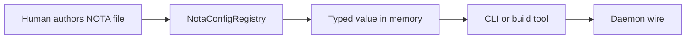

# 487.3 — Typed NOTA config-by-convention design + demo

## Verdict

The workspace already AUTHORS its truth in NOTA. The missing piece is
making the root type of every authored file a typed-and-discoverable
fact, not an implicit reader-knows. Spirit 1494 directs: predictable
file names and directories define the expected root type. The
proposed shape is a small schema-declared **convention registry**
that maps `(directory pattern, filename glob)` to a fully-qualified
root type, plus a loader trait method on a `NotaConfigRegistry` data
type that decodes any registered path into its expected typed value
and fails loudly when the file's actual shape diverges.

This converts the workspace's NOTA-text surfaces into a typed-config
substrate without touching daemons (Spirit 1495 boundary holds — the
convention applies to authored text only; daemons receive binary).
The registry composes naturally with the schema-emitted nouns
framework already in flight (per designer 486 + 479): each component
crate declares its convention entries beside its schema source, and
the workspace registry composes them. Smallest implementable slice:
add a `NotaConfigConvention` schema record + a `NotaConfigRegistry`
crate with `load` and `register` methods, then port `skills.nota` to
this loader as the first witness.

## Section 1 — What's the current state?

### Inventory of authored NOTA files

A `find ... -name '*.nota'` sweep across `/home/li` + `/git` finds
authored NOTA in roughly five categories. Each category currently
implies its root type by reader convention, not by declared type.

| Path pattern | Authored content | Implied root type today | How readers know |
|---|---|---|---|
| `<workspace>/skills/skills.nota` | Typed skill index | `Vec<SkillEntry>` where `SkillEntry` is an enum (Role / Architecture / Craft / Programming / Workflow / Meta) | Hand-written agent skill — `skills/nota-design.md` says read this one first |
| `<workspace>/intent/<topic>.nota` | Legacy intent records | `Vec<IntentEntry>` where `IntentEntry` is an enum (Decision / Principle / Correction / Clarification / Constraint) | Hand-written agent skill — `skills/intent-log.md` describes the file substrate |
| `<repo>/bootstrap-policy.nota` (e.g. `persona-spirit`, `upgrade`) | First-start policy seed for a triad daemon | Currently a positional record OR a Vec of bootstrap policy entries; per `skills/component-triad.md` §"Policy state and working state" | Daemon source reads it; rest of workspace inspects via fragile string grep |
| `<repo>/examples/canonical.nota` (every `signal-*` crate has one) | Worked examples of every Operation + Reply variant in the contract | `Vec<Operation>` followed by `Vec<Reply>` — but actually a flat sequence of records of either type | Test harness in `tests/round_trip.rs` decodes against the explicit type per record |
| `<workspace>/<unique-config>.nota` (e.g. `~/.config/chroma/config.nota`, `criomos-horizon-config/horizon.nota`, `CriomOS-test-cluster/clusters/fieldlab.nota`) | One-of-a-kind authored config for a component | A single struct or enum — `Config`, `HorizonProposal`, etc. — named explicitly by the first-position tag | The receiving component's hand-written loader code |

### How readers discover the root type today

Three patterns, all ad hoc:

- **The file just is what it is, and the reader knows.** `skills.nota`
  has no schema header declaring its root type; the agent reading it
  knows from `skills/nota-design.md` that this file's root is a
  vector of `SkillEntry` enum variants.
- **The first record's variant tag self-identifies a single-struct
  config.** `~/.config/chroma/config.nota` opens with `(Config ...)`
  — the variant tag is the type name. But the file's root isn't
  declared anywhere; if a reader saw a renamed `(NewConfig ...)`
  variant, they would not know whether the file's root type accepts
  it.
- **A hand-written loader function in the receiving crate names the
  expected type at the decode site.** `persona-spirit-daemon`'s
  bootstrap loader hard-codes `parse_bootstrap_policy(path) -> Result<Vec<BootstrapEntry>, _>`
  at the call site; nothing outside that crate's source knows the
  expected root.

### The cost of the current ad hoc convention

- A new agent reading the workspace cannot enumerate "what root type
  does this file have?" without inspecting the receiving crate's
  source code, the skill that documents the file, or just guessing
  from the first record's variant tag.
- Adding a new authored config NOTA file requires three coordinated
  edits — author the file, author the loader, document the
  convention in a skill — with no single-source-of-truth.
- A file written by hand against the wrong shape (or against an
  outdated schema after the receiving crate's types evolved) does
  not fail loudly until the receiving daemon panics at decode time
  — the kind of "implicit convention drift" that the workspace
  closed-world discipline forbids elsewhere.
- The convention exists, but it lives in agents' skill-memory and
  scattered loader call sites, not in a typed registry.

## Section 2 — What does the new intent require?

Spirit 1494 (Principle High, 2026-06-03):

> Authored workspace data files should prefer typed NOTA data:
> predictable file names and directories define the expected root
> type, usually a struct or sometimes a top-level enum selection or
> vector of records.

The psyche's STT phrasing decomposes into five operative claims:

1. **Authored data prefers typed NOTA over other shapes.** If we
   author data anywhere, the default substrate is a `.nota` file
   carrying a typed shape — not JSON, YAML, TOML, or hand-rolled
   text.
2. **The file's path determines the expected type.** "If we write
   anything … in a NOTA vector of records … so it's a certain type.
   Like config.nota in a certain type of directory has a certain
   type to it." Path = directory + filename = type discriminator.
3. **The convention is workspace-decided, not file-declared.** "We
   decide what the convention is. Whatever we wherever we put the
   file and give it a predictable name, then we can specify it and
   decide what type it is." The convention lives in a workspace-
   level table, not in each file's header.
4. **Three shapes for the root.** "Whether it's a single struct or a
   vector of struct. Probably. You're almost always going to start
   with a struct. Sometimes you start with the top enum selection."
   The convention's root-type field admits three shapes — single
   struct, vector of records, or top-level enum selection — and
   structs are the common default.
5. **Spirit 1495 boundary holds.** Daemons stay free of NOTA
   decoding. The convention applies to *authored* files that get
   loaded by tools, the CLI, or codegen input. The daemon's wire is
   binary; only the CLI / authoring path crosses the NOTA boundary.

Together: the workspace needs a declared registry that maps a path
shape to a root type. Loaders consult the registry; agents author
files knowing their path determines their type; the convention
becomes a typed-and-grep-able fact about the workspace.

## Section 3 — What's the gap?

The current state and the new intent diverge across four axes.

| Axis | Current ad hoc | Required by Spirit 1494 |
|---|---|---|
| Where the convention lives | Implicit — skill docs, loader call sites, agent memory | A central typed registry, declared as schema data |
| How readers discover root types | Read the relevant skill or loader source | Look up `(path-pattern, filename)` in the registry |
| How loaders enforce the type | Hand-written `parse_X` functions per consumer | One generic `NotaConfigRegistry::load` that picks the right typed decoder from the registry |
| How drift fails | Daemon panic / decode-time error after build | Loader-time error against the declared expected type, before the file enters any runtime path |

The gap is not a missing typed substrate (NOTA already provides one);
it is a missing **discovery surface**. The registry is the surface.

## Section 4 — Proposed design with demo

### Section 4.1 — The convention registry shape

A new schema record in a small `nota-config-convention` crate:

```schema
{
  NotaConfigConvention {
    PathPattern *
    Filename *
    RootType *
  }
  PathPattern { Workspace * Repository * AbsoluteOrRelativeGlob * }
  Filename [(Exact String) (Glob String)]
  RootType [
    (Struct FullyQualifiedTypeName)
    (Enum FullyQualifiedTypeName)
    (VectorOfRecords FullyQualifiedTypeName)
  ]
  FullyQualifiedTypeName { Crate * Module * TypeIdentifier * }
}
```

Per the inline-enum-payload pattern (Spirit 1467 + 1468), `Filename`
declares variants whose payloads are looked up from the same schema:
an exact filename or a glob. `RootType` is the same shape — three
variants spelling out which kind of root the file carries. The
fully-qualified type name decomposes into crate / module / type, so
the loader can dispatch through a code-generated lookup table.

A registry is a homogeneous vector of these records, per Spirit 1494's
"vector of records, so it's a certain type":

```nota
;; nota-config-convention/workspace-conventions.nota
[
  (NotaConfigConvention
    (Workspace [primary] [.] [skills])
    (Exact [skills.nota])
    (VectorOfRecords (skills-index lib SkillEntry)))

  (NotaConfigConvention
    (Workspace [primary] [.] [intent])
    (Glob [*.nota])
    (VectorOfRecords (legacy-intent lib IntentEntry)))

  (NotaConfigConvention
    (Repository [persona-spirit] [.] [.])
    (Exact [bootstrap-policy.nota])
    (VectorOfRecords (signal-persona-spirit bootstrap BootstrapEntry)))

  (NotaConfigConvention
    (Repository [signal-persona-spirit] [.] [examples])
    (Exact [canonical.nota])
    (VectorOfRecords (signal-persona-spirit examples CanonicalRecord)))

  (NotaConfigConvention
    (Workspace [primary] [~/.config] [chroma])
    (Exact [config.nota])
    (Struct (chroma-config lib ChromaConfiguration)))

  (NotaConfigConvention
    (Repository [criomos-horizon-config] [.] [.])
    (Exact [horizon.nota])
    (Struct (horizon-rs lib HorizonProposal)))
]
```

This is itself a `Vec<NotaConfigConvention>` — and the registry file
itself has a convention entry naming its own root type. The registry
bootstraps from its own file at the workspace root, satisfying the
psyche's "vector of records, so it's a certain type" directly.

The skill-emitted lookup table uses the inline-enum-payload sugar:
`RootType` is one of three variants whose payload is a
`FullyQualifiedTypeName`, exactly the pattern designer 479 promoted.

### Section 4.2 — A typed loader on a real data-bearing type

Per AGENTS.md hard override (method-only, no ZST namespace), the
loader lives on a real data-bearing `NotaConfigRegistry` type that
carries the convention table:

```rust
pub struct NotaConfigRegistry {
    conventions: Vec<NotaConfigConvention>,
    decoder_lookup: ResolvedDecoderTable,
}

pub struct ResolvedDecoderTable {
    entries: Vec<ResolvedDecoderEntry>,
}

pub struct ResolvedDecoderEntry {
    pattern_match: CompiledPathMatcher,
    decoder: TypedNotaDecoder,
}

pub enum TypedNotaDecoder {
    Struct(fn(&str) -> Result<TypedNotaValue, NotaConfigLoadError>),
    Enum(fn(&str) -> Result<TypedNotaValue, NotaConfigLoadError>),
    VectorOfRecords(fn(&str) -> Result<TypedNotaValue, NotaConfigLoadError>),
}

pub enum TypedNotaValue {
    Skills(Vec<SkillEntry>),
    Intent(Vec<IntentEntry>),
    BootstrapPolicy(Vec<BootstrapEntry>),
    Canonical(Vec<CanonicalRecord>),
    ChromaConfiguration(ChromaConfiguration),
    HorizonProposal(HorizonProposal),
    // ... one variant per registered RootType
}

impl NotaConfigRegistry {
    pub fn from_bootstrap_file(path: &Path) -> Result<Self, NotaConfigLoadError> {
        let conventions = Self::decode_bootstrap(path)?;
        let decoder_lookup = ResolvedDecoderTable::resolve(&conventions)?;
        Ok(Self { conventions, decoder_lookup })
    }

    pub fn load(&self, path: &Path) -> Result<TypedNotaValue, NotaConfigLoadError> {
        let entry = self.decoder_lookup.match_path(path)
            .ok_or_else(|| NotaConfigLoadError::PathNotRegistered { path: path.to_path_buf() })?;
        let raw_nota = std::fs::read_to_string(path)
            .map_err(|source| NotaConfigLoadError::IoFailure { path: path.to_path_buf(), source })?;
        entry.decoder.decode_typed(&raw_nota)
    }

    pub fn register(&mut self, convention: NotaConfigConvention) -> Result<(), NotaConfigLoadError> {
        let resolved = ResolvedDecoderEntry::resolve(&convention)?;
        self.conventions.push(convention);
        self.decoder_lookup.entries.push(resolved);
        Ok(())
    }
}

impl TypedNotaDecoder {
    pub fn decode_typed(&self, source: &str) -> Result<TypedNotaValue, NotaConfigLoadError> {
        match self {
            Self::Struct(decoder) => decoder(source),
            Self::Enum(decoder) => decoder(source),
            Self::VectorOfRecords(decoder) => decoder(source),
        }
    }
}

impl NotaConfigLoadError {
    pub fn root_type_mismatch(
        path: &Path,
        expected: RootType,
        actual_first_token: &str,
    ) -> Self {
        Self::RootTypeMismatch {
            path: path.to_path_buf(),
            expected,
            actual_first_token: actual_first_token.to_owned(),
        }
    }
}
```

Every function above is a method on a real data-bearing type — none
are free functions, none live on ZST holders. Per AGENTS.md
method-only override, this satisfies the hard rule.

`NotaConfigLoadError` is a per-crate typed enum
(`thiserror::Error`) per the typed-errors discipline:

```rust
#[derive(Debug, thiserror::Error)]
pub enum NotaConfigLoadError {
    #[error("path {path} is not registered in any convention")]
    PathNotRegistered { path: PathBuf },

    #[error("failed to read NOTA file at {path}: {source}")]
    IoFailure { path: PathBuf, #[source] source: std::io::Error },

    #[error("root type mismatch at {path}: expected {expected:?}, saw {actual_first_token}")]
    RootTypeMismatch { path: PathBuf, expected: RootType, actual_first_token: String },

    #[error("convention's RootType references unknown type {type_name:?}")]
    UnknownTypeReference { type_name: FullyQualifiedTypeName },

    #[error("NOTA decode at {path} failed: {source}")]
    DecodeFailure {
        path: PathBuf,
        #[source]
        source: nota_codec::NotaDecodeError,
    },
}
```

### Section 4.3 — Concrete demo: skills.nota as a worked end-to-end

**Step 1 — the file as it exists today** (extract):

```nota
;; NOTA records are positional. Type, then fields, no keywords.
[
  (Role operator skills/operator.md Apex
    [Implementation as craft.])
  (Architecture component-triad skills/component-triad.md Apex
    [Daemon + thin CLI + signal-* contract.])
  (Craft naming skills/naming.md Keystroke
    [Full English words.])
  ;; ... ~80 more entries
]
```

The root is a top-level bracket sequence — `Vec<SkillEntry>` where
`SkillEntry` is an enum with six unit-variant-named variants (Role,
Architecture, Craft, Programming, Workflow, Meta), each carrying a
positional record payload.

**Step 2 — the schema declaring `SkillEntry`** (per the
inline-enum-payload pattern, designer 479):

```schema
;; skills-index/lib.schema
{
  SkillEntry {
    Category *
    InstanceName *
    SkillPath *
    Tier *
    Description *
  }
  Category [Role Architecture Craft Programming Workflow Meta]
  Tier [Apex Keystroke Topic Mechanism]
  InstanceName (String)
  SkillPath (Path)
  Description (String)
}
```

Each `SkillEntry` is a five-field positional struct. Reading the
`skills.nota` file confirms the shape — the first position is the
Category enum variant, the second is the instance name, and so on.

**Step 3 — the convention entry that types it**:

```nota
(NotaConfigConvention
  (Workspace [primary] [.] [skills])
  (Exact [skills.nota])
  (VectorOfRecords (skills-index lib SkillEntry)))
```

This says: in the `primary` workspace, in directory `./skills`, the
file `skills.nota` is a vector of records whose element type is
`skills-index::lib::SkillEntry`.

**Step 4 — the generated Rust loader method** (per schema-rust-next
emission per designer 486's schema-carries pattern):

```rust
impl NotaConfigRegistry {
    pub fn load_skills(&self) -> Result<Vec<SkillEntry>, NotaConfigLoadError> {
        let path = self.skills_path();
        let value = self.load(&path)?;
        match value {
            TypedNotaValue::Skills(entries) => Ok(entries),
            other => Err(NotaConfigLoadError::root_type_mismatch(
                &path,
                RootType::VectorOfRecords(FullyQualifiedTypeName::skills_entry()),
                other.first_token(),
            )),
        }
    }

    pub fn skills_path(&self) -> PathBuf {
        self.workspace_root.join("skills").join("skills.nota")
    }
}
```

The emitter has the schema knowledge to derive this method
automatically once the convention entry lands — `load_skills` reads
the registered convention, calls the generic `load`, and pattern-
matches on the variant of `TypedNotaValue` that the registry
guarantees this convention produces.

**Step 5 — the error case (a file that does not match its
convention's type)**:

Suppose someone edits `skills.nota` and accidentally wraps every
record in `(Skill ...)`:

```nota
[
  (Skill Role operator skills/operator.md Apex [...])
  (Skill Architecture component-triad skills/component-triad.md Apex [...])
]
```

The convention says the root is `Vec<SkillEntry>` where the first
position is the Category enum variant (Role / Architecture / etc.).
The decoder sees `Skill` at position zero of the first record — a
PascalCase token that does not match any Category variant. The error
surfaces at registry-load time, before any consumer sees the file:

```rust
Err(NotaConfigLoadError::DecodeFailure {
    path: "/home/li/primary/skills/skills.nota".into(),
    source: nota_codec::NotaDecodeError::UnknownEnumVariant {
        enum_name: "Category".into(),
        seen_variant: "Skill".into(),
        allowed_variants: vec!["Role", "Architecture", "Craft", "Programming", "Workflow", "Meta"],
    },
})
```

This is the closed-world discipline applied at the authored-data
layer. The receiving consumer never sees a half-decoded value; the
load fails loudly, with the path and the typed reason.

### Section 4.4 — The default-starts-with-a-struct rule

The psyche's note: "You're almost always going to start with a
struct. Sometimes you start with the top enum selection."

The `RootType` enum admits three variants:

```nota
RootType [
  (Struct FullyQualifiedTypeName)
  (Enum FullyQualifiedTypeName)
  (VectorOfRecords FullyQualifiedTypeName)
]
```

- **Struct** — the file's root is a single struct. The canonical
  case: a per-component configuration. Examples in the current
  inventory: `~/.config/chroma/config.nota` (a `ChromaConfiguration`
  struct), `criomos-horizon-config/horizon.nota` (a
  `HorizonProposal` struct).
- **Enum** — the file's root is a single enum selection. Less common
  than struct or vector; appears when a config file picks one shape
  from a closed enum of possible shapes. The psyche named this case
  explicitly: "sometimes you start with the top enum selection."
- **VectorOfRecords** — the file's root is `Vec<T>` where `T` is a
  named struct or enum. The canonical case: the skill index, the
  intent log, the bootstrap policy seed, the canonical-examples
  file. The psyche named this case explicitly: "a NOTA vector of
  records, so it's a certain type."

The convention registry's schema rejects ambiguous shapes — a
convention entry MUST pick one of the three RootType variants, and
the loader's decoder is type-specific for each variant. Per Spirit
1395 + 1401 (developed interface, multi-variant enum), the three
variants are a real multi-variant enum, not a one-variant newtype.

Adding a fourth root shape (e.g. `MapOfRecords` for `{key value}`-
shaped roots) is a schema extension — a new variant in the
`RootType` enum — not a parallel registry. This keeps the
discoverable surface uniform.

### Section 4.5 — Per-directory inference (glob filename patterns)

The legacy intent files (`intent/*.nota`) all share the same root
type: `Vec<IntentEntry>` where `IntentEntry` is the five-kind enum
(Decision / Principle / Correction / Clarification / Constraint).

Currently each file is a separate authored file (`workspace.nota`,
`spirit.nota`, `nota.nota`, etc.) — the topic is encoded as the
filename. The convention registry uses a glob filename pattern to
type them all at once:

```nota
(NotaConfigConvention
  (Workspace [primary] [.] [intent])
  (Glob [*.nota])
  (VectorOfRecords (legacy-intent lib IntentEntry)))
```

The loader's path matcher compiles this convention into a regex-
like predicate; any path that lands in `primary/intent/` with a
`.nota` extension routes to the `IntentEntry` decoder.

This generalises. Any directory of homogeneously-typed authored
files (e.g. per-cluster declarations in
`CriomOS-test-cluster/clusters/*.nota`, per-skill index files
under a future `skills/*.nota` regime) earns one glob-pattern
convention, not N individual entries.

### Section 4.6 — Daemon boundary (Spirit 1495)

Per Spirit 1495 (Principle Maximum): daemons stay free of NOTA
decoding; clients translate NOTA text into binary protocol data.

The convention registry applies to **authored** NOTA files, not the
wire. The components that load through `NotaConfigRegistry::load`:

- **The CLI** loads its inline NOTA argument or NOTA file argument,
  decodes it against the matching contract's `Operation` type, and
  sends the rkyv-encoded binary to the daemon.
- **The schema-rust-next codegen build script** loads `.schema`
  files and the workspace's `nota-conventions.nota` registry to know
  what types each NOTA file's loader should emit.
- **A future workspace-config crate** loads `skills.nota`,
  `intent/*.nota`, the per-repo `INTENT.md` and `ARCHITECTURE.md`
  surfaces (if NOTA-shaped data is extracted from them eventually).
- **The bootstrap-policy loader inside each triad daemon** loads
  `<repo>/bootstrap-policy.nota` on first start. This IS a daemon
  reading NOTA — but per the existing convention (component-triad
  §"Policy state and working state"), it is a one-shot bootstrap
  read, not a wire boundary. The convention registry types this
  read at the bootstrap site; the daemon's normal wire surface
  remains pure binary.

What the convention registry does NOT do:

- It does NOT add NOTA decoding to any daemon's normal wire path.
- It does NOT make the daemon's runtime config a NOTA file
  (Spirit 1495 still holds — the daemon's `--single-argument` rule
  receives a NOTA-shaped record on argv, but the runtime config
  loaded from disk by the daemon is part of the bootstrap-once
  flow only).
- It does NOT convert any inter-component channel into NOTA text.

Boundary diagram:



Five nodes per the mermaid cap. The arrow Daemon receives is binary
on the wire; the NOTA boundary terminates at the Client side.

## Section 5 — Decisions for the psyche to ratify

### Decision 1 — Where does the convention registry live?

Three candidates surfaced during design:

- **(a) Workspace-root single file.** One
  `nota-conventions.nota` at `/home/li/primary/nota-conventions.nota`
  declaring every workspace convention.
- **(b) Per-repo entries.** Each repo carries its own
  `<repo>/.nota-conventions.nota`; the workspace registry composes
  them at load time.
- **(c) Schema-emitted from per-component `lib.schema` headers.**
  Each schema source declares the NOTA file convention it implies
  (e.g., the `signal-persona-spirit` schema declares the
  `bootstrap-policy.nota` convention), and the workspace registry
  is auto-emitted from all schemas at workspace-build time.

Designer lean: **(c) schema-emitted from per-component schemas, with
a workspace-root file (a) for workspace-only conventions like
`skills.nota` and `intent/*.nota`.** The schema-carries pattern
(designer 486) generalises — if a component author declares the
NOTA file shape its schema implies, the registry is emitted, and
nobody hand-maintains a registry-vs-schema drift gap. The workspace-
root file is for the few files that don't belong to any component
crate.

### Decision 2 — How are conventions discovered at run-time?

Two shapes:

- **(eager) Compile-time static registry.** Schema-rust-next emits a
  workspace-shared `NOTA_CONFIG_REGISTRY: NotaConfigRegistry` static
  at build time. Loaders import it. Zero run-time discovery cost;
  the registry IS the build output.
- **(lazy) Read `nota-conventions.nota` at process start-up.** Each
  consumer (CLI, build tool, workspace-config crate) reads the
  registry file when it starts. Slightly slower start-up; allows
  conventions to evolve without rebuilds.

Designer lean: **eager (compile-time static) for the production
path, lazy (file-read) for development.** Schema-rust-next emits a
`const fn` registry constructor; the schema-carries macro instantiates
it at build time; binaries link the registry as static data. A
development-mode build flag swaps in the file-read constructor so
a designer iterating on a new convention doesn't need to rebuild
the world.

### Decision 3 — What happens on mismatch?

Two shapes:

- **(hard) Hard error at load time.** `load(path)` returns
  `Err(NotaConfigLoadError::RootTypeMismatch { ... })`. No
  consumer sees a partial decode.
- **(soft) Warning at load time.** Log the mismatch but return a
  best-effort decoded value. Consumers see degraded data; the
  workspace warns but continues.

Designer lean: **hard error at load time.** Per the workspace
closed-world discipline (Spirit's strict-substrate-is-ground-truth
rule per `skills/spirit-cli.md` §"Substrate migration discipline"),
the strict substrate wins. A NOTA file whose root doesn't match its
declared convention is an authoring bug; the load must fail loudly
with the path + the expected vs. observed root, not silently degrade.

### Decision 4 — Daemon boundary statement (no ratification needed; just
explicitly state)

The convention registry applies to **authored NOTA text files** that
get loaded by tools, CLIs, schema-rust-next codegen, or the
bootstrap-once daemon read. It does NOT cross the wire boundary.
Daemons exchange binary signal-frame data per Spirit 1495; the wire
never sees the registry, and the registry never declares wire
shapes. The wire's contract crate (`signal-<component>`) declares
the binary types; the convention registry declares the authored-file
types.

Per the psyche's STT: "we create a record type. Like if we write
anything, it might as well just be in a nota vector of records. So
it's a certain type." The convention registry types the *we write
anything* side; the wire types the *components exchange anything*
side. They are two distinct typed surfaces over the same NOTA
vocabulary.

### Decision 5 — Glob filename patterns vs exact filenames

The convention entry's `Filename` field can be an exact filename or
a glob. Wildcards apply at the filename-only layer (not across
directory boundaries); the directory pattern is matched separately.

Decision asks:

- Is the glob's syntax shell-style (`*`, `?`, `[...]`) or regex?
  Designer lean: shell-style — agents reading the convention table
  shouldn't need to know regex.
- Does the loader resolve glob conflicts (a path matching two
  conventions)? Designer lean: error — overlapping conventions
  break the discovery property and surface as a registry
  validation failure at compile time.

## Section 6 — Recommended next operator slice

**Slice scope.** Land the registry's minimum viable shape:

1. **A new crate `nota-config-convention`** carrying:
   - The `NotaConfigConvention` / `PathPattern` / `Filename` /
     `RootType` / `FullyQualifiedTypeName` schema types.
   - The `NotaConfigRegistry` type with `from_bootstrap_file`,
     `load`, and `register` methods.
   - The `TypedNotaDecoder` / `TypedNotaValue` enums (initially with
     one variant: `Skills(Vec<SkillEntry>)`).
   - The `NotaConfigLoadError` typed enum.
2. **A workspace-root `nota-conventions.nota`** with one convention
   entry — for `skills/skills.nota`.
3. **A `skills-index` crate** that depends on `nota-config-convention`
   and exposes `SkillEntry` plus a `skills_index_path()` helper.
4. **A witness test** at `nota-config-convention/tests/skills_load.rs`
   that loads `skills.nota` through the registry and asserts the
   first three entries decode as `SkillEntry::Role`,
   `SkillEntry::Architecture`, `SkillEntry::Architecture`.
5. **A second witness test** that authors a corrupted-shape
   `skills.nota` fixture and asserts the registry returns
   `Err(NotaConfigLoadError::DecodeFailure { ... })` with the
   expected path and source error.

Out of scope for this slice:

- The schema-rust-next emission path (Decision 2 eager-vs-lazy). The
  slice uses a hand-authored registry; the emitter integration is a
  separate slice.
- Porting `intent/*.nota` to the registry. Once `skills.nota` works,
  intent migration is a second slice.
- The daemon bootstrap-policy port. Per Spirit 1495 boundary, this
  is intentionally deferred — the registry first proves itself on
  workspace-authored files, then extends to daemon bootstrap when
  the pattern is robust.

Estimated size: ~400 lines of Rust + ~30 lines of NOTA convention
fixture + ~100 lines of tests. Fits a single designer worktree pass
in `~/wt/github.com/LiGoldragon/nota-config-convention/`.

## Section 7 — Cross-references

- Spirit 1494 (Principle High, 2026-06-03) — typed NOTA files;
  predictable file names + directories define expected root type.
  This report's anchor.
- Spirit 1495 (Principle Maximum, 2026-06-03) — daemons stay free of
  NOTA decoding; clients translate. The boundary this report honors.
- Spirit 1467 + 1468 (Decision High, 2026-06-02) — inline enum
  payload + sugar extension. The pattern this report's `RootType`
  enum uses.
- Spirit 1395 + 1401 (2026-06-02) — interface roots are enums with
  more than one variant. The three-variant `RootType` qualifies.
- Spirit 1419 (Decision Maximum, 2026-06-02) — programmatic triad +
  tiny daemon main = macro call. The pattern this report's
  schema-emitted registry follows.
- Spirit 1411 (Principle Maximum, 2026-06-02) — beauty must prevail.
  The registry is one workspace-shared discovery surface, not a
  drift-prone per-component table.
- `skills/nota-design.md` Rules 1-4 — the canonical NOTA design
  discipline this report's schema fragments follow.
- `skills/component-triad.md` §"The single argument rule" — the rule
  the daemon-config-file convention extends.
- `reports/designer/486-Design-schema-carries-engine-mechanism-concept-demo-2026-06-02.md`
  — the schema-carries pattern this report's Decision 1 (c) leans on.
- `reports/designer/479-inline-enum-payload-pattern-vision-2026-06-02.md`
  — the inline-enum-payload pattern this report's `RootType` uses.
- `reports/operator/290-enum-payload-variant-pattern-2026-06-02.md`
  — the variant payload pattern; structurally relevant.
- `reports/designer/487-Design-trace-help-config-context-meta-2026-06-03/0-frame-and-method.md`
  — the meta-report frame.

## Section 8 — Synthesis hook for the orchestrator

For the `6-overview.md` synthesis pass: this sub-report's main
findings cross-cut with the other three sub-agents.

- **Cross with sub-agent A (trace mechanism + daemon string boundary).**
  Spirit 1495 (daemon-boundary) appears in both reports. Sub-agent A
  audits whether the daemon currently holds NOTA decoding state; this
  report names the registry as the *correct* surface for authored
  files. Together: daemons binary, authored files typed-by-convention.
- **Cross with sub-agent B (help/description namespace).** The
  description namespace is a sibling concept — both are workspace-
  level registries declared as schema data over fully-qualified
  symbol names. The mechanisms compose: a help namespace entry can
  reference a NOTA file's expected type so `(Help (File <path>))`
  can answer "what shape does this file carry?"
- **Cross with sub-agent D (context maintenance + Spirit
  contradiction sweep).** The convention registry creates one
  obvious early target — the legacy `intent/*.nota` files now have
  a typed convention. Sub-agent D's maintenance sweep can confirm
  whether the legacy file substrate's variant set still matches
  the current `IntentEntry` type, or whether a vocabulary
  migration (per `skills/spirit-cli.md` §"Substrate migration
  discipline") is pending.

Recommended operator slice sequence: this report's Section 6 slice
first (small, isolated, witness-tested), then sub-agent A's daemon
audit findings, then sub-agent B's help namespace pilot. The three
land independently and compose at the workspace level.
