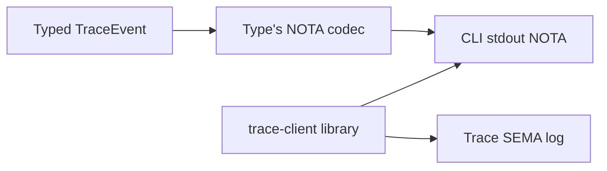

; designer
[overview synthesis tracing help-namespace nota-config-convention context-maintenance daemon-string-boundary trace-client-library spirit-1489-1501 production-orientation skill-migration]
[Orchestrator synthesis for meta-report 487. Cross-cuts sub-agent A (trace audit), B (help namespace design), C (NOTA config-by-convention design), D (context + intent maintenance). Integrates the late psyche capture Spirit 1499-1501 on trace display as NOTA and the trace-client library factoring. Names consolidated decisions for psyche ratification, the operator slice sequence, and the skill migrations the orchestrator owns. Connects back to Spirit 1486 substrate ratification.]
2026-06-03
designer

# 487.5 — Overview and synthesis

## TL;DR

Spirit 1489-1496 + 1499-1501 land cleanly on the modern reference stack with **four concrete designs ready for operator slices** and **one mid-flight psyche refinement** (trace display IS NOTA via the type's derived codec). The substrate ratified at Spirit 1486 holds; the new 2026-06-03 captures refine three surfaces (tracing, help, authored data files) and one discipline (context-and-intent maintenance) without disturbing the substrate.

Eleven consolidated decisions surface for psyche to ratify (rolled up from the per-sub-agent decision lists). Five skill migrations gate the retirement of seven older designer reports. The first operator slice for production-orientation is the smallest (~10 lines on `triad-runtime` per sub-agent A), with three subsequent slices (~480 lines schema-rust-next emission + ~80 lines `triad-runtime` + ~50 lines pilot for help; ~530 lines for NOTA config; the trace per-variant route wiring already in designer 483).

## Per-sub-agent verdict roll-up

| Sub-agent | Scope | Verdict | Decisions surfaced | Recommended operator slice |
|---|---|---|---|---|
| A (1-trace) | Trace mechanism + daemon string-boundary audit | Spirit 1489-1492 + 1495 mostly HONORED on modern stack; deployed persona-spirit does NOT honor 1495 (legacy migration arc) | 5 (eprintln removal; per-crate rule documentation; CLI helper path A/B/C; persona-spirit migration timing; schema-daemon honoring 1495 day-one) | `TraceCliSession<Event>` on `triad-runtime` (~10 lines; reduces CLI trace wiring from 5 to 2 lines) |
| B (2-help) | Help/description mirror-namespace design + demo | Design ready: `Description` as fourth schema kind; `.description.schema` per component bound to `SchemaIdentity`; `HelpRegistry` data-bearing struct emission; lazy default-generator from schema summary | 6 (file convention; default-generator algorithm; help rendering surfaces; mandatory vs optional; SymbolPath shape; Help operation auto-injection timing) | `Description` schema-kind parser + `HelpRegistry` emission for `tiny-keystore` pilot (~480 lines across schema-next, schema-rust-next, triad-runtime, pilot) |
| C (3-config) | Typed NOTA config-by-convention design + demo | Design ready: `NotaConfigConvention` schema record + `NotaConfigRegistry` data-bearing type with `load`/`register`/`from_bootstrap_file`; `RootType` as 3-variant `Struct`/`Enum`/`VectorOfRecords` | 4 (registry location; eager vs lazy; hard error vs warning on mismatch; glob syntax + overlap handling) | `nota-config-convention` crate with schema types + registry + typed error + single `skills.nota` convention + two witness tests (~530 lines) |
| D (4-maintenance) | Context + Spirit DB contradiction sweep | 7 designer reports propose for retirement gated on 5 skill migrations; 1484 clear duplicate; 1485 close-call vs 1486; 1470 working-order kept while active; 1457/1458 soft-tombstones held until Supersedes tooling | 2 Spirit-level (Remove 1484 with tombstone-first capture; 1485 keep-vs-Zero close call) + 5 orchestrator skill migrations | Orchestrator executes 5 skill migrations + Remove 1484 with psyche confirmation + operator addresses operator-lane handoff candidates (281, 282, 288, 290) |

## Cross-cutting findings — patterns that recur across reports

### Pattern 1 — Schema-carries is the unifying mechanism (Spirit 1488 ratified yesterday)

Sub-agents B and C both extend the schema-carries pattern from designer 486 + Spirit 1488. **Both new substrates (Description namespace, NotaConfig registry) are schema-emitted data-bearing types — NOT ZST namespaces.** `HelpRegistry { explicit: BTreeMap<SymbolPath, Description>, schema_summary: SchemaSummary }` and `NotaConfigRegistry { conventions: Vec<NotaConfigConvention> }` follow the same shape as the engine traits from designer 485 + Spirit 1487 (lifecycle hooks on real data-bearing types). The substrate's reusability is the load-bearing rationale — every component gets the help substrate + the config substrate from one emitter + one library, not by hand-rolling per daemon.

Sub-agent A's recommendation (Path B: `TraceCliSession<Event>` on `triad-runtime`) is the same shape — generic substrate hosting the typed CLI session method. The trace-client library Spirit 1501 names is the *concrete* form of Path B.

### Pattern 2 — Strings only at the user-facing edge, via the typed codec

Sub-agents A and B both ratify the Spirit 1490 boundary specifically and operator's parallel work (292.2) confirms code-level: trace data → typed `TraceEvent` → display via `Display` for stdout (today) or via NOTA encoder (per Spirit 1499 mid-flight refinement). Help description text → typed `Description` newtype on bracket string → rendered at CLI `(Help (Verb <name>))` reply only. The Maximum-certainty 1490 reading is uniform across the surfaces: typed everywhere; string only at the user-facing edge.

The mid-flight psyche capture **Spirit 1499 refines this concretely for tracing**: the rendered string IS NOTA text (the same text projection NOTA gives to every typed value), not a `Display`-driven stringification. Sub-agent A's current Path B sketch (`drain_to_stdout` using `Display`) should be re-shaped to call the type's derived NOTA codec — same number of lines, different encoder. This is a clean refinement, not a re-design.

### Pattern 3 — Per-symbol mirror namespace is recurring

Sub-agent B's Description namespace is keyed by `SymbolPath` (fully qualified symbol identity). Sub-agent C's NotaConfig registry is keyed by `(PathPattern, Filename)`. Both lookups operate over a global registry; both surface a `default` or `error` path when the lookup misses. The shape rhymes — both are workspace-level schema-emitted registries over named identities. The mid-flight insight from earlier chat ("the same library could host the typed Help client") is the natural composition: `HelpRegistry::for_file(path)` could answer "what shape does this file carry?" by reading the NotaConfig registry for the path and rendering the Description for the resolved root type. Composition not committed; flagged as a future synthesis.

### Pattern 4 — Daemon binary boundary holds; legacy persona-spirit lags

Sub-agent A confirms: spirit-next (modern reference stack) honors 1495 cleanly (binary rkyv configuration, no `nota_codec` imports in `src/`). Sub-agent C explicitly states the typed NOTA config-by-convention convention applies to authored files loaded by CLIs, build scripts, and bootstrap-once daemon reads — not the wire. Both reports agree: the daemon boundary is binary; the convention is a client/tool-side discipline; the legacy persona-spirit's NOTA-at-startup is a known migration arc.

## Integration of Spirit 1499-1501 (trace display as NOTA + trace-client library)

The late psyche capture during this meta-report refines the trace direction with three substantive additions that cleanly compose with sub-agent A's findings:

- **1499 Clarification High** — trace display rendering uses the typed event's derived NOTA codec, not ad hoc `Display`. Sub-agent A's `TraceCliSession::drain_to_stdout` should call the NOTA encoder. One verification needed: confirm `TraceEvent` gets NOTA codec derivation under the `testing-trace` feature scope (per operator 292.2, NOTA codec emission is currently feature-gated to CLI root types; trace types may need explicit emission addition — small schema-rust-next edit).
- **1500 Decision High** — SEMA database as an alternative client-side sink. The `trace-client` library gains a second method group (`drain_to_sema_log` alongside `drain_to_stdout`). The SEMA database itself becomes a small purpose-built store; introspect-style direction is reinforced. Pairs with operator 292.1's recommendation to supersede Spirit 1347 (which said "no separate logging daemon or external log sink"); the SEMA-log option contradicts 1347 directly.
- **1501 Decision High** — trace-client library factoring. Concrete shape for sub-agent A's Path B. Library hosts display + SEMA-log + listener + frame decode. The CLI is a thin wrapper. Library location open — three candidates per the prior chat: (a) inside `triad-runtime` (already trace-transport home, designer lean); (b) new dedicated `trace-client` crate; (c) workspace-level `signal-trace` crate (treats trace as first-class signal-tier interface, aligning with 1492 "trace is its own schema-defined interface").

## Consolidated decisions for psyche ratification

Numbered for citation; magnitudes from the originating sub-agent.

1. **(A.1) Remove daemon-side `eprintln!` fallback at `triad-runtime/src/trace.rs:176`?** Strict 1490 reading prefers silent swallow; operator 291 accepted it as observability fallback. Designer lean: keep (observability is part of the trace mechanism's own observability; the strict reading is also valid).
2. **(A.2) Document per-crate trace enablement rule explicitly in `skills/component-triad.md`?** Yes (the rule is currently implicit in `testing-trace` Cargo feature usage; should be named).
3. **(A.3) Choose path for generic CLI-side trace: A (schema-rust-next emitter mixin) vs B (`triad-runtime` helper, sub-agent A recommended) vs C (status quo)?** Designer lean: B + the Spirit 1501 library factoring. Combined recommendation = land library at `triad-runtime` first; promote to dedicated `signal-trace` crate if/when trace becomes its own contracted signal channel.
4. **(A.4) Schedule `persona-spirit` migration to 1495-honoring shape, or defer to wider re-platform?** Designer lean: defer to wider re-platform; spirit-next is the production target.
5. **(A.5) Require schema-daemon pilot (designer 481) to honor 1495 from day one when its binary lands?** Designer lean: yes.
6. **(B.1) Description schema location — `.description.schema` sibling file (sub-agent B leans here) vs same-file separate section vs separate `.description.schema` per declared kind?** Sub-agent B's lean: sibling file bound to same `SchemaIdentity`.
7. **(B.2) Default-generator algorithm — humanization rules + eager vs lazy?** Sub-agent B's lean: lazy at lookup time; humanization rules per their §6.
8. **(B.3) Help-rendering surfaces — CLI `(Help (Verb))` only vs HTML site too?** Sub-agent B's lean: CLI first; HTML deferred.
9. **(C.1-C.4) NOTA config registry location, eager vs lazy, error vs warning, glob syntax** — sub-agent C designer leans: schema-emitted from per-component schemas + workspace-root file for workspace-only conventions; eager static for production + lazy for dev; hard-error per closed-world; shell-style glob with overlap-error at registry-validation.
10. **(D.1) Remove Spirit 1484 (6-second restatement of 1483)?** Designer lean: yes after tombstone-first capture (clear duplicate).
11. **(D.2) Spirit 1485 keep vs `ChangeCertainty Zero` vs Remove?** Designer flag: close call between original-ratification-plus-refinement (keep) and canonical-supersedes-precursor (Zero). Psyche call.

Two additional Spirit supersession items operator 292.1 flagged that this meta-report endorses:

12. **(operator 292.1) Spirit 1347 supersession** — the "CLI is the log surface and no separate logging daemon or external log sink" wording is contradicted by 1500 + introspect direction; recommend asking the psyche for explicit supersession or narrowing.

## Operator slice sequence

The smallest meaningful slices in dependency-friendly order:

1. **`TraceCliSession<Event>` on `triad-runtime`** (sub-agent A; ~10 lines) — unblocks Path B; reduces CLI trace wiring; integrates Spirit 1501 library factoring as the first move.
2. **Refine `TraceCliSession::drain_to_stdout` to use derived NOTA codec** (Spirit 1499 integration; small follow-up edit; possibly bundled with slice 1).
3. **`Description` schema-kind + `HelpRegistry` emission for `tiny-keystore` pilot** (sub-agent B; ~480 lines across schema-next + schema-rust-next + triad-runtime + pilot).
4. **`nota-config-convention` crate** (sub-agent C; ~530 lines).
5. **`TraceSemaLog` method on the trace-client library** (Spirit 1500; small per-component SEMA store) — depends on slice 1.
6. **Per-variant interface-route trace identity** (designer 483 §Q4b; ~1 line per method in schema-rust-next emitter).
7. **Auto-injection of Help operation into signal-channel macro** (sub-agent B second slice + Spirit 263); depends on slice 3.
8. **`persona-spirit` migration to 1495-honoring shape** (sub-agent A.4; deferred; separate version-handover arc).

## Skill migrations the orchestrator owns (gating seven designer-report retirements)

Sub-agent D identified five skill migrations that gate the retirement of seven older designer reports. The orchestrator (main designer) executes these:

1. **`skills/nota-design.md` Rule 4** — inline enum payload + sugar (substance from designer 479 + operator 290). Gates retirement of designer 479.
2. **`skills/component-triad.md` §"Engine mechanism substrate"** — psyche report 1 firm parts (substance from designer 482). Gates retirement of designer 482, 476, 477, 478.
3. **`skills/component-triad.md` §"Lifecycle hooks"** — `on_start`/`on_stop` minimal lifecycle (substance from designer 485 + Spirit 1487). Gates retirement of designer 485.
4. **`skills/component-triad.md` §"Schema source carries"** — schema-carries engine-mechanism baseline (substance from designer 486 + Spirit 1488). Gates retirement of designer 486.
5. **`skills/actor-systems.md` §"Hidden-non-actor-owner anti-pattern"** — closes the design 485 §"Hidden non-actor owner" antipattern. Gates retirement of designer 480, 483.

Once these land, the designer reports drop. Sub-agent D's report 4 §3 carries the per-report retirement table for execution.

## Connection back to Spirit 1486 substrate and 484 meta-report

Spirit 1486 ratified designer 482's substrate as workspace-canonical engine mechanism. The 487 meta-report's findings cleanly extend that substrate to three new surfaces (tracing, help, authored config) and one discipline (intent maintenance):

- Engine mechanism + lifecycle hooks (484 + 485 + 486 + 1486-1488) is the SUBSTRATE.
- Trace as schema-emitted interface (1489-1492 + 1499-1501 + 487.1 sub-agent A audit) extends substrate with the observability interface.
- Help as mirror description namespace (1493 + 487.2 sub-agent B design) extends substrate with the discoverability interface.
- NOTA config-by-convention (1494 + 487.3 sub-agent C design) extends substrate with the authored-data interface.
- Context + intent maintenance discipline (1496 + 487.4 sub-agent D sweep) is the meta-discipline that keeps the substrate-and-extensions surface clean.

No substrate decisions are revisited; the 487 meta-report ratifies-by-extension rather than replaces. The 484 meta-report's operator slice sequence (5 slices toward first production proof) still holds; the 487 operator slice sequence is sequenced *alongside* 484's, with 487 slice 1 (TraceCliSession) likely being the cheapest first move.

## Cross-references

- `reports/designer/487-Design-trace-help-config-context-meta-2026-06-03/0-frame-and-method.md` — this meta-report's frame.
- `reports/designer/487-Design-trace-help-config-context-meta-2026-06-03/1-trace-and-daemon-boundary-audit.md` — sub-agent A (trace audit; 823 lines).
- `reports/designer/487-Design-trace-help-config-context-meta-2026-06-03/2-help-namespace-design.md` — sub-agent B (help/description namespace; 912 lines).
- `reports/designer/487-Design-trace-help-config-context-meta-2026-06-03/3-nota-config-convention-design.md` — sub-agent C (NOTA config convention; 780 lines).
- `reports/designer/487-Design-trace-help-config-context-meta-2026-06-03/4-context-and-intent-maintenance.md` — sub-agent D (context + intent maintenance; 698 lines).
- `reports/operator/291-tracing-mechanism-audit-and-polish-2026-06-03.md` — operator's tracing mechanism audit + polish; baseline for sub-agent A.
- `reports/operator/292-client-trace-genericization-2026-06-03/` — operator's parallel meta-report on client trace genericization + context-maintenance + Spirit supersession; overlaps with sub-agents A + D, integrates here.
- `reports/designer/484-Audit-production-readiness-meta-2026-06-02/6-overview.md` — prior production-readiness synthesis; this overview extends.
- `reports/designer/482-Psyche-engine-mechanism-fundamental-decision-2026-06-02.md` — substrate decision (Spirit 1486 Maximum).
- Spirit records: 1486 (substrate ratification Maximum), 1487-1488 (lifecycle + schema-carries High), 1489-1496 (the captured threads driving 487), 1499-1501 (mid-flight trace display = NOTA + SEMA-log + library refinement).
