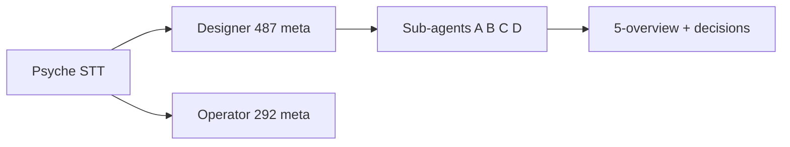
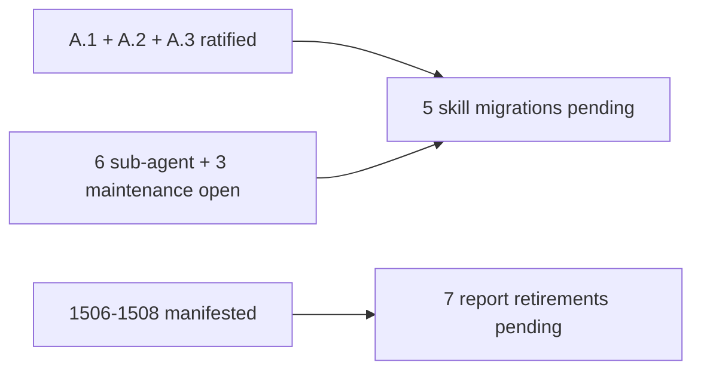

; designer
[psyche-report 487-overview decisions context tracing help-namespace nota-config context-maintenance daemon-string-boundary symbol-path nota-typed-text-ui spirit-1489-1511]
[Psyche report for the psyche to read directly — full context, full decisions, full forward path for meta-report 487. Unpacks the terse codes (A.1, B.2, etc.) in 487's 5-overview into the psyche's reading frame. Lists ratifications made so far and the remaining decisions in plain language. Self-contained; the psyche should not need to open the four sub-reports to engage with the decisions.]
2026-06-03
designer

# 488 — Psyche report: 487 meta-report context and decisions

## 1. What this report is

You asked for context on the questions in 487's 5-overview. This report unpacks all of 487 in plain language — what the four sub-agents found, what each decision means, which decisions you have already ratified (Spirit 1505 + 1509-1511 from your recent messages), and which decisions remain open. Self-contained: you should not need to open the four sub-reports to engage.

Terse shorthand decoded:

- **"Sub-agent A"** — the parallel agent assigned the trace mechanism + daemon string-boundary audit. The report it produced is `reports/designer/487-Design-trace-help-config-context-meta-2026-06-03/1-trace-and-daemon-boundary-audit.md`.
- **"Sub-agent B"** — help / description namespace design (file `2-help-namespace-design.md`).
- **"Sub-agent C"** — typed NOTA config-by-convention design (file `3-nota-config-convention-design.md`).
- **"Sub-agent D"** — context + intent maintenance sweep (file `4-context-and-intent-maintenance.md`).
- **"A.3"** etc. — sub-agent A's third surfaced decision; the letter is the sub-agent, the number is the decision's position within that sub-agent's report.

## 2. The setup — your STT, the dispatch, the parallel operator

The 2026-06-03 STT directive ("go write all this wisdom out into intent and architecture files and implement as far as you can. And use subagents, create reports … both designer and operator … audit basically his implementation … keep your branches clean … everybody should do some context maintenance with a subagent") arrived after operator 291 ratified the current tracing mechanism.

The intent in the STT itself was captured by operator at Spirit 1489-1496 (eight discrete intent statements covering: trace as schema-defined interface with closed enums; typed data until client display; no trace-on-trace + per-crate enablement; daemon NOTA-free; help/description as schema mirror namespace; typed NOTA files by path convention; context-maintenance can audit old intent for contradictions). The designer's reading of the prompt confirmed all eight were covered; no gap-fill needed.

The designer dispatched four sub-agents in parallel; the operator separately dispatched their own 292 meta-report on the same psyche directive — designer audits operator, both reach back to you.

## 3. Sub-agent A — trace mechanism + daemon string-boundary audit

**What it asked.** Does the current trace mechanism honor the new intent (Spirit 1489-1492 + 1495) — typed schema-defined interface, typed until client display, per-crate enablement, daemon free of NOTA and strings?

**What it found.** The modern reference stack (`spirit-next` + `triad-runtime` + `schema-rust-next` emission) MOSTLY honors the new intent. Three of the four Spirit captures are fully honored; one has a single narrow exception (a daemon-side `eprintln!` at `triad-runtime/src/trace.rs:176` for trace-mechanism error fallback); one is honored on the modern stack but the deployed legacy `persona-spirit` daemon does NOT honor (legacy migration arc).

**The open question** is whether the CLI's per-component trace adapter (the ~5 lines of CLI wiring that exist hand-written in each component's CLI today) should be made generic. Sub-agent A proposes three paths and leans toward Path B (a helper on `triad-runtime`, `TraceCliSession<Event>`, ~10 lines).

**Sub-agent A's surfaced decisions (with your ratifications and remaining items):**

- **A.1 — Remove the daemon-side `eprintln!` fallback?** ✅ **You ratified at Spirit 1509 (Constraint Maximum, just now)** + Spirit 1505 (Correction High, earlier today): *"There's no daemon-side printline. There shouldn't be. We observe through our own tracing and logging mechanism."* This becomes operator slice 0.
- **A.2 — Document the per-crate trace enablement rule explicitly in `skills/component-triad.md`?** ✅ **You ratified at Spirit 1510 (Decision High, just now)**: *"Yep."* The rule is currently implicit in the `testing-trace` Cargo feature; it needs to be named in the discipline file.
- **A.3 — Choose path for the generic CLI-side trace: Path A (schema-rust-next emitter mixin) vs Path B (triad-runtime helper) vs Path C (status quo)?** ✅ **You ratified Path B at Spirit 1511 (Decision High, just now)**: *"I would go with the triad runtime helper."* Path B composes cleanly with Spirit 1503 (operator-captured Principle High): the trace-client library lives in `triad-runtime` initially, with display + SEMA-log methods on `TraceClient<Event>`. The CLI is a thin wrapper.
- **A.4 — Schedule `persona-spirit` migration to the 1495-honoring shape now, or defer to wider re-platform?** OPEN. Designer lean: defer; spirit-next is the production target.
- **A.5 — Require the schema-daemon pilot (designer 481) to honor 1495 from day one when its binary lands?** OPEN. Designer lean: yes.

## 4. Sub-agent B — help / description namespace design

**What it asked.** What concrete shape does Spirit 1493 take — *"help and documentation should be schema data in a mirror description namespace over the global symbol namespace, with generated defaults when no explicit description exists for a fully qualified symbol"*?

**What it proposes.** A fourth schema kind, `Description`, that mirrors the global schema namespace. One `.description.schema` file per component, bound to the same `SchemaIdentity` as the working schema. Schema-rust-next emits a data-bearing struct per component, `HelpRegistry { explicit: BTreeMap<SymbolPath, Description>, schema_summary: SchemaSummary }`, that knows both explicit descriptions and the schema summary needed by the default generator. When a symbol has no explicit `Description` entry, a lazy generator builds humanized text from the symbol path's terminal segment. `(Help Main)` and `(Help (Verb <name>))` operations render the typed `Description` through the CLI at the user-facing edge.

Worked demo in the sub-report uses a fictional `tiny-keystore` component end-to-end.

**Cross-cut with your latest clarification (Spirit 1506-1507):** sub-agent B's `SymbolPath` IS the canonical workspace-wide fully-qualified-symbol-path mechanism, not a per-design name. The help namespace is one client of that mechanism; trace identity, NOTA config registry, and future surfaces are other clients of the same mechanism. The designer has manifested this into `ESSENCE.md` ("Symbols are paths through the schema namespace") and `INTENT.md`.

**Sub-agent B's surfaced decisions (all OPEN — yours to choose):**

- **B.1 — Where does the `Description` schema live?** Options: (a) sibling `.description.schema` file alongside the working schema (sub-agent B's lean); (b) same file, separate section; (c) a separate `.description.schema` per declared kind.
- **B.2 — Default-generator algorithm.** Six-branch humanization (variant name → humanized; field → field-type-derived; etc.). Eager (compile-time emission) vs lazy (lookup-time) generation — sub-agent B leans lazy.
- **B.3 — Help-rendering surfaces.** CLI `(Help (Verb))` only first vs HTML documentation site too — sub-agent B leans CLI-first; HTML deferred.
- **B.4 — Mandatory vs optional per component.** Sub-agent B leans optional initially (so a component can ship without a `.description.schema` and Help still works via pure-generated defaults).
- **B.5 — `SymbolPath` shape.** Five-segment structured path (crate / module / kind / parent / leaf). Per Spirit 1507's "canonical not per-design" framing, this becomes the workspace-wide identity shape.
- **B.6 — Help operation auto-injection timing.** First slice is `Description` + `HelpRegistry` for `tiny-keystore` pilot only; auto-injection of `Help` into `signal-channel!` macro is the second slice after pilot ratification.

## 5. Sub-agent C — typed NOTA config-by-convention design

**What it asked.** What concrete shape does Spirit 1494 take — *"authored workspace data files should prefer typed NOTA data: predictable file names and directories define the expected root type"*?

**What it proposes.** A `NotaConfigConvention` schema record mapping `(PathPattern, Filename, RootType)` triples to fully qualified types, plus a `NotaConfigRegistry` data-bearing type with `load`, `register`, and `from_bootstrap_file` methods. `RootType` is a three-variant enum (`Struct` / `Enum` / `VectorOfRecords`) per your *"almost always start with a struct, sometimes top-level enum"* phrasing. Glob filename patterns handle homogeneous directories like `intent/*.nota`. Hard error on mismatch per the closed-world discipline.

Worked demo uses `skills/skills.nota` end-to-end: current file shape; the `SkillEntry` schema; the convention entry; the generated `load_skills` method; the closed-world failure mode when a file's first token mismatches the declared `Category` enum variants.

**Sub-agent C's surfaced decisions (all OPEN):**

- **C.1 — Where does the convention registry live?** Schema-emitted from per-component schemas (designer lean) vs workspace-root file vs per-repo file vs hybrid.
- **C.2 — Eager (compile-time static) vs lazy (start-up file-read) discovery?** Designer lean: eager for production, lazy for dev iteration.
- **C.3 — Hard error vs warning on mismatch?** Designer lean: hard error per closed-world discipline.
- **C.4 — Glob syntax and overlap handling.** Designer lean: shell-style; overlapping conventions error at registry-validation.

## 6. Sub-agent D — context + intent maintenance sweep

**What it asked.** Per Spirit 1496, audit older reports + Spirit records for things contradicted by the recent stronger intent.

**What it found.** Seven older designer reports propose for retirement (476, 479, 480, 482, 483, 485, 486) GATED on five named skill migrations. Spirit 1484 is a 6-second restatement of 1483 — recommend Remove with tombstone-first. Spirit 1485 (Decision High) is a 1-minute-earlier framing of 1486 (Decision Maximum) — close call between keep (original-plus-refinement) and ChangeCertainty Zero (canonical-supersedes-precursor); psyche call.

**The five gating skill migrations the orchestrator (main designer) owns:**

1. `skills/nota-design.md` Rule 4 — inline enum payload + sugar (from designer 479 + operator 290).
2. `skills/component-triad.md` §"Engine mechanism substrate" — psyche report 1 firm parts (from designer 482, ratified at Spirit 1486 Maximum).
3. `skills/component-triad.md` §"Lifecycle hooks" — `on_start`/`on_stop` (from designer 485, ratified at Spirit 1487).
4. `skills/component-triad.md` §"Schema source carries" — schema-carries baseline (from designer 486, ratified at Spirit 1488).
5. `skills/actor-systems.md` §"Hidden-non-actor-owner anti-pattern" — from designer 485.

**Plus operator 292.1's flagged candidate:** Spirit 1347 (*"CLI is the log surface and no separate logging daemon or external log sink"*) is contradicted by Spirit 1500 (operator-captured Decision High: SEMA-log as alternative client sink) and by introspect direction. Recommend asking for explicit supersession.

**Important Correction from you at Spirit 1504 (Correction Maximum):** *"Context maintenance means repairing the existing context surface: audit the skill for clarity and rewrite or edit stale reports so they no longer preserve old or misleading examples as live guidance. Adding a new report without correcting stale reports is not sufficient."* Sub-agent D surveyed; the orchestrator's job is to EXECUTE the migrations + report edits/retirements now, not to defer. This is the designer's active next pass.

**Sub-agent D's surfaced decisions (OPEN):**

- **D.1 — Remove Spirit 1484?** Designer lean: yes after tombstone-first capture.
- **D.2 — Spirit 1485 keep vs ChangeCertainty Zero vs Remove?** Close call, psyche call.
- **D.3 (via operator 292.1) — Supersede Spirit 1347?** Designer lean: yes (narrow or replace per how SEMA-log direction firms up).

## 7. Cross-cutting findings — patterns recurring across the sub-reports

Three patterns recur across all four sub-reports and tie directly to your recent clarifications:

**(i) Schema-carries is the unifying mechanism.** Spirit 1488 ratified yesterday names schema source as the substrate carrier; sub-agents B and C both extend this — both new substrates (Description namespace, NotaConfig registry) are schema-emitted data-bearing types. Sub-agent A's Path B (trace helper on triad-runtime) is the same shape — generic substrate hosting the typed client method.

**(ii) Strings only at the user-facing edge.** Sub-agents A and B confirm Spirit 1490 (Maximum) is honored across the modern stack. With your Spirit 1499 + 1502 clarification — trace display IS NOTA via the type's derived codec, not ad hoc `Display` formatting — the boundary is even sharper: typed → NOTA text. The same applies to `Description`: typed Description on the wire/in storage; NOTA-rendered at CLI display. Sub-agent A's `TraceCliSession::drain_to_stdout` should call the type's derived NOTA encoder, not `Display`.

**(iii) Per-symbol mirror namespace recurs.** Sub-agent B's Description is keyed by `SymbolPath`. Sub-agent C's NotaConfig registry is keyed by `(PathPattern, Filename)`. Both lookups operate over a workspace-level registry; both have a default path or hard-error path on miss. Your Spirit 1506-1507 (canonical SymbolPath) names these as expressions of one underlying mechanism — they're not separate inventions; they share the workspace's symbol-identity space.

## 8. Integration with your Spirit 1499-1511 (the mid-flight refinements)

These captures landed during the meta-report's lifetime and refine direction:

| Record | Kind | Substance | Effect on 487 |
|---|---|---|---|
| 1499 | Clarification High | Trace display via type's derived NOTA codec | Sub-agent A's Path B sketch swaps encoder (same line count) |
| 1500 | Decision High | SEMA-log as alternative client sink | Adds `drain_to_sema_log` method on trace-client library; reinforces 1347 supersession |
| 1501 | Decision High | Trace-client library in the repo; CLI is thin wrapper | Concrete shape for Path B |
| 1502 | Correction Maximum (operator-captured) | Trace render as NOTA, not strings | Strengthens 1499 framing |
| 1503 | Principle High (operator-captured) | Trace-client library hosts display + SEMA-log; thin CLI | Combines 1500 + 1501 into one cleaner statement |
| 1504 | Correction Maximum (operator-captured) | Context-maintenance must EDIT stale reports, not just add new | Orchestrator executes migrations + edits/retirements now |
| 1505 | Correction High (operator-captured) | Remove eprintln (strict 1490) | Becomes operator slice 0 |
| 1506 | Clarification Maximum | SymbolPath as canonical workspace-wide identity | Manifested into ESSENCE.md + INTENT.md |
| 1507 | Principle High | Highlight SymbolPath in architecture and intent files | Same manifestation pass |
| 1508 | Clarification Maximum | NOTA as typed text user interface, data-type-theory grounded | Manifested into ESSENCE.md + INTENT.md |
| 1509 | Constraint Maximum (just now) | No daemon-side printline ever | Elevates 1505; binding rule |
| 1510 | Decision High (just now) | Document per-crate trace enablement rule | Ratifies A.2 |
| 1511 | Decision High (just now) | Path B (triad-runtime helper) for generic CLI-side trace | Ratifies A.3 |

## 9. The consolidated decisions — what's been ratified and what's open

**Ratified so far (by you):**

| Decision | Ratification | Resulting action |
|---|---|---|
| A.1 — Remove eprintln | Spirit 1505 + 1509 (Constraint Maximum) | Operator slice 0 |
| A.2 — Document per-crate trace enablement | Spirit 1510 (Decision High) | Skill migration into `skills/component-triad.md` |
| A.3 — Path B (triad-runtime helper) | Spirit 1511 (Decision High) | Operator slice 1: `TraceCliSession<Event>` on triad-runtime |

**Open, awaiting your decision (ten items):**

1. **A.4** — Schedule persona-spirit migration to 1495 shape, or defer to wider re-platform?
2. **A.5** — Require the schema-daemon pilot to honor 1495 day one?
3. **B.1** — Description schema location (sibling file recommended)?
4. **B.2** — Default-generator algorithm (six-branch humanization, lazy)?
5. **B.3** — Help-rendering surfaces (CLI first, HTML deferred)?
6. **B.4** — Description mandatory vs optional per component (optional recommended)?
7. **B.5** — SymbolPath shape (five-segment structured path)?
8. **B.6** — Help auto-injection timing (after `tiny-keystore` pilot)?
9. **C.1-C.4** — NOTA config registry location / eager vs lazy / hard error / glob syntax (designer leans named in §5)?
10. **D.1 + D.2 + D.3** — Spirit 1484 Remove (designer lean: yes); Spirit 1485 keep vs Zero (close call); Spirit 1347 supersession (designer lean: yes)?

## 10. The forward path (what designer and operator do next)

Given your ratifications + the Correction 1504 that demands repair-not-survey, the active next work splits into three streams:

**Stream 1 — Operator implementation slices:**

- Slice 0: Remove `eprintln!` at `triad-runtime/src/trace.rs:176`; replace with silent swallow (the fallible typed `record_result` API remains available for tests that want to assert delivery). Tiny.
- Slice 1: `TraceCliSession<Event>` on `triad-runtime` (~10 lines). Reduces CLI trace wiring from 5 lines to 2.
- Slice 2: Refine `drain_to_stdout` to use the type's derived NOTA codec rather than `Display` (per Spirit 1499 + 1502). Small follow-up.
- Slice 3: `drain_to_sema_log` method on the trace-client library (per Spirit 1500); per-component SEMA store design. Depends on slice 1.

(Sub-agent B/C slices remain in queue pending your ratification of B.1-B.6 and C.1-C.4.)

**Stream 2 — Designer skill migrations (orchestrator-owned per Spirit 1504):**

1. `skills/nota-design.md` Rule 4 — inline enum payload + sugar.
2. `skills/component-triad.md` §"Engine mechanism substrate".
3. `skills/component-triad.md` §"Lifecycle hooks".
4. `skills/component-triad.md` §"Schema source carries".
5. `skills/actor-systems.md` §"Hidden-non-actor-owner anti-pattern".

Plus: edit `skills/component-triad.md` §"Help operations" to add the per-crate trace enablement rule per Spirit 1510.

**Stream 3 — Stale report retirement after migration lands:**

7 designer reports retire (delete via `rm`) after their gating skill migration confirms: 476, 479, 480, 482, 483, 485, 486. Per sub-agent D's §3 retirement table.

## 11. Two questions surfaced for your direct attention

These two need a direct word from you (the rest can ride on designer leans):

- **Sub-agent C's question on registry location (C.1).** Is the NotaConfig registry schema-emitted-from-per-component-schemas, or a workspace-root file, or both? The designer lean is "both: per-component conventions schema-emitted from each component's schema, plus a workspace-root file for workspace-only conventions like `skills/skills.nota`". You may want to weigh in on whether `skills/skills.nota` is workspace-level (lean answer) or belongs to a hypothetical workspace-meta-component.

- **Sub-agent D's question on Spirit 1485 (D.2).** Spirit 1485 (Decision High) was a 1-minute-earlier framing of 1486 (Decision Maximum) — the same substrate ratification, weaker phrasing. Two readings: (a) keep both as evidence of how the ratification firmed up; (b) zero 1485 as superseded-precursor. Designer's lean is (a) — Spirit's append-only history is itself documentation — but psyche supersession is your call regardless.

## 12. Cross-references

- `reports/designer/487-Design-trace-help-config-context-meta-2026-06-03/0-frame-and-method.md` — meta-report frame.
- `reports/designer/487-Design-trace-help-config-context-meta-2026-06-03/1-trace-and-daemon-boundary-audit.md` — sub-agent A (599-823 lines per final commit).
- `reports/designer/487-Design-trace-help-config-context-meta-2026-06-03/2-help-namespace-design.md` — sub-agent B (978 lines).
- `reports/designer/487-Design-trace-help-config-context-meta-2026-06-03/3-nota-config-convention-design.md` — sub-agent C (780 lines).
- `reports/designer/487-Design-trace-help-config-context-meta-2026-06-03/4-context-and-intent-maintenance.md` — sub-agent D (698 lines).
- `reports/designer/487-Design-trace-help-config-context-meta-2026-06-03/5-overview.md` — orchestrator's terse synthesis (this Psyche report's source).
- `reports/operator/291-tracing-mechanism-audit-and-polish-2026-06-03.md` — operator's tracing audit + polish; sub-agent A's baseline.
- `reports/operator/292-client-trace-genericization-2026-06-03/` — operator's parallel meta-report (context maintenance + client-trace audit + 3-overview).
- `ESSENCE.md` §"Strings only at the edges", §"NOTA is a typed text user interface", §"Symbols are paths through the schema namespace" — workspace-essence manifestation of Spirit 1490+1492+1495 and 1506-1508.
- `INTENT.md` §"NOTA is a typed text user interface", §"Symbols are paths through the schema namespace", §"Tracing is its own typed schema-defined interface", §"Help and documentation are schema data", §"Authored data files prefer typed NOTA" — workspace-prose manifestation.
- Spirit records 1486 (substrate ratification Maximum) + 1487-1488 (lifecycle + schema-carries) + 1489-1496 (the captured threads driving 487) + 1499-1511 (mid-flight refinements + your ratifications + operator-captured corrections).
