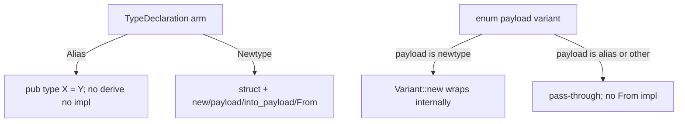

# Slice 3 — schema-rust-next Rust emission

The repo is `/git/github.com/LiGoldragon/schema-rust-next`. The whole
emission lives in two files: `src/lib.rs` (2687 lines) and
`src/migration.rs` (545 lines). The design is sound and the landed
mechanisms are correct against intent. The findings are concentrated:
one high-value structural bad pattern in the emission core, three
duplicated recursive walks, and a real constraint-witness gap on the
alias path that record 1565 specifically targets.

Baseline: `cargo test` is fully green — 22 + 6 + the big/cross-crate
suites pass.

## What is landed and correct

The audit confirms the operator's landed mechanisms hold against
[a bare binding lowers to a type alias; genuine single-field struct
bodies remain newtypes with new/payload/into_payload/From<Payload>;
enum constructors do not wrap aliases as newtypes] (record 1560) and
[handwritten and generated spirit code avoids nested alias wrapper
construction] (record 1561).

### Alias-vs-newtype emission is exactly right

`RustTypeDeclaration` (`src/lib.rs:385`) is a four-arm sum —
`Alias`, `Struct`, `Enum`, `Newtype` — projected one-to-one from
`schema_next::TypeDeclaration`. The two shapes diverge precisely where
intent says they should:

An alias emits a bare `type` line with **no** derive, **no** inherent
impl (`emit_alias`, `src/lib.rs:920`):

```rust
fn emit_alias(&mut self, visibility: Visibility, declaration: &RustAlias) {
    self.line(format!(
        "{} type {} = {};",
        self.rust_visibility(visibility),
        declaration.name(),
        self.rust_type(declaration.reference())
    ));
}
```

A newtype emits the data type plus the full ergonomic impl
(`emit_newtype_inherent_impl`, `src/lib.rs:955`) — `new`, `payload`,
`into_payload`, and `From<Payload>`. The
`triad-reactive-large.generated.rs` fixture witnesses both arms of
record 1560 in one file: `pub type Rejected = RejectionReason;`
(`:99`, the bare-binding-to-a-declared-type case, the exact
`Rejected SignalRejection` shape from intent) sits beside genuine
newtypes that carry their inherent impls.

### Enum constructors carry the alias payload directly (1561)

`emit_enum_variant_constructors_for` (`src/lib.rs:1111`) emits a
variant-named associated constructor for every payload variant.
`enum_variant_constructor_payload` (`src/lib.rs:1149`) is where the
alias-vs-newtype distinction lands at the constructor:

```rust
TypeReference::Plain(name) => newtypes
    .iter()
    .find(|newtype| newtype.name() == name)
    .map(|newtype| {
        EnumConstructorPayload::new(
            self.rust_type(newtype.reference()),
            format!("{}::new(payload)", newtype.name()),
        )
    })
    .unwrap_or_else(|| {
        EnumConstructorPayload::new(self.rust_type(payload), "payload".to_owned())
    }),
```

A newtype payload gets `Variant::new(payload)` (the wrapper built
internally); everything else — aliases included, because an alias name
never appears in the `newtypes` list — falls through to the
pass-through `"payload"` expression. The generated witness is exactly
the intent shape (`triad-reactive-large.generated.rs:429`):

```rust
pub fn rejected(payload: Rejected) -> Self {
    Self::Rejected(payload)
}
```

No `Rejected::new(...)`, because `Rejected` is an alias with no
distinct Rust identity. This dissolves the 1557 wrapper-nesting at the
construction site: a caller writes `Output::rejected(reason)`, never
`Output::Rejected(Rejected(reason))`.

### Alias payloads get no From impl (1560 / commit a789a85)

`emit_enum_payload_from_impls_for` (`src/lib.rs:1065`) iterates only
`unique_non_alias_plain_payload_variants` (`src/lib.rs:1192`), which
filters out any variant whose plain payload name is in the alias set.
The witness is the **absence** of `impl From<Rejected> for Output` and
`impl From<RejectionReason> for Output` in the triad fixture — verified
by listing every `impl From` line in that file (none target the alias
or its target). A `From` impl for an alias would be a coherence-broken
or redundant conversion; the emitter correctly skips it.

### Wrapper-repetition elimination is the generated constructor (1557)

[Repeated nested variant-wrapper construction signals bad design or a
missing logic/emission layer] (record 1557) is answered directly: the
generated `Output::rejected(...)` / `Input::record(...)` associated
constructors ARE the emission layer that lets callers avoid the
`Output::Rejected(Rejected(SignalRejection))` triple nesting. This is
landed and witnessed (`tests/emission.rs:151-152`).

### Keyword-safe constructors are preserved

`rust_method_name` (`src/lib.rs:2613`) lowers a variant name to a
method name and guards it through `RustKeyword::is_reserved`
(`src/lib.rs:2632`), which includes `"continue"`. A `Continue` variant
emits `pub fn r#continue(...)`. `RustKeyword` is a borrow-newtype
(`{ name: &'name str }`), not a ZST namespace, so it satisfies the
methods-on-a-real-noun rule. This is the [5-variant NexusAction with
Continue] (record 1486) keyword case, handled.

## Gaps — design present in intent, missing or incomplete in code

The gaps here are all record 1565 — [audit implementation against
intent for missing constraint witnesses; add tests that prove the
intended path instead of leaving intent as prose]. The mechanisms are
correct; what is missing is a **named** test that pins each rule, so a
future regeneration cannot silently break it.

### Gap 3.1 — No named witness that an alias payload variant gets no From impl

`DONE`-mechanism but `RATIFIED-PORTABLE` test gap. The only thing
proving "an alias-payload variant carries the alias target directly and
gets no `From` impl" is the whole-file byte snapshot
`assert_matches_checked_in_rust` (`tests/big_emission.rs:199`). That
snapshot is regenerable by setting `SCHEMA_RUST_NEXT_UPDATE_BIG_EXAMPLES`
(`:201`), so a behavior change to the alias path would be absorbed into
a "fixture update" with no test failing on the *semantics*. Record 1565
wants the intended path proven by a witness, not left to a snapshot
diff. Concrete tier-2 witness in the port-proposals section.

### Gap 3.2 — The alias-payload (triad) fixture is never compiled

`tests/big_emission.rs:14` `include!`s only
`spirit-reactive-large.generated.rs`. The `triad-reactive-large` and
`imported-mail-consumer` fixtures are compared as **text** but never
fed to rustc, so the alias-payload `Output::Rejected(Rejected)` shape —
the canonical 1560/1561 case — is never type-checked. The spirit
fixture that IS compiled has only newtype/struct payloads on its output
(`Rejected(Rejection)` there is a newtype, not an alias). So the
alias-payload path has zero compile coverage. Tier-2 proposal: add an
`#[allow(dead_code)] mod triad_generated { include!(...) }` and one
constructor-call test (`Output::rejected(reason)`), mirroring the
existing `spirit_large_generated` harness.

### Gap 3.3 — ARCHITECTURE states "Aliases emit no inherent impls" with no direct witness

`ARCHITECTURE.md:110` states [Aliases emit no inherent impls because
they have no distinct Rust type identity]. No test asserts the negative
("the emitted source contains no `impl Topic {`"). The
`emitter_builds_rust_module_data_before_rendering_text` test
(`tests/emission.rs:118`) asserts `Topic` is `RustTypeDeclaration::Alias`
at the data layer but never checks the *rendered* absence of an impl.
Cheap tier-2 negative witness proposed below.

## Bad patterns — the abstraction hunt

This is the section the psyche flagged as the highest-value target:
emission code is the most repetition-prone code, and `RustWriter` is
2000 lines of it.

### Bad pattern 3.A (highest value) — 504 `self.line(...)` calls: the missing RustItem token model

`RustWriter` (`src/lib.rs:704`) is a `String` accumulator with one
primitive, `line(...)`, called **504 times** across the file, almost
always as `self.line(format!("..."))` emitting one physical line of
Rust source. Every generated impl block, trait, match arm, and brace is
hand-spelled as a format string. The shape that recurs dozens of times:

```rust
self.line(format!("impl {name} {{"));
self.line(format!("    pub fn new(payload: {payload_type}) -> Self {{"));
self.line("        Self(payload)");
self.line("    }");
// ... and 500 more lines like this
```

INTENT.md:238 already states the right direction —
[Rust emission is data before it is text. The emitter maps Asschema
into a typed RustModule object ... rendering RustModule produces
RustCode]. The *declaration* layer honors this (`RustModule`,
`RustDeclaration`, `RustEnum` are real data). But the **support/impl
layer** — every trait, every `From` impl, every signal-frame method,
every projection match — is rendered by direct string templating with
no intermediate data model. The data-before-text discipline stops at
the type declarations and never reaches the 80% of output that is impls.

The missing abstraction is a small `RustItem` / `RustImplBlock` /
`RustMatch` token model the writer renders once. Manual indentation
(`"    "`, `"        "`, `"            "` literally counted out by hand
across the file) is the clearest symptom: a `RustWriter` that owned an
indentation depth and emitted structured items would make the four-space
miscounts impossible and collapse the per-line `format!` soup. This is a
tier-3 operator refactor (production emission-engine code), proposed as a
gap below, not a portable-now change.

### Bad pattern 3.B — `route()` emission duplicated verbatim across two methods

`emit_route_impl` (`src/lib.rs:1366`) and `emit_signal_frame_impl`
(`src/lib.rs:1390-1410`) emit a byte-identical `pub fn route(&self)`
match. The plane-route enums and the signal-frame roots both need the
same `route()` body, and the code copies it rather than sharing one
`emit_route_method(&mut self, declaration)`. The duplication is exact:
both walk `declaration.variants()` and emit
`Self::{v}(_) => {Route}::{v},` / `Self::{v} => {Route}::{v},`. One
shared method dissolves it. Tier-3 operator cleanup.

### Bad pattern 3.C — three independent recursive `TypeReference` walks

The same recursive descent over `TypeReference` (the
`Vector | Optional` → recurse, `Map(key, value)` → recurse-both shape)
is hand-written three times for three different purposes:

- `CollectionScan::collect_map_keys` (`src/lib.rs:680`) — find map-key types.
- `RustWriter::references_private_type` (`src/lib.rs:856`) — does this reference reach a private type.
- `RustWriter::rust_type` (`src/lib.rs:2579`) — render the Rust type string.

Three walks, three places a new `TypeReference` variant must be added,
three places to get the Map-key-vs-value recursion right. The missing
noun is a single `TypeReferenceWalk` (or methods *on* `TypeReference`
itself, since `schema-next` owns that type) that folds a reference into
each result. Because `TypeReference` is an imported type, the clean form
is an extension trait or a visitor struct in this crate. Tier-3
operator cleanup — flagged so the next variant addition doesn't drift
the three copies apart.

### Bad pattern 3.D — dead parameter `let _ = type_name;`

`emit_split_sema_output_projection` (`src/lib.rs:2215`) takes
`type_name: &str` and discards it: `let _ = type_name;` (`:2223`). The
parameter is never used; the method only needs `plane_alias`. Drop the
parameter and its two call-site arguments (`:2070`, `:2077`). Small, but
it is exactly the kind of orphan the methods-on-types discipline says to
clean. Tier-3 operator cleanup.

### Bad pattern 3.E — duplicated lifecycle-hook trait preamble across three engine traits

`emit_schema_plane_trait_support` (`src/lib.rs:2365`) emits the
`on_start` / `on_stop` default-method preamble three times verbatim —
once each inside the `SignalEngine`, `NexusEngine`, and `SemaEngine`
string blocks (`:2387-2392`, `:2431-2436`, `:2459-2464`). The
`trace_*_activation` no-op-hook shape repeats with only the plane name
varying. This is the same root cause as 3.A (no item model), but it is
worth naming on its own because the three engine traits are the
[lifecycle hooks on the engine traits] (record 1487) surface and their
preamble is load-bearing — a shared `emit_lifecycle_preamble(plane)`
would keep the three in lockstep. Tier-3 operator cleanup.

## Manifestation gap — INTENT.md / ARCHITECTURE.md

The per-repo files are unusually thorough — INTENT.md (257 lines) and
ARCHITECTURE.md (236 lines) already carry the alias-vs-newtype rule
(`ARCHITECTURE.md:54`, `INTENT.md:209-214`) and the no-wrapper-repetition
principle (`ARCHITECTURE.md:108-116`, `INTENT.md:216-224`). Record 1560
and 1561 are well manifested. The one genuinely-missing recent-intent
delta is the explicit statement of the **no-From-impl-for-alias** rule
as a named constraint (it is implied by "aliases emit no inherent
impls" but the `From` impl is emitted by a *separate* pass over enum
variants, not by the alias's own declaration, so the rule deserves its
own line). Tier-1 proposal below.

## Diagram — the alias/newtype decision at the three emission sites



The decision is consistent across all three sites (declaration,
constructor, From-impl), which is why the landed behavior is correct —
the gap is only that the alias arms (B and F) lack named witnesses.
