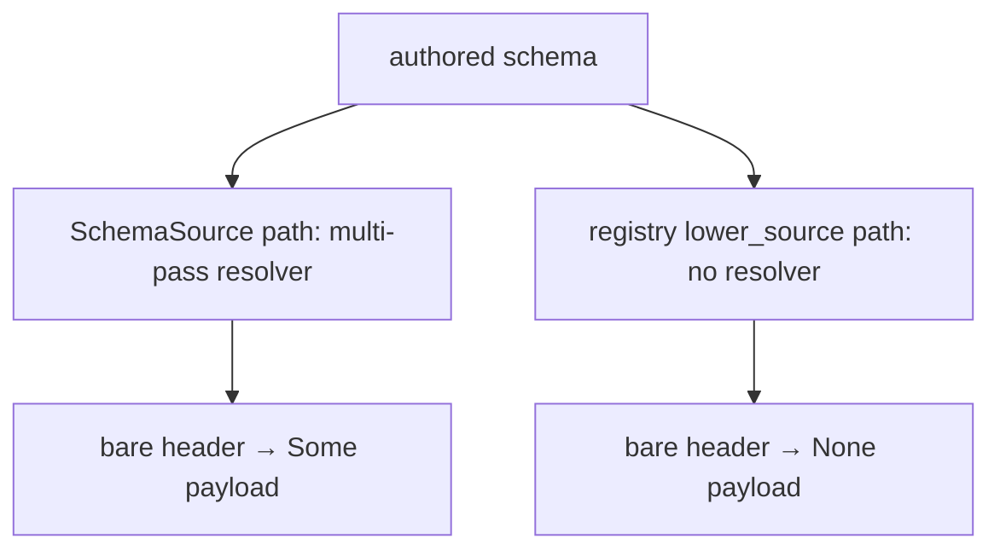

# 495 - Design-to-code port audit - overview

## The one-sentence finding

The operator has already manifested the bulk of the recent schema-stack
intent into clean code; the genuine design-to-code surface left is one
correctness bug, a handful of missing constraint witnesses, and a set of
repetition-driven abstractions that are mostly waiting on ratification —
not a backlog of unimplemented design.

## Landed and clean

Across the four code slices, the recent ratified mechanisms are not just
present but well-built. This is the dominant result and the reason the
porting surface is small.

| Mechanism | Intent | Where | Verdict |
|---|---|---|---|
| Alias-vs-newtype lowering, wrapper-free construction | 1557/1560/1561 | schema-next source → schema-rust-next emission → spirit-next usage | DONE end-to-end |
| Lifecycle hooks on engine traits, wired in SEMA→Nexus→Signal order | 1487 | spirit-next `engine.rs` | DONE (code) |
| Daemon binary string boundary | 1490/1492/1495 | spirit-next `daemon.rs` | DONE (code) |
| Trace as a typed schema interface, binary frames, NOTA only at edge | 1489/1491 | spirit-next `TraceEvent` + triad-runtime transport | DONE |
| SymbolPath typed identity + role recovery from schema | 1506/1507 | schema-next `asschema.rs` | DONE shape |
| Bare-name header namespace resolution + multi-pass resolver | 1555/1556/1562 | schema-next `source.rs` (SchemaSource path) | DONE on one path |

The witness coverage is genuinely good — `spirit-next` alone has
behavioral witnesses for alias rendering, binary-decoder NOTA rejection,
SEMA durability across restart, and the 5-variant Nexus runner loop with
`Continue`. The audit's job became hardening the edges, not filling holes.

## The one real bug — schema-next dual-path divergence

The single correctness finding, from slice 2. schema-next has two
parallel lowering engines that share no code: the typed-source path
(`SchemaSource::lower`, the only production caller) and the registry
document path (`SchemaEngine::lower_source`, what every test and the
README exercise). Multi-pass bare-header-name resolution
[records 1555/1556/1562] is implemented on the source path **only**. The
registry path drops a bare header payload to `None`:

```rust
// src/declarative.rs:1839 — registry path, no namespace lookup
} else if self.object.qualifies_as_pascal_case_symbol() {
    Ok(EnumVariant { name: self.object.schema_name()?, payload: None })
}
```

Probed directly, the same source yields `payload=Some(Lookup)` through
the source path and `payload=None` through the registry path. The
equivalence test that should catch this
(`schema_source_lowers_to_same_asschema_as_direct_source`) is green only
because its fixture never uses a bare header name. This is exactly the
missing-witness-hiding-a-bug shape record 1565 warns about. The fix
(unify the two engines on `SchemaSource`) is operator-tier3; the witness
that pins it is ready in slice 2's proposals.



## Missing constraint witnesses (record 1565)

The heart of the directive. Each is a load-bearing intent with no test
pinning the intended path; each slice returned ready-to-apply code.

| Intent | Record | Slice | State |
|---|---|---|---|
| Daemon never decodes a non-payload string | 1490/1492/1495 | spirit-next | ready code (binary symbol scan) |
| Lifecycle hook ORDER SEMA→Nexus→Signal | 1487 | spirit-next | ready code (trace-order assertion) |
| Both lowering paths agree on a bare header | 1556 | schema-next | ready code (would FAIL — exposes the bug) |
| Multi-pass forward reference resolves | 1556 | schema-next | ready code |
| Alias payload variant gets no From impl | 1560 | schema-rust-next | ready code (named, not snapshot) |
| Alias-payload fixture is compiled, not just text-compared | 1560/1561 | schema-rust-next | ready code (zero compile coverage today) |
| Trace frame is binary not text; runtime is generic | 1490/1492/1495 | triad-runtime | **LANDED this session** |

## Abstraction opportunities — repetition signals a missing abstraction

The psyche's explicit hunt. Ranked by leverage; classification notes
whether the psyche must ratify before the operator can act.

1. **The component runner** — `triad_main!` / `SignalDaemon<Engine>`.
   `spirit-next` hand-writes the entire daemon runner (accept loop,
   stale-socket cleanup, `Arc` sharing, per-connection frame exchange);
   only `self.engine()` and `engine.handle(input)` are component-specific.
   No runner noun exists anywhere. Both `triad-runtime` and `spirit-next`
   ARCHITECTURE files name this as a *future* extraction on the second
   consumer. **UNRATIFIED-PROPOSE** — the shape is ready; the trigger
   (extract-now vs extract-on-second-consumer) is the psyche's call.
2. **schema-rust-next emission core** — 504 `self.line(format!(...))`
   calls with hand-counted indentation. The data-before-text discipline
   (the repo's own INTENT.md) reaches the type declarations but never the
   ~80% of output that is impl blocks. Missing noun: a `RustItem` /
   `RustImplBlock` token model the writer renders once. Subsumes the
   `route()`-emitted-twice, three-`TypeReference`-walks, and
   lifecycle-preamble-thrice duplications. **UNRATIFIED-PROPOSE** (large
   operator refactor; direction already in intent).
3. **schema-next two parallel lowering engines** — `source.rs` vs
   `engine.rs`+`declarative.rs`, with the single-field→Newtype rule
   spelled 3×, collection-reference lowering 3×, and PascalCase
   predicates 4×. This duplication is also the *root cause* of the
   divergence bug above. Dissolution: make `SchemaSource` the one
   front-end. **RATIFIED direction** (unify), tier3 execution.
4. **Length-prefixed framing copied 3×** (triad-runtime trace,
   spirit-next transport, schema-emitted frame) → one `LengthPrefixedFrame`
   codec. **UNRATIFIED-PROPOSE** (pairs with #1).
5. **Single-NOTA-argument rule hand-rolled 2×** with divergent error
   vocabularies → a `ComponentArgument` typed sum (inline-NOTA /
   NOTA-file / rkyv-file). The *rule* is ratified (AGENTS.md); the *noun*
   is unratified.
6. **Error-enum ceremony vs thiserror** — four spirit-next enums
   hand-write `Display`+`Error`+`From` while triad-runtime uses thiserror.
   **RATIFIED discipline** (`skills/rust/errors.md`), tier3 cleanup.

## What was ported this session

One complete, cargo-verified designer port — the highest-value
manifestation target (slice 4) plus its witnesses, on branch
`designer-strings-at-edges-2026-06-04` in triad-runtime (commit
`0c079c79`, pushed for operator integration):

- **Constraint witnesses** (`tests/trace.rs`): a binary-frame-not-text
  witness (length-prefix structure + round-trip) and a genuine-generic-ity
  witness (a second, string-free `CounterTraceEvent` driven through the
  same surface). Note: agent 4's proposed "frame bytes don't contain the
  Display string" witness was **corrected** — rkyv archives a `String`
  field as its UTF-8 bytes, so that assertion would fail; the structural
  witness is the right one.
- **Doc manifestation**: a `## Constraints — strings only at the edges`
  section in `ARCHITECTURE.md` stating the three invariants with their
  witnesses, and an apex anchor in `INTENT.md` to records 1490/1492/1495.

Verification: `cargo fmt --check` clean, `cargo clippy --all-targets -D
warnings` clean, all 11 trace tests pass (2 new).

Everything else was held for the operator (the tier3 fixes and the other
slices' witnesses, all ready code) or the psyche (the ratification
questions), per the dance: the designer manifests and witnesses; the
operator implements production feature code; unratified design is proposed,
not ported.

## Tier-3 bad patterns handed to the operator

Small, clear, no psyche decision needed: spirit-next `SpiritNextCli::run`
returns `Box<dyn Error>` (errors.md violation) and sniffs NOTA-vs-path by
`starts_with('(')` (typification-in-strings); `ConfigurationPath::new`
uses lossy `to_string_lossy` on a wire path; the daemon's `engine.stop()`
is unreachable (lifecycle stop dead on the daemon path); schema-rust-next
has a dead `type_name` parameter; triad-runtime's `TraceEventFrame` trait
shares the `Frame` word with the `TraceFrame` wire envelope (rename to
`TraceArchive`).

## Cross-references

- Per-slice detail and ready code: entries `1`-`5` in this directory.
- The psyche-facing low-down and ratification questions:
  `reports/designer/496-Psyche-schema-stack-state-and-decisions-2026-06-04.md`.
- meta-signal rename status (12 repos + `core-signal-spirit` remain):
  slice 5 §"meta-signal rename status", consistent with operator report 300.
