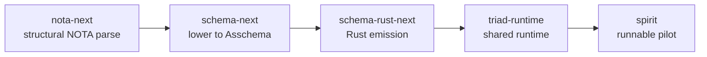

# 498.4 — Persona engine vision and architecture map

## 1. The vision — persona as meta-AI, spirit animates

The most universal framing is one sentence the psyche stated with force:
[Persona is a meta-AI system — the next evolutionary step in AI
engineering. Models need to be organised in a structure that emulates real
human intelligence. What animates humans at the highest level is spirit;
persona-spirit is the analog.] (ESSENCE §"Persona is meta-AI; spirit
animates"). Persona is not a model and not a wrapper around a model. It is a
**structure of organised mechanism** that LLMs drive through CLIs and
through the spirit intent substrate — and [there's no component that works
without LLMs] (INTENT §"Persona is LLM-mediated end-to-end"): the thinking
is always agent-side on the other end of the wire; the components are dumb,
typed, durable mechanism.

That gives the engine a clean division of labour. The **mechanism** is
typed, introspectable, single-writer, push-not-poll — software [eventually
impossible to improve … the right shape, chosen carefully, observed
cleanly] (ESSENCE §"What I am building"). The **intelligence** is the agent
LLMs. The **animation** is spirit: the intent layer that turns mechanism
into a living system, the cornerstone every agent falls back on. Persona is
the body; the agents are the minds that inhabit it; spirit is what makes the
whole thing alive rather than a pile of daemons.

The finished engine, read off the corpus, is: one privileged `persona`
engine-management daemon supervising, per engine, a full federation of
component-triad daemons (mind, spirit, router, message, harness, terminal,
introspect, …), each a Signal/Nexus/SEMA triad, each owning its own durable
SEMA database, all wired through one stable socket per component, all
emitting typed trace, all upgradable in place with no downtime — and all of
that component code **emitted from schema** rather than hand-written. The
durable-agent positioning is the criterion that decides what belongs:
[long-lived, persistent, inspectable agent runtime instead of one-shot agent
CLIs and reconciliation-stack controllers] (`persona/ARCHITECTURE.md`
§0.5).

## 2. The triad engine — Signal / Nexus / SEMA

Every persona daemon's runtime decomposes into three execution centers, each
its own schema type with the same four-position shape (imports/exports,
input, output, namespace) and the same colon-path import mechanism, differing
by ownership and runtime semantics, not by authored shape (INTENT
§"Three schema types, three runtime planes" + Pattern B). The vocabulary
closes the loop: [schema specifies, signal moves, sema holds] (INTENT
§"The schema-driven stack").

| Plane | Role | Trait | Owns |
|---|---|---|---|
| **Signal** | boundary / triage / wire | `SignalEngine` | admission, validation, correlation, the REST-shaped Operation roots; the only string-tolerant edge (NOTA at the CLI, binary on the wire) |
| **Nexus** | decisions / heavy logic / mail keeper / translator | `NexusEngine` | the decision loop; Signal↔SEMA translation; effects; recursion; [Nexus IS the runtime representation that a mail is being processed] |
| **SEMA** | durable single-writer state | `SemaEngine` | the component `.sema` (redb) database; apply/observe split for parallel reads; the canonical state-of-record |

The control flow is one-directional and typed: Signal hands the typed Input
to Nexus one-way; Nexus reaches SEMA exclusively through the trait surface;
SEMA returns to Nexus, which decides the reply; Signal emits it (INTENT
Pattern B, Spirit 1330/1331/1332). The `&mut Nexus` borrow on
`NexusEngine::execute` is the single-flight guard — Rust prevents two
mutable executions on one Nexus (`spirit/ARCHITECTURE.md` §Nexus).

### The NexusWork / NexusAction asymmetric pair

The load-bearing refinement (Spirit 1438, designer 477) is that input and
output are NOT symmetric lists of the same operations. **NexusWork is the
fact stream Nexus decides FROM; NexusAction is the command stream Nexus
emits NEXT.** Verified live in the spirit pilot schema
(`/git/github.com/LiGoldragon/spirit/schema/lib.schema`):

```text
NexusWork   [SignalArrived SemaWriteCompleted SemaReadCompleted EffectCompleted]
NexusAction [CommandSemaWrite CommandSemaRead ReplyToSignal CommandEffect Continue]
```

The asymmetry is encoded in the variant names: `SignalArrived` is a fact (a
client message arrived); `ReplyToSignal` is a command (emit this wire
reply). Both reference signal types, but one is received and one is emitted.
The runner loop is then obvious — commands go out, facts come back in, Nexus
decides, repeat until `ReplyToSignal` exits to wire.

### The 5-variant NexusAction with Continue

The five commands, verified in `spirit/src/schema/lib.rs:101-117` as the
emitted enum plus its type aliases:

- `CommandSemaWrite(SemaWriteInput)` — delegate a durable write to SEMA.
- `CommandSemaRead(SemaReadInput)` — delegate a read to SEMA.
- `ReplyToSignal(Output)` — the ONLY wire exit; ends the loop for this
  request.
- `CommandEffect(NexusEffectCommand)` — run a runtime effect (today
  `NexusEffectCommand [Stash]`, the first universal effect).
- `Continue(NexusWork)` — in-process immediate recursion: re-enter Nexus
  with a freshly-constructed fact without a round trip. `Continue NexusWork`
  in the schema makes the recursion typed — the payload of Continue is
  literally the fact stream, so Nexus feeds itself.

`Continue` is the concrete, landed form of designer 477/478's "recursive
Nexus as universal computation destination" — [anything needing more
computation re-enters Nexus] — narrowed for production to the in-process
case (cross-component recursion via Signal contracts stays deferred per the
inner-Nexus deferral, Spirit 1483). The substrate is ratified at Maximum
(Spirit 1486): the 5-variant set, the asymmetric pair, effects-per-component
with Stash universal, and `Continue` as in-process recursion.

### Engine traits, lifecycle hooks, and schema-carries

Each component runtime is a composition of three trait impls attached to
data-bearing nouns — never free functions, never ZST holders (INTENT
Pattern C). In the spirit pilot: `SignalActor` impls `SignalEngine`, `Nexus`
impls `NexusEngine`, `Store` impls `SemaEngine`; `Engine` is a thin composer
owning no SEMA state of its own. The traits carry **minimal lifecycle
hooks** — `on_start` / `on_stop` with typed start/stop failure results
(Spirit 1487) — wired SEMA→Nexus→Signal on start and the reverse on stop, so
a future supervisor can decide retry/escalate/fail on typed reasons. Broader
actor-mailbox / backpressure / inner-Nexus machinery is explicitly deferred
(Spirit 1483).

**Schema-carries** is the through-line: schema-emitted types are the nouns;
hand-written Rust attaches verbs as methods on them or as trait impls; trace
names, mail-ledger events, rejection enums, and database markers are ALL
schema-emitted, not hand-rolled. The witness discipline (Spirit 998-1000)
requires tests to assert against generated objects (`MailLedgerEvent`,
`NexusWork`/`NexusAction`, `SemaWriteInput`/`Output`) — no ad-hoc test enums.
This is the strings-only-at-edges principle made structural: the daemon
never decodes NOTA; only the CLI text surface and the user-facing display
emit strings (ESSENCE §"Strings only at the edges").

## 3. The components — built / partial / missing

The persona engine is a fleet of component triads plus the schema stack that
emits them. Each component is the canonical triad: `<component>` (daemon +
bundled thin CLI), `signal-<component>` (working contract), and
`meta-signal-<component>` (owner-only policy contract). The CLI is the
daemon's first client, not a fourth leg.

| Component | State | One line |
|---|---|---|
| **persona** (engine-management) | PARTIAL | The supervisor daemon: engine catalog, spawn envelopes, FD-handoff via SCM_RIGHTS, manager event-log + reducers, systemd-unit control. Rich hand-written Kameo stack on the OLD signal-frame surface; NOT yet on the schema-emitted triad, NOT yet running as the privileged system daemon. The vision says it must land BEFORE spirit cutover (`persona/INTENT.md` §"Persona takes over component upgrade management"). |
| **spirit** (the pilot, formerly spirit-next) | PARTIAL→BUILT (as pilot) | The runnable schema-derived proof: real NOTA CLI + rkyv Unix-socket daemon, three engine traits, typed trace, durable `.sema` redb store, the 5-variant NexusAction. Lacks the production feature set (removal-candidate, recency, privacy filtering) — those live on the hand-written `persona-spirit`. Record 1588: rename spirit-next→spirit landed at repo level; internal package/binary names still say `spirit-next`. |
| **persona-spirit** (production) | BUILT (deployed) | The hand-written actor stack on signal-frame/nota-codec. Provides the deployed `spirit`/`spirit-v0.3.0` CLI + `persona-spirit-daemon`. HAS removal-candidate, recency filters, privacy-as-Magnitude in source — but the deployed binary is several commits stale (live binary rejects `CollectRemovalCandidates` as unknown head). This is the cutover SOURCE, not the destination. |
| **mind** (central state) | PARTIAL | Real Kameo runtime, mind-local SEMA tables via sema-engine, typed Thought/Relation graph, daemon + thin CLI, subscriptions. The destination for the typed work graph that replaces lock-files + BEADS. But built on the OLD hand-written signal-mind stack, NOT the schema-emitted triad; ChoreographyAdjudicator policy is partial (manual injection only). |
| **sema** / **sema-engine** | BUILT (library) | sema = typed storage kernel (redb+rkyv+schema guard); sema-engine = full database engine library (record families, operation log, subscriptions). Each component owns its own redb + engine handle. No shared sema daemon. Distinct from eventual `Sema`. |
| **nexus** (semantic text) | PARTIAL (vocabulary) | Typed semantic-text vocabulary written in NOTA syntax + `nexus-cli`. This is the *content* nexus (semantic text records), distinct from the *runtime* Nexus plane — a naming collision worth watching. |
| **nota** | BUILT | The NOTA language home + `nota-codec` (parser/encoder/decoder) + `nota-derive`. The universal embedding-safe typed-text substrate. |
| **schema** | PARTIAL (library) | Resolved schema document model, validation, root/box layout metadata. Library-shaped; the future runtime schema-triad authority is unsettled. The legacy schema engine the next stack replaces. |
| **router / message / harness / terminal / system / introspect / orchestrate / upgrade** | MISSING→SCAFFOLD | Contract repos + ARCHITECTURE scaffolds exist; some have hand-written daemons on the old stack (terminal, router). None are on the schema-emitted triad. introspect is the named first cross-component consumer (trace ingest). |

The cross-cutting truth: **almost the entire fleet is either hand-written on
the old stack or scaffold-only.** The one component proving the
schema-emitted triad end-to-end is the spirit pilot. The vision is whole only
when the schema stack emits every component the way it emits spirit today.

## 4. The new schema stack — what emits the triad engine

The replacement substrate is a five-repo pipeline. It is the REPLACEMENT for
the hand-written stack: instead of hand-coding each component's wire types,
actor stack, and codecs, you author one `.schema` document per component and
the pipeline emits the Rust.



The flow, repo by repo:

- **nota-next** owns raw structural block parsing, source spans, and
  `qualifies_as_*` methods only — NO schema semantics. It is the typed-text
  substrate every structural-macro language should reuse.
- **schema-next** consumes nota-next, runs position-aware schema macros, and
  emits ordered macro-free **Asschema** — the assembled, macro-free typed
  form that can round-trip as legal NOTA, as rkyv bytes, and back before any
  Rust is emitted. (Note: designer 495 found schema-next has TWO lowering
  engines that disagree on bare headers — a real bug; the ratified fix is to
  unify on `SchemaSource` as the single front end. This is the one
  load-bearing correctness gap in the stack.)
- **schema-rust-next** consumes `Asschema` and emits Rust source TEXT as a
  separate step before any Rust macro ergonomics. The ratified emission model
  is the `RustItem` / `RustImplBlock` / `RustMatch` token model (records
  1576/1584) so the emitter renders once and owns indentation — replacing the
  ~504 hand-counted `self.line(format!(...))` calls.
- **triad-runtime** is the shared runtime: today it owns generic trace
  logging, rkyv frame transport, and the Unix trace socket listener. It is
  the home for the generic triad **runner** (the extracted `triad_main!`)
  once a second component needs it — verified today as ONLY `lib.rs` +
  `trace.rs`, so the runner is not there yet.
- **spirit** is the consumer that proves the whole pipeline:
  `schema/lib.schema` is lowered by schema-next, emitted by schema-rust-next,
  checked in at `src/schema/lib.rs`, then driven by a real NOTA CLI and rkyv
  Unix-socket daemon. `build.rs` is a freshness witness that fails if the
  generated source is stale.

Recently ratified at calibrated certainty (after a certainty pass): one
schema-next lowering engine, schema-as-its-own-codec (the source language has
an in/out codec, not a one-way parser), extract the generic triad runner
(records 1574/1581), the RustItem emission token model (1576/1584), flat
`SymbolPath(Vec<Name>)` with role recovered from schema position (1577,
contrary 1586 already at Zero), and strings-only-at-edges (1490/1492/1495).

The mirror property makes the two surfaces navigable as one identity: a
schema position `spirit:signal:Frame` maps mechanically to Rust
`spirit::signal::Frame` (INTENT Pattern F). Schema and emitted Rust are two
projections of one symbol-path identity space.

## 5. The cutover path

The cutover is the migration from the hand-written stack to the
schema-derived stack, component by component, with the old stack working the
whole time. Two distinct cutovers must not be conflated.

### Cutover A — the engine-management precondition

The vision sequences this explicitly: [Land persona engine before Spirit
cutover; engine orchestrates from day one] (`persona/INTENT.md`). Persona
(the privileged engine-management daemon) takes over component upgrade
management from CriomOS-home so that [we wouldn't have all this problem of
having to upgrade CriomOS every time we want to upgrade a component]. Once
persona is the upgrade orchestrator, the selector-flip stops being a
CriomOS-home symlink/flake edit and becomes a persona concern, and the
FD-handoff via SCM_RIGHTS gives lossless, no-downtime cutover (Spirit 320,
atomic in real time). **This is the gating precondition: the cutover
machinery should be persona-owned before spirit cuts over.**

### Cutover B — spirit, hand-written → schema-derived

The concrete first cutover is spirit: production `persona-spirit`
(hand-written) → schema-derived `spirit` (the pilot). Today they DIVERGE —
production has the feature set (removal-candidate, recency, privacy); the
pilot has the schema-emitted triad + trace but none of the feature thread.
The system-designer 59 audit named the discipline: the pilot should prove the
schema-derived engine, NOT feature-match production yet; the parity work
(system-designer 53) sequences the absorption. Every NEW spirit operation
the psyche decides (the removal/ladder/privacy thread) currently lands in
production source first and must be re-landed in the pilot — the longer they
diverge, the harder the eventual cutover.

The mechanical cutover steps already exist in the deploy chain
(`CriomOS-home`): five named version slots (`v0.1.0`…`v0.3.0`, `next`), a
`persona-spirit-next.url` flake input, and a `currentDefault` selector. Two
edits flip it: repoint the input from `persona-spirit?ref=main` to the
schema-derived `spirit?ref=main`, and flip `currentDefault` from `v0.3.0` to
`next`. The infrastructure is ready; the targets are the gap (system-designer
58).

### Cutover C — every other component

After spirit proves the pattern, each remaining component cuts over the same
way: author its `.schema`, emit through the pipeline onto triad-runtime, run
old and new in parallel, switch consumers one at a time, retire the old. mind
is the heaviest (a full Kameo stack + sema-engine graph to re-express on the
triad); router/message/harness/terminal follow; introspect comes up natively
on the new stack as the first cross-component consumer (trace ingest from
spirit). The cutover discipline is the same staged "build to parity, run both,
switch consumers, retire old" that the active-repositories Replacement Stack
section already documents.

The whole cutover ordering, as a vision: **persona (upgrade orchestrator)
first → spirit (prove the schema triad end-to-end) → mind and the
infrastructure components → introspect natively → the engine is whole.**

## 6. What is missing for the vision to be whole

The gaps, ordered roughly by how much each unblocks:

- **The runner — `triad_main!` / the generic triad runner.** Today every
  schema-derived daemon would hand-write the same socket-bind + accept-loop +
  engine-dispatch (`spirit/src/daemon.rs:152` `fn run`). The vision is a
  schema-emitted runner so the daemon `main` reduces to one call. Ratified to
  extract (records 1574/1581); NOT yet in triad-runtime (only trace lives
  there). This is the single most-repeated missing noun.

- **mind on the triad / mind as the engine center.** mind is the destination
  that replaces lock-file + BEADS orchestration with a native typed work
  graph (INTENT §"BEADS is transitional; persona-mind is the destination").
  Built today on the OLD hand-written signal-mind stack, not the schema triad.
  Until mind runs as a schema-emitted triad daemon AND carries the work graph
  natively, the workspace coordinates through lock files and `.beads/` — the
  transitional substrate the vision retires.

- **The help / description namespace.** Help and documentation are meant to
  be schema data in a mirror description namespace over the global symbol
  namespace, keyed by SymbolPath, with generated defaults when no entry exists
  (INTENT §"Help and documentation are schema data"). Verified MISSING: the
  spirit schema has `Description String` as an ordinary payload type but no
  `.description.schema` sibling and no `HelpRegistry`. No component answers
  `(Help Main)` / `(Help (Verb …))` on the new stack yet.

- **NOTA config-by-convention.** Authored data files should resolve to a typed
  root by path convention — `skills/skills.nota` is a `Vec<SkillEntry>`,
  `config.nota` in a known directory has a known type (INTENT §"Authored data
  files prefer typed NOTA"). The `NotaConfigRegistry` substrate is designed
  (designer 487.3) but not built; today authored files are parsed ad hoc.

- **The other components on the new stack.** engine-management (persona
  itself on the triad), router, message, introspect, upgrade — all
  scaffold-or-old-stack. The supervision vocabulary (a universal
  `signal-persona-supervision` contract, designer 484) and persona-as-a-regular-
  triad-daemon-supervising-triad-daemons (Decision 3 Maximum) are designed,
  not built. introspect as the first cross-component pair with spirit (trace
  ingest) is named but not wired.

- **The cutover itself.** Both the spirit flake-input redirect + selector flip
  (mechanically two edits, gated on parity) and the broader persona-owned
  upgrade orchestration that should precede it. Until persona is the privileged
  upgrade daemon, cutover stays a manual CriomOS-home edit rather than the
  atomic, no-downtime, FD-handoff the vision describes.

- **(Secondary) the schema-next dual-engine bug.** Not a vision gap but a
  correctness gap in the substrate that emits everything: schema-next lowers
  two ways and they disagree on bare headers (designer 495). The ratified fix
  unifies on `SchemaSource`. Worth naming because the emitter sits upstream of
  every component's correctness.

The shape of "whole" is legible: when the schema stack emits each component
the way it emits spirit today, when persona supervises them as a regular
triad daemon, when mind carries the work graph natively, when help and config
are schema data, and when the cutover has moved production off the
hand-written stack — the engine described in ESSENCE is realised. The pilot
proves the pattern works; the missing-list is the distance from one proven
component to the whole emitted fleet.
