# Operator implementation audit — designer/45 + 46 + 47

Status: audit at 2026-05-08 — head commits
nota-codec `xyouwryq` ; nota-derive `lwzzmrvn` ;
signal-core `znwrpnoq` ; signal `yxorqrrp` ;
signal-persona `tqnonlwm` ; nexus `ytwvpllv`.
Author: Claude (designer)

The user requested an audit of operator's implementation work
against designer/45 (nexus needs no grammar of its own),
designer/46 (Bind/Wildcard as typed records), and
operator/47 (the operator-side implementation plan).

Verdict at a glance: **the typed-record migration is clean
across nota-codec, nota-derive, signal-core, signal, and
nexus.** Signal-persona has not adopted the new
`signal_core::PatternField<T>` and still ships a parallel
hand-written pattern vocabulary; this is the load-bearing
gap. Two designer/43 audit findings (Lock.agent type,
PersonaRequest::Atomic narrowness) also remain open.
One designer-side oversight (reserved-record-heads rule
not yet in `skills/contract-repo.md`).

---

## 0 · TL;DR

```mermaid
flowchart LR
    subgraph clean["Clean"]
        nc["nota-codec — @ dropped, Dialect dropped, pattern_field.rs deleted"]
        nd["nota-derive — NexusVerb→NotaSum, NexusPattern deleted"]
        sc["signal-core — Bind/Wildcard typed records, PatternField&lt;T&gt; lives here"]
        s["signal — re-exports PatternField, Query records use plain NotaRecord"]
        nx["nexus — spec/grammar.md rewritten for (Bind)/(Wildcard)"]
    end
    subgraph open["Open"]
        sp["signal-persona — 16+ duplicate Any/Exact/Bind enums; should be PatternField&lt;T&gt;"]
        l["Lock.agent: String → PrincipalName (designer/43 §1.5)"]
        a["PersonaRequest::Atomic(Vec&lt;Record&gt;) too narrow (designer/43 §1.1)"]
        cr["skills/contract-repo.md missing reserved-heads rule (designer/46 §5)"]
    end
    clean -. gap .-> open
```



| Area | Status |
|---|---|
| `@` dropped from grammar | ✅ done |
| `(Bind)` / `(Wildcard)` typed records | ✅ done |
| `PatternField<T>` in `signal-core` | ✅ done |
| `nota-codec` pure structural codec | ✅ done |
| `NexusPattern` derive deleted | ✅ done |
| `NexusVerb` → `NotaSum` rename | ✅ done |
| `nexus/spec/grammar.md` rewritten | ✅ done |
| Round-trip + negative tests | ✅ done |
| `signal-persona` adopts `PatternField<T>` | 🔴 not done |
| `Lock.agent` typed | 🔴 not done |
| `PersonaRequest::Atomic` widened | 🔴 not done |
| `skills/contract-repo.md` reserved-heads rule | 🟠 designer-side, not done |

---

## 1 · What the operator landed cleanly

### 1.1 · `@` is gone

`nota-codec/src/lexer.rs` token enum has 12 token kinds and
no `Token::At`; the byte `@` falls into `UnexpectedChar` at
lexer line 126:

```rust
_ => Err(Error::UnexpectedChar { character: b as char, offset: self.pos }),
```

`Dialect` is gone from the lexer entirely. The doc comment
(`nota-codec/src/lexer.rs:10-13`) names the discipline:

> Nexus no longer adds tokens; it is a typed-record discipline
> over nota text.

Negative test at `nota-codec/tests/lexer_tokens.rs:5-8`
asserts `@name` rejects with `UnexpectedChar { character: '@',
offset: 0 }`.

### 1.2 · `Bind` and `Wildcard` are typed unit records

`signal-core/src/pattern.rs` (whole file, 85 lines) is
exemplary — the cleanest possible expression of designer/46:

```rust
pub struct Bind;
pub struct Wildcard;

pub enum PatternField<T> {
    Wildcard,
    Bind,
    Match(T),
}
```

`Bind` and `Wildcard` are unit structs whose `NotaEncode`
emits `(Bind)` / `(Wildcard)` and whose `NotaDecode` consumes
the same. `PatternField<T>::decode` dispatches on
`peek_token` → `peek_record_head` → match `"Bind"` /
`"Wildcard"` → fall-through to `T::decode` for the `Match`
case (lines 64–84).

The dispatch is structural, not convention-based. There is
no schema-field-name comparison; there is no out-of-context
error path. The asymmetry designer/46 §1 warned about (Bind
vs Wildcard sharing record-shape vs ident-shape) is gone.

### 1.3 · PatternField home: `signal-core` (universal)

`signal-core/src/lib.rs:16` re-exports `Bind`, `PatternField`,
`Wildcard`. Per designer/46 §8 default — the universal
location, not `signal` (which would have made it
criome-flavored). Layered crates (`signal`, `signal-persona`,
future fabrics) consume it from the kernel.

`signal/src/pattern.rs` is now eight lines:

```rust
//! `PatternField<T>` — re-exported from `signal-core`.
pub use signal_core::PatternField;
```

### 1.4 · nota-codec is pure structural codec

`nota-codec/src/lib.rs` re-exports five derives:

```rust
pub use nota_derive::{NotaEnum, NotaRecord, NotaSum, NotaTransparent, NotaTryTransparent};
```

No `NexusPattern`. No `NexusVerb`. No `pattern_field` module
(deleted). Error enum (`nota-codec/src/error.rs`) has no
pattern-only variants — `WrongBindName`,
`PatternBindOutOfContext`, `NexusOnlyWrite` all gone.

Decoder (`nota-codec/src/decoder.rs`) has the two structural
helpers PatternField needs:
- `peek_token` (lines 248–259) — non-erroring lookahead;
  doc-comment names the use case.
- `peek_record_head` (lines 270–291) — pushes the opener +
  ident back so the variant's full decode reads them
  normally; doc-comment specifically names `NotaSum` (the
  rename took, not just in code).

### 1.5 · `NexusPattern` deleted; `NexusVerb` → `NotaSum`

`nota-derive/src/lib.rs` ships exactly five derives
(`NotaRecord`, `NotaEnum`, `NotaTransparent`,
`NotaTryTransparent`, `NotaSum`). The `nexus_pattern.rs`
file is gone from `src/`. `NotaSum`'s doc-comment
(`nota-derive/src/lib.rs:83-92`) describes the closed-enum
dispatcher cleanly with no nexus-specific framing.

### 1.6 · Query records use ordinary `NotaRecord`

`signal/src/flow.rs:99-118`:

```rust
#[derive(Archive, RkyvSerialize, RkyvDeserialize, NotaRecord, Debug, Clone, PartialEq)]
pub struct NodeQuery { pub name: PatternField<String> }

#[derive(Archive, RkyvSerialize, RkyvDeserialize, NotaRecord, Debug, Clone, PartialEq)]
pub struct EdgeQuery {
    pub from: PatternField<Slot<Node>>,
    pub to: PatternField<Slot<Node>>,
    pub kind: PatternField<RelationKind>,
}
```

This is designer/47 §5's "cleanest outcome" — no
`NexusPattern` derive, no `#[nota(queries = "Node")]`
attribute, no bind-name validation path. The schema is
self-describing; the codec is structural.

### 1.7 · nexus/spec/grammar.md rewritten

`nexus/spec/grammar.md` has been rewritten end-to-end:
- §1 token table — 12 token shapes; the prose explicitly
  retires `@` and `_`-as-wildcard:
  > `@`, `_` as wildcard, and piped delimiters are retired
  > syntax. A pure Nota lexer rejects `@`; `_` is just an
  > identifier and has no wildcard privilege.
- §4 patterns — `(Bind)` / `(Wildcard)` table; the parse-error
  case `(Node (Bind))` is named.
- §5 verb examples — every example uses `(Bind)` /
  `(Wildcard)` (e.g. `(Match (NodeQuery (Bind)) Any)`).
- §7 dropped forms — full table including
  `@name`, `_` → `(Bind)`, `(Wildcard)`.

The framing in §4 is the load-bearing line:

> Patterns are schema-driven. There is no pattern delimiter
> and no pattern lexer mode.

That's designer/45 in one sentence.

### 1.8 · Test coverage

Round-trip tests in `signal/tests/text_round_trip.rs`:
- `(NodeQuery (Wildcard))` round-trip (line 155)
- `(NodeQuery (Bind))` round-trip (line 162)
- `(EdgeQuery 102 (Bind) (Wildcard))` round-trip (lines 173–178)
- `(Node (Bind))` parse-error test (line 192)

Negative test in `nota-codec/tests/lexer_tokens.rs:5-8`
ensures `@` regressing into the lexer surfaces as a typed
error.

### 1.9 · Signal verbs are per-kind closed sums

`signal/src/edit.rs` and `signal/src/query.rs` use
`#[derive(NotaSum)]` over closed per-kind variants:

```rust
#[derive(..., NotaSum, ...)]
pub enum AssertOperation { Node(Node), Edge(Edge), Graph(Graph) }

#[derive(..., NotaSum, ...)]
pub enum QueryOperation { Node(NodeQuery), Edge(EdgeQuery), Graph(GraphQuery) }
```

Per perfect-specificity — no generic record wrapper, no
string kind dispatch. This is designer/43 §1.7 partially
addressed for the criome domain.

### 1.10 · `signal-core` kernel structure

`signal-core/src/request.rs` ships `SemaVerb` with all 12
zodiacal verbs in declaration order (Assert, Subscribe,
Constrain, Mutate, Match, Infer, Retract, Aggregate,
Project, Atomic, Validate, Recurse) and a generic
`Request<Payload>` for layered crates:

```rust
pub enum Request<Payload> {
    Handshake(HandshakeRequest),
    Operation { verb: SemaVerb, payload: Payload },
}
```

Per-verb convenience constructors (`Request::assert`,
`Request::mutate`, …) keep call sites readable.
`signal-persona` consumes this as
`type Request = signal_core::Request<PersonaRequest>`.

---

## 2 · The load-bearing gap — signal-persona pattern enums

Despite designer/46 placing `PatternField<T>` in
`signal-core` precisely so layered crates like
`signal-persona` could share it, **signal-persona has not
adopted it.** Every queryable field in signal-persona ships
its own hand-written `Any | Exact(T) | Bind` enum:

| File | Enum | Should be |
|---|---|---|
| `lock.rs:39` | `RolePattern { Any, Exact(RoleName), Bind }` | `PatternField<RoleName>` |
| `lock.rs:46` | `LockStatusPattern { Any, Exact(LockStatus), Bind }` | `PatternField<LockStatus>` |
| `binding.rs:32` | `BindingEndpointPattern` | `PatternField<HarnessEndpoint>` |
| `binding.rs:?` | `BindingTargetPattern` | `PatternField<…>` |
| `delivery.rs:?` | `DeliveryStatePattern` | `PatternField<DeliveryState>` |
| `delivery.rs:?` | `DeliveryMessagePattern` | `PatternField<…>` |
| `delivery.rs:?` | `DeliveryTargetPattern` | `PatternField<…>` |
| `message.rs:21` | `MessageRecipientPattern { Any, Exact(PrincipalName), Bind }` | `PatternField<PrincipalName>` |
| `message.rs:28` | `TextPattern { Any, Exact(String), Bind }` | `PatternField<String>` |
| `harness.rs:?` | `LifecyclePattern` | `PatternField<LifecycleState>` |
| `harness.rs:?` | `PrincipalPattern` | `PatternField<PrincipalName>` |
| `authorization.rs:?` | `AuthorizationDecisionPattern` | `PatternField<AuthorizationDecision>` |
| `authorization.rs:?` | `AuthorizationTargetPattern` | `PatternField<…>` |
| `stream.rs:?` | `StreamBytesPattern` | `PatternField<…>` |
| `stream.rs:?` | `StreamHarnezzPattern` | `PatternField<…>` |
| `transition.rs:24` | `TransitionSubjectPattern { Any, Exact(RecordSlot), Bind }` | `PatternField<RecordSlot>` |

The shape is identical: three variants
(`Any`/`Wildcard`, `Exact(T)`/`Match(T)`, `Bind`).
Sixteen-plus parallel definitions of the same closed sum.

This is the exact duplication designer/43 §1.5 / §1.7
flagged before `PatternField<T>` was universal — and after
designer/46 made it universal, the duplication is strictly
worse: now there's a canonical answer and signal-persona
isn't using it.

### Why this matters

1. **Wire-form drift risk.** Each `*Pattern` decides its own
   text shape independently. A round-trip drift in one
   doesn't surface in the others.
2. **Bind name reservation.** The reserved-record-heads rule
   (designer/46 §5; not yet in skills) names `Bind` and
   `Wildcard` workspace-wide. Sixteen parallel pattern enums
   each carrying their own `Bind` constructor compete with
   the reserved names without any wire-side conflict
   detection.
3. **API surface bloat.** Every consumer (a future
   persona-cli, a future persona-harness query builder)
   learns sixteen pattern types instead of one generic.
4. **The whole point of moving PatternField to signal-core.**
   `signal-core` is the kernel for any signal-* layered
   crate. signal-persona is the second layered crate. If it
   doesn't consume the kernel's pattern primitive, the
   kernel-extraction pattern (skills/contract-repo.md
   §"Kernel extraction trigger") didn't fully land.

### Recommended change

Replace each per-field pattern enum with `PatternField<T>`.
Concrete diff sketch for `message.rs`:

```rust
// before
pub struct MessageQuery {
    recipient: MessageRecipientPattern,
    body: TextPattern,
}
pub enum MessageRecipientPattern { Any, Exact(PrincipalName), Bind }
pub enum TextPattern { Any, Exact(String), Bind }

// after
use signal_core::PatternField;

pub struct MessageQuery {
    recipient: PatternField<PrincipalName>,
    body: PatternField<String>,
}
```

Wire form changes: `(MessageQuery (Exact alice) Bind)` →
`(MessageQuery alice (Bind))` (or
`(MessageQuery (Bind) (Bind))` for an all-bound query).

The migration is mechanical across the 16 sites; one PR per
record file is sustainable. signal-persona doesn't ship text
round-trip tests today, so the assertion side is mostly
about Rust API clarity — but if and when persona's wire
gains a text projection, there must be one shape.

---

## 3 · Open designer/43 audit findings

### 3.1 · `Lock.agent` is still `String`

`signal-persona/src/lock.rs:6`:

```rust
pub struct Lock {
    role: RoleName,
    agent: String,    // should be PrincipalName
    status: LockStatus,
    scopes: Vec<Scope>,
}
```

`PrincipalName` exists in `signal-persona/src/identity.rs`
and is re-exported at the crate root. The `agent` field is
the principal that holds the lock — exactly what
`PrincipalName` names. Designer/43 §1.5 flagged this; the
fix is one type-substitution.

### 3.2 · `PersonaRequest::Atomic(Vec<Record>)` too narrow

`signal-persona/src/request.rs:13-20`:

```rust
pub enum PersonaRequest {
    Record(Record),
    Mutation(Mutation),
    Retraction(Retraction),
    Atomic(Vec<Record>),    // ← only Records, not Mutations or Retractions
    Query(Query),
    Validation(Validation),
}
```

Same problem in `Validation::Atomic(Vec<Record>)` (line 58).
Designer/43 §1.1 flagged this: an atomic batch should be
able to carry mixed kinds — `[(Record m) (Mutation
(Slotted...)) (Retraction (Slot<Lock>))]` should be a
legal atomic — not just a sequence of fresh records.

### 3.3 · Verb-payload pairing not type-enforced

`signal-core::Request<Payload>::Operation { verb, payload }`
(`signal-core/src/request.rs:21-25`) lets any
`(SemaVerb, PersonaRequest)` pair through the type system.
`Request::operation(SemaVerb::Mutate,
PersonaRequest::Record(...))` compiles even though the
verb's intent is mutation and the payload is an assert.

This is designer/43 §1.7 in its fullest form. Two ways to
fix it, both substantial design decisions:

- **Per-verb payload types** — `MutationPayload`,
  `RetractionPayload`, `AssertPayload` separately, with
  `Request<MutationPayload>` etc. But that means as many
  generic instantiations as there are verbs.
- **`PersonaRequest` is the closed verb-payload sum** — drop
  the `verb: SemaVerb` argument from the operation; the
  variant tag carries the verb. `PersonaRequest::Record(...)`
  is structurally an Assert; a `PersonaRequest::Mutation(...)`
  is structurally a Mutate. Then `Request<PersonaRequest>` is
  enough.

The second option is the workspace's preferred shape (closed
typed sum dispatches, no parallel-tag indirection). It
means dropping `Request::operation(verb, payload)` and only
keeping the kind-implied constructors. **Worth a separate
designer report before operator changes anything here.**

---

## 4 · Designer-side oversight — reserved record heads

Designer/46 §5:

> `Bind` and `Wildcard` become **workspace-reserved record
> head names**. … Worth one line in
> `~/primary/skills/contract-repo.md` once the rename lands.

The rename has landed. The line has not. `grep -i 'bind\|
wildcard\|reserved.record' /home/li/primary/skills/contract-
repo.md` finds only references to "binds and wildcards" in
the example-text round-trip section (line 348) — no rule
about reserved heads.

This is a designer-side miss, not operator's. The fix is one
line under `skills/contract-repo.md` §"What goes in a
contract repo" or §"Common mistakes":

> **Reserved record heads.** No domain type defines a record
> kind named `Bind` or `Wildcard`. These names are reserved
> at the workspace level for `signal_core::PatternField<T>`
> dispatch. A domain `(Bind …)` record would conflict at any
> PatternField position.

I'll land that in a follow-up commit.

---

## 5 · Polish observations (non-blocking)

### 5.1 · `signal-core` lacks PatternField round-trip tests

`signal-core/tests/frame.rs` covers handshake + operation
frames via rkyv. There are no tests asserting that
`Bind`/`Wildcard`/`PatternField<T>` round-trip through nota
text. The text-level round-trip tests live in
`signal/tests/text_round_trip.rs` instead — which exercises
the contract through `NodeQuery`/`EdgeQuery`/`GraphQuery`,
not directly through `PatternField<T>`.

If a future signal-* crate (signal-persona, signal-arca)
were to ship a text projection, the kernel's pattern
contract is what they'd rely on. A direct
`signal-core/tests/pattern.rs` covering the six cases
designer/47 §7 listed (`PatternField::<String>::Bind` →
`(Bind)`, etc.) would harden the kernel's contract
independently.

Low priority — the tests are exercised transitively via
`signal/tests/text_round_trip.rs` — but the more components
share the kernel, the more valuable a kernel-direct test
suite becomes.

### 5.2 · 12-token lock check

The lexer ships 12 `Token` variants. `Token::Int(i128)` and
`Token::UInt(u128)` are two variants for one syntactic shape
(integer literal — the `UInt` form covers values that exceed
`i128::MAX`). Designer/26 §7 / designer/31 §5 / designer/46
discuss the lock as 11 syntactic shapes; the implementation
counts 12 enum variants because `Int` and `UInt` are
internally separate. Not a regression — the lock counts
shapes the lexer dispatches on, not enum cardinality.

### 5.3 · `Transition` has no commit time

`signal-persona/src/transition.rs:5-8`:

```rust
pub struct Transition {
    subject: RecordSlot,
    verb: SemaVerb,
}
```

This is correct per ESSENCE §"Infrastructure mints identity,
time, and sender" — the transition log itself stamps the
time, and the `Transition` record body is what the log
*entry's value* carries; the log key/header carries the
time. Designer/43 §1.6 flagged the absence; on re-read with
the ESSENCE rule in hand, the absence is the right shape if
the log infrastructure stamps. No change required unless
queries need transition time as a queryable field.

---

## 6 · Bottom line

The typed-record migration (drop `@`, drop `Dialect`,
relocate `PatternField<T>`, delete `NexusPattern`, rename
`NexusVerb`, rewrite `nexus/spec/grammar.md`) **is clean,
end-to-end, with tests covering the round-trip and the
negative `@` case.** Operator implemented designer/45 +
designer/46 + their own operator/47 with no shortcuts.

The remaining gaps are in **signal-persona** and they are
the same shape as designer/43 flagged before this typed-
record work landed — only worse, because the universal
answer (`signal_core::PatternField<T>`) now exists and
signal-persona is shipping its own parallel vocabulary.

The single biggest lever is migrating signal-persona's 16
hand-written `*Pattern` enums to `PatternField<T>`. After
that, the two type-correctness fixes (`Lock.agent` →
`PrincipalName`; `PersonaRequest::Atomic` widened to
mixed-kind) are mechanical.

The verb-payload type-enforcement question (designer/43
§1.7) deserves its own designer report before operator
touches it — it's a structural decision about the
`Request<Payload>` shape itself.

The reserved-record-heads rule belongs in
`skills/contract-repo.md` and is mine to land.

---

## 7 · See also

- `~/primary/reports/designer/40-twelve-verbs-in-persona.md`
  — the ESSENCE rule that drives Lock.agent + Atomic findings.
- `~/primary/reports/designer/43-signal-core-and-signal-persona-contract-audit.md`
  §1.1, §1.5, §1.7 — the open findings carried forward in §3 here.
- `~/primary/reports/designer/45-nexus-needs-no-grammar-of-its-own.md`
  — implemented per §1.7 above.
- `~/primary/reports/designer/46-bind-and-wildcard-as-typed-records.md`
  §5 reserved heads — designer-side miss noted in §4 here;
  §6 implementation cascade — covered in §1 above.
- `~/primary/reports/operator/47-bind-wildcard-typed-record-implementation-plan.md`
  — operator's own plan; §5 cleanest-outcome and §7 tests
  both landed.
- `~/primary/skills/contract-repo.md` — kernel extraction
  pattern; reserved-heads rule pending.
- `/git/github.com/LiGoldragon/signal-core/src/pattern.rs`
  — the canonical implementation of designer/46.
- `/git/github.com/LiGoldragon/signal-persona/src/lock.rs`,
  `…/message.rs`, `…/transition.rs`, etc. — the 16+ sites
  that still need PatternField<T> migration.

---

*End report.*
