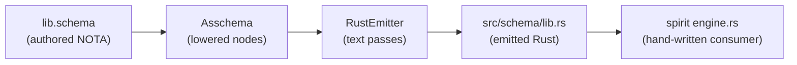

This entry is the template for the recurring schema-in-action report. It reads three real files end to end: the authored schema `/git/github.com/LiGoldragon/spirit/schema/lib.schema` (94 lines of NOTA), the checked-in emitted Rust `/git/github.com/LiGoldragon/spirit/src/schema/lib.rs` (1952 lines), and the pipeline that turns one into the other (`schema-next` lowering, `schema-rust-next` emission). The psyche's directive (record 2550) is to show the IDEAL against WHAT WE HAVE NOW so the gap is visible; the schema focus (record 2549) is to show what goes INTO the schema, what comes OUT, and what code the schema CREATES, with the implementation. So every pairing below is literal: an authored fragment, the Asschema node it lowers to, and the exact Rust lines that fall out, quoted with line numbers.

## The shape of the whole thing first

The authored schema is exactly three NOTA root objects (a fourth, leading, optional imports object). The lowering enforces this in `schema-next/src/engine.rs:309`: [3 root values (input output namespace) or 4 with leading imports]. Object 0 is the Input enum `[Record Observe Lookup Count Remove LookupStash]`, object 1 is the Output enum `[RecordAccepted ... Rejected]`, object 2 is the `{...}` namespace map of every other type. There are no keywords, no `Input =`, no labels — position IS meaning. That is the NOTA positional-record rule made structural: the schema file is itself a NOTA document, and `Asschema::from_nota_source` (`asschema.rs:377`) parses it with the same `NotaSource` the runtime uses for messages.



## Seven this-code-creates-this-code pairings

### Pairing 1 — the bare-name Input header creates the Input enum + its constructors + its FromStr

INTO the schema (`lib.schema:2`), one line, six bare names:

```
[Record Observe Lookup Count Remove LookupStash]
```

The lowering (`engine.rs:331`) hands this to `lower_root_enum(..., MacroPosition::RootInput, ...)`, which produces an `EnumDeclaration` (`asschema.rs:798`) whose `name` is the position-supplied `Input` and whose `variants` are six `EnumVariant`s (`asschema.rs:844`), each `name` a bare token and `payload: None` at this stage. Each bare name is ALSO a namespace key further down (`lib.schema:13` `Record Entry`), so the payload is filled by cross-reference, not by the header.

OUT of the emitter (`src/schema/lib.rs:391`), the root enum:

```rust
#[cfg_attr(feature = "nota-text", derive(nota_next::NotaDecode, nota_next::NotaEncode))]
#[derive(rkyv::Archive, rkyv::Serialize, rkyv::Deserialize, Clone, Debug, PartialEq, Eq)]
pub enum Input {
    Record(Record),
    Observe(Observe),
    Lookup(Lookup),
    Count(Count),
    Remove(Remove),
    LookupStash(LookupStash),
}
```

The SAME bare-name list also generates a constructor `impl` (`emit_enum_variant_constructors_for`, `schema-rust-next/src/lib.rs:1111`), seen at `src/schema/lib.rs:556`:

```rust
impl Input {
    pub fn record(payload: Record) -> Self {
        Self::Record(payload)
    }
    ...
    pub fn lookup_stash(payload: LookupStash) -> Self {
        Self::LookupStash(payload)
    }
}
```

and — because `Input` is a root enum, not an ordinary namespace enum — the text-edge codec (`emit_nota_root_enum_support`, `schema-rust-next/src/lib.rs:1255`), seen at `src/schema/lib.rs:1001`:

```rust
#[cfg(feature = "nota-text")]
impl std::str::FromStr for Input {
    type Err = NotaDecodeError;
    fn from_str(source: &str) -> Result<Self, Self::Err> {
        NotaSource::new(source).parse::<Self>()
    }
}
```

That last block is the whole single-argument-rule made real: the daemon binary's one NOTA argument becomes an `Input` through this `from_str`. One authored line of six bare names created a typed enum, six constructors, a FromStr, a Display, and (pairing 6) the rkyv frame codec.

### Pairing 2 — a bare alias binding creates pub type + the carrying variant + a NEW constructor

INTO the schema, two lines that look identical in shape but live in different namespace slots (`lib.schema:26` and the Output header `lib.schema:3`):

```
Rejected SignalRejection
```

This is a namespace map entry: key `Rejected`, value reference `SignalRejection`. The lowering produces an `AliasDeclaration` (`asschema.rs:625`) `{ name: Rejected, reference: Plain(SignalRejection) }`. The bare name `Rejected` ALSO appears in the Output header (`lib.schema:3`), so it is simultaneously an Output variant name.

OUT of the emitter, three distinct pieces fall out of that one binding. First the alias itself (`emit_alias`, `schema-rust-next/src/lib.rs:920`), at `src/schema/lib.rs:80`:

```rust
pub type Rejected = SignalRejection;
```

Second, the Output enum variant carrying it (`src/schema/lib.rs:411`):

```rust
    Rejected(Rejected),
```

Third, the constructor (`src/schema/lib.rs:611`):

```rust
    pub fn rejected(payload: Rejected) -> Self {
        Self::Rejected(payload)
    }
```

This is the pattern the consumer actually calls: `Output::rejected(SignalRejection { ... })` at `spirit/src/nexus.rs:308`. The authored binding `Rejected SignalRejection` is the entire reason that call type-checks.

### Pairing 3 — the NexusAction bare-list creates a five-variant enum with a reserved-word constructor

INTO the schema (`lib.schema:32`), the engine's decision space as a bare list:

```
NexusAction [CommandSemaWrite CommandSemaRead ReplyToSignal CommandEffect Continue]
```

Here the namespace key `NexusAction` has an INLINE bracket-list value — an `EnumDeclaration` nested inside the namespace, not a root enum. The five following lines (`lib.schema:33-37`) bind each variant's payload: `Continue NexusWork` makes the action recursive (a `Continue` carries more work). The lowering yields an `EnumDeclaration { name: NexusAction, variants: [...5...] }` and five sibling `AliasDeclaration`s.

OUT (`src/schema/lib.rs:100`):

```rust
pub enum NexusAction {
    CommandSemaWrite(CommandSemaWrite),
    CommandSemaRead(CommandSemaRead),
    ReplyToSignal(ReplyToSignal),
    CommandEffect(CommandEffect),
    Continue(Continue),
}
```

The constructor emitter has to deal with `Continue` colliding with the Rust keyword. `rust_method_name` lowercases `Continue` to `continue`, a reserved word, so the emitter raw-escapes it (`src/schema/lib.rs:449`):

```rust
    pub fn r#continue(payload: Continue) -> Self {
        Self::Continue(payload)
    }
```

The authored `Continue NexusWork` (`lib.schema:37`) made `pub type Continue = NexusWork;` (`src/schema/lib.rs:117`), so the `Continue` variant is structurally `NexusAction -> NexusWork`, the recursion the runner walks.

### Pairing 4 — a brace struct body creates a struct with field-name casing applied

INTO the schema (`lib.schema:64`), a positional brace map — field name, `*` placeholder, field name, `*`:

```
DatabaseMarker { CommitSequence * StateDigest * }
```

The `{...}` is a `StructFieldMap` (`asschema.rs:691`), decoded in pairs (`asschema.rs:750` `for chunk in root_objects.chunks_exact(2)`): each field's `name` is `CommitSequence`, its `reference` the `*`-marked type. The lowering produces a `StructDeclaration { name: DatabaseMarker, fields: [CommitSequence, StateDigest] }`.

OUT (`emit_struct`, `schema-rust-next/src/lib.rs:983`), at `src/schema/lib.rs:220`:

```rust
pub struct DatabaseMarker {
    pub commit_sequence: CommitSequence,
    pub state_digest: StateDigest,
}
```

The PascalCase field key `CommitSequence` became the snake_case Rust field `commit_sequence` — that is `Name::field_name` at `schema-next/src/asschema.rs:41`, which walks the chars inserting `_` before each interior uppercase. INTO the schema a type name; OUT a field identifier, transformed by one rule applied at emission, never authored twice. The consumer constructs this literally: `database_marker: self.database_marker()` at `spirit/src/nexus.rs:310`.

### Pairing 5 — a newtype declaration creates new / payload / into_payload AND an impl From

The spirit schema's struct/alias forms dominate, but the emitter's newtype path is what makes opaque scalar wrappers (`OriginRoute`, `MessageIdentifier`) carry behavior. The emitted file shows the target shape at `src/schema/lib.rs:1529`:

```rust
pub struct OriginRoute(pub Integer);
```

The emitter that produces a newtype's inherent surface is `emit_newtype_inherent_impl` (`schema-rust-next/src/lib.rs:955`). It is the single most behavior-dense emission in the pipeline — one declaration creates four methods plus a trait impl:

```rust
self.line(format!("impl {name} {{"));
self.line(format!("    pub fn new(payload: {payload_type}) -> Self {{"));
self.line("        Self(payload)");
...
self.line(format!("    pub fn payload(&self) -> &{payload_type} {{"));
self.line("        &self.0");
...
self.line(format!("    pub fn into_payload(self) -> {payload_type} {{"));
self.line("        self.0");
...
self.line(format!("impl From<{payload_type}> for {name} {{"));
self.line(format!("    fn from(payload: {payload_type}) -> Self {{"));
self.line("        Self::new(payload)");
```

That `impl From` is the projection rule from AGENTS.md made automatic: the schema never authors `fn project_integer_to_origin_route`; it authors a newtype and the emitter reaches for `From`. INTO: one newtype binding. OUT: `new`, `payload`, `into_payload`, `From` — the full owned-scalar idiom, on a real data-bearing noun, never a free function.

### Pairing 6 — the root enum creates the rkyv signal-frame codec (short header + archive)

This is the pairing that shows the schema reaching DOWN to the wire. No authored line says "frame" — the framing is implied by a type being a root enum (Input / Output). `emit_short_headers` (`schema-rust-next/src/lib.rs:1292`) assigns each root variant a 64-bit tag, at `src/schema/lib.rs:1044`:

```rust
pub mod short_header {
    pub const INPUT_RECORD: u64 = 0x0000000000000000;
    pub const INPUT_OBSERVE: u64 = 0x0001000000000000;
    ...
    pub const OUTPUT_REJECTED: u64 = 0x0107000000000000;
}
```

and `emit_signal_frame_impl` (`schema-rust-next/src/lib.rs:1390`) emits the encode/decode pair, at `src/schema/lib.rs:1145`:

```rust
pub fn encode_signal_frame(&self) -> Result<Vec<u8>, SignalFrameError> {
    let archive = rkyv::to_bytes::<rkyv::rancor::Error>(self)
        .map_err(|_| SignalFrameError::ArchiveEncode)?;
    let mut frame = Vec::with_capacity(SIGNAL_SHORT_HEADER_BYTE_COUNT + archive.len());
    frame.extend_from_slice(&self.short_header().to_le_bytes());
    frame.extend_from_slice(&archive);
    Ok(frame)
}
```

The wire bytes are: eight little-endian header bytes naming the variant, then the rkyv archive of the payload. `decode_signal_frame` (`src/schema/lib.rs:1154`) reads the header, routes via `route_from_short_header`, deserializes, then re-checks `value.short_header() == header` and rejects on `HeaderMismatch`. INTO: a bare-name root enum. OUT: a self-describing binary envelope. The header is derivable from the schema position alone, so the wire format is a function of the schema, not of hand-written byte-pushing.

### Pairing 7 — the actor object names create the transparent TraceEvent newtype over a closed enum

INTO the schema there is no `TraceEvent` line at all. The trace surface is SYNTHESIZED by `emit_trace_support` (`schema-rust-next/src/lib.rs:1492`) from the root enums plus a fixed set of actor-lifecycle variants. It first emits one `ObjectName` enum per plane (`SignalObjectName` at `src/schema/lib.rs:1356`) whose variants carry the route enums plus `Started`, `Stopped`, `Admitted`, ..., then folds them into one closed `ObjectName` (`src/schema/lib.rs:1479`), then the newtype at `src/schema/lib.rs:1485`:

```rust
pub struct TraceEvent(pub ObjectName);
```

and `name()` resolving the whole tree to a `&'static str` (`src/schema/lib.rs:1489`). The consumer wraps it with the closed enum it requires: `TraceEvent::new(ObjectName::Signal(object_name))` at `spirit/src/engine.rs:224`. There is no free-form string anywhere — every trace name is one arm of a generated `match`, so a misspelled event name is a compile error, not a silent log typo.

## FORWARD — schema text to Asschema to Rust, one type followed all the way

Take `Entry` (`lib.schema:89`):

```
Entry { Topics * Kind * Description * Magnitude * Privacy * }
```

Step 1, parse: `Asschema::from_nota_source` (`asschema.rs:377`) reads the namespace object; the `{...}` decodes through `StructFieldMap::from_nota_block` (`asschema.rs:738`), pairing five `(Name, TypeReference)` chunks.

Step 2, lower: a `StructDeclaration { name: Entry, fields: [Topics, Kind, Description, Magnitude, Privacy] }` lands in `Asschema.namespace`. The Asschema is the macro-free assembled form — at this point there are no macros left, just data: `EnumDeclaration`, `StructDeclaration`, `TypeReference::Plain(name)`.

Step 3, emit: `RustEmitter::render` (`schema-rust-next/src/lib.rs:157`) runs ordered passes — types, then root enums, then constructors, then codecs. `emit_struct` produces `src/schema/lib.rs:347`:

```rust
pub struct Entry {
    pub topics: Topics,
    pub kind: Kind,
    pub description: Description,
    pub magnitude: Magnitude,
    pub privacy: Privacy,
}
```

The `Privacy` field traces back through `lib.schema:84` `Privacy Magnitude` (an alias) to `src/schema/lib.rs:330` `pub type Privacy = Magnitude;` — so the field's Rust type is `Privacy`, an alias of `Magnitude`, the eight-rung enum at `src/schema/lib.rs:378`. Five authored tokens, one struct, every field type resolved by the same namespace map that declared the struct.

## BACKWARD — emitted Rust mapped to its schema origin, and the SymbolPath mirror

Run it in reverse from `src/schema/lib.rs:84`:

```rust
pub enum NexusWork {
    SignalArrived(SignalArrived),
    ...
}
```

`NexusWork` traces to `lib.schema:27` `NexusWork [SignalArrived SemaWriteCompleted SemaReadCompleted EffectCompleted]`; the variant `SignalArrived` traces to `lib.schema:28` `SignalArrived Input`, which is `src/schema/lib.rs:91` `pub type SignalArrived = Input;`. So `NexusWork::SignalArrived` carries an `Input` — the schema says the nexus's first work item is the raw signal, and the Rust says exactly that.

The structural BACKWARD device is `SymbolPath` (`asschema.rs:86`), a `Vec<Name>` that names a position in the schema independent of Rust. `symbol_path_position` (`asschema.rs:332`) inverts it: given a path it returns whether the position is a `Type`, `RootVariant`, `Field`, or `EnumVariant` (`asschema.rs:88`). A schema position like spirit:signal:Frame mirrors the Rust path spirit::signal::Frame — the path segments ARE the module/type segments, `:` in schema-space, `::` in Rust-space. The mirror is currently structured: `SymbolPath::to_nota` emits `(SymbolPath (vec of Names))` (`asschema.rs:186`) and `Display` joins with `/` (`asschema.rs:192`). This is the flat-vs-structured tension the psyche REOPENED at record 1586 (structured won, then was reopened, unresolved) — the code today is structured (`Vec<Name>` with positional resolution), which is the in-flight answer, not a settled one.

The round-trip claim: schema-as-its-own-codec holds on the schema side. `Asschema` derives `NotaDecode`/`NotaEncode` AND rkyv (`asschema.rs:204`), so a schema reads from NOTA text, writes back to NOTA text, and serializes to binary, all from the one definition. Where it is ONE-WAY today: the EMITTED Rust does not carry a back-pointer to its `SymbolPath`. Given `src/schema/lib.rs` you reconstruct the origin by reading `lib.schema` by hand (as this report does) — there is no emitted `const SYMBOL_PATH` per type. The forward arrow (schema -> Rust) is mechanical; the backward arrow (Rust -> schema position) is reconstructed, not stored. That is the gap a future symbol-table emission would close.

## INSIDE — the lowering internals: macro passes to the assembled Asschema

The pipeline's INSIDE is `SchemaEngine::lower_document_with_resolver` (`engine.rs:300`). It is position-driven, not keyword-driven. The three root objects are lowered by position: object at `input_index` through `lower_root_enum(..., MacroPosition::RootInput, ...)` (`engine.rs:331`), object at `output_index` through `MacroPosition::RootOutput` (`engine.rs:338`), the namespace object through `lower_namespace` (`engine.rs:345`). The `MacroPosition` is how a position-aware macro decides emission: the SAME bracket-list syntax `[A B C]` becomes the `Input` enum at `RootInput` and the `Output` enum at `RootOutput`, named by the position, not by any token in the source. `RootEnumMacro::new("RootInput", MacroPosition::RootInput, "Input", ...)` (`engine.rs:441`) is where the position-to-name binding is registered.

The output of every pass is `Asschema` (`asschema.rs:216`), the assembled form: macro-free, all-data, six fields — `identity`, `imports`, `resolved_imports`, `input: EnumDeclaration`, `output: EnumDeclaration`, `namespace: Vec<Declaration>`. "Assembled" is the operative word: by the time the emitter sees it, there is nothing left to expand. Every `TypeReference` is concrete (`asschema.rs:866`): `String`/`Integer`/`Boolean`/`Path` scalar leaves, `Plain(Name)` for declared names, `Vector`/`Map`/`Optional` for the three container forms — `(Vec Entry)` (`lib.schema:46`) is `TypeReference::Vector(Box<Plain(Entry)>)`, emitted as `pub type Records = Vec<Entry>;` (`src/schema/lib.rs:160`). The emitter is a pure function of this assembled tree; all the cleverness (position resolution, macro expansion) happened during lowering, upstream of any Rust.

## OUTSIDE — the consumer view: how spirit's hand-written engine USES the emitted types

The emitted `src/schema/lib.rs` is `@generated`; everything else in `spirit/src/` is hand-written and consumes it. Four real consumption sites:

The SignalEngine trait (emitted at `schema-rust-next/src/lib.rs:2385`) is implemented by hand at `spirit/src/engine.rs:208`. The schema emits the trait with `on_start`/`on_stop` defaulting to `Ok(())` and `triage_inner`/`reply_inner` as required methods; the spirit actor fills them:

```rust
fn triage_inner(&self, input: signal_plane::Signal<Input>) -> nexus_plane::Nexus<NexusWork> {
    let origin_route = input.origin_route();
    NexusWork::signal_arrived(input.into_root()).with_origin_route(origin_route)
}
```

Every name in that body is emitted: `Signal<Input>` and `origin_route()` from `src/schema/lib.rs:1568`, `NexusWork::signal_arrived` constructor from `src/schema/lib.rs:415`, `into_root()` and `with_origin_route()` from `src/schema/lib.rs:1773`. The consumer writes ONLY the decision; the plumbing is all schema-emitted.

`Output::rejected(SignalRejection { validation_error: ValidationError::StashHandleNotFound, ... })` at `spirit/src/nexus.rs:308` — constructor (pairing 2), the `SignalRejection` struct (`src/schema/lib.rs:274`), and the closed `ValidationError` enum (`src/schema/lib.rs:281`) all emitted, all type-checked.

The transport layer at `spirit/src/transport.rs:73`:

```rust
Ok(Input::decode_signal_frame(&self.read_frame()?)?)
```

is the daemon reading raw bytes off the wire and getting a typed `Input` back through pairing 6's emitted codec. The hand-written transport never touches headers or rkyv — it calls the one emitted method.

The lifecycle hooks at `spirit/src/engine.rs:98`:

```rust
SignalEngine::on_start(&mut self.signal_actor)
```

call the emitted default (`Ok(())`) unless the actor overrode it — and the spirit actor DID override it (`engine.rs:209`) to emit a `Started` trace event. The emitted trait gives the hook; the consumer gives it meaning.

## DOWN — the rkyv binary layer: what the wire bytes actually are

Every emitted data type carries the rkyv derive (`schema-rust-next/src/lib.rs` `data_type_derive`), visible on every struct/enum in the output, e.g. `src/schema/lib.rs:20`:

```rust
#[derive(rkyv::Archive, rkyv::Serialize, rkyv::Deserialize, Clone, Debug, PartialEq, Eq)]
```

rkyv is the universal base; NOTA text is the opt-in `nota-text` feature gate (`#[cfg_attr(feature = "nota-text", derive(...))]`, `src/schema/lib.rs:19`). A binary-only daemon builds the contract with default features off and carries no `nota-next` in its closure — the wire is pure rkyv. For an `Input`, the bytes on the wire (pairing 6) are: `[8 bytes: short_header LE][rkyv archive of the variant payload]`. rkyv's archive is zero-copy — the receiver can read fields directly out of the byte buffer via the `Archived*` types rkyv generates from the same derive, without a deserialize pass. The `Asschema` itself round-trips through the same layer: `Asschema::to_binary_bytes` (`asschema.rs:391`) is `rkyv::to_bytes`, so the SCHEMA is wire-serializable by the same mechanism as the messages it describes — schema and message share one binary substrate.

## The IDEAL versus WHAT WE HAVE NOW

WHAT WE HAVE NOW: the forward pipeline is real, mechanical, and checked-in. One authored line of bare names creates an enum, constructors, a text codec, a binary frame codec, routes, trace names, and engine traits — and the spirit consumer demonstrably calls every one of those emitted surfaces. The this-code-creates-this-code chain is concrete and inspectable today.

The IDEAL the gaps point toward: (1) the BACKWARD arrow should be stored, not reconstructed — the emitter should drop a symbol table (each emitted type carrying its `SymbolPath` origin) so Rust -> schema-position is mechanical both ways, closing the round-trip the schema-as-its-own-codec claim promises. (2) The flat-vs-structured `SymbolPath` question (record 1586, reopened, unresolved) should settle, because the BACKWARD mirror's shape depends on it: structured `Vec<Name>` is what the code does now and what positional resolution (`symbol_path_position`, `asschema.rs:332`) needs, but the psyche reopened flat, so the mirror is provisional. (3) The trace surface (pairing 7) is synthesized from a HARD-CODED set of actor-lifecycle variants inside `emit_trace_support` — the IDEAL is for those lifecycle names to be authored in the schema like everything else, so the trace vocabulary is data, not emitter-baked. Until then, adding a trace event means editing the emitter, not the schema, which is the one place the schema is not yet the single source.
