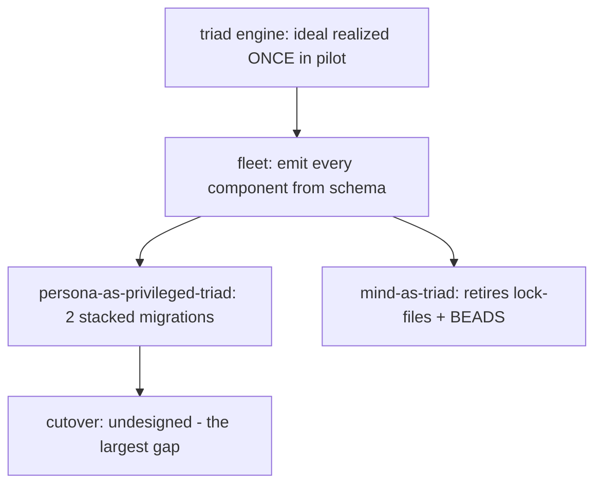

# 500.3 - The engine, the fleet, and the cutover: ideal vs current

This slice holds three things against the ideal the psyche named in record
2550 — [for each thing work out the IDEAL, the best most correct future-
oriented reusable pattern, and contrast it with WHAT WE HAVE NOW so the gap
is visible] (record 2550). The triad engine is closest to its ideal because
the spirit pilot realizes it end to end; the fleet is one proof and a vision;
the cutover is the largest gap and is genuinely undesigned.

## Thing 1 — the triad engine (Signal / Nexus / SEMA)

### The ideal

Every component's runtime is three schema-emitted execution centers, each a
schema type with the same four-position envelope shape, differing by ownership
not by authored form: **schema specifies, signal moves, sema holds.** Signal
is the string-tolerant boundary; Nexus is the decision loop; SEMA is the
durable single-writer redb state. The emitted types ARE the nouns — there is
no hand-written wire layer beside them. The decisive ideal property, landed in
the pilot, is that Nexus input and output are **asymmetric**: `NexusWork` is
the fact stream Nexus decides *from*, `NexusAction` is the command stream it
emits *next*, and `Continue(NexusWork)` is in-process typed recursion with no
round trip — the concrete form of [recursive Nexus as the universal
computation destination]. Lifecycle is addressable through generated
`on_start`/`on_stop` hooks with typed failure, wired SEMA→Nexus→Signal on
start and reversed on stop, so a supervisor can decide retry/escalate on typed
reasons.

### What we have now — the pilot realizes it

The ideal here is mostly REAL, and that is the point worth seeing. The schema
authors the asymmetric pair as positional namespace bindings
(`/git/github.com/LiGoldragon/spirit/schema/lib.schema:27-37`):

```text
NexusWork [SignalArrived SemaWriteCompleted SemaReadCompleted EffectCompleted]
  SignalArrived Input
  SemaWriteCompleted SemaWriteOutput
  SemaReadCompleted SemaReadOutput
  EffectCompleted NexusEffectResult
NexusAction [CommandSemaWrite CommandSemaRead ReplyToSignal CommandEffect Continue]
  CommandEffect NexusEffectCommand
  Continue NexusWork
```

That fragment CREATES this emitted Rust
(`/git/github.com/LiGoldragon/spirit/src/schema/lib.rs:84-117`). Note
`Continue` lowering to a type alias back onto `NexusWork` — the recursion is
typed by construction, the emitter did not hand-special-case it:

```rust
pub enum NexusWork {
    SignalArrived(SignalArrived),
    SemaWriteCompleted(SemaWriteCompleted),
    SemaReadCompleted(SemaReadCompleted),
    EffectCompleted(EffectCompleted),
}
pub type SignalArrived = Input;
// ...
pub enum NexusAction {
    CommandSemaWrite(CommandSemaWrite),
    CommandSemaRead(CommandSemaRead),
    ReplyToSignal(ReplyToSignal),
    CommandEffect(CommandEffect),
    Continue(Continue),
}
pub type ReplyToSignal = Output;
pub type Continue = NexusWork;
```

The lifecycle hooks are also emitted, not hand-written. Each of the three
engine traits carries default-no-op `on_start`/`on_stop` returning typed
failure (`/git/github.com/LiGoldragon/spirit/src/schema/lib.rs:1843-1937`):

```rust
pub trait NexusEngine {
    fn on_start(&mut self) -> Result<(), ActorStartFailure> { Ok(()) }
    fn on_stop(&mut self) -> Result<(), ActorStopFailure> { Ok(()) }
    // trace hooks ...
    fn decide(&mut self, input: nexus::Nexus<nexus::Work>) -> nexus::Nexus<nexus::Action>;
    fn execute(&mut self, input: nexus::Nexus<nexus::Work>) -> nexus::Nexus<nexus::Action> {
        self.trace_nexus_entered();
        let output = self.decide(input);
        self.trace_nexus_decided();
        output
    }
}
```

The single-flight guard is the `&mut self` borrow on `decide`/`execute`
(`spirit/ARCHITECTURE.md:177-179` — [Rust prevents two mutable executions on
the same Nexus at the same time]). The hand-written runtime objects
(`SignalActor`, `Nexus`, `Store`) implement these emitted traits; they attach
behavior to schema nouns rather than mirroring them.

### The gap

The pattern is proven exactly **once**, in the spirit pilot. The ideal is
"every component's runtime is this"; the reality is "one component's runtime
is this, and the trait/hook surface is the minimal addressable lifecycle, not
the full actor mailbox." Two concrete sub-gaps: (1) the `CommandEffect` /
`EffectCompleted` effect lane exists in the type system but the only effect is
`Stash` (`schema/lib.schema:38-43`) — the effect machinery is typed but barely
exercised; (2) the lifecycle hooks are [default no-ops in normal builds; trace
builds override them] (`spirit/ARCHITECTURE.md:82-86`) — there is no real
supervisor consuming the typed `ActorStartFailure`/`ActorStopFailure` to drive
retry/escalate. The engine is the most-ideal of the three things, and the gap
is breadth (one component) plus depth (lifecycle is addressable, not yet
supervised).

## Thing 2 — the component fleet (persona, mind, and the rest)

### The ideal

The whole fleet is emitted from schema the way spirit is today: one
`.schema` per component, lowered through schema-next, emitted by
schema-rust-next, run on triad-runtime. `persona` supervises the federation
as a regular schema-emitted triad daemon that happens to hold privileged OS
authority — engine catalog, spawn, health as its own SEMA state. `mind`
carries the work graph natively as a schema-emitted triad and thereby
**retires lock-files and BEADS** — the transitional coordination substrate the
vision exists to replace (`mind/ARCHITECTURE.md`: [lock files are a temporary
workspace coordination mechanism that will be retired by the orchestrate/mind
stack]). The fleet (router, message, harness, terminal, introspect, upgrade)
comes up the same way; introspect is the first cross-component consumer and
comes up natively on the new stack.

### What we have now — one proof, the rest hand-written or scaffold

The fleet is the largest-by-count departure from the ideal:

- **persona** is hand-written on the **old** stack. Its Cargo manifest pulls
  the hand-authored contract crates `signal-persona`, `signal-persona-origin`,
  `signal-persona-harness` (`/git/github.com/LiGoldragon/persona/Cargo.toml:32-34`);
  there is **no `lib.schema`** in the repo, so none of its wire types are
  schema-emitted. The supervisor is real (`src/manager.rs`, `src/supervisor.rs`,
  `src/engine.rs`) but it is a Kameo `EngineManager` over the old signal-frame
  surface, and it is not yet the privileged system daemon
  (`reports/designer/499...md:103` — [PARTIAL, old stack ... not yet the
  privileged system daemon]).
- **mind** is hand-written on the old signal-mind stack: `kameo`,
  `sema-engine`, and `signal-mind` in its manifest
  (`/git/github.com/LiGoldragon/mind/Cargo.toml:20,25,29`), again **no
  `lib.schema`**. It is the destination that replaces lock-files + BEADS but
  it does not yet run as a schema-emitted triad, so [until mind runs as a
  schema-emitted triad and carries the work graph natively, we coordinate
  through lock files and .beads/] (`reports/designer/499...md:165-166`).
- **the rest** (router / message / harness / terminal / introspect / upgrade)
  are scaffold or old stack — contracts and ARCHITECTURE exist, none on the
  emitted triad (`reports/designer/499...md:108`).

### The gap

The fleet gap is the inverse of the engine gap: the engine is one component
deep and ideal; the fleet is the whole roster wide and almost entirely
pre-ideal. The load-bearing sub-gaps: (1) **mind retiring lock-files + BEADS
is gated on mind-as-triad**, which is the heaviest single migration and has
not started — so the transitional substrate AGENTS.md still depends on
(`.beads/`, `orchestrate/<lane>.lock`) cannot be retired yet; (2) **persona-as-
privileged-triad is gated on both the schema emit AND the OS-authority move** —
it is two migrations stacked, and it is the precondition for the cutover
(below). Even the pilot's own rename to production is half-done: the crate,
library, and binary are still named `spirit-next`
(`/git/github.com/LiGoldragon/spirit/Cargo.toml:2,12,16`), so "the fleet is
emitted from schema" is true for zero production components today.

## Thing 3 — the cutover (the largest gap)

### The ideal

The cutover is persona-owned, atomic, no-downtime FD-handoff upgrade
orchestration. Persona binds the stable public socket per component, accepts
client connections, and sends accepted FDs over SCM_RIGHTS to the active-
version daemon (`/git/github.com/LiGoldragon/persona/INTENT.md:124-132` —
[Persona binds the stable public socket per component ... sends accepted FDs
over SCM_RIGHTS to the active-version daemon ... Persona is off the byte path
after handoff]). The selector-flip stops being a CriomOS-home symlink edit and
becomes a persona concern; [same socket model in dev and prod, no asymmetry]
(`persona/INTENT.md:131`). Around that handoff the ideal needs three things
499 named as missing: a **contract-equivalence gate** (prove the new daemon
honours the old contract before traffic moves), a **redb data-migration path**
(the new daemon resumes the old `.sema`/`.redb` state), and a **rollback
story** (flip back on a failed equivalence or health check). Persona lands
FIRST so it orchestrates from day one (`persona/INTENT.md:59-62` — [Land
persona engine before Spirit cutover; engine orchestrates from day one]).

### What we have now — undesigned

This is the biggest gap, and 499 names it as such
(`reports/designer/499...md:209-212` — [the biggest missing piece is the
cutover mechanism, not any one component ... zero design for the switch — no
equivalence gate, no data migration, no rollback]). Concretely:

- The active-version switch today is a **manual CriomOS-home selector edit**:
  the infrastructure has version slots and a `currentDefault` selector, and
  [two edits flip it] (`reports/designer/499...md:150-151`). There is no
  persona orchestration on that path.
- Persona does **not** own the upgrade protocol. Its `src/upgrade.rs` is an
  11-line compatibility shim
  (`/git/github.com/LiGoldragon/persona/src/upgrade.rs:1-11`): [Persona no
  longer owns the upgrade handover protocol. The runtime driver ... live in
  the upgrade triad. This module keeps existing Persona store/schema code on
  stable paths while the owning implementation has moved.] The FD-handoff /
  SCM_RIGHTS mechanism is intent-and-architecture, not code on either side.
- The pilot has **no `last-version` package** to test an upgrade against
  (`spirit/ARCHITECTURE.md:357-359` — [No last-version package is exposed yet.
  That package needs a real previous release input/tag]), and the generated
  `UpgradeFrom`/`AcceptPrevious` traits [exist but nothing implements them yet]
  (`spirit/ARCHITECTURE.md:431-432`).

### The gap

The cutover has the widest ideal-to-current distance of the three: the ideal
is a complete atomic no-downtime upgrade orchestration with equivalence,
migration, and rollback; the current state is a manual symlink edit plus a
stub re-export module plus an unimplemented generated upgrade trait. It is the
one thing that is genuinely **undesigned**, not merely unbuilt — the schema
type for `AcceptPrevious` exists, but the *protocol* (who gates, who migrates,
who rolls back, in what order) is not specified anywhere as a contract. And it
is doubly-gated: it cannot land until persona-as-privileged-triad lands
(Thing 2), which itself is two stacked migrations.

## The shape of the three gaps together



The ordering is forced: the engine pattern is proven, so the next leverage is
emitting the fleet; persona must be emitted-and-privileged before the cutover
can be persona-owned; and the cutover is the only one of the three that needs
**design** before it needs **build**. The recommendation that falls out: the
cutover protocol (equivalence gate + redb migration + rollback, expressed as a
schema contract on persona) is the highest-leverage *design* gap, because
every component's eventual migration to the new stack flows through it.
