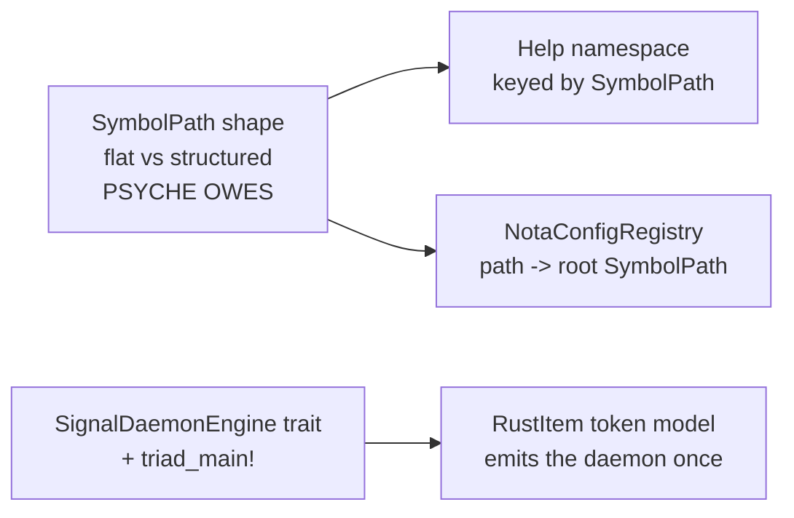

# 500.4 - Open design questions as ideal reusable patterns

The frame for every entry below: state the IDEAL — the most correct,
future-oriented, reusable pattern this thing should be — in concrete Rust,
then show WHAT WE HAVE NOW with file:line, so the gap is visible. The ideal
is the target, not the current shape (record 2550). Three of these five are
the decisions the psyche owes a nod on; SymbolPath is the one the psyche
explicitly reopened.

## Question 1 — SymbolPath: flat-plus-derived-role vs the structured record

This is the decision the psyche owns and the one report 499 §3 flagged as
**not settled**: [confirm flat, close structured] was over-read during the
certainty pass, but record 1586 — try the *structured*
component/plane/variant/payload/field form — was timestamped two minutes
*after* the flat ratification (record 1577), and the psyche said they wanted
to *see* the structured form in code before deciding. So both forms get
shown here in compiling Rust, weighed, and a reasoned ideal offered — the
psyche decides on the code, not the prose.

### What we have now — flat Vec<Name> + schema-derived role (1577, landed)

The stored path is a plain segment vector. The structural role is *not*
encoded in the type; it is recovered by asking the schema where the path
lands:

```rust
// schema-next/src/asschema.rs:85-86 — the landed shape
#[derive(rkyv::Archive, rkyv::Serialize, rkyv::Deserialize, Clone, Debug, Eq, Hash, PartialEq)]
pub struct SymbolPath(Vec<Name>);

// schema-next/src/asschema.rs:88-105 — role lives in a SEPARATE borrowed enum
pub enum SymbolPathPosition<'path> {
    Type { type_name: &'path Name },
    RootVariant { root_name: &'path Name, variant_name: &'path Name },
    Field { type_name: &'path Name, field_name: &'path Name },
    EnumVariant { enum_name: &'path Name, variant_name: &'path Name },
}
```

The role is read back by matching the path's segment slice against the
schema — `belongs_to` then a slice match guarded by `type_named` /
`root_named` / `has_field_named`:

```rust
// schema-next/src/asschema.rs:332-374 — the recovery, schema-derived not arity-guessed
pub fn symbol_path_position<'path>(
    &self,
    path: &'path SymbolPath,
) -> Option<SymbolPathPosition<'path>> {
    if !path.belongs_to(&self.identity) {
        return None;
    }
    match path.local_segments() {
        [type_name] if self.type_named(type_name.as_str()).is_some() =>
            Some(SymbolPathPosition::Type { type_name }),
        [root_name, variant_name]
            if self.root_named(root_name.as_str())
                .is_some_and(|root| root.has_variant(variant_name)) =>
            Some(SymbolPathPosition::RootVariant { root_name, variant_name }),
        [type_name, field_name]
            if self.type_named(type_name.as_str())
                .is_some_and(|d| d.has_field_named(field_name)) =>
            Some(SymbolPathPosition::Field { type_name, field_name }),
        // ... EnumVariant arm, then `_ => None`
    }
}
```

The honest property to see: a `[root_name, variant_name]` slice and a
`[type_name, field_name]` slice are **the same shape**. The flat path
cannot tell them apart on its own — only the schema can, by checking
whether `root_named` or `type_named` matches. That is the role-opacity cost,
and it is structural, not incidental.

### The structured alternative the psyche asked to see (1586, unresolved)

The structured record carries the role inline as named fields. No separate
position enum, no schema needed to read the role back. Proposed concrete
shape:

```rust
// PROPOSED — schema-next/src/asschema.rs : the structured form (1586)
#[derive(rkyv::Archive, rkyv::Serialize, rkyv::Deserialize, Clone, Debug, Eq, Hash, PartialEq)]
pub struct SymbolPath {
    component: Name,
    position: SymbolPosition,
}

#[derive(rkyv::Archive, rkyv::Serialize, rkyv::Deserialize, Clone, Debug, Eq, Hash, PartialEq)]
pub enum SymbolPosition {
    Type { type_name: Name },
    RootVariant { root_name: Name, variant_name: Name },
    Field { type_name: Name, field_name: Name },
    EnumVariant { enum_name: Name, variant_name: Name },
}

impl SymbolPath {
    // role is OWNED, not recovered — no schema, no Option, total
    pub fn position(&self) -> &SymbolPosition { &self.position }

    pub fn component(&self) -> &Name { &self.component }

    pub fn field_path(component: Name, type_name: Name, field_name: Name) -> Self {
        Self { component, position: SymbolPosition::Field { type_name, field_name } }
    }
}
```

Note what changes at the call sites: the constructor still names the role
(`field_path`, `root_variant_path`) — *that information already exists at
construction time in both designs* (asschema.rs:150-164 builds each path
from a method that already knows which kind it is). The structured form
simply **keeps** that known role instead of discarding it into a flat vector
and re-deriving it later.

### Weighing the two — the axes the psyche cares about

**Correctness.** Structured wins. `symbol_path_position` returns
`Option` and can return `None` (asschema.rs:373, `_ => None`) for a path
that is well-formed but whose schema is absent or stale — a path that knows
it is a `Field` can never be in that state. The flat form makes role a
*query that can fail*; the structured form makes it a *fact that is owned*.
The `[root,variant]`-vs-`[type,field]` ambiguity above is the concrete
correctness hole: two distinct roles share one segment shape, resolved only
by a schema the path does not carry.

**Future-orientation.** This is the flat form's real argument, and it is the
one that swayed report 496. A flat `Vec<Name>` can grow a *third* segment
(component / type / field / sub-field) **without changing the binary
object** — the rkyv archive is unchanged, old data still decodes. The
structured enum bakes the position arity into the type: adding a deeper
position is a new enum variant and an archive-layout change. For a schema
substrate whose grammar is *explicitly still settling* (record 499 names the
grammar as in-flux), the form that absorbs grammar growth without a
migration is genuinely attractive.

**Reusability across the stack.** Tie, leaning structured. SymbolPath is
meant to be the *one identity space* the trace, help, and emission consumers
all key on (records 1506/1507: [the path mechanism is canonical, not
per-design]). A help namespace keyed by SymbolPath (Question 4) wants to
answer "what role is this symbol" *without* loading the schema — a trace
event crossing the wire to a viewer that has no Asschema in hand cannot call
`symbol_path_position`. The structured form is self-describing across that
boundary; the flat form is not.

**Role-opacity across boundaries.** Structured wins decisively, and this is
the axis report 496 itself named as the flat form's one true weakness: [a
bare SymbolPath cannot report its own role]. Every consumer downstream of
`schema-next` that does not also hold the Asschema gets an opaque vector. As
the path travels — schema-next emits it, trace frames it, a viewer renders
it, help indexes it — the flat form sheds its meaning at the first boundary
that lacks the schema; the structured form carries it the whole way.

### The reasoned ideal

The decisive consideration is the **identity-across-the-stack** intent
(1506/1507) combined with the boundary-opacity cost. SymbolPath's *whole
purpose* is to be the shared identity that crosses repo boundaries into
trace, help, and emission — and exactly at those boundaries the flat form
goes mute, because the schema that would re-derive its role stays behind in
schema-next. A canonical identity that loses its meaning the moment it
leaves its home crate is not yet canonical.

So my reasoned ideal is the **structured record (1586)**, with one
refinement that recovers the flat form's only real win: keep the `component`
+ `position` shape, but make the leaf of each position a small **vector of
trailing segments** rather than a fixed pair, so deeper schema positions
grow inside a variant without a new top-level variant:

```rust
// PROPOSED ideal — structured identity, growth-tolerant leaf
pub enum SymbolPosition {
    Type { type_name: Name },
    Member { owner: Name, member: Name, rest: Vec<Name> }, // Field|RootVariant|EnumVariant share this
    // ... role distinguished by an owned `kind: MemberKind` discriminant, not by arity
}
```

This pays the structured form's correctness and boundary tax while keeping
the flat form's "grow a segment without a migration" property in the `rest`
vector. It is more code than flat and is a real binary-shape change from
what is landed — which is exactly why the psyche owes the call. The
honest counter the psyche may prefer: flat is *landed, tested, and
working*, and the role-opacity cost only bites once a second consumer
actually reads SymbolPath across a boundary — which has not happened yet
(report 496: SymbolPath is constructed and read only inside schema-next
today). If the psyche weights "do not churn working code until a real
consumer forces it," flat-confirmed is defensible. **This is the decision
to make; the code above is what to decide on.**

## Question 2 — the runner: SignalDaemonEngine + SignalDaemon<Engine>

### What we have now — hand-written per daemon

Every schema-derived daemon will hand-write the same socket-bind +
accept-loop. `spirit` writes all of it; only two lines are
component-specific:

```rust
// spirit/src/daemon.rs:152-173 — every future daemon copies this verbatim
pub fn run(&self) -> Result<(), DaemonError> {
    if let Some(parent) = self.configuration.socket_path().parent() {
        fs::create_dir_all(parent)?;
    }
    self.remove_stale_socket()?;
    let listener = UnixListener::bind(self.configuration.socket_path())?;
    let mut engine = self.engine()?;          // <-- component-specific
    engine.start()?;
    let engine = Arc::new(engine);
    for stream in listener.incoming() {
        match stream {
            Ok(stream) => {
                let engine = Arc::clone(&engine);
                if let Err(error) = self.handle_stream(stream, &engine) { // handle() component-specific
                    eprintln!("spirit-next-daemon: {error}");
                }
            }
            Err(error) => return Err(DaemonError::Io(error)),
        }
    }
    Ok(())
}
```

The crucial confirmation from reading the real `Engine`: its methods already
match the trait below exactly. `Engine::start(&mut self) -> Result<(),
ActorStartFailure>` (engine.rs:93) and `Engine::handle(&self, input: Input)
-> signal_plane::Signal<Output>` (engine.rs:114) are the trait's two methods
in all but name. The trait is not aspirational — the pilot already conforms.

### The ideal reusable pattern

```rust
// PROPOSED triad-runtime — the engine the component plugs in
pub trait SignalDaemonEngine {
    type Input;
    type Output;
    type Error: std::error::Error + 'static;
    fn start(&mut self) -> Result<(), Self::Error>;
    fn handle(&self, input: Self::Input) -> Self::Output;
}

// PROPOSED triad-runtime — the generic loop, written ONCE
pub struct SignalDaemon<Engine: SignalDaemonEngine> {
    socket_path: SocketPath,
    engine: Engine,
}

impl<Engine: SignalDaemonEngine> SignalDaemon<Engine>
where
    Engine::Input: NotaDecode + RkyvDecode,
    Engine::Output: SignalReply,
{
    pub fn run(mut self) -> Result<(), SignalDaemonError<Engine::Error>> {
        self.socket_path.ensure_parent()?;
        self.socket_path.remove_stale()?;
        let listener = UnixListener::bind(self.socket_path.as_path())?;
        self.engine.start().map_err(SignalDaemonError::Engine)?;
        let engine = Arc::new(self.engine);
        for stream in listener.incoming() {
            let stream = stream?;
            let engine = Arc::clone(&engine);
            if let Err(error) = Self::handle_stream(stream, &engine) {
                eprintln!("signal-daemon: {error}");
            }
        }
        Ok(())
    }
}
```

with an optional `triad_main!` macro that wires `from_environment` ->
`Configuration` -> `SignalDaemon::new(config, engine).run()` so a component's
`bin/<name>-daemon.rs` is three lines. The trait is the load-bearing
abstraction; the macro is sugar over it.

### Gap and the call the psyche owes

Today `triad-runtime` exposes **only trace** (`lib.rs` re-exports
`TraceClient`/`TraceFrame`/… and nothing else; there is no runner module).
The shape is ratified (1574/1581) but unbuilt. The standing recommendation
(report 496 Decision 1): ratify the *shape* now so `spirit`'s runner is
written as the reference, but do **not** extract into triad-runtime until a
*second* consumer (`upgrade` or `repository-ledger`) needs it — premature
extraction with one consumer bakes in the wrong seams. The psyche's call:
extract now (pin the macro design early) or on the second consumer.

## Question 3 — the RustItem token model

### What we have now — 504 self.line calls with hand-counted indentation

The emitter builds Rust by calling one primitive, `self.line(...)`, **504
times** (`schema-rust-next/src/lib.rs`), counting indentation by hand. The
writer's only primitive:

```rust
// schema-rust-next/src/lib.rs:828-831 — the one tool the emitter has
fn line(&mut self, line: impl AsRef<str>) {
    self.output.push_str(line.as_ref());
    self.output.push('\n');
}
```

The cost is visible as literal *duplication of an entire match body with its
indentation hand-counted twice*. `emit_route_impl` and `emit_signal_frame_impl`
emit the **identical** `route()` match, arm for arm, each spelling out the
12-space `"            Self::..."` by hand:

```rust
// schema-rust-next/src/lib.rs:1366-1388 — emit_route_impl
self.line(format!("    pub fn route(&self) -> {route_name} {{"));
self.line("        match self {");
for variant in declaration.variants() {
    match variant.payload() {
        Some(_) => self.line(format!(
            "            Self::{}(_) => {route_name}::{},",
            variant.name(), variant.name())),
        None => self.line(format!(
            "            Self::{} => {route_name}::{},",
            variant.name(), variant.name())),
    }
}
self.line("        }");

// schema-rust-next/src/lib.rs:1390-1410 — emit_signal_frame_impl: the SAME block, copied
self.line(format!("    pub fn route(&self) -> {route_name} {{"));
self.line("        match self {");          // identical 8-space
// ... identical 12-space arms, character for character ...
```

This is the strongest this-code-creates-this-code pairing in the slice. That
emitter code produces, in the checked-in `spirit/src/schema/lib.rs:1110-1120`:

```rust
impl Input {
    pub fn route(&self) -> InputRoute {
        match self {
            Self::Record(_) => InputRoute::Record,
            Self::Observe(_) => InputRoute::Observe,
            Self::Lookup(_) => InputRoute::Lookup,
            // ... one arm per variant
        }
    }
```

The 12 spaces in the output are 12 spaces *typed into the emitter as a
string literal*. A miscount is a compile error in generated code that no
type system in `schema-rust-next` can catch.

### The ideal token model

A small typed item tree the writer renders once, owning indentation depth so
no literal `"    "` ever appears in emitter logic:

```rust
// PROPOSED schema-rust-next — items, not strings
pub enum RustItem {
    Use(String),
    TypeAlias { name: Name, target: String },
    Struct(RustStruct),
    Enum(RustEnum),
    ImplBlock(RustImplBlock),
}

pub struct RustImplBlock {
    target: String,
    methods: Vec<RustMethod>,
}

pub struct RustMethod {
    signature: String,
    body: Vec<RustStatement>,   // including RustMatch
}

pub enum RustStatement {
    Line(String),
    Match(RustMatch),
}

pub struct RustMatch {
    scrutinee: String,
    arms: Vec<(String, String)>, // (pattern, expression)
}

impl RustWriter {
    // the ONLY place indentation exists — depth is data, never a literal
    fn render(&mut self, item: &RustItem, depth: usize) {
        let pad = "    ".repeat(depth);
        // ... recurse, incrementing depth for nested bodies
    }
}
```

With this, `route()` is built **once** as a `RustMatch` value and reused for
both impls; the four-space miscount becomes structurally impossible because
no emitter method ever writes a space. This is the honest completion of the
repo's own stated intent: [Rust emission is data before it is text; the
emitter maps Asschema into a typed RustModule, and rendering RustModule
produces RustCode] — the *type declarations* already honor it (they are real
`RustEnum`/`RustStruct` data, lib.rs:88-147), but the ~80% that is impl
blocks and match arms never reaches a data model.

### Gap and the call

Ratified in intent (1576/1584), unbuilt. The psyche's call (report 496
Decision 2): near-term operator priority, or parked until the grammar
settles, since the emitter changes whenever the grammar does. The lean is
yes-ratify; it makes the miscounts impossible and dissolves the verbatim
duplication shown above.

## Question 4 — the help / description namespace

### What we have now — missing

No component answers `(Help …)` on the new stack. The raw materials exist —
the spirit schema *has* `Description` and `Topic` as types, and they emit:

```rust
// spirit/src/schema/lib.rs:206-210 — emitted, but only as RECORD payload fields
pub type Topic = String;
pub type Topics = Vec<Topic>;
pub type Description = String;
```

But these describe *records the user stores*, not *the schema's own
symbols*. There is no namespace that maps a SymbolPath to its human
description, and no generated default text for an undocumented symbol.

### The ideal — a mirror namespace keyed by SymbolPath

Description is schema data living in a *parallel* namespace, authored
alongside the type schema and emitted into the same identity space:

```text
# PROPOSED spirit/schema/lib.help — a mirror schema, positional NOTA
{
  (SymbolPath [spirit Record])        [Append a record to the intent log.]
  (SymbolPath [spirit Record Entry])  [The record payload — topics, kind, magnitude, privacy.]
  (SymbolPath [spirit Query])         [Filter over the log by topic match, kind, and privacy.]
}
```

emitting a generated registry whose lookups are total — a symbol with no
authored entry gets a *generated default* from its SymbolPath, never a
missing key:

```rust
// PROPOSED schema-rust-next emission — the mirror, keyed by the canonical identity
pub struct DescriptionNamespace {
    entries: BTreeMap<SymbolPath, Description>,
}

impl DescriptionNamespace {
    pub fn describe(&self, path: &SymbolPath) -> Description {
        self.entries
            .get(path)
            .cloned()
            // generated default from the path's own role + name — total, never None
            .unwrap_or_else(|| Self::default_description(path))
    }
}
```

This is the sharpest argument *for* the structured SymbolPath in Question 1:
`default_description` wants the symbol's **role** to phrase a sensible
default ("the `Record` operation root", "the `Entry` payload type"), and a
structured path carries that role without re-loading the schema; a flat path
forces a schema round-trip inside what should be a pure lookup.

### Gap and the call

Designed (report 499 names it), unbuilt. No decision strictly owed — but the
shape interacts with Question 1: if the psyche picks structured SymbolPath,
this namespace is cleaner. Worth deciding the two together.

## Question 5 — NOTA config-by-convention

### What we have now — a starts_with('(') string sniff + an env var

The CLI hand-rolls argument interpretation: it sniffs the first character to
guess inline-NOTA vs file, has **no rkyv-file branch at all**, and reads its
socket path from an environment variable — exactly the ad-hoc configuration
the single-argument rule is meant to dissolve:

```rust
// spirit/src/bin/spirit-next.rs:51-59 — the sniff
fn read_single_argument(&self, argument: &str) -> Result<String, Box<dyn std::error::Error>> {
    if argument.trim_start().starts_with('(') {
        Ok(argument.to_owned())
    } else if Path::new(argument).exists() {
        Ok(fs::read_to_string(argument)?)
    } else {
        Err("inline operation must be a parenthesized NOTA value".into())
    }
}

// spirit/src/bin/spirit-next.rs:32-33 — config smuggled in through the environment
let socket_path = env::var("SPIRIT_NEXT_SOCKET")
    .unwrap_or_else(|_| String::from("/tmp/spirit-next.sock"));
```

Two problems the ideal fixes: the `starts_with('(')` sniff is a string
heuristic standing in for a typed argument sum, and `SPIRIT_NEXT_SOCKET` is
configuration arriving through a side channel rather than through the one
NOTA argument.

### The ideal — a NotaConfigRegistry mapping path -> root type

A typed argument sum replaces the sniff, and a registry resolves a config
*path* to the *root type* that should decode it — config-by-convention,
where the convention is "this path holds this schema root":

```rust
// PROPOSED triad-runtime — the argument is a typed sum, never a char sniff
pub enum ComponentArgument {
    InlineNota(String),
    NotaFile(PathBuf),
    RkyvFile(PathBuf),   // the branch the current code lacks entirely
}

impl ComponentArgument {
    pub fn classify(raw: &str) -> Self { /* one place, typed, testable */ }
}

// PROPOSED — path convention resolves to a root type, no env vars
pub struct NotaConfigRegistry {
    roots: BTreeMap<ConfigPath, SymbolPath>, // path -> the schema root that decodes it
}

impl NotaConfigRegistry {
    pub fn root_for(&self, path: &ConfigPath) -> Option<&SymbolPath> {
        self.roots.get(path)
    }
}
```

so a daemon's whole configuration — socket path included — arrives as one
NOTA value at one of the convention paths, decoded by the root the registry
names, with zero `env::var` and zero `starts_with`.

### Gap and the call

Designed (report 499 names it), unbuilt; the related `ComponentArgument`
typed sum is already a recommended operator cleanup in report 496 §"smaller
abstractions" (the single-NOTA-argument rule hand-rolled twice with
divergent error vocabularies). No ratification strictly owed — operator
cleanup once the runner lands, since both live in triad-runtime.

## The picture in one diagram



The two clusters: SymbolPath is the keystone the help namespace and the
config registry both build on, so its shape should be decided first; the
runner and the token model are the emission half, where the token model
emits the daemon the runner trait abstracts. SymbolPath is the one true
decision; the rest are ratify-or-defer leans.
