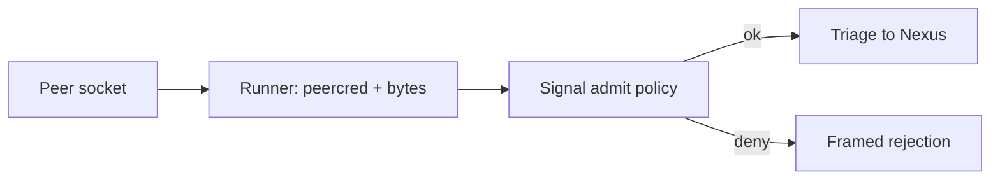

# Admission as a SignalEngine trait method

## The question

Admission today is `SignalActor::admit` — an **inherent** method on the
concrete `SignalActor`, called by the daemon composer (`Engine::handle`).
It is NOT part of the schema-emitted `SignalEngine` trait contract. The
question: should admission policy (origin/identifier minting + frame
validation) become a `SignalEngine` **trait method**, schema-emitted per
component, or stay runner-owned bookkeeping that each daemon hand-writes?

The strict-separation constraint (record 2560): [SEMA owns all state,
Nexus all decisions, Signal all communication, nothing leaking into the
daemon]. Admission IS communication-boundary policy — who gets in, what
identity is minted, validation at the edge. By 2560 that belongs in the
Signal engine. But admission needs **connection context** (a
peercred-derived origin) that only the socket-owning runner holds. So the
resolution is a **split**, not a move.

## What happens today (verbatim)

### Admission is an inherent method, not on the trait

`src/engine.rs:174` — the admit method lives in `impl SignalActor`, NOT in
`impl SignalEngine for SignalActor`:

```rust
// src/engine.rs:172-190
/// Admit a wire Input: mint the origin route, issue a message
/// identifier, and validate against the schema-emitted rules.
pub fn admit(&self, input: Input) -> Result<SignalAccepted, SignalRejected> {
    let origin_route = self.issue_origin_route();
    let signal_input = input.with_origin_route(origin_route);
    let identifier = self.issue_message_identifier();
    if let Err(validation_error) = signal_input.root().validate() {
        return Err(SignalRejected {
            origin_route,
            validation_error,
        });
    }
    #[cfg(feature = "testing-trace")]
    self.trace_signal_admitted();
    Ok(SignalAccepted {
        sent: signal_input.message_sent(identifier),
        input: signal_input,
    })
}
```

### The composer calls admit by hand

`src/engine.rs:114-128` — `Engine::handle` is the hand-written composer.
It calls `self.signal_actor.admit(input)` as a concrete method, branching
on the rejection by hand:

```rust
// src/engine.rs:114-128
pub fn handle(&self, input: Input) -> signal_plane::Signal<Output> {
    let accepted = match self.signal_actor.admit(input) {
        Ok(accepted) => accepted,
        Err(rejected) => {
            let output = rejected.into_signal_output(self.database_marker());
            #[cfg(feature = "testing-trace")]
            self.signal_actor.trace_signal_rejected();
            #[cfg(feature = "testing-trace")]
            self.signal_actor.trace_signal_replied();
            return output;
        }
    };
    let mut nexus = self.nexus.lock().expect("nexus lock");
    accepted.process_with(&self.signal_actor, &mut nexus)
}
```

### The schema-emitted SignalEngine trait does NOT mention admit

`src/schema/lib.rs:1843-1879` — the emitted contract has `on_start`,
`on_stop`, the trace hooks, `triage_inner`/`reply_inner`, and the
defaulted `triage`/`reply`. There is **no `admit`**:

```rust
// src/schema/lib.rs:1843-1879
pub trait SignalEngine {
    fn on_start(&mut self) -> Result<(), ActorStartFailure> { Ok(()) }
    fn on_stop(&mut self) -> Result<(), ActorStopFailure> { Ok(()) }
    // ... trace hooks ...
    fn triage_inner(&self, input: signal::Signal<signal::Input>) -> nexus::Nexus<nexus::Work>;
    fn reply_inner(&self, output: nexus::Nexus<nexus::Action>) -> signal::Signal<signal::Output>;
    fn triage(&self, input: signal::Signal<signal::Input>) -> nexus::Nexus<nexus::Work> { /* +trace */ }
    fn reply(&self, output: nexus::Nexus<nexus::Action>) -> signal::Signal<signal::Output> { /* +trace */ }
}
```

So `triage` and `reply` (the Signal/Nexus boundary) are on the contract,
but `admit` (the wire/Signal boundary) is not. Admission is the only
communication-boundary act left off the engine.

### "Origin" today is a counter, not connection identity

There is **no peercred anywhere** — `grep peercred src/` is empty. The
"origin route" is a monotonic counter minted inside the actor:

```rust
// src/engine.rs:201-205
fn issue_origin_route(&self) -> OriginRoute {
    let mut next = self.next_origin_route.lock().expect("origin route lock");
    *next += 1;
    OriginRoute(ORIGIN_ROUTE_BASE + *next)
}
```

And `InputRoute` is the **operation discriminant** (Record/Observe/Lookup),
NOT connection identity — `src/schema/lib.rs:1111-1118`. The daemon reads
the frame and throws the transport route away entirely:

```rust
// src/daemon.rs:139-145
fn handle_stream(&self, stream: UnixStream, engine: &Engine) -> Result<(), DaemonError> {
    let mut transport = SignalTransport::new(stream);
    let (_route, input) = transport.read_input()?;   // _route discarded
    let output = engine.handle(input);
    transport.write_output(output.root())?;
    Ok(())
}
```

The `stream` — the one object that knows the peer — never reaches admission.
The peer's real identity is structurally unavailable to policy today.

### Validation predicates are free-standing inherent methods

`src/engine.rs:334-376` — validation is split across inherent `impl`
blocks (`Input`, `Entry`, `Query`, `TopicMatch`), reached via
`signal_input.root().validate()` inside `admit`:

```rust
// src/engine.rs:334-358
impl Input {
    pub fn validate(&self) -> Result<(), ValidationError> {
        match self {
            Self::Record(record) => record.validate(),
            Self::Observe(observe) => observe.validate(),
            Self::Lookup(_) | Self::Remove(_) | Self::LookupStash(_) => Ok(()),
            Self::Count(count) => count.validate(),
        }
    }
}
impl Entry {
    pub fn validate(&self) -> Result<(), ValidationError> {
        if self.topics.is_empty() { return Err(ValidationError::EmptyTopic); }
        if self.topics.iter().any(|topic| topic.trim().is_empty()) {
            return Err(ValidationError::EmptyTopic);
        }
        if self.description.trim().is_empty() {
            return Err(ValidationError::EmptyDescription);
        }
        Ok(())
    }
}
```

These predicates are correct, but they hang off the data types rather than
the Signal contract. The schema declares the data shape; it does not yet
declare "these are the admission rules for this component."

### The runner that would own connection context does not exist

`triad_main!` (ratified records 1574/1581) is **unbuilt**: `grep triad_main`
in `triad-runtime/src/` is empty — there is no macro, no accept loop, no
`ConnectionContext`. The accept loop is hand-written in `daemon.rs:106-116`,
spawning nothing and passing the bare `stream` into `handle_stream`. This
is exactly why the question is a now-decision: the runner contract is about
to be written, and where admission sits decides what the runner must pass.

## What I suggest: the split, with admit on the trait

Admission is two acts welded together in `admit` today:

1. **Connection facts** — who is the peer (peercred -> uid/gid/pid), what
   raw bytes arrived. Only the socket-owning runner can produce these.
2. **Admission policy** — validate the origin against the contract, mint
   the component identifier, validate the decoded frame against the
   schema rules. This is pure Signal-engine policy.

Record 2560 says all communication policy lives in Signal. The peercred
read is not policy — it is a fact-gathering act the runner performs because
only the runner holds the `UnixStream`. So:

- **Runner** produces `ConnectionContext` (peercred facts) and `RawInput`
  (the frame bytes) — fact-gathering, no policy.
- **`SignalEngine::admit`** applies policy: validate origin, mint the
  identifier, decode + validate the frame, return `Admitted` or `Rejection`.

This puts the communication-boundary act ON the schema-emitted contract
(satisfying 2560) without dragging socket I/O into the engine (satisfying
strict separation the other direction — the engine never touches a fd).

### The proposed trait method

```rust
// src/schema/lib.rs — added to the emitted SignalEngine trait
pub trait SignalEngine {
    // ... on_start / on_stop / trace hooks / triage / reply unchanged ...

    /// Apply admission policy at the communication boundary.
    ///
    /// The runner supplies the connection facts (peercred-derived origin,
    /// raw frame bytes); the engine applies POLICY — validate the origin
    /// against the contract, mint the component identifier, decode and
    /// validate the frame. The engine never touches a file descriptor.
    fn admit(
        &self,
        context: ConnectionContext,
        input: RawInput,
    ) -> Result<Admitted, Rejection>;
}
```

`ConnectionContext` and `RawInput` are schema-emitted Signal types — the
connection-fact side of the Signal contract:

```rust
// src/schema/lib.rs — new emitted Signal boundary types
#[derive(Clone, Debug)]
pub struct ConnectionContext {
    /// peercred uid of the connecting peer.
    pub peer_user: Integer,
    /// peercred gid of the connecting peer.
    pub peer_group: Integer,
    /// peercred pid of the connecting peer.
    pub peer_process: Integer,
}

#[derive(Clone, Debug)]
pub struct RawInput {
    /// The undecoded length-prefixed frame body.
    pub frame: FrameBody,
}

#[derive(Debug)]
pub struct Admitted {
    input: signal::Signal<Input>,
    sent: MessageSent,
}

#[derive(Debug)]
pub struct Rejection {
    origin_route: OriginRoute,
    cause: RejectionCause,
}

/// Both the wire-shape failures (origin denied, undecodable frame) and the
/// contract-rule failures (empty topic, empty description) are one emitted
/// rejection enum — admission speaks ONE failure vocabulary.
#[derive(Clone, Debug)]
pub enum RejectionCause {
    OriginDenied(OriginPolicyError),
    Undecodable(SignalFrameError),
    Invalid(ValidationError),
}
```

### The concrete impl on SignalActor

```rust
// src/engine.rs — admit moves INTO impl SignalEngine for SignalActor
impl SignalEngine for SignalActor {
    fn admit(
        &self,
        context: ConnectionContext,
        input: RawInput,
    ) -> Result<Admitted, Rejection> {
        // 1. Policy on the origin: mint identity from the verified peer.
        let origin_route = self.mint_origin(&context)?;          // was issue_origin_route()
        // 2. Decode the frame the runner handed us (no fd here).
        let decoded = Input::decode_signal_frame(input.frame.as_bytes())
            .map_err(|frame_error| Rejection::undecodable(origin_route, frame_error))?;
        let signal_input = decoded.with_origin_route(origin_route);
        let identifier = self.issue_message_identifier();
        // 3. Validate the decoded frame against schema-emitted rules.
        if let Err(validation_error) = signal_input.root().validate() {
            return Err(Rejection::invalid(origin_route, validation_error));
        }
        #[cfg(feature = "testing-trace")]
        self.trace_signal_admitted();
        Ok(Admitted {
            sent: signal_input.message_sent(identifier),
            input: signal_input,
        })
    }
}
```

The validation predicates (`Input::validate`, `Entry::validate`, …) stay
where they are as schema-emitted methods on the data types, but they are
now reached *only* through the trait's `admit` — the contract owns the
admission act, the data types own their shape rules.

### The generic runner calling it

The unbuilt `triad_main!` runner becomes generic over `SignalEngine`. It
owns the fd, reads peercred, frames bytes, and calls the trait — it knows
nothing about Spirit-specific policy:

```rust
// triad-runtime — the generic accept loop the runner emits
impl<Engine: SignalEngine> Runner<Engine> {
    fn serve_connection(&self, engine: &Engine, stream: UnixStream) -> Result<(), RunnerError> {
        let context = ConnectionContext::from_peercred(&stream)?;  // runner-only: reads SO_PEERCRED
        let frame = LengthPrefixedCodec::default().read_body(&mut stream)?;
        let reply = match engine.admit(context, RawInput::new(frame)) {
            Ok(admitted) => engine.dispatch(admitted),            // -> triage/execute/reply
            Err(rejection) => engine.frame_rejection(rejection),
        };
        LengthPrefixedCodec::default().write_body(&mut stream, &reply)?;
        Ok(())
    }
}
```

`ConnectionContext::from_peercred` is the ONLY new place a syscall lives,
and it lives in the runner, never in the engine. Compare to today's
`daemon.rs:139` which discards `_route` and never reads the peer at all.

### The schema declaring admission per component

A year out, each component's contract declares its admission and validation
in NOTA, and the engine + rejection vocabulary are emitted from it — no
hand-written `admit`:

```text
(SignalContract
  (Admission
    (Origin peercred (Allow (Group spirit)))
    (Mint OriginRoute)
    (Validate Input))
  (Validation
    (Record (NonEmpty topics) (NonEmpty description))
    (Observe (NonEmpty topics))))
```

This emits the `admit` impl, the `RejectionCause` enum, and the per-root
validate predicates — the same way `triage`/`reply` are emitted today.
Policy becomes a schema fact, type-checked at the boundary.

## Time-horizon: is this in one year?

**This is a now-decision, not a one-year thing.** The runner contract
(`triad_main!`) is being written right now, and the runner's signature is
exactly what this question settles: does the runner pass a bare `Input`
into a hand-written composer (status quo, admission stays bookkeeping), or
does it pass `ConnectionContext` + `RawInput` into `SignalEngine::admit`
(admission on the contract)? You cannot write the generic runner without
answering this, because the answer IS the runner's parameter list. Deciding
later means writing the runner twice.

**What it looks like a year out, engine whole:** every component (spirit and
its successors) declares its admission policy in its NOTA contract — origin
rule, identity minting, frame validation — and the triad codegen emits
`SignalEngine::admit`, the `RejectionCause` enum, and the validate
predicates. `triad_main!` is one generic runner shared across all
components: it reads peercred, frames bytes, calls `engine.admit`, and never
contains a line of component-specific policy. Admission is type-checked at
the boundary, identical in shape across components, and the daemon (the
thing 2560 says must stay empty) holds zero admission logic — it is the
generic runner plus the three emitted engines. The hand-written
`Engine::handle` composer and the discarded-`_route` `handle_stream`
both disappear.

## Admission flow (split: runner facts, engine policy)



## Risks and the one real objection

The strongest counter-argument for keeping admission runner-owned: minting
identity needs the peer, the peer lives on the fd, the fd lives in the
runner — so "just do it in the runner." The split answers this precisely:
the runner does the part that needs the fd (read peercred), the engine does
the part that is policy (decide whether that peer is allowed, mint the
route, validate the frame). The seam is `ConnectionContext` — a small
emitted value carrying facts, not capabilities. The engine receives facts
and applies rules; it never receives a file descriptor. That is the line
2560 draws, drawn at the right place.
