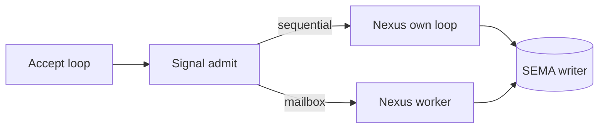

# Question 2 — sequential single-flight runner vs generated actor mailbox

## The question, concretely

The spirit pilot daemon today serves one request at a time. Two
mechanisms enforce that: a synchronous accept loop in `daemon.rs`, and a
`&mut Nexus` exclusive borrow on the decision path that makes two
concurrent executions a literal compile error. The runner that the triad
contract eventually wants (`triad_main!`, ratified 1574/1581) is unbuilt;
the accept loop is hand-written.

The choice: keep the single-flight runner as the daemon's permanent
shape, or have the generated runner turn Nexus into an actor with a
mailbox so the daemon can admit and triage many signals concurrently
while SEMA stays a single ordered writer.

## Today's code — sequential single-flight, verbatim

### The accept loop is synchronous

`spirit/src/daemon.rs:106` — `listener.incoming()` is a blocking
iterator, and `handle_stream` runs to completion before the next
`stream` is pulled. One connection is fully served (read input, run the
engine, write output) before the next is even accepted off the queue.

```rust
// spirit/src/daemon.rs:106
for stream in listener.incoming() {
    match stream {
        Ok(stream) => {
            let engine = Arc::clone(&engine);
            if let Err(error) = self.handle_stream(stream, &engine) {
                eprintln!("spirit-next-daemon: {error}");
            }
        }
        Err(error) => return Err(DaemonError::Io(error)),
    }
}
```

```rust
// spirit/src/daemon.rs:139
fn handle_stream(&self, stream: UnixStream, engine: &Engine) -> Result<(), DaemonError> {
    let mut transport = SignalTransport::new(stream);
    let (_route, input) = transport.read_input()?;
    let output = engine.handle(input);
    transport.write_output(output.root())?;
    Ok(())
}
```

### The `&mut Nexus` borrow is the single-flight guard

`Engine` holds the Nexus behind a `Mutex` (`spirit/src/engine.rs:26`),
and `handle` takes the lock for the whole decision path
(`spirit/src/engine.rs:114`):

```rust
// spirit/src/engine.rs:26
pub struct Engine {
    signal_actor: SignalActor,
    nexus: Mutex<Nexus>,
    #[cfg(feature = "testing-trace")]
    trace_log: TraceLog,
}

// spirit/src/engine.rs:114
pub fn handle(&self, input: Input) -> signal_plane::Signal<Output> {
    let accepted = match self.signal_actor.admit(input) {
        Ok(accepted) => accepted,
        Err(rejected) => {
            let output = rejected.into_signal_output(self.database_marker());
            return output;
        }
    };
    let mut nexus = self.nexus.lock().expect("nexus lock");
    accepted.process_with(&self.signal_actor, &mut nexus)
}
```

The exclusive borrow is consumed by `NexusEngine::execute`, which the
schema emits as `&mut self` (`spirit/src/schema/lib.rs:1899`):

```rust
// spirit/src/schema/lib.rs:1899 (schema-emitted NexusEngine trait)
fn execute(&mut self, input: nexus::Nexus<nexus::Work>) -> nexus::Nexus<nexus::Action> {
    self.trace_nexus_entered();
    let output = self.decide(input);
    self.trace_nexus_decided();
    output
}
```

`process_with` holds that `&mut Nexus` across the entire recursive
decision loop (`spirit/src/engine.rs:257`):

```rust
// spirit/src/engine.rs:257
pub fn process_with<Signal>(
    self,
    signal_engine: &Signal,
    nexus: &mut Nexus,
) -> signal_plane::Signal<Output>
where
    Signal: SignalEngine,
{
    self.sent
        .push_to(&mut nexus.mail_ledger().hook())
        .expect("spirit-next mail ledger is infallible");
    let identifier = self.identifier();
    let nexus_input = signal_engine.triage(self.input);
    let origin_route = nexus_input.origin_route();
    let nexus_output = NexusEngine::execute(nexus, nexus_input);   // <- exclusive borrow, whole loop
    let signal_output = signal_engine.reply(nexus_output);
    MessageProcessed::new(identifier, origin_route, signal_output.root().clone())
        .push_to(&mut nexus.mail_ledger().hook())
        .expect("spirit-next mail ledger is infallible");
    signal_output
}
```

This is the guarantee, stated by the architecture
(`spirit/ARCHITECTURE.md:177`): *[the `&mut Nexus` borrow on
`NexusEngine::execute` is the single-flight guard — Rust prevents two
mutable executions on the same Nexus at the same time]* (ARCHITECTURE.md
177). And `spirit/ARCHITECTURE.md:85` flags *[full actor mailbox and
runtime-control machinery remain future work]* (ARCHITECTURE.md 85).

### SEMA already encodes single-writer in the type system

The schema emits the SEMA write path as `&mut self` and the read path as
`&self` (`spirit/src/schema/lib.rs:1926`):

```rust
// spirit/src/schema/lib.rs:1926 (schema-emitted SemaEngine trait)
fn apply(&mut self, input: sema::Sema<sema::WriteInput>) -> sema::Sema<sema::WriteOutput> {
    let output = self.apply_inner(input);
    self.trace_sema_write_applied();
    output
}

fn observe(&self, input: sema::Sema<sema::ReadInput>) -> sema::Sema<sema::ReadOutput> {
    let output = self.observe_inner(input);
    self.trace_sema_read_observed();
    output
}
```

The recursive Nexus runner already routes through that split
(`spirit/src/nexus.rs:238`): writes go through `SemaEngine::apply(&mut
self.store, ...)`, reads through `SemaEngine::observe(&self.store, ...)`.
The single-writer guarantee is therefore NOT something the mailbox would
have to invent — SEMA's `&mut self`-write / `&self`-read split already
states it at the type level. The mailbox question is only about Nexus
concurrency upstream of SEMA.

## Option A — keep the sequential single-flight runner

The generated `triad_main!` would emit the same shape the hand-written
loop has today: accept, decode, run the full decision loop under an
exclusive Nexus borrow, reply, repeat. The only thing the generator adds
is making the loop schema-derived rather than hand-piloted.

```rust
// PROPOSED: generated triad_main! — sequential single-flight body
impl<Engine: TriadEngine> TriadRunner<Engine> {
    pub fn run(self, listener: UnixListener) -> Result<(), DaemonError> {
        let mut engine = self.engine;          // owned, not shared
        engine.start()?;
        for stream in listener.incoming() {
            let stream = stream?;
            let mut transport = SignalTransport::new(stream);
            let (_route, input) = transport.read_input()?;
            // &mut engine is the single-flight guard: one execute at a time,
            // enforced by the borrow checker, no lock needed.
            let output = engine.handle(input);
            transport.write_output(output.root())?;
        }
        Ok(())
    }
}
```

Tradeoff:

- Strongest single-flight invariant: there is literally one in-flight
  request; the borrow checker proves it, and the `Mutex<Nexus>` can be
  dropped because the runner owns Nexus exclusively.
- Strongest SEMA single-writer: trivially satisfied — only one path can
  reach `apply(&mut self, ...)` at all.
- Weakest throughput / worst tail latency: a slow request (a large
  observe that walks many records) blocks every queued request behind
  it, including cheap reads. Under bursty load, p99 latency tracks the
  slowest in-flight request times the queue depth.

## Option B — generated actor mailbox

The generated runner turns Nexus into an actor: the accept loop never
runs the decision loop inline, it only decodes the signal and enqueues a
`NexusWork` envelope (carrying its reply channel) onto a mailbox. A
single Nexus worker drains the mailbox in order. Signal admission and
triage run concurrently on the accept side; Nexus stays single-threaded;
SEMA writes stay ordered because there is exactly one Nexus draining the
queue.

```rust
// PROPOSED: generated triad_main! — actor mailbox body
pub struct NexusActor {
    nexus: Nexus,                          // owned by the one worker, no Mutex
    inbox: Receiver<Envelope>,
}

struct Envelope {
    work: nexus::Nexus<nexus::Work>,
    reply: SyncSender<signal::Signal<Output>>,   // per-request return channel
}

impl NexusActor {
    // The single ordered single-writer worker. Drains in FIFO order, so
    // SEMA apply(&mut self, ...) is reached one envelope at a time.
    fn run(mut self) {
        while let Ok(envelope) = self.inbox.recv() {
            let action = NexusEngine::execute(&mut self.nexus, envelope.work);
            let output = action.into_signal_output();
            let _ = envelope.reply.send(output);
        }
    }
}

impl<Engine: TriadEngine> TriadRunner<Engine> {
    pub fn run(self, listener: UnixListener, inbox: Sender<Envelope>) -> Result<(), DaemonError> {
        for stream in listener.incoming() {
            let stream = stream?;
            let inbox = inbox.clone();
            // Admission + triage run concurrently; only enqueue is shared.
            std::thread::spawn(move || {
                let mut transport = SignalTransport::new(stream);
                let (route, input) = transport.read_input()?;
                let (reply_tx, reply_rx) = std::sync::mpsc::sync_channel(1);
                let work = SignalActor::default().triage(input.with_origin_route(route));
                inbox.send(Envelope { work, reply: reply_tx }).ok();
                let output = reply_rx.recv().expect("nexus reply");
                transport.write_output(output.root())
            });
        }
        Ok(())
    }
}
```

Tradeoff:

- Single-flight invariant is preserved but moves from the borrow checker
  to the mailbox: Nexus still executes one envelope at a time (the worker
  is single-threaded), but the proof is now [there is exactly one Nexus
  worker draining the queue] rather than [the borrow checker forbids two
  executes]. Weaker as a static guarantee; a second worker added later
  would silently break it.
- SEMA single-writer is preserved by the same one-worker discipline —
  but only as long as there is one worker. The `apply(&mut self, ...)`
  signature still helps: a second worker can't share `&mut Nexus`, so
  the type system at least localizes where the invariant could break.
- Best throughput / tail latency under load: admission, decode, and
  triage parallelize across connections; only the decision loop
  serializes. A cheap read no longer waits on the wire I/O of the
  request ahead of it. The decision loop itself is still serial, so a
  slow `observe` still head-of-line-blocks the *Nexus* queue — the
  mailbox helps I/O concurrency, not decision concurrency.
- Cost: real concurrency machinery (threads or async, channels,
  back-pressure on a bounded mailbox, shutdown draining), all of which
  must be generated correctly and is the bulk of the unbuilt
  `triad_main!` work.

## Recommendation — stay sequential single-flight now; let the generator keep the mailbox as a future emit-mode

Keep Option A as the runner the generator emits today, and make the
mailbox a *generation mode* of the same `triad_main!`, not a rewrite.

Reasoning:

1. The strict-separation constraint (record 2560) is best served by the
   strongest possible single-flight proof. Today that proof is the
   borrow checker: SEMA owns state, Nexus owns decisions, and [two
   concurrent executions are a compile error] (ARCHITECTURE.md 177). A
   mailbox downgrades that compile-time proof to a runtime discipline
   (one worker). While the pilot is still proving the separation holds,
   keep the strongest guarantee.

2. The throughput problem the mailbox solves is not yet a real problem.
   The pilot serves a Unix socket with a single owner; the SEMA write
   path is the genuine serialization point regardless, and SEMA already
   states single-writer at the type level (`apply(&mut self)` vs
   `observe(&self)`, schema/lib.rs:1926). The mailbox parallelizes I/O
   and admission, not decisions — modest gain for the pilot's load.

3. The two options share a body. The decision loop, the SEMA split, and
   the reply framing are identical; only the *frame around* `execute`
   differs (own-and-loop vs enqueue-and-drain). So the generator can
   emit Option A now and gain Option B as a second emit-mode keyed off a
   schema field (a `concurrency` policy in the triad contract) when a
   component actually needs it — without re-deriving the engine. That
   fits [the runner is schema-derived, not hand-piloted] (operator 287,
   referenced in nexus.rs:182).

What the new code would do: replace the hand-written `daemon.rs:106`
loop and the `Mutex<Nexus>` in `engine.rs:26` with a generated
`TriadRunner::run` that owns Nexus by value and serves connections
sequentially under the borrow-checker guard. Drop the `Mutex` entirely
(it exists only because `Engine::handle` takes `&self`; a runner that
owns Nexus needs `&mut self` and no lock). Keep `process_with`'s `&mut
Nexus` signature unchanged — it already is the guard, and it is exactly
what a future mailbox worker would call.

## Future view (one year out)

The mailbox is the right shape *once a triad component is genuinely
multi-client and read-heavy* — a daemon fronting many readers where
observes dominate and a slow observe must not block cheap ones. At that
point the natural move is not the simple one-worker mailbox above but a
read/write split that the SEMA type signatures already invite:
`observe(&self)` is shareable, so reads can fan out across a read pool
while a single writer drains write envelopes in order. That keeps the
SEMA single-writer guarantee (one `apply(&mut self)` path) while letting
reads be genuinely concurrent — the real throughput win, and one the
current `&mut self`-write / `&self`-read schema split was already built
to support. So the year-out direction is: generator emits sequential by
default, mailbox-with-read-fanout as an opt-in concurrency policy in the
triad contract, both from the same derived engine. The pilot does not
need it yet; the schema should leave room for it, which it already does.

## Visual


