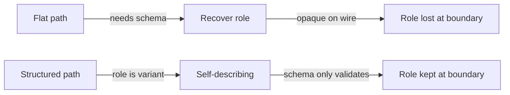

# Question 3 — SymbolPath: flat `Vec<Name>` (landed) vs structured record

## The decision the psyche owes

Record 1577 landed the flat shape: `SymbolPath(Vec<Name>)`. At record
1586 the psyche reopened it — [structured component/plane/variant/payload/field]
(record 1586). The two candidates differ in *where the role of a path
lives*: in the flat shape the role is RECOVERED by re-walking the
schema; in the structured shape the role is CARRIED inline by the
shape of the record itself.

This report shows both shapes as real Rust, weighs them on the four
axes the psyche named, and gives a reasoned recommendation.

## Today's code, verbatim

The flat path is a single positional vector of `Name`. The role of any
given path (is it a type? a field? an enum variant?) is NOT stored — it
is reconstructed by `Asschema::symbol_path_position`, which needs the
schema in hand to do the recovery.

The carrier (`src/asschema.rs:85-86`):

```rust
#[derive(rkyv::Archive, rkyv::Serialize, rkyv::Deserialize, Clone, Debug, Eq, Hash, PartialEq)]
pub struct SymbolPath(Vec<Name>);
```

The role enum — note it borrows `&'path Name` out of the flat vector,
so it is a *view* recovered against a schema, never stored
(`src/asschema.rs:88-105`):

```rust
#[derive(Clone, Copy, Debug, Eq, PartialEq)]
pub enum SymbolPathPosition<'path> {
    Type {
        type_name: &'path Name,
    },
    RootVariant {
        root_name: &'path Name,
        variant_name: &'path Name,
    },
    Field {
        type_name: &'path Name,
        field_name: &'path Name,
    },
    EnumVariant {
        enum_name: &'path Name,
        variant_name: &'path Name,
    },
}
```

The role-recovery method — note the `&self` (the schema) is REQUIRED,
and the disambiguation is by `local_segments()` arity plus a lookup
into the schema's declarations (`src/asschema.rs:332-375`):

```rust
pub fn symbol_path_position<'path>(
    &self,
    path: &'path SymbolPath,
) -> Option<SymbolPathPosition<'path>> {
    if !path.belongs_to(&self.identity) {
        return None;
    }
    match path.local_segments() {
        [type_name] if self.type_named(type_name.as_str()).is_some() => {
            Some(SymbolPathPosition::Type { type_name })
        }
        [root_name, variant_name]
            if self
                .root_named(root_name.as_str())
                .is_some_and(|root| root.has_variant(variant_name)) =>
        {
            Some(SymbolPathPosition::RootVariant {
                root_name,
                variant_name,
            })
        }
        [type_name, field_name]
            if self
                .type_named(type_name.as_str())
                .is_some_and(|declaration| declaration.has_field_named(field_name)) =>
        {
            Some(SymbolPathPosition::Field {
                type_name,
                field_name,
            })
        }
        [enum_name, variant_name]
            if self
                .type_named(enum_name.as_str())
                .is_some_and(|declaration| declaration.has_variant_named(variant_name)) =>
        {
            Some(SymbolPathPosition::EnumVariant {
                enum_name,
                variant_name,
            })
        }
        _ => None,
    }
}
```

Two ambiguity facts fall straight out of this code:

1. `RootVariant` and `Field` BOTH have arity-2 local segments
   (`[a, b]`). The match disambiguates ONLY by which schema lookup
   succeeds — `root_named` versus `type_named`. Strip the schema away
   and a bare `[Entry, description]` and `[Input, Record]` are
   indistinguishable. Same for `Field` versus `EnumVariant` (both
   arity-2, both keyed on `type_named`, separated by
   `has_field_named` versus `has_variant_named`).
2. There is no growth path. The `overdeep_path` test
   (`tests/symbol_path.rs:147-153`) feeds a four-segment path and
   asserts the answer is `None` — a deeper position is not "a field of
   a field", it is *unrepresentable*. The flat shape's role vocabulary
   is frozen at the four arms above.

The constructors all funnel through `from_identity_and_segments`, which
just prepends the component `Name` and flattens
(`src/asschema.rs:112-119`):

```rust
pub fn from_identity_and_segments(
    identity: &super::SchemaIdentity,
    segments: impl IntoIterator<Item = Name>,
) -> Self {
    let mut path_segments = vec![identity.component().clone()];
    path_segments.extend(segments);
    Self::new(path_segments)
}
```

## The boundary problem, made concrete

`SymbolPath` derives `rkyv::Archive` — it is a WIRE type. It travels
between the triad daemon's engines and across signal contracts. But
`SymbolPathPosition` does NOT derive rkyv; it cannot cross a boundary.
The only way to get a role is to call `asschema.symbol_path_position(&path)`
— which means the receiver must (a) hold the schema and (b) know it is
the RIGHT schema (`belongs_to` gate, `src/asschema.rs:133-136`).

So a flat path handed to NexusEngine or persisted by SemaEngine arrives
as an opaque `Vec<Name>`. To know "is this a field, or an enum
variant?" the receiver re-runs schema lookup. If the schema version has
drifted, or the receiver only has the path and not the asschema, the
role is simply unknowable. The role is OPAQUE ACROSS THE BOUNDARY — the
data does not describe itself.

Under the strict-separation constraint (record 2560): [SEMA owns all
state, Nexus all decisions, Signal all communication, nothing leaking
into the daemon] (record 2560). A flat path forces every engine that
wants role to ALSO hold the schema — that is the asschema leaking
sideways into Nexus and Sema just so they can interpret a payload. The
self-describing structured record is exactly what keeps the schema from
having to travel alongside.

## The proposed structured shape

A tagged record where each arm names its plane and carries its members
inline. The role is the rkyv-archived discriminant — it crosses any
boundary self-describingly, no schema required to read it back:

```rust
/// A canonical reference to a position inside a schema. The variant IS
/// the role: a structured path describes its own plane without needing
/// the schema in hand to recover it. `component` is carried on every arm
/// so `belongs_to` and cross-component routing stay decidable from the
/// path alone.
#[derive(rkyv::Archive, rkyv::Serialize, rkyv::Deserialize, Clone, Debug, Eq, Hash, PartialEq)]
pub enum SymbolPath {
    /// A declared namespace type: `component/Entry`.
    Type {
        component: Name,
        type_name: Name,
    },
    /// A variant of a root enum (`Input` / `Output`): `component/Input/Record`.
    RootVariant {
        component: Name,
        root_name: Name,
        variant_name: Name,
    },
    /// A field of a struct: `component/Entry/description`.
    Field {
        component: Name,
        type_name: Name,
        field_name: Name,
    },
    /// A variant of a namespace enum: `component/ValidationError/EmptyTopic`.
    EnumVariant {
        component: Name,
        enum_name: Name,
        variant_name: Name,
    },
}

impl SymbolPath {
    pub fn component(&self) -> &Name {
        match self {
            Self::Type { component, .. }
            | Self::RootVariant { component, .. }
            | Self::Field { component, .. }
            | Self::EnumVariant { component, .. } => component,
        }
    }

    pub fn belongs_to(&self, identity: &super::SchemaIdentity) -> bool {
        self.component() == identity.component()
    }
}
```

With this shape, `SymbolPathPosition` AND `symbol_path_position`
DISAPPEAR — the role is no longer recovered, it is the type. The
schema's job shrinks to VALIDATION (does this declared path actually
exist in me?) rather than INTERPRETATION (what kind of thing is this?):

```rust
impl Asschema {
    /// Validate that a structured path actually names something in this
    /// schema. The role is already in the path's variant — this only
    /// confirms the path is real, it no longer has to discover the role.
    pub fn validates(&self, path: &SymbolPath) -> bool {
        if !path.belongs_to(&self.identity) {
            return false;
        }
        match path {
            SymbolPath::Type { type_name, .. } => {
                self.type_named(type_name.as_str()).is_some()
            }
            SymbolPath::RootVariant { root_name, variant_name, .. } => self
                .root_named(root_name.as_str())
                .is_some_and(|root| root.has_variant(variant_name)),
            SymbolPath::Field { type_name, field_name, .. } => self
                .type_named(type_name.as_str())
                .is_some_and(|declaration| declaration.has_field_named(field_name)),
            SymbolPath::EnumVariant { enum_name, variant_name, .. } => self
                .type_named(enum_name.as_str())
                .is_some_and(|declaration| declaration.has_variant_named(variant_name)),
        }
    }
}
```

Note what is GONE versus the flat version: the arity-2 ambiguity
between `RootVariant`/`Field`/`EnumVariant`. In the structured shape
each is a distinct variant — there is no `[a, b]` collision to
disambiguate, because the constructor already committed to the role.

On the psyche's named members (`component/plane/variant/payload/field`):
the four-arm enum above covers the positions the schema declares TODAY.
The `plane` / `payload` members the psyche listed at 1586 are the
*growth* slots — a payload reference inside a variant, a deeper plane
than the current four arms. The enum shape grows by adding an arm
(`VariantPayload { component, enum_name, variant_name, payload_field }`),
which is a typed, exhaustiveness-checked change. The flat shape grows by
silently accepting a longer vector that `symbol_path_position` then
returns `None` for — growth is unrepresentable, not just unwritten.

## Weighing the two, concretely

### Correctness

Flat: a path can be *constructed* that names nothing (`SymbolPath::new`
takes any `Vec<Name>` — `tests/symbol_path.rs:133` builds
`other:lib/Entry` freely). Role and validity are BOTH deferred to a
schema walk; the type permits nonsense. The arity-2 collision means the
type cannot even tell a field apart from a root variant on its own.

Structured: illegal-arity paths are unconstructable — you cannot build a
`Field` without exactly a type and a field name. The role can never
disagree with the shape because the role IS the shape. Schema validation
narrows further (does the named thing exist?), but the structural class
of correctness is moved from runtime into the type. Structured wins.

### Future-orientation (deeper positions growing)

Flat: frozen. The `overdeep_path` test pins that arity-4 is `None`.
Adding "field of a field" or "payload of a variant" means inventing new
arity conventions inside `symbol_path_position`'s match and hoping no
existing arity collides. Every new depth fights the previous ones for
arity slots.

Structured: each new position is a new named arm; `match` exhaustiveness
makes every consumer recompile-fail until it handles the new plane. The
psyche's `payload` member is literally a future arm. Structured wins,
and this is the axis the psyche flagged at 1586.

### Reusability

Flat: reusable only WITH its schema. Any consumer (Nexus, Sema, a
signal contract, a downstream component) that wants role must also hold
the right asschema. The path alone is not reusable as a self-contained
reference.

Structured: the path is reusable standalone. Hand it to any engine,
persist it, ship it over a signal — the variant tells the receiver what
it is. Schema is only needed to confirm existence, which many consumers
do not even need. Structured wins.

### Role-opacity across a boundary (the psyche's framing)

This is the decisive axis. The flat path's role lives in
`SymbolPathPosition`, which does not derive rkyv and cannot cross a
boundary; recovering it demands `&self` schema and the `belongs_to`
gate. A flat path handed across an engine boundary without its schema
CANNOT report its own role.

The structured record carries the role inline as the archived
discriminant. It is self-describing on the wire and in storage. Under
strict separation (record 2560), this is what stops the asschema from
leaking into Nexus and Sema just so they can read a payload's role.
Structured wins decisively.

## Recommendation

Adopt the **structured enum** `SymbolPath`. It is the
most-correct (illegal shapes unconstructable, no arity collision),
most-future-oriented (new planes are new arms with exhaustiveness
enforcement — directly serving the psyche's `payload`/`plane` growth at
1586), and most-reusable (self-contained, schema needed only for
existence-validation) of the two. It is the only shape that solves
role-opacity-across-a-boundary, which the strict-separation constraint
(record 2560) makes a first-class requirement, not a nicety.

The flat shape's one genuine virtue — a uniform `Vec<Name>` for
generic path arithmetic (`local_segments`, `Display` join on `/`) — is
cheaply recovered by a `segments(&self) -> Vec<&Name>` projection method
on the enum, so nothing is lost.

## What the new code does, either way

If the psyche keeps FLAT: nothing changes structurally; future deeper
positions require widening `symbol_path_position`'s arity match and
extending `SymbolPathPosition` with new arms, and every role-needing
consumer keeps carrying the schema. The boundary opacity stays.

If the psyche adopts STRUCTURED: `SymbolPath` becomes the four-arm enum
above; `SymbolPathPosition` and `symbol_path_position` are deleted (role
is now intrinsic); `Asschema` gains `validates(&path)` for
existence-checking; the constructors (`type_path`, `field_path`,
`root_variant_path`, `enum_variant_path`) return the matching variant
directly instead of flattening into a vector; `Display`/`to_nota` walk
the variant's members; a `segments()` projection preserves generic path
arithmetic. The four tests in `tests/symbol_path.rs` rewrite to
construct variants and to call `validates` instead of matching a
recovered position.

## Visual


