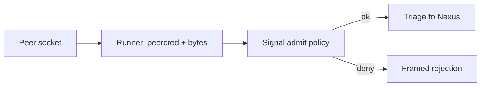
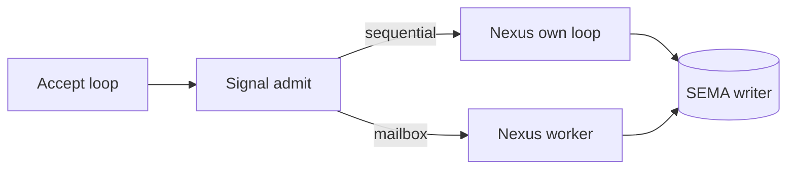
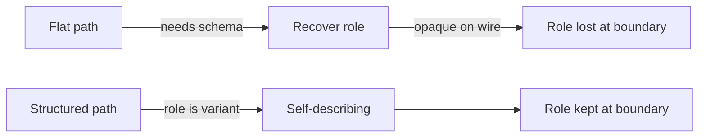
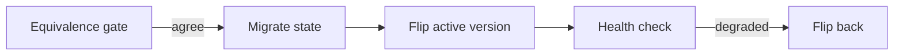

# 503 - The design questions, in code

You asked for my most important questions with lots of real code, what I
suggest, and what the new code would do. Here are four. The first — admission
— is the one you're most interested in, so it gets the most code.

## 1. Does admission become a `Signal admit` trait method? Yes — via a split

**The question.** Admission is route/identifier minting + frame validation at
the wire boundary. Today it is an *inherent* method on `SignalActor`, called by
a hand-written composer, and it is **not** on the schema-emitted contract.
Should it move onto the `SignalEngine` trait (so it's part of the emitted
contract, per your rule that all communication lives in Signal), or stay
runner-owned bookkeeping?

**What happens today.** Admission is welded into one inherent method, and the
peer's real identity never even reaches it:

```rust
// src/engine.rs:172 — admit is an INHERENT method, NOT on the trait
pub fn admit(&self, input: Input) -> Result<SignalAccepted, SignalRejected> {
    let origin_route = self.issue_origin_route();          // a counter, not the peer
    let signal_input = input.with_origin_route(origin_route);
    let identifier = self.issue_message_identifier();
    if let Err(validation_error) = signal_input.root().validate() {
        return Err(SignalRejected { origin_route, validation_error });
    }
    Ok(SignalAccepted { sent: signal_input.message_sent(identifier), input: signal_input })
}

// src/engine.rs:201 — "origin" is a monotonic counter, NOT peercred identity
fn issue_origin_route(&self) -> OriginRoute {
    let mut next = self.next_origin_route.lock().expect("origin route lock");
    *next += 1;
    OriginRoute(ORIGIN_ROUTE_BASE + *next)
}

// src/daemon.rs:139 — the stream (the only thing that knows the peer) is dropped
fn handle_stream(&self, stream: UnixStream, engine: &Engine) -> Result<(), DaemonError> {
    let mut transport = SignalTransport::new(stream);
    let (_route, input) = transport.read_input()?;   // _route discarded; peer never reaches policy
    let output = engine.handle(input);
    transport.write_output(output.root())?;
    Ok(())
}
```

And the emitted `SignalEngine` trait carries `triage`/`reply` (the Signal↔Nexus
boundary) but **no `admit`** (the wire↔Signal boundary) — so admission is the
one communication-boundary act left off the contract. There is no `peercred`
anywhere (`grep` is empty); the peer's identity is structurally unavailable.

**What I suggest — the split.** The strongest counter-argument is "minting
identity needs the peer, the peer lives on the file descriptor, so just do it
in the runner." The seam answers it exactly: the runner does the *fd part*, the
engine does the *rule part*.

```rust
// src/schema/lib.rs — admit ADDED to the emitted SignalEngine trait
pub trait SignalEngine {
    // on_start / on_stop / triage / reply unchanged
    /// The runner supplies connection facts; the engine applies POLICY and
    /// never touches a file descriptor.
    fn admit(&self, context: ConnectionContext, input: RawInput) -> Result<Admitted, Rejection>;
}

// new emitted boundary types — FACTS, not capabilities (no fd in the engine)
pub struct ConnectionContext { pub peer_user: Integer, pub peer_group: Integer, pub peer_process: Integer }
pub struct RawInput { pub frame: FrameBody }
// one failure vocabulary: wire-shape and contract-rule failures unified
pub enum RejectionCause { OriginDenied(OriginPolicyError), Undecodable(SignalFrameError), Invalid(ValidationError) }

// triad-runtime — the generic runner does the ONLY syscall, then calls policy
fn serve_connection(&self, engine: &Engine, mut stream: UnixStream) -> Result<(), RunnerError> {
    let context = ConnectionContext::from_peercred(&stream)?;     // runner-owned: the only fd work
    let frame = LengthPrefixedCodec::default().read_body(&mut stream)?;
    let reply = match engine.admit(context, RawInput::new(frame)) {
        Ok(admitted) => engine.dispatch(admitted),
        Err(rejection) => engine.frame_rejection(rejection),
    };
    LengthPrefixedCodec::default().write_body(&mut stream, &reply)?;
    Ok(())
}
```

This puts the communication-boundary act on the emitted contract (your record
2560) *without* dragging socket I/O into the engine — the engine receives a
small facts value, never a file descriptor.

**Is this in one year? No — it's a now-decision.** The generic runner
(`triad_main!`) is being designed right now, and `admit`'s placement *is the
runner's parameter list*: does the runner pass a bare `Input` into a
hand-written composer (status quo), or `ConnectionContext` + `RawInput` into
`Signal admit` (admission on the contract)? You can't write the runner without
answering this — deciding later means writing the runner twice. **A year out**,
engine whole: each component declares its admission in its NOTA contract and the
codegen emits `admit`, the `RejectionCause` enum, and the validate predicates —
exactly the way `triage`/`reply` are emitted today:

```text
(SignalContract
  (Admission (Origin peercred (Allow (Group spirit))) (Mint OriginRoute) (Validate Input))
  (Validation (Record (NonEmpty topics) (NonEmpty description)) (Observe (NonEmpty topics))))
```

The hand-written composer and the discarded-`_route` handler both disappear.



## 2. Runner concurrency — keep sequential, make the mailbox a future mode

**Today** the single-flight guard is the *borrow checker*: `NexusEngine::execute(&mut self)`
held across the whole decision loop makes two concurrent executions a *compile
error* (ARCHITECTURE.md:177 names this). A `Mutex<Nexus>` exists at
`engine.rs:26` only because `Engine::handle` takes `&self`.

**My suggestion:** keep sequential single-flight as the runner `triad_main!`
emits, and make the actor mailbox a future *emit-mode* of the same runner, not a
rewrite. The two share the entire decision body (decide loop, SEMA write/read
split, reply framing); only the frame around `execute` differs (own-and-loop vs
enqueue-and-drain), selectable by a `concurrency` field in the triad contract.
Adopting the generated runner *deletes* the `Mutex<Nexus>` (the runner owns
Nexus with `&mut self`); `process_with`'s `&mut Nexus` signature is unchanged —
it already *is* the guard and is exactly what a future mailbox worker would call.

A mailbox buys *I/O* concurrency, not *decision* concurrency — the single Nexus
worker still serializes decisions, so a slow `observe` head-of-line-blocks the
queue. **A year out**, the genuinely useful concurrency is a read/write split the
SEMA schema already invites: `observe(&self)` fanned across a read pool plus one
ordered `apply(&mut self)` writer — concurrent reads while keeping single-writer.
Emit sequential by default; mailbox-with-read-fanout as opt-in.



## 3. SymbolPath — adopt the structured enum

**The decision you owe** (flat `Vec<Name>` landed at 1577 vs the structured
record you reopened at 1586). My recommendation: **adopt the structured enum.**

Two facts straight from the code decide it. First, role is *not stored* — a flat
path recovers its role from the schema (`symbol_path_position` needs `&self` on
`Asschema`), but `RootVariant`, `Field`, and `EnumVariant` all have **arity-2**
local segments, so a bare `[a, b]` path is *indistinguishable* without a schema
lookup. Second, `tests/symbol_path.rs:147` pins arity-4 as `None` — deeper
positions are unrepresentable, not just unwritten.

Your strict-separation rule (2560) is the decisive lever: the flat shape forces
any engine that wants a path's role to *also hold the asschema* — the schema
leaks sideways into Nexus and Sema. The structured enum carries the role as the
rkyv discriminant; the schema is then needed only to *validate existence*, not
*interpret role*. New planes (your `payload`/`plane` members) become
exhaustiveness-checked arms instead of fighting for arity slots. The flat shape's
one virtue — uniform path arithmetic — is recovered by a `segments()` projection,
so nothing is lost. Adopting it deletes `SymbolPathPosition` and
`symbol_path_position` (role becomes intrinsic) and rewrites four tests.



## 4. The cutover mechanism — gate, migrate, rollback

**The biggest undesigned gap.** Today the whole cutover is *one editable
string*: `currentDefault = "v0.4.1"` in `CriomOS-home/.../spirit.nix:189`.
Changing it to `next` and rebuilding **is** the flip — no gate, no migration, no
rollback. The version slots are built for *coexistence* (each version has its own
service, state dir, redb, socket), and an atomic zero-downtime primitive already
exists but unused for this: persona's `SCM_RIGHTS` FD-handoff at
`transport.rs:294`. The static Nix selector and the FD router are two
disconnected mechanisms; the cutover never touches the handoff.

**My suggestion — three mechanisms, in dependency order:**
- **Gate first** (independent, testable now): a `spirit-equivalence-gate` binary
  drives a fixed NOTA `ProbeSet` through both daemons via the existing
  `Engine::handle` surface, byte-compares canonicalised replies (timestamps/mint-ids
  zeroed), exits non-zero on divergence — wired as a CriomOS-home Nix check so the
  flip-to-`next` build *cannot succeed* unless old and new agree.
- **Migration second** (blocked on the pilot adopting sema-engine so a `.sema`
  destination exists): the canonical two-submodule `From`-chain from
  `skills/spirit-cli.md` (`mod historical` / `mod current_shape` / `From`-chain),
  as `spirit-migrate-persona-to-schema`, run once from `ExecStartPre` like the
  existing privacy migration.
- **Rollback third:** slots are already isolated (the old daemon never stops); a
  `CutoverHealthCheck` probes the new socket post-flip and flips back on a
  `Degraded` verdict — full orchestration blocked on persona-as-upgrade-orchestrator.

**A year out**, all three collapse into one reversible persona Nexus
`PromoteVersion` decision: publish the new version → spawn it in its own slot →
the gate gates promotion → the migration carries state once → persona flips an
`active_version` value in its own SEMA (the value the FD router already reads) →
every new connection is sent to the new daemon via `SCM_RIGHTS` with the old one
warm → a health check watches → a `Degraded` verdict flips back, the next
connection landing on the old daemon — *no socket ever closing under a client*.
Each step is a typed `NexusAction`; the sequencing is the landed
`Continue(NexusWork)` recursion. The manual one-line edit becomes a typed, gated,
reversible, zero-downtime operation — the same one for every component cutover.



## The through-line, and what you owe

All four converge on the same two unbuilt things: **the runner** (it owns
admission's seam, the concurrency mode, and the cutover's per-component pattern)
and **sema-engine adoption** (it unblocks the migration and the `.sema`
destination). Decisions you own: **admission** — split it onto the contract
(my strong lean, and it's a now-decision); **SymbolPath** — adopt structured (my
recommendation); **runner concurrency** — sequential now, mailbox later (low-risk,
mostly mine to land); and **the cutover** — bless the gate-migrate-rollback shape
so it can start being built. The full per-question detail with all the code is in
`reports/designer/502-design-questions-deep-2026-06-04/`.
