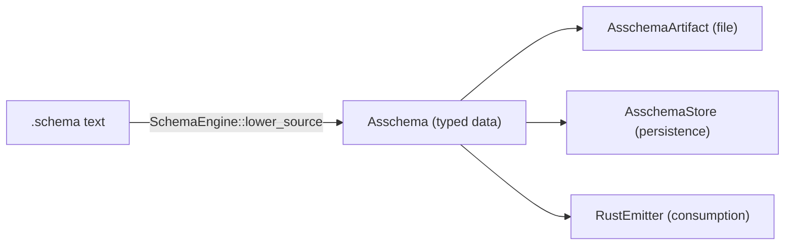
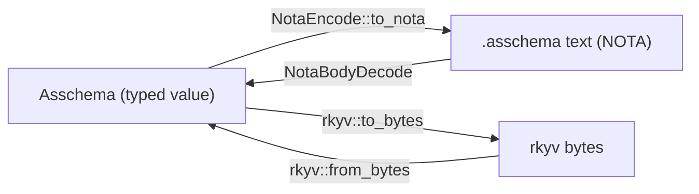
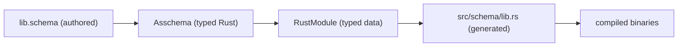

# 504 — Refresh — the schema-derived next stack (design history)

This Refresh is the canonical *design-history* surface for the schema stack:
the data model, the parser architecture, the runtime integration, the
fleet-port plan, the upgrade pilot, and the trace/help/config designs as they
matured through late-May into early-June 2026. It deliberately does NOT
re-state the current schema-in-action snapshot or the ideal-vs-current
analysis — those live in the current reports (495 design-to-code port audit,
496 psyche-facing state, 500 schema-and-engine ideal analysis). When this
record and a current report disagree, the current report wins; this surface
carries the reasoning, alternatives, and arc the current reports assume.

## One-paragraph architecture story

NOTA is a programmable syntax library (Spirit 1281). It owns the parsed
structure (`Document -> Vec<Block>`), the codec derives
(`NotaDecode`/`NotaEncode`, `NotaBodyDecode`/`NotaBodyEncode`), the macro-node
registry, and the known-root document-body abstraction. Schema is the first
major CONSUMER: it registers schema vocabulary as macro-node patterns over
NOTA's mechanism, lowers `.schema` source through the structural matcher into
typed `Asschema`, and projects `Asschema` across four logical planes —
`Asschema` (data), `AsschemaArtifact` (file projection), `AsschemaStore`
(durable persistence), `RustEmitter` (consumption) per Spirit 1272. The four
planes are connected by derives: `NotaEncode`/`NotaDecode` for text,
`rkyv::Archive`/`Serialize`/`Deserialize` for bytes, one or two lines of glue
for the persistence cycle. `schema-rust-next`'s emitter consumes typed
`Asschema`, produces `RustModule` data, renders the data to Rust source, and
the result is what the spirit-next runtime uses as its wire and storage nouns.
CLI processes parse NOTA at the human edge; the daemon stays binary-only via
`NotaSurface` feature-gating (Spirit 1244). The whole picture is derive-driven
end to end; the elegance is that no glue code exists between any pair of
corners.

## The four logical planes (Spirit 1272)

Spirit 1272 (Maximum) named the architectural cleavage: an `Asschema` is an
`Asschema`; an `AsschemaArtifact` is an `Asschema` with file I/O; an
`AsschemaStore` is a database to persist `Asschema`s; a `RustEmitter` is the
thing that uses an `Asschema` to produce a Rust file. Each owns ONE
responsibility. Every cross-cutting concern — text encoding, byte encoding,
redb cycle, identity keying, Rust generation — sits in exactly one plane. The
corner-to-corner edges (Rust <-> NOTA, Rust <-> rkyv) are carried by derives
on `Asschema`'s field types; the planes around `Asschema` are tiny because the
derives do the work. `AsschemaArtifact::write_nota_file` is
`fs::write(path, asschema.to_nota())`; `AsschemaStore::put_asschema` is
`to_binary_bytes + insert`; `RustEmitter::emit_file_from_artifact` is
`emit_file(artifact.asschema())`. No parsing, no encoding, no glue between
planes — only field access.



Plane boundaries, stated as "not its job":

- `Asschema` is the OUTPUT of lowering; macro-expansion + import-resolution
  live in `SchemaEngine::lower_*`, not on the data noun. No file I/O, no
  persistence, no Rust emission on `Asschema`.
- `AsschemaArtifact` wraps an `Asschema` and adds the four file-IO operations
  (read/write x text/binary). The only original logic is `std::io::Error` ->
  `SchemaError::Io { path, reason }` projection. No data ownership, no
  database keying.
- `AsschemaStore` is redb-backed (`TableDefinition<&str, &[u8]>`), keyed by
  `<component>@<version>` derived from `SchemaIdentity`, holding rkyv bytes
  only. NOTA text is reconstructed on demand (Spirit 1271). Every redb call
  projects its failure to one `SemaDatabaseOperation` variant (Open,
  BeginRead, BeginWrite, OpenTable, Read, Write, Commit) — no string-shaped
  error categories. `export_nota_file` is the cross-plane composition that
  proves the four-corner round-trip in one method: read rkyv bytes ->
  `AsschemaArtifact::from_binary_bytes` -> `write_nota_file`.
- `RustEmitter` lives in a SEPARATE crate (`schema-rust-next`). The split
  enforces that an `Asschema` is independent of its consumers — the same
  bytes can drive a Rust emitter today, a TypeScript emitter tomorrow. The
  real model is `RustModule`, an intermediate typed value (the
  asschema-shape projected into Rust-shape) that walks the asschema one way
  and renders to source the other.

### The derives carry the work



Two derive families. `nota_next::NotaDecode`/`NotaEncode` carry the text edge;
`rkyv::Archive`/`Serialize`/`Deserialize` carry the bytes edge. The same
`Asschema` value passes through both edges and recovers identically; the
derives are the equivalence proof, not commentary.

## The data model — Rust <-> NOTA <-> rkyv equivalence

The typed data model lives once in Rust and projects losslessly into NOTA
text, rkyv bytes, and the sema-db row that holds those bytes (Spirit 1271).
Organized per Spirit 1270 around three categories — macro declarations, type
declarations, and the namespace that stores both — all with module-qualified
identity (`schema-next:core:Topic`) so cross-module and cross-crate references
resolve without collisions.

`Asschema` root (six positional fields, document-body codec):

```rust
#[derive(rkyv::Archive, rkyv::Serialize, rkyv::Deserialize,
         nota_next::NotaDecode, nota_next::NotaEncode,
         Clone, Debug, Eq, PartialEq)]
#[nota(known_root)]
pub struct Asschema {
    identity: SchemaIdentity,
    imports: Vec<ImportDeclaration>,
    resolved_imports: Vec<ResolvedImport>,
    #[nota(name = "Input")]  input: EnumDeclaration,
    #[nota(name = "Output")] output: EnumDeclaration,
    namespace: Vec<Declaration>,
}
```

Type-by-type equivalences worth keeping (each shown Rust / NOTA / rkyv-rule):

- `SchemaIdentity { component: Name, version: String }` — NOTA
  `(schema-next:core [0.1.0])`; serves as the sema-db key. Component is a bare
  symbol; version is a bracket string (dots aren't legal in bare symbols).
- `Name(String)` — one type everywhere a name appears. HAND-ROLLED
  `NotaEncode` because the encode side branches on
  `qualifies_as_symbol_name()`: bare symbol when structurally legal
  (`Topic`, `schema-next:core:Topic`), bracket-string fallback otherwise
  (`[topic with spaces]`). Closing the substrate gap that lets bare-vs-bracket
  be derive-driven removes this hand-roll.
- `Declaration { visibility: Visibility, name: Name, value: TypeDeclaration }`
  — NOTA `(Public CoreSchema (Struct ...))`. `Visibility::{Public, Private}`
  is a fixed-discriminant enum.
- `TypeDeclaration::{Alias, Struct, Enum, Newtype}` — tagged union; variant
  ORDER is byte-stable (Spirit 1249).
- `StructDeclaration { name, fields: StructFieldMap }` — `StructFieldMap` has
  a HAND-ROLLED codec enforcing the strict-brace contract (Spirit 1259):
  `root_objects.len() % 2 == 0`, decoded in `chunks_exact(2)`, encoded as
  `{key1 value1 key2 value2 ...}` in source order. This is the load-bearing
  strict-brace instance in the data model.
- `EnumDeclaration { name, variants: Vec<EnumVariant> }` with
  `EnumVariant { name: Name, payload: Option<TypeReference> }`. A unit variant
  emits `(Name None)`, NOT bare `Name` — the type IS `Option::None` and
  pretending otherwise is heterogeneous and dishonest (Spirit 1268).
- `TypeReference::{String, Integer, Boolean, Path, Plain(Name),
  Vector(Box), Map(Box, Box), Optional(Box)}` — HAND-ROLLED codec (~50 lines).
  String/Integer/Boolean/Path are RESERVED scalar leaves: not user namespace
  declarations, cannot be shadowed. `Plain(Name)` means "a declared type by
  name." Recursive variants carry `#[rkyv(omit_bounds)]`. This is the largest
  remaining hand-roll; the substrate gap is reserved-symbol leaves AND
  symbol-headed variants combined not yet being a single derive attribute.
- `ImportDeclaration` / `ImportSource { crate_name, module, type_name }` /
  `ResolvedImport` — cross-crate references are qualified `Name` strings
  inside `TypeReference::Plain`; resolution loads the dependency asschema by
  `crate_name:module`, confirms the `type_name`, produces a `ResolvedImport`.

### Honest-notation discipline (Spirit 1267-1269)

- 1267 — Input/Output are direct struct fields with `#[nota(name = "Input")]`
  markers, not `(Input variants)` wrappers; the labels are document field
  labels, not enum-variant tags.
- 1268 — no heterogeneous vectors: every vector element emits the same shape
  (`None` or `(Some T)`; `(Name None)` for unit variants).
- 1269 — no meaningless wrappers: notation form follows type truth; notation
  that doesn't correspond to a piece of type structure is sugar that hides
  where information lives, and is rejected.

## The two-layer parser + structural macros

Spirit 1279 (Maximum): NOTA extension programming is structural matching over
nodes. The parser first preserves raw delimiter structure, object counts,
sigils, and nested block shapes; then ordered macro-node definitions match
that structure using constraints, most-specific first, and absence of a match
is a formatting or specification error.

- **Layer 1 — universal structural parse (`nota-next`).** A `Document` holds
  source + `Vec<Block>`; a `Block` is `Delimited { delimiter, span,
  root_objects }`, `PipeText`, or `Atom`. Three load-bearing properties:
  source spans preserved (diagnostics map to columns), atom case classified at
  parse time (`AtomClassification`), and delimiter substrate exposed as data
  (`Delimiter` enum: Parenthesis, SquareBracket, Brace, PipeParenthesis,
  PipeBrace) so pattern code asks "delimited with X?" by data equality, not
  variant explosion. The layer knows nothing about schema vocabulary — that
  ignorance is what makes the substrate reusable across consumers.
- **Layer 2 — per-consumer macro-node programming.** A `MacroRegistry` is an
  ordered `Vec<MacroNodeDefinition>`; `dispatch(candidate)` walks in order and
  returns the FIRST match or a structured `MacroError::NoMatch { position,
  tried, expected, found }`. A `Pattern` is `Vec<PatternElement>` —
  `Any`/`Atom(AtomShape)`/`Delimited(DelimitedShape)`/`Literal`/`Rest`. The
  recursive `DelimitedShape::with_children(Pattern)` (the nested macro
  constraint) lets a consumer declare "a brace whose first child is a
  camelCase atom and whose second child is a parenthesized type reference."
  `MacroRegistry::new` runs `validate_no_silent_conflicts` at construction —
  order is priority, silent ambiguity is rejected at load time. The match
  algorithm requires total positional consumption (no silent leftover blocks);
  captures carry typed `Block` refs, never notation strings.

The discipline: load programming first, then apply on structure. Two consumers
can apply DIFFERENT registries to the SAME document; the structural parse is
shared, the meaning differs. A NOTA formatter is derivable from the same
registry (the patterns already encode delimiter/line-break/atom layout).

### Known-root + body-stream substrate (Spirit 1274/1278/1287/1290)

A `.asschema` file is read AGAINST a known root type — the file IS the root
body, NOT wrapped in an outer paren naming the root. `#[nota(known_root)]`
emits `NotaDocumentDecode`/`NotaDocumentEncode`; per-field
`#[nota(name = "Input")]` projects a named-document-field pair. This closed the
old anti-pattern (hand-rolled `.join("\n")` plus six positional hand-typed
decodes with `Name::new("Input")` fabricated inline).

Spirit 1287 (Correction Maximum) + 1290 (Decision Maximum) generalised it:
after structural parsing matches a file body OR a delimited object, the next
semantic step receives the matched body's inner object stream, not the outer
wrapper. `NotaBodyDecode` is THE semantic decode entry point; document/block
decode surfaces strip their wrapper and delegate to it. The wrapper-stripping
responsibility lives with the caller (the party that already knows the type).
Operator's integration (`nota-next 64647b1a` + `schema-next 3ead0e93` +
`c837c656`) promoted this to first-class types: `NotaBody` (the
inside-of-anything object stream), `NotaSource::parse_body::<T>()` (the
canonical caller API), and `CapturedValue::Body(NotaBody)` (macro captures
expose the body, not the wrapper). The four major built-ins — RootImports,
RootNamespace, RootEnumBlock, StructFieldMap — lower through body streams
after the structural delimiter match. The original designer prototype
(`designer-uniform-body-parser` `38b2f74`) fed operator's integration; the
canonical reference is now the main-line trio. Still open per operator 267:
schema-next's internal `MacroObject::Block` paths at the macro-trait boundary;
the cleaner endpoint is `SchemaMacro::lower(body: NotaBody<'_>, context) ->
Result<MacroOutput, SchemaError>` once `MacroMatch` captures route into schema
handlers.

## The runtime integration — schema-emitted types ARE the runtime nouns

The single most important fact: there is NO shadow type layer. Every runtime
noun the daemon manipulates — `Input`, `Output`, `Entry`, `Query`,
`SemaInput`, `Signal<Root>`, `Nexus<Root>`, `Sema<Root>`, `Mail<Phase>`,
`MessageSent`, `MessageProcessed`, the route enums, the engine traits
(`SignalEngine`, `NexusEngine`, `SemaEngine`) — comes from the schema-emitted
module. The hand-written runtime exists ONLY to compose those typed nouns; it
never invents a parallel type, never shadows a generated enum.

The compilation pipeline is four hops, each passing a typed object (never a
string):



The build is driven from a consumer `build.rs`: lower source -> `Asschema` ->
write `AsschemaArtifact` (NOTA + rkyv) -> `RustEmitter::emit_module` ->
`RustModule::render` -> checked-in `src/schema/lib.rs` the build asserts to
match. The `GeneratedFileArtifactWitness` double-emit pattern proves that
emitting from the `.asschema` NOTA artifact and from the `.asschema.rkyv` rkyv
artifact produce byte-equal Rust — a falsifiable four-corner round-trip check
executed at every consumer build.

### NotaSurface gating (Spirit 1244)

The NOTA codec is opt-in. `RustEmissionOptions { nota_surface: NotaSurface }`
controls whether emitted nouns derive `NotaDecode`/`NotaEncode` and emit the
`from_nota_block`/`to_nota` bridges. Three variants: `AlwaysEnabled`,
`FeatureGated { feature }`, `Disabled`. The runtime uses `FeatureGated`: the
CLI binary declares `required-features = ["nota-text"]`; the daemon binary
does not, and the default feature set is empty, so building the daemon alone
never compiles `nota-next` into its closure. Every data-bearing noun gets
`#[cfg_attr(feature = "nota-text", derive(NotaDecode, NotaEncode))]`; the
inherent bridges and root `FromStr`/`Display` carry `#[cfg(feature)]`.
`tests/socket_negative.rs` proves the binary boundary rejects raw NOTA —
Spirit 1244's intent ("nobody can talk NOTA directly to the daemon") is
enforced by codec gating + rkyv-only transport, end to end. This closed
designer-430's codec-opt-in research and the zero-NOTA-daemon first slice.

### The Signal -> Nexus -> SEMA triad

Three responsibilities composed as one `Engine`: Signal admission (validate
the inbound `Input`, issue identity), Nexus mail-keeping (hold the validated
payload across the SEMA call as `Mail<BeingProcessed>`, translate
plane-to-plane, emit lifecycle events), SEMA durable store (apply the
SEMA-language input to redb, produce a SEMA output). Every plane-to-plane
projection (`SemaOutput -> Output`, `Sema<Output> -> Nexus<Input>`,
`Nexus<Output> -> Signal<Output>`) is a method on the generated noun, not a
hand-rolled dispatch.

The `Mail<Phase>` typestate is the strongest single piece of the design: the
phase carries phase-specific data (`BeingProcessed { sema_input }`,
`Processed { output }`), so the two phases are structurally different values.
The ONLY transition is `Mail<BeingProcessed>::run_sema`, which is private to
the module — no external caller can produce a `Mail<Processed>` without
running SEMA. "Nexus holds the mail => it is being processed" is enforced by
Rust's privacy rules, not a logging convention.

The wire path: the CLI is the only NOTA-aware process. It parses `Input` from
argv (NOTA text via `FromStr` -> `NotaSource` -> `NotaDecode`), encodes a
length-prefixed rkyv `Signal` frame over a Unix socket, and the daemon decodes
+ `Engine::handle`. The frame body is schema-emitted
(`Input::encode_signal_frame`): an 8-byte typed short header (a discriminant
constant) plus rkyv bytes; the transport adds a 4-byte length prefix. The
daemon takes ONE binary argument — a path to a rkyv-encoded `Configuration`
file (derive-driven rkyv struct, no `nota_next` reference).

## The CLI single-argument rule (component-triad)

Every component binary takes exactly one argument: a NOTA string, a path to a
NOTA file, or a path to a signal-encoded (rkyv) file. The CLI's inline-vs-path
detection (string-prefix branch on `(`) is a thin slice of the NOTA grammar
bleeding into the CLI layer — a root could legitimately be `[...]`, `{...}`, a
bare atom, or `[|...|]`. The principled home is
`nota_next::NotaSource::from_argument` / `from_cli_argument`, which tries an
inline `Document::parse` against any block shape and falls back to filesystem
resolution. Small but principled; carried as an open horizon.

## The upgrade pilot (designer 481, landed on main)

The upgrade-as-SEMA shape landed end-to-end at minimal closure on both repos.
`schema-next/src/upgrade.rs` carries the typed `UpgradeObject
{ previous_identity, next_identity, edits: Vec<SchemaEdit> }`, the
`SchemaEdit::{AddField, ChangeFieldType, AddVariant}` enum, the
`FieldMigration::{WrapSingleton, SetDefault}` enum, `AsschemaEdit::apply` (the
per-edit apply method) and `UpgradeObject::apply` (chained apply that runs
edits in order, rejects a mismatched `previous_identity` with a typed
`SchemaError::SchemaEditIdentityMismatch`, and stamps `next_identity`). Every
typed object derives `rkyv::Archive` + `NotaDecode` + `NotaEncode`, so an
upgrade travels as NOTA on the boundary, rkyv in storage and on the wire, and
typed Rust inside the daemon.

`schema-rust-next/src/migration.rs` carries the `MigrationEmitter` that
consumes an `UpgradeObject` and emits a Rust module:

```rust
pub mod historical { /* previous-version mirrors */ }
pub mod current    { /* next-version shapes      */ }
impl From<historical::T> for current::T { /* projection */ }
```

Per-edit projection: `AddField(DefaultValue::Integer(n))` ->
`field: n_i64,`; `ChangeFieldType(WrapSingleton)` ->
`field: vec![previous.field],`; `AddVariant` -> adds to `current::T`,
`historical::T` stays uninhabited and the projection uses the unreachable
`match previous {}`. The load-bearing witness
(`emitted_source_compiles_and_migrates_a_value`) constructs a typed
`UpgradeObject`, emits Rust, compiles it through `rustc` as a subprocess, runs
the binary, and the binary's assertions confirm the migration moves a value
across versions correctly — a Layer-2 runtime witness (typed object -> emitted
Rust -> compiled binary -> projected value).

Pilot scope is shape-of-daemon (Spirit 1469): the daemon binary + socket +
`SchemaSemaEngine` actor are deferred; the `signal-schema` contract repo
follows the daemon binary; SEMA storage reuses the existing `AsschemaStore`.
Deferred operations: `RemoveField`, `RenameField`, `RemoveVariant`,
struct<->enum migrations, and the non-Integer `DefaultValue` projections (all
mechanical extensions). The daemon-when-it-lands wires `UpgradeObject::apply` +
`MigrationEmitter::emit` rather than re-implementing them.

## Header namespace resolution (designer 493, Spirit 1554-1557)

Schema-header variant references resolve through namespace lookup or
inline-declaration auto-registration, replacing the verbose explicit
`(Variant Payload)` form. A bare PascalCase variant in the header (Input/Output
root enum bodies, `NexusWork`, `NexusAction`, `SemaWriteInput`,
`SemaReadInput`) looks up the matching namespace type (Spirit 1468 type-table
resolution); an inline declaration at variant position auto-registers the type.
Every PascalCase name in the header becomes an EXPORTED top-level type — the
header IS the component's public type-level interface (Spirit 1555).

The Rust-emission distinction is the load-bearing refinement (addresses the
nested-wrapper-construction smell Spirit 1557 named):

- **Bare aliasing entries** (`SyntaxDeclaration::Alias` — source `Name TypeRef`
  with no struct body: `Record Entry`, `Rejected SignalRejection`,
  `Topic String`) lower to **Rust type aliases**: `pub type Record = Entry;`.
  The exported name lives and the SymbolPath identity is preserved, but at the
  Rust type level `Record` IS `Entry`, so `Input::Record(some_entry)`
  constructs WITHOUT ceremony — no distinct type to wrap. This avoids the
  `Output::Rejected(Rejected(SignalRejection { ... }))` triple-wrap an
  earlier draft's newtype-everywhere lowering produced.
- **Struct-body entries** (`SyntaxDeclaration::Struct` — `Name { field Type
  ... }`) keep the single-field newtype lowering (Spirit 1535): a one-field
  body lowers to `pub struct T(pub Inner);` because the source explicitly wrote
  a struct body. Multi-field bodies lower to named structs.

This refines the Spirit 1535 newtype rule's application boundary: it applies to
declarations with struct bodies (the field name carries domain meaning), not to
bare aliasing entries. It composes with the variant-named associated
constructors for genuine newtypes (`Output::rejected(SignalRejection { ... })`)
— the alias-lowering removes the wrapper for bare aliases; the constructor
sugar hides it for genuine newtypes; both compose.

Engine semantics operator's slice implements: multi-pass identifier resolution
per Spirit 1556. Pass 1 — identifier collection (walk the source tree; for
each PascalCase name in a header/RHS/field-type position record (identifier,
location, role: `Declares` or `References`)). Pass 2 — inline-declaration
registration (auto-register inline bodies into the namespace; after pass 2 the
namespace holds every declared type). Pass 3 — reference resolution (look up
each `References` identifier; bind or error with source location). The result
is an enriched resolved source the lowerer consumes; the existing single-field
newtype rule then applies unchanged. The test that pins it: the lowered
`Asschema` is byte-identical between the verbose and the resolved forms — same
assembled program, shorter source.

## Trace / help / config designs (designer 487, Spirit 1489-1508)

Three schema-adjacent surfaces and one discipline, all extending the
schema-carries pattern (the new substrates are schema-emitted data-bearing
types, not ZST namespaces):

- **Trace as a schema-defined interface (Spirit 1489-1492 + 1499-1508).**
  Client-side tracing is generated/generic from the schema interface; the CLI
  stays thin. Tracing remains typed data until the client display boundary —
  strings only at the edge, and the rendered string IS the type's derived NOTA
  text (Spirit 1502 Correction Maximum), not ad hoc `Display`. Trace is its own
  schema-defined interface with closed generated enum vocabularies
  (`SignalObjectName`, `NexusObjectName`, `SemaObjectName`, wrapped by the
  generated `ObjectName` for `TraceEvent` transport). No tracing-on-tracing;
  enablement is per crate/component (the `testing-trace` cargo feature). The
  trace-client behavior (NOTA display + SEMA-backed log + listener + frame
  decode) belongs in a reusable client library; the CLI is a thin wrapper
  (Spirit 1503 Principle High, which subsumes the earlier 1500+1501 split).
  The daemon-side `eprintln!` string fallback was removed (Spirit 1505).
- **Help as a mirror description namespace (Spirit 1493).** Help/documentation
  is schema data in a mirror description namespace keyed by fully-qualified
  schema symbols (`SymbolPath`), with generated defaults for symbols lacking an
  explicit description. `HelpRegistry { explicit: BTreeMap<SymbolPath,
  Description>, schema_summary }` is a schema-emitted data-bearing struct; the
  default-generator is lazy at lookup time. Rendered at the CLI
  `(Help (Verb <name>))` reply, not a hand-written CLI string table.
- **NOTA config-by-convention (Spirit 1494).** Authored workspace data files
  prefer typed NOTA; predictable file names/directories define the expected
  root type. `NotaConfigRegistry { conventions: Vec<NotaConfigConvention> }`
  resolves a path to its root type; the convention applies to authored files
  loaded by CLIs, build scripts, and bootstrap-once daemon reads — NOT the
  wire. The daemon boundary stays binary (Spirit 1495 Maximum: daemons stay
  free of NOTA decoding and string surfaces except actual user-authored string
  payloads).

The `SymbolPath` mechanism became canonical and workspace-wide (Spirit
1506/1507) and is already in the schema-next architecture: a newtype over
ordered `Name` segments derivable from any schema position, with NOTA form
`(SymbolPath [spirit-next:lib Input Record])` and a human `Display` joining
segments. Trace names, help entries, description keys, and future indexes use
this typed path instead of ad hoc path strings. NOTA-as-typed-text-UI grounding
(Spirit 1508) landed in `ESSENCE.md` + `INTENT.md`.

## The generic-substrate horizon

Two of the four planes are special cases of patterns that recur. The lift
targets close the next round of de-duplication; the four-plane separation is
independent of the lift (the planes keep their identity; only the
implementation substrate changes).

- **`SerializableArtifact<T>`.** `AsschemaArtifact` and `MacroLibraryArtifact`
  carry identical eight-method shapes (from_nota_source, to_nota_source,
  from_binary_bytes, to_binary_bytes, read_nota_file, write_nota_file,
  read_binary_file, write_binary_file) — ~160 lines of pure duplication per
  owner. One trait over `type Inner: NotaDecode + NotaEncode + rkyv::Archive`
  shrinks each wrapper from ~80 lines to ~10. Future artifacts
  (`SchemaUpgradeArtifact`, `MacroTableArtifact`, schema-emitted
  Signal/Nexus/SEMA artifacts) inherit instead of re-copying — 6-8 artifact
  types when fully built out.
- **`SemaStore<T>`.** `spirit-next/src/store.rs` (~333 lines) and
  `schema-next/src/store.rs` (~203 lines) re-implement the same redb cycle
  (open with mkdir + create-or-open, ensure-tables, five `From<redb::*Error>`
  impls, begin-write/open-table/mutate/commit, begin-read/iterate,
  identity-keyed put/get). A generic `SemaStore<Layout: SemaTableLayout,
  Engine: SemaEngine>` shrinks per-store specialization to ~30 lines.
  Cumulative: ~350 lines for the two existing stores plus ~700-900 per future
  store.

## Open horizons — ordered backlog

The schema-core extraction is the headline future cut; the rest are mechanical.

1. **Schema-core extraction.** The biggest single boilerplate cut — ~600 lines
   of byte-identical universal envelope substrate (the `Signal<Root>` /
   `Nexus<Root>` / `Sema<Root>` triple, the cross-plane `Plane<S,N,M>` wrapper,
   `MessageIdentifier` / `OriginRoute` / `MessageSent` /
   `MessageProcessed<Reply>` + hook traits, the frame primitives, the engine
   trait surfaces) plus ~300 lines of runtime substrate (`Mail<Phase>`,
   `MailLedgerHook`, the `SemaStore<T>` redb substrate). The emitter emits
   `use schema_core::Signal;` instead of inline definitions. Multiplicative
   scope: every additional component drops the same ~800-1000 lines.
   DELIBERATELY sequenced AFTER observing the pattern in TWO components, not
   one — designing schema-core from spirit-next alone risks the abstraction
   locking around its specific `Mail<Phase>` + `MailLedger` shape. The test is
   TWICE, not ONCE (Spirit 1291: schema-emitted projections before extraction
   when the projection slice stays small; the pilot's slice IS small).
2. **Generic `SemaStore<T>` + `SerializableArtifact<T>` substrate** — the lift
   above. Best timed once a second store and a second artifact owner make the
   shape stable.
3. **`RustModule`-as-data completeness** — extend `RustItem` from "type
   declarations only" to all Rust items (impl, trait, fn, const, module); tests
   assert structure instead of text.
4. **Schema-emitted variant projections** — `From<Payload> for Enum` +
   sibling-plane translations that the runtime currently hand-rolls (the
   `FromMail<Payload>` impls + variant-by-variant mapping). Falls out of
   emitter changes naturally.
5. **NOTA source helper** — `NotaSource::from_cli_argument` for inline-vs-path
   (the CLI single-argument rule above).
6. **`TypeReference` / `Name` derive-codec gap closure** — the two largest
   remaining hand-rolls in `asschema.rs`; close when nota-next can express
   reserved-scalar-leaf-plus-symbol-headed-variant and smart bare-vs-bracket as
   derive attributes.

## The fleet-port plan (designer 446)

The next stack is ready to absorb the rest of the workspace's component fleet.
A component is "ported" when its wire-and-runtime nouns are schema-emitted from
a `schema/lib.schema` source instead of hand-written Rust types; the
hand-written runtime (actor logic, storage methods, daemon main loop) stays
hand-written and attaches behavior to schema-emitted nouns.

Phased sequencing (the validate-recipe-first principle — pilots teach the
pattern; the extraction comes from observing it in two places):

- **Phase 0 — `spirit` fold.** The right first port: fold the `spirit-next`
  pilot back into the renamed real `spirit` repo, where the canonical worked
  example becomes the canonical commit history every subsequent port
  references. Stage-3 (runtime migration to schema-emitted nouns) risk is
  minimal here — the runtime is already on schema-emitted nouns; the fold just
  relocates files. The one designer call gating Phase 0 is the spirit-triad
  naming question (resolved separately under the meta-signal contract naming).
- **Phase 1a — `cloud` + `upgrade` + `repository-ledger` in parallel.** Three
  independent operator lanes after Phase 0; each sustains the pre-extraction
  substrate cost (~800-1000 lines byte-identical per component) as additional
  observation evidence for schema-core extraction.
- **Phase 1b/c — schema-core design + extraction.** Designer report on the
  crate-split granularity (concurrent with Phase 1a), then the implementation
  slice once Phase 1a is feature-complete.
- **Phase 2 — stateful runtimes** (`mind`, `router`, `terminal`, `orchestrate`,
  `message`, `introspect`) gate behind schema-core extraction; up to 5 parallel
  operator lanes.

The most reusable substrate the playbook surfaced: the `build.rs`
freshness-witness template (the `GeneratedFileArtifactWitness` double-emit
check), a natural target for a `schema_next_build::run!("component", "0.1.0",
"src/schema/lib.rs")` macro so every consumer's `build.rs` is one line. Stage 3
is the trickiest step (domain logic re-anchored on schema-emitted nouns while
the legacy path stays alive — the temptation to shadow types is strongest
there); four piles stay hand-written (runtime actor logic, storage internals,
validation methods, typestate patterns).

## Substrate audit verdict (designer 445)

The three substrate repos honor workspace discipline: NOTA owns
parsed-structure + macro-node programming + derives; schema-next consumes the
NOTA macro mechanism with schema vocabulary; spirit-next uses schema-emitted
types as wire nouns through Signal/Nexus/SEMA. The body-stream substrate
(1287/1290) is integrated; the enum-body honesty migration (1294/1295) is fully
landed (data variants are parenthesized records, unit variants bare PascalCase;
the retired `@`-suffix shorthand has no remaining presence). Every public
surface across the production source is a method on a data-bearing type — no
ZST namespaces. The few small refinements named were operator-lane code work
sized as discrete beads (a single free function, a one-impl trait, the
CLI-prefix narrowness, a Debug-fallback `Display`); these are the kind of
finding that lands opportunistically and is not load-bearing on the
architecture.

## Spirit records embodied

1244 (binary daemon + feature-gated NOTA), 1246 (live asschema artifact), 1249
(rkyv discriminant stability), 1259 (strict brace key-value), 1263 (macro nodes
at NOTA layer), 1267-1269 (notation honesty), 1270 (three categories +
module-qualified + cross-crate), 1271 (rkyv-in-SEMA + NOTA re-export through
derived types), 1272 (four-object logic separation), 1274 (positional root
reading), 1277 (input/output as struct fields), 1278 (known-root abstraction),
1279 (two-layer structural matching), 1280 (structural over text macros), 1281
(NOTA as programmable syntax library), 1282 (short focused graphs), 1287/1290
(body-stream substrate), 1291 (schema-emitted projections before extraction),
1294/1295 (enum-body honesty), 1469 (schema-daemon pilot authorization),
1489-1496 + 1499-1508 (trace/help/config + maintenance), 1535 (single-field
newtype lowering), 1554-1557 (header namespace resolution + alias-vs-newtype).
