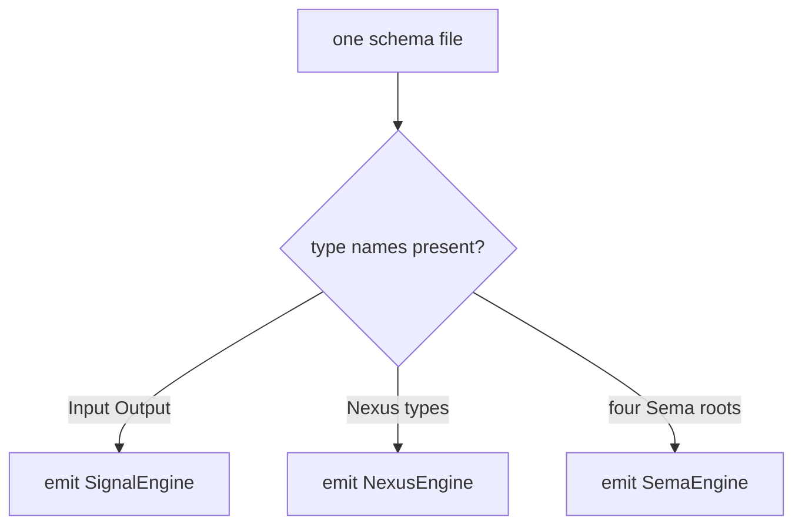
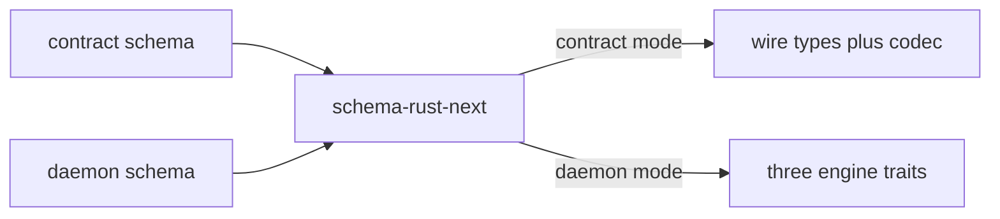
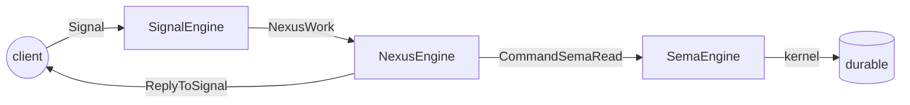

# 509 — Signal contract is messaging-only; the generator wrongly derives Sema and Nexus from it

> **Correction banner (2026-06-04, records 2597 + 2598).** The
> contract-boundary diagnosis below stands: a contract is wire-only,
> and the generator defect is real (`emit_schema_plane_trait_support`
> keys on type-name presence, with no plane awareness). **But the FIX
> shape proposed in §"Where the SemaEngine comes from" onward is
> superseded.** This report still smuggled in the old mistake — "one
> daemon schema with distinct plane *sections*." That is wrong. The
> corrected model (psyche, records 2597/2598): a triad is **three
> separate plane-schemas minimum — a Signal schema, a Nexus schema, a
> Sema schema — with NO sections inside one file.** The generator emits
> **per plane** (Signal → wire types + codec, zero engines; Nexus → the
> Nexus engine; Sema → the Sema engine), not per contract-vs-daemon
> *mode*. spirit's all-in-one `lib.schema` is a bootstrap exception, not
> the canonical split. The corrected fix lands in the consolidated
> workspace audit report and in operator audit
> `reports/operator/309-Audit-signal-contract-nexus-sema-boundary.md`.

## Intent Anchors

[A component contract (signal-component and meta-signal-component) carries
ONLY the wire messaging vocabulary: the Signal Input and Output roots, their
record types, and the wire codec. Nexus and SEMA are daemon-internal runtime
planes and must NOT appear in any contract schema. The client sends and
receives only Signal messages; the client never sends a Nexus object or a
SEMA object, ever. The contract emits wire types and codec only, not engine
traits; SignalEngine, NexusEngine, and SemaEngine all live in the daemon.
Whether schema-rust-next needs redesign to support the contract-versus-daemon
split is under audit.] — the load-bearing Correction (High, today).

[The triad engine separation is strict and absolute: the SEMA engine owns ALL
database and durable-state code, the Nexus engine owns ALL decision-making,
the Signal engine owns ALL communication. A daemon must contain no database,
decision, or communication code outside its respective engine.]

[Sema-engine is the exclusive interface to the database; no component daemon
may make direct redb calls. A daemon that opens redb and runs its own
transactions is a fake of the intended architecture, even as a pilot.]

[The schema-derived cloud port uses TWO schemas — signal-cloud (working,
peer-callable, read-only Observe and Validate) and meta-signal-cloud (policy,
owner-only, eight mutations). The first cloud-port prototype wrongly copied
spirit's single-repo all-in-one schema shape into the contracts, embedding
Nexus and SEMA — a design error being corrected.]

## The verdict, up front

The psyche is right, and the instinct is sharper than the bug report that
prompted it. The bug report found a "doorway with no room behind it": a
read-only contract (Observe / Validate only) gets Sema data types, a `sema`
module, per-root route constructors, and a `CommandSemaRead` variant on
`NexusAction` — but **no** `SemaEngine` trait, so there is no `observe` method
to land the read in. That is a real coverage gap. But it is a *symptom*. The
psyche's response cuts to the disease: **the contract is just signal. There is
no SEMA in the contract. The client never sends a SEMA object. So the
generator is wrong to read Sema and Nexus concerns out of the signal contract
*at all*.**

Fix the symptom (admit a read-only `SemaEngine` mode) and you have polished a
feature that should not exist on this surface. The contract should emit no
`SemaEngine` — present or absent, read-only or read-write — because the
contract has no Sema plane to emit one from. The defect is one level up: the
generator has a single entry point that emits all three engine traits from one
undifferentiated pile of declarations, with no concept of "this schema is a
wire contract" versus "this schema is a daemon."

## Where the generator conflates the two

`schema-rust-next` has exactly one function that decides which engine traits to
emit, and it keys purely on *which type names are present in the declaration
set* — it has no notion of contract-versus-daemon
(`schema-rust-next/src/lib.rs:2365-2379`):

```rust
fn emit_schema_plane_trait_support(&mut self, declarations: &[RustDeclaration], root_enums: &[RustEnum]) {
    let emits_signal_engine = self.has_root_enum(root_enums, "Input")
        && self.has_root_enum(root_enums, "Output")
        && self.has_type(declarations, "NexusWork")
        && self.has_type(declarations, "NexusAction");
    let emits_nexus_engine =
        self.has_type(declarations, "NexusWork") && self.has_type(declarations, "NexusAction");
    let emits_sema_engine = self.has_type(declarations, "SemaWriteInput")
        && self.has_type(declarations, "SemaWriteOutput")
        && self.has_type(declarations, "SemaReadInput")
        && self.has_type(declarations, "SemaReadOutput");
    // ... then `if emits_signal_engine { emit SignalEngine }` etc.
}
```

Read what this says. If the schema author writes `NexusWork`, `NexusAction`,
and four Sema roots into the file, the generator emits `NexusEngine` and
`SemaEngine`. If they don't, it doesn't. **The generator cannot distinguish a
contract schema from a daemon schema** because the only signal it has is "did
the author write Sema type names." A contract schema *should never contain
those type names at all* — and if it doesn't, the generator already does the
right thing for Signal but only by accident, never having been told the
contract has a different job.

This is why the bug report's read-only contract behaves so strangely. The
generator is mid-emission of daemon machinery (Sema types, the `sema` module,
the `CommandSemaRead` variant) but the four-root `&&` gate for `SemaEngine`
fails because write roots are absent, and the all-eight `Some(...)` gate for
the read-routing projection fails for the same reason. The three Sema gates use
three *different* presence predicates — OR-any-root for the `sema` module,
AND-all-four for the trait, all-eight for the projection — so a read-only
schema falls into the gaps between them. The bug report calls that
inconsistency the defect. It is *a* defect, but patching the gates to agree
would still leave a contract emitting Sema scaffolding it has no business
emitting.


*Today: one undifferentiated gate. The generator emits whatever planes the
author happened to name — it has no concept of "contract" vs "daemon".*

## What a signal contract actually contains

The proof that the boundary is clean *when authored by hand* sits in the live
cloud contract crate. `signal-cloud/src/lib.rs` — the working, peer-callable
contract — declares only a Signal channel, no Nexus, no Sema
(`signal-cloud/src/lib.rs:325-336`):

```rust
signal_channel! {
    channel Cloud {
        operation Observe(Observation),
        operation Validate(Validation),
    }
    reply Reply {
        Observed(ObservationResult),
        Validated(ValidationReport),
        RequestUnsupported(RequestUnsupported),
        RequestRejected(RequestRejected),
    }
}
```

That is the whole contract: two operations a peer can send, four replies it can
receive, and the record types they carry (`Observation`, `ValidationReport`,
…). A client links this crate, builds an `Observe(Observation)`, sends the
rkyv bytes, and reads back a `Reply`. It never constructs a `NexusWork`, never
a `SemaReadInput`. There is structurally nothing Sema-shaped on this surface.

The contamination is in the *schema-derived experiment*, not the hand-written
contract. `cloud/schema/cloud.concept.schema` — the alignment marker for the
future generated cloud triad — puts all three planes in one file
(`cloud/schema/cloud.concept.schema:10-45`):

```
[Observe Validate]                                          ;; Signal Input roots
...
  NexusWork  [SignalArrived SemaReadCompleted SemaWriteCompleted EffectCompleted]
  NexusAction [CommandSemaRead CommandSemaWrite CommandEffect ReplyToSignal Continue]
  SemaReadInput  [ObservePlan]
  SemaWriteInput [RegisterAccount RotateCredential SetPolicy ...]
```

This is exactly the single-repo all-in-one shape the Correction names as the
error. The hand-written `signal-cloud` got the boundary right; the generated
path is about to get it wrong because the generator was built for spirit, where
contract and daemon are co-located in one repo and the leak is invisible.

## Where the SemaEngine should come from instead

The psyche's question (2): if not from the signal contract, where? The answer
the intent already points to is **a unified component (daemon) schema with
distinct plane sections**, NOT a separate `sema-component` schema and NOT
hand-written. There is no `sema-component` or `nexus-component` repo anywhere
in the workspace, and the intent does not call for one — Nexus and Sema are
*runtime planes inside the daemon*, expressed as additional root sections in
the daemon's own schema. What is hand-written is only the *body* of each trait
method (the domain decision logic); the trait *surface* stays schema-emitted.

So the split is not "two notations" but "two schema *roles* feeding one
generator with two modes":


*The fix: the generator gains two modes. A contract schema yields wire types +
codec only; a daemon schema yields the three engine traits. Same generator,
same notation, different emission contract.*

The daemon schema *imports* the contract's `Input`/`Output` rather than
redeclaring them — the daemon's Signal plane IS the contract's wire vocabulary,
and its Nexus and Sema planes are local sections the contract never sees. The
working spirit pilot already proves this trait-emission shape end to end; the
only thing missing is the *separation* of the contract half from the daemon
half, which spirit never needed because it is one repo.

## What the contract emits, concretely

For a signal contract, `schema-rust-next` should emit:

- The `Input` and `Output` root enums and every record type they carry
  (`Observation`, `ValidationReport`, …) with their rkyv + NOTA derives.
- The wire codec / framing — the `Request<Operation>` and `Reply<Reply>`
  envelopes a client uses to send and receive.
- **Nothing else.** No `SignalEngine` (the engine is daemon-side), no
  `NexusEngine`, no `SemaEngine`, no `sema` module, no `NexusAction`, no
  `CommandSemaRead`.

Note this is *stricter* than the bug report's instinct. The bug report wanted
the contract to also get a (read-only) `SemaEngine`. The correct contract gets
**no engine trait at all** — not even `SignalEngine`. The engines, all three,
live in the daemon crate that imports the contract. The contract is data +
codec; the daemon is behaviour.

For a daemon schema, the generator emits the three engine traits exactly as it
does today — `SignalEngine` (triage/reply), `NexusEngine` (decide/execute),
`SemaEngine` (apply/observe) — because the daemon schema is where the Nexus and
Sema sections legitimately live. The read-only/read-write `SemaEngine` shape
the bug report worried about *is* worth getting right, but it belongs in daemon
mode, where a read-only daemon schema (only `SemaReadInput`/`SemaReadOutput`)
should emit a read-only `SemaEngine` with `observe` and no `apply`. That is the
bug report's fix, relocated to the surface where it is meaningful.

## Reconciling with the pilot's read path

The psyche's question (4) carries a premise that is now stale, and the staleness
is itself the reassuring part. The premise — "the pilot's actual read path is
raw redb, no sema-engine" — described the pre-migration spirit. At current HEAD
the spirit pilot routes every durable read through the generated `SemaEngine`
trait, never raw redb. The runner's read arm dispatches through the trait, not
through a method on `Store` (`spirit/src/nexus.rs:243-247`):

```rust
NexusAction::CommandSemaRead(command) => {
    let sema_output =
        SemaEngine::observe(&self.store, command.with_origin_route(origin_route));
    work = NexusWork::sema_read_completed(sema_output.into_root());
}
```

`SemaEngine::observe` is the *generated* default wrapper over the hand-written
`observe_inner`, and `observe_inner`'s body calls sema-engine (the kernel),
which owns the redb interaction — `Store` holds a `sema_engine::Engine`, not a
redb handle. Spirit's own ARCHITECTURE now records the migration:
*"The database boundary is now sema-engine"* (`spirit/ARCHITECTURE.md:443`).
The system-designer boundary audit (report 63) that flagged spirit in the
raw-redb "bypass cohort" reflects the pre-migration commit and is stale on this
point; the boundary violation it forbids has been closed in source.

Why this matters for the contract question: it confirms the layering the psyche
wants is *already real in the working pilot*. The wire Observe arrives as a
Signal; the Nexus runner turns it into a `CommandSemaRead`; the `SemaEngine`
reaches durable state through the kernel; the result bubbles back as a Signal
reply. Three planes, three engines, one wire surface — and the only thing the
client ever touches is the Signal. The contract/daemon split the generator
needs is just *drawing the repo boundary around what the pilot already does
internally*.


*The pilot's live read path. The client touches only the Signal at the edges;
Nexus and Sema are entirely interior. CommandSemaRead never crosses the wire.*

## CommandSemaRead is daemon-internal and must never appear in contract code

The psyche's question (5): yes, unambiguously. `CommandSemaRead` is one of five
`NexusAction` variants — `CommandSemaWrite`, `CommandSemaRead`, `ReplyToSignal`,
`CommandEffect`, `Continue`. `NexusAction` is the daemon's internal command
stream. In the runner loop above, `CommandSemaRead` is consumed *on the same
call stack*: it calls `SemaEngine::observe` and re-enters the loop as
`NexusWork::SemaReadCompleted`. It never crosses a process boundary, never
becomes bytes, never reaches a client. Only `ReplyToSignal` exits back to the
Signal plane for wire egress.

So a contract crate that contains a `CommandSemaRead` variant — as the read-only
fixture in the bug report does, and as `cloud.concept.schema` would generate —
is leaking a daemon-internal command onto the wire surface. The cross-component
rule is explicit: *cross-component invocation goes through Signal contracts, not
Nexus-internal access*. A component that needs another component's data emits a
Signal request to its wire endpoint; it never reaches into another component's
Nexus. A `CommandSemaRead` on a contract surface invites exactly the violation
the rule forbids — it suggests a peer could command a read, when a peer can only
*send an Observe Signal* and let the daemon's own Nexus decide to read.

This is the cleanest single test for the whole redesign: **if the generated
contract crate contains the identifier `NexusAction` or `CommandSemaRead`, the
emission is wrong.** Those names belong only in daemon-mode output.

## The shape of the fix

The redesign is a generator change, and it is small in concept:

- **Teach the generator the two roles.** A schema declares whether it is a
  contract or a daemon — the cleanest signal is structural (a contract schema
  has only `Input`/`Output` roots and record types; a daemon schema adds Nexus
  and Sema sections and imports a contract). The generator emits wire types +
  codec for the first, three engine traits for the second.
- **Stop deriving Sema/Nexus from contract roots.** The `emits_sema_engine` /
  `emits_nexus_engine` gates move entirely into daemon mode. A contract schema
  never reaches them.
- **Fix the read-only `SemaEngine` shape — in daemon mode.** The bug report's
  inconsistent-gates finding is real and worth fixing, but the fix lives where
  Sema is legitimate: a daemon schema with only read roots emits a read-only
  `SemaEngine` (observe, no apply) and the matching read-side projection,
  without demanding write roots.
- **The two-listener cloud target** (working `signal-cloud` read-only +
  owner-only `meta-signal-cloud` mutations) becomes two contract schemas the
  cloud daemon imports, each emitting wire types only; the daemon's own schema
  carries the Nexus and Sema sections and emits the engines.

## Decisions for the psyche to ratify

The verdict and the four answers above are the ratifiable core. They are marked
as *leaning toward* the psyche's own stated instinct, not yet captured as a
firm Decision, because the redesign mechanism (how a schema *declares* its role)
is still open — see the questions below. The intent already captured as
Correction (contract carries only wire vocabulary) is firm; what is open is the
generator mechanism that realizes it.

## Open questions

1. **How does a schema declare contract-vs-daemon?** The cleanest options:
   (a) *structural* — the generator infers the role from shape (only
   Input/Output → contract; Nexus/Sema sections present → daemon), no explicit
   marker; (b) *explicit* — a schema header field naming the role; (c) *import-
   based* — the daemon schema `import`s the contract's Input/Output and adds its
   planes, and importing-a-contract is itself the daemon signal. (c) reads as
   the most honest because it makes the daemon's dependence on the contract
   visible in the schema, but it is the most generator work. Which mechanism?

2. **Does the contract emit any engine trait at all?** This report argues
   **no** — not even `SignalEngine` — because all three engines live in the
   daemon. But there is a coherent alternative: the contract emits `SignalEngine`
   (the wire-boundary engine) and only Nexus/Sema stay daemon-side, on the
   theory that "Signal owns communication" and the contract IS the communication
   surface. The Correction's wording ("the contract emits wire types and codec
   only, not engine traits; SignalEngine … all live in the daemon") points to
   **no engine in the contract**, which is the stricter reading this report
   takes. Confirm the strict reading: contract = data + codec, zero engine
   traits.

3. **One generator with two modes, or two entry points?** Should
   `schema-rust-next` keep one emission path that branches on role, or expose
   two named generation entry points (contract-emit, daemon-emit)? Two entry
   points make the boundary impossible to cross by accident — a contract build
   literally cannot call the engine emitter — at the cost of some duplicated
   plumbing.

4. **Is `cloud.concept.schema` retired or rewritten?** It currently embeds all
   three planes in one file (the error shape). Does it become the cloud
   *daemon* schema (keeping the Nexus/Sema sections, importing the two
   contracts), or is it deleted in favor of three separate schemas
   (`signal-cloud`, `meta-signal-cloud`, `cloud` daemon)? This determines
   whether the cloud port is the first real exercise of the two-mode generator.
