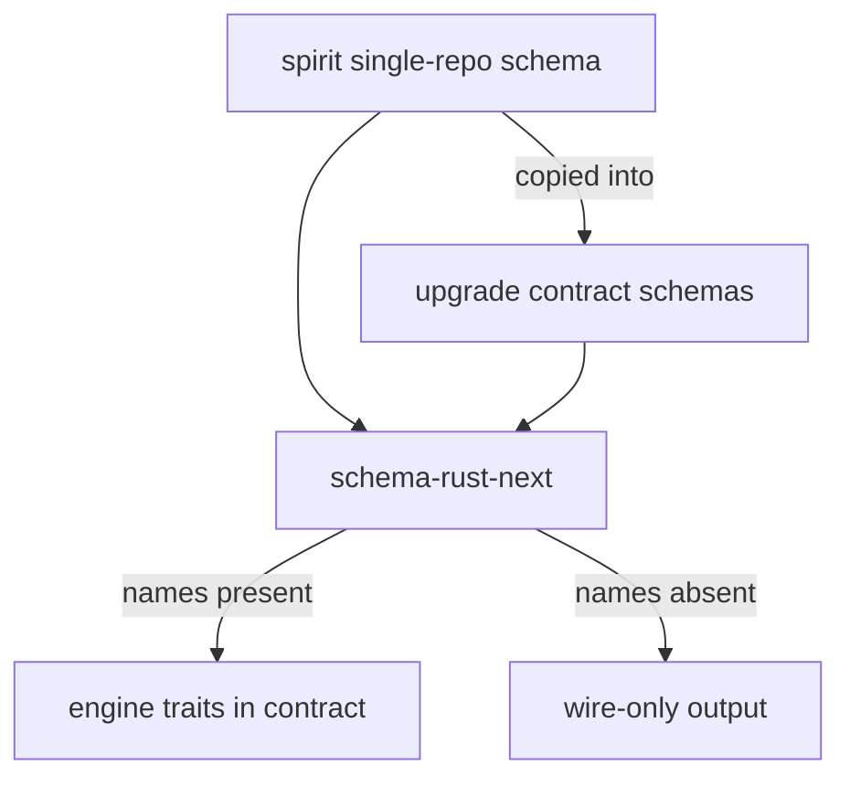
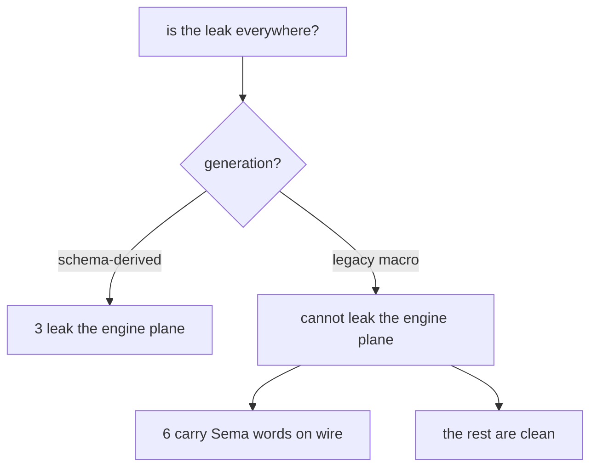

# 510 — Workspace-wide audit of the contract wire-only boundary

> **Reconciliation banner (2026-06-04, records 2597/2598/2604/2605).**
> The **verdict, per-repo table, root-cause, and tally below stand** —
> they are correct. **The fix framing in §"The fix" is reconciled.**
> This report (like 509) describes the fix as a "two-mode
> (contract-path / daemon-path)" generator, where daemon-mode emits one
> schema carrying *both* the Nexus and Sema planes. The psyche corrected
> that: a triad is **three separate plane-schemas — a Signal schema, a
> Nexus schema, a Sema schema — each its own file, no sections.** The
> generator emits **per plane** (Signal → wire types + codec, zero
> engines; Nexus → the Nexus engine; Sema → the Sema engine), and the
> daemon crate holds `nexus.schema` + `sema.schema` as **separate
> files** (record 2604, decision A), importing the signal contract;
> `schema-next` must read more than one plane-schema per crate. So
> "daemon-path" below is really "two plane-schemas (Nexus, Sema) in the
> daemon crate," not one combined daemon schema.
>
> **Open questions now resolved by psyche decision:** OQ1 (how the
> emitter learns its mode) → separate plane-schema files, sharpened to
> three plane-schemas (record 2604). OQ2 (does spirit's single-schema
> survive) → spirit stays the **bootstrap all-in-one exception until
> split**; it is not the canonical shape. OQ4 (does the contract emit
> any engine trait) → **no — zero engines, not even SignalEngine**
> (strict reading confirmed). OQ5 (cross-plane projections) → daemon-side
> only. **The one genuinely-open question is OQ3: are Sema words on the
> wire forbidden, or tolerated until the six legacy contracts migrate?**

## The question, and the answer up front

The psyche escalated a cloud finding into a workspace question:

> *"This isn't a question about cloud. This is a question about how we write
> every single contract repo. Is this a problem everywhere?"*

The standard is the load-bearing Correction captured in Spirit record 2593: a
contract carries ONLY wire messaging vocabulary — the Signal Input/Output roots,
their record types, and the wire codec. Nexus and SEMA are daemon-internal
runtime planes and must NOT appear in any contract schema; the client never
sends a Nexus or SEMA object, ever.

**The answer is no — it is not a problem everywhere. It is confined to exactly
the contracts that go through `schema-rust-next`.** Of 43 contract surfaces
audited across the workspace, **only 3 leak** the daemon engine plane into the
contract, and those 3 are precisely the 3 that are schema-derived. The other 26
contracts are clean wire-only. A separate and milder pattern — Sema words on the
wire — shows up in 6 legacy contracts, but that is a distinct concern, not the
engine leak the psyche is hunting.

This report is the workspace sweep that report 509 (the cloud-specific Psyche
report, `reports/designer/509-Psyche-signal-contract-engine-derivation-messaging-only.md`)
anticipated. 509 diagnosed the generator defect from the cloud port; this report
proves the blast radius across every contract repo and converts the diagnosis
into a per-repo remediation list. Read 509 for the deep generator analysis and
the cloud-specific decisions; read this for the workspace verdict and the fix.

## The verdict

The leak is **not workspace-wide; it rides exclusively on the schema-rust-next
code path.** Three contracts leak, and all three are schema-derived. Every
hand-written (legacy `signal_channel!` macro) contract is structurally incapable
of carrying the leak, because the leak is an emission artifact of the
`schema-rust-next` `RustEmitter` — it injects the three engine traits, the
plane envelopes, and the cross-plane projections into the same public module as
the wire types. The clean discriminator is *generation*, not domain: the same
upgrade domain has two schema-derived contracts that leak (signal-upgrade,
meta-signal-upgrade) and two legacy contracts that stay pure
(signal-sema-upgrade, owner-signal-sema-upgrade). The confinement is the good
news: there is no contract-by-contract cleanup campaign, there is one generator
to fix and three already-generated files to regenerate.

## The tally

43 contract surfaces audited. Three categories of finding:

- **Engine leak** (engine/Sema/Nexus planes in the contract) — **3**: spirit,
  signal-upgrade, meta-signal-upgrade. This is the violation the psyche named.
- **Sema-words-on-wire** (the six Sema classification words as request-root
  tags, or a payloadless `SemaObservation` label on a wire event) — **6**:
  owner-signal-persona, signal-persona-spirit, signal-mind, signal-orchestrate,
  signal-router, signal-criome. A distinct, far milder concern.
- **Clean wire-only / not-a-contract** — the remaining surfaces, including the
  five library carve-outs (signal-frame, signal-core, signal-sema,
  signal-derive, signal) and the daemon-side engine library signal-executor,
  which carry engine vocabulary correctly because they are libraries, not
  contracts.

## Per-repo verdict table

Generation: `S` = schema-derived (schema-rust-next), `L` = legacy
(`signal_channel!` macro). Status: `LEAK` = engine plane in contract,
`SEMA` = Sema-words-on-wire, `CLEAN` = wire-only, `LIB` = library-not-contract,
`SKEL` = empty skeleton.

| Repo | Gen | Status |
|---|---|---|
| spirit | S | LEAK |
| signal-upgrade | S | LEAK |
| meta-signal-upgrade | S | LEAK |
| signal-spirit | S | CLEAN |
| core-signal-spirit | S | SKEL |
| signal-cloud | L | CLEAN |
| owner-signal-cloud | L | CLEAN |
| signal-domain-criome | L | CLEAN |
| owner-signal-domain-criome | L | CLEAN |
| signal-sema-upgrade | L | CLEAN |
| owner-signal-sema-upgrade | L | CLEAN |
| owner-signal-persona | L | SEMA |
| signal-persona-spirit | L | SEMA |
| owner-signal-persona-spirit | L | CLEAN |
| signal-persona | L | CLEAN |
| signal-persona-origin | L | CLEAN |
| signal-engine-management | L | CLEAN |
| signal-mind | L | SEMA |
| owner-signal-mind | L | CLEAN |
| signal-orchestrate | L | SEMA |
| owner-signal-orchestrate | L | CLEAN |
| signal-router | L | SEMA |
| owner-signal-router | L | CLEAN |
| signal-criome | L | SEMA |
| signal-message | L | CLEAN |
| signal-terminal | L | CLEAN |
| owner-signal-terminal | L | CLEAN |
| signal-harness | L | CLEAN |
| signal-system | L | CLEAN |
| signal-introspect | L | CLEAN |
| signal-agent | L | CLEAN |
| owner-signal-agent | L | CLEAN |
| signal-repository-ledger | L | CLEAN |
| owner-signal-repository-ledger | L | CLEAN |
| signal-version-handover | L | CLEAN |
| owner-signal-version-handover | L | CLEAN |
| signal-forge | L | SKEL |
| signal-frame | L | LIB |
| signal-core | L | LIB |
| signal-sema | L | LIB |
| signal-derive | L | LIB |
| signal | L | LIB |
| signal-executor | L | LIB |

Read the column pair as one fact: **every `LEAK` row is also an `S` row, and
every `S` row that declares the daemon plane in its schema leaks.** The two
schema-derived contracts that do NOT leak (signal-spirit, core-signal-spirit)
are exactly the ones whose schema declares only Input/Output roots and no
Nexus/Sema gate types — empirically verified by a fresh build of signal-spirit,
which emits a 232-line wire-only file with zero engine strings. So even within
the schema-derived set, the leak is opt-in by what the schema declares; the
defect is that the generator lets a contract schema declare daemon planes at all.

## Root cause: spirit's single-repo shape, copied into contracts

The three leaking contracts share one ancestor. **spirit is the all-in-one
single-repo daemon** where the wire contract and the two internal runtime planes
(Nexus, SEMA) co-exist in one schema (`spirit/schema/lib.schema`, lowered to
`lib.asschema`, emitted by `schema-rust-next` into `spirit/src/schema/lib.rs`).
In spirit this is correct-by-design: spirit IS its own daemon, so the
daemon-internal planes legitimately live somewhere in the repo. The flaw is that
they live in the *same schema-emitted public module* as the wire contract — the
Input/Output roots sit next to `NexusWork`/`NexusAction`, the four
`Sema{Read,Write}{Input,Output}` enums, and the emitter-injected `SignalEngine`
/ `NexusEngine` / `SemaEngine` traits over `Signal<>`/`Nexus<>`/`Sema<>` plane
envelopes — and the crate root re-exports the whole pile as the public API
(`spirit/src/lib.rs:42-62`).

The moment that single-repo schema shape is copied into a contract repo, the
co-location becomes a leak. signal-upgrade and meta-signal-upgrade are exactly
that copy: both carry `schema/lib.schema` declaring `NexusWork`, `NexusAction`
(with `CommandSemaWrite`/`CommandSemaRead`/`ReplyToSignal`/`CommandEffect`/
`Continue`), and all four Sema halves, and both emit the three engine traits
plus `*Route` enums into their generated `src/schema/lib.rs`. A peer linking
`signal-upgrade` to call the upgrade surface gets `NexusAction` and
`SemaWriteInput` in its dependency closure — daemon-internal command vocabulary
that no client should ever see. The same emitter built for spirit's invisible
co-location produces a visible leak in any standalone contract repo.

The generator cannot tell the two situations apart. Its one emission function,
`emit_schema_plane_trait_support` (`schema-rust-next/src/lib.rs:2365-2383`),
keys purely on which type names appear in the declaration set:

```rust
let emits_sema_engine = self.has_type(declarations, "SemaWriteInput")
    && self.has_type(declarations, "SemaWriteOutput")
    && self.has_type(declarations, "SemaReadInput")
    && self.has_type(declarations, "SemaReadOutput");
```

If the schema author wrote those names, it emits the daemon planes; if not, it
doesn't. It has no concept of "this schema is a wire contract" versus "this
schema is a daemon." spirit's schema names them legitimately; the upgrade
contracts inherited those names by copying spirit; the generator obediently
emitted daemon machinery into a contract crate.



*One emission path. The generator emits daemon planes whenever the schema names
them — it cannot distinguish a contract from a daemon, so spirit's legitimate
co-location becomes a leak wherever the shape is copied.*

## How the clean contracts stay clean

The 26 clean contracts are clean for a structural reason worth stating plainly,
because it tells us the boundary is *naturally* right and only the generator
breaks it. Every clean contract is hand-written with signal-frame's (or
signal-core's) `signal_channel!` macro, which emits only `Operation`,
`OperationKind`, `Reply`, `Request<Operation>`, and `Reply<Reply>` — wire types
and codec, no engine traits, no plane envelopes. A legacy contract *cannot* leak
the engine plane because the macro that generates it has no engine-emission code
at all. signal-cloud is the canonical proof: the live, peer-callable cloud
contract declares one `channel Cloud` with `Observe`/`Validate` operations and
four replies, and nothing Sema-shaped exists on its surface.

This is the load-bearing observation for the fix: **the boundary the psyche
wants is the one hand-authored contracts already have.** The generator does not
need a new concept invented — it needs to stop emitting what the macro never
emitted.

## The distinct, milder pattern: Sema words on the wire

Six legacy contracts carry a *different* issue that must not be conflated with
the engine leak. Two shapes:

- **Sema classification words as request-root tags.** signal-mind, signal-router,
  and signal-criome (all still on `signal_core::signal_channel!`) tag their wire
  request roots with the six Sema words — `Assert SubmitThought`,
  `Match QueryThoughts`, `Subscribe SubscribeThoughts`, `Retract …`,
  `Mutate StatusChange`. signal-criome goes further and declares
  `enum AuthorizedSignalVerb { Assert, Mutate, Retract, Match, Subscribe,
  Validate }` mirrored from `signal_core::SignalVerb`. Per the workspace pins
  these six words belong to signal-sema / sema-engine execution, not the public
  contract spine.
- **A payloadless `SemaObservation` on a wire event.** owner-signal-persona,
  signal-persona-spirit, and signal-orchestrate import `signal_sema::SemaObservation`
  and surface it inside an `EffectEmitted { observation: SemaObservation }`
  event. `SemaObservation` is the payloadless `{operation, outcome}`
  classification label from the signal-sema carve-out — not a `SemaEngine` trait
  or a `SemaReadInput` plane object — so this is a Sema *label* on the wire, not
  a daemon engine plane.

Neither shape pulls daemon engine traits, plane envelopes, or
`apply()`/`observe()`/`triage()`/`execute()` methods into the contract. The
engine-leak grep is empty for all six. This is a contract-hygiene concern about
Sema *vocabulary* bleeding onto the public socket, distinct from — and milder
than — the daemon-plane leak. It deserves its own intent decision (see open
questions) and its own remediation pass, but it is NOT the answer to "is the
engine leak everywhere." The engine leak is the 3 schema-derived repos; the Sema
words are a separate legacy-era cleanup.



*The decision tree. Generation decides everything: only schema-derived contracts
can carry the engine leak; the legacy set splits into a Sema-words cohort and a
clean cohort.*

## The fix, at two levels

### Level one — the generator split (the real fix)

The durable fix lives entirely in `schema-rust-next`. Report 509 lays out the
two-mode model in depth; the concrete edits are:

- **Split the single `render()` path into two emission modes** keyed off a new
  `EmissionTarget` threaded through `RustEmissionOptions`
  (`schema-rust-next/src/lib.rs:219-222`). The **contract path** emits scalar
  aliases, imports, data-bearing declarations, the Input/Output root enums, the
  per-root newtype/From impls, the NOTA bridges, short-headers, and the
  signal-frame encode/decode and `Signal` envelope — and **must NOT** call the
  plane-namespace emission, the cross-plane projection emission (`into_nexus_action`
  / `into_sema_write_input`, the worst leak vehicle), or
  `emit_schema_plane_trait_support` (the three engine traits). The **daemon
  path** emits the three engine traits, the nexus/sema plane envelopes, the
  `*Route` types, and the cross-plane projections, and *imports* the contract's
  Input/Output via the existing `RustImport`/`ResolvedImport`
  `pub use <contract_crate>::Input` mechanism (`lib.rs:340-360`) rather than
  re-declaring them.
- **Make the SEMA halves emit independently.** Today the engine trait is gated on
  all four Sema halves via `&&` (`lib.rs:2376-2379`) and `apply` + `observe`
  emit as one combined body (`lib.rs:2457-2490`). Split so a write-only daemon
  schema emits `apply` and a read-only one emits `observe`, each with its
  matching trace, emitting both only when both pairs exist. This mirrors the
  per-half `||`-gated sema module (`lib.rs:1960-1981`) which *already* emits
  independently; only the trait and its `trace_sema_actor_variants` gate
  (`lib.rs:1733-1743`) hard-require all four. Update
  `schema-rust-next/ARCHITECTURE.md:134-137` and `INTENT.md:72-73`, which
  currently document the all-four-required rule.

**Correction to the brief's premise.** The escalation framed the symptom as "a
read-only contract gets Sema types and routing but no `observe` trait method."
The source does NOT match that: the trait is gated on all four Sema halves, so
a read-only schema gets the sema module and read routing but **no `SemaEngine`
trait at all** — not "a trait missing its `observe` method." This was verified
directly against `schema-rust-next/src/lib.rs:2365-2383` (the generator fix in
the brief is marked `confirmed=false`, and this audit confirms the discrepancy).
The independent-SEMA-halves change is therefore *new* behavior (observe emits
when only read halves exist), not a confirmation of existing behavior. This
matters for whoever implements: do not write the fix to "restore the missing
observe method"; write it to "emit observe independently in daemon mode."

### Level two — per-repo remediation

Once the generator split lands, the three leaking repos are regenerated under
the new model. No legacy contract needs touching for the engine leak. The
remediation work:

- **spirit** — split the single `schema/lib.schema` into a contract schema
  (Input/Output + payloads only) and a daemon schema that imports it and carries
  the Nexus/Sema sections; regenerate. This is the source shape that all the
  copying flowed from, so fixing it removes the template for future leaks.
  Open question: does spirit stay a supported `contract==daemon` single-schema
  emission, or must it split into `signal-spirit` + `spirit-daemon` schemas?
- **signal-upgrade** — strip the Nexus/Sema declarations from `schema/lib.schema`
  so it declares only the upgrade Input/Output wire roots; regenerate to a
  wire-only crate. The daemon planes move to the upgrade daemon's own schema.
  Note the repo already keeps a clean hand-written `src/lib.rs` alongside the
  dirty generated `src/schema/lib.rs`; `build.rs` treats the generated file as
  canonical, so the leak is live until regeneration.
- **meta-signal-upgrade** — same as signal-upgrade for the owner-only policy
  surface: strip Nexus/Sema from `schema/lib.schema`, regenerate wire-only.

The six Sema-words contracts are a *separate* remediation track, pending a psyche
decision on whether Sema words on the wire are forbidden (see open questions). If
forbidden, the cleanup is: drop the Sema-word tags from the request roots in
signal-mind / signal-router (and finish migrating them off `signal_core` to
`signal_frame`), remove `AuthorizedSignalVerb` from signal-criome, and decide
whether the `EffectEmitted { observation: SemaObservation }` event pattern in
owner-signal-persona / signal-persona-spirit / signal-orchestrate is an
acceptable generic-observation event or must carry a non-Sema label type.

## Open questions for the psyche

These need a decision before the fix can fully land; they are the same family of
questions 509 raised, now sharpened by the workspace sweep.

1. **How does the emitter learn contract-mode vs daemon-mode?** Three viable
   mechanisms on the current code: (a) an `EmissionTarget` option chosen by the
   build script — simplest, but the same schema emits differently per caller, so
   the schema can't self-describe its layer; (b) separate schema files — a
   contract schema declaring only Input/Output and a daemon schema that
   cross-imports it and adds the planes — cleanest and matches the per-repo triad
   split, but needs schema-next to resolve a daemon schema importing a contract
   schema's root enums; (c) a schema-level annotation. 509 and this audit both
   lean (b). Needs a ruling.

2. **Does spirit's contract==daemon single-schema mode survive?** spirit is the
   only legitimate co-location. After the split, does it keep one combined
   schema (daemon-mode emission that also re-exports its own wire types), or must
   even spirit split into a contract schema + a daemon schema? This decides
   whether contract==daemon stays a supported emission mode or is retired.

3. **Are Sema words on the wire forbidden, or tolerated in legacy contracts?**
   The six Sema-words contracts are NOT the engine leak, but they put Sema
   classification vocabulary (`Assert`/`Match`/`Subscribe`/… as root tags, or a
   `SemaObservation` event label) on the public socket. Is that a violation of
   the same wire-only principle, requiring a cleanup pass — or an acceptable
   legacy convention until those repos migrate to schema-derived contracts where
   the boundary is enforced structurally? This determines whether the second
   remediation track exists at all.

4. **Does the contract emit ANY engine trait?** 509 argues no — not even
   `SignalEngine` — because all three engines live in the daemon. The Correction's
   wording supports the strict reading. Confirm: contract = data + codec, zero
   engine traits.

5. **Do the cross-plane projection methods move wholesale to the daemon path?**
   `into_nexus_action` (`lib.rs:2082`) and `into_sema_write_input` /
   `into_sema_read_input` (`lib.rs:2168-2179`) are inherent impls on
   `nexus::Nexus` / `sema::Sema` envelopes that reference types a contract won't
   have. Confirm no contract-side consumer depends on a signal→nexus projection,
   so they move daemon-only with zero contract footprint.
