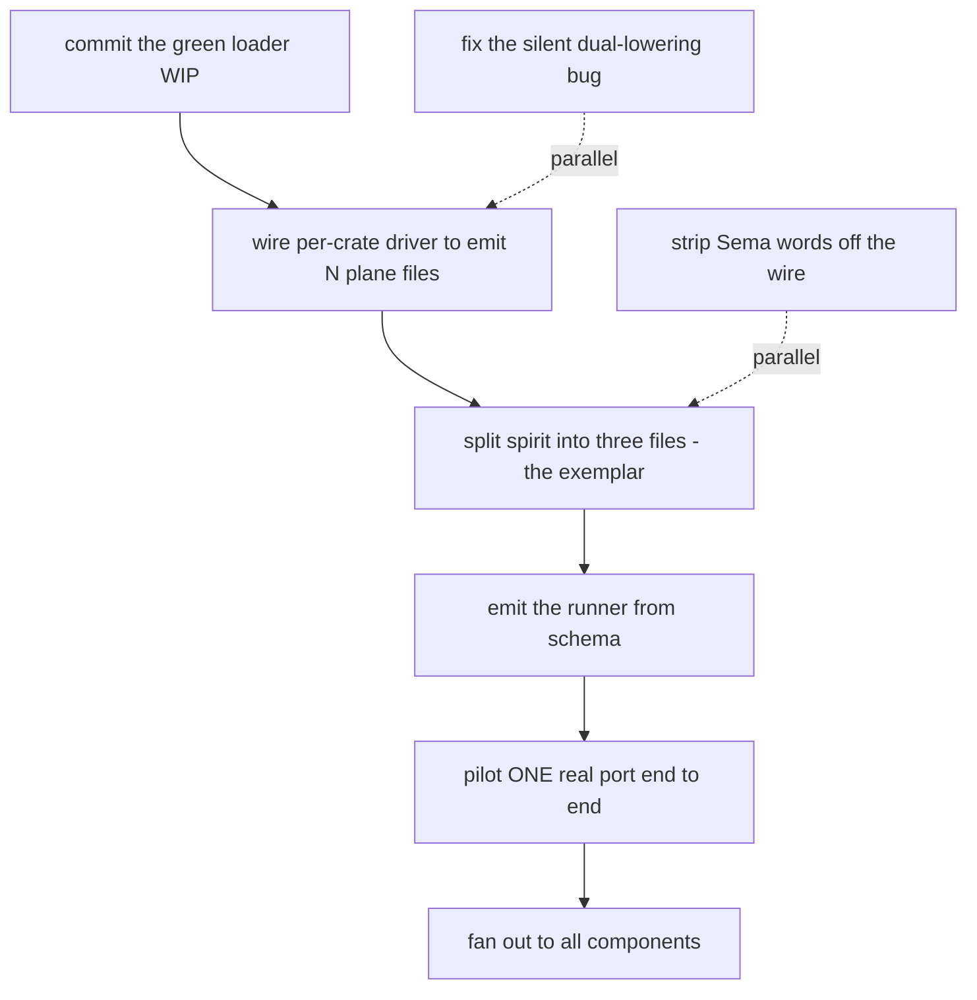

# Audit — Triad engine + schema stack port readiness

> **Update since synthesis (2026-06-04, post-audit designer actions).**
> The substrate moved further while/after this audit ran, and the
> backlog was reconciled:
> - **`primary-1tsw` (multi-plane loading + cross-plane import) LANDED
>   and is CLOSED.** No longer uncommitted WIP — schema-next `main` is
>   at *"load multiple schema modules per package"* with `with_package`
>   (`resolution.rs:158`) and the two tests green
>   (`package_loader_reads_all_schema_modules_in_crate`,
>   `resolver_resolves_import_of_dependency_root_enum`). With
>   `primary-tiy7` (per-plane emission, schema-rust-next 0.1.2) this
>   means **both prerequisite substrate changes are done.**
> - **The per-crate generation DRIVER — critical-path step 2, the
>   single biggest blocker — was UNTRACKED; now filed as
>   `primary-qhi6` (P1).** `cloud/` and `domain-criome/` already carry
>   authored `schema/nexus.schema` + `schema/sema.schema`, but their
>   `build.rs` has zero schema wiring; spirit's `build.rs` still calls
>   `load_lib` (single-plane). The driver wires the multi-plane path
>   to emit N files per crate.
> - **Backlog dedup:** the spirit split is tracked under the
>   pre-existing **`primary-9hx0` (P1)**; my duplicate `qj2g` is closed
>   and folded into it (record-2604 framing + exemplar role + driver
>   dependency noted on 9hx0).
>
> **Current critical-path bead ledger:** `qhi6` (driver, P1) →
> `9hx0` (split spirit = clean exemplar, P1, gated on qhi6) →
> `l89s` (emit the runner, P2, sequence before fan-out) → pilot ONE
> real port (cloud or domain-criome) → fan out. **Parallelizable P1s,
> no dependency on the driver:** `ka39` (strip Sema words off
> signal-upgrade's `HandoverMarker`) and `vllc` (dual-lowering
> bare-header bug).

The psyche asks two things at once: *are we stable*, and *can we
port all the components properly now*. This audit answers both,
sharply separating **design-stability** (settled this session) from
**substrate-stability** (the generator / loader / runner reality),
because the honest answer is different on each axis.

The audit synthesises five sub-agent findings (build/test health,
the runner, the two prerequisite substrate changes, reference-
implementation readiness, and the ordered backlog), then re-verifies
the load-bearing claims against live source — because the substrate
moved *during the session the findings were gathered in*, and the
brief's premise was already stale by the time it was written.

## The headline: the substrate moved under the brief

The task brief and two of the five sub-findings assert that
schema-next **does not compile** (an uncommitted `with_package`
call against a method that does not exist). **That is no longer
true as of this audit.** I re-verified the live working tree:

- `with_package` **is now defined** — `schema-next/src/resolution.rs:155`.
- `schema-next` **compiles clean** — `cargo check --offline` →
  `Finished`.
- The **full suite is green** — `cargo test --offline`, all
  suites pass, including the new ones.
- A new **`plane-crate` fixture** exists with three separate plane
  files (`tests/fixtures/plane-crate/schema/{signal,nexus,sema}.schema`),
  and the daemon-plane `nexus.schema` imports the signal contract's
  root enums: `{ SignalInput plane-crate:signal:Input SignalOutput
  plane-crate:signal:Output }`.
- The two tests that prove the *genuinely-novel* design the brief
  flagged as "unbuilt and unproven" **now pass**:
  `resolver_resolves_import_of_dependency_root_enum` and
  `package_loader_reads_all_schema_modules_in_crate`.

So the single hardest unknown in the whole stack — *can a daemon
plane-schema import root enums (Input/Output) from a separate
signal contract* — is **solved and tested**, not aspirational. This
is a large correction to the port-readiness picture and the reason
the verdict below lands at "close, days-not-weeks" rather than the
brief's "1–1.5 weeks with a real design unknown."

It is **uncommitted WIP**, however (`git status`: modified
`module.rs`, `resolution.rs`, `asschema.rs`, `lib.rs`, plus new
fixtures + tests). It lives in the working tree, not on a shipped
commit, so operators cannot yet build against it. That is a
land-and-commit step, not a design step.

## (1) STABLE? — design-stable, not yet substrate-stable

**Design-stable: YES.** The triad shape is settled and was not
re-litigated this session. A triad component is three separate
plane-schema files minimum — Signal (wire contract), Nexus
(decisions), Sema (durable state) — each its own file, no sections
(records 2597 / 2598 / 2604). The generator emits **per plane**:
Signal → wire types + codec, zero engines; Nexus → Nexus engine;
Sema → Sema engine. Contract repos are wire-only (2593). The daemon
crate holds `nexus.schema` + `sema.schema` as separate files
importing the signal contract (2604, decision A). Sema words are
forbidden on the wire (2612). There is no live design fork; the
open questions are *implementation sequencing*, not *what the shape
is*.

**Substrate-stable: NOT YET, but much closer than the brief
implies.** Three of the things the brief lists as open are in fact
already closed and source-verified:

- **Plane-aware emission (primary-tiy7) shipped.** `schema-rust-next`
  has a full `RustEmissionTarget` enum — `WireContract`,
  `ComponentRuntime`, `NexusRuntime`, `SemaRuntime` — lowering to a
  `RuntimePlaneSet` threaded through ~30 emission sites; engine
  traits gate per plane (`SignalEngine` on `emits_signal`,
  `NexusEngine` on `emits_nexus`, Sema split into `apply`/`observe`
  halves). 44 tests green, including four target-specific cases
  with negative assertions (`WireContract` suppresses ALL engines).
  Commit `ac27ed4`, this session.
- **The engine-plane wire leaks are stripped.** `signal-upgrade`
  and `meta-signal-upgrade` regenerated wire-only; their **schema +
  src** surfaces have zero `NexusAction` / `SemaWriteInput` /
  `SemaEngine` / `NexusEngine` references. (The grep hits in those
  repos are *negative test assertions* — the tests assert those
  names are absent — which confirms the strip rather than
  contradicts it.) Beads primary-52x2 / soj1 effectively closed.
- **spirit is internally correct.** It routes durable reads/writes
  through the generated `SemaEngine` over `sema-engine` (`.sema`),
  not raw redb (`src/nexus.rs:240,245` dispatch to
  `SemaEngine::apply` / `observe`; `src/store.rs:51 impl SemaEngine
  for Store`). The redb-bypass finding is stale.

What is genuinely **not** substrate-stable yet:

- **The per-crate generation DRIVER is still single-plane.**
  `spirit/build.rs` calls `package.load_lib()` and asserts the
  emitted path is `schema/lib.schema` (build.rs:38, 76). The
  loader/resolver beneath it now handles multiple plane files
  (`load_modules`), but no build.rs invokes that path to emit N
  plane files. **Port repos are unwired** — `cloud/build.rs` and
  `domain-criome/build.rs` have zero schema-wiring grep hits, even
  though both already carry authored `nexus.schema` + `sema.schema`
  files.
- **spirit is still all-in-one.** `spirit/schema/lib.schema` is 94
  lines, Signal + Nexus + Sema in one file (bead primary-qj2g,
  unstarted). It is both the bootstrap exception and the template
  every leak was copied from; there is **no clean three-plane
  exemplar** to copy yet.
- **The runner is unbuilt** (see section 2) — the largest
  remaining hand-written surface.
- **Sema-words still on the wire (primary-ka39).** `signal-upgrade`'s
  `HandoverMarker` still carries `commit_sequence`, `write_counter`,
  `last_record_identifier` on the wire (lib.schema:44) — durable-
  state vocabulary on a wire contract, forbidden by 2612.

So: **design-stable yes; substrate-stable not yet — the
capability core is in place and tested, but the generation driver,
the exemplar split, the runner, and a vocabulary cleanup remain.**

## (2) The runner compounds it — still unbuilt

The ratified macro-generated runner (records 1486 / 1419 / 1574 /
1581) — a `triad_main!` emitted by `schema-rust-next` that reads
NexusActions and dispatches reply→wire / write→Sema-apply /
read→Sema-observe / effect→handler / continue→re-enter, so an
author writes only three trait impls plus a one-line main — **does
not exist** in any of its three plausible homes:

- `schema-rust-next` emits **no** `triad_main!` / `run_loop` (grep
  empty). The only generated Nexus drive is a one-shot trace
  wrapper (`NexusEngine::execute` calls `decide` once and returns).
- `spirit` **hand-writes** its entire runner — the `loop { match
  action … }` + `ContinuationBudget` in `src/nexus.rs`, plus a
  hand-coded `UnixListener` accept loop in `src/daemon.rs:101` and
  a hand-written daemon bin. Its own doc comment
  (`src/nexus.rs:182-185`) flags this as temporary: *"A future
  schema-rust-next slice should emit this loop directly from the
  schema; today the runner lives here so the pattern can be proven
  on real code."*
- `triad-runtime` supplies argument parsing, frame codec, and
  trace only — **no** runner, no `NexusAction`, no
  `SignalDaemon<Engine>` (grep empty).

This **compounds** the substrate gap. Even once the generation
driver and exemplar land, an author porting a component still
hand-rolls the loop, budget, dispatch, accept loop, and bin —
exactly what spirit hand-rolled. Porting before the runner exists
locks the hand-rolled-loop debt across the whole component fleet,
and any later runner-generator slice must then be retrofitted
across every component. The runner-extraction work (the never-
created primary-l89s) is neither built nor formally tracked.

## (3) CAN WE PORT ALL COMPONENTS PROPERLY YET? — NOT YET

**No — not all components, not yet.** The thesis in the brief
holds: porting all components before the generation pipeline emits
the settled three-plane shape would re-copy the all-in-one mistake
into every component. But the *reason* is narrower than the brief
framed it, because the hardest capability (cross-plane root-enum
import) is now solved. The remaining gate is **wiring + an
exemplar + the runner**, not a deep design unknown.

Concretely, porting "properly" requires four things that do not
all exist:

1. **Plane-aware emission** — EXISTS (primary-tiy7 shipped, green).
2. **Multi-plane-schema loading + cross-plane root-enum import** —
   EXISTS as tested working-tree WIP (primary-1tsw core), needs
   **commit**.
3. **A per-crate generation driver that emits N plane files** —
   MISSING (build.rs still single-plane; port repos unwired).
4. **A clean three-plane exemplar to copy** — MISSING (spirit
   still all-in-one; runner still hand-written).

Until 3 and 4 land, the right move is **pilot ONE component
through the full split end-to-end before fanning out**. spirit is
the natural pilot (split it per qj2g into the bootstrap-exception
template); cloud or domain-criome is the natural *first real port*
once the exemplar exists. Fanning out to ALL components before the
driver + exemplar + runner exist multiplies the all-in-one / leak /
hand-rolled-loop debt across every triad — the precise failure the
plane-file design was created to prevent.

## (4) The critical path

The single biggest remaining blocker is the **generation driver**:
the loader and resolver now do the hard part, but nothing wires a
per-crate build to emit N plane files. Everything downstream waits
on it.

Ordered, P1 blockers first:

1. **Commit the green loader/import WIP** (primary-1tsw core). It
   compiles and tests pass in the working tree; it is not on a
   shipped commit, so operators cannot build against it. Land it.
2. **Wire the per-crate generation driver** to emit N plane files
   (signal / nexus / sema) instead of one `lib.rs`, and wire the
   port repos' `build.rs`. **This is the single biggest blocker**
   — the loader is ready beneath it, but no build invokes the
   multi-plane path. (Remainder of primary-1tsw / driver work.)
3. **Split spirit into three plane files** (primary-qj2g) — mints
   the clean bootstrap-exception exemplar every future port copies.
   Gated on step 2.
4. **Emit the runner from schema** (the never-created primary-l89s)
   — so a ported component gets the dispatch loop + budget + accept
   loop + bin for free instead of hand-rolling spirit's.
5. **Pilot ONE real port end-to-end** (cloud or domain-criome,
   primary-kbmi.2) against the exemplar — de-risks before fan-out.
6. **Fan out to all components.**

## (5) What CAN be done now, in parallel

These do **not** block on the generation driver and can run as
independent tracks immediately:

- **Strip Sema words off the wire (primary-ka39).** Drop
  durable-state vocabulary from the legacy wire contracts —
  `commit_sequence` / `write_counter` / `last_record_identifier`
  in `signal-upgrade`'s `HandoverMarker`, the `AuthorizedSignalVerb`
  enum in signal-criome, payloadless `SemaObservation` event labels
  across the persona/orchestrate signals. The current generator
  already supports the clean shape; this is contract editing, not
  generator work. Resolves the last open question (OQ3) from
  designer 510.
- **Fix the one genuine generator correctness bug (primary-vllc).**
  `schema-rust-next` has two lowering engines that disagree —
  `AssembledVariant::lower` drops bare-header PascalCase payloads to
  `None` while the `SchemaSource` path resolves them. It is silent
  (the equivalence test passes only because its fixture has no bare
  header). Unify on `SchemaSource` lowering and add a both-paths-
  agree witness. Worth fixing before broad porting trusts the
  emitter.
- **Land the verified-green triad-runtime docs/tests branch
  (primary-60xf)** — trivial, unblocks nothing but reduces churn.

The engine-leak strips the brief lists as parallel work
(primary-52x2 / soj1) are **already done** — verified clean this
session — so they are off the list.

## Reconciliation with the brief

The brief's core thesis survives: porting all components before the
plane pipeline is ready re-copies the all-in-one mistake. Three
corrections land it more optimistically:

- **schema-next compiles and tests green** (the `with_package` WIP
  advanced this session); the brief's "broken build" blocker is
  resolved.
- **The cross-plane root-enum import is solved and tested**
  (`resolver_resolves_import_of_dependency_root_enum` passes); the
  brief's "genuinely-novel, unproven design" is now proven. This
  collapses the largest unknown.
- **primary-tiy7 shipped and both upgrade leaks are stripped**; the
  engine-leak crisis is closed at the contract surface.

The runner finding stands unchanged and compounds the gate. The net
effect is that the remaining work is **commit + wiring + exemplar +
runner**, not deep design — days of focused operator work on the
driver and exemplar, plus the runner slice, before fan-out is safe.

## Evidence (re-verified live this session)

- `schema-next` clean build: `cargo check --offline` → `Finished`;
  `with_package` defined at `src/resolution.rs:155`;
  `with_dependency` delegates to it (:176).
- `schema-next` full suite green: `cargo test --offline`, all
  suites pass; named passes: `resolver_resolves_import_of_dependency_root_enum`,
  `package_loader_reads_all_schema_modules_in_crate`,
  `root_enum_positions_supply_input_and_output_names`.
- New fixture `tests/fixtures/plane-crate/schema/{signal,nexus,sema}.schema`;
  `nexus.schema` imports `plane-crate:signal:Input` / `:Output`;
  the consumer resolution test asserts
  `pub use plane_crate::schema::signal::Input as SignalInput;`
  (`tests/resolution.rs:99`).
- WIP uncommitted: `git status` shows modified `module.rs`,
  `resolution.rs`, `asschema.rs`, `lib.rs` + new fixtures/tests;
  latest committed change is `schema-next: resolve symbol path
  roles through asschema`.
- `schema-rust-next` `RustEmissionTarget` {WireContract,
  ComponentRuntime, NexusRuntime, SemaRuntime}, `src/lib.rs:217-313`;
  commit `ac27ed4` "add per-plane runtime emission targets" + `052d1b2`
  "split wire and runtime emission targets"; 44 tests green; no
  `triad_main` / `run_loop` (grep empty).
- Engine leaks stripped: `signal-upgrade` + `meta-signal-upgrade`
  schema/ + src/ have zero engine-type references; the only grep
  hits are negative test assertions in `tests/generated_schema.rs`.
- spirit sema-engine dispatch: `src/nexus.rs:240` `SemaEngine::apply`,
  :245 `SemaEngine::observe`; `src/store.rs:51 impl SemaEngine for
  Store`. Runner hand-written: `src/nexus.rs:182-185` doc + loop;
  `src/daemon.rs:101` `UnixListener::bind` hand-coded accept loop.
- spirit all-in-one: `schema/lib.schema` = 94 lines, dir holds only
  `lib.schema` + `lib.asschema`.
- Sema words still on wire: `signal-upgrade/schema/lib.schema:44`
  `HandoverMarker { … commit_sequence Integer write_counter Integer
  last_record_identifier (Optional Integer) … }`.
- Generation driver single-plane: `spirit/build.rs:38`
  `package.load_lib()`, :76 path assert on `schema/lib.schema`.
- Port repos unwired: `cloud/build.rs`, `domain-criome/build.rs`
  have zero `nexus.schema` / `sema.schema` / `load_modules` /
  `with_target` grep hits.
- `triad-runtime/src/` has no `triad_main` / `SignalDaemon` /
  `run_loop` / accept-loop (grep empty).
