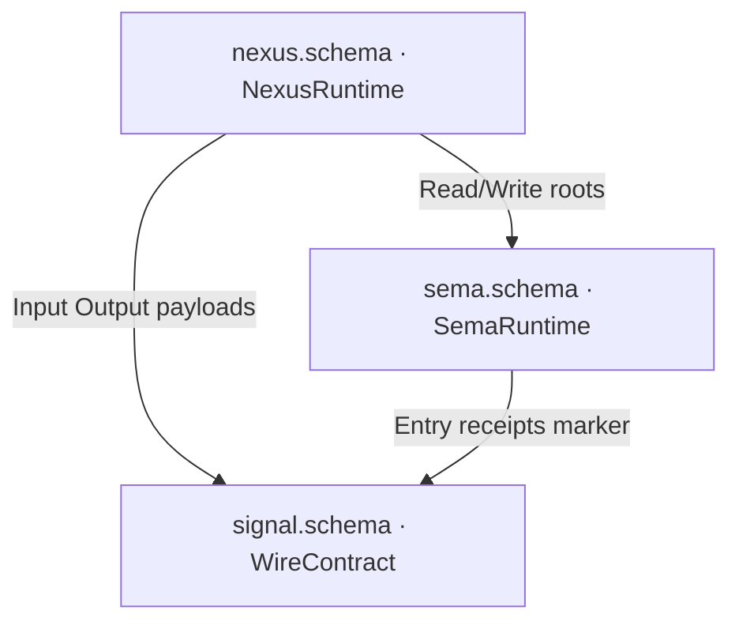

# Design — spirit plane-schema split (Signal / Nexus / Sema)

Bead `primary-9hx0`. Split spirit's all-in-one `schema/lib.schema`
(Signal + Nexus + Sema roots fused in one ComponentRuntime
document) into three separate plane-schema files, each emitted
with its own `RustEmissionTarget`. This split is the clean
bootstrap-exception EXEMPLAR every future triad port copies: the
simplest possible shape — one signal contract, two daemon plane
files, no owner/meta leg.

Schema authoring follows `skills/nota-design.md` and the
schema-next four-block document grammar. This report drafts the
full NOTA schema source for each file; the build.rs migration and
Rust regeneration are the driver's job (bead `primary-qhi6`,
§"Blocked on the driver").

## The signal-spirit question — resolved Reading B

**spirit gets its OWN `schema/signal.schema`. It does NOT import
signal-spirit.** Four facts settle it decisively:

1. **No dependency.** `spirit/Cargo.toml` has no `signal-spirit`
   dependency; signal-spirit declares no `links` key and emits no
   `DEP_SIGNAL_SPIRIT_SCHEMA_DIR`. Cross-crate import requires
   both. The only mention of signal-spirit in the whole spirit
   repo is one prose line (`ARCHITECTURE.md:436`) stating the
   triad split is NOT represented in this pilot repo.

2. **spirit generates its wire types from its OWN schema.**
   `build.rs` loads `schema/lib.schema`; the daemon consumes
   `crate::{Input, Output, InputRoute, OutputRoute}`
   (`src/transport.rs:10`) re-exported from `crate::schema::lib`
   (`src/lib.rs:42`). Nothing in spirit reads from
   `signal_spirit`.

3. **The roots do not match.** signal-spirit is the `/368`
   one-operation MVP proof (version `0.4.0-pre`): Input
   `[(Record Entry)]`, Output `[(RecordAccepted RecordIdentifier)]`,
   four-type namespace. spirit's lib.schema Signal plane has SIX
   operations `[Record Observe Lookup Count Remove LookupStash]`
   and EIGHT replies `[RecordAccepted RecordsObserved
   RecordsStashed RecordFound RecordsCounted RecordRemoved Error
   Rejected]`. Even the shared variant diverges: spirit maps
   `RecordAccepted -> SemaReceipt` (struct); signal-spirit maps
   `RecordAccepted -> RecordIdentifier` (Integer newtype).
   Adopting signal-spirit's Signal plane would silently DROP five
   operations and seven replies.

4. **Report 510's CLEAN mark is about leak-absence, not
   liveness.** signal-spirit is CLEAN only because its tiny
   one-op schema declares no Nexus/Sema gate types — that is the
   wire-only FORM property, not a statement that it is spirit's
   live wire plane. Report 510's own open question (line 346)
   left spirit's single-schema-vs-split status unresolved; this
   report resolves it.

**The exemplar uses the intra-crate three-file shape.** All three
plane files live INSIDE the spirit crate. `nexus.schema` and
`sema.schema` import the Signal roots via the self-package form
`spirit:signal:Input`. This is exactly the schema-next
`tests/fixtures/plane-crate/` working fixture (which actually
lowers in `lowering.rs`), NOT the cross-crate cloud/domain-criome
form (which imports `signal-cloud:lib:Input` and was never built).
`GenerationDriver`'s `import_resolver()` does
`ImportResolver::new().with_package(self.package.clone())`
(`schema-rust-next/src/build.rs:99-101`) — the self-registration
that lets `schema/nexus.schema` resolve `spirit:signal:Input`
against sibling `schema/signal.schema` with no external dependency.

Reconciling the external signal-spirit MVP with spirit's real
six-op wire surface is a SEPARATE follow-up; it must not block the
plane split.

## Root partition — no root lost, no duplication

Every declaration in today's `lib.schema` (lines cited) gets
exactly one home plane. Shared payload types live in their owning
plane and are IMPORTED by the other planes via the
`crate:module:Type` header — never duplicated.

| lib.schema source | Plane | Home decision |
|---|---|---|
| Input roots `[Record … LookupStash]` (l2) + bodies (l13-18) | Signal | wire operation roots |
| Output roots `[RecordAccepted … Rejected]` (l3) + bodies (l19-26) | Signal | wire reply roots |
| All wire payload/leaf types (l42, l46, l57-93) | Signal | payloads belong to the wire contract |
| `NexusWork`/`NexusAction` + arms (l27-37) | Nexus | daemon decision language |
| `NexusEffectCommand`/`Result`/`Stash`/`StashRequest`/`StashResult` (l38-44) | Nexus | the effect (stash) sub-language |
| `SemaWriteInput`/`SemaReadInput`/`…Output` + arms (l47-56) | Sema | durable read/write vocabulary |
| Reuse plumbing `Source/Local/PublicPath`, `Import`/`Export`, `*Reuse` (l5-12) | DROP | vestigial; superseded by the `{}`-import block |
| Mail-ledger `Mail*`/`SentMail`/`ProcessedMail`/`MailLedgerEvent` + undefined `OriginRoute` (l74-80) | DROP | unwired to any root; `OriginRoute` undefined; not part of the record store |

**Cross-plane imports.** Nexus imports from BOTH Signal and Sema;
Sema imports payload/receipt types from Signal. The full edge
set:

- `nexus` imports `spirit:signal:Input`, `spirit:signal:Output`
  (the SignalArrived feed + ReplyToSignal sink), plus
  `spirit:sema:ReadInput/ReadOutput/WriteInput/WriteOutput`
  (the SEMA command/completion roots), plus
  `spirit:signal:Records`, `spirit:signal:DatabaseMarker`,
  `spirit:signal:StashHandle`, `spirit:signal:RecordCount` (the
  stash effect's payloads).
- `sema` imports `spirit:signal:Entry`, `…RecordIdentifier`,
  `…Query`, `…SemaReceipt`, `…RemoveReceipt`, `…ErrorReport`,
  `…ObservedRecords`, `…FoundRecord`, `…CountedRecords`,
  `…DatabaseMarker`.

**Sema root naming — match the reference.** spirit's lib.schema
names the SEMA roots `SemaWriteInput`/`SemaReadInput`/etc.;
the domain-criome reference names them `WriteInput`/`ReadInput`/
`WriteOutput`/`ReadOutput` (the `Sema` prefix is redundant inside
`sema.schema`). The split adopts the reference names INSIDE
`sema.schema` and applies the `Sema`-prefixed names as IMPORT
ALIASES in `nexus.schema` (`SemaReadInput spirit:sema:ReadInput`).
This keeps the daemon-facing Nexus language byte-identical to
lib.schema while shedding the redundant prefix in the owning file.



## The four-block document shape (every plane file)

Each `.schema` file is exactly four top-level blocks in order
(`schema-next/ARCHITECTURE.md`):

- block 1 `{ }` — Imports brace: `LocalAlias crate:module:Type`
  pairs. Empty `{}` for a self-contained wire contract.
- block 2 `[ ]` — the Input root enum (operation roots).
- block 3 `[ ]` — the Output root enum (reply/result roots).
- block 4 `{ }` — the namespace of user-defined types
  (`Name body` pairs, no paren-wrapping per
  `nota-design.md:356`).

Import target grammar: `crate:module:Type` (single colon, three
positions). `module` is the schema FILE STEM (`signal` ->
`schema/signal.schema`; `sema` -> `schema/sema.schema`). The
resolver emits `pub use <crate>::schema::<module>::<Type> as
<Local>;`; the importing module does NOT re-declare the type.

## File set to author under `spirit/schema/`

`schema/lib.schema` and `schema/lib.asschema` are REMOVED by the
split (after `build.rs` migrates). Three new authored files:

1. `spirit/schema/signal.schema` -> `WireContract`
2. `spirit/schema/nexus.schema` -> `NexusRuntime`
3. `spirit/schema/sema.schema` -> `SemaRuntime`

The full draft NOTA source for each is in the StructuredOutput
`files` array (and reproduced verbatim below for readers).

### `spirit/schema/signal.schema` (WireContract)

```nota
;; spirit Signal plane schema — the wire contract.
;;
;; Client-facing operation Input roots, reply Output roots, and
;; every payload/leaf type. WireContract target: wire vocabulary
;; plus rkyv codec only, zero engine/runtime support. Nexus and
;; Sema import their wire types from this module.
{}
[Record Observe Lookup Count Remove LookupStash]
[RecordAccepted RecordsObserved RecordsStashed RecordFound RecordsCounted RecordRemoved Error Rejected]
{
  Record Entry
  Observe Query
  Lookup RecordIdentifier
  Count Query
  Remove RecordIdentifier
  LookupStash StashHandle

  RecordAccepted SemaReceipt
  RecordsObserved ObservedRecords
  RecordsStashed StashedObservation
  RecordFound FoundRecord
  RecordsCounted CountedRecords
  RecordRemoved RemoveReceipt
  Error ErrorReport
  Rejected SignalRejection

  Topic String
  Topics (Vec Topic)
  Description String
  ErrorMessage String
  RecordIdentifier Integer
  CommitSequence Integer
  StateDigest Integer
  RecordCount Integer
  StashHandle Integer

  DatabaseMarker { CommitSequence * StateDigest * }
  SemaReceipt { RecordIdentifier * DatabaseMarker * }
  RemoveReceipt { RecordIdentifier * DatabaseMarker * }
  ObservedRecords { RecordSet * DatabaseMarker * }
  FoundRecord { RecordIdentifier * Entry * DatabaseMarker * }
  CountedRecords { RecordCount * DatabaseMarker * }
  ErrorReport { ErrorMessage * DatabaseMarker * }
  SignalRejection { ValidationError * DatabaseMarker * }
  StashedObservation { StashHandle * RecordCount * DatabaseMarker * }
  ValidationError [EmptyTopic EmptyDescription EmptyQueryTopic StashHandleNotFound]

  TopicMatch [Partial Full]
  Partial Topics
  Full Topics
  Privacy Magnitude
  PrivacySelection [Any Exact AtMost AtLeast]
  Exact Privacy
  AtMost Privacy
  AtLeast Privacy

  Entry { Topics * Kind * Description * Magnitude * Privacy * }
  Query { TopicMatch * kind (Optional Kind) privacy_selection PrivacySelection }
  Records (Vec Entry)
  RecordSet (Vec Entry)
  Kind [Decision Principle Correction Clarification Constraint]
  Magnitude [Zero Minimum VeryLow Low Medium High VeryHigh Maximum]
}
```

### `spirit/schema/sema.schema` (SemaRuntime)

```nota
;; spirit SEMA plane schema — daemon-owned.
;;
;; Runtime implementation schema, not a Signal contract. It imports
;; the wire payload + receipt types from the Signal contract and
;; names the durable read/write command + result roots the daemon's
;; SEMA engine drives. State markers live on the imported
;; DatabaseMarker; spirit owns no extra durable tables in this
;; pilot.
{
  Entry spirit:signal:Entry
  Query spirit:signal:Query
  RecordIdentifier spirit:signal:RecordIdentifier
  SemaReceipt spirit:signal:SemaReceipt
  RemoveReceipt spirit:signal:RemoveReceipt
  ObservedRecords spirit:signal:ObservedRecords
  FoundRecord spirit:signal:FoundRecord
  CountedRecords spirit:signal:CountedRecords
  ErrorReport spirit:signal:ErrorReport
}
[WriteInput ReadInput]
[WriteOutput ReadOutput]
{
  WriteInput [Record Remove]
  Record Entry
  Remove RecordIdentifier

  ReadInput [Observe Lookup Count]
  Observe Query
  Lookup RecordIdentifier
  Count Query

  WriteOutput [Recorded Removed Missed]
  Recorded SemaReceipt
  Removed RemoveReceipt
  Missed ErrorReport

  ReadOutput [Observed Found Counted Missed]
  Observed ObservedRecords
  Found FoundRecord
  Counted CountedRecords
}
```

### `spirit/schema/nexus.schema` (NexusRuntime)

```nota
;; spirit Nexus plane schema — daemon-owned.
;;
;; Runtime implementation schema, not a Signal contract. It imports
;; the Signal roots (the arriving-signal feed and the reply sink)
;; plus the local SEMA roots, then names the daemon decision
;; language: react to signal arrivals and SEMA completions by
;; commanding SEMA reads/writes, the stash effect, or a client
;; reply. spirit has no owner/meta contract, so SignalInput =
;; the ordinary Input alone.
{
  SignalInput spirit:signal:Input
  SignalOutput spirit:signal:Output
  SemaReadInput spirit:sema:ReadInput
  SemaReadOutput spirit:sema:ReadOutput
  SemaWriteInput spirit:sema:WriteInput
  SemaWriteOutput spirit:sema:WriteOutput
  Records spirit:signal:Records
  RecordCount spirit:signal:RecordCount
  StashHandle spirit:signal:StashHandle
  DatabaseMarker spirit:signal:DatabaseMarker
}
[SignalArrived SemaWriteCompleted SemaReadCompleted EffectCompleted]
[CommandSemaWrite CommandSemaRead ReplyToSignal CommandEffect Continue]
{
  SignalArrived SignalInput
  SemaWriteCompleted SemaWriteOutput
  SemaReadCompleted SemaReadOutput
  EffectCompleted NexusEffectResult

  CommandSemaWrite SemaWriteInput
  CommandSemaRead SemaReadInput
  ReplyToSignal SignalOutput
  CommandEffect NexusEffectCommand
  Continue NexusWork

  NexusWork [SignalArrived SemaWriteCompleted SemaReadCompleted EffectCompleted]
  NexusAction [CommandSemaWrite CommandSemaRead ReplyToSignal CommandEffect Continue]

  NexusEffectCommand [Stash]
  Stash StashRequest
  NexusEffectResult [Stashed]
  Stashed StashResult
  StashRequest { Records * DatabaseMarker * }
  StashResult { StashHandle * RecordCount * DatabaseMarker * }
}
```

Note on the Nexus root pair. The brief's domain-criome reference
uses unnamed `[SignalArrived …]` / `[CommandSemaRead …]` Input/
Output roots and keeps `NexusInput`/`NexusOutput` only as
namespace re-projections fed by `Continue`. spirit's lib.schema
named those root enums `NexusWork`/`NexusAction`. The draft above
keeps spirit's `NexusWork`/`NexusAction` as the namespace re-
projection (so `Continue -> NexusWork` is byte-identical to
lib.schema) while the block-2/block-3 ROOTS are the bare variant
lists schema-next expects. This preserves lib.schema's vocabulary
exactly and matches the reference's structural shape.

## Authorable now vs blocked on the driver (`primary-qhi6`)

**Authorable now — the three schema files above.** They are pure
NOTA schema source. They depend on nothing but the
already-published schema-next import grammar and the schema-rust-
next `RustEmissionTarget` variants (`WireContract`/`NexusRuntime`/
`SemaRuntime`, present in 0.1.2). They can be written into
`spirit/schema/` immediately and reviewed against the four-block
grammar by eye.

**Blocked on the driver (`primary-qhi6`) — build.rs migration +
regeneration + freshness assertion.** A `.schema` file does NOT
select its own emission target; `build.rs` does, via the
`GenerationPlan`/`ModuleEmission` it constructs. The current
spirit `build.rs` builds a single-module
`GenerationPlan::component_runtime_compatibility(root, spirit,
0.1.0)` and runs it through `GenerationDriver`. The migration is a
clean swap to a three-module plan — schema-rust-next's `build`
module already exposes first-class per-plane builders, so this is
NOT a hand-rolled `RustEmitter` loop:

```rust
let plan = GenerationPlan::new(&self.crate_root, "spirit", "0.1.0")
    .with_module(ModuleEmission::wire_contract_module("signal"))
    .with_module(ModuleEmission::nexus_runtime())
    .with_module(ModuleEmission::sema_runtime());
GenerationDriver::new(plan)
    .generate()?
    .write_or_check("SPIRIT_UPDATE_SCHEMA_ARTIFACTS")?;
```

`GenerationDriver::generate()` iterates `plan.modules()`, lowering
each module name (`signal`/`nexus`/`sema`) against a resolver that
already self-registers the package
(`import_resolver` = `ImportResolver::new().with_package(...)`,
`build.rs:99-101`), so the intra-crate `spirit:signal:Input` and
`spirit:sema:ReadInput` imports resolve with no dependency wiring.
The driver owns:

- swapping the `GenerationPlan` and removing the `lib.schema`/
  `lib.asschema`/`lib.rs` `rerun-if-changed` lines for the three
  new module stems;
- REGENERATING `src/schema/signal.rs`, `src/schema/nexus.rs`,
  `src/schema/sema.rs` (the per-module Rust the planes now emit)
  and the matching `.asschema` lowered artifacts, replacing
  `src/schema/lib.rs` + `schema/lib.asschema`;
- updating `src/lib.rs` re-exports: `crate::{Input, Output,
  InputRoute, OutputRoute}` now come from `crate::schema::signal`,
  not `crate::schema::lib` (`src/transport.rs:10` consumes them);
  the Nexus/Sema engine types come from `crate::schema::nexus` /
  `crate::schema::sema`;
- the freshness assertion (`write_or_check`) over the new
  per-module artifact set;
- handling the WireContract consequence: `WireContract` emits NO
  engine traits (`emits_runtime_support() == false`). Any current
  spirit code that today consumes engine traits emitted from the
  Signal types under ComponentRuntime must move to consuming the
  Nexus/Sema-emitted runtime support.

The schema files are the design; the driver bead is the
mechanical regeneration that makes them build. The two are
authored against the same partition, so the schema files can land
first and the driver can validate them by regenerating.

## Why this is the canonical exemplar

spirit is the SIMPLEST possible split: one ordinary signal
contract, two daemon plane files, no owner/meta leg, all in one
crate. It is structurally domain-criome minus the owner imports,
and it is the FIRST to actually compile the cross-plane root-enum
import (cloud/domain-criome authored the shape but never built
it; the plane-crate fixture proves the mechanism but carries toy
types). Once spirit builds green, the three files here are the
copy-paste template for every triad port: author `signal.schema`
(WireContract), `nexus.schema` (NexusRuntime importing
`<crate>:signal:Input/Output` + `<crate>:sema:*`), `sema.schema`
(SemaRuntime importing the wire payloads), then point `build.rs`
at the three-module plan. Ports WITH an owner contract add the
`OwnerInput`/`OwnerOutput` import leg in `nexus.schema` and union
it into `SignalInput`/`SignalOutput` exactly as domain-criome
does.
