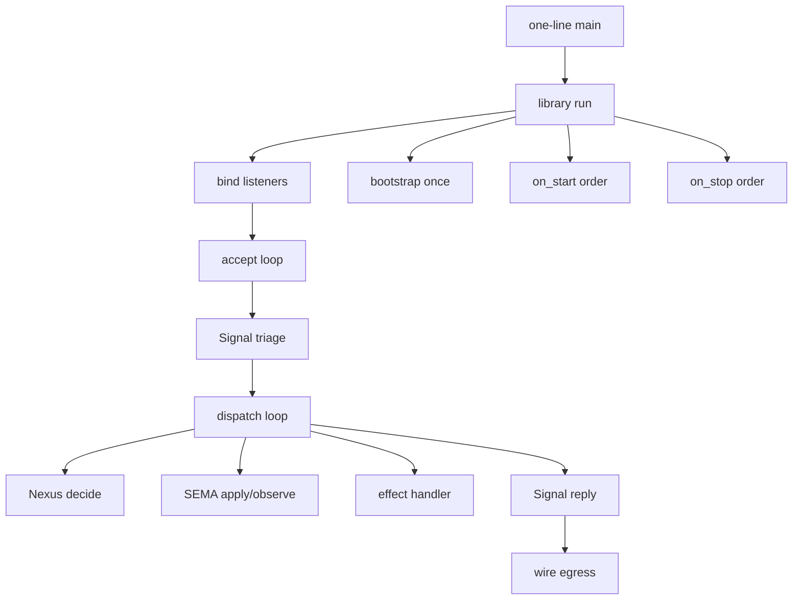
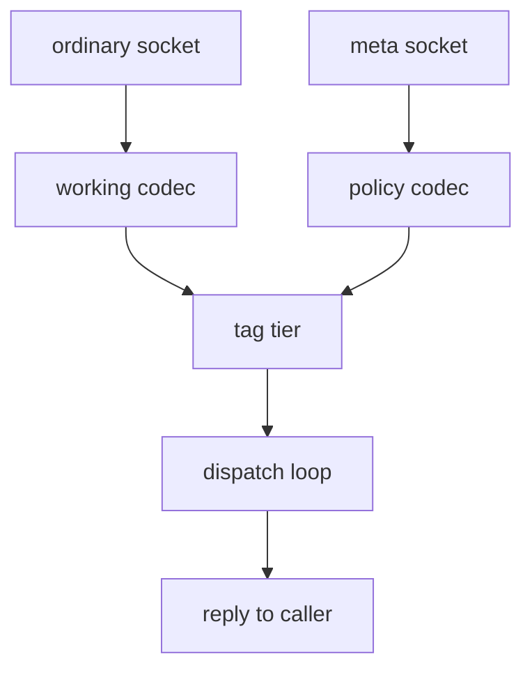
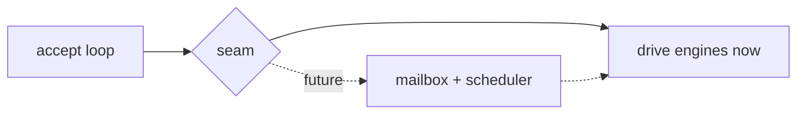

# 513 — Psyche — the shared triad runner

## What this report is, in one breath

Every triad daemon today hand-writes the same plumbing — the loop
that drives a decision, the socket accept loop, the one-line `main`,
the start/stop ordering, the continuation budget. The pilot daemon
(the `spirit` repo) hand-rolls all of it; the production daemon (the
`persona-spirit` repo) hand-rolls a bigger version with four
sockets. None of it is component-specific. **The shared triad
runner** is the generic library that swallows all of that, so a
component author writes only three small things — how to triage a
message, how to decide, how to read/write durable state — and gets
the entire daemon for free.

This report is the build spec. It walks every decision we have to
make, shows the real "before" code (what each daemon hand-writes
today) next to the "after" code (the shared runner plus a one-line
component `main`), and gives a recommendation on each. It ends with
an ordered build plan and the handful of questions only you can
settle.

A note on naming you'll see throughout: the three engines are
**Signal** (all communication), **Nexus** (all decision-making),
and **SEMA** (all durable state). A *component* is one daemon —
the `spirit` daemon, the `persona-spirit` daemon. The thing we're
building lives in a small shared library crate called
**triad-runtime**, which already exists and already owns the
wire-frame codec, the single-argument rule, and the trace
transport. We are adding the runner on top of machinery that is
already there.

## The one-paragraph payoff

The deepest reason to build this is not "less boilerplate." It is
that a law we currently police by hand becomes structurally
impossible to break. The law (ratified as a constraint, Spirit
record 2560 — *strict engine separation: SEMA owns all
database code, Nexus owns all decision code, Signal owns all
communication code; a daemon contains none of those outside its
engine*) is today enforced by auditing. Once the runner owns
everything outside the three engine impls, a database leak or a
decision leak has **nowhere to live** — there is no hand-written
host code to leak into. The audit becomes vacuous by construction.
That is the prize.

## The shape, before any decisions

Here is the whole runner as a picture. Keep it in mind while
reading the decisions — every decision is about one box.



Everything in that picture except the engine work — Signal (triage
in, reply out), Nexus decide, SEMA apply/observe — and the effect
handler is generic library code; the runner owns the rest. Signal
brackets the flow at both ends; its body is usually thin (framing,
identity, and routing are library-assisted) but it is the third
engine and belongs in the picture.

## Operator reconciliation (operator report 310)

The operator reviewed this design and the two lanes have converged.
The direction stands; six refinements are **accepted into the
design** and supersede the corresponding parts below.

1. **The runner is a harness, not a fourth engine.** It owns the
   generic loop, transport, and lifecycle order — never
   communication, decision, or database *semantics*. A too-powerful
   runner is exactly where "no daemon boilerplate outside the
   engines" could be re-violated; it stays mechanism-only.

2. **The bundled engine adapter is GENERATED, not hand-written.** The
   author implements only the three plane engine traits plus an
   effect handler and a typed budget-exhausted reply. The *generator*
   implements the bundled adapter over a data-bearing component
   runtime object that owns the three engines. The bundle is library
   glue the runner consumes — not a fourth contract the author hand-
   implements. (Corrects Decision 2, which read as if the author
   implements the bundle.)

3. **"One thread per listener" and "drop the mutex" cannot both hold
   naively — the body overstated it.** If several listener threads
   drove the engine directly they would need a shared lock; if the
   runner owns the engine by value with the borrow as the single-
   flight guard, there must be exactly ONE execution owner. The
   correct shapes: **phase one** = one listener, one runner thread,
   owned engine, no mutex (matches the pilot, proves the extraction);
   **multi-listener** = listener threads only decode and hand typed
   accepted-work to ONE engine-owner loop that drives sequentially —
   a minimal internal handoff, NOT the deferred scheduler. (Corrects
   Decisions 4 and 9.)

4. **Plane envelopes stay type-distinct, not aliases.** Sharing the
   envelope *mechanics* is right (an inner `PlaneEnvelope<Root>`, or a
   phantom-typed `Envelope<PlaneKind, Root>`), but the public Signal /
   Nexus / SEMA envelope types must stay distinct in the type system —
   the compiler must reject passing a Signal envelope where Nexus is
   expected. Bare type aliases are not enough. (Sharpens the plane-
   aware guard above.)

5. **The action→`NextStep` projection is total, never a panic.** The
   generated conversion from a component's action enum into the
   runner's fixed five-outcome shape must be exhaustive over the
   action variants; no `_ => panic`. An unknown variant fails emission
   or forces an explicit escape hatch — the projection is the safety
   core of the loop, not a narrow helper. (Corrects Decision 2's
   projection helper.)

6. **Bootstrap: NOTA source, binary at the daemon.** First-start
   policy is authored as `bootstrap-policy.nota` (the human-authored
   repo source of truth), pre-encoded by build/deploy tooling into a
   typed binary artifact, and the production daemon consumes ONLY the
   binary at first start — keeping the NOTA parser out of the live
   daemon. Later policy changes enter through meta-signal mutations,
   never by re-reading the file. (Resolves a NOTA-vs-binary tension
   this report had not addressed.)

The concurrency-mode question (Decision O1) is already aligned: a
runtime/deploy knob, with the schema carrying only semantic
constraints (ordering, idempotence, single-writer, cancellability)
if they ever become real — never the concurrency mechanism itself.

## The single most important finding

The thing we want to extract is **not** where you would expect it.
Today, the dispatch loop — the heart of the runner — does not live
in any shared place and does not live in the generated engine
trait. It is hand-written **inside the component's own decision
method**. In the pilot daemon, the file `src/nexus.rs` (lines
222–268) defines `fn decide`, and that method is supposed to be the
component's one pure decision step. Instead it contains a full
`loop {}` that drives the whole machine and delegates the *actual*
decision to a separate private method called `step_decide`.

This is backwards, and fixing it is half the work. The generated
trait already has the right shape — there is a `decide` method (one
pure step) and an `execute` method that is meant to wrap it. The
generated `execute` today only fires two trace hooks and calls
`decide` once:

```rust
// what the schema emits today (the pilot's src/schema/lib.rs:1897)
fn decide(&mut self, input: Nexus<Work>) -> Nexus<Action>;

fn execute(&mut self, input: Nexus<Work>) -> Nexus<Action> {
    self.trace_nexus_entered();
    let output = self.decide(input);   // ONE call. No loop.
    self.trace_nexus_decided();
    output
}
```

So the loop got smuggled into `decide`. The extraction is exactly:
**lift the loop out of `decide`, put it in the runner, and let the
component implement only the single pure step** (today's
`step_decide` becomes the trait's `decide`). After the extraction,
the component's `decide` shrinks from a 47-line loop to a 7-line
match. That before/after is the spine of this whole report.

## Decision 1 — Where the runner lives

**The question.** Three candidate homes. (a) The whole loop is
emitted per component by the schema generator — a big
`triad_main!` macro that expands into the loop, the accept code,
and the `main`. (b) A generic `run()` function lives in the shared
runtime library and every component calls it. (c) A hybrid: the
mechanism is real library code; the generator emits only the thin
wiring that names the component's types and the one-line `main`.

**What's already true.** The shared library (the `triad-runtime`
crate) already owns the three things the runner builds on: the
wire-frame codec (`LengthPrefixedCodec` — a four-byte length prefix
then that many bytes), the single-argument rule
(`ComponentCommand`, which classifies the one argv into inline NOTA
/ a NOTA file / a signal-encoded file), and the trace transport
(`TraceSocketListener`, which already binds a Unix socket, makes the
parent dir, removes a stale socket, sets non-blocking, accepts, and
cleans up on drop). The crate's own architecture file names the
runner as its next job: *"Future extraction waves may add generic
daemon command scaffolding, signal transport, and trace-aware test
harnesses. Those move here only when a second component would
otherwise copy the same mechanics."* The runner **is** that wave —
and the production daemon copying the accept loop four times over is
the second-component trigger that fires it.

**The catch.** A literal generic `run()` cannot match on the
action enum, because the enum's five variants reach component-
specific payload types through per-component aliases (the
`ReplyToSignal` variant carries that component's `Output` type, the
`CommandSemaWrite` variant carries that component's write-input
type, and so on). The library cannot name `spirit::Output` without
depending on spirit. This is the real obstacle, and it is the only
thing that pushes any code into the generator at all.

**The resolution: hybrid, weighted to the library.** The mechanism
— the loop, the budget, the accept code, the lifecycle ordering,
the bootstrap sequencing, the shutdown — is real, debuggable
library code in `triad-runtime`, generic over the three engine
traits via bounds. The generator emits only two thin things: (1) a
small projection that lets the library see the action variants
through a *fixed, generic* shape (detailed in Decision 2), and (2)
the one-line `main`. A 200-line macro-expanded loop is undebuggable
black-box output; a library function is real code you can step
through, test directly, and read. This also matches the ratified
direction (Spirit record 1488 — *the schema carries the triad
mechanism as the baseline so authors get the runner shape, trace
plumbing, and continuation substrate through generation*): the
generation delivers the *shape*; the library holds the *mechanism*.
The macro names the wiring; the library is the wiring.

> **Recommendation.** Hybrid, weighted to the library. The loop,
> accept, lifecycle, budget, bootstrap, and shutdown live as a
> generic `run()` over the three engine traits in `triad-runtime`.
> The generator emits only a tiny per-component action-projection
> (so the library can match a generic shape) and the one-line
> `main`. No big macro.

## Decision 2 — The dispatch loop and its trait bounds

**The before.** Here is the loop exactly as it lives today, buried
inside the pilot's `decide`. Read it once — it is the most
important code in the whole stack.

```rust
// BEFORE — the pilot's src/nexus.rs:222-268, hand-written
// INSIDE the component's decide method (the wrong place):
fn decide(&mut self, input: Nexus<Work>) -> Nexus<Action> {
    let origin_route = input.origin_route();
    let mut work = input.into_root();
    let mut budget = ContinuationBudget::default_for_pilot();

    loop {
        let action = self.step_decide(work);   // the REAL decision

        match action {
            NexusAction::ReplyToSignal(reply) => {
                // the ONLY exit to the wire
                return NexusAction::reply_to_signal(reply)
                    .with_origin_route(origin_route);
            }
            NexusAction::CommandSemaWrite(command) => {
                let out = SemaEngine::apply(
                    &mut self.store, command.with_origin_route(origin_route));
                work = NexusWork::sema_write_completed(out.into_root());
            }
            NexusAction::CommandSemaRead(command) => {
                let out = SemaEngine::observe(
                    &self.store, command.with_origin_route(origin_route));
                work = NexusWork::sema_read_completed(out.into_root());
            }
            NexusAction::CommandEffect(command) => {
                let result = self.apply_effect(command);
                work = NexusWork::effect_completed(result);
            }
            NexusAction::Continue(next_work) => {
                work = next_work;   // re-enter in-process, same stack
            }
        }

        match budget.spend_one() {
            Some(remaining) => budget = remaining,
            None => {
                return NexusAction::reply_to_signal(Output::error(/* … */))
                    .with_origin_route(origin_route);
            }
        }
    }
}
```

**The structure is 100% generic.** Every single line of that loop
except the four call targets (`step_decide`, `apply`, `observe`,
`apply_effect`) is component-agnostic. It never looks inside a
payload — it only reads the variant tag and routes. The action set
is genuinely **closed** at five variants, and the asymmetry between
what goes in and what comes out is load-bearing (Spirit record
1438, a correction: *Nexus input is the facts/replies it decides
from; Nexus output is the commands it emits next — they are not
symmetric lists of the same operations*). Input is four facts
(a signal arrived; a write finished; a read finished; an effect
finished); output is five commands:

| Output command | What the runner does with it |
|---|---|
| `ReplyToSignal` | Hand the reply to Signal, write it to the wire. The only exit. |
| `CommandSemaWrite` | Call SEMA apply; feed the result back as "write completed." |
| `CommandSemaRead` | Call SEMA observe; feed the result back as "read completed." |
| `CommandEffect` | Call the component's effect handler; feed back "effect completed." |
| `Continue` | Re-enter the loop in-process on the same stack — a plain function call, no round trip. |

The asymmetry is why `Continue` is the same type as the work-input
(`Continue` is a type alias straight back onto the work fact). The
recursion is type-checked by construction; the generator never
special-cases it.

**The obstacle and the projection.** The library cannot match on a
component's action enum directly. The clean fix uses something the
generator *already proves it can do*: emit code that pattern-matches
these exact five variants by name. The generator already emits
projection helpers like "turn this action into the SEMA write input"
that match `NexusAction::CommandSemaWrite(input) => …` by name. So
we have the generator emit one more such projection: turn the
component action into a fixed, generic shape the library owns —
call it `NextStep`. The library matches `NextStep`; the generator
maps the component's variants into it.

```rust
// AFTER — in the library (triad-runtime), generic, debuggable:
// The fixed shape the library dispatches on. Five outcomes,
// parameterised over the component's own payload types.
pub enum NextStep<Reply, Write, Read, Effect, Work> {
    Reply(Reply),
    SemaWrite(Write),
    SemaRead(Read),
    RunEffect(Effect),
    Continue(Work),
}

// The component's engine set, expressed as ONE trait the
// component implements (or that the generator implements for it):
pub trait TriadEngines {
    type Reply;  type Write;  type Read;  type Effect;  type Work;

    // the three engines, plus the effect handler (Decision 7)
    fn decide_step(&mut self, work: Self::Work)
        -> NextStep<Self::Reply, Self::Write, Self::Read,
                    Self::Effect, Self::Work>;
    fn apply_write(&mut self, write: Self::Write) -> Self::Work;
    fn observe_read(&self, read: Self::Read) -> Self::Work;
    fn run_effect(&mut self, effect: Self::Effect) -> Self::Work;
    fn budget_exhausted_reply(&self) -> Self::Reply;   // Decision 3
}

// The loop, now REAL LIBRARY CODE, owning what was smuggled
// into decide:
impl Runner {
    pub fn drive<E: TriadEngines>(engines: &mut E,
        first: E::Work, mut budget: ContinuationBudget) -> E::Reply {
        let mut work = first;
        loop {
            match engines.decide_step(work) {
                NextStep::Reply(reply)      => return reply,
                NextStep::SemaWrite(write)  => work = engines.apply_write(write),
                NextStep::SemaRead(read)    => work = engines.observe_read(read),
                NextStep::RunEffect(effect) => work = engines.run_effect(effect),
                NextStep::Continue(next)    => work = next,
            }
            match budget.spend_one() {
                Some(remaining) => budget = remaining,
                None => return engines.budget_exhausted_reply(),
            }
        }
    }
}
```

The generator's only contribution to this loop is one small
emitted `From<ComponentAction> for NextStep<…>` (or an
`into_next_step()` method on the component action) — a few lines it
already knows how to write. Everything else is library code.

**On the origin-route plumbing.** The pilot threads `origin_route`
by hand through every branch (`with_origin_route(origin_route)`).
The plane envelopes — the `{ origin_route, root }` wrappers that
carry every message — are three *identical* generic structs in the
generated code. They are pure transport shells with zero component
meaning. **Hoist them into the library as one shared
`Plane<Root>`** (or three thin aliases). Then the route lives on
the envelope the library owns, the route-threading disappears from
the loop, and the per-component duplication of three identical
structs disappears too.

> **Recommendation.** The loop is library code, dispatched on a
> fixed generic `NextStep` shape. The component supplies the three
> engine impls behind one `TriadEngines` bound; the generator emits
> only the small projection from the component's action enum into
> `NextStep`. Hoist the three identical plane envelopes into one
> shared `Plane<Root>` so the route-threading lives in the library,
> not the loop.
>
> **Stay typed and plane-aware (operator review).** `Plane<Root>` is
> parameterized by *each plane's root type* and `NextStep` by the
> component's typed payloads — the envelope is shared transport, but
> the plane identity and the payload types are never erased. Do NOT
> collapse the three planes into one opaque generic envelope: that
> would recreate the all-in-one schema leak on the runtime side. The
> shared shell removes duplicated *structure*; it must preserve plane
> *semantics*.

## Decision 3 — The continuation budget and what exhaustion does

**The before.** The budget already exists, already as exactly the
right shape, already with a doc comment that says it should move:
*"The budget travels with the runner, not the daemon's hand-written
code."*

```rust
// BEFORE — the pilot's src/nexus.rs:22-47, fully generic already:
pub struct ContinuationBudget(u32);
impl ContinuationBudget {
    pub fn default_for_pilot() -> Self { Self(32) }
    pub fn from_iteration_count(count: u32) -> Self { Self(count) }
    pub fn remaining(self) -> u32 { self.0 }
    pub fn spend_one(self) -> Option<Self> {
        if self.0 == 0 { None } else { Some(Self(self.0 - 1)) }
    }
}
```

This is a clean, component-free value object. It moves into the
library nearly verbatim. Only one thing is component-specific: the
hard-coded `32`. That becomes a config field
(`from_iteration_count` already exists for it), so each component
tunes its own bound. The single-argument rule means there are no
flags — the budget is a field in the component's config NOTA, not
a `--budget=32` flag.

**What exhaustion does.** Two sub-questions. First, *panic vs drop
vs typed reply?* The pilot already does the right thing: a typed
error reply on the wire, never a panic and never a silent drop. A
misbehaving decider that loops forever gets cut off and the client
gets a real answer. Keep that. Second, *who builds the error
reply?* The pilot fabricates an `Output::error` with a component-
specific error report and database marker — the library cannot build
that payload, it doesn't know the component's `Output` type. So the
library must delegate: the budget-exhaustion reply is a method on
the engine set (`budget_exhausted_reply()` in the `TriadEngines`
trait above). The runner detects exhaustion generically; the
component renders the reply.

> **Recommendation.** Move `ContinuationBudget` to the library
> verbatim. The `32` becomes a config field
> (`continuation_budget`), defaulting to 32 if absent. Exhaustion
> returns a typed error reply on the wire — never panic, never drop.
> The runner detects exhaustion; the component mints the reply
> through a `budget_exhausted_reply()` hook (the library cannot
> build a component-typed payload).

## Decision 4 — The accept loop and the two-listener model

This is where the pilot is *least* representative and where the
real shape must come from the production daemon. The pilot's accept
loop is the "simple loop" — and that simple loop is **not a real
triad daemon**.

**The pilot's before (one socket only).**

```rust
// BEFORE (pilot) — src/daemon.rs:96-117. ONE listener, no meta tier:
pub fn run(&self) -> Result<(), DaemonError> {
    if let Some(parent) = self.configuration.socket_path().parent() {
        fs::create_dir_all(parent)?;
    }
    self.remove_stale_socket()?;
    let listener = UnixListener::bind(self.configuration.socket_path())?;
    let mut engine = self.engine()?;
    engine.start()?;
    let engine = Arc::new(engine);
    for stream in listener.incoming() {        // ONE accept loop
        match stream {
            Ok(stream) => { /* read frame, engine.handle, write frame */ }
            Err(error) => return Err(DaemonError::Io(error)),
        }
    }
    Ok(())
}
```

**The production before (four sockets, four copies).** The real
daemon (`persona-spirit`) binds **four** listeners — an ordinary
peer socket, a meta socket, a private upgrade socket
(component-specific, *not* part of the generic runner), and an
optional engine-management socket for supervision. The serve code
is literally four copies of `loop { accept; serve_one }` on four
threads, joined at the end. Each listener has its own typed codec
and routes to its own engine entry. That four-fold duplication is
exactly the hand-rolled copying the shared runner exists to delete.

**Authority is a socket boundary, not an enum check.** This is the
key design call. The two authority tiers — ordinary (peer-callable,
`signal-<component>` frames) and meta (owner-only authority,
`meta-signal-<component>` frames) — are separated by *which socket*
and *which contract decodes*, **not** by a runtime check on a
payload variant. The tier is **meta**, not "owner": the policy
contracts are `meta-signal-<component>` and the runner API names the
leg `meta_listener` / `meta_signal` accordingly (operator review).
After binding each socket, the production daemon calls
`set_permissions` to give each socket its own Unix mode, so the meta
socket is an OS-enforced boundary. The negative tests (a meta socket
must reject an ordinary frame; an ordinary socket must reject a meta
frame) mean the per-socket decoder is the enforcement point — the
runner must *never* cross-decode. This forecloses any design that
multiplexes both tiers onto one socket and discriminates by reading
the payload.

So the runner takes a *list* of listeners, each carrying
`(path, mode, decoder, engine-entry, authority-tier)`. The ordinary
tier decodes the working contract into the peer path; the meta tier
decodes the policy contract into the meta path. The meta tier is
optional (it's an `Option` in config, because the policy leg itself
is optional per the triad contract). Each accepted frame is tagged
with its authority tier *before* it reaches the dispatch loop, so
the Nexus decision can see which tier asked — but the *separation*
is already enforced by the time the frame is decoded.

**The transport is already shared.** The per-connection read/write
is a thin wrapper over the library's existing frame codec. The
pilot's `SignalTransport` is exactly that wrapper, named over the
component's `Input`/`Output` types. Lift it into the library as the
generic request transport, parameterised over the two type names.



**One thread per listener, joined.** The runner binds every
configured listener, applies each socket's mode, spawns one accept
thread per listener (all sharing the one engine set behind the
single-flight guard — Decision 9), and joins them. The upgrade
socket and any other component-specific sockets are an explicit
escape hatch the component wires itself; the runner owns only the
generic ones (ordinary, meta, and the optional management
socket).

> **Recommendation.** The runner takes a list of listeners, each
> `(path, mode, decoder, engine-entry, tier)`. Bind all, apply each
> socket's mode (the meta socket is an OS boundary, not an enum
> check), spawn one accept thread per listener, tag each frame with
> its tier at decode time, feed all into the one shared loop, join on
> shutdown. The meta tier is optional in config. Lift the pilot's
> transport wrapper into the library over the two type names.
> Component-specific sockets (upgrade) stay an escape hatch outside
> the generic runner.

## Decision 5 — The one-line component main

**The before.** The pilot's entire daemon `main` is already eight
lines, and the production daemon's is already three:

```rust
// BEFORE (pilot) — src/bin/spirit-daemon.rs, the whole file:
use spirit::DaemonCommand;
fn main() {
    if let Err(error) = DaemonCommand::from_environment().run() {
        eprintln!("spirit-daemon: {error}");
        std::process::exit(1);
    }
}
```

`DaemonCommand` is the single-NOTA-argument startup noun: it reads
exactly one signal-file argument, decodes the config, and constructs
the daemon. All of that is component-agnostic except the config
*type* and the engine *types*.

**The after.** The generator emits a `main` that names the
component's concrete engine set and config type and hands them to
the library `run()`. Nothing more.

```rust
// AFTER — emitted per component, the whole file:
fn main() -> std::process::ExitCode {
    triad_runtime::Runner::main::<SpiritEngines, SpiritConfiguration>()
}
```

Where `Runner::main` is library code: read the one argument,
classify it (inline NOTA / NOTA file / signal file — the existing
`ComponentCommand` rule), decode the config, construct the engine
set, call `run()`, map any error to an exit code and a stderr line.
The only thing the generator supplies is the two type names. There
are no flags — ever; the single-argument rule is absolute.

> **Recommendation.** The component `main` is one library call
> naming the engine-set type and the config type. The library reads
> the single argument, classifies and decodes the config, builds the
> engines, and runs. The generator emits only the type names. No
> flags.

## Decision 6 — Lifecycle hooks and how supervision binds them

**The hooks already exist and are already live.** The generated
engine traits carry `on_start() -> Result<(), ActorStartFailure>`
and `on_stop() -> Result<(), ActorStopFailure>`, defaulting to
`Ok(())`. They are the *minimum* addressable surface for
supervision — full actor mailbox/backpressure traits stay deferred
(Spirit record 1487 — *minimal lifecycle hooks; full machinery
deferred*).

**The ordering is fixed and the runner must own it.** Start runs
inner-to-outer; stop runs outer-to-inner:

```rust
// BEFORE (pilot) — src/engine.rs:93-105, the order the runner owns:
pub fn start(&mut self) -> Result<(), ActorStartFailure> {
    NexusEngine::on_start(&mut self.nexus)?;   // Nexus starts (and its
                                               // owned SEMA store inside)
    SignalEngine::on_start(&mut self.signal_actor)   // then Signal
}
pub fn stop(&mut self) -> Result<(), ActorStopFailure> {
    SignalEngine::on_stop(&mut self.signal_actor)?;  // Signal first
    NexusEngine::on_stop(&mut self.nexus)            // then Nexus (then SEMA)
}
```

**Bootstrap-once runs before accepting connections.** A real daemon
(the production one) seeds its policy tables once on first start
from a bootstrap NOTA file, marks a one-shot "bootstrap complete"
marker, and never reads the file again. This is SEMA-owned (policy
is durable state), so it happens inside SEMA's `on_start`, before
any socket accepts a connection. The runner's job is the
*sequencing* — open store, SEMA start (which does the bootstrap-once
internally), Nexus start, Signal start, *then* bind and accept. A
tension to flag: the bootstrap file is NOTA, but the daemon must not
link a NOTA decoder (it's a binary-only build). The clean
resolution is that the bootstrap file is pre-encoded to the signal
binary format at deploy time, or bootstrap is a feature-gated start
path — never NOTA parsing on the live wire. (See open question O3.)

**How supervision binds.** The production daemon optionally binds an
engine-management socket. A supervisor sends `Announce` and the
daemon replies with its identity (name + kind) and — critically —
the **last fatal startup error** if `on_start` failed. The typed
start failure (`ActorStartFailure`) maps into the supervision
contract's `ComponentStartupError`, rides back on the `Announce`
reply, and the supervisor decides retry / escalate / fail. The
management handler is generic except for the identity constants
(the component's name and kind), so the runner parameterises it.
This forecloses hand-writing a management server per component.

So the runner's generic lifecycle responsibilities are: run
bootstrap-once + `on_start` inner-to-outer; if start fails, store
the typed error and surface it on the next `Announce` (or refuse to
bind); serve until `Stop`; run `on_stop` outer-to-inner; remove
every socket path.

> **Recommendation.** The runner owns the start (inner-to-outer) and
> stop (outer-to-inner) ordering, runs bootstrap-once inside SEMA
> start before any accept, and binds the optional engine-management
> socket generically (parameterised only by the component's name and
> kind). A failed `on_start` stores its typed error and surfaces it on
> the supervisor's `Announce` reply. The supervisor itself stays
> deferred; the binding surface is what we build now.

## Decision 7 — The effect handler (Stash first)

**The before.** Effects are how Nexus runs a runtime side-effect
that isn't durable state — the first one is **Stash** (stash a large
result to the mail ledger keyed by a handle, reply with a slim ack,
and the client follows up by handle). Today it's a hardcoded private
method over a spirit-specific command enum:

```rust
// BEFORE — the pilot's src/nexus.rs:169-179, a private method:
fn apply_effect(&mut self, command: NexusEffectCommand) -> NexusEffectResult {
    match command {
        NexusEffectCommand::Stash(StashRequest { records, database_marker }) => {
            let result = self.stash_table.put(records, database_marker);
            NexusEffectResult::stashed(result)
        }
    }
}
```

**The runner cannot know the effect set.** Each component declares
its own effect variants in its own schema. So the runner cannot
hardcode the effect enum — it needs the effect handler as a
component-supplied trait method (the `run_effect` method on
`TriadEngines` in Decision 2). The `CommandEffect` *envelope* is
universal and schema-emitted; the *payload* is per-component. The
effect-variant list is itself a lower-magnitude, evidence-pending
proposal (Spirit record 1437 — *the decision/effect language exists
at maximum magnitude; the exact variant list is a designer
proposal*), so the runner's effect dispatch must be open to any
per-component variant set, never a fixed enum in the library.

Note the conceptual line: SEMA delegations and effects both
re-enter Nexus and dispatch the same structural way, but they stay
distinct concepts — SEMA is durable state, effects are runtime
side-effects. The runner treats them as two branches, not one.

> **Recommendation.** Effect dispatch is a component-supplied trait
> method (`run_effect`), not a private function and not a fixed
> library enum. The `CommandEffect` envelope is universal; the
> payload is per-component. Stash is the first and only one built.
> Keep effects and SEMA delegations as distinct branches in the loop
> even though they dispatch the same way.

## Decision 8 — Trace composition

**Nothing new to fire.** The trace hooks — per plane crossing
(Signal admission/reply, Nexus entered/decided, SEMA write-applied /
read-observed) — are already factored into the generated engine
traits as default methods wrapping the inner step, and they're
backed by the trace transport that already lives in the library
(`TraceLog`: a disabled sink in production, an in-memory sink for
tests, a socket sink for live tracing). The runner fires nothing
extra. It just drives `execute`, whose generated default wraps the
trace calls. The trace plane is its own schema interface with closed
generated vocabularies, stays typed until the display boundary, and
is never enabled on itself.

The one composition point: the runner threads the component's
trace sink into the engine construction (so a trace build records,
a production build is silent), but it does that through the same
config + engine-construction path it already uses — no special
runner machinery.

> **Recommendation.** The runner does nothing special for trace. The
> generated `execute`/`apply`/`observe` defaults already wrap the
> trace hooks; the library trace transport already exists. The runner
> just drives the engines and threads the trace sink through engine
> construction.

## Decision 9 — Sequential single-flight now, and the named seam

**The posture now.** One message is fully processed before the next
begins. The guarantee is **static, not disciplinary**: the dispatch
loop holds `&mut` on the Nexus engine across the whole continuation
cycle, and Rust makes two concurrent mutable executions a literal
compile error. SEMA already encodes single-writer in the type system
— `apply(&mut self)` for writes, `observe(&self)` for reads. That
exclusive borrow *is* the single-flight guard, documented in the
pilot at `src/engine.rs:257-277`.

Because the runner owns the Nexus engine by value (not behind an
`Arc<Mutex<…>>` as the pilot does only because its `handle` takes
`&self`), the runner can **drop the mutex entirely** — ownership
gives the same guarantee the mutex was faking, for free.

**The seam — name it, do not build it.** The deferred deeper-runtime
work — backpressure, a runtime-control layer, the inner Nexus engine
(a second recursive engine handling actor prioritization and
overload shedding), and actor scheduling — is explicitly deferred
and *will not be touched for a while* (Spirit record 1483, a
decision: *defer backpressure, runtime-control, inner Nexus engine,
actor scheduling*). The seam where all of that attaches is precise
and singular:



Today the accept thread calls `drive` directly. The future
mailbox/backpressure layer slots in **between the accept loop and
the drive call** — it enqueues accepted work to a mailbox and a
scheduler picks it up. The engine trait surface
(`on_start`/`on_stop`/`decide`/`apply`/`observe`) **does not
change**; the future layer composes as a wrapper in front of the
unchanged traits (a supertrait extension, never a rewrite). A future
backpressure reply is a typed `Busy(reason)` reply — same wire
mechanism as any other reply. The runner's first cut keeps the
sequential single-flight exactly, and the seam is documented but
empty.

The concurrency mechanism itself (sequential now vs a generated
mailbox mode later, keyed off a concurrency-policy field in the
triad contract) is a *genuine* open decision, not a mechanical one
— but the only thing it changes is the frame around the same
`drive` call. Build sequential; leave the seam.

> **Recommendation.** Sequential single-flight now — the `&mut`
> borrow is the guard, and the runner owning the engine by value lets
> us drop the pilot's mutex. Name the seam (between accept and drive)
> where the deferred mailbox/backpressure/inner-engine work attaches
> later as a wrapper in front of the unchanged engine traits. Do not
> build any of it.

## Decision 10 — The schema-emitted vs library vs hand-written boundary

This is the whole design in one table. Once it's settled, every
other decision falls out of it.

| Concern | Who owns it |
|---|---|
| Data nouns; the asymmetric work/action pair; the three engine traits with lifecycle + trace hooks; per-component effect variants; the wire codec types | **Schema-emitted** |
| The action-into-`NextStep` projection; the one-line `main` | **Schema-emitted (thin glue)** |
| The dispatch loop; the continuation budget; the two-listener accept; frame transport; lifecycle sequencing; bootstrap sequencing; shutdown; the generic management server; the shared `Plane<Root>` envelope | **Library (`triad-runtime`)** |
| The three engine impls (triage/reply, decide-step, apply/observe); the effect handler; the budget-exhausted reply; the data-bearing nouns; the `validate()` methods | **Hand-written by the author** |

The line that matters: **nothing is hand-written outside the
engines.** That is what makes strict separation structural — a
database leak or a decision leak has no host code to leak into,
because the host is the library and the only author code is the
three engines plus their data. Note the corrected schema shape this
assumes: each runtime plane is its own schema (a Signal schema, a
Nexus schema, a SEMA schema) inside the daemon crate, and the
contract repos carry wire vocabulary only — no engine traits
(Spirit records 2593/2598/2604 — *contracts are wire-only; Nexus and
SEMA are daemon-internal; each plane is its own schema; the
generator reads more than one plane-schema per crate*). The pilot's
all-in-one schema is a bootstrap exception being corrected; the
runner assumes the corrected multi-schema shape.

> **Recommendation.** Adopt the boundary table verbatim. The
> author's surface is exactly: three engine impls + effect handler +
> budget-exhausted reply + data nouns + validators. Everything else
> is library or thin emitted glue. Assume the corrected per-plane
> multi-schema shape, not the pilot's all-in-one.

## Decision 11 — The migration path

**Spirit is the first consumer and the exemplar.** The pilot already
hand-rolls every piece, so it is the lowest-risk first cutover and
the place where the before/after is cleanest. The order:

1. **Hoist the leaf pieces into the library.** Move
   `ContinuationBudget` and the `SignalTransport` wrapper into
   `triad-runtime`; hoist the three identical plane envelopes into
   one shared `Plane<Root>`. These are pure moves with no behavior
   change — safe and mechanical.
2. **Build `run()` + the loop + the accept loop in the library**,
   generic over the `TriadEngines` bound and the `NextStep` shape.
   Single-listener first (matches the pilot), single-flight, owned
   engine (drop the mutex).
3. **Add the `NextStep` projection emission + the one-line `main`
   emission** to the generator. Thin glue only.
4. **Cut spirit over.** Lift the loop out of `decide`; rename
   `step_decide` to `decide`; delete the pilot's hand-rolled accept
   loop, daemon command, and transport. Spirit's `decide` shrinks to
   a 7-line match. This is the proof the extraction works on real
   code.
5. **Add the second listener (meta) + the management socket +
   bootstrap sequencing** in the library, driven by the production
   daemon's real shape. This is the design-ahead-of-code part —
   the pilot has only one socket, so we build the two-tier accept
   from the production daemon's pattern, not the pilot's.
6. **Cut the production daemon (`persona-spirit`) over**, deleting
   its four-fold serve duplication. This is the second-component
   trigger that justifies the whole extraction.
7. **The other ports follow** as they're built — each writes only
   its three engines + config and gets the daemon free.

The validation discipline at each cutover: the trace hooks let a
test assert the intended interface was actually used (Signal
admitted, Nexus decided, SEMA applied), so a cutover is proven by
trace-assertion equivalence, not by eyeball.

> **Recommendation.** Spirit first (lowest risk, cleanest
> before/after, proves the extraction), then the production daemon
> (the duplication-deletion that justifies it), then the rest. Hoist
> the leaf pieces first as pure moves; build single-listener +
> single-flight before the two-tier accept; the two-tier accept is
> built from the production daemon's pattern since the pilot doesn't
> have it yet.

## The crisp ordered build plan

1. **Hoist** `ContinuationBudget`, the transport wrapper, and the
   plane envelope into `triad-runtime` (pure moves).
2. **Library `run()`**: single-listener accept, sequential
   single-flight, owned engine (no mutex), the `drive` loop over
   `NextStep`, budget + typed exhaustion reply, lifecycle ordering.
3. **Generator glue**: emit the `NextStep` projection + the one-line
   `main`.
4. **Cut spirit over**: lift the loop out of `decide`, rename the
   step, delete the hand-rolled daemon/accept/transport. Prove by
   trace-assertion equivalence.
5. **Two-tier accept + management socket + bootstrap sequencing** in
   the library (built from the production daemon's pattern).
6. **Cut the production daemon over**, deleting the four-fold serve
   duplication.
7. **Name the concurrency seam** in the library (empty wrapper point
   between accept and drive) and document the deferred deeper-runtime
   scope. Build nothing there.
8. **Roll the remaining ports** onto the runner as they land.

## The open decisions for you

These are the calls only you can make; everything above is a
recommendation I'd proceed on absent direction.

- **O1 — Concurrency mode mechanism.** Sequential now is settled.
  But *how* a future mailbox/parallel mode is selected — a field in
  the typed contract vs a runtime/deployment config knob — is a
  genuine open call. It changes only the frame around `drive`, so it
  is deferrable. **Recommendation (designer + operator converged): a
  runtime/deployment knob, NOT the contract.** The public contract
  must not declare *how parallel a daemon runs* — that is an
  operational property, not wire vocabulary, and putting it in the
  contract would make peers recompile on a deployment decision. What
  the schema MAY carry, if it is ever needed, is a semantic
  *constraint* — an ordering guarantee, an idempotence requirement, a
  single-writer requirement — that the runtime must honor; the
  concurrency *mechanism* that satisfies it stays in runtime config.
  (My earlier lean toward a contract field is withdrawn; the
  operator's framing is right.)

- **O2 — Engine-set expression.** I propose one `TriadEngines` trait
  the component implements (or the generator implements for the
  component), bundling the three engines + effect handler + the two
  hooks. The alternative is `run()` taking three separate engine
  trait objects. One bundled trait is cleaner for the library and the
  `main`; three separate bounds are closer to the current generated
  shape. (Recommendation: one bundled trait, generator-implemented.)

- **O3 — Bootstrap NOTA vs binary-only daemon.** The bootstrap
  policy file is NOTA, but the daemon must not link a NOTA decoder.
  Resolve by pre-encoding the bootstrap file to the signal binary
  format at deploy time, OR a feature-gated bootstrap path that links
  the decoder only in a non-production build. (Recommendation:
  pre-encode at deploy time — keeps the production daemon strictly
  binary-only.)

- **O4 — The effect-variant list.** Stash is the first and only one
  built; the broader effect-variant set is evidence-pending. The
  runner is open to any per-component set, so this doesn't block the
  build — but you may want to ratify "Stash only, for now" explicitly
  so no one adds speculative effects before there's a real second
  use. (Recommendation: build Stash only; let the second effect earn
  its way in.)

## Trailing references (paired with what each is)

- **Strict engine separation** (the law the runner makes structural)
  — Spirit constraint record 2560: SEMA owns all database code, Nexus
  all decisions, Signal all communication; nothing outside the
  engines.
- **Extract the runner now** — Spirit decision record 1574: every
  schema-derived daemon plugs into shared runner objects instead of
  hand-writing daemon boilerplate.
- **Boilerplate is the signal** — Spirit principle record 1582:
  repeated boilerplate means the abstracting library hasn't been
  written yet.
- **The ratified substrate** — Spirit decision record 1486: ratifies
  the engine mechanism (the asymmetric work/action pair, the
  five-variant action set, the macro-generated runner loop, effects
  per component with Stash first, Continue as in-process recursion,
  cross-component invocation via Signal contracts, inner engine
  deferred, actor traits deferred); the ratification is flexible.
- **The decision/effect language** — Spirit decision record 1437
  (Maximum magnitude): the typed decision/effect language exists;
  the exact variant list is a lower-magnitude designer proposal.
- **The input/output asymmetry** — Spirit correction record 1438:
  Nexus input is facts to decide from; output is commands to emit;
  not symmetric.
- **Continue as recursion** — Spirit decision record 1439: Nexus is a
  recursive computation destination.
- **Lifecycle hooks only** — Spirit decision record 1487: minimal
  on_start/on_stop hooks; full mailbox/backpressure deferred.
- **Schema carries the mechanism** — Spirit decision record 1488: the
  schema delivers the runner shape, trace plumbing, continuation
  substrate through generation.
- **Defer the deeper runtime** — Spirit decision record 1483:
  backpressure, runtime-control, inner Nexus engine, actor scheduling
  are deferred future work.
- **Two listeners / two authority tiers** — Spirit decision record
  2568: the port uses two schemas (working + policy) with the runtime
  running two listeners, two sockets, two authority surfaces.
- **Contracts are wire-only / per-plane schemas** — Spirit records
  2593, 2598, 2604: contracts carry only wire vocabulary; Nexus and
  SEMA are daemon-internal; each plane is its own schema; the
  generator reads more than one plane-schema per crate.
- **The triad-engine canonical surface** — designer report 505
  (`reports/designer/505-Refresh-triad-engine.md`): the engine-design
  substance, the asymmetry, Continue, the inner-engine future
  direction, the open questions.
- **Runner concurrency deep-dive** — designer report 502.2
  (`reports/designer/502-design-questions-deep-2026-06-04/2-runner-concurrency.md`):
  the sequential-vs-mailbox analysis and the &mut single-flight guard.
- **The plane-schema split exemplar** — designer report 512
  (`reports/designer/512-Design-spirit-plane-schema-split.md`): the
  corrected multi-schema shape the runner assumes.
