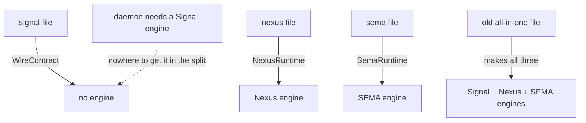

# 514 — Why the split has no home for the Signal engine

This report explains, in basic English, one blocker. It is the thing
that stops spirit from being cleanly split into three schema files
right now. I checked it again against the operator's newest code while
writing this, and it is still true.

## The short version

When we split a daemon's one big schema into three smaller schema
files (one per plane), **nothing produces the Signal engine** — the
piece of the daemon that takes a message off the wire, checks it, and
sends the reply back. The daemon still needs that piece. So the split,
as it can be generated today, leaves the daemon with a missing part
and it won't build.

## First, the picture: a daemon is a little office

A daemon (a running program like spirit) is like a small office that
handles requests. It has three departments:

- **Signal** — the **front desk**. It takes a message off the wire,
  checks that it is valid, hands it inward, and later takes the answer
  and sends it back out.
- **Nexus** — the **decision desk**. It takes the checked request and
  decides what to do.
- **SEMA** — the **records room**. It reads and writes the saved data.

Each department needs an **engine** — the actual code that does that
department's job. So there are three engines:

- **Signal engine** — runs the front desk (check, hand in, reply out).
- **Nexus engine** — runs the decision desk.
- **SEMA engine** — runs the records room.

The person building a component writes the *insides* of these three
engines (the real logic). But they do not write the *shape* of each
engine by hand — the shape (what methods it has, what goes in and
out) is **produced automatically from the schema**. "Produced
automatically" is what I keep calling **emit** / **emission**: the
generator reads the schema and writes out the engine's shape as Rust
code, ready for the author to fill in.

## What "the split" is

Today spirit has **one** schema file that describes all three
departments at once (the "all-in-one" file). We want to split it into
**three** files, one per department:

- `signal.schema` — the front-desk vocabulary (the words on the wire).
- `nexus.schema` — the decision vocabulary.
- `sema.schema` — the records vocabulary.

When the generator reads each file, you tell it a **target** — a
setting that says *what to produce* from that file. There are four
settings:

| Setting (target) | What it produces |
|---|---|
| `WireContract` | wire words only — **no engines at all** |
| `NexusRuntime` | the **Nexus** engine only |
| `SemaRuntime` | the **SEMA** engine only |
| `ComponentRuntime` (the old all-in-one) | **all three** engines |

The split uses the first three: `signal.schema` is built as
`WireContract`, `nexus.schema` as `NexusRuntime`, `sema.schema` as
`SemaRuntime`.

## The problem, in one line

Look at that table again and ask: **which of the three split settings
produces the Signal (front-desk) engine?**

- `WireContract` (the signal file) → **none**. On purpose: the wire
  file is supposed to be *only* the words, never the daemon's insides.
  That was the whole earlier lesson — the contract is just vocabulary.
- `NexusRuntime` (the nexus file) → only the **Nexus** engine.
- `SemaRuntime` (the sema file) → only the **SEMA** engine.

**None of them makes the Signal engine.** The only setting that makes
the Signal engine is the **old all-in-one** setting — the one we are
trying to move away from.

So when you split spirit into the three files, the front-desk engine
has **no file to be produced from**. It simply disappears. But the
daemon still has a front desk and still needs that engine — spirit's
own code literally says "the front-desk actor *is* the Signal engine"
(`impl SignalEngine for SignalActor`). After the split there is
nothing for that line to attach to, so the daemon does not build.

## Why spirit is still in one file (the operator is right)

This is also the answer to "why hasn't spirit been split yet, is the
operator missing it?" — **no.** The old all-in-one setting is the
**only** one that produces a complete daemon, because it is the only
one that makes the Signal engine. So spirit cannot leave it cleanly
yet. Keeping spirit all-in-one is not a mistake; it is the only option
today that gives the daemon all the parts it needs.

## Still true today (checked while writing this)

I re-checked against the operator's newest generator and newest
spirit:

- The newest generator's table is unchanged: the wire setting makes no
  engines, and the Signal engine is still produced **only** by the
  all-in-one setting.
- The newest spirit still implements the Signal engine on its
  front-desk actor.
- The operator's most recent generator change was about the records
  (SEMA) side, not the front desk — so it does not touch this gap.

So the blocker is live. (Tracked as bead `primary-jfko` — "the
three-plane split has no emission home for the Signal engine.")

## How to fix it — a real choice for you

The question to settle: **in the split, where should the front-desk
engine come from?** Two clean answers:

- **(A) Let the decision file make it too.** The nexus file already
  knows the wire words (it borrows them). So we could have the nexus
  file produce the **front-desk engine and the decision engine
  together**. Small change to the generator. The front desk and the
  decision desk become "one daemon-side bundle."

- **(B) Let the new shared runner do the front-desk job.** The
  operator just built a shared **runner** — a reusable loop that runs
  every daemon. We could let the runner itself take the message off
  the wire and hand it in, so there is **no separate front-desk
  engine at all**. The component would only give a small "check this
  message" hook. This is cleaner and matches how the runner was
  designed — but it means **deleting** the front-desk-engine code from
  spirit, which the operator's runner change stopped just short of
  doing.

**My lean is (B)** — it removes a part instead of moving it, and it
finishes what the runner was meant to do (the runner owns taking
messages off the wire). But it is tied to the runner work, so it is
really a decision for you, me, and the operator together.

Either way, **this must be settled before spirit (or any daemon) can
leave the all-in-one file.**

## Why we only found this by building it

On paper the split looked done — three files, they describe the three
planes, they even lower and produce Rust. But "produces Rust" is not
"the daemon works." I only saw the missing front-desk engine by
actually switching spirit to the three files and trying to build it.
The build passed at first **only because the old all-in-one file was
still sitting there**, quietly supplying the Signal engine; the three
new files were compiling *next to* it, not *instead of* it. The moment
you remove the old file — which is the whole point of splitting — the
front-desk engine is gone. That is the difference between "looks done"
and "tested."
