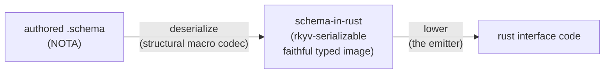

# 526 — Structural macro node + Asschema removal — current state

The current canonical surface for the thread that runs from "NOTA needs a
structural macro node" through "schema is just specialized NOTA" to "remove
Asschema; schema deserializes into schema-in-rust." This Refresh agglomerates
designer reports 517–524; report 525 (the intent-maintenance tombstone)
remains as the lineage map.

## Intent Anchors

[The structural macro node — the NOTA macro node IS a TYPE (an enum). Each
variant carries a per-variant structural description; the codec selects the
FIRST variant whose structure matches, in DECLARATION ORDER, then decodes that
variant's data recursively. The mechanism is bidirectional. Decode is always
type-directed — the type drives the decode, so the realization is a derive on
the enum, not a runtime registry. This is the part of the original NOTA design
that was never implemented.] (record `xai7`, Principle VeryHigh — consolidates
the prior `ejvc` mechanism + `i0e6` type-directed clarification.)

[Schema is specialized NOTA, not a separate language lowered into NOTA. The
canonical pipeline is two arrows: authored schema (NOTA) DESERIALIZES — via the
structural macro node codec — into rust types that define the schema fully
(schema-in-rust, rkyv-serializable), which then LOWERS into rust interface code.
The first arrow is deserialize, not assemble: schema-in-rust is a faithful,
round-trippable typed image, NOT a separately-assembled IR. Asschema is removed;
the resolution work lives as methods on schema-in-rust's types, used during the
lower step.] (record `vez8`, Decision Maximum — consolidates `lcwu` + `pv61` +
`fkbz`, restated three times with rising conviction.)

## The mechanism — a derive, type-directed

A structural macro node is an **enum** whose variant is chosen by the SHAPE of
the NOTA block at its position, not by a head-atom tag. `nota-next` carries it
as a second derive alongside the existing tag-directed one:

| Derive | Variant chosen by | `(Optional X)` decodes as |
|---|---|---|
| `NotaDecode` (existing) | tag — the head atom equals the variant name | the `Optional` variant, because the tag says so |
| `StructuralMacroNode` (new) | shape — first variant whose structural pattern matches | whichever variant's shape matches first in declaration order |

The type IS the whole specification. `#[derive(StructuralMacroNode)]` reads the
enum plus a per-variant `#[shape(...)]` attribute and generates both directions
— the ordered shape match (each variant's `BlockShape` tried in declaration
order, then the matched variant's fields decoded from the right slots,
recursively) and the encode. The shape vocabulary is the minimal three:
`pascal_atom`, `head = "X" arity = N`, `pascal_head arity = N`. Per-slot
sub-shapes, sigil-aware shapes (`Name@{...}`), variable-arity bodies, and
literal-unit variants are the named next vocabulary additions.

The trait is the recursion seam: leaf types and `Box<T>` implement it too, so a
variant holds `Box<Self>` and nests all the way down. Declaration order is the
enum's variant order — a general head (`pascal_head`) declared before a specific
one (`head = "Optional"`) shadows it, so variant order is part of the design.

The mechanism round-trips byte-for-byte on the type-reference position (the
demonstration dialect): `Integer`, `(Optional Integer)`,
`(Vec (Map (Optional RecordIdentifier)))` all decode text → Rust → text exactly,
and re-decoding the output yields the same value. Lives on `nota-next` (the
derive landed on main per the operator; designer branch `structural-macro-nodes`
carried the direct-decode variant).

## The canonical pipeline — deserialize, then lower

*Two arrows replace the old three-step assemble. Arrow 1 is deserialize (faithful, round-trippable), not lower/assemble. The old pipeline lowered into a separate Asschema IR that did not round-trip; that step is gone.*

- **Arrow 1 — deserialize (NOTA → schema-in-rust).** The authored `.schema`
  deserializes through the structural-macro codec into Rust types that define
  the schema fully. Because the codec is bidirectional, schema-in-rust is a
  faithful typed image — it round-trips **canonically** (formatting/whitespace
  normalize; the invariant is semantic/canonical equality, not original-byte
  identity). It is rkyv-serializable: a real typed representation, cacheable.
- **Arrow 2 — lower (schema-in-rust → rust code).** The emitter
  (schema-rust-next) projects the typed schema into Rust's shape. This is where
  the Rust-specific work happens.

**schema-in-rust ≈ `SchemaSource`** (schema-next `src/source.rs`) — it should
*become* schema-in-rust: rkyv-serializable, the faithful image, the single typed
representation. Most `Source*` types already decode by structure
(`SourceImports`, `SourceRootEnum`, `SourceNamespace`, `SourceDeclarationValue`,
`SourceStructBody`, `SourceEnumBody`, `SourceReference`); only
`SourceVariantSignature` used the formal derive/trait. So the type-directed
decode is largely in place — the real removal work is relocating the resolution
and rewiring emission, not decode.

## Resolution is (mostly) the datatypes — no separate IR

Reports 520/522 first proposed a `SchemaResolution` projection object. The
psyche's pushback — *"isn't that what the datatypes schema deserializes into are
for?"* — deflated it, and the pipeline (arrow model) settles it: **there is no
separate resolved-view object.** schema-in-rust IS the typed representation; the
resolution work lives as **methods on schema-in-rust's types**, computed during
arrow 2. The decomposition of Asschema's resolution jobs against that framing:

| Asschema job | What it actually is once schema deserializes into typed datatypes |
|---|---|
| Newtype / alias collapse | **Inherent** — a single-field struct datatype *is* a newtype |
| Reserved scalar (`String`/`Integer`/`Boolean`/`Path`) | **Inherent** — distinct variants of the type-reference datatype |
| Nested inline declarations | **Inherent** — a nested datatype, held as authored |
| Visibility (public/private) | **Inherent/trivial** — top-level = public, inline = private |
| Source order | **Inherent** — the datatype preserves authored order |
| Derived field naming (Pascal→snake) | **Trivial method** — computed from the field's type reference |
| Symbol-path resolution | **Cross-reference read-method** — navigates the tree |
| Variant payload resolution (bare name → type) | **Cross-reference read-method** — namespace lookup |
| Nested-inline → sibling Rust structs | **Rust projection** — the emitter's job |
| Emission ordering | **Rust projection** — the emitter orders as it emits |
| Context aggregation (collect inlines mid-traversal) | **Disappears** — a lowering-phase artifact |

So ~5 jobs are inherent in the datatypes, 1 is a trivial method, 2 are
cross-reference read-methods (symbol path, variant payload — they need the
namespace datatype in scope), 2 are Rust projection (the emitter), 1 disappears.
**None of it is a separate resolution engine, and none needs a `SchemaResolution`
IR.** The emitter calls high-level semantic methods on schema-in-rust (resolved
variant payload meaning, declaration visibility, symbol paths, scalar
classification, import ownership) — NOT low-level getters it reassembles into
schema logic. That is the guard that keeps the emitter a Rust projector, not a
second schema engine (the operator's boundary, preserved): *schema-in-rust owns
schema meaning as methods; the emitter owns Rust projection.*

## What "remove Asschema" precisely means — consumer + resolution reference

Asschema is three things; the decision kills two and relocates the third:

1. **A separate ASSEMBLED IR** — the `Asschema` struct lowered into, serialized,
   checked in as `.asschema`, read by schema-rust-next. **Dies.**
2. **A separate LOWERING STEP** — `SchemaSource::to_asschema()`. **Dies as a
   step**; its work moves onto methods on the source types.
3. **The RESOLUTION WORK** — inline hoisting, visibility, ordering, symbol paths,
   etc. **Survives**, as methods on schema-in-rust used during the lower step.

The full consumer map (the reference for *what* must move):

| Consumer | Uses Asschema for | Replacement |
|---|---|---|
| **`RustEmitter::emit_file(&Asschema)`** (schema-rust-next `lib.rs:51`) | **load-bearing** — Rust emission; `RustModule::from_asschema` | consume schema-in-rust + its resolution methods; `RustModule::from_source` |
| `GenerationDriver` (schema-rust-next `build.rs:399`) | build-time lower→emit | deserialize source → lower → emit; no Asschema |
| `AsschemaStore` (schema-next `store.rs`) | rkyv storage in redb | rkyv on the typed source |
| schema-next tests (`symbol_path`, `collections`) | `SymbolPath` from lowered Asschema | derive `SymbolPath` from source directly |
| `upgrade.rs` `SchemaEdit` | edits applied to Asschema | edits on source declarations |
| `spirit/build.rs` + 10 checked-in `.asschema` files (spirit, cloud, domain-criome, upgrade, signal-cloud, schema-next core) | freshness check / emission input | regenerate from `.schema` on demand; drop `.asschema` |
| schema-rust-next `big_emission` tests | load `.asschema` then emit | load `.schema`, decode to source, emit |

The hard parts: the resolution interplay (inline hoisting + visibility +
ordering are coupled in `to_asschema()`/`declarative.rs`); the multi-repo
artifact drop (10 `.asschema` across 5 repos, freshness-checked); and
`SymbolPath` parity (paths derived from source must equal those derived from
Asschema today — tests pin this).

## The migration sequence (operator 314/316, designer-concurred)

1. Make `SchemaSource` the faithful rkyv-serializable schema-in-rust (finish
   moving `Source*` onto the structural-macro decode; derive rkyv on the **clean**
   schema value — spans stay parse-time, never serialized into the value;
   structural-macro decode produces span-free typed values by construction).
2. Put the resolution work as **methods on `SchemaSource`'s types** (the body of
   `to_asschema` becomes methods the lowering reads). Keep `to_asschema`
   *temporarily* as a thin compat conversion so the switch happens behind a
   stable surface; Asschema/Artifact/Store delete last.
3. `RustModule::from_source` lowers schema-in-rust into Rust — calling those
   high-level semantic methods + doing Rust projection.
4. Build driver: deserialize `.schema` → schema-in-rust → lower; no `.asschema`.
5. Delete `Asschema`/`AsschemaArtifact`/`AsschemaStore` once no consumer remains.

**Safety net is two-layer.** Per-transformation tests FIRST (hoisting order,
public/private visibility, root bare-header payload resolution, inline root
insertion, single-field newtype collapse, derived field naming, enum variant
payload resolution, reserved-scalar validation, import preservation, symbol-path
parity) — they *localize* a regression. Then the end-to-end witness:
**byte-identical Rust emission** — lower a real `.schema` (spirit's three planes
first, then a multi-plane package exercising imports) the old way and the new
way, and diff the generated `.rs` to zero. (Note the two distinct round-trips:
the schema round-trip is *canonical*; the emission diff is *byte-exact*.)

## Designer-vs-operator decision rationale (carried forward)

Two implementations landed independently from the same psyche prompt, and the
comparison surfaced the one durable design seam. The convergence is the
validation; the fork is the open item.

**Where the agents converged** (strong evidence the concept is settled): a trait
an enum implements; typed decode + encode-back; declaration-order first-match;
recursion into nested positions; bidirectional round-trip; a derive macro as the
endpoint. The operator adopted the designer's `#[shape(...)]` front-end *verbatim*
(identical error strings prove build-on, not independent convergence), so the
front-end vocabulary is shared on main.

**The persistent decode fork** (the one open seam, reports 518/519/521):

| | Operator (landed on main) | Designer (direct path) |
|---|---|---|
| Variant data | `StructuralVariant{ name, pattern: Pattern, expected }` — reuses registry `Pattern` (captures, `Rest`, `Literal`) | `BlockShape` (3 cases) on raw `Block` predicates |
| Decode | generated `from_structural_match` = `match matched.macro_name()` (string), then reads captures per arm | generated `from_structural_block` **fuses** shape match + typed construction; no captures, no string |
| Hops | variant → Pattern → MacroMatch → string match → captures → typed | shape match → typed, one hop |

The operator's generated decode literally is `match matched.macro_name()` — the
**string-matching-as-dispatch anti-pattern** (`skills/enum-contact-points.md`,
`skills/rust/methods.md` §"Don't hide typification in strings"): the structural
match is computed, thrown away, and recovered from a variant-name string.
Record `xai7` (`i0e6`'s clarification) says the type drives the decode — the
fused, direct path. **The operator's own code already votes for the direct
path**: the registry-backed trait is used for exactly ONE position
(`SourceVariantSignature`); every other schema-next position uses a plain
direct `match block { … }`. Two patterns for one concept is what shouldn't
harden. The operator's richer `Pattern` vocabulary (captures/`Rest`/`Literal`)
stays available for positions that genuinely need named multi-capture extraction;
the recommended end-state is the direct typed decode + that vocabulary where
needed.

## Live open items (carry forward — NOT settled)

- **Who drives the Asschema-removal implementation, and where.** schema-next and
  schema-rust-next `main` are operator-owned. Two workable splits: (a) operator
  drives on main with this converged spec, designer reviews each slice; or (b)
  designer prototypes the spine (steps 1–3) on a `~/wt` feature branch, proven by
  the per-transformation tests + spirit emission diff, operator integrates. A
  coordination call; the design itself is settled. The operator's own next-slice
  sequence leads with fixing the nota-next derive to direct typed decode (so
  schema source nodes don't inherit the string-dispatch seam), then rkyv-ready
  the datatypes, add source-owned semantic methods, add `RustModule::from_source`
  with Asschema-parity tests.
- **Conflict detection catches only EXACT duplicates — the dangerous case is
  unguarded.** The operator's `validate_no_silent_conflicts` (`macros.rs:472`)
  catches two variants with *identical* patterns (`first.pattern() ==
  second.pattern()`) — a genuine footgun where the second variant is dead code.
  But it does NOT catch *subset/shadowing* overlap: a general head (`pascal_head`)
  declared before a specific head (`head = "Optional"`) it subsumes. Those
  patterns are not equal, so the check passes them, and the general variant
  silently shadows the specific one by declaration order — the more dangerous
  case, because it looks correct. **Extend the check from exact-pattern-equality
  to subset/shadowing detection.** This is the genuinely valuable part to grow.
- **The decode fork swap** (above) — swap main's generated decode to the direct
  typed path; keep the shared `#[shape]` front-end and the conflict detection
  (strengthened). Recommended but not yet landed.
- **The deserialize-time vs read-time seam** (small, local): do the two
  cross-reference lookups (variant payload, symbol path) resolve at
  deserialize-time (baked in while the namespace is in scope) or read-time (the
  datatype holds the bare reference; the emitter looks it up)? Both fine;
  read-time keeps the datatype a faithful image of the authored source.

## Lineage

- **Active intent:** `xai7` (mechanism), `vez8` (pipeline/direction). The 7 prior
  records (`ejvc`, `i0e6`, `lcwu`, `pv61`, `fkbz`, `js6q`, `ydvg`) were
  consolidated/removed in the 2026-06-05 intent-maintenance pass — full
  tombstone provenance in report 525.
- **Source reports absorbed:** 517 (prototype), 518 (designer-vs-operator),
  519 (the derive), 520 (Asschema removal design + consumer/resolution
  inventory), 521 (operator-landed derive + conflict-detection), 522 (converged
  plan), 523 (resolution-is-the-datatypes), 524 (the pipeline). Operator-side:
  reports 312/314/316. git history holds each predecessor.
- **Permanent landings:** the structural-macro mechanism and the schema-is-NOTA
  direction live in records `xai7`/`vez8`; the triad emission targets and the
  WireContract/SignalRuntime boundary live in `skills/component-triad.md`.
