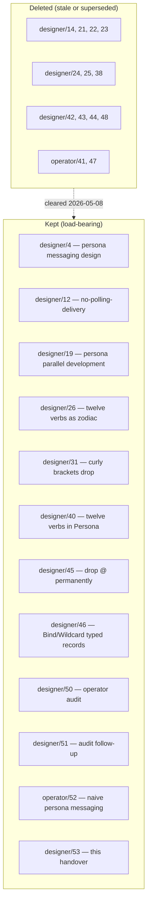

# Session handover — 2026-05-08, post-cleanup

Status: handover after the heavy-handed report cleanup
landed in this session. Supersedes designer/48.
Author: Claude (designer)

The 2026-05-08 design cycle has produced a lot of decisions
in fast succession. Many of the older reports were either
explicitly superseded or describe an architecture that has
since been overtaken by implementation. The user authorised
a heavy-handed cleanup; this report records the state of the
report tree afterwards and lists what remains load-bearing.

---

## 0 · TL;DR



| Outcome | Count |
|---|---|
| Designer reports kept | 10 |
| Operator reports kept | 1 |
| Designer reports deleted | 11 |
| Operator reports deleted | 2 |
| Cross-references cleaned | 9 files |
| New skills landed | 2 (designer.md + operator.md) |
| New tests landed | 1 (signal-core/tests/pattern.rs, 17 tests) |
| BEADS tickets opened | 3 (primary-obm, 9h2, oba) |

---

## 1 · Surviving designer reports

| # | Title | Why it stays |
|---|---|---|
| 4 | persona messaging design | foundational architecture; AGENTS.md cites; operator/52 cites |
| 12 | no-polling-delivery design | the principle now lives in skills/push-not-pull.md, but the report is the original derivation; operator/52 + skills/reporting.md cite |
| 19 | persona parallel development | persona-* repo organisation; operator/52 cites |
| 26 | twelve verbs as zodiac | canonical 12-verb scheme — referenced by 31, 40, 45, 46 |
| 31 | curly brackets drop permanently | originated the "delimiters earn their place" precedent that 46 extended to `@`; informs `skills/language-design.md` §18 |
| 40 | twelve verbs in Persona | operational mapping of the 12 verbs to Persona's surface |
| 45 | nexus needs no grammar of its own | the `@`-drop decision; supersedes its own §3 with 46 |
| 46 | Bind/Wildcard as typed records | current state of the pattern wire form |
| 50 | operator implementation audit (45/46) | current audit; verifies the typed-record migration |
| 51 | operator audit follow-up | verification + idiom sweep + `signal-core/tests/pattern.rs` falsifiable spec |

The reasoning trail from designer/22 / 23 / 24 / 25 / 38 has
been compressed into 26's "applied design" framing and 45 +
46's actual decisions. The deleted reports were *how we got
here*; the kept reports are *where we are*.

---

## 2 · Surviving operator reports

| # | Title | Status |
|---|---|---|
| 52 | naive persona messaging implementation | active — first slice landed in `repos/persona-message`; references designer/4, 12, 19, 40 |

operator/41 (twelve-verbs-implementation-consequences) and
operator/47 (bind-wildcard implementation plan) were both
deleted because their implementation has shipped and the
design intent they describe is now in designer/50's audit
record.

---

## 3 · Cleanup record

### 3.1 · Reports deleted (13 total)

```
reports/designer/14-persona-orchestrate-design.md
reports/designer/21-persona-on-nexus.md
reports/designer/22-nexus-state-of-the-language.md
reports/designer/23-nexus-structural-minimum.md
reports/designer/24-nexus-among-database-languages.md
reports/designer/25-what-database-languages-are-really-for.md
reports/designer/38-nexus-tier-0-grammar-explained.md
reports/designer/42-operator-41-and-tier-0-implementation-critique.md
reports/designer/43-signal-core-and-signal-persona-contract-audit.md
reports/designer/44-extract-nexus-codec-from-nota-codec.md
reports/designer/48-session-handover.md
reports/operator/41-persona-twelve-verbs-implementation-consequences.md
reports/operator/47-bind-wildcard-typed-record-implementation-plan.md
```

### 3.2 · Why each was retired

| Report | Reason for deletion |
|---|---|
| designer/14 | persona-orchestrate exists as a crate; design content is in the crate's ARCHITECTURE.md |
| designer/21 | "drop the persona-specific protocol; use signal+nota" — that conclusion is now implemented; signal-persona crate exists |
| designer/22 | explicitly superseded by designer/23; both itself superseded by 26 |
| designer/23 | "rewrite of report 22's framing" — itself superseded by 26 + 31 + 45 + 46 |
| designer/24 | comparative database-language research; not driving current decisions |
| designer/25 | deep research synthesis; the LLM-as-comparator framing distilled into 26 |
| designer/38 | tier-0 grammar with `@` — pre-revision; designer/45 + 46 are the post-revision spec |
| designer/42 | critique of operator/41 (also deleted); the audit ground is covered by designer/50 |
| designer/43 | signal-core + signal-persona audit; findings (Lock.agent, Atomic narrowness, verb-payload pairing) carried forward inline in designer/50 §3 |
| designer/44 | "extract nexus-codec from nota-codec" — moot per designer/46 (`@` dropped) |
| designer/48 | prior session handover; this report supersedes |
| operator/41 | implementation consequences for designer/40; implementation has shipped, audit is in designer/50 |
| operator/47 | bind-wildcard implementation plan; implementation has shipped, audit is in designer/50 |

### 3.3 · Cross-references cleaned

Files edited to remove references to deleted reports:

```
reports/designer/19-persona-parallel-development.md
reports/designer/26-twelve-verbs-as-zodiac.md
reports/designer/31-curly-brackets-drop-permanently.md
reports/designer/40-twelve-verbs-in-persona.md
reports/designer/45-nexus-needs-no-grammar-of-its-own.md
reports/designer/46-bind-and-wildcard-as-typed-records.md
reports/designer/50-operator-implementation-audit-45-46-47.md
reports/designer/51-operator-implementation-audit-followup.md
reports/operator/52-naive-persona-messaging-implementation.md
skills/designer.md
skills/operator.md
```

Where references named load-bearing facts, the facts were
inlined; where references were "see also" pointers, the
bullets were dropped.

---

## 4 · Settled decisions still in force

The substantive design state at the end of this session:

| Decision | Lives in | Status |
|---|---|---|
| 12 verbs in zodiacal order | designer/26, signal-core::SemaVerb | shipped |
| `(Bind)` / `(Wildcard)` as typed records | designer/46, signal-core::pattern | shipped |
| `@` permanently dropped | designer/45 + 46, nota-codec::lexer | shipped |
| `_` is a normal bare identifier | designer/46, nexus/spec/grammar.md §1 | shipped |
| `PatternField<T>` lives in `signal-core` | designer/46 §8, signal-core::pattern | shipped |
| `NexusVerb` → `NotaSum` rename | designer/46 §6, nota-derive::nota_sum | shipped |
| `NexusPattern` derive deleted | designer/46 §6, nota-derive (not present) | shipped |
| Reserved record heads `Bind` / `Wildcard` | designer/46 §5, skills/contract-repo.md | shipped (operator landed concurrently) |
| 12-verb scaffold in Persona | designer/40, signal-persona::PersonaRequest | partially shipped (Atomic narrowness open) |
| Identity discipline (system mints identity, time, sender) | ESSENCE.md, skills/rust-discipline.md, signal-persona records | shipped |
| Push-not-pull | skills/push-not-pull.md, designer/12 | shipped |
| Four roles: designer / operator / system-specialist / poet | protocols/orchestration.md, skills/{designer,operator,system-specialist,poet}.md | shipped |

---

## 5 · Open questions

1. **signal-persona pattern enum migration to
   `PatternField<T>`** (designer/50 §2). 16+ sites,
   mechanical, operator-shaped.
2. **`Lock.agent: String` → `PrincipalName`** (designer/50
   §3.1). One type-substitution.
3. **`PersonaRequest::Atomic(Vec<Record>)` widened to
   mixed-kind** (designer/50 §3.2). Schema redesign.
4. **Verb-payload type-enforcement on
   `Request<Payload>::Operation { verb, payload }`**
   (designer/50 §3.3). Structural — deserves its own
   designer report. Two options sketched there.

---

## 6 · Active work

### 6.1 · Operator
- `operator/52` first persona-messaging slice in
  `repos/persona-message`. Active iteration.
- Concurrent typed-record polish in signal-core
  (operator landed `tests/frame.rs` Match cases and
  `skills/contract-repo.md` reserved-heads bullet during
  this session — both small, both clean).
- One free-function smell flagged in designer/51 §2.2
  (`pub fn is_pascal_case` in nota-codec; duplicated
  ident-byte predicates between lexer and encoder). Minor;
  not blocking.

### 6.2 · System-specialist
- `chroma` recent commit: per-axis warmth/brightness lerp.
- `primary-obm` BEADS: lore review + Nix-content migration
  to skills (P2).

### 6.3 · Designer
- `primary-9h2` BEADS: design new role for critical-
  analysis / fault-finding (P2). Needs designer report
  proposing the role + lock file shape before any code.
- `primary-oba` BEADS: integration + docs (P3, blocked by
  obm + 9h2).

---

## 7 · This session's deliverables

| Path | Description |
|---|---|
| `reports/designer/50-operator-implementation-audit-45-46-47.md` | initial audit of typed-record migration |
| `reports/designer/51-operator-implementation-audit-followup.md` | verification + idiom + broader scope |
| `repos/signal-core/tests/pattern.rs` | 17-test falsifiable spec for `PatternField<T>` |
| `skills/designer.md` | designer role skill (sister to system-specialist.md, poet.md) |
| `skills/operator.md` | operator role skill (completes the four-role set) |
| `reports/designer/53-session-handover.md` | this handover |
| (cleanup) | 13 reports deleted, 11 files cross-reference-cleaned |
| (BEADS) | primary-obm, 9h2, oba opened with correct dependency wiring |

---

## 8 · Discipline notes for next session

### 8.1 · Parallel work coordination

Operator and designer worked concurrently in this session;
operator landed two small commits (signal-core test
additions, contract-repo reserved-heads bullet) at the same
time as designer was producing reports. No conflicts arose
because the file surfaces happened not to overlap, but
`skills/contract-repo.md` came close — designer drafted a
3-paragraph section just as operator landed a tight
4-bullet line. Designer noticed via `jj st` parent-commit
description and reverted the redundant section.

The general rule: when both roles are active and skills/ is
in scope, a `tools/orchestrate claim` would surface the
parallel work earlier. Filed as a soft observation; no
mechanism change recommended yet.

### 8.2 · Heavy-handed cleanup is also designer work

The cleanup itself was substantial: ~6000 lines of stale
report content removed; 9 surviving files edited to
maintain referential integrity. The fact that this took a
full pass to land suggests reports accumulate faster than
they retire. A monthly retirement sweep — *what's still
load-bearing? what's been overtaken?* — would keep the
queue cleaner.

Not a hard rule; a soft suggestion. Default: when a design
report supersedes a prior report substantially, name the
supersession explicitly so the next cleanup pass has the
hint.

---

## 9 · See also

- `~/primary/ESSENCE.md` — workspace intent.
- `~/primary/AGENTS.md` — workspace contract.
- `~/primary/protocols/orchestration.md` — role-coordination
  protocol.
- `~/primary/skills/designer.md` — designer role skill.
- `~/primary/skills/operator.md` — operator role skill.
- `~/primary/reports/designer/40-twelve-verbs-in-persona.md`
  — the apex Persona design.
- `~/primary/reports/designer/46-bind-and-wildcard-as-typed-records.md`
  — the apex pattern-wire decision.
- `~/primary/reports/designer/50-operator-implementation-audit-45-46-47.md`
  — current implementation status.
- `~/primary/reports/designer/51-operator-implementation-audit-followup.md`
  — verification + idiom + tests.
- `~/primary/reports/operator/52-naive-persona-messaging-implementation.md`
  — operator's current active slice.

---

*End report.*
