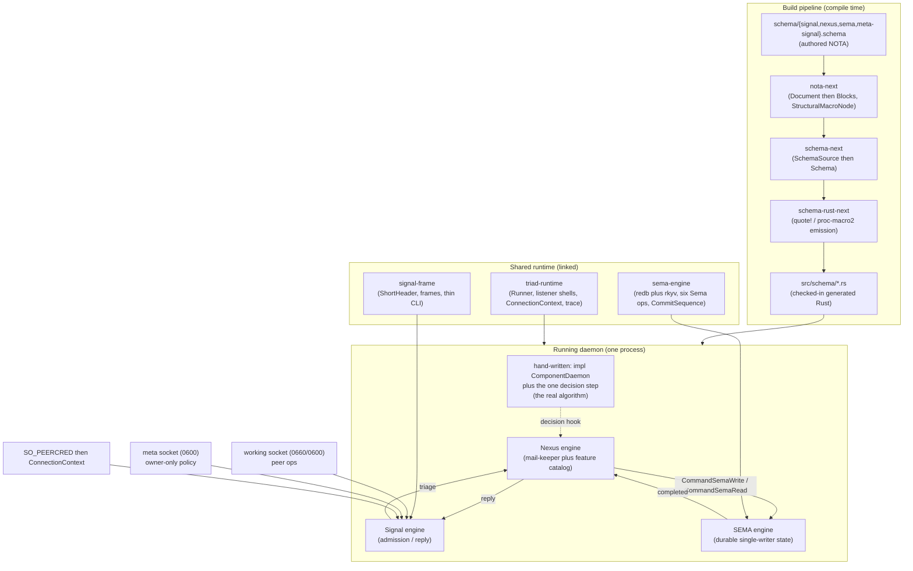
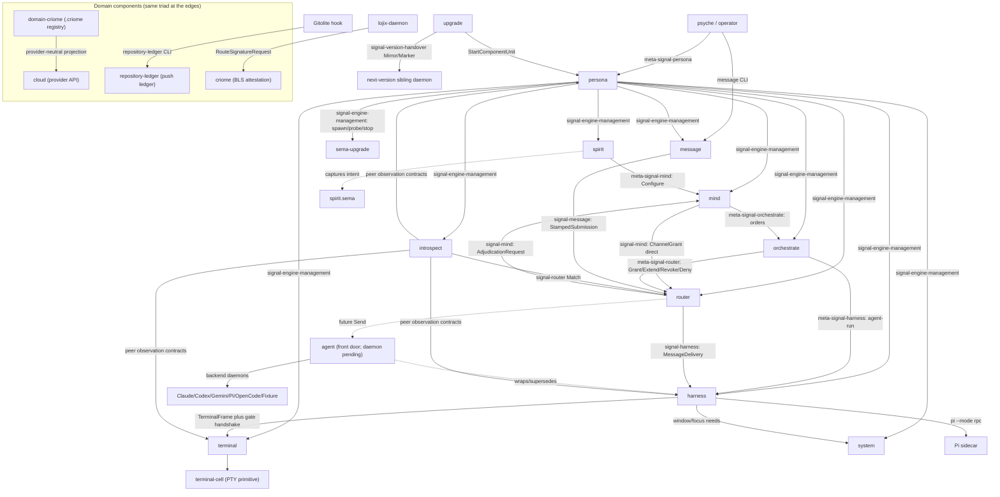
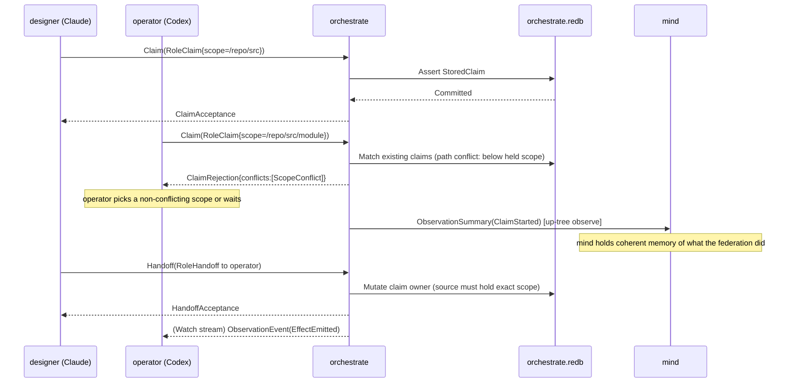
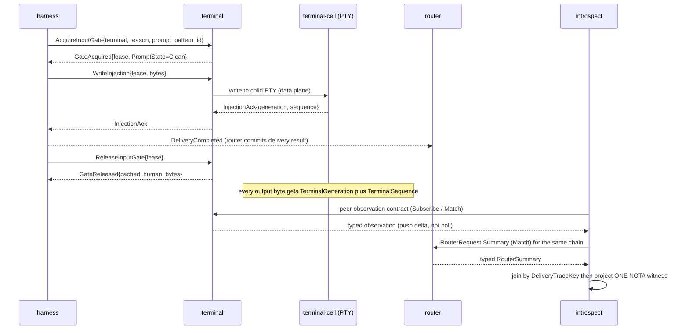
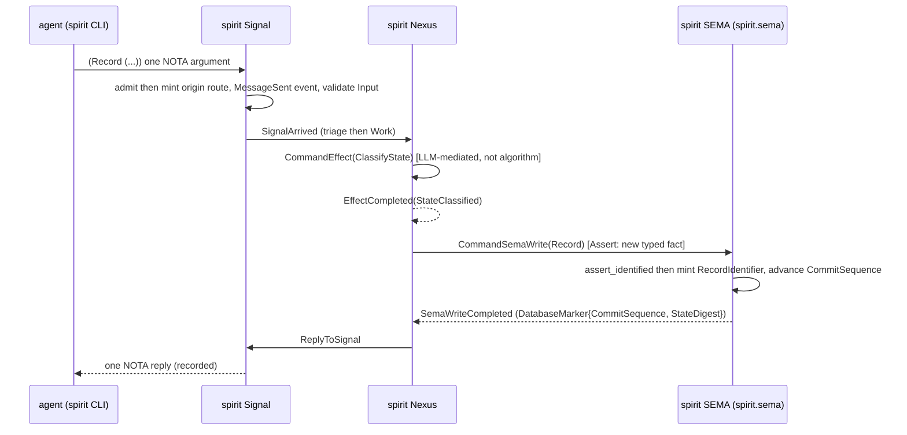
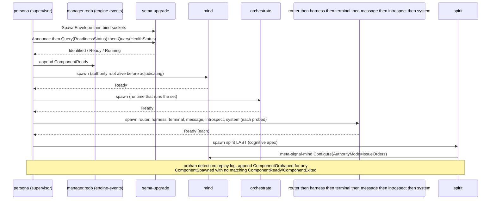

# 548 — The Persona meta-engine: a grounded vision of the whole

## The one-paragraph picture

The Persona meta-engine is a live, supervised federation of uniform daemons that together form a meta-AI body — a typed structure built to organize intelligence the way spirit organizes a person. Every part of it is the same kind of object: a *triad* of a daemon (with a thin CLI as its first client), an ordinary working Signal contract, and an owner-only meta Signal contract. Each daemon is generated from a per-plane schema set — one `.schema` file per plane (`signal`/`nexus`/`sema`, plus the meta-signal contract), NOT one all-in-one schema — into three reaction-plane engines: Signal (communication), Nexus (execution + the engine's internal feature catalog), and SEMA (durable single-writer state) — riding shared runtime libraries (`triad-runtime`, `signal-frame`, `sema-engine`). The daemons never reach into each other's storage or execution; they talk *exclusively* through Signal contracts over length-prefixed rkyv frames on Unix sockets, with NOTA rendering only at the human/agent edge. Above the daemons, `persona` is the privileged manager that spawns, probes, supervises, and upgrades them; `orchestrate` is the runtime component that runs the set together and carries the coordination machinery; `mind` is the authority root that decides policy and replaces today's lock files; and `spirit` is the cognitive apex, spawned last, that animates the whole. The intelligence is never inside the components — they are deliberately dumb mechanism — it lives in the agent LLMs on the other end of the wire and in the intent layer that drives them. The endpoint the psyche is reaching for is software *eventually impossible to improve* in a bounded domain: one reaction primitive projected three ways, the whole capability surface readable in schema, supervised into one running orchestrated whole.

## The mental model — how any component is built

There is ONE way to build a Persona component, and every component (persona, mind, router, terminal, cloud, repository-ledger, criome, spirit, …) is an instance of it. Understand this section and you understand all the daemons; the rest of the report is this pattern pointed at different nouns. `spirit` is the runnable exemplar — the one repo where the whole pattern reads end-to-end against a real CLI crossing a real socket into a real daemon.

### The construction pipeline: `.schema` → generated Rust → running daemon

The readability thesis is the spine: **types name the work, the schema names the interface, generated Rust names the objects and traits, hand-written code is the real algorithm.** Each layer names exactly one thing and nothing else, and the diagnostic that travels with the thesis is load-bearing — when a daemon needs large hand-written plumbing to understand its own contract, the mechanism belongs in schema emission or shared runtime, not in the component. The pipeline exists precisely so those four layers stay clean:

- **`nota-next`** — the raw structural floor. It parses source text into a `Document` of ordered `Block`s (delimited objects, pipe-text, atoms) preserving `SourceSpan`, and decides *delimiter shape and children only*, never schema meaning. Its load-bearing innovation is the `#[derive(StructuralMacroNode)]` codec: a NOTA enum is decoded by SHAPE — type-directed, structural match per variant in declaration order, first match wins, recursive — with bidirectional encode back to NOTA. It also owns the shared value codecs (`NotaDecode`/`NotaEncode`) and the `NotaBody` inner-stream layer. Square brackets are vectors; `[|...|]` is string-safe text; `(|...|)`/`{|...|}` are recursive pipe forms; the `@`-binding sigil is retired (meaning is carried by position + delimiter shape through the typed macro-node layer).
- **`schema-next`** — turns NOTA structure into typed schema source. A `.schema` file IS full NOTA, a specialized dialect, not a separate language. The pipeline is `.schema` → `SchemaSource` (typed authored nouns: `SourceImports`, `SourceRootEnum`, `SourceNamespace`, `SourceDeclarationValue`, `SourceStructBody`, `SourceEnumBody`, `SourceVariantSignature`, `SourceReference`) → `Schema` (the semantic schema-in-Rust value), both rkyv-serializable. The separate Asschema compatibility artifact (the `.asschema` file, its rkyv artifact, `AsschemaArtifact`, and the old Asschema-facing APIs) was removed — but typed macro-expansion and semantic projection did NOT disappear: `MacroExpansion` plus resolution (inline-declaration hoisting, visibility, ordering, symbol paths) now live as methods on the schema source / `Schema` objects, so authored typed source still resolves into semantic schema-in-Rust before Rust lowering. The root is **positional**: field 1 = input root enum body, field 2 = output root enum body, field 3 = namespace map, optional leading imports map — used uniformly for Signal, Nexus, and SEMA, differing only after lowering. Cross-crate imports resolve through `ImportResolver` (not text substitution) using single-colon namespaces (`crate:module:Type`) that mirror Rust module paths.
- **`schema-rust-next`** — lowers schema-in-Rust into Rust interface code via real `quote!`/`proc-macro2` tokens (`TokenStream`/`ToTokens`), NOT a string generator; each subobject renders via `LowerToRust<Target>`, and the string-to-token migration is complete (the only direct text is the `// @generated` header). Generated Rust is source-visible under `src/schema/` (checked in, not buried in `OUT_DIR`). It emits per `RustEmissionTarget`: `WireContract` (external signal/meta-signal nouns, derives, NOTA/rkyv codecs, short-header route constants — no engines), `SignalRuntime`/`NexusRuntime`/`SemaRuntime` (per-plane daemon support), `Daemon` (the emitted daemon module), and the legacy all-in-one `ComponentRuntime`. Each module has one binary floor (rkyv `Archive`/`Serialize`/`Deserialize`, always emitted because every component speaks binary frames) and one optional NOTA text surface (`NotaDecode`/`NotaEncode`, root `FromStr`/`Display`, `to_nota`) gated behind a `nota-text` feature — so the CLI parses/prints NOTA while the daemon compiles without the NOTA decoder linked in (proven with an executable dependency-surface guard). It also emits `From` impls, variant-named constructors, cross-plane `into_*` projections, `UpgradeFrom`/`AcceptPrevious` trait surfaces, and the typed `TraceEvent`/`ObjectName` trace nouns.
- **`triad-runtime`** — the shared runtime every emitted daemon links, owning GENERIC mechanics and never component meaning: `LengthPrefixedCodec` (the four-byte big-endian prefix; `FrameBody` is just bytes), `ComponentCommand`/`ComponentArgument` (the single-argument process edge — `InlineNota`/`NotaFile`/`SignalFile`), `Runner`/`Runner::drive` (the recursive Nexus loop with the typed continuation budget — `ContinuationLimit`/`ContinuationBudget`/`ContinuationExhausted`, default 32 non-reply steps — dispatching the five-outcome `NextStep`: `Reply`/`SemaWrite`/`SemaRead`/`RunEffect`/`Continue`), `role.rs` (the reusable engine-role traits `NexusWork`/`SemaWriteInput`/`SemaReadInput`/`NexusEffectCommand`), the daemon shells (`SingleListenerDaemon`/`MultiListenerDaemon`/`MultiListenerRuntime`, with `SocketMode`, stale-socket cleanup, `RequestErrorLog` isolation, and a `should_continue` stop boundary), `streaming.rs` (subscription mechanics: `SubscriptionToken`, `SubscriptionTokenIssuer`, `SubscriptionRegistry`, `SubscriptionEventPublisher`), `process.rs` (`ConnectionContext`, `DaemonConfiguration`, `ExitReport`), and `trace.rs` (`TraceLog`, `TraceSocketListener`, `TraceClient`, generic over the component's typed `TraceEvent`).

The daemon itself is now a SOURCE-VISIBLE emitted module: `schema-rust-next` emits `src/schema/daemon.rs` from a declared `NexusDaemonShape` (carrying the OS process name, working/meta listener tiers, and meta socket mode — the data NOT derivable from the wire contract), owning `DaemonCommand`, `ComponentDaemon` (the hook trait), `GeneratedDaemonRuntime` (the decode→execute→encode spine), single/multi-listener selection, `DaemonError`, and `DaemonEntry::run_to_exit_code`. `triad-runtime` provides the loop and reusable objects; the schema provides each component's typed entry into them. The component author hand-writes only a trait impl on a data-bearing noun — `message`, for instance, hand-writes only `impl ComponentDaemon for MessageDaemon` plus one decision step, and its daemon binary is the one-liner `MessageDaemon::run_to_exit_code()`.

### The three reaction-plane engines

Every plane is a REACTION LANGUAGE: an engine matches an input tree against runtime state and produces a corresponding output tree. This is the deepest idea in the engine — the three planes are not three different kinds of thing, they are *one* primitive projected three ways, differing only by ownership and runtime semantics, never by authored shape. `schema-next` makes this explicit: input and output roots are actor reaction languages declaring the variants a component can receive and emit, and Signal in/out, SEMA command/response, and Nexus lowering are the same four-position shape:

- **Signal** — the communication boundary; triage only (admission in, reply out). In spirit, `SignalActor::admit` mints the origin route, issues the `MessageSent` event, validates `Input`, produces `SignalAccepted`.
- **Nexus** — the execution-IO plane; the recursive mail-keeper + Signal↔SEMA translator that decides what to do. It reacts to the `NexusWork` fact stream (`SignalArrived`, `SemaWriteCompleted`, `SemaReadCompleted`, `EffectCompleted`) and emits the `NexusAction` command stream (`CommandSemaWrite`, `CommandSemaRead`, `ReplyToSignal`, `CommandEffect`, `Continue`). The `&mut Nexus` borrow on `NexusEngine::execute` IS the single-flight guard — Rust prevents two concurrent mutable executions on one Nexus.
- **SEMA** — the durable single-writer state plane (`apply` for mutation, `observe` for reads with `&self` so parallel readers share the store), over `sema-engine`: redb + rkyv, the six closed Sema operations (`Assert`/`Mutate`/`Retract`/`Match`/`Subscribe`/`Validate` — multi-op atomicity is structural, not a seventh verb), a durable `CommitSequence` high-water mark, and a blake3 `StateDigest`. Each state-bearing component owns its OWN store and `Engine` handle — there is no shared sema daemon, and `sema-engine` itself depends on no Kameo/tokio/NOTA and knows nothing of routing or auth. A `sema-engine` store file carries the **`.sema`** extension (redb is the storage library *inside* `sema-engine`, not the file's name) — so the target convention is `<component>.sema`. Reality today is mixed: the sema-engine-migrated components use it (`spirit`'s store + `archive.sema`, `router.sema`), while components not yet migrated to `sema-engine` still open a raw **`.redb`** file (`mind.redb`, `orchestrate.redb`, persona's `manager.redb`); those become `.sema` as they migrate onto the engine.

The one working path in spirit reads as a typed trait chain: `signal::Signal<Input>` → `SignalEngine::triage` → `nexus::Nexus<Work>` → `NexusEngine::execute` → `nexus::Nexus<Action>` → `SignalEngine::reply` → `signal::Signal<Output>`. The generated `NexusEngine::execute` runs the central runner loop through `triad-runtime::Runner`, projecting `NexusAction` into `NextStep` and stopping with a typed budget-exhausted reply if recursion never reaches a Signal reply; the hand-written `Nexus` object owns just one decision step plus the component hooks.

### Nexus as the feature catalog, the triad, the single argument, the owner split

**Nexus is the engine's internal feature catalog.** Its main reason for existing is VISIBILITY: every internal feature — a computation, a result filter, a conditional write, a classification, a subscription open — is a declared Nexus verb+object, so the engine's whole internal capability surface reads in one schema file. A feature is FIRST a Nexus verb/object, THEN implemented by the hand-written runtime object — never inline hidden logic. This is *why* "no free functions" is a hard rule: a free function is an undeclared capability, a feature that escapes the catalog. In spirit you can read the whole catalog (`NexusEffectCommand [Stash ClassifyState OpenIntentSubscription CollectRemovalCandidates OpenObserverTap CloseObserverTap]` with the matching `NexusEffectResult`) without reading a line of Rust — and the schema-visible internal nouns are NOT flattened into the crate root; the generated plane module is the public internal schema API, the crate root only a barrel.

**The triad means daemon + ordinary signal + meta signal.** Every component is three repos: `<component>` (daemon + bundled thin CLI), `signal-<component>` (ordinary working contract), `meta-signal-<component>` (owner-only policy). `meta-signal-*` is the canonical name for the policy contract; several are still checked in today under the legacy `owner-signal-<component>` name (persona, mind, terminal, agent, version-handover) pending rename. The CLI is the daemon's first client, not a fourth leg.

**The single-NOTA-argument rule.** Every binary (CLI and daemon) takes exactly ONE argument — a NOTA string, a NOTA file path, or a signal-encoded (rkyv) file path. No flags, ever. New configuration is a new field in the contract's NOTA schema. The CLI path: read one NOTA argument → parse into generated `Input` → frame as short-header + rkyv archive → send over Unix socket → decode `Output` → print NOTA. The daemon path: `DaemonCommand::from_environment()` reads its single argument as a binary rkyv `Configuration` object. **Daemons cannot understand NOTA** — a universal high-certainty constraint (psyche 2026-06-07): the long-lived process never links or parses the NOTA text decoder; NOTA is exclusively the CLI / human-agent edge, and the binary-only daemon build is proven by an executable dependency-surface guard. The single-*argument* discipline (exactly one argument, no flags) holds for every binary. A further simplification is under active evaluation (designer report 550): a *virgin* daemon — one that has never started, holds no state, and is unconfigured — boots into a semi-started state and waits for a `Configure` meta-signal rather than taking a config-file argument at all, making configuration a runtime reaction like every other input.

**The ordinary/owner socket split with SO_PEERCRED.** A triad runs two listeners on two sockets. The working socket (always bound) carries peer-callable operations; the owner-only meta socket (bound only when a meta path is set) carries policy/configuration authority, gated by the socket FILE MODE (`0o600` via `SocketMode`) — `triad-runtime` has no peer-credential gate of its own, so the filesystem mode IS the owner gate, and the emitted daemon tags each listener with a `ListenerTier` (`Working`/`Meta`) so `handle_stream` decodes the correct wire contract per socket. Authority over *origin* comes from the kernel: the emitted runtime reads `ConnectionContext::from_stream` once per accepted working connection — wrapping rustix's safe `socket_peercred` (`getsockopt(SO_PEERCRED)`) so `triad-runtime` keeps `unsafe_code = "forbid"` — carrying the kernel-vouched `{user_id, group_id, process_id}` triple, so a component classifies origin from credentials rather than trusting a payload field. (In spirit the meta contract carries only `Configure`/`Configured`/`Rejected`, applied through `Engine::configure` under the same single-flight Nexus mutex, never as a SEMA log write — the OWNER configures where archives go; a PEER does the archiving.)

**Cross-component invocation is ONLY through Signal contracts.** The wire kernel `signal-frame` owns `ExchangeFrame`/`StreamingFrame`, the mandatory 64-bit `ShortHeader` (root verb at byte 0 + seven sub-variant bytes, per-component namespaced), `ProtocolVersion`/`ExchangeHandshake`, `ExchangeIdentifier`/`StreamEventIdentifier` for async correlation, `Request<Payload>` (carrying `NonEmpty<Payload>` + advisory `Caller`), `Reply<ReplyPayload>` (typed `Accepted`/`Rejected`, positionally-addressed `SubReply`), and the thin-CLI client. It is domain-free and verb-free; each `signal-<component>` supplies its OWN domain-verb operation roots, and the six Sema verbs live in the sibling `signal-sema` (used only internally for executor lowering/logging, never as the public contract spine). The three-tier observation discipline (Tier 1 short-header stream / Tier 2 64-byte summary / Tier 3 full rkyv) lets an observer follow traffic WITHOUT opening anyone's storage. This boundary is what makes the orchestrated whole possible.

### Per-component anatomy



## The component map



Each component's role:

- **persona** — the privileged engine MANAGER. A scoped-privilege system daemon (a dedicated `persona` system user, not root, not the operator) that supervises N engine instances, each a full federation. Spawns in fixed order, mints each child's `SpawnEnvelope`, probes readiness over `signal-engine-management`, records lifecycle in `manager.redb`, and performs lossless cutover via SCM_RIGHTS FD-handoff (it binds the stable public socket per component, accepts connections, hands the accepted FD to the active-version daemon, then is off the byte path). Per-engine allocation: `/var/run/persona/<engine-id>/<comp>.sock`, `/var/lib/persona/<engine-id>/<comp>.redb`. Two authority lanes: `meta-signal-persona` (privileged `Launch`/`Query`/`Retire`/`Start`/`Stop`, with an `observable` block) and `signal-engine-management` (the ordinary `Announce`/`Query(ReadinessStatus|HealthStatus)`/`Stop` relation that carries the shared `ComponentName`/`ComponentKind`/`SpawnEnvelope` vocabulary). State is manager-level only: an append-only `engine-events` log plus three reducer-maintained snapshots (`engine-lifecycle`, `engine-status`, `active-version`).
- **mind** — the central STATE / authority root that supersedes lock files. Owns the typed Thought/Relation graph (`ThoughtKind` = `Observation|Memory|Belief|Goal|Claim|Decision|Reference`; `RelationKind` with domain/range validation via `validate_endpoint_kinds`, e.g. `Implements: Claim→Goal`), the work graph, channel-choreography policy, and durable subscription filters in `mind.redb`. Records are immutable; correction is a new record plus a `Supersedes` relation; IDs/timestamps are store-minted. Principle: observe up-tree, order down-tree — "mind decides; router enforces"; it ingests the `ObservationSummary` event vocabulary as the federation's coherent memory. Configured by spirit via `meta-signal-mind` (`AuthorityMode` = `ObserveOnly|ProposeOrders|IssueOrders`; `ChoreographyMode`; `IntentSynchronizationMode`), with `SpiritAuthorityRequired` making the apex relationship explicit in the types.
- **orchestrate** — the RUNTIME that runs them together / the machinery. A real triad owning role claims, lanes, activity log, agent-run lifecycle, spawn plans, scope acquisition, scheduling, and escalation in `orchestrate.redb`. `signal-orchestrate` (`Claim`/`Release`/`Handoff`/`Observe`/`Submit`/`Query`/`Watch`/`Unwatch`, with `PartialApplied{succeeded,failed}` for fanned-out divergence) demonstrates the dynamic-role principle — roles are *data* (`RoleIdentifier`/`RoleToken`/`LaneRegistration`/`LaneAuthority`/`HarnessKind`), not enum variants. `meta-signal-orchestrate` carries the privileged substrate mutations (`Create`/`Retire`/`Refresh`/`Register`/`SetAuthority`), creating report-repository + report-lane paths before inserting a role record. Tables `claims`/`activities`/`divergences` are implemented; `agent_runs`/`spawn_plans`/`agent_executors`/`scope_acquisitions`/`channel_grants`/`escalation_state` are planned. It carries mind's down-tree orders to router and harness, and is the production replacement for the transitional `tools/orchestrate` bash helper.
- **router** — the delivery reducer / channel authority / switchboard. Owns routing policy, delivery state, and authorized-channel authority in `router.sema` (tables `messages`/`channels`/`channels_by_triple`/`adjudication_pending`/`delivery_attempts`/`delivery_results`/`meta`, schema-version guarded). Accepts `StampedMessageSubmission`/`InboxQuery` and `RouterRequest` observation `Match` queries on `router.sock` (0600), receives channel orders on a 0600 meta socket, parks unauthorized messages for mind adjudication, and delivers to harness. Channels are keyed `(source, destination, kind)` over `ChannelEndpoint [Internal(ComponentName) External(ConnectionClass)]` with a closed `ChannelMessageKind` set and `ChannelDuration [OneShot Permanent TimeBound]`. Ordering invariant: `MessageCommitted` precedes any `DeliveryAttempted`; obeys-then-confirms, never issues orders up-tree.
- **message** — the stateless ingress boundary. The `message` CLI + `message-daemon` (first-stack). Binds `message.sock` at 0660 (owner-writable, engine-owner group), mints provenance from SO_PEERCRED (owner uid → owner instance; any other uid → `NonOwnerUser(uid)`), never accepts a pre-stamped `SubmitStamped` (it returns `Unimplemented`), and forwards exactly one target: `router`. Owns no durable state (its SEMA plane returns `Stateless`). Its sole internal feature is `ForwardToRouter` (`StampAndForward` / `ForwardInboxQuery`); `RouterForwarder` is also the wire-translation seam from the schema-derived signal-frame format to router's hand-written `signal-message` `MessageChannel`.
- **system** — the OS/window-and-focus authority (named in the `ComponentKind`/`ComponentName` rosters and as harness's explicit non-ownership of "OS/window focus"). It is the component that owns force-focus and OS-window concerns no agent-facing component holds, supervised over `signal-engine-management` like every other leg. (Contract/runtime maturity tracked with the other coordination-core components.)
- **spirit** — the cognitive apex and the runnable substrate exemplar; spawned LAST. Captures psyche intent into `spirit.sema` through the full three-plane reaction round-trip; configures mind via `meta-signal-mind`.
- **terminal / terminal-cell** — named PTY-backed sessions with input arbitration. `terminal` owns the session registry (durable in its redb), prompt-pattern lifecycle (`RegisterPromptPattern` = `LiteralSuffix|RegexSuffix`), the input-gate lease (`AcquireInputGate` → `GateAcquired{lease, PromptState}` / `GateBusy`; `WriteInjection` → `InjectionAck`/`InjectionRejected`; `ReleaseInputGate` → `GateReleased{cached_human_bytes}`), worker-lifecycle observation, and viewer-adapter launch policy; `terminal-cell` is the low-level PTY/transcript primitive (one child group, one PTY, append-only transcript with `TerminalGeneration`+`TerminalSequence`, exactly one active viewer). Two-plane split: typed Signal vs raw viewer bytes never cross (`control.sock` rejects `Attach`; `data.sock` rejects non-`Attach`). Session lifecycle (`CreateSession`/`RetireSession`) is owner-only on `meta-signal-terminal`.
- **harness** — the live process/session control boundary that adapts a real CLI agent (`HarnessKind = Codex|Claude|Pi|Fixture`) to the wire. Bidirectional `signal-harness` channel (both sides initiate): router → `MessageDelivery`/`InteractionPrompt`/`DeliveryCancellation`/`HarnessStatusQuery`/`SubscribeHarnessTranscript`; harness → `DeliveryCompleted`/`DeliveryFailed`/`InteractionResolved`/`HarnessStatus`/`HarnessStarted|Stopped|Crashed`/transcript stream. Adapts each delivery to a `TerminalFrame` (gate handshake) or a Pi RPC/JSONL command; delivery counts as completed only after the downstream surface accepts the bytes (only `FixtureOnlyHuman` may complete without real bytes). It carries the live delivery path today and is the concrete predecessor of the agent front door.
- **introspect** — the read-only inspection plane; a witness, never in the delivery path. Fans out to peers over Signal (`EngineSnapshot`/`ComponentSnapshot`/`DeliveryTrace`/`PrototypeWitness`, all `Match` today), fans in typed observations through per-peer clients (`ManagerClient`/`RouterClient`/`TerminalClient`), joins by `DeliveryTraceKey{engine, message_identifier, originator, hop_index}`, and projects ONE NOTA witness — its hard invariant: every live observation crosses a component daemon boundary, NEVER opening another component's redb. It owns its own `introspect.redb` (audit trail + delivery-trace cache) through `sema-engine`.
- **agent** — the front door (contracts built, daemon pending — booked but not yet a checked-out repo). One logical AI run as an addressable object keyed by `AgentIdentifier`; backend family the closed `AgentBackend [Claude Codex Gemini Pi OpenCode Fixture]`. Channel `Agent`: `Send(MessageDelivery)` (router → agent, carrying a router-minted `DeliveryToken` + already-classified `IngressContext`), `Cancel`, `SubscribeTranscript opens TranscriptStream`, `Observe` → `AgentObservation{backend, lifecycle}`. Backend is *observed* through `signal-agent`, *assigned* through `meta-signal-agent` (`SpawnAgent`/`RetireAgent`/`SetBackendPolicy`/`MutateBackendConfiguration`/`RouteThroughAgent`, where `BackendConfiguration` carries endpoint/availability/model/thinking-level/extensions). It wraps/supersedes harness's role.
- **upgrade** — the migration brain (U1-skeletal today). Owns the migration catalogue, policy (`PolicyEntry`), migration history, the active-version event log, quarantine, and live handover orchestration state. `signal-upgrade` merges the old `signal-version-handover` + `signal-sema-upgrade` (catalogue: `Inspect`/`AttemptUpgrade`/`Report`; handover: `AskHandoverMarker`/`ReadyToHandover`/`HandoverCompleted`/`Mirror`/`Divergence`/`RecoverFromFailure`); owner authority (`meta-signal-upgrade`) has seven verbs in two groups — catalogue policy (`Register`/`Allow`/`Block`/`Query`) and selector authority (`ForceFlip`/`Rollback`/`Quarantine`) — and deliberately does NOT carry `AttemptHandover` (orchestration is ordinary-contract work). Its own `lib.schema` declares Nexus effects (`CallHandoverPeer`/`NotifySelector`). It asks Persona to start next-version units rather than touching systemd. Binaries return typed `RequestUnimplemented` (`NotBuiltYet`/`IntegrationNotLanded`) rather than faking behavior.
- **version-projection** — a pure library (no daemon/socket/store) owning the type-relation primitives the handover wire leans on: the `VersionProjection<Source, Target>` trait (forward and reverse are the same trait with params swapped; a blanket `Identity` impl covers unchanged types at zero cost), `ProjectionError::NotRepresentable` as the one branch policy reads, `ContractVersion([u8; 32])` (a blake3 schema hash, not a stringly label), and `RuntimeMigrationLookup`. Policy vocabulary (`WritePolicy`/`ReadPolicy`/`SubscribePolicy`) lives in each consuming component's `src/version_policy.rs`, never generated by a contract macro — projection is type relation; policy is runtime behavior. The schema engine emits per-version `impl VersionProjection` from schema diffs.
- **Domain components** — the same triad at the edges. `cloud` (provider-API execution; Cloudflare DNS first; secrets only by `CredentialHandle` through the owner; prepare→approve→apply gated; sema-engine persistence deferred behind a store boundary, current engine still pulling deprecated `signal-core`), `domain-criome` (content-addressed `.criome` registry that delegates per-domain — a non-owned `Resolve` returns `NotAuthoritative(Delegation)`, never `DomainUnknown` — and emits provider-neutral projections for `cloud`; it ships daemon-owned `nexus.schema` + `sema.schema` and is the clearest worked example of the daemon-internal three-plane shape), `repository-ledger` (records Gitolite push events as typed records into one sema-engine DB and answers agent-facing discovery — `RecentRepositories`/`ChangedFiles`/`Commits`/`Catalog` — the CLI being the Gitolite hook's thin Signal client, with a spool file only as fallback), `criome` (Spartan BLS12-381 attestation, one daemon per Unix user — "Criome verifies; Persona decides" — with the routed-authorization Lojix path `RouteSignatureRequest`/`SubmitSignature`, and BLS from day one so every attestation is already a quorum candidate).

## Scenarios — the engine in motion

### Scenario 1 — A message from the engine-owner flows in

The owner types one NOTA `Send` record. What happens: the message crosses the OS trust boundary, the daemon mints provenance the kernel vouches for, router commits it durably *before* attempting delivery, and (if a channel exists) it reaches the recipient harness. Why this shape: the outer door is deliberately stateless and sender-free — infrastructure mints identity, time, and sender, never the payload — so a peer can never forge who it is, and an unauthorized channel parks for mind rather than delivering blind.

```mermaid
sequenceDiagram
  participant Owner as owner (message CLI)
  participant MD as message-daemon
  participant RT as router
  participant SEMA as router.sema
  participant MIND as mind
  participant HN as harness
  Owner->>MD: Submit(MessageSubmission{recipient,kind,body}) [one rkyv frame, message.sock 0660]
  Note over MD: read SO_PEERCRED then ConnectionContext<br/>owner uid then Owner instance; else NonOwnerUser(uid)
  MD->>MD: Nexus decide then CommandEffect(ForwardToRouter StampAndForward)
  MD->>RT: StampedMessageSubmission{origin, stamped_at} [signal-message wire, router.sock 0600]
  RT->>SEMA: RecordAcceptedMessage (MessageCommitted BEFORE any delivery)
  SEMA-->>RT: Committed(CommitReceipt)
  RT->>RT: ChannelAuthority lookup (source,dest,kind=MessageIngressSubmission)
  alt channel authorized
    RT->>HN: signal-harness MessageDelivery{sender,body,message_slot}
    HN-->>RT: DeliveryCompleted
    RT->>SEMA: RecordDeliveryResult(Delivered)
  else no active channel
    RT->>SEMA: RecordAdjudicationRequest (park)
    RT->>MIND: signal-mind AdjudicationRequest
    Note over RT,MIND: parked; mind later returns ChannelGrant (retry) or AdjudicationDeny (drop)
  end
  RT-->>MD: SubmissionAccepted(SubmissionAcceptance{message_slot})
  MD-->>Owner: one NOTA reply
```

### Scenario 2 — Multi-agent orchestration without lock files

Two agent lanes (a `designer` on Claude and an `operator` on Codex) both want to work in the same directory tree. Today they serialize on `orchestrate/*.lock` files; in the engine, the durable truth becomes `orchestrate.redb`, typed and queryable, with mind as the authority root. Why: claiming a directory claims everything below it, path scopes conflict across lanes, and a typed `ClaimRejection` carrying `Vec<ScopeConflict>` is strictly better than a stale lock file nobody can interpret.



### Scenario 3 — An agent runs in a terminal and is observed by introspect

The harness needs to inject a delivery into a running CLI agent's terminal without clobbering a human's half-typed keystrokes, and introspect must be able to *prove* afterward what happened. Why the gate exists: programmatic input is only safe when the prompt is clean; the gate caches any human bytes typed under the lease and replays them on release, so automated delivery never eats a human's draft.



### Scenario 4 — An agent captures psyche intent into spirit

The triad in miniature, and the cleanest view of the reaction-language round-trip. A psyche prompt arrives; an agent identifies a durable intent statement and captures it through the spirit CLI. Why this matters: intent is primordial and guarded against fabrication — the capture is a typed `Assert` (a new fact entering the system), classified by an effect (an LLM call, never algorithm code), then durably recorded with a store-minted identifier and a `DatabaseMarker`.



### Scenario 5 — Live zero-downtime version handover

Component C is upgraded from v1 to v2 with no dropped writes and no downtime. Why the marker-and-mirror dance: the next version copies durable state up to a known commit point (projecting each record through `version-projection`), then drains the deltas while v1 pauses public writes; any write that lands mid-window is mirrored back (reverse-projected) so nothing is lost if the flip aborts, and a non-representable write becomes a typed `Divergence` rather than a silent drop. The traffic flip itself is Persona's via FD-handoff — never encoded on the wire.

```mermaid
sequenceDiagram
  participant PER as persona (manager)
  participant V1 as C v1 (running)
  participant V2 as C v2 (new)
  participant VP as version-projection
  participant UPG as upgrade daemon
  PER->>V2: spawn on version-suffixed sockets (v2/<C>-upgrade.sock 0600)
  V2->>V1: AskHandoverMarker(MarkerRequest)
  V1-->>V2: HandoverMarker{schema_hash, commit_sequence N, write_counter, last_record_identifier}
  V2->>VP: copy v1 state up to N, project each record V1 to V2
  V2->>V1: ReadyToHandover{marker N}
  alt marker still matches
    V1-->>V2: HandoverAccepted (V1 enters HandoverMode: pause public writes)
    V2->>V2: drain deltas N+1..N'
    Note over V1,V2: mid-window write at V1 then Mirror(MirrorPayload raw bytes plus RecordKind)<br/>reverse-projected into typed DB; NotRepresentable then typed Divergence
    V2->>V1: HandoverCompleted(CompletionReport)
    V1-->>V2: HandoverFinalized (V1 closes its sockets)
  else marker drifted
    V1-->>V2: HandoverRejected(CommitSequenceAdvanced) then re-copy
  end
  UPG->>PER: selector flip (FD-handoff); ForceFlip/Rollback/Quarantine if needed
```

### Scenario 6 — Cold boot of the whole orchestrated system

The engine comes up as one supervised whole. Why this exact order: sema-upgrade first (every component needs the upgrade substrate before its redb can migrate); infrastructure before cognition; **spirit last** because it is the cognitive apex that animates a system whose every component must already be alive. Children never discover peers by scanning the filesystem — persona passes peer sockets in the `SpawnEnvelope`; readiness is a bounded reachability probe (a named carve-out from the no-polling rule), then health observation is push-shaped.



## Why it is shaped this way (the where/when/why)

The shape is not arbitrary; each structural choice is downstream of the four ordered priorities — clarity, correctness, introspection, beauty — and of the founding constraint that the right shape now is worth more than a wrong shape sooner.

**Typed end-to-end, strings only at the edges.** Every boundary names exactly what flows through it; nothing accidental survives the type system (correctness). NOTA renders only at the human/agent edge; inside, frames are binary rkyv. This is why the daemon compiles without the NOTA decoder linked in and the CLI carries it behind a feature gate — the text surface is an edge concern, not an internal one. Closed enums with no `Unknown` sentinel mean adding a backend (`AgentBackend`) or a harness kind (`HarnessKind`) is a deliberate, visible contract bump, never a silent `Other{name}` escape hatch; presence-vs-absence is expressed as `Option<ClosedEnum>` so the inner enum stays closed (introspect's `ComponentReadiness`, router's `MessageTrace`/`MessageTraceMissing`).

**Owner/working channel split + SO_PEERCRED.** The two-socket split is an authority boundary at the contract level, not a runtime check buried in a handler — the split is by *caller authority*, not by touched state. Ordinary peer traffic and owner/meta policy ride separate sockets/listeners; owner sockets fail closed on an unauthorized uid; authority over origin comes from the kernel's SO_PEERCRED triple, not from a claim in the payload. The same rule appears everywhere — message's "mint provenance, never accept it pre-stamped," cloud's "secrets only by `CredentialHandle` through owner," criome's "only the owner UID signs," terminal's "session lifecycle is owner-only," upgrade's "owner configures the policy that gates ordinary attempts."

**Nexus visibility.** Every internal capability is a declared schema entry, so the engine's whole capability surface reads in schema files (introspection). This is why "no free functions" and "methods on data-bearing nouns" are hard rules rather than style preferences — they are the enforcement mechanism that keeps the feature catalog complete; a free function is an undeclared capability that escapes the catalog. Introspect externalizes this same visibility at the human edge: the engine explains itself without any component coupling to another's storage.

**Schema-as-architecture.** The `.schema` file IS the interface; generated Rust names the objects; hand-written code is the algorithm. The diagnostic — large hand-written plumbing means the mechanism belongs in emission or shared runtime — drives boilerplate down into `schema-rust-next` and `triad-runtime` so every component is the *same* engine, with variation as data and explicit escape hatches, never re-rolled daemon plumbing. That sameness is what makes the federation legible as one thing rather than N bespoke daemons.

**The two-deploy-stack discipline.** Backward compatibility is not a constraint for systems being born; a transitional shape that compromises both old and new to avoid breaking either is the wrong shape. This is why the replacement stack (schema-next, schema-rust-next, nota-next) is built in parallel to feature parity and then cut over, never folded in piecemeal — break the system if it makes it more beautiful, before a compat boundary is explicitly declared.

**Where state lives.** Each state-bearing component owns its OWN redb through `sema-engine` as the single canonical writer for its kinds (the single-owner property, REST's stateless-server-with-canonical-state semantics) — there is no shared sema daemon and no cross-component DB. `mind.redb` is the shared *coordination* truth (the work graph, channel policy) that supersedes lock files; `manager.redb` is persona's lifecycle log; `orchestrate.redb` is the claim/lane/activity machinery; `router.sema` is delivery + channel authority. Components observe each other's state only by push-subscription over Signal (a one-shot `Match` allowed only as an explicit witness path), never by polling and never by opening a peer's storage.

## Today and eventually

The engine carries an explicit dual scope, marked as a discipline everywhere: today's narrower piece is held to the full priorities — built rightly for its scope, not as a draft of the eventual — but the boundary between today's form and the eventual encompassing form is always named. This is a scope discipline, not a quality one: "today's piece" is never a license to cut corners. Two horizon pairs anchor the whole engine:

- **sema → Sema.** Today, `sema` is the typed storage kernel: a Rust library over redb + rkyv with a schema guard, closure-scoped transactions, typed `Table<K,V>` (the full engine is `sema-engine`). Eventually, `Sema` is the *universal medium for meaning* — a self-hosting computational substrate (Sema-on-Sema), a fully-typed human-language representation and universal interlingua, with content-addressed schema identity and reducer-based migration. Today's manual `SchemaVersion`/`ContractVersion` mechanic is the realization step toward that content-addressed model.
- **criome → Criome.** Today, `criome` is a minimal Spartan BLS12-381 attestation daemon — identity registry, sign/verify, delegation grants, replay guard, typed audit log — operating on "Criome verifies; Persona decides." Eventually, `Criome` is the *universal computing paradigm in Sema*, encompassing programming, version control, network identity, validation, and auth/security, replacing Git, the editor, SSH, and the web, with quorum-signature multi-sig. BLS from day one means every Spartan attestation is already a quorum candidate when eventual-Criome lands — the today-piece is the first stone of the eventual arch, deliberately, with no future scheme migration.

The cutover discipline is the same in both directions: the encompassing form is built in parallel and cut over cleanly, never folded into the narrower one piecemeal. The horizon stated plainly: a typed, self-hosting medium for meaning (Sema) carrying a universal computing paradigm (Criome), organized and animated as a live meta-AI (Persona + spirit) that supervises a federation of triad daemons as one running orchestrated whole. The components are deliberately dumb mechanism; the thinking happens in agent LLMs on the wire and in spirit — without spirit, the persona is mechanism alone.

## Why it can be trusted to grow — intent is primordial

The meta-engine is intent-and-design-driven: a back-and-forth of designing and intending, and when intent is clear AND the design is good enough, it is implemented. The intent layer has higher authority than every other workspace surface, and it carries a unique moral weight — false psyche intent corrupts the whole layer because downstream agents treat it as load-bearing truth. The rule is conservative-by-default: when wording is ambiguous, understate; when intent is unclear, ask the psyche, because inferring is the discipline breaking and asking is the discipline working. This is why the engine can be trusted to grow toward an impossible-to-improve endpoint: its direction comes from a layer guarded against fabrication, and the agents building it are bound to clarify rather than invent.

## What is real today vs still landing

An honest status line per major component, so the vision is not mistaken for current reality:

- **substrate (nota-next, schema-next, schema-rust-next, triad-runtime, signal-frame, sema-engine)** — real and load-bearing. The string-to-token emission migration is complete; generated Rust is checked in under `src/schema/`; the `Runner` continuation budget, listener shells, and `ConnectionContext`/SO_PEERCRED are in place. This is the most mature layer.
- **spirit** — real; the runnable exemplar of the full three-plane pattern with a CLI crossing a real socket into a real daemon. The schema-plane trait path is the one working path; the `ConnectionContext` is wired but currently taken as `_connection` (the credential is available, not yet read for origin classification in spirit specifically).
- **message** — daemon migrated to the schema-derived spine and minting provenance from SO_PEERCRED. Carried residual: the `message` CLI still encodes the *old* `signal-message` frames, so the CLI↔daemon path is not yet closed end-to-end until the CLI is migrated; `RouterForwarder` bridges schema↔`signal-message` wire meanwhile.
- **router** — runs; the live path is a Kameo actor tree (`RouterRuntime`/`RouterRoot`/`ChannelAuthority`/`HarnessDelivery`) with durable `router.sema`. The schema-derived triad substrate is checked in as the cutover target but the actor runtime still runs the live path. The mind-adjudication loop is real but currently an in-memory `MindAdjudicationOutbox` projection until mind's transport lands. `meta-signal-router` is now schema-derived wire-only; its caller is `orchestrate` (enacting mind's policy), not mind directly.
- **persona** — the manager shape is defined (`SpawnEnvelope`, `manager.redb` event log + snapshots, FD-handoff substrate, `UnitController`/`ComponentUnitManager`); target running state (supervising the full federation live) is the `mazv` bar, not yet fully realized in-tree. Upgrade *policy* has moved out to the `upgrade` triad; persona's remaining upgrade role is process lifecycle plus FD-handoff.
- **mind** — runs with `MindRoot`, the typed Thought/Relation graph with domain/range validation, channel choreography, and durable subscriptions. Accuracy caveat: `signal-mind`'s `RoleName` is still a *closed* 11-role enum importing `signal_core`, while `signal-orchestrate` has already moved to the dynamic `RoleIdentifier` and `signal_frame` — the two contracts are at different points on the dynamic-role and signal-core→signal-frame migrations. Mind's role identity is NOT yet dynamic.
- **orchestrate** — a real triad daemon; `claims`/`activities`/`divergences` tables implemented; `agent_runs`/`spawn_plans`/`scope_acquisitions`/`channel_grants`/`escalation_state` planned. The production replacement for the transitional `tools/orchestrate` bash helper.
- **harness** — runs; carries the live delivery path today (the concrete predecessor of the agent front door), adapting deliveries to terminal frames or Pi RPC, with per-subscription `TranscriptStreamingReplyHandler` actors bounding slow consumers. As of `harness` main `1ed51c20`, one multi-instance `harness-daemon` owns several internal instances dispatched by `HarnessName`, and the full **message-then-reply-and-receive-reply** round trip is proven end-to-end through the real daemons — agent-a `message` CLI → `message-daemon` → `router-daemon` → the multi-instance `harness-daemon` → agent-b terminal fixture → agent-b `message` reply back through the real daemons to agent-a (witness in operator report 335).
- **terminal / terminal-cell** — run; carry the live delivery path with the gate handshake and worker-lifecycle observation. Contracts (`signal-terminal`/`owner-signal-terminal`) built with full round-trip witnesses; the standalone `terminal-cell-daemon` is a dev/test harness, the library form inside `terminal-daemon` is the production boundary.
- **system** — the OS/window-and-focus authority is enumerated in the component roster (`ComponentKind`/`ComponentName`) and referenced as harness's explicit non-ownership; its dedicated triad/runtime maturity tracks with the coordination core rather than the substrate, and its contract surface is the least-elaborated of the supervised legs in the surveyed material.
- **introspect** — runs as the live witness; `RouterClient` is the first live wire (real `RouterRequest::Summary` Match into `PrototypeWitness.router_seen`). `ManagerClient`/`TerminalClient` are honest scaffolds until their peer observation contracts and daemon ingress land.
- **agent** — contracts (`signal-agent`/`owner-signal-agent`) built and fully typed with rkyv + NOTA witnesses; the `agent` daemon is *booked but not yet a checked-out repo* — the front-door runtime that will wrap/supersede harness.
- **upgrade / signal-version-handover / version-projection** — `upgrade` is U1-skeletal: binaries enforce the single-argument rule and return typed `RequestUnimplemented` rather than faking behavior; schema artifacts checked in alongside hand-written handover/catalogue code that is not yet the load-bearing dispatch path. `signal-version-handover`/`owner-signal-version-handover` are the version-pair-blind primitive form of the same six verbs that `signal-upgrade` merges. `version-projection` is a real pure library (the trait, `ContractVersion`, blanket `Identity` impl, `RuntimeMigrationLookup`). The wire vocabulary is built; the orchestrating runtime is pending.
- **domain components (cloud, domain-criome, repository-ledger, criome)** — contracts and schema files built; `domain-criome` is the clearest worked example of the daemon-internal three-plane schema shape (it ships `nexus.schema` + `sema.schema`). `cloud`'s sema-engine persistence is deferred behind a small store boundary (current engine still pulls deprecated `signal-core`). `criome` is a minimal but real BLS attestation daemon with the routed-authorization Lojix path. These prove the triad pattern reaches the edges uniformly; several are contract-complete with runtimes at varying maturity.

The vision is faithful to what is built and honest about what is landing: the substrate and the spirit exemplar are solid ground; the ingress path (message→router→harness→terminal) runs with named residuals; the manager/mind/orchestrate coordination core runs with migrations in flight; and the agent front door, the upgrade runtime, the system authority, and the domain edges are contract-built with runtimes at varying stages — every one of them the *same* triad object, pointed at a different noun.
