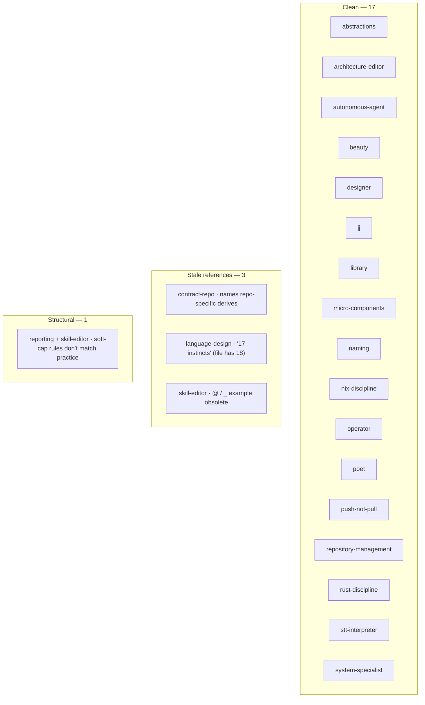

# 55 · Skills audit — 2026-05-08

Status: read-pass over all 21 workspace skills against the
post-cleanup design state.
Author: Claude (designer)

The workspace's `skills/` directory holds 21 files totalling
6,477 lines. This audit reads each against current design
state (post-2026-05-08 cleanup), checks cross-references,
catches stale notation/derive references, and tests the
internal rules each skill claims to follow.

The audit's main finding is **the skill set is mature and
internally coherent**. Three concrete stale references need
fixing; one structural pattern (the soft-cap rule has eroded)
deserves an explicit decision; no coverage gaps block work
today.

---

## 0 · TL;DR

| Outcome | Count |
|---|---|
| Skills clean | 17 |
| Skills with stale-reference fix | 3 |
| Structural patterns flagged | 1 (soft-cap drift; affects 2 skills' rules) |
| Coverage gaps blocking work | 0 |
| Total skills | 21 |
| Total lines | 6,477 |

---

## 1 · Inventory

| Skill | Lines | Owned by | Status |
|---|---:|---|---|
| `abstractions.md` | 338 | designer | clean |
| `architecture-editor.md` | 269 | designer | clean |
| `autonomous-agent.md` | 273 | cross-cutting | clean |
| `beauty.md` | 105 | designer | clean |
| `contract-repo.md` | 490 | designer | **stale ref** (§2.1) |
| `designer.md` | 427 | designer | clean |
| `jj.md` | 462 | cross-cutting | clean |
| `language-design.md` | 334 | designer | **stale ref** (§2.2) |
| `library.md` | 268 | cross-cutting | clean |
| `micro-components.md` | 224 | designer | clean |
| `naming.md` | 168 | designer | clean |
| `nix-discipline.md` | 276 | system-specialist | clean |
| `operator.md` | 393 | designer (defines operator) | clean — see §5.2 |
| `poet.md` | 172 | designer (defines poet) | clean |
| `push-not-pull.md` | 165 | designer | clean |
| `reporting.md` | 397 | designer | clean — see §3 |
| `repository-management.md` | 120 | cross-cutting | clean |
| `rust-discipline.md` | 995 | designer (operator's primary toolkit) | clean — see §4 |
| `skill-editor.md` | 194 | designer | **stale ref + soft-cap** (§2.3, §3) |
| `stt-interpreter.md` | 193 | cross-cutting | clean |
| `system-specialist.md` | 214 | designer (defines system-specialist) | clean |

The "owned by" column reflects who substantively edits the
file. Workspace skills are designer's lane per
`skills/designer.md`; the owned-by labelling clarifies which
audience the skill primarily serves (the role whose work it
governs).

---

## 2 · Stale references — concrete fixes

### 2.1 · `contract-repo.md:55` — drop the derive parenthetical entirely

The "derive sharing" bullet under §"Why a contract repo
exists" cites:

> plus any project-specific derive (`NotaRecord`, `NexusPattern`)

`NexusPattern` was deleted permanently in designer/46 §6 —
that part is stale. **But the deeper issue is that workspace
skills shouldn't name repo-specific types at all.** `NotaRecord`
and `NexusPattern` are nota-derive's surface; they belong in
nota's or nota-codec's `skills.md`, not in a workspace-level
skill that names a *cross-cutting pattern*.

The skill-editor's own rule (`skill-editor.md:135-142`)
distinguishes "patterns that apply across multiple repos"
(workspace) from "component-specific patterns" (per-repo
skills). Naming specific derive types violates that split.

**Fix:** drop the parenthetical. The bullet becomes:

> **Derive sharing.** `Archive`, `RkyvSerialize`,
> `RkyvDeserialize`, `bytecheck`, plus any project-specific
> derives all live with the type. Re-deriving in each
> consumer is dead code at best, drift at worst.

The pattern (derives travel with the type) is the substance;
which derives is per-component.

### 2.1.b · The broader pattern in `contract-repo.md`

The same principle applied wider: `contract-repo.md` names
specific repos throughout (`signal`, `signal-forge`,
`signal-arca`, `signal-persona`, `signal-core`). Two cases:

- **Worked-example use** (e.g. line 35: *"The canonical
  workspace example is **signal**"*; line 156: *"signal-forge
  over signal is the canonical example"*) — concrete
  illustrations of the pattern. These help; the skill is
  more useful with a name to point at than without one.
- **Substantive content tied to the example** (e.g. lines
  282-308: extended narrative of how signal extracted to
  signal-core when signal-persona arrived). Here the
  illustration is doing real explanatory work.

The line is judgment-shaped: a worked example earns its
place when it makes the abstract pattern concrete; it
becomes repo-specific bloat when the *substance* of the
skill depends on knowing this particular ecosystem.

`contract-repo.md` is mostly on the right side of the line
— the kernel-extraction story is genuinely the cross-cutting
pattern. But the §"Naming a contract repo" section (lines
386-451) leans heavily on `signal-<consumer>` /
`<project>-signal` / `<project>-protocol` as the *only*
naming choices, encoded as a flowchart. If a future
workspace's wire fabric isn't part of the signal family,
that flowchart is misleading. The naming-convention
substance is workspace-shaped (signal-family-shaped); a
genuinely cross-cutting skill on contract-repo conventions
would extract this section into a sibling skill or a
per-ecosystem `signal/skills.md`.

**Optional fix:** consider whether `contract-repo.md` should
narrow to *the cross-cutting pattern* (when to extract a
contract repo, what belongs in it, the kernel-extraction
trigger, the layered-effect-crate pattern) and let the
ecosystem-specific naming convention live closer to the
ecosystem (e.g. `signal/skills.md`). Defer; not blocking.

### 2.2 · `language-design.md:299` — count drift

The "Where these instincts live" table's last row says:

> `ESSENCE.md` §"Language-design instincts" | distilled
> summary of all 17

The file has **18** numbered instincts (1-Delimiter-first
through 18-Delimiters earn their place). Instinct 18
("Delimiters earn their place") was added when designer/31
landed.

**Fix:** "all 17" → "all 18". Also worth verifying
ESSENCE.md §"Language-design instincts" actually carries 18
distilled bullets, not 17 (a separate edit if it lags).

### 2.3 · `skill-editor.md:135` — obsolete `@` / `_` example

The "What goes in a workspace skill" section illustrates
*what does NOT belong in a primary skill* with:

> "How nota-codec dispatches `@` and `_` via PatternField<T>"
> is a nota-codec-specific implementation rule

Three things are wrong with this example:

1. `@` was permanently dropped (designer/45-46). nota-codec
   no longer dispatches on it; the lexer treats `@` as a
   reserved token error.
2. `_` is no longer a wildcard sigil; the wildcard is the
   typed record `(Wildcard)`. `_` is now a normal bare
   identifier.
3. `PatternField<T>` lives in `signal-core`, not
   `nota-codec`. The codec dispatches on the record-head
   ident at PatternField positions; `PatternField<T>` is
   the typed receiver in signal-core.

The example was current when written; the underlying design
moved twice and the example was missed.

**Fix:** replace with an example that still illustrates the
"belongs in the component, not the workspace" rule. Candidate:

> "How `nota-codec`'s encoder emits eligible PascalCase
> strings as bare identifiers" is a nota-codec-specific
> implementation rule — it goes in `nota-codec/skills.md`,
> not in a primary skill.

### 2.4 · `reporting.md:55-56` — illustrative report numbers

Not strictly stale, but worth a flag. The chat-tone example
cites:

> "Two reports landed: `reports/designer/11-persona-audit.md`
> and `reports/designer/12-no-polling-delivery-design.md`."

`designer/11` doesn't exist (and never resurfaces in any
current skill); `designer/12` exists. The example is
illustrating *form*, not citing real reports. A reader who
opens designer/11 to verify the rule sees nothing.

**Optional fix:** use two real surviving reports, or use
clearly-fictional numbers (`reports/designer/<N>-foo.md`)
to signal that the example is illustrative.

---

## 3 · Structural — soft-cap drift

`skill-editor.md:71` states:

> Keep them small — soft cap ~150 lines, one capability per
> file. If a skill is growing past that, the right move is
> usually to split into two skills, not to expand one.

Actual skill sizes:

| Bracket | Skills | Count |
|---|---|---:|
| ≤ 150 lines | beauty, repository-management | 2 |
| 151–250 | naming, push-not-pull, poet, stt-interpreter, micro-components, system-specialist, skill-editor | 7 |
| 251–400 | library, architecture-editor, autonomous-agent, nix-discipline, language-design, abstractions, operator, reporting | 8 |
| 401–500 | designer, jj, contract-repo | 3 |
| 501+ | rust-discipline (995) | 1 |

**Only 2 of 21 skills are inside the soft cap.** The cap is
fictional. Skills that exceed it aren't bloated — they cover
their topic at the depth the topic needs. The rule, as
written, is a cargo-culted expectation that no skill follows.

Three options, decreasing aggression:

1. **Raise the cap.** A working norm of ~300 lines (with the
   1000-line outlier acknowledged) describes the actual
   shape. The split-when-bigger advice still applies, just
   at a higher threshold.
2. **Drop the cap, keep the principle.** Replace the line
   count with the principle: *one capability per skill;
   split when the skill straddles two distinct capabilities,
   not when it's "too long."* The capability-count test is
   what was load-bearing; the line-count test was a proxy.
3. **Hold the line.** Mandate splits — extract `redb-rkyv.md`
   from `rust-discipline.md`, extract `partial-commits.md`
   from `jj.md`, etc. Aggressive; produces 30+ skills; tests
   whether the workspace prefers granularity over cohesion.

Recommendation: **option 2.** The line-count proxy obscures
the actual rule (one capability). The current 21-skill
distribution looks like exactly the right granularity for a
21-role-and-cross-cutting workspace; the rust-discipline
outlier is genuinely one capability (Rust craft), and
splitting it would fragment lookups. Restate the rule as
capability-shaped and the friction goes away.

`reporting.md` has its own soft cap ("12 reports per role
subdirectory"; line 170). That one has worked — designer
just hit 12, triggered the cleanup, dropped to 11. The
soft-cap shape is right for reports, where freshness matters
and the file is a working surface; less right for skills,
where the line count tracks what's *known*, not what's
in-flight.

---

## 4 · The `rust-discipline.md` outlier (995 lines)

The biggest skill is one workspace's largest doc. Its
section breakdown:

| Section | Lines (~) |
|---|---:|
| Methods on types, not free functions | 50 |
| No ZST method holders | 60 |
| Domain values are types, not primitives | 40 |
| One type per concept — no `-Details`/`-Info` companions | 30 |
| Don't hide typification in strings | 115 |
| One object in, one object out | 50 |
| Constructors are associated functions | 20 |
| Use existing trait domains | 15 |
| Direction-encoded names | 10 |
| Naming — full English words | 30 |
| Errors: typed enum per crate via thiserror | 35 |
| Actors: logical units with ractor | 50 |
| **redb + rkyv — durable state and binary wire** | **285** |
| One Rust crate per repo | 15 |
| Tests live in separate files | 30 |
| Module layout | 45 |
| Documentation | 25 |

The redb+rkyv section is 29 % of the file alone. It is
itself an accumulation surface (the skill explicitly says
"this section is the *living* discipline for these two
tools"); patterns and anti-patterns get added over time.

A defensible split:

- **`rust-discipline.md`** — 700 lines, the type-shape /
  naming / one-object / errors / module-layout / testing
  rules. Genuinely "how to write Rust here."
- **`rust-state-and-wire.md`** — 285 lines, the redb + rkyv
  living discipline. Genuinely "how durable state and
  inter-process bytes work here." Cited from `contract-repo.md`,
  `operator.md`, etc.

Both halves are coherent capabilities. The split honours the
"one capability per skill" rule.

But: there's a real cost. Operator's primary read becomes
two files; "Rust craft" becomes a discoverable pair rather
than a single index. Cross-references in other skills
(currently `skills/rust-discipline.md §"redb + rkyv"`) become
`skills/rust-state-and-wire.md` end-to-end, and the change
ripples.

Recommendation: **defer the split** unless option 2 in §3
isn't taken. With "capability count" as the rule, this skill
is already one capability (Rust discipline; the redb+rkyv
section is a sub-discipline that earns its keep). With the
line cap raised or dropped, no split is forced.

---

## 5 · Cross-skill consistency — clean

The audit verified the following invariants hold across
all 21 skills:

### 5.1 · Heading and structure

- All 21 use `# Skill — <name>` as H1. ✓
- All 21 follow the `*<one-line purpose>*` italic-line
  pattern below the H1. ✓
- All 21 have a `## What this skill is for` section as the
  first body section. ✓
- All 21 close with a `## See also` section. ✓

### 5.2 · Cross-references resolve

Sampled cross-references checked for resolution:

- All ESSENCE.md `§"<name>"` citations from skills resolve
  to actual H2 sections (Beauty is the criterion, Polling
  is forbidden, Perfect specificity at boundaries,
  Infrastructure mints identity..., Micro-components,
  Skeleton-as-design, Positive framing, Rules find their
  level, Language-design instincts, Documentation layers).
- Inter-skill `skills/<name>.md §"<section>"` citations
  resolve (sampled across `rust-discipline.md`,
  `contract-repo.md`, `abstractions.md`).
- Workspace-relative paths (`~/primary/...`) and repo
  symlinks (`repos/criome/...`) match the actual directory
  layout.

The discipline `skill-editor.md` calls for is being
followed by the skills themselves.

### 5.3 · Role-quartet symmetry

The four role skills (`designer`, `operator`,
`system-specialist`, `poet`) follow the same shape:

| Section | Present in all four |
|---|---:|
| What this skill is for | ✓ |
| Owned area / does NOT own | ✓ |
| Working pattern | ✓ |
| Working with [other roles] | ✓ |
| When the [role's work] feels off | ✓ |
| See also | ✓ |

The symmetry is the result of the four files landing in the
same design pass; future role additions (e.g. the
critical-analysis role tracked as primary-9h2) should follow
the same template.

### 5.4 · `operator.md`'s hard-coded crate list

`operator.md:36-44` lists 23 owned crates by name:

> **Source code** in every Rust crate the workspace owns:
> `nota-codec`, `nota-derive`, `signal-core`, `signal`,
> `signal-derive`, `signal-persona`, `signal-forge`,
> `nexus`, `nexus-cli`, `criome`, `persona`,
> `persona-harness`, `persona-message`, `persona-router`,
> `persona-store`, `persona-system`, `persona-orchestrate`,
> `persona-wezterm`, `forge`, `prism`, `chroma`,
> `mentci-egui`, `mentci-lib`, `mentci-tools`,
> `horizon-rs`, `goldragon`, and so on.

The list will go stale (`signal-arca` exists per the
contract-repo skill but isn't on the list; new crates land
regularly). The "and so on" softens it but doesn't fix it.

**Optional fix:** replace with a generic ownership claim —
*"Source code in every Rust crate the workspace owns; see
`~/primary/repos/` for the canonical index."* The repo
symlink directory is already the source of truth; the
hard-coded list duplicates and drifts.

This is borderline-stale, not currently misleading. Filing
under §"clean" because no agent reading this list today
would be misled, but the list will degrade.

---

## 6 · Coverage observations — no current gaps

All four coordination roles have a dedicated skill.
Implementation discipline (rust-discipline, contract-repo,
micro-components, push-not-pull) is covered. Notation design
(language-design) and component shape (architecture-editor,
skill-editor, reporting) are covered. Coordination
(autonomous-agent, jj, repository-management) is covered.
Niche but useful (library, stt-interpreter) is covered.
System glue (system-specialist, nix-discipline) is covered.

**Candidates for future skills, not currently load-bearing:**

- **Schema-migration skill.** rkyv schema fragility lives in
  `rust-discipline.md §"Schema discipline"` and
  `lore/rust/rkyv.md`. If migration shape becomes a recurring
  concern across persona, criome, and signal-* contracts, a
  dedicated skill might earn its place. Today, the rules are
  small and live in the right places.
- **Test-writing skill (Rust-specific).** Currently scattered
  across `rust-discipline.md §"Tests live in separate files"`,
  `contract-repo.md §"Examples-first round-trip discipline"`,
  and `operator.md §"Land features bundled with their tests"`.
  The scatter is fine — each skill tells the role what it
  needs to know. A separate test-craft skill could
  consolidate, but isn't forced.
- **Critical-analysis role skill.** Tracked as
  `primary-9h2`; awaits a designer report proposing the role
  + lock file shape before the skill itself.

None of these block work today. Filing as observations.

---

## 7 · Recommendations — punch list

In priority order:

| # | What | Where | Cost |
|---|---|---|---:|
| 1 | Drop or raise the 150-line soft cap; restate as "one capability per skill" | `skill-editor.md:71` | small |
| 2 | Drop the `(NotaRecord, NexusPattern)` parenthetical — workspace skills shouldn't name repo-specific derive types | `contract-repo.md:55` | small |
| 3 | "all 17" → "all 18" | `language-design.md:299` | trivial |
| 4 | Replace obsolete `@`/`_`/`PatternField<T>` example with a still-true one | `skill-editor.md:135` | small |
| 5 | (optional) replace illustrative report-11 with a real surviving report | `reporting.md:55-56` | small |
| 6 | (optional) replace operator's hard-coded crate list with a `repos/` pointer | `operator.md:36-44` | small |
| 7 | (optional, depends on §3 decision) split `rust-state-and-wire.md` out of `rust-discipline.md` | `rust-discipline.md` whole | medium |

Items 1-4 are the proposed scope of a follow-up commit.
Items 5-6 are nice-to-have. Item 7 is structural and
shouldn't land without an explicit decision on §3's option.

---

## 8 · What was good

The audit found:

- **Internal consistency.** All 21 skills follow the same
  structural template; cross-references resolve; the
  `# Skill — <name>` heading + `*purpose*` italic-line +
  `## What this skill is for` shape is uniform.
- **Role coverage complete.** Four roles, four skills.
  Every role has a dedicated skill that names its scope,
  toolkit, working pattern, and inter-role seams.
- **Cross-cutting coverage complete.** Implementation,
  design, deploy, writing, version control, repo
  management, reporting — all have dedicated skills with
  clear scope.
- **Drift is local, not systemic.** The three stale
  references (§2.1-2.3) are concrete one-line edits. None
  of them obscure a load-bearing design rule; all three
  are surface lag from recent design moves.
- **The soft-cap rule is the only meta-violation**, and
  it's a rule about its own subject — the skills'
  internal cap, not the workspace's design. Removing or
  re-stating it is a one-edit fix that brings the
  declared rule in line with the practiced norm.

The skills, taken as a whole, demonstrate the discipline
they describe: clarity (the H1 identifies the skill at a
glance), correctness (cross-references resolve), beauty
(the role quartet shows the same shape four ways without
feeling templatic), introspection (each skill names its
own scope explicitly).

---

## 9 · See also

- `~/primary/skills/` — the directory under audit.
- `~/primary/skills/skill-editor.md` — the skill that
  governs the others; the soft-cap rule lives here.
- `~/primary/reports/designer/53-session-handover.md` —
  the post-cleanup state this audit reads against.
- `~/primary/reports/designer/46-bind-and-wildcard-as-typed-records.md`
  — the design that retired `@`, `_`, and the
  `NexusPattern` derive (the source of §2.1, §2.3
  staleness).
- `~/primary/reports/designer/31-curly-brackets-drop-permanently.md`
  — instinct 18 ("Delimiters earn their place") originated
  here.
- `~/primary/ESSENCE.md` §"Language-design instincts" —
  cross-check against §2.2 (does ESSENCE name 17 or 18
  instincts?).

---

*End report.*
