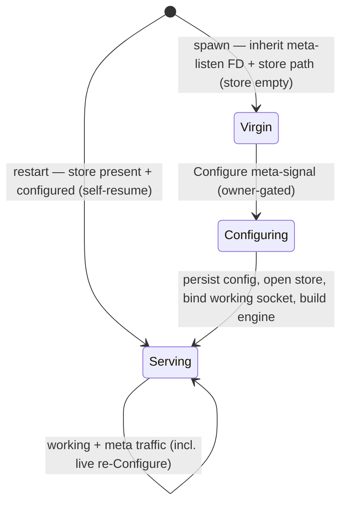

# 550 — Daemon configuration bootstrap: the virgin-daemon model

## Intent Anchors

[Daemons cannot understand NOTA — a universal high-certainty constraint: the long-lived daemon never links or parses the NOTA text decoder; its inputs are binary signal-encoded (rkyv) only, and NOTA is exclusively the CLI / human-agent edge. (psyche 2026-06-07, Spirit `e6ri`)]

[EXPLORATORY: a virgin daemon — one that has never started, holds no state, and is unconfigured — boots into a semi-started state and waits for a configuration signal message rather than taking a configuration-file argument at startup; configuration becomes a runtime reaction. (psyche 2026-06-07, Spirit `0yk3`, invited pushback)]

[Signal in/out, SEMA command/response, and executor lowering are all reaction languages: an engine matches an input tree against runtime state and produces the corresponding output tree. (Spirit `8qxm`)]

## The settled half: daemons cannot understand NOTA

The daemon-argument ambiguity the operator flagged (report 548, operator feedback 336) is now resolved on the firm half: **a daemon never parses NOTA.** This is propagated as a universal constraint into `AGENTS.md` §"NOTA is the only argument language" and `skills/component-triad.md` §"The single argument rule" — the CLI / human-agent edge accepts NOTA (string or file); the daemon's one argument is a signal-encoded (rkyv) `Configuration` only; a deploy helper or the CLI authors config in NOTA and encodes it to rkyv. This also fixed a latent contradiction: component-triad.md previously said "the daemon's argument is a NOTA config record," which conflicted with its own §"No NOTA between components."

The virgin-daemon proposal is the *next* move on top of that constraint, and it is the more interesting half.

## The proposal, and why it is sound

A virgin daemon boots semi-started and waits for a `Configure` signal instead of reading a config file. I think this is right, for four reasons that all point the same way:

- **It is the natural endpoint of "config is a reaction" (`8qxm`).** Today configuration is the one input that is NOT a reaction — it is a startup argument decoded before the engine exists. The virgin model erases that exception: `Configure` becomes an input tree the daemon matches against its (empty) state and reacts to, exactly like every working operation. One fewer special path.
- **The home already exists.** `Configure` is already a meta-signal operation — the new spirit ships `meta_signal::Input::Configure` (the archive-target work, parity port 547) on the owner-only meta socket, with the SO_PEERCRED owner-uid gate already built. "Virgin daemon waits for `Configure`" is just that existing operation moved earlier in the lifecycle. No new contract surface — the meta-signal plane simply gains a bootstrap responsibility it is already shaped for.
- **It removes the config-file encoding step.** Instead of "deploy helper pre-encodes an rkyv `Configuration` file → daemon reads it," it is "spawn the daemon → send it `Configure`." Configuration stops being a file artifact and becomes a message — which is also how *reconfiguration* already works, so boot-config and live-config collapse into one mechanism.
- **It fits the persona-manager model (`mazv`).** Persona is the manager that spawns and supervises children. A virgin child that waits for persona's `Configure` is cleaner than persona pre-writing a config file per child: persona mints the configuration and *sends* it, owning the whole bootstrap as signal traffic it can observe and re-issue.

"Semi-started" has a precise, clean meaning here: **the daemon binds only its meta socket (to receive `Configure`); its working socket stays closed and no store is opened until configuration lands.** Working traffic before configuration is impossible because there is nothing listening for it — the state machine, not a guard, enforces the order.

## The two things to nail down (the pushback)

The idea is sound; "the virgin daemon takes no input at all" is slightly too strong. Two bootstrap facts cannot themselves arrive via `Configure`, because the daemon needs them to be able to *receive* `Configure` and to *know whether it is virgin*:

**1. The bootstrap minimum — where does it listen, before it is configured?** To receive `Configure` the daemon must already be listening on its meta socket, and the socket path is configuration. Something has to provide that floor. Three ways, in preference order:

- **Persona hands the daemon its meta-listen FD via SCM_RIGHTS at spawn.** 548 already describes persona doing SCM_RIGHTS FD-handoff for stable public sockets; extending it so the spawned virgin daemon *inherits* an already-bound meta-listen FD makes the daemon truly argument-free — persona owns the entire bootstrap (allocate path → bind → hand FD → send `Configure`). This is the most coherent with the manager model. Recommended for every supervised component.
- **systemd socket activation** for the top-level daemon that has no parent manager (persona itself): the init system binds and passes `LISTEN_FDS`; the socket path lives in the unit, not the daemon's argv.
- **A minimal rkyv bootstrap argument** carrying just the meta-listen path (still binary, constraint-clean) — the fallback when neither FD-handoff nor socket activation is available (standalone dev runs).

The point: the *full* `Configuration` (policy, peers, limits, archive target, trace socket, choreography mode) arrives as the `Configure` signal; only the bare meta-listen endpoint is bootstrap, and the cleanest form is an inherited FD, not an argument at all.

**2. Persisted config + restart — "virgin" is true only on first boot.** The psyche's definition is precise: virgin = never started, no state, unconfigured. A daemon that has been configured and has a populated store is **not** virgin on restart — it should read its persisted configuration from its own store and self-resume, not wait for `Configure` again. But the store *location* is configuration, and it cannot live inside the store it points at (chicken-and-egg). Resolution: the **store path is part of the same bootstrap channel** persona provides at spawn (548 already has persona allocating `/var/lib/persona/<engine-id>/<comp>.redb`). So the spawn-time floor is exactly two facts — **{meta-listen FD, store path}** — and from the store's state the daemon decides: store absent/empty → *virgin*, wait for `Configure`; store present and carrying a persisted config record → *resume*, self-configure, bind working socket, serve. This also subsumes the current `bootstrap-policy.nota` first-start declaration: first-start policy becomes either the first `Configure` signal or a persisted default, not a file the daemon parses (which it could not anyway, being NOTA).

## The lifecycle

The diagram's claim: there is one configuration mechanism (`Configure`), one bootstrap floor ({FD, store path}), and the virgin-vs-resume fork is decided by store state, not by a different code path.

## Recommendation + open decisions for the psyche

**Adopt the virgin-daemon model**, with the bootstrap floor as {inherited meta-listen FD via persona SCM_RIGHTS (or systemd activation for the top-level), store path} and the full `Configuration` carried by the `Configure` meta-signal. It strengthens — does not weaken — the daemon-cannot-understand-NOTA constraint: the daemon needs neither NOTA nor even an rkyv config *file*, only binary `Configure` frames it already decodes.

Decisions that would let me move this from `0yk3`-exploratory to ratified and into the skill:

1. **Is the bootstrap floor {FD, store path} acceptable**, or do you want the daemon to take a minimal rkyv bootstrap arg instead of an inherited FD? (FD-handoff is cleaner but couples every supervised daemon to persona for spawn; the minimal-arg form keeps daemons standalone-runnable.)
2. **On restart, self-resume from persisted store config** (my recommendation) — or should a daemon ALWAYS wait for `Configure` and treat the store as data-only, so persona re-issues config every boot? (Always-wait is more uniform and keeps mind/persona as the single source of config truth; self-resume is faster and survives a manager outage.)
3. Confirm the bootstrap arg, when used, is a **signal-encoded (rkyv)** minimal record (not NOTA) — consistent with `e6ri`.

On your ratification I capture the decision, write it into `skills/component-triad.md` (the single-argument-rule / daemon-startup section), and hand the operator the spirit-pilot implementation (it already has the `Configure` meta op + owner gate, so it is the natural first virgin-daemon).
