# 550-v2 — Daemon configuration bootstrap: the ratified model

## What this supersedes

550-v1 framed the virgin-daemon idea as a proposal with three open decisions and leaned toward persona FD-handoff for the bootstrap floor. The psyche resolved all three (2026-06-07): **no manager dependency** for bootstrap, **the daemon accepts a pre-generated signal rkyv message**, **self-resume on restart**, **rkyv arg**. This version states the ratified model directly. v1 is deleted in the same commit (git holds the lineage).

## Intent Anchors

[Daemons cannot understand NOTA — a universal high-certainty constraint: the long-lived daemon never links or parses the NOTA text decoder; its inputs are binary signal-encoded (rkyv) only, and NOTA is exclusively the CLI / human-agent edge. (Spirit `e6ri`)]

[A daemon's single startup argument is a pre-generated signal-encoded (rkyv) `Configure` message; bootstrap depends on no manager; a virgin daemon (empty store) applies it as first configuration, a daemon with a populated store self-resumes; the same `Configure` type is accepted live over the meta socket. (Spirit `ur16`)]

[Signal in/out, SEMA command/response, and executor lowering are all reaction languages: an engine matches an input tree against runtime state and produces the corresponding output tree. (Spirit `8qxm`)]

## The model

A daemon takes exactly one startup argument: a **pre-generated signal-encoded (rkyv) `Configure` message** — the same `Configure` operation the daemon also accepts live over its meta socket. A deploy helper or the CLI authors the `Configure` as NOTA and encodes it to rkyv (NOTA never reaches the daemon, per `e6ri`); the daemon decodes the binary message.

The daemon opens the store named in that `Configure` and forks on the store's state:

- **Virgin** (store empty / absent) — the daemon applies the `Configure` as its first configuration, opens the store, binds its sockets, and serves.
- **Resume** (store populated) — the daemon **self-resumes** from the persisted store rather than re-applying; the argument's store path locates it, the persisted state is authoritative.

There is **no manager dependency** anywhere on this path. Bootstrap does not require persona, an FD-handoff, or any other running component — the daemon is self-sufficient from its single argument. (Persona, when present, still *supervises and reconfigures* at runtime via the meta socket; it is just not a bootstrap prerequisite.)

## Why this is the right shape

- **Config is a reaction (`8qxm`), with one vocabulary.** The `Configure` the daemon reads at boot is the *same message type* it accepts live over the meta socket — two delivery channels (startup argument, meta socket), one schema. Configuration stops being a special pre-engine code path and becomes the same input-tree-to-output-tree reaction as every working operation.
- **It honors the daemon-NOTA constraint (`e6ri`) without compromise.** The argument is binary rkyv; the daemon links no NOTA decoder. Authoring stays at the NOTA edge (deploy helper / CLI), encoding to rkyv before the daemon ever sees it.
- **No bootstrap dependency — the rejected alternative and why.** v1 leaned on persona handing the daemon a meta-listen FD via SCM_RIGHTS. The psyche rejected it: *"we can't depend on persona for bootstrap."* That is correct and load-bearing — persona is itself a daemon that must bootstrap the same way, so a manager-dependency is circular; and a daemon that cannot start without its manager is fragile (a manager outage strands every child). A self-contained rkyv argument removes the dependency entirely.
- **It dissolves the chicken-and-egg v1 worried about.** v1's pushback was that a daemon must already be *listening* to receive `Configure`, and the socket path is itself configuration. That problem only exists if `Configure` arrives over a socket. Here it arrives **as the argument** — a file the daemon reads before binding anything — so "where do I listen" and "where is my store" are simply fields in the message. No listen-before-config, no semi-started wait state.
- **Self-resume keeps restarts cheap and outage-robust.** A configured daemon that restarts reads its persisted store and resumes; it does not need a fresh `Configure` round-trip or a live manager to come back up.

## Lifecycle

```mermaid
stateDiagram-v2
    [*] --> ReadArg: start — one rkyv Configure argument
    ReadArg --> Virgin: store at named path is empty
    ReadArg --> Resume: store at named path is populated
    Virgin --> Serving: apply Configure as first config; open store; bind sockets
    Resume --> Serving: self-resume from persisted store; bind sockets
    Serving --> Serving: working + meta traffic (live re-Configure over meta socket)
```

The diagram's claim: one configuration vocabulary (`Configure`), one self-contained startup argument (no manager, no socket-before-config), and the virgin-vs-resume fork decided by store state — not by a different code path or an external dependency.

## What "virgin" means now

"Virgin" is no longer a *waiting* state — it is simply **a daemon whose store is empty**, for which the startup `Configure` is the authoritative first configuration. A daemon with a populated store is "configured" and self-resumes. The `bootstrap-policy.nota` first-start file is subsumed: first-start policy is the first `Configure` message (or a persisted default), never a NOTA file the daemon parses.

## Implementation + handoff

`spirit` is the natural first implementation: it already ships `meta_signal::Input::Configure` with the SO_PEERCRED owner gate (parity port 547) and a `sema-engine` store. The deltas are small and self-contained: (1) make the daemon's single startup argument a `Configure` message (today it reads a separate rkyv `Configuration` — aligning it to the `Configure` signal type unifies boot-config with the live meta-socket op); (2) add the store-state fork (empty → apply arg as first config; populated → self-resume); (3) keep the meta socket accepting `Configure` for live reconfiguration. Once spirit lands it as the exemplar, the operator carries the same shape to the other component daemons; the shape is also written into `skills/component-triad.md` §"The single argument rule".
