# 551 — Repository ecosystem: dependency + usage state

## The short answer

The psyche owns roughly 150 repos; the active Persona core plus its triad contracts and the new schema-derived spine account for maybe 40-50 of them, and the rest split fairly evenly between live-but-adjacent tools and genuine debris. The new-vs-old story is one breath: the ecosystem is mid-migration through three parallel kernel swaps — wire (`signal-frame` NEW replacing `signal-core` OLD), NOTA (`nota-next` NEW replacing `nota-codec` OLD), and schema (`schema-next` + `schema-rust-next` NEW replacing `schema` OLD) — over a new shared runtime (`triad-runtime`) and storage engine (`sema-engine`) on the kept `sema` kernel. Roughly 25-30 repos are dead, abandoned, or duplicate checkouts: one frozen aski-compiler cluster (~11 repos), a paused-not-dead criome-executor cluster (~4), and a scatter of dead duplicates and one-offs.

To your specific question: **`signal-core` is unambiguously LEGACY, not part of the new stuff.** Its own `INTENT.md` says so verbatim — "This crate is DEPRECATED, superseded by `signal-frame` + `signal-sema` (2026-05-19)." The new wire kernel is **`signal-frame`** (44 consumers, the most-depended-on signal crate); the six Sema class labels moved to `signal-sema`. New code depends on `signal-frame` for the kernel and never on `signal-core`.

## The new-vs-old stack split

This is the migration frontier as of the current dependency snapshot, grounded in `/tmp/dep-graph.json` (forward/reverse deps + last-commit dates), the repos' own `INTENT.md`, and `/home/li/primary/protocols/active-repositories.md`.

### Wire kernel — `signal-frame` (NEW) vs `signal-core` (OLD)

`signal-core` is LEGACY on a retirement track, not stale: it still ships (last commit 06-05) and has 21 consumers, but it is being redirected away from universal request verbs.

- **NEW `signal-frame`** — 44 consumers (06-05). The entire schema-derived stack: every `signal-cloud`/`meta-signal-*`/`owner-signal-*` contract, `triad-runtime`, `schema-rust-next`, `spirit`, `upgrade`, plus the new daemons.
- **OLD `signal-core`** — 21 consumers (06-05, still touched mid-migration). Hand-written legacy contracts and original Persona daemons: `criome`, `signal-harness`, `signal-introspect`, `signal-message`, `signal-mind`, `signal-router`, `signal-system`, `signal-terminal`, `signal-criome`, `owner-signal-terminal`, `terminal-cell`, `signal`, `sema-engine` (a documented transitional utility seam).
- **DUAL (8 — the wire migration debt):** `harness`, `introspect`, `message`, `mind`, `persona`, `router`, `system`, `terminal` each pull BOTH `signal-frame` AND `signal-core`. These are the live first-stack daemons caught mid-port: new contracts on the frame kernel, old `signal-*` contracts still on `signal-core`.

### NOTA — `nota-next` (NEW) vs `nota-codec` (OLD) vs `nota` (DEAD-ish)

`nota-codec` is the single most load-bearing OLD crate in the ecosystem and being replaced by `nota-next`, but far from retired.

- **NEW `nota-next`** — 20 consumers (06-06). The schema stack, the new contracts, the new daemons.
- **OLD `nota-codec`** — 67 consumers (06-05/05-27). Effectively the entire pre-schema ecosystem plus contract crates not yet ported (incl. still-active non-Persona repos `chroma`, `chronos`, `clavifaber`, `horizon-rs`, `lojix-cli`, `nexus`).
- **DEAD-ish `nota`** — 1 consumer (only `signal-persona-spirit`, 05-25). The NOTA language-home repo, almost fully orphaned. Retire once its lone consumer drops it.
- **DUAL (13 — the NOTA migration debt):** `cloud`, `lojix`, `message`, `router`, `terminal`, `upgrade`, `meta-signal-cloud`, `meta-signal-lojix`, `meta-signal-router`, `meta-signal-upgrade`, `signal-cloud`, `signal-lojix`, `signal-upgrade`. Most pull `nota-codec` transitively via `nota-config` or `signal-frame`→`nota-codec`. **`nota-codec` cannot retire until `signal-frame` drops it.**

### Storage — `sema-engine` (NEW engine) vs `sema` (kept kernel)

Not a replace — a layered split. Both are live; `sema` is the kept kernel under the new `sema-engine` (the exclusive DB-operation boundary). `sema-engine` depends on `sema` one-way, so consuming `sema` directly = legacy/transitional access.

- **NEW `sema-engine`** — 8 consumers (06-05): `introspect`, `mind`, `orchestrate`, `persona-spirit`, `repository-ledger`, `spirit`, `spirit-next`, `upgrade`.
- **KERNEL `sema`** — 11 consumers (06-05): the 8 engine users plus `criome`, `persona`, `router`, `terminal` touching the kernel directly.
- **DUAL (6 — proper layering, NOT debt):** `introspect`, `mind`, `orchestrate`, `persona-spirit`, `repository-ledger`, `upgrade`.
- **Migration signal (4 — kernel-direct, no engine):** `criome`, `persona`, `router`, `terminal` — candidates to move to the engine boundary, or legitimately kernel-only.

### Schema — `schema-next` + `schema-rust-next` (NEW) vs `schema` (OLD, near-retired) vs `schema-core` (PROBE)

The cleanest split — no component straddles old `schema` and the new emission layer.

- **NEW `schema-next`** — 9 consumers (06-06). Semantic model only; does not emit Rust source.
- **NEW `schema-rust-next`** — 21 consumers (06-06). Rust emission via `quote!`/proc-macro2, NOT string codegen.
- **OLD `schema`** — only 4 consumers (05-26): `orchestrate`, `meta-signal-orchestrate`, `signal-orchestrate`, and `signal-frame`. Nearly retired — the orchestrate triad is its last full consumer; `signal-frame` is the only non-orchestrate holdout.
- **DEAD `schema-core`** — 0 consumers (05-28). A deliberate Nix cross-crate-import probe/witness, not a shipping library; garbage-collectable.

### Runtime — `triad-runtime` (NEW, no old counterpart)

`triad-runtime` (11 consumers, 06-07 — the most recently touched core crate) is purely NEW: shared runtime mechanics (trace transport, `LengthPrefixedCodec`, streaming subscription registries, `ComponentCommand` single-arg enforcement). Consumers: `cloud`, `harness`, `lojix`, `message`, `orchestrate`, `router`, `spirit`, `spirit-next`, `terminal`, `upgrade`, `schema-rust-next`. Its presence in a daemon is the cleanest single marker that the daemon has joined the new stack.

### The real frontier — the keystone

The 8 wire-dual daemons are the canonical migration frontier: **`harness`, `introspect`, `message`, `mind`, `persona`, `router`, `system`, `terminal`** each carry BOTH `signal-core` and `signal-frame`. `harness`/`message`/`router`/`terminal` are deepest in (also on `triad-runtime` + `schema-rust-next` + `nota-next`); `introspect`/`mind`/`persona`/`system` are mid-port. The retirement chain has a clear critical path: `signal-core` cannot retire until those 8 cut over; `nota-codec` cannot retire until `signal-frame` drops it; old `schema` cannot retire until `signal-frame` and the orchestrate triad drop it. **`signal-frame` is the keystone — itself new-stack, but it still pins both `nota-codec` and old `schema` for the whole ecosystem.**

## The component dependency map

This maps who-depends-on-what among the active Persona daemon components. Edges and dates are read from `/tmp/dep-graph.json`; component roles from `/home/li/primary/protocols/active-repositories.md`. "Component" = a daemon/runtime repo + its triad.

### The shared spine — what every component sits on

Two generations of spine. The new schema-derived stack is `signal-frame` (wire kernel, 06-05) + `nota-next` (NOTA, 06-06) + `schema-rust-next` (Rust emitter, 06-06) + `sema-engine` (storage engine, 06-05) + `triad-runtime` (daemon runtime, 06-07). The legacy spine is `signal-core` (06-05) + `nota-codec` (06-05). Almost no component has finished migrating — most carry BOTH `signal-frame` and `signal-core`, and essentially everyone still pulls `nota-codec`.

```mermaid
graph BT
  subgraph spine_new["new schema-derived spine"]
    SF["signal-frame (06-05) ← 44"]
    NN["nota-next (06-06) ← 20"]
    SRN["schema-rust-next (06-06) ← 21"]
    SE["sema-engine (06-05) ← 8"]
    TR["triad-runtime (06-07) ← 11"]
  end
  subgraph spine_old["legacy spine"]
    SC["signal-core (06-05) ← 21"]
    NC["nota-codec (06-05) ← 67"]
  end
  persona --> SF & SC
  mind --> SF & SC & SE
  router --> SF & SC & TR & NN & SRN
  message --> SF & SC & TR & NN & SRN
  harness --> SF & SC & TR
  introspect --> SF & SC & SE
  terminal --> SF & SC & TR & NN & SRN & SE
  orchestrate --> SF & TR & SE
  spirit --> SF & TR & SE & NN & SRN
  upgrade --> SF & TR & SE & NN & SRN
  repoledger["repository-ledger"] --> SF & SE
  cloud --> SF & TR & NN & SRN
  domcriome["domain-criome"] --> SF & SRN
  criome --> SC
```

(`nota-codec` is omitted from per-component arrows to keep the spine readable — assume nearly every component still pulls it; the only stack repos that do NOT are the pure-new ones: `nota-next`, `schema-next`, `signal-spirit`, `horizon-next`. The `sema` kernel is also pulled by criome/introspect/mind/orchestrate/persona/persona-spirit/repository-ledger/router/terminal/upgrade in addition to `sema-engine`.)

### Spine-adoption status per component (legacy debt called out)

| Component | New spine it has | Legacy still carried | Migration read |
|---|---|---|---|
| `persona` (05-24) | signal-frame | **signal-core, nota-codec** | Furthest behind of the daemons: no triad-runtime/nota-next/sema-engine. Oldest commit of any live component. |
| `mind` (06-05) | signal-frame, sema-engine, sema | **signal-core, nota-codec** | Storage migrated; wire still dual; no triad-runtime/nota-next. |
| `router` (06-06) | signal-frame, triad-runtime, nota-next, schema-rust-next, sema | **signal-core, nota-codec, nota-config** | Most-migrated of the legacy-wire group but still dual-wire. |
| `message` (06-06) | signal-frame, triad-runtime, nota-next, schema-rust-next | **signal-core, nota-codec** | Dual-wire; otherwise on the new spine. |
| `harness` (06-07) | signal-frame, triad-runtime | **signal-core, nota-codec** | No nota-next/schema-rust-next/sema-engine; dual-wire. |
| `introspect` (06-05) | signal-frame, sema-engine, sema | **signal-core, nota-codec, nota-config** | No triad-runtime/nota-next; dual-wire. |
| `system` (06-05) | signal-frame | **signal-core, nota-codec, nota-config** | Barely migrated — frame + everything legacy. |
| `terminal` (06-06) | signal-frame, triad-runtime, nota-next, schema-rust-next, sema | **signal-core, nota-codec, nota-config** | Broadest new-spine adoption AND broadest legacy debt — the deepest dual-stack carrier. |
| `terminal-cell` (06-05) | — | **signal-core only** | Fully legacy-wire; not migrated. |
| `orchestrate` (06-07) | signal-frame, triad-runtime, sema-engine, sema | **nota-codec, schema** (old!) | Clean of signal-core, but one of only 4 repos still on legacy `schema`. |
| `spirit` (06-06) | signal-frame, triad-runtime, sema-engine, nota-next, schema-next, schema-rust-next | none | **Fully on the new spine — the reference clean component.** No signal-core, no nota-codec. |
| `upgrade` (06-05) | signal-frame, triad-runtime, sema-engine, nota-next, schema-next, schema-rust-next | **nota-codec** | Nearly clean; only nota-codec remains. |
| `repository-ledger` (06-05) | signal-frame, sema-engine, sema | **nota-codec, nota-config** | No triad-runtime/nota-next; clean of signal-core. |
| `cloud` (06-07) | signal-frame, triad-runtime, nota-next, schema-rust-next | **nota-codec, nota-config** | New domain component; no signal-core. |
| `domain-criome` (06-05) | signal-frame, schema-rust-next | **nota-codec, nota-config** | New domain component; no triad-runtime/nota-next yet. |
| `criome` (06-05) | — | **signal-core, nota-codec, sema** | The auth/attestation daemon is fully on the LEGACY spine — no signal-frame at all. Most-isolated active daemon. |

**Cleanest-to-dirtiest on the spine:** `spirit` (fully new, nota-codec-free) > `upgrade` (only nota-codec left) > `orchestrate` (signal-core-free but still old `schema`) > `cloud`/`repository-ledger`/`domain-criome` (new-domain, no signal-core) > `terminal`/`router`/`message` (broad new adoption but dual-wire) > `mind`/`introspect`/`harness`/`system`/`persona` (signal-core-anchored) > `criome`/`terminal-cell` (legacy-only, no signal-frame).

### Component-to-component edges (daemon depends on another daemon's crate)

Most coupling is component → contract crate, not daemon → daemon. The actual daemon-to-daemon code edges are few:

- `harness` → **message** (harness embeds the message crate; the only cross-daemon library edge in the ingress chain).
- `terminal` → **terminal-cell** (terminal owns the PTY-cell primitive as a library).
- `persona` → **persona-spirit** AND **upgrade** (the meta-repo pulls the Spirit source and upgrade runtime directly as crates).
- `persona-spirit` → **persona** (mutual edge — these two are a tightly-coupled pair, each other's only reverse-dep; they migrate together).
- `sema-engine` → **signal-core** (a documented small transitional signal-core utility seam, not a permanent edge).

Everything else is mediated by contracts: `router` consumes the `signal-harness`/`signal-message`/`signal-mind`/`signal-router`/`signal-persona*` contracts (talks to those daemons at runtime without a code edge); `introspect` consumes `signal-router`/`signal-message`/`signal-introspect` (observes over Signal, no redb access); `cloud` forward-depends on `signal-domain-criome` (consumes domain-criome's contract directly).

### Triad completeness per component

- **Full triad (daemon + signal-X + meta-signal-X):** `cloud`, `domain-criome`, `orchestrate`, `repository-ledger`, `router`, `upgrade`.
- **Owner-signal instead of meta-signal (policy as owner-only):** `terminal`, `mind`, `persona`, `agent`.
- **Working contract only, no meta/owner policy leg:** `harness`, `introspect`, `message`, `system`, `criome`.
- **Split/legacy contract:** `persona` straddles three contracts — the retired shim `signal-persona`, plus the live split into `owner-signal-persona` (launch/retire/lifecycle) and `signal-engine-management` (announce/health/spawn). New code targets the latter two.

### Spine outliers worth carrying up

- **`criome` is the spine outlier** — the only active daemon with zero `signal-frame`/`triad-runtime`/`nota-next` adoption (pure `signal-core` + `nota-codec` + `sema` kernel). If the target is signal-frame-everywhere, criome is the largest un-started migration among live components.
- **`spirit` is the proven clean reference** — fully on the new spine with zero nota-codec, confirming the new spine is end-to-end viable for a real daemon. It's the template every other component is migrating toward.

## Which intent files to read (and which to skip)

This is the most actionable section. All files are `/git/github.com/LiGoldragon/<repo>/INTENT.md`. Cross-checked against `reports/designer/549-context-maintenance-pass.md`.

### Read these — the canonical active-stack INTENT.md set

One line each on why; ordered roughly by load-bearing weight:

- **`signal-frame/INTENT.md`** (1.3KB, 06-05) — the NEW wire kernel (← 44); the single most load-bearing contract crate to understand.
- **`persona/INTENT.md`** (12KB, 05-25) — the apex: what the psyche explicitly intended for Persona, with verbatim quotes; the meta-repo wiring the whole stack. (Caveat: its see-also points at the retired `signal-persona`; the drift is in persona's ARCHITECTURE.md, not here.)
- **`spirit/INTENT.md`** (9.2KB, 06-05) — the runnable pilot for the entire schema-derived stack (schema → schema-next → schema-rust-next → NOTA CLI + rkyv daemon); the best single end-to-end worked example.
- **`persona-spirit/INTENT.md`** (18KB, 06-06 — largest) — production Spirit source until cutover (the deployed `spirit` CLI + daemon). Read for what is actually running TODAY vs the `spirit` pilot.
- **`triad-runtime/INTENT.md`** (8.7KB, 06-07 — freshest) — the shared runtime contract for every schema-derived daemon; the triad-engine readability principle + streaming/trace runtime split.
- **`schema-next/INTENT.md`** (4.3KB, 06-05) — the replacement schema engine; schema as a NOTA dialect, no separate Asschema step.
- **`schema-rust-next/INTENT.md`** (6.3KB, 06-06) — the token-based (`quote!`/proc-macro2) Rust emission layer replacing the string emitter.
- **`nota-next/INTENT.md`** (6.5KB, 06-06) — the replacement NOTA impl + the `StructuralMacroNode` codec (decode-by-shape).
- **`sema-engine/INTENT.md`** (1.8KB, 06-05) — the exclusive database-operation boundary for state-bearing components.
- **`sema/INTENT.md`** (3.6KB, 06-05) — today's typed storage kernel (redb+rkyv+schema guard); the kernel under the engine.
- **`mind/INTENT.md`** (2.1KB, 06-05) — central control-plane authority ("observe up-tree, order down-tree"); verified CLEAN (the garbage is in mind's ARCHITECTURE.md).
- **`router/INTENT.md`** (2.9KB, 06-06) — message routing/delivery; 549-verified clean.
- **`message/INTENT.md`** (3.2KB, 06-06) — engine message ingress; 549-verified clean (its ARCHITECTURE.md is the half-done one).
- **`harness/INTENT.md`** (4.2KB, 06-07 — freshest) — the harness process/session control boundary.
- **`terminal/INTENT.md`** (4.6KB, 06-06) — Persona-facing terminal owner over `terminal-cell`.
- **`orchestrate/INTENT.md`** (4.2KB, 06-06) — the orchestration triad component. Read, but know it has stale `persona-mind` references (549 operator handoff).

Optional second tier (read if the topic comes up): `upgrade/INTENT.md` (2.9KB, 06-05), plus the two OLD-kernel intents to understand what's being replaced — `signal-core/INTENT.md` (3.2KB; the deprecation verdict, verbatim) and `nota-codec/INTENT.md` (3.4KB; the 67-consumer migration scope).

### Skip these — legacy / dead / duplicate INTENT files

- **`spirit-next/INTENT.md`** — byte-identical duplicate of `spirit/INTENT.md` (same remote, same HEAD `bd04eac`). Pure noise.
- **`core-signal-spirit/INTENT.md`** (05-26) and **`signal-spirit/INTENT.md`** (05-30) — both dead, superseded by `signal-persona-spirit`; the abandoned record-780 persona-prefix-retirement rename track.
- **`schema/INTENT.md`** (1.9KB, 05-26) and **`schema-core/INTENT.md`** (2.7KB, 05-28) — old schema stack being retired by schema-next/schema-rust-next; read schema-next instead.
- **`nota/INTENT.md`** (4.4KB, 05-26) — the old NOTA home with one straggler consumer; superseded by nota-next.
- **`sema-upgrade`** / **`owner-signal-sema-upgrade`** — self-declared retired breadcrumbs; superseded by the `upgrade` triad.
- **`orchestrator`** — old name of `orchestrate`; dead (05-30, zero consumers).
- The abandoned experiments — `arbor`, `askic*`, `corec`, `synth-core`, `veri-core`, `veric`, `criomos-archive`, `lojix-archive`, `prism`, `whisrs`, `kameo-testing*` — skip entirely.

### Important correction to the premise: the "garbage" is in ARCHITECTURE.md, not INTENT.md

Report 549 found the drift in **ARCHITECTURE.md** files, not the INTENT.md files. `mind/INTENT.md` is verified clean; 549 explicitly lists `message/INTENT.md`, spirit, router, sema-engine, nota-next, triad-runtime, schema-next, schema-rust-next as reconciled/clean. The dirty files (operator-owned `main`, so these are operator handoffs):

- **`mind/ARCHITECTURE.md`** (37KB, 05-25 — the worst) — pervasive dead `persona-` prefixes; treats the retired `signal-persona` shim as live. This is the actual "mind garbage."
- **`persona/ARCHITECTURE.md`** (05-25) — same dead `persona-` prefixes + live-treating the retired shim.
- **`message/ARCHITECTURE.md`** — half-done fix: INTENT cleaned, ARCHITECTURE still says `persona-router` in 6 places incl. the mermaid.
- **`orchestrate/INTENT.md` + `orchestrate/ARCHITECTURE.md`** — stale `persona-mind` (incl. a mermaid node + authority-table row) + a broken see-also path. This is the one INTENT.md with real drift.
- Cross-cutting: persona/ and orchestrate/ docs cite dead retired numeric reports (designer/322, 324, 326; operator/174).

## Dead, abandoned, and orphan repos

An orphan (zero LiGoldragon library reverse-deps) is either a live entry-point binary (expected — daemons and CLIs are consumed by humans/systemd, not crates) or genuinely dead. Four categories.

### (1) LIVE ENTRY-POINT — daemon/CLI that correctly has zero library consumers

Top-of-graph runtime binaries; zero reverse-deps is the expected shape; all in `active-repositories.md`, committed within 1-2 days: `cloud` (06-07), `domain-criome` (06-05), `harness` (06-07), `introspect` (06-05), `mind` (06-05), `router` (06-06), `orchestrate` (06-07), `terminal` (06-06), `system` (06-05), `repository-ledger` (06-05), `criome` (06-05, still on OLD stack), `upgrade` (06-05), `lojix` (06-06, smoke-built not yet cut over), `nexus` (06-05, OLD stack), `nexus-cli` (06-05, stale build — cleanup-watch but not dead). Plus live contracts with legitimately-zero reverse-deps: `owner-signal-agent`, `owner-signal-mind`, `signal-agent`, `signal-lojix`, `meta-signal-lojix` (all 06-05, live-pending — lands with the lojix daemon).

### (2) DEAD DUPLICATE — superseded by a renamed/merged repo

| Repo | Last commit | Verdict |
|---|---|---|
| `spirit-next` | 06-06 | Stale checkout of `spirit` — same remote, same HEAD, INTENT titled "spirit", only reverse-dep of `spirit`. Remove the checkout. |
| `orchestrator` | 05-30 | Old name → `orchestrate`. Distinct remote, zero deps; obsolete Gas-City `gc sling` bead-cascade design. |
| `core-signal-spirit` | 05-26 | Abandoned record-780 rename scaffold (single commit); live contract is `signal-persona-spirit`. |
| `signal-spirit` | 05-30 | Same abandoned rename track; two commits, never adopted. |
| `schema-core` | 05-28 | Spent witness — proved the cross-crate schema-import mechanism for `schema-next`; zero reverse-deps. |
| `sema-upgrade` | 05-24 | ARCHITECTURE opens "`sema-upgrade` is retired"; breadcrumb only, superseded by `upgrade`. |
| `owner-signal-sema-upgrade` | 05-24 | Retired with sema-upgrade; superseded by `meta-signal-upgrade`. |

### (3) ABANDONED EXPERIMENT — old, no consumers, not in active map

**The aski compiler lineage is one dead cluster, not 8 unrelated repos:** `corec → synth-core → aski-core → veri-core → veric → semac` plus `askic`/`askicc`/`aski-cc`/`astro-aski`/`WebPublish` — a self-contained compiler-toolchain experiment, all frozen ~04-20, conceptually replaced by the `schema-next`/`schema-rust-next`/`nota-next` emission stack. `veric` even deleted its own src; `arbor` (04-10) flagged its own drift in its last commit. Retire as a group.

Assorted one-offs, all zero-reverse-dep and roleless: `criomos-archive` (04-27), `whisrs` (05-11, speech-to-text picker), `hexis` (05-13, config-reconciliation lib), `kameo-testing` (05-14) + `kameo-testing-assistant` (05-30, falsifiable Kameo testbeds — keep as reference, not stack members), `substack-cli` (05-01), `mentci-egui` (05-14, superseded first-incarnation UI; `mentci-lib` is the live piece).

**The criome-executor lineage is one PAUSED (not dead) cluster:** `criome` (live daemon) → `signal-forge` (05-24) → `forge` (06-05, "planned replacement for nix's build infrastructure") → `prism` (05-11, "Stub today") → `arca` (05-30, content-addressed store). Only `criome` is live; the rest are documented-but-unbuilt vision repos. Treat as deferred, not garbage — read their INTENT/ARCHITECTURE before any retirement decision.

### (4) ADJACENT TOOL — alive, but system-operator / poet / other-domain, not Persona-core

`chroma` (06-05, system-operator visual/scheduler, on `nota-codec`), `chronos` (06-05, "active enough to keep visible, not Persona-core"), `brightness-ctl` (05-09, laptop backlight daemon consumed by CriomOS as a Nix flake input — hence zero Cargo reverse-deps), `horizon-next` (05-28, concept-witness on the new stack feeding the horizon rewrite), `lojix-archive` (05-13, frozen snapshot of the old lojix-cli deploy lineage), `mentci-tools` (04-27, non-Rust tooling, distinct domain).

## Recommendations

### Cleanup / retirement candidates (concrete)

- **Delete dead duplicate checkouts now (low risk):** `spirit-next` (stale checkout of `spirit`, byte-identical), `orchestrator` (old name of `orchestrate`), `core-signal-spirit` + `signal-spirit` (abandoned record-780 rename scaffolds — live contract is `signal-persona-spirit`), `sema-upgrade` + `owner-signal-sema-upgrade` (self-declared retired breadcrumbs), `schema-core` (spent cross-crate-import witness, zero consumers).
- **Retire the aski compiler cluster as a group:** `corec`, `synth-core`, `aski-core`, `veri-core`, `veric`, `semac`, `askic`, `askicc`, `aski-cc`, `astro-aski`, `WebPublish`, `arbor` — frozen ~04-20 and conceptually superseded by the schema-next/schema-rust-next/nota-next stack.
- **Decide explicitly on the paused criome-executor cluster:** `forge`, `prism`, `arca`, `signal-forge` are vision-not-garbage. Either fund the build or formally defer/archive — but read their INTENT first; do NOT bulk-delete with the aski cluster.
- **Finish retiring the legacy crates along the critical path, in order:**
  1. Get `signal-frame` off old `schema` and off `nota-codec` (it's the keystone — both legacy crates are pinned through it).
  2. Cut the 8 wire-dual daemons (`harness`, `introspect`, `message`, `mind`, `persona`, `router`, `system`, `terminal`) over from `signal-core` → `signal-frame`, then retire `signal-core`.
  3. Move the orchestrate triad off old `schema` → `schema-next`/`schema-rust-next`, then retire `schema`.
  4. Drop `nota` once `signal-persona-spirit` (its only consumer) cuts over, then retire it.
- **Two specific migration starts:** `criome` is the largest un-started migration (zero new-stack adoption) — schedule its signal-frame port; `persona` is the oldest/least-migrated of the central trio and migrates as a pair with `persona-spirit`.
- **Operator handoff for the ARCHITECTURE.md drift** (the actual "garbage"): clean `mind/ARCHITECTURE.md` (worst), `persona/ARCHITECTURE.md`, `message/ARCHITECTURE.md` (6 `persona-router` refs incl. mermaid), and `orchestrate/INTENT.md` + `ARCHITECTURE.md` (stale `persona-mind`, broken see-also). Strip dead retired report citations (designer/322, 324, 326; operator/174) while in there.

### The dependency-reporting habit (kype) to fold in

Make dependency context a standard reporting habit so this audit doesn't have to be reconstructed from scratch next time:

- **Add a dependency-snapshot step to `skills/engine-report.md` (and reference it from `skills/reporting.md`):** when a report touches a crate or component, cite its forward deps, its reverse-dep count, and its last-commit date inline — exactly the `← N (last commit MM-DD)` shorthand used throughout this report. Reverse-dep count is the cheapest single signal of live-vs-dead, and last-commit date disambiguates "stale" from "legacy-but-shipping."
- **Spirit kype:** capture this as a durable intent record (a kype) — "dependency context (forward/reverse deps + last-commit date) is surfaced as a standard reporting habit" — so it's an enforced norm, not a one-off. This report is the dependency-centric exemplar to point at.
- **Keep `/tmp/dep-graph.json` regeneration scripted** so reverse-dep counts and last-commit dates are a cheap re-run, not a manual graph walk; the spine-adoption table is the highest-value recurring view (one row per component, new-spine vs legacy-debt) and should be regenerable on demand.
