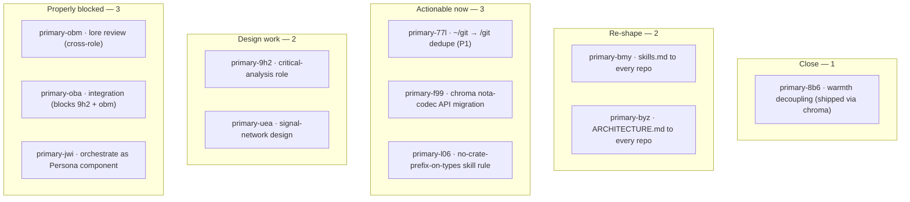
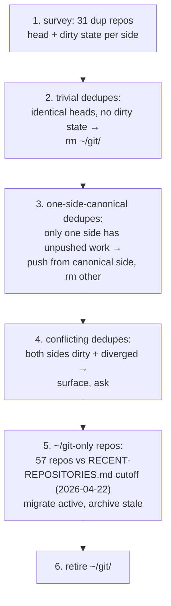

# 56 · BEADS audit — 2026-05-09

Status: read-pass over all 11 open BEADS, checking each
against current workspace state. One can close immediately;
two are durable backlog that probably shouldn't be tracked
as beads; the rest have clear closing paths or are properly
blocked.

Author: Claude (designer)

---

## 0 · TL;DR



| Outcome | Count |
|---|---:|
| Close immediately (shipped) | 1 |
| Re-shape — durable backlog, not bead | 2 |
| Actionable now (clear path) | 3 |
| Long-horizon design | 2 |
| Properly blocked / waiting | 3 |
| Total open beads | 11 |

---

## 1 · Close immediately

### 1.1 · `primary-8b6` — warmth decoupling — **shipped**

Filed 2026-05-07 against the darkman + nightshift coupling.
The bead's wanted list:

1. Decouple darkman (theme) from nightshift (warm screen).
2. Manual warmth tool with 5 graded levels.
3. Gradual evening ramp (~1 hour).
4. Manual `theme dark` without warm screen.

Current state, 2026-05-09:

| Wanted | Shipped where |
|---|---|
| Decouple | `CriomOS-home/modules/home/default.nix:50` — *"Chroma — visual-state daemon (theme + warmth + brightness). Replaces darkman + nightshift + the brightness shell wrapper."* |
| 5-level warmth | `chroma/src/warmth.rs` — `WarmthLevel` ladder with `Warmest` extreme |
| Gradual ramps | chroma commit `cf9f478` *"gradual warmth + brightness ramps with cancel-and-replace; per-axis AbortHandle, lerp at ~60-step granularity"* |
| Theme without warmth | chroma's per-axis design — theme + warmth are independent axes |

The implementation surface has moved past the bead's
shape. Where the bead said "add a `warmth` user binary" and
"new systemd user timer," the actual answer was "build a
chroma daemon that owns the visual-state coordination" —
the unified-visual-daemon design landed in
`reports/system-specialist/28-chroma-unified-visual-daemon.md`,
**which the bead's NOTES field cites as
`system-specialist/3-warmth-decoupling-design.md`** — that
report was rewritten and then superseded by report 28 (per
git log: commit `3bc44bc` *"report 28 — ignis unified visual
daemon (supersedes 3)"*). The bead's NOTES are stale; the
work is done.

**Action: close primary-8b6** with a closing note pointing
at chroma's modules and `system-specialist/28`.

---

## 2 · Re-shape — durable backlog, not beads

### 2.1 · `primary-bmy` (skills.md) and `primary-byz` (ARCHITECTURE.md)

Both beads are explicitly framed as *durable, incremental,
not in-flight*. Quoting primary-bmy:

> This bead is durable backlog, not an in-flight assignment.
> Don't claim it as a single unit of work; it resolves
> incrementally as agents do real work in each repo and
> create the missing skill as a closing act of that work.

The trigger is already a workspace skill rule — see
`skills/autonomous-agent.md` §"A repo has no `skills.md`,
and you've just done substantive work in it" (write the
skill before finishing the task). primary-byz mirrors this
for ARCHITECTURE.md via `skills/architecture-editor.md`.

**The rule is in force**; the bead is just an enumeration of
"repos that haven't yet had substantive work since the rule
landed." It will never be closed as a single unit, and
keeping it as a P2 open task creates noise — every BEADS
listing shows it without it ever moving.

**Action: close both**, with a closing note pointing at the
canonical rule (`skills/autonomous-agent.md`,
`skills/architecture-editor.md`). The discipline is already
where it belongs — as a rule, not a ticket. The list of
repos can live as a workspace doc (`docs/skills-and-architecture-coverage.md`
or similar) if visibility into the gap is worth it; but
that's also optional, since "agent does substantive work,
finds no skills.md, writes one" is the discipline that makes
the gap close.

The deeper rule: **a bead that says "every X should have Y,
incrementally" is a discipline statement, not a task.**
Move it into the discipline; close the bead.

---

## 3 · Actionable now — clear closing path

### 3.1 · `primary-77l` (P1) — `~/git → /git/github.com/` dedupe

**State has worsened since the bead was filed.** Checked
2026-05-09:

| Repo | ~/git head | /git head | Status |
|---|---|---|---|
| nota-codec | `333e73a` | `8ffb338` | DIVERGE — /git ahead |
| CriomOS-home | `643c927` | `568a8b0` | DIVERGE |
| horizon-rs | `dab758c` | `c670d0c` | DIVERGE |
| lojix-cli | `cf5dc34` | `be72efb` | DIVERGE |
| goldragon | `2d91a80` | `e62f66f` | DIVERGE |
| nota | `638e643` | `638e643` | match |

When the bead was filed (2026-05-07), `/git/` was *behind*
on most repos. Now `/git/` is *ahead* on at least nota-codec
(active work in /git/ has continued; ~/git/ checkouts are
falling further behind). The drift direction reversed,
which means:
- `/git/` is now the *active* working surface for active
  repos.
- `~/git/` checkouts hold older commits that may or may not
  be reachable from /git's tip.

**Closing path** (system-specialist's lane):



**Recommended owner: system-specialist.** Mechanical for
~80 % (steps 2-3, 5); judgment-shaped for the conflicts
(step 4). Effort: 2-3 hours of focused work + however long
the conflict cases need.

**Why P1 holds:** designer audits and operator
implementations are still reading divergent code. Every
session running from the wrong checkout is a chance to
audit stale state.

### 3.2 · `primary-f99` — chroma nota-codec API migration

Verified 2026-05-09, `chroma/src/`:

```
request.rs:7:  use nota_codec::{Decoder, Encoder, NexusVerb, NotaDecode, NotaEncode};
request.rs:17: #[derive(... NexusVerb, ...)]
request.rs:61: let mut decoder = Decoder::nota(text);
request.rs:68: let mut encoder = Encoder::nota();
response.rs:6: use nota_codec::{Decoder, Encoder, NexusVerb, NotaDecode, NotaEncode};
response.rs:15:#[derive(... NexusVerb, ...)]
response.rs:34: let mut encoder = Encoder::nota();
response.rs:41: let mut decoder = Decoder::nota(text);
```

`NexusVerb` is the old name (now `NotaSum`); `Decoder::nota` /
`Encoder::nota` were renamed to `::new`. Chroma still builds
because `flake.lock` pins an older nota-codec; the next
`nix flake update` will break it.

The fix is mechanical and exactly mirrors what already
landed in chronos. Verified `chronos/src/request.rs:7-46`:

```rust
use nota_codec::{Decoder, Encoder, NotaDecode, NotaEncode, NotaSum};
#[derive(... NotaSum, ...)]
let mut decoder = Decoder::new(text);
```

**Closing path:** apply the same edit to chroma's `request.rs`
+ `response.rs` (drop `NexusVerb` import, swap to `NotaSum`,
rename `Decoder::nota` → `::new`, rename `Encoder::nota` →
`::new`), then bump nota-codec in chroma's flake.lock.

**Recommended owner: operator.** Effort: 30 minutes
including running tests and pushing.

### 3.3 · `primary-l06` — no-crate-prefix-on-types skill rule

The rule itself is already specified in the bead. The
landing path is two skill edits:

| File | What |
|---|---|
| `skills/naming.md` | Add a section under "Permitted exceptions — tight, named, no others" (or as a new top-level §"Anti-pattern: prefixing type names with the crate name"). Cross-language; cite Python (no `module.ModuleClass`), Java, Rust API Guidelines C-CRATE-PREFIX. |
| `skills/rust-discipline.md` | Rust enforcement section, cite std (`Vec`, `HashMap`, `Arc` — never `StdVec`). Worked example: `chroma::Request` not `ChromaRequest`. |

**Recommended owner: designer.** Could land in this session
(it's a small designer-lane edit and the rule is clearly
specified). Effort: 30 minutes.

---

## 4 · Design work — keep open, no shortcut

### 4.1 · `primary-9h2` — critical-analysis role design

The bead explicitly says *"Land as designer report first
proposing the role, its lock-file shape, its claim
discipline, and its skill set; only then update
protocols/orchestration.md and tools/orchestrate."*

**Open design questions** (per the bead):

1. Is it a separate role or a designer sub-mode?
2. What does its lock file look like?
3. What verb does it own that designer/operator don't?
4. Does it pre-date review (designs) or post-date
   (implementations) or both?

The audit observation: `skills/designer.md:34-63` already
names *critique* as part of designer's owned area —
*"auditing operator's implementation work against design
intent"* — and `skills/designer.md:178-184` lists "When the
designer is acting as critic" as a skill mode. So the
question (1) is genuinely open: critical-analysis as a
distinct role would carve out something designer currently
does. The framing matters: a separate role enables
*independent* critique (the critic isn't the same agent who
specified); a sub-mode keeps it as designer's own
discipline.

**Closing path:** designer report proposing the role's
shape, addressing the four questions, and naming the
trade-off explicitly. Effort: 1-2 hours of thinking +
writing.

**Recommended owner: designer.**

### 4.2 · `primary-uea` — signal-network design

Cross-machine extension of the signal pattern (today
local-only IPC). Big design surface:

- handshake + auth across the network boundary
- transport (TCP+TLS / QUIC / mTLS)
- back-pressure / flow control
- versioning + drift detection across machines
- AuthProof variants extending the contract-repo

**Closing path:** designer report. Long horizon — not
blocking anything today; persona-network and
cross-machine criome both want this eventually.

**Recommended owner: designer.** Effort: 4-8 hours of
design work. Should not be rushed.

---

## 5 · Properly blocked — keep open

### 5.1 · `primary-obm` — lore review + Nix migration

Three parts (per the bead):

1. Lore content audit (designer review).
2. Path-fixes for new agents (system-specialist).
3. Nix-content migration into `skills/nix-discipline.md`
   (designer + system-specialist).

**State 2026-05-09:** `lore/nix/` has three files
(`basic-usage.md`, `flakes.md`, `integration-tests.md`);
`skills/nix-discipline.md` already exists and explicitly
defers CLI reference to lore (*"For the underlying CLI
reference (jj commands, options...), see lore's
`jj/basic-usage.md`. This skill is *how we use jj here*;
lore is *how jj works*."*). The split is established;
the audit needs to verify nothing in `lore/nix/` carries
discipline that should be in primary's skill.

**Closing path:** system-specialist sweeps lore; files
findings as a designer report (or directly as edits).
Cross-role; designer reviews skill boundaries.

### 5.2 · `primary-oba` — integration after 9h2 + obm

Genuinely blocked. Closes when 9h2 and obm close.

### 5.3 · `primary-jwi` — harden orchestrate as Persona component

The current `tools/orchestrate` is bash. The bead is to
replace it with a typed Persona component once persona-
messaging matures. Today, persona-message just landed its
first naive slice (operator/52). The component is too
young to host the orchestrate replacement.

**Properly P3 + blocked-on-maturity.** Closing depends on
persona-message reaching a typed Request/Reply surface
(per designer/4 §"Eventually") + a place for a small
component to slot in. Months out, not weeks.

---

## 6 · Recommendations

### 6.1 · Action items (in priority order)

| # | Action | Owner | Effort |
|---|---|---|---:|
| 1 | **Close `primary-8b6`** with closing note pointing at chroma + `system-specialist/28` | designer (close-note) | 5 min |
| 2 | **Close `primary-bmy`** + `primary-byz` — they're disciplines, not tasks; canonical rules already in skills | designer (close-note) | 5 min |
| 3 | Land `primary-l06` (no-crate-prefix-on-types rule) into `skills/naming.md` + `skills/rust-discipline.md`; close on land | designer | 30 min |
| 4 | Drive `primary-77l` to closure — `~/git/` dedupe; the drift is widening | system-specialist | 2-3 hr |
| 5 | Land `primary-f99` — chroma nota-codec API migration (mirror chronos) | operator | 30 min |
| 6 | Draft `primary-9h2` design report — critical-analysis role | designer | 1-2 hr |
| 7 | `primary-obm` — lore review + Nix migration | system-specialist + designer | 1-2 hr |

After items 1-3 land, BEADS open-count drops from 11 → 7.

### 6.2 · Meta — bead hygiene

The audit surfaced two patterns worth naming:

**Pattern A: durable-backlog beads.** Beads `bmy` and `byz`
are explicitly designed as "incremental, agent-driven, not
a single unit of work." A bead that *says it's a discipline
not a task* is a discipline that should live as a rule, not
as an open ticket. The rule should land where the discipline
lives (skills, AGENTS.md); the bead should close.

If visibility into the gap is the value (which repos
*haven't* had skills.md / ARCHITECTURE.md added yet?), a
workspace doc or a CI check is the right home — not a P2
bead that never moves.

**Pattern B: stale internal references in bead notes.**
`primary-8b6`'s NOTES field cites
`system-specialist/3-warmth-decoupling-design.md` which no
longer exists (rewritten, then superseded by report 28).
Bead descriptions decay the same way reports do; the
description was true when filed and isn't now. Two
options:
- Edit beads' DESCRIPTIONS when superseded designs change
  the reference points (mirror the workspace's
  "supersession deletes the older report" rule for
  reports).
- Accept that bead descriptions are timestamps, not living
  docs — close them as the work resolves and let new beads
  carry current context.

**Recommendation:** option 2 + minimum upkeep. Don't fight
to keep bead descriptions current; close beads as work
ships and let the canonical home (a designer report, a
skill, a code change) carry the durable substance.

### 6.3 · Open question

Should `primary-uea` (signal-network) drop to "deferred"
status? It's not blocking anything today; it's a real
design task but the trigger is cross-machine ambition that
hasn't surfaced as an active need yet. A "deferred" status
in BEADS (the `❄` icon in the legend) might fit better than
"open — P3" — it signals "real future work, not actively
being scheduled." Filing as observation; designer's call
based on whether the cross-machine direction has a calendar
yet.

---

## 7 · See also

- `bd list --status open` — current state.
- `~/primary/skills/autonomous-agent.md` — the discipline
  that makes `primary-bmy` and `primary-byz` redundant as
  beads.
- `~/primary/skills/architecture-editor.md` — same for
  `primary-byz`.
- `~/primary/reports/system-specialist/28-chroma-unified-visual-daemon.md`
  — the canonical record of `primary-8b6`'s closing.
- `~/primary/repos/chroma/` — chroma's source; the actual
  shipped implementation of `primary-8b6`.
- `~/primary/repos/chronos/src/request.rs` — the worked
  example for `primary-f99`'s closing path.

---

*End report.*
