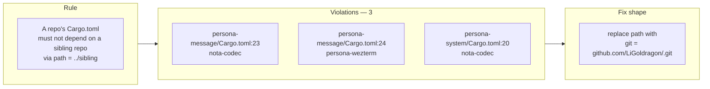

# 57 · Cross-repo `path = "../..."` audit — 2026-05-09

Status: workspace-wide audit of `Cargo.toml` files for
relative-path dependencies that cross repo boundaries.
Three violations in two repos. The rule already exists in
`lore/rust/style.md` but isn't enforced at the
workspace-skill layer — recommendations below.

Author: Claude (designer)

---

## 0 · TL;DR



| Outcome | Count |
|---|---:|
| Cargo.toml files scanned | 26 |
| Cross-repo `path = "../..."` deps found | 3 |
| Repos with violations | 2 (`persona-message`, `persona-system`) |
| Intra-repo `path = "..."` (legitimate) | 1 (`horizon-rs/Cargo.toml:6` — workspace member) |
| Flake.nix `path:..` violations | 0 |

---

## 1 · The rule

**A repo's `Cargo.toml` must not depend on another repo via
`path = "../<sibling>"`.** Cross-repo dependencies use
`git = "https://github.com/..."` (or a published crates.io
version).

### Why

`path = "../sibling"` makes the repo's build dependent on a
specific filesystem layout the consuming machine doesn't
control. Three concrete failures:

1. **Fresh clones don't reproduce.** A new machine cloning
   `persona-message` alone gets `cargo build` failing at
   *"could not find Cargo.toml at ../nota-codec"*. The repo
   isn't independently buildable — violating
   `skills/micro-components.md` §"Every component is
   independently buildable, testable, and replaceable.
   `cargo build` and `nix flake check` must succeed inside
   the component's own repo with no workspace-level
   helpers. If they don't, the boundary is a fiction."
2. **Cargo.lock drifts silently.** A `path` dep doesn't pin
   a revision in `Cargo.lock` — `cargo` resolves whatever
   the local sibling has at build time. Bytes shift under
   the build without leaving a trail. A `git = "..."` dep
   pins the rev in `Cargo.lock` and the build is
   reproducible.
3. **CI / `nix flake check` can't fetch.** Nix's build
   sandbox isolates from the host filesystem; a `path =
   "../..."` dep can't cross the sandbox boundary. The
   workspace's canonical CI surface (`nix flake check`)
   refuses to build.

The lore entry (`lore/rust/style.md:58`) already names this:

> Do NOT use `path = "../sibling-crate"` directly in a
> `Cargo.toml` — that assumes a layout that a fresh clone
> won't reproduce. Let the flake populate the paths.

The rule exists; the workspace skills don't surface it
prominently enough that operators scaffolding a new repo
catch the smell.

### What's still allowed — intra-repo workspace paths

A repo that is a Cargo *workspace* with multiple member
crates inside it can use `path = "lib"` / `path = "cli"` /
similar — the path stays *inside the repo's own directory
tree*. The signal is *no `..` in the path*. Intra-repo paths
travel with `git clone`; cross-repo paths don't.

Example (allowed):

```toml
# horizon-rs/Cargo.toml — repo root, internal workspace
[workspace]
members = ["lib", "cli"]

[workspace.dependencies]
horizon-lib = { path = "lib" }   # OK — intra-repo
```

Example (forbidden):

```toml
# persona-message/Cargo.toml
[dependencies]
nota-codec = { path = "../nota-codec" }   # WRONG — `..` crosses repo boundary
```

The discriminator: **does the path stay within the repo's
own working tree?** If yes, allowed. If `..` appears in the
path, forbidden.

---

## 2 · Violations found

Audit ran `find /git/github.com/LiGoldragon -maxdepth 3
-name Cargo.toml | xargs grep -nE 'path\s*=\s*"\.'`,
filtering target paths (`src/lib.rs`, `src/main.rs`, `src/bin/...`).

### 2.1 · `persona-message/Cargo.toml`

```toml
# Line 23
nota-codec      = { path = "../nota-codec" }
# Line 24
persona-wezterm = { path = "../persona-wezterm" }
```

Two violations. `persona-wezterm` is consumed *only* from
this Cargo.toml in the entire workspace — `persona-message`
is `persona-wezterm`'s sole consumer today.

### 2.2 · `persona-system/Cargo.toml`

```toml
# Line 20
nota-codec = { path = "../nota-codec" }
```

One violation. Same shape as `persona-message`'s line 23.

### 2.3 · No others

Sweep across all 26 Cargo.toml files in
`/git/github.com/LiGoldragon/` finds no other cross-repo
`path = "../..."` dependencies. Flake.nix files also clean
(no `path:..`, no `git+file://`).

---

## 3 · Concrete fixes

### 3.1 · `persona-message/Cargo.toml`

```diff
- nota-codec      = { path = "../nota-codec" }
- persona-wezterm = { path = "../persona-wezterm" }
+ nota-codec      = { git = "https://github.com/LiGoldragon/nota-codec.git" }
+ persona-wezterm = { git = "https://github.com/LiGoldragon/persona-wezterm.git" }
```

The workspace pattern (verified across signal, chroma,
nexus, persona, lojix-cli, chronos, signal-core,
horizon-rs) is `git = "https://github.com/LiGoldragon/<repo>.git"`
— either with no qualifier, or with `branch = "main"`. Match
the dominant form (no qualifier) for new edits.

After the edit, run `cargo build` to repopulate
`Cargo.lock` with the resolved git revs, then add an
`outputHashes` entry in `persona-message/flake.nix`'s
`cargoLock` block per `lore/rust/style.md` §"Git-URL deps
+ `cargoLock.outputHashes` pattern" — first `nix flake
check` will print the expected sha256 in the "hash
mismatch" error; copy it into the flake.

### 3.2 · `persona-system/Cargo.toml`

```diff
- nota-codec = { path = "../nota-codec" }
+ nota-codec = { git = "https://github.com/LiGoldragon/nota-codec.git" }
```

Same procedure for `cargoLock.outputHashes` in
`persona-system/flake.nix`.

### 3.3 · Pre-flight: ensure `persona-wezterm` is pushed

`persona-message` consumes `persona-wezterm` via path
today; switching to `git =` requires `persona-wezterm` have
a reachable `main` on GitHub. The workspace's symlink
indicates `persona-wezterm` exists at
`/git/github.com/LiGoldragon/persona-wezterm`; verify
`git -C /git/github.com/LiGoldragon/persona-wezterm log
--oneline -1` matches `git ls-remote
git@github.com:LiGoldragon/persona-wezterm.git HEAD` before
landing the persona-message edit.

If the local checkout has unpushed commits, push first;
otherwise the `persona-message` switch will pin against an
older rev than the local working tree.

---

## 4 · Where the rule should live

The rule exists in `lore/rust/style.md:58` and as a row in
`skills/contract-repo.md`'s common-mistakes table (line
461). Neither location is where an operator scaffolding a
new repo will look for the rule. Two places to surface it:

### 4.1 · `skills/micro-components.md` — primary home

The rule is exactly the cargo-side enforcement of
"independently buildable" (§4-§5 of micro-components.md).
A new section after §"How", titled
**"Cargo.toml dependencies — `git =`, never `path =
"../"`"** would surface the rule where the principle is
already named.

Suggested addition (~10 lines): name the rule, give the
allowed/forbidden examples, point at
`lore/rust/style.md` for the cargoLock.outputHashes
pattern.

### 4.2 · `skills/rust-discipline.md` — Rust-specific

`rust-discipline.md` already covers Cargo discipline
points (no anyhow/eyre, errors as enums, etc.) but doesn't
name the path-vs-git-dep rule. Add a short section under
§"One Rust crate per repo" pointing at micro-components.md
for the canonical rule and at `lore/rust/style.md` for the
toolchain mechanics.

### 4.3 · The existing `contract-repo.md` row stays

`skills/contract-repo.md:461` already has:

> | `path = "../contract"` in `Cargo.toml` | Local sibling
> reference | `git = "..."` with a tag, or a published
> crates.io version. Cross-crate `path = "../sibling"` is
> forbidden per ESSENCE §"Micro-components" |

Keep this row; the contract-repo skill cites
micro-components.md upstream.

---

## 5 · Local iteration without violating the rule

Operators sometimes want to iterate against a local clone
of a sibling crate before pushing. The committed Cargo.toml
must not change; the override goes in user-local config:

### Cargo's idiom — `.cargo/config.toml` (gitignored)

```toml
# .cargo/config.toml — NOT committed
[patch."https://github.com/LiGoldragon/nota-codec.git"]
nota-codec = { path = "/git/github.com/LiGoldragon/nota-codec" }
```

This makes `cargo build` resolve the git URL to the local
path *for this developer's machine only*. The committed
`Cargo.toml` still says `git = "https://..."` and reproduces
on every other machine.

This mirrors the nix-side override pattern documented in
`skills/nix-discipline.md` §"Iterating against a local
clone — `--override-input`":

| Layer | Committed | Local override |
|---|---|---|
| Cargo | `git = "https://..."` | `.cargo/config.toml` `[patch."..."]` |
| Nix flake | `url = "github:..."` | `nix flake lock --override-input <name> path:...` |

Both layers: committed = portable; local override =
fast-iteration; never invert.

---

## 6 · Why the rule slipped (likely)

`persona-message` and `persona-system` are recent
scaffolding (per `operator/52-naive-persona-messaging-implementation.md`,
the persona-message slice landed 2026-05-08). The local
`path = "../..."` form is what `cargo new` + working
locally produces by default; the operator was iterating
fast, the dep landed pre-push, and the rule that says
"swap to `git = ...` before committing" wasn't visible at
the operator's eye level (it lives in lore, in
contract-repo's deep mistakes table, and would have been
surfaced by `skills/micro-components.md` if that skill
named the cargo idiom directly).

This is a discoverability problem, not a discipline
problem. The fix is mechanical (3 edits) plus surfacing the
rule where operators scaffolding new repos will see it
(item 4.1).

---

## 7 · Recommendations — punch list

| # | Action | Owner | Effort |
|---|---|---|---:|
| 1 | Edit `persona-message/Cargo.toml` lines 23-24 (swap `path` → `git`); update `persona-message/flake.nix` `cargoLock.outputHashes` | operator | 30 min |
| 2 | Edit `persona-system/Cargo.toml` line 20 (same shape); update `persona-system/flake.nix` | operator | 20 min |
| 3 | Pre-flight: verify `persona-wezterm` is pushed to GitHub before editing item 1 | operator | 5 min |
| 4 | Add a §"Cargo.toml dependencies — `git =`, never `path = \"../\"`" section to `skills/micro-components.md` | designer | 20 min |
| 5 | Add a short pointer at `skills/rust-discipline.md` §"One Rust crate per repo" | designer | 10 min |
| 6 | Verify all consumer repos still build via `nix flake check` after items 1-2 | operator | check at landing |

Items 1-3 are the concrete fixes. Items 4-5 are the
discoverability fix that prevents reoccurrence.

Could land items 4-5 in this session (designer-shaped, small
edits); items 1-3 are operator's lane.

---

## 8 · See also

- `~/primary/skills/micro-components.md` §"Every component
  is independently buildable" — the principle the rule
  enforces.
- `~/primary/skills/contract-repo.md` §"Common mistakes"
  — the existing rule entry.
- `~/primary/skills/nix-discipline.md` §"Don't use
  `git+file://`" — the parallel rule for flake inputs.
- `~/primary/repos/lore/rust/style.md` §"Cross-crate
  dependencies" — the canonical lore reference + the
  `cargoLock.outputHashes` mechanics.
- `~/primary/reports/operator/52-naive-persona-messaging-implementation.md`
  — context for when the violations landed.

---

*End report.*
