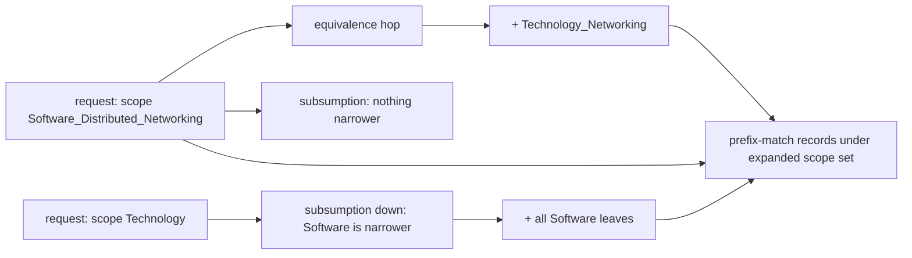

# Spirit next round — domain relations + remaining decisions (operator-implementable)

The implementation spec for the next round on `spirit`. Headline new mechanism: **domain
relations** (equivalence + subsumption over domain *scopes*, with query-expansion) — which
makes mis-filing retrieval-harmless and delivers "software is a kind of technology" as a
*retrieval relation* without structural nesting. Plus the specific overlap rulings, the
guardian-facing domain glosses, and the residual guardian-quality items. Grounded in the
current `origin/main` code (commit `c30bed3`), not memory.

This report is the contract; operator's implementation report responds to it. Wire forms
and expansion semantics below are binding; type representation is operator's call.

## 0. TL;DR

| # | Item | Kind | Status |
|---|---|---|---|
| 1 | **Domain scopes** — prefix matching (Area / Area·Cluster / Leaf) | foundation | new |
| 2 | **Domain relations** — equivalence (symmetric) + subsumption (directional) + query-expansion | new mechanism | new |
| 3 | **Overlap rulings** — the specific equate/subsume/delete calls for Technology↔Software etc. | vocabulary decision | new, needs psyche confirm |
| 4 | **Domain glosses** — per-scope one-line semantics feeding the guardian prompt | guardian enforcement | new, recommended |
| 5 | **Guardian residue** — few-shot block + retrieval completeness (equivalence-expanded) | 585 leftovers | partial |

Software stays a **top-level area** (decided: write-frequency wins — the most-tagged
domain must be the shortest to write; `0zi7` confirmed by the data, where ~79% of the
live store is software intent). Out of scope this round (deferred): the corpus-wide LLM
re-tag, the `kasm` re-file, and the 588 `INTENT.md` prose (designer-parallel). See §8.

## 1. What already landed (do not re-spec)

Operator built the bulk of reports 585–587 faithfully on `origin/main`. Verified:

- **Software branch** (`c30bed3`) — exact 587 tree, `Craft` cleaned to physical making.
- **Guardian gate + journal** (`5d47de6`, `18cb7f1`) — gates every live-arrow write;
  `guardian_journal.rs` is a *separate* `sema_engine` database (`guardian-decisions`);
  justified-mutation gating; one mechanism / two surfaces (record + referent verdicts).
- **Guardian judgment quality is already good** — `guardian.rs` pins
  `TemperatureMilli::new(0)` (both prompts), inlines the **closed rejection-reason set with
  per-reason definitions** in the prompt, and runs a **typed retry** that feeds the parse
  error back. So three of report 585's prompt fixes are *done*. What remains is §5.
- **Referent registry + referent guardian** (`fbf031a`) — runtime registry, gated.
- **Craft→Software migration** (`c30bed3`) — `production_migration.rs`, deterministic,
  tested. (Real blast radius: 2 records. See report 589.)

The current query surface this round extends:

```
DomainMatch [Any (Partial) (Full)]      ;; Partial/Full each wrap Domains = (Vec Domain)
Query   { DomainMatch keyword_match KeywordMatch text_match TextMatch
          referent_selection ReferentSelection kind (Optional Kind)
          privacy_selection PrivacySelection certainty_selection CertaintySelection
          importance_selection ImportanceSelection }
RecordSelection { DomainMatch kind (Optional Kind) }
Domain  [ (Health [...]) ... (Software [(Languages [...]) ... (Engineering [...])]) ... ]
```

`DomainMatch` matches **exact leaf `Domain` values** today. §2–§3 generalize that to
scopes and relation-expanded sets.

## 2. Domain scopes — prefix matching (the foundation)

A **`DomainScope`** is a *prefix* of a `Domain` at any of three depths — it matches every
domain beneath it:

| Scope depth | NOTA | Matches |
|---|---|---|
| Area | `Software` | every `(Software ...)` domain |
| Area·Cluster | `(Software Distributed)` | every `(Software (Distributed _))` leaf |
| Leaf | `(Software (Distributed Networking))` | exactly that domain |

A full leaf is just a maximal scope, so this generalizes leaf-matching rather than
replacing it. Scope matching is independently useful — "all `Software(Quality)` testing
intent" is one cluster scope instead of enumerating 19 leaves — and it is the substrate
relations expand over (§3).

**Spec:** generalize `Partial`/`Full` to carry `DomainScope`s rather than only full
`Domain` leaves. A record's `Domain` *matches a scope* iff the scope is a prefix of it.
`Partial` = matches any requested scope; `Full` = matches (a domain under) every requested
scope.

**Type modeling is operator's call.** Recommended shape: extract `AreaTag` and `ClusterTag`
as named enums (today they're inlined in `Domain`'s nesting) and define
`DomainScope [(AreaScope AreaTag) (ClusterScope { AreaTag * ClusterTag * }) (LeafScope Domain)]`.
Falsifiable wire examples to round-trip:

```
(Partial [Software])                              ;; all software intent
(Partial [(Software Quality)])                    ;; all software-quality intent
(Partial [(Software (Quality PropertyBasedTesting)) (Software (Languages Parsing))])
(Full    [(Software Security) (Software Data)])   ;; intent touching both clusters
```

## 3. Domain relations — equivalence + subsumption

Relations are **universal compiled vocabulary**, like the `Domain` enum itself — not a
runtime registry (that is referents). Per `uuh7` (recompile is cheap), they are authored as
NOTA data, emitted into a compiled relation table at build, and read by the query-expander
and the guardian. No new wire verb; relations live *inside* the query path.

### 3.1 The two relations

- **`Equivalence`** — a *symmetric* class of scopes that retrieve together. Querying any
  member returns records under all members. For subjects that are honestly dual.
- **`Subsumption`** — a *directional* broader→narrower link. Querying the broader scope
  also returns the narrower; the reverse does **not** hold. This is the is-a relation:
  `Software ⊂ Technology` means a `Technology`-scope query spans `Software`, while a
  `Software` query stays narrow. It gives the ontology as *retrieval* with zero structural
  nesting and zero write-cost on the dense branch.

### 3.2 The relation data (falsifiable NOTA)

```
[
  (Equivalence [(Technology Networking) (Software (Distributed Networking))])
  (Equivalence [(Information Database)   (Software (Data DatabaseSystems))])
  (Subsumption Technology Software)                    ;; area-scope is-a
  (Subsumption (Knowledge Computing) (Software Theory));; cluster/area is-a
]
```

`Equivalence` holds a vector of `DomainScope`s (the class). `Subsumption` holds two
`DomainScope`s: `(Subsumption <broader> <narrower>)`.

### 3.3 Expansion algorithm (applied in the SEMA query path, before matching)

Given the requested scope set `S` from `DomainMatch`:

1. **Equivalence closure (symmetric, single declared class — no chaining).** For each scope
   in `S`, add every scope sharing an `Equivalence` class with it. Declared classes are
   complete; do *not* compute transitive closure across classes.
2. **Subsumption closure (downward only, transitive).** For each scope in `S`, add every
   narrower scope reachable through `Subsumption` links whose broader side is `S`-or-already-added.
   Follow broader→narrower transitively (a `Subsumption` DAG); **never** narrower→broader.
3. **Match.** A record matches iff its `Domain` falls under any scope in the expanded set
   (prefix match, §2). For `Full`, each *originally requested* scope must be satisfied by
   the expanded set (expansion widens each requirement, it does not drop the AND).



### 3.4 Where it plugs in — two consumers, one mechanism

- **Observation / Count / Subscribe** — `DomainMatch` expands before the sema query plan
  runs. User retrieval becomes robust to which equivalent domain a record was filed under.
- **Guardian retrieval** — `guardian_records_for` expands the candidate's domain by the
  same relation closure when gathering the consistency bundle. This directly closes report
  585's **complete-retrieval correctness bug**: the guardian now sees records filed under
  *equivalent* domains, so it catches a duplicate or contradiction across the synonym
  boundary it would otherwise miss. One mechanism, both wins.

### 3.5 Discipline (so the taxonomy does not rot)

- Equivalence is for **genuine near-synonyms only**. Over-linking collapses 294-domain
  precision into synonym soup; discrimination is the whole point of the fine vocabulary.
- **No auto-transitivity** for equivalence; **downward-only** transitivity for subsumption.
- Relations make *retrieval* forgiving — they do **not** relieve the guardian of filing
  each record *somewhere*. They lower the stakes of that choice (close, not perfect).

## 4. Overlap rulings (the specific calls — psyche confirm)

With relations available, the default is **link, not delete**. Delete only pure redundancy.
Proposed rulings for the known overlaps:

| Overlap | Ruling | Why |
|---|---|---|
| `Technology(Intelligence)` vs `Software(Intelligence)` cluster | **Delete** `Technology(Intelligence)` | Pure redundancy — the `Software(Intelligence)` cluster (18 leaves) fully covers it; one name for one thing. |
| `Technology(Networking)` vs `Software(Distributed(Networking))` | **Equivalence** | Networking is honestly dual (physical link + protocol/software); keep both, retrieve together. |
| `Technology(Automation)` vs software automation | **Keep both, no link** | The hardware sense (industrial/robotic) and the software sense (`Software(Operations)`, CI) are *different subjects*, not synonyms — relations would wrongly merge them. The guardian + glosses arbitrate. |
| `Information(Database)` vs `Software(Data(DatabaseSystems))` | **Equivalence** | Records/library framing vs build-it framing of the same subject. |
| `Knowledge(Computing)` vs `Software(Theory)` | **Subsumption** `Knowledge(Computing) ⊃ Software(Theory)`? *or* keep separate | Science-as-knowledge vs theory-applied-in-building. Lean: keep both, optional subsumption so a `Knowledge(Computing)` sweep reaches applied theory. **Needs your call.** |
| `Software ⊂ Technology` (whole area) | **Subsumption** | Your "software is a kind of technology" — as retrieval, not nesting. A `Technology` sweep spans software; software stays top-level. |

The reading "`Technology` = physical/hardware tech" is then *enforced*, not hoped: by the
one deletion (no rival AI bin exists) and by the glosses (§5) the guardian reads — never by
convention alone. (Earlier framing in report 589 §open-item-2 used deletion; relations make
linking the gentler default and this table supersedes it.)

## 5. Domain glosses + guardian residue

### 5.1 Domain glosses (recommended — lever 2)

The `Domain` enum is bare variant names; the guardian has no machine-readable "what does
`Technology` mean" to judge domain-fit against. Add a compiled **gloss table** — one line
per area (and per cluster where useful) — that the guardian prompt-builder injects for the
candidate's domain(s) and their relation-neighbors:

```
[
  (Gloss Technology [physical and hardware technology: energy, power, machinery, robotics, materials, instrumentation, aerospace. NOT software, which is its own area])
  (Gloss Software   [building software: languages, systems, data, security, quality, operations, surfaces, engineering])
  (Gloss (Information Database) [records/library framing of data; the build-it framing is Software(Data)])
]
```

Bare names cannot be enforced; described domains can. Same compiled-vocabulary pattern as
the relations (NOTA source → const table). This is what lets the guardian hold the
Technology-vs-Software line on the residue relations do not cover (e.g. `Automation`).

### 5.2 Guardian residue from 585 (the leftovers)

Three prompt fixes already landed (temp-0, inlined reason set, typed retry — §1). Remaining:

- **Few-shot block** — curate ~6–12 real accept / reject / clarify-trample / supersede
  examples (from the `guardian_journal` once it has volume, or hand-picked now) into the
  prompt. Highest remaining judgment-quality lever; no training infra.
- **Retrieval completeness + equivalence-expansion** — verify `guardian_records_for`
  retrieves a *complete* bundle (not category-only), cap/rank it, and **equivalence-expand**
  per §3.4. This is the 585 correctness item; relations are the fix.

## 6. Falsifiable spec (round-trip + behavior tests)

Operator's seam is these tests (designer can land the wire round-trips in the contract
crate's `tests/`):

1. **Scope round-trips** — each `(Partial [...])` / `(Full [...])` in §2 encodes→decodes
   stable through NOTA + rkyv.
2. **Relation data round-trips** — the §3.2 block round-trips.
3. **Equivalence expansion** — a record filed `(Technology Networking)` is returned by a
   query for scope `(Software (Distributed Networking))`, and vice versa.
4. **Subsumption direction** — a `Software(...)` record is returned by a `Technology`-scope
   query; a `Technology(Energy)` record is **not** returned by a `Software`-scope query.
5. **No-chaining** — equivalence does not leak across two classes sharing a member.
6. **Guardian completeness** — with `(Technology Networking)` and an equivalent
   `(Software (Distributed Networking))` duplicate in the store, proposing the second is
   `Reject Duplicate` (the guardian saw the first via expansion).

## 7. Decisions for the psyche

1. **Overlap rulings (§4 table)** — confirm or adjust, especially `Knowledge(Computing)` ↔
   `Software(Theory)` (subsume vs keep-separate) and `Automation` (keep-both-unlinked).
2. **Glosses in scope this round (§5.1)?** My lean: yes — they are what makes "Technology =
   hardware" enforceable rather than folklore, and they are cheap.
3. **Subsumption symmetry per link** — confirm `Software ⊂ Technology` is one-way (a
   `Technology` sweep pulls software, not the reverse). My lean: yes, one-way.

## 8. Out of scope this round (deferred)

- **Corpus-wide semantic re-tag** — ~1400 records mis-filed under `(Information
  Documentation)` / `(Governance Policy)`; needs an LLM/guardian pass. *Deferred per psyche
  (2026-06-11).* Relations soften the need: equivalence/subsumption mean a generically-filed
  record can still be reachable if its generic home is linked to the precise one — worth a
  later pass adding a few `(Information Documentation) ⊃ Software(...)`-style links, but not now.
- **`kasm` and Craft-software re-file** — folds into the deferred re-tag.
- **588 `INTENT.md` prose** (`spirit/INTENT.md` domain+referent+guardian; `nota-next`
  camelCase) — designer-owned, lands on a designer `next` branch; not operator's core.

## 9. Net

This round is additive and self-contained: scopes (§2) → relations (§3) → the rulings that
use them (§4) → glosses + guardian residue (§5). It needs no new wire verb (relations are
compiled vocabulary) and it resolves the last open *design* question (the overlap) while
making the domain boundary enforced by structure, not convention. The secrets/key-handling
work in flight on the `agent` daemon is a separate component thread (operator/system-operator)
and is intentionally not folded in here.
