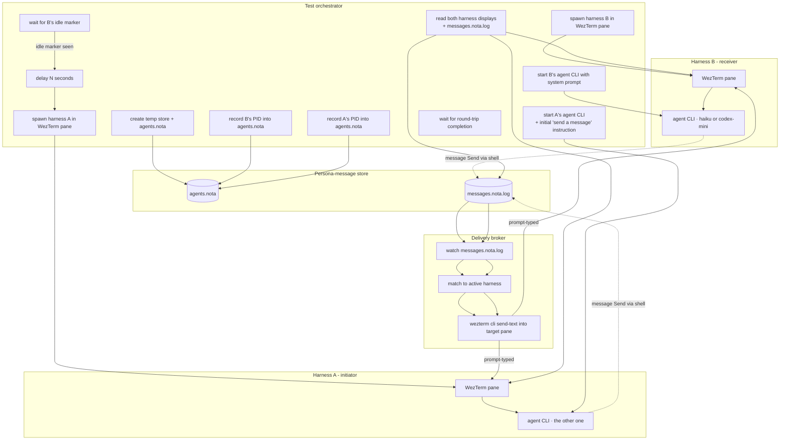
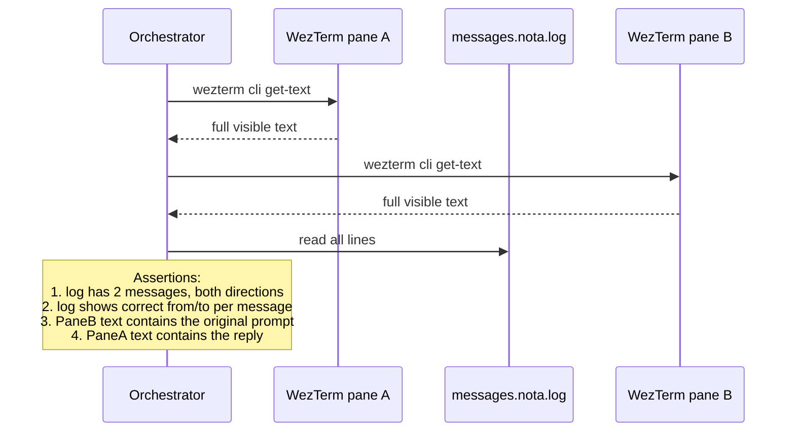
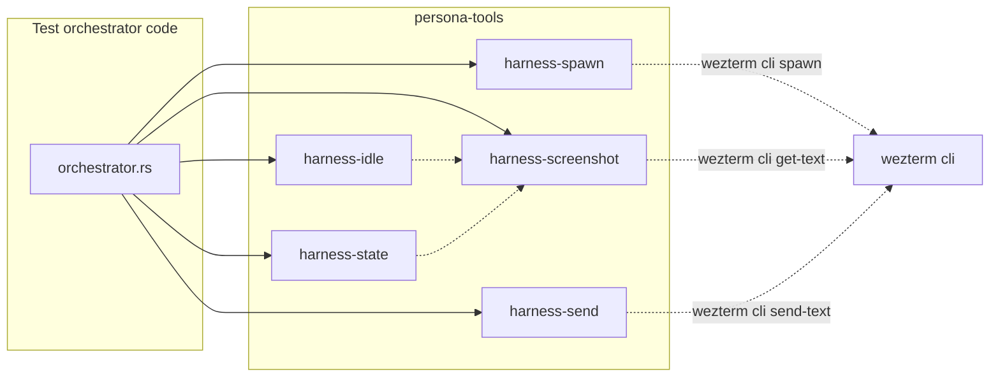
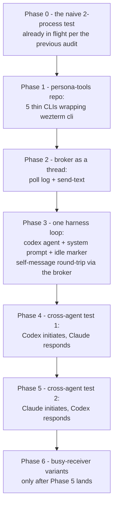

# Real-harness test architecture — designer's read

Date: 2026-05-07
Author: Claude (designer)

The operator is currently implementing real-harness WezTerm
integration tests for persona-message based on the user's
instruction. This report captures **my own read** of what the
test architecture should look like — flowcharts + the
load-bearing pieces — so the design intent has a second
articulation alongside the operator's implementation.

I am not editing persona-message while the operator is
working in it; this report is conceptual.

---

## What the user asked for, in one paragraph

After the naive `(Send recipient body)` round-trip works,
extend the prototype with **two real-harness tests** that wire
two cheap-and-fast LLM CLIs together: Codex on `gpt-5.4-mini`
(minimal effort) and Claude on `haiku-4.5` (minimal effort).
Both spin up *idling*. One sends "hi, reply please"; the other
receives it like a prompt injection (Gas City style — even if
they were busy, the message would land and be addressed
later); the receiver replies; the initiator sees the reply.
Verification reads each harness's terminal display. The agent
*receivers* must not know the sender's name in advance — that
proves the message tool is stamping identity, not the user.

A `persona-tools` repo carries the debugging affordances
(harness screenshot, idle detection, terminal-control wrappers)
so the eventual harness adapters can lift them.

---

## The big picture



Five distinct roles. Each is independently a "thing"; together
they make the test work.

---

## The five load-bearing pieces

### 1. Test orchestrator

Owns the temp-store, the agents.nota config, the spawn
ordering, and the verification step. Concretely:

- **Temp store**: `tempfile::tempdir()` for `PERSONA_MESSAGE_STORE`.
- **Agents config**: `agents.nota` written incrementally — a
  new line per harness as it spawns, capturing its PID.
- **Spawn order**: receiver first, then a delay, then
  initiator. The delay is what gives the receiver time to
  finish loading and reach the idle marker.
- **Idle marker handshake**: see §"The idle problem" below.
- **Verification**: read both panes' `wezterm cli get-text`
  output; assert the receiver's display contains the initial
  message; assert the initiator's display contains the reply.

### 2. Harness substrate (WezTerm panes)

Each agent runs inside its own WezTerm pane. WezTerm gives the
test framework four affordances we need:

- `wezterm cli spawn` — spawn a new pane with a known process.
- `wezterm cli send-text` — type bytes into a pane (the
  prompt-injection primitive).
- `wezterm cli get-text` — read what's currently visible in
  the pane (the screenshot/observation primitive).
- Pane IDs are stable for the session.

The pane is the harness's "terminal." The agent CLI runs
inside it. The user types into it via `send-text`. The test
reads from it via `get-text`. This is the cleanest available
substrate for a single-host headless test.

### 3. Delivery broker

The broker is the missing piece between "message appended to
log" and "message lands in receiver's terminal as a prompt."

The broker is a small process — probably a thread inside the
test orchestrator, not a separate binary — that:

1. Tails `messages.nota.log` (poll every ~200 ms).
2. For each new line, decodes the `Message` record.
3. Looks up `message.to` in `agents.nota` to find the target
   harness's WezTerm pane id.
4. Formats the message into a one-line user-style prompt:
   ```
   [from operator] hi, reply please
   ```
5. Calls `wezterm cli send-text --pane-id <target> '<formatted>'`
   followed by an Enter keystroke.
6. The agent CLI in that pane sees the line as user input.

This is the persona-message *broker* in miniature — the
production version is the reducer + harness adapter; this
version is a 50-line poll-and-inject loop in the test setup.

The mechanism answers the user's "even if the agent was busy"
question: WezTerm's send-text *types* the bytes. If the agent
is mid-token, the bytes go into its terminal's input buffer
and the agent CLI reads them on its next user-input cycle.
Most agent CLIs queue input rather than discarding mid-turn —
which is exactly the "I'll address it later" behavior the
user described.

### 4. Agent system prompts (the training)

Each agent boots with a system prompt that teaches it:

- **Who it is.** The actor name (`operator` or `designer`,
  the role names already used elsewhere). The agent doesn't
  need to know the *other* actor's name — that comes in
  through messages.
- **The message format.** How to invoke `message`:
  `message '(Send <recipient> "<body>")'`. The agent learns to
  shell out to the binary.
- **The receive shape.** Messages arrive in the agent's
  terminal as `[from <name>] <body>` lines. The agent
  recognises that pattern and extracts the sender's name to
  reply.
- **The idle marker.** When the agent has finished loading
  and is ready to receive, it prints a known token to its
  terminal — e.g. `<<READY>>`. The orchestrator polls for that
  via `get-text` and considers the harness idle once it
  appears.
- **The reply contract.** When the agent receives a message
  asking for a reply, it sends one via `message` to the named
  sender. Then prints `<<DONE>>` (or similar) so the
  orchestrator knows verification can proceed.

These are five teachable items. They fit in a short system
prompt — under a page.

### 5. Verification

After the round-trip:



Three layers of evidence — the log (durable record of what
crossed the boundary), the receiver's display (proof the
prompt arrived as a prompt), the initiator's display (proof
the reply propagated back). All three should agree.

---

## The idle problem

"Idle" in the user's sense: *not in the process of generating
tokens; doing nothing waiting for a prompt.* Two options:

- **Marker-based** (recommended). The agent's system prompt
  instructs: "when you finish loading, print `<<READY>>` on a
  line by itself." The orchestrator polls `get-text` until the
  marker appears, then considers the harness idle. After each
  reply, the agent prints `<<DONE>>`. Cheap, deterministic,
  works regardless of substrate.
- **Output-stillness-based**. Watch the pane's content; if the
  text hasn't changed for N seconds, assume idle. Brittle —
  long thinking pauses look the same as idle; doesn't survive
  variable model speeds.

Use marker-based. The output-stillness approach is a
last-resort fallback if the agent CLI strips or hides print
statements (it shouldn't).

---

## The "agent doesn't know the sender's name" requirement

The user wants the receiving agent to learn the sender from
the message itself, not from out-of-band knowledge. Concretely:

- Agent A's system prompt names recipient `designer` (or just
  "the other agent").
- Agent B's system prompt does **not** name the sender — only
  "you may receive messages from other agents; reply to
  whomever sent the message you receive."

This is what proves the binary's stamping is load-bearing. If
B's system prompt named A, the test would still pass even if
the binary forgot to set `from`. By withholding A's name,
the test forces B to extract it from the injected message
text.

The injected format `[from operator] body` makes the
extraction trivial. B reads `[from operator]`, replies with
`message '(Send operator "got it")'`. The binary stamps `from
designer` via process-ancestry, the broker delivers to A's
pane, A sees `[from designer] got it`. Symmetry holds.

---

## persona-tools — what should live there

The user's suggestion to make this a separate repo is the
right move. Persona-tools is the *debug-toolkit* that the
production harness adapters will eventually subsume. Putting
it in its own repo lets it grow without dragging the test
substrate into persona-message.

Initial contents:

- `harness-spawn <name> <command>` — start an agent in a
  WezTerm pane, capture pid+pane-id, return both.
- `harness-screenshot <pane-id>` — call `wezterm cli get-text`
  and return the result.
- `harness-send <pane-id> <text>` — `wezterm cli send-text`
  + Enter.
- `harness-idle <pane-id> <marker>` — block until the marker
  appears in the pane's text.
- `harness-state <pane-id>` — return Idle / Busy / Loading
  based on most-recent marker seen.

Each is a thin Rust binary that wraps `wezterm cli` and adds
a small typed contract. Together they're the building blocks
of the test orchestrator. When the production persona daemon
gains a real WezTerm adapter, these binaries become library
functions in that adapter.



If a future test substrate replaces WezTerm with portable-pty
(the durable design from the operator's terminal-research
report), only the wezterm-cli leaves change; the orchestrator
keeps the same five contract verbs.

---

## The two tests, end-to-end

Both share the same orchestrator scaffolding. Differs in the
agent role mapping.

### Test 1: Codex initiates → Claude responds

```mermaid
sequenceDiagram
    participant T as Test orchestrator
    participant Cl as Claude (haiku-4.5)<br/>actor=designer
    participant Br as Broker
    participant Cx as Codex (gpt-5.4-mini)<br/>actor=operator

    T->>Cl: spawn pane, set system prompt:<br/>"you are designer; await message; reply"
    Cl-->>T: <<READY>>
    Note over T: delay 5s
    T->>Cx: spawn pane, set system prompt:<br/>"you are operator; send 'hi, reply please'<br/>to designer"
    Cx-->>T: <<READY>>
    Cx->>Br: message (Send designer "hi, reply please")
    Br->>Cl: send-text [from operator] hi, reply please
    Cl->>Br: message (Send operator "got it")
    Br->>Cx: send-text [from designer] got it
    Cx-->>T: <<DONE>>
    T->>T: assert log + both panes
```

### Test 2: Claude initiates → Codex responds

Same as Test 1 but with the agents swapped. Roles in the
agents.nota config swap accordingly:

```nota
;; test 1
(Agent operator <codex-pid>)
(Agent designer <claude-pid>)

;; test 2
(Agent operator <claude-pid>)
(Agent designer <codex-pid>)
```

This proves the test passes regardless of which agent is
sender vs receiver, and regardless of which model implements
each role.

### The third and fourth tests (later)

The user mentioned "I guess we need four tests, but start with
two." My read: the second pair is the **busy-receiver case**
— the receiver is given some long-running task (e.g. "count
to 100 slowly") so it's *not* idle when the message arrives.
Tests that prompt-injection lands and the agent acknowledges
it later, instead of being lost.

Skip for now; come back when the idle case is solid.

---

## Open decisions for the operator

Things the operator will hit while implementing — flagging so
the conversation is faster when they hit them:

1. **Where does the broker live?** A thread inside the test
   orchestrator (simplest), or a separate `persona-message-brokerd`
   binary (more like the production shape)? I'd lean thread
   for the prototype; rename later.
2. **How does an agent's system prompt get delivered?** As a
   `--system` flag to the CLI? As a file the CLI reads at
   startup? Depends on each CLI's contract. Codex and Claude
   Code have different surfaces.
3. **What's the exact marker text?** `<<READY>>` and
   `<<DONE>>` are placeholders. The actual choice should not
   collide with anything the agent might say in normal output.
   Using clearly artificial tokens (`{{persona-test-ready}}`)
   reduces collision risk.
4. **What about a per-message ack from the broker?** When the
   broker injects, should it record an `Observed` line in the
   log? My read: no — keep the broker dumb for the prototype;
   add observation records when the production reducer lands.
5. **What if `wezterm cli get-text` returns terminal escape
   sequences?** Strip them before assertion (or use a
   `--escapes=none` flag if WezTerm has one).
6. **WezTerm vs Tmux substrate.** Operator's lock says
   WezTerm. Stick with that; the substrate is interchangeable
   if needed.

---

## What I'd do differently if I were the operator

The instruction the user gave is rich but sprawling. If I
were implementing, I would split the work like this:



Each phase has a runnable artifact and a clear acceptance
criterion. Phase 3 is the hinge: once one agent can
self-message via the broker, the cross-agent tests are minor
extensions.

The phases that are most likely to surprise:

- **Phase 1** — the wezterm CLI surface has rough edges
  (escape sequences, pane-id assignment, sometimes a fresh
  pane needs a moment before it's introspectable).
- **Phase 3** — the agent CLI's system prompt mechanism varies
  between Codex and Claude. Expect to read each tool's manual
  for that.
- **Phase 6** (busy variant) — depends on the agent CLI's
  input-buffering behavior. If the CLI swallows mid-turn input,
  the test framework may need to wait until the agent's output
  pauses before re-injecting.

---

## What I'd flag explicitly

- **The user said: "make sure they're working and ready to be
  audited because we're going to check to make sure that
  they're doing what I asked them to do."** That's the
  acceptance bar. The orchestrator's verification step needs
  to be honest about what it asserts — log contents, pane
  contents, idle markers, both directions. Don't skip a
  verification step because "the agent might phrase it
  differently"; assert what's structurally guaranteed (the
  log records, the marker tokens) and only loosely match the
  free-form reply text.
- **The user said: "you can create yourself a bunch of tools,
  toolkit, like a persona tools for debugging."** That's
  permission to factor out the substrate wrappers as a
  separate repo. Use it.
- **"Eventually use these components."** persona-tools should
  be designed assuming production adapters will lift it. Don't
  hardcode assumptions that only work for tests (e.g.
  `tempfile`-based paths in the public API; embed test-only
  helpers behind `#[cfg(test)]`).

---

## See also

- `~/primary/reports/designer/4-persona-messaging-design.md`
  — the broader design that this prototype is a stepping
  stone toward.
- `~/primary/reports/operator/2-terminal-harness-control-research.md`
  — the operator's substrate-research report; covers WezTerm,
  Kitty, portable-pty, ttyd, layered-observation model.
- `lojix-cli/src/request.rs` — the canonical Nota CLI shape
  the message binary follows.
- this workspace's `skills/version-control.md`,
  `skills/autonomous-agent.md` — apply during implementation.
